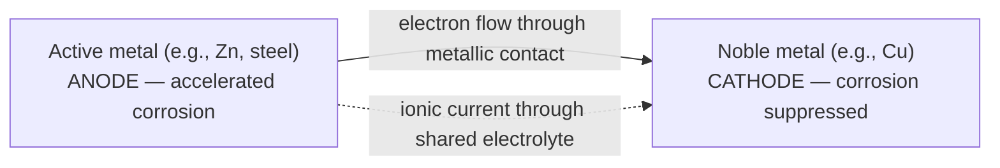
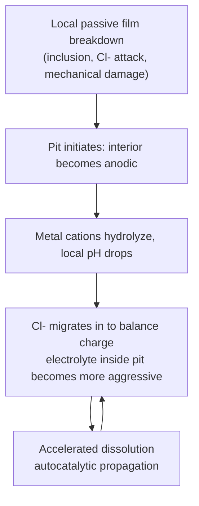
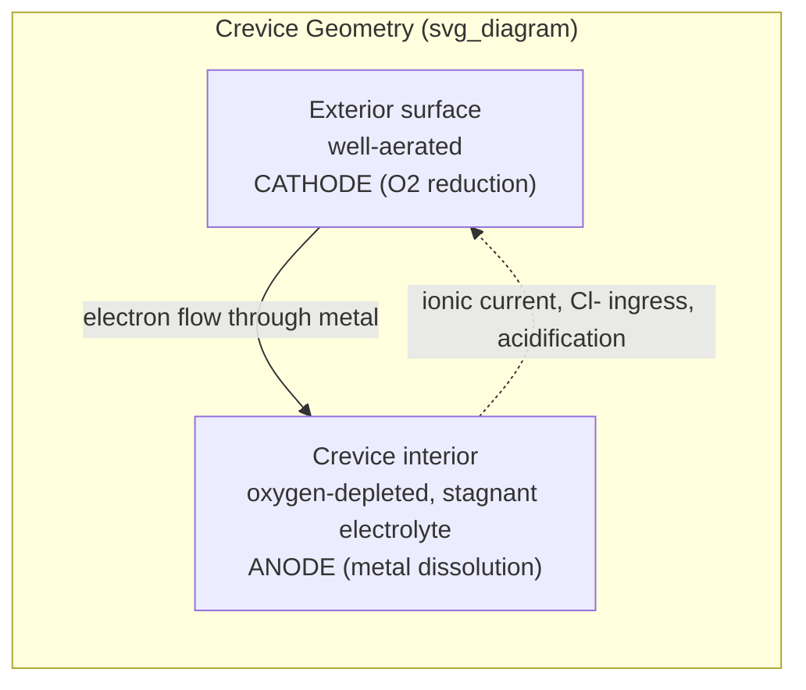

## Uniform, Galvanic, Pitting, and Crevice Corrosion

### Overview

These four corrosion forms are commonly grouped because each is explainable through the electrochemical cell framework, but they differ fundamentally in the spatial distribution of anodic and cathodic sites — from fully distributed (uniform) to sharply localized (pitting). Distribution matters more than total metal loss: a low mass-loss-rate localized attack can penetrate a wall thickness and cause failure long before a much higher uniform corrosion rate would.

### Uniform (General) Corrosion

**Key Points**

- Anodic and cathodic reactions occur essentially randomly and continuously over the entire exposed surface, with the sites constantly shifting in location over time
- Produces relatively uniform thinning of the metal, with a roughly predictable rate over time
- The most common form of corrosion in terms of total tonnage of metal destroyed, but the least dangerous in engineering terms because it is predictable and can be designed around
- Typical examples: rusting of unprotected steel in the atmosphere, tarnishing of silver, atmospheric weathering of most structural metals

**Mechanism**: At any instant, microscopic anodic and cathodic sites exist across the surface (driven by minor compositional or microstructural heterogeneity), but because these sites are numerous, small, and constantly relocating, the net effect averages into uniform material loss rather than a fixed, deep localized attack.

**Quantification**: Uniform corrosion is typically measured by weight-loss coupons and expressed as corrosion penetration rate (CPR):

$$CPR = \frac{K \cdot W}{\rho \cdot A \cdot t}$$

where $K$ is a unit constant, $W$ is mass loss, $\rho$ is density, $A$ is exposed area, and $t$ is exposure time. Because the rate is predictable, uniform corrosion is manageable via **corrosion allowance** (added wall thickness in design), coatings, cathodic protection, and inhibitors.

### Galvanic Corrosion

**Key Points**

- Occurs when two dissimilar metals (or a metal and an electrically conductive non-metal, such as carbon fiber composite) are in electrical contact within the same electrolyte
- The more active (less noble) metal becomes the anode and corrodes preferentially; the more noble metal becomes the cathode and is protected relative to its uncoupled corrosion rate
- Requires all four elements of the corrosion cell: dissimilar electrode potentials, electrical continuity, and a shared electrolyte — removing any one (e.g., an insulating gasket breaking electrical continuity) stops galvanic action

**Governing factors**:

- **Relative position in the Galvanic Series** (practical, environment-specific ranking, as opposed to the theoretical EMF series) determines direction and approximate driving force
- **Area ratio effect**: a small anode area coupled to a large cathode area produces intense, rapidly penetrating attack on the anode because the same total anodic current is concentrated into a small area (high local current density); the reverse pairing (large anode, small cathode) produces comparatively mild, diffuse attack
- **Distance effect**: galvanic attack is typically most severe near the junction between the two metals and diminishes with distance from it, following the current distribution and solution resistance path
- **Electrolyte conductivity**: higher conductivity electrolytes (seawater) spread galvanic current over a wider area and can increase total attack; low-conductivity electrolytes concentrate attack very close to the junction

**Example**: A carbon steel pipe fitting joined to a copper pipe in a plumbing system corrodes preferentially at the steel, especially just adjacent to the joint, because steel is anodic to copper in most aqueous environments.

**Mitigation approaches**: electrical isolation (dielectric unions/washers/gaskets), avoiding unfavorable area ratios (never use a small fastener of the active metal), applying coatings preferentially to the noble metal (a coating flaw on the noble member turns a large cathode into a small one, minimizing damage; the reverse — coating only the active anode — is far riskier, since any holiday in that coating creates a very unfavorable small-anode/large-cathode condition), and use of sacrificial anodes or inhibitors.

### Pitting Corrosion

**Key Points**

- Highly localized attack producing cavities (pits) that penetrate at a much higher rate than the surrounding surface, on metals that rely on a passive film for corrosion resistance (stainless steels, aluminum, nickel alloys, titanium)
- One of the most insidious and destructive forms of corrosion because it produces small mass loss but can rapidly perforate a component, and pits are difficult to detect visually
- Strongly promoted by aggressive anions, particularly **chloride** ($Cl^-$), which locally disrupts the passive film at susceptible sites (inclusions, second-phase particles such as MnS in stainless steel, mechanical damage, compositional heterogeneity)

**Mechanism**:

1. **Initiation**: local breakdown of the passive film at a susceptible site, occurring when the local potential exceeds the material's **pitting potential** ($E_{pit}$) in that environment
2. **Propagation**: once initiated, the pit interior becomes anodic (active dissolution) while the surrounding passive surface remains cathodic — an extremely unfavorable small-anode/large-cathode area ratio that sustains rapid local penetration
3. **Autocatalytic acidification**: metal cations hydrolyze within the pit ($M^{n+} + H_2O \rightarrow MOH^{(n-1)+} + H^+$), lowering local pH; chloride ions migrate into the pit to balance the accumulating positive charge, further concentrating the aggressive electrolyte and accelerating dissolution — this positive-feedback loop is why pits, once started, tend to keep growing rather than self-arrest

**Key parameters**:

- **Pitting potential ($E_{pit}$)**: above this potential, stable pit growth occurs; determined experimentally via potentiodynamic polarization
- **Protection potential ($E_{prot}$ or repassivation potential)**: below this potential, existing pits repassivate and do not propagate further; typically $E_{prot} < E_{pit}$, and the gap between them relates to pit stability
- **Pitting Resistance Equivalent Number (PREN)**, used to rank stainless steel/nickel alloy resistance to pitting:

$$PREN = \%Cr + 3.3(\%Mo) + 16(\%N)$$

[Inference] The PREN formula and its coefficients are an empirical correlation developed primarily for austenitic and duplex stainless steels; it provides a useful comparative ranking but does not by itself guarantee pitting performance in a specific service environment, since factors like surface finish, welding heat input, and actual chloride/temperature combination also strongly affect real-world pitting resistance.

**Mitigation**: alloy selection with higher PREN for chloride-containing service, avoiding surface damage/embedded iron contamination (which creates local galvanic sites), maintaining low chloride concentration and temperature where possible, and use of inhibitors.

### Crevice Corrosion

**Key Points**

- Localized attack occurring within confined, shielded geometries — gasket faces, bolted lap joints, under deposits or fouling organisms, under washers — where a small volume of stagnant electrolyte is trapped
- Mechanistically closely related to pitting (both are localized, both involve chloride and autocatalytic acidification), but crevice corrosion initiates through a differential aeration mechanism rather than requiring random passive-film breakdown, and it typically initiates at less aggressive potentials than open-surface pitting — i.e., crevice corrosion is generally the more easily initiated of the two

**Mechanism**:

1. Within the crevice, oxygen is rapidly consumed by the initial (slow, general) corrosion reaction and cannot be replenished by diffusion because the geometry restricts electrolyte exchange with the bulk environment
2. The crevice interior, now oxygen-depleted, can no longer sustain the cathodic oxygen-reduction reaction, so it becomes net anodic relative to the freely-aerated exterior surface, which continues to support oxygen reduction and thus becomes the cathode
3. This is a **differential aeration cell**: identical metal, but a potential difference arises purely from local oxygen concentration
4. As in pitting, cation hydrolysis and chloride ingress into the crevice progressively acidify and concentrate the trapped electrolyte, sustaining and accelerating attack

**Susceptible geometries**: gasketed flanges, threaded connections, lap joints, under bolt heads/washers, beneath surface deposits, marine biofouling, and crevices formed by poorly designed weld details.

**Mitigation**: design to eliminate crevices where possible (welded rather than bolted/riveted joints, full-penetration welds, sloped/self-draining surfaces to prevent deposit accumulation), use of non-absorbent gasket materials, periodic cleaning to remove deposits, and specifying materials with adequate PREN/crevice corrosion resistance for the service chloride level and temperature.

### Comparative Summary

| Form | Localization | Driving Mechanism | Typical Susceptible Materials | Primary Design Control |
| --- | --- | --- | --- | --- |
| Uniform | None (distributed) | Randomly shifting micro-anodes/cathodes | Carbon steel, most non-passivating metals | Corrosion allowance, coatings |
| Galvanic | At/near dissimilar-metal junction | Electrode potential difference between coupled metals | Any dissimilar-metal joint | Electrical isolation, area ratio control |
| Pitting | Point sites on passive surface | Local passive film breakdown + autocatalytic acidification | Stainless steels, Al, Ni alloys, Ti | Alloy PREN selection, chloride/temperature control |
| Crevice | Shielded/occluded geometry | Differential aeration + autocatalytic acidification | Same as pitting-susceptible alloys | Design to eliminate crevices, gasket selection |

### Related Topics

- Intergranular Corrosion and Sensitization
- Stress Corrosion Cracking and Corrosion Fatigue
- Erosion-Corrosion and Cavitation Damage
- Cathodic Protection Systems (sacrificial anode vs. impressed current)
- Alloy Design for Chloride-Rich Service (superaustenitic and superduplex stainless steels)
- Corrosion Testing Standards (ASTM G48 for pitting/crevice resistance, ASTM G71 for galvanic testing)
- Passive Film Chemistry and Repassivation Kinetics