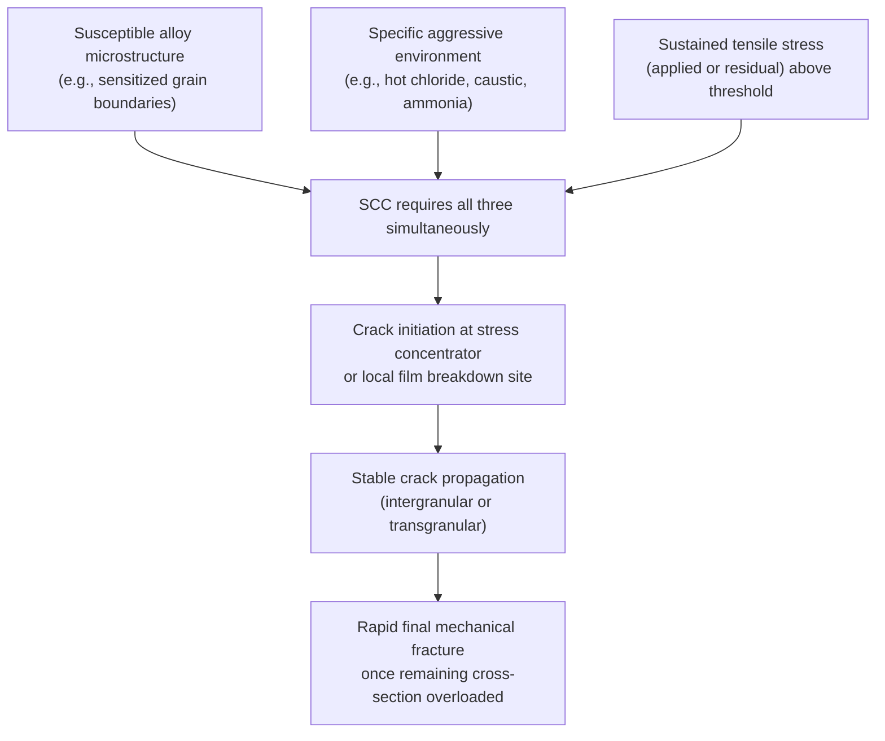
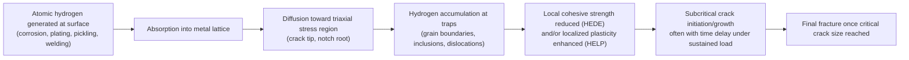

## Stress Corrosion Cracking and Hydrogen Embrittlement

### Overview

Both stress corrosion cracking (SCC) and hydrogen embrittlement (HE) are environmentally assisted cracking phenomena: a susceptible alloy, in a specific environment, under sustained tensile stress (applied or residual), develops and propagates cracks at stress levels well below what would cause failure in the environment's absence or under short-term loading. Both are especially dangerous because they can produce macroscopically brittle failure in otherwise ductile alloys, often with little visible surface attack or warning, and total mass loss is negligible relative to the structural consequence.

### Stress Corrosion Cracking (SCC)

**Key Points**

- Requires the simultaneous presence of three factors: a susceptible alloy, a specific corrodent (environment), and sustained tensile stress above a threshold — removing any one of the three generally prevents SCC
- Produces brittle-appearing fracture surfaces even in normally ductile alloys, with crack propagation that can be intergranular (along grain boundaries) or transgranular (through grains), depending on the alloy-environment system
- Classic alloy-environment pairs are highly specific: a given alloy may be immune in most environments but severely susceptible in one particular species combination

**Classic alloy–environment systems**:

- Austenitic stainless steels (300 series) in hot chloride solutions
- Brasses (Cu-Zn alloys) in ammonia-containing environments ("season cracking")
- Carbon and low-alloy steels in hot caustic (NaOH) solutions ("caustic embrittlement") and in nitrate solutions
- High-strength aluminum alloys (7xxx, 2xxx series) in chloride/humid environments, often along short-transverse grain orientation
- Titanium alloys in red fuming nitric acid, methanol, or hot salt environments
- Nickel-based alloys in high-temperature caustic or polythionic acid environments

**Mechanisms**: Two principal, non-mutually-exclusive mechanistic models are generally invoked, and the dominant mechanism can be alloy-environment specific:

1. **Anodic dissolution / active path corrosion**: localized, stress-assisted dissolution occurs preferentially along an anodic path (e.g., a sensitized grain boundary, or a path where a protective film is continuously ruptured by strain and cannot fully re-passivate). The crack tip remains anodic relative to the crack walls and surrounding surface, sustaining sharp, stress-concentrated advance.
2. **Film-induced cleavage / mechanical fracture assistance**: a brittle surface film (e.g., a dealloyed layer or oxide) forms at the crack tip; under stress, this brittle film cracks, and the cleavage-like fracture propagates briefly into the underlying ductile metal before blunting, with the process repeating incrementally.

[Inference] For many systems (e.g., austenitic stainless steel in chlorides), it is understood that both film rupture/repassivation kinetics at the crack tip and localized plasticity contribute, and the relative contribution of each mechanism remains an active area of mechanistic research rather than a single settled model applicable to every alloy-environment pair.

**Crack morphology**: SCC cracks are typically highly branched, thin, and often invisible without magnification or NDT techniques (dye penetrant, radiography), distinguishing them from fatigue cracks (typically single, less branched, with beach marks) on fractography.

**Threshold stress intensity ($K_{ISCC}$)**: SCC propagation, once a crack exists, is often characterized using fracture mechanics. $K_{ISCC}$ is the threshold stress intensity factor below which subcritical crack growth by SCC does not occur in a given alloy-environment system; above it, crack growth proceeds until $K$ reaches $K_{IC}$ (fracture toughness) and rapid fracture occurs. This is analogous in form to fatigue's threshold $\Delta K_{th}$, but driven by sustained load and chemical environment rather than cyclic loading.

**Mitigation approaches**:

- Reducing tensile stress: stress-relief heat treatment, shot peening (introduces beneficial compressive residual stress), design changes to reduce stress concentration
- Material selection: choosing alloys/tempers/microstructures known to resist the specific service environment (e.g., avoiding sensitized austenitic stainless steel in chloride service by using low-carbon "L-grade" or stabilized grades)
- Environmental control: reducing corrodent concentration, temperature, or removing the specific aggressive species (e.g., dechlorination, deaeration)
- Cathodic protection: can be effective for some anodic-dissolution-mechanism SCC systems, but [Inference] cathodic protection must be applied carefully in systems also susceptible to hydrogen embrittlement, since overprotection (excessively negative potential) can generate hydrogen at the metal surface and shift the failure mode toward hydrogen-assisted cracking instead

### Hydrogen Embrittlement (HE)

**Key Points**

- Caused by atomic hydrogen entering the metal lattice (typically at a free surface, from corrosion reactions, electroplating, pickling, welding, or cathodic charging) and diffusing to regions of high triaxial stress (e.g., ahead of a crack tip or notch), where it degrades local fracture resistance
- Unlike SCC, HE does not necessarily require an external corrosive environment at the time of failure — hydrogen can be introduced during manufacturing (e.g., acid pickling, electroplating) and remain latent, causing delayed failure hours to weeks later under sustained load, with no visible environmental attack
- Most severe in high-strength steels (particularly above roughly 1000–1400 MPa tensile strength, though the susceptibility threshold is alloy-dependent), but also affects titanium alloys, and to a lesser extent nickel-based alloys and some other systems

**Sources of hydrogen**:

- Cathodic reaction of general or localized corrosion in acidic or near-neutral environments: $2H^+ + 2e^- \rightarrow H_2$ (atomic H forms transiently and can be absorbed before recombining to $H_2$ gas)
- Electroplating and electroless plating processes
- Acid pickling and descaling operations
- Welding (moisture in flux/electrode coatings, or hydrocarbon contamination) — a principal cause of **hydrogen-induced cold cracking** in weld heat-affected zones
- Cathodic protection systems that are overly negative (potential more negative than needed shifts the surface reaction toward hydrogen evolution)
- Sour service (H₂S-containing oil and gas environments) — sulfide poisons the hydrogen recombination reaction at the metal surface, increasing the fraction of atomic hydrogen absorbed rather than recombining to $H_2$ gas, which is why H₂S environments are disproportionately severe for HE relative to their corrosivity alone

**Mechanisms** (multiple models exist and are not universally agreed to apply identically across all alloy systems):

1. **Hydrogen-Enhanced Decohesion (HEDE)**: dissolved hydrogen atoms reduce the cohesive bonding strength between metal atoms (particularly at grain boundaries or ahead of a crack tip where triaxial stress concentrates hydrogen via lattice dilation), leading to brittle, low-energy fracture at a lower applied stress than would otherwise be required.
2. **Hydrogen-Enhanced Localized Plasticity (HELP)**: dissolved hydrogen increases dislocation mobility locally, concentrating plastic deformation into narrow bands and promoting localized, low-toughness fracture rather than the more diffuse ductile deformation seen without hydrogen.

[Inference] Current understanding treats HEDE and HELP as potentially complementary rather than strictly competing mechanisms, with the dominant contribution varying by alloy, hydrogen concentration, and stress state; this remains an active research area rather than a fully resolved question.

**Hydrogen trapping**: hydrogen preferentially accumulates ("traps") at microstructural heterogeneities — grain boundaries, dislocations, inclusions, carbide interfaces, and voids. Trap strength and density influence both the total hydrogen a microstructure can absorb and how readily that hydrogen can be removed by baking treatments; this is why tempering/microstructure control is a primary lever for HE resistance in high-strength steels.

**Delayed failure**: a hallmark of classical HE is the **incubation time** between hydrogen charging (or load application) and visible cracking/failure — distinguishing it operationally from immediate overload fracture and from most SCC, where crack initiation is typically less delayed once the three SCC conditions are met.

**Mitigation approaches**:

- **Baking/de-embrittlement heat treatment**: low-temperature bake (commonly in the range of roughly 190–220 °C for several hours, per applicable specification such as ASTM F519 or AMS 2759) shortly after plating or pickling operations, to diffuse absorbed hydrogen out of the part before it reaches damaging concentrations at stress risers
- **Process control**: minimizing hydrogen pickup during pickling/plating (inhibited acids, controlled plating chemistry/current density), and using mechanical descaling in lieu of acid pickling for highly susceptible high-strength parts where feasible
- **Material/hardness selection**: specifying lower hardness/strength levels where design allows, since susceptibility to HE generally increases with increasing strength/hardness in a given steel family
- **Cathodic protection control**: avoiding overprotection (excessively negative potentials) on high-strength steel structures in seawater or soil, since this actively generates hydrogen at the metal surface
- **Sour service material qualification**: selecting steels and controlling hardness per standards such as NACE MR0175/ISO 15156 for H₂S-containing service

### Distinguishing SCC from Hydrogen Embrittlement

| Aspect | Stress Corrosion Cracking | Hydrogen Embrittlement |
| --- | --- | --- |
| Requires active corrosion at time of cracking | Generally yes (ongoing anodic dissolution or film rupture) | Not necessarily — hydrogen may be pre-existing from manufacturing |
| Typical crack path | Intergranular or transgranular, alloy/environment specific | Often intergranular or along prior-austenite grain boundaries in steels |
| Time dependency | Initiation and growth both environmentally driven | Classic "delayed failure" after load/hydrogen charging, then rapid |
| Reversibility | Generally not reversible once initiated | Can sometimes be arrested/reversed by baking out hydrogen before cracking initiates |
| Cathodic protection effect | Can help (some systems) or harm (if hydrogen-sensitive) | Generally harmful if overprotection generates hydrogen |
| Primary susceptible alloys | Broad range: stainless steels, brasses, Al alloys, Ti alloys, steels | Predominantly high-strength steels, also Ti alloys |

[Inference] In practice, distinguishing the two mechanisms in a failure analysis can be difficult because both can produce intergranular fracture and both are stress- and environment-dependent; fractographic features, hydrogen analysis of the fracture surface, service history, and metallurgical condition (hardness, microstructure) are typically all considered together rather than relying on a single diagnostic criterion.

### Related Topics

- Fracture Mechanics: Fracture Toughness ($K_{IC}$) and Threshold Stress Intensity
- Sensitization of Austenitic Stainless Steels and Intergranular Corrosion
- Fatigue and Corrosion Fatigue
- Sour Service Metallurgy and NACE MR0175/ISO 15156
- Residual Stress Control: Shot Peening, Stress Relief Heat Treatment
- Hydrogen Diffusion and Trapping Theory in Steels
- Failure Analysis and Fractography Techniques