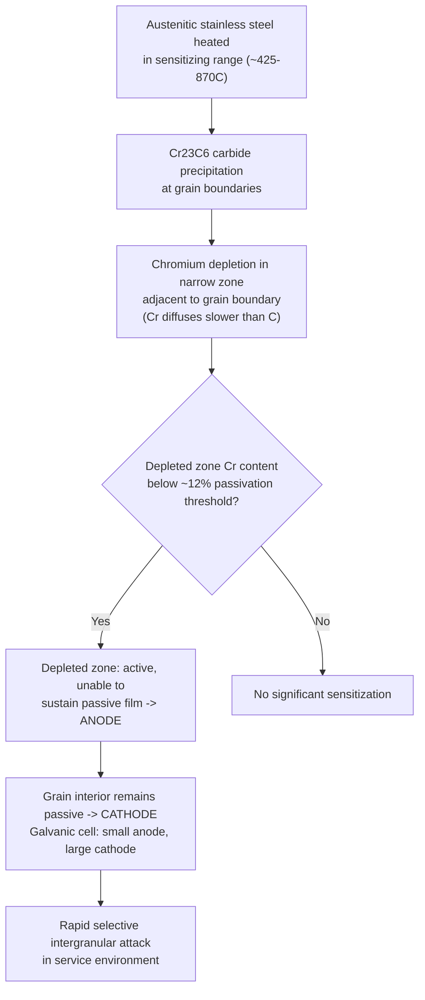
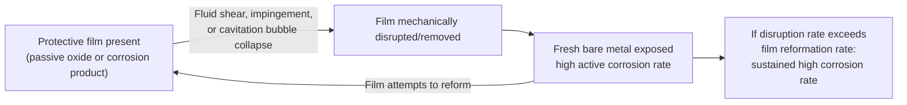

## Intergranular and Erosion Corrosion

### Overview

Intergranular corrosion and erosion-corrosion are mechanistically unrelated to each other — one is a microstructure-driven electrochemical attack, the other a mechanically-assisted electrochemical attack — but both are grouped here as localized corrosion forms distinct from simple uniform attack. Intergranular corrosion exploits a chemical heterogeneity created at grain boundaries during processing; erosion-corrosion arises from the synergistic combination of fluid mechanical action and electrochemical dissolution.

### Intergranular Corrosion (IGC)

**Key Points**

- Preferential corrosive attack along or immediately adjacent to grain boundaries, while the grain interiors (matrix) remain largely unattacked
- Can proceed with minimal visible surface change while severely degrading mechanical integrity, since the network of attacked grain boundaries can cause grains to separate ("sugaring") or produce a path for crack propagation
- Arises from a compositional difference between the grain boundary region and the grain interior — most commonly a **depletion** of a corrosion-resisting element at the boundary, though enrichment of a deleterious phase at the boundary can also be responsible

**Sensitization mechanism in austenitic stainless steels** (the classic and most heavily studied case):

1. When austenitic stainless steel (e.g., Type 304) is held in, or slowly cooled through, the sensitizing temperature range (approximately 425–870 °C / 800–1600 °F) — as occurs during welding (in the heat-affected zone) or improper annealing — chromium combines with carbon to precipitate **chromium carbides** ($Cr_{23}C_6$) at grain boundaries
2. Because chromium diffuses slowly in austenite relative to carbon, the carbide precipitation locally depletes chromium from the narrow adjacent grain boundary zone faster than bulk chromium can diffuse in to replenish it
3. If the chromium content in this depleted zone falls below approximately 12% (the threshold generally required to sustain a stable passive film), that zone becomes anodic relative to the still chromium-rich, passive grain interior
4. A galvanic cell (large passive cathode = grain interior, small active anode = depleted zone) forms, producing selective, often rapid, intergranular attack in corrosive environments (this is sometimes called **weld decay** when it occurs specifically in the heat-affected zone of a weld)

**Knife-line attack**: a related, narrower-zone variant seen in stabilized stainless steels (Ti- or Nb-stabilized grades, e.g., 321, 347) where a very thin region immediately adjacent to the weld fusion line is heated high enough to dissolve the stabilizing carbides (TiC, NbC) but is then reheated (in a subsequent weld pass or stress-relief treatment) into the sensitizing range without adequate time/temperature to re-precipitate the stabilizing carbides preferentially over chromium carbides.

**Detection and evaluation**: standardized susceptibility tests include:

- **ASTM A262 Practice A** (oxalic acid etch test — rapid screening, identifies step, dual, or ditch microstructure)
- **ASTM A262 Practice E** (Strauss test — boiling copper sulfate/sulfuric acid, bend test)
- **ASTM A262 Practice C** (Huey test — boiling nitric acid, mass-loss based)

**Mitigation approaches**:

- **Low-carbon ("L") grades**: e.g., 304L, 316L, with carbon content held below approximately 0.03%, limiting the amount of carbide that can precipitate
- **Stabilized grades**: alloying with titanium (Type 321) or niobium/columbium (Type 347), which preferentially form stable TiC or NbC carbides at higher temperature, tying up carbon before chromium carbide precipitation can occur during subsequent lower-temperature exposure
- **Solution annealing**: heating above approximately 1040 °C and rapidly quenching redissolves existing carbides and prevents reformation, restoring a uniform chromium distribution
- **Controlled welding practice**: minimizing time spent in the sensitizing range (heat input control, interpass temperature control) for susceptible grades

[Inference] Beyond chromium-carbide sensitization in austenitic stainless steels, analogous chromium-depletion or precipitate-driven intergranular attack mechanisms occur in other alloy systems (e.g., certain nickel-based superalloys, aluminum alloys via grain-boundary precipitates such as $Al_2Cu$ or $MgZn_2$), but the specific depleted/enriched species and susceptible temperature ranges differ by alloy family and should be evaluated per the relevant alloy specification rather than assumed to mirror the stainless steel case.

### Erosion-Corrosion

**Key Points**

- Accelerated material degradation resulting from the combined, synergistic action of relative motion between a corrosive fluid (or fluid carrying suspended solids/bubbles) and the metal surface, together with the underlying electrochemical corrosion reaction
- Combined attack rate is typically greater than the sum of erosion alone plus corrosion alone acting independently — the mechanical action continuously removes or disrupts protective films (passive oxide, corrosion product scale) that would otherwise reduce the corrosion rate, exposing fresh reactive metal repeatedly
- Characteristically produces surface features aligned with local flow direction: grooves, waves, rounded holes, and horseshoe-shaped (crescent) pits pointing in the direction of flow, often concentrated at points of flow disturbance (bends, tees, sudden diameter changes, weld root protrusions, valve seats)

**Mechanism of the synergy**:

1. A protective film (passive oxide layer or adherent corrosion product) that would normally limit corrosion rate by acting as a diffusion barrier is mechanically removed or thinned by fluid shear stress, impinging particles, or cavitating bubble collapse
2. The freshly exposed, film-free metal corrodes at a much higher rate (closer to the bare-metal active dissolution rate) than the film-covered surface
3. If flow conditions continuously or repeatedly strip the reforming film before it can mature to a protective thickness, the surface is kept in this high-corrosion-rate condition indefinitely, rather than the corrosion rate decaying over time as it typically would under stagnant conditions

**Contributing/subordinate forms**:

- **Cavitation erosion-corrosion**: driven by the formation and violent collapse of vapor bubbles in a low-pressure region of flowing liquid (e.g., pump impellers, propellers, valve downstream faces); bubble collapse generates highly localized, extremely high transient pressures/microjets that mechanically damage the surface and any protective film, producing characteristic rough, pitted surface morphology
- **Impingement attack**: caused by a fluid stream (often carrying entrained air bubbles, water droplets in steam, or solid particles) striking the surface at a point or along a line, common at pipe elbows, tube inlets (heat exchanger tube-end erosion), and orifice downstream faces
- **Fretting corrosion**: a related but distinct phenomenon arising from small-amplitude oscillatory relative motion between two contacting surfaces under load (rather than a flowing fluid), producing localized wear debris that oxidizes and further abrades the contact — mechanistically adjacent to erosion-corrosion but driven by mechanical fretting rather than fluid flow

**Susceptible systems and locations**: heat exchanger and condenser tubing (especially at tube inlets, in copper alloys and admiralty brass), pump impellers and casings, propellers, pipe elbows and reducers, boiler feedwater piping, control valve trim, and slurry-handling equipment.

**Mitigation approaches**:

- **Velocity control**: designing/operating below the alloy's critical velocity threshold beyond which the protective film cannot be maintained (critical velocity is alloy- and fluid-specific)
- **Flow path design**: eliminating sharp direction changes, sudden area reductions, and other geometry that produces flow disturbance, turbulence, or impingement; using long-radius bends and adequately sized piping
- **Material selection**: harder, more erosion-resistant alloys, or alloys forming more mechanically robust/adherent protective films (e.g., certain copper-nickel alloys for seawater service, or hardened/coated surfaces at high-wear locations)
- **Cavitation avoidance**: adequate net positive suction head (NPSH) margin on pumps, avoiding excessive pressure drops across valves
- **Removal of entrained solids/air**: filtration, deaeration, and slurry velocity/geometry control to reduce particulate and bubble content
- **Protective coatings or hard facing** at known high-wear locations (tube inlets, impeller vanes)

### Comparative Notes

| Aspect | Intergranular Corrosion | Erosion-Corrosion |
| --- | --- | --- |
| Root cause | Microstructural/compositional heterogeneity at grain boundaries | Fluid mechanical film disruption + electrochemical attack |
| Driven primarily by | Heat treatment / thermal history (e.g., welding, sensitization) | Fluid velocity, turbulence, entrained solids/bubbles |
| Visual surface indication | Often minimal until advanced (may show "sugaring") | Characteristic directional grooves, horseshoe pits |
| Primary mitigation lever | Alloy chemistry/stabilization, heat treatment control | Flow velocity/geometry control, material hardness |
| Common susceptible alloys | Austenitic stainless steels (sensitized), some Ni/Al alloys | Copper alloys, carbon steel, any passive-film-dependent alloy in high-velocity/particulate service |

### Related Topics

- Weldability and Heat-Affected Zone Metallurgy of Stainless Steels
- Passivity and Passive Film Chemistry
- Stress Corrosion Cracking and Hydrogen Embrittlement
- Cavitation Damage and Pump/Propeller Design
- Corrosion Testing Standards (ASTM A262, A763 for ferritic stainless steels)
- Fretting Fatigue and Fretting Wear
- Heat Exchanger Tube Material Selection (admiralty brass, copper-nickel, titanium)