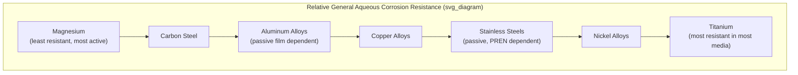

## Corrosion Behavior of Specific Metals and Alloys

### Overview

While the preceding topics establish general electrochemical and mechanistic frameworks, actual corrosion resistance is highly alloy-specific: composition, microstructure, and processing history determine which forms of corrosion an alloy is susceptible to, and in which environments. This section surveys the corrosion behavior of the major engineering alloy families.

### Carbon and Low-Alloy Steels

**Key Points**

- Have no significant inherent passivity in most aqueous environments; corrosion resistance depends almost entirely on external protection (coatings, cathodic protection) or environmental control (inhibitors, dry storage)
- Predominantly susceptible to **uniform corrosion** in atmospheric, freshwater, and soil environments, governed largely by oxygen availability (cathodic reaction) and moisture/electrolyte presence
- Also susceptible to specific localized forms depending on environment: **caustic embrittlement** (SCC) in hot alkaline solutions (notably a historical problem in riveted boilers), **hydrogen embrittlement** in high-strength tempered/quenched conditions combined with hydrogen sources (pickling, plating, sour service), and general corrosion acceleration in acidic or chloride-rich soils

**Weathering steels** (e.g., ASTM A588/A242, containing small additions of Cu, Cr, Ni, P) form a dense, adherent, protective rust patina under cyclic wet-dry atmospheric exposure that significantly slows further corrosion relative to plain carbon steel — but this protective patina only develops properly with alternating wetting and drying; in marine, industrial, or continuously wet/humid environments, the patina remains loose and non-protective, and weathering steel can corrode as fast as or faster than plain carbon steel. [Inference] The suitability of weathering steel is therefore environment-dependent rather than universal, and it is generally not recommended for coastal/marine atmospheres or locations subject to persistent moisture.

### Stainless Steels

**Key Points**

- Corrosion resistance derives from a thin, self-healing chromium-oxide-rich passive film, requiring a minimum of approximately 10.5–12% chromium by mass
- Behavior differs significantly across the major structural classes (ferritic, austenitic, martensitic, duplex, precipitation-hardening), driven by crystal structure, alloying, and typical carbon content

| Class | Representative Grades | Key Corrosion Characteristics |
| --- | --- | --- |
| Ferritic | 430, 446 | Good general/oxidation resistance; more limited pitting/crevice resistance than austenitic (lower Mo typical); susceptible to 475°C embrittlement and sigma-phase formation at elevated temperature affecting toughness |
| Austenitic | 304, 316, 321, 347 | Excellent general corrosion resistance; susceptible to chloride pitting/crevice and chloride SCC; sensitization risk in standard-carbon grades unless stabilized (321, 347) or low-carbon (304L, 316L) |
| Martensitic | 410, 420, 440C | Lower general corrosion resistance (lower Cr, higher C than austenitic/ferritic); primarily selected for hardness/strength; susceptible to hydrogen embrittlement in high-hardness tempers |
| Duplex | 2205, 2507 (super duplex) | Mixed austenite-ferrite microstructure gives high strength plus SCC resistance generally superior to austenitic grades in chloride service; PREN typically higher than standard austenitics |
| Precipitation-hardening | 17-4PH, 15-5PH | Corrosion resistance broadly comparable to martensitic/lower-end austenitic grades depending on aging condition; susceptible to hydrogen embrittlement in higher-strength (lower aging temperature) conditions |

**Molybdenum** additions (in grades such as 316, 317, and duplex/super-duplex alloys) substantially improve resistance to chloride pitting and crevice corrosion, reflected in the PREN formula. **Nitrogen** additions similarly improve pitting resistance and are used particularly in duplex and super-austenitic grades.

### Aluminum and Aluminum Alloys

**Key Points**

- Corrosion resistance relies on a thin, naturally forming, tenacious aluminum oxide ($Al_2O_3$) passive film that reforms almost instantly if damaged in most neutral environments
- Passive film is stable over a relatively narrow pH range (roughly 4–9 depending on alloy and solution); aluminum corrodes readily in strongly acidic or strongly alkaline solutions, where the oxide is soluble
- Susceptibility to localized attack varies strongly by alloy series (temper and alloying element strongly influence behavior):
  - **1xxx (pure Al), 3xxx (Al-Mn), 5xxx (Al-Mg)**: generally good general corrosion resistance; 5xxx alloys with higher magnesium content and certain non-optimal tempers/thermal histories can be susceptible to sensitization-like intergranular attack and SCC via magnesium-rich ($\beta$-phase, $Mg_2Al_3$) grain boundary precipitation
  - **2xxx (Al-Cu)**: comparatively poor general corrosion resistance due to copper-rich intermetallic precipitates ($Al_2Cu$) that are locally cathodic to the surrounding matrix, promoting intergranular attack and pitting; frequently used clad with a purer aluminum layer (Alclad) for corrosion protection in aerospace applications
  - **6xxx (Al-Mg-Si)**: generally good corrosion resistance, widely used in structural and architectural applications
  - **7xxx (Al-Zn-Mg-Cu)**: highest-strength aluminum alloys, but among the most SCC-susceptible, particularly in the short-transverse grain direction and in peak-aged (T6) tempers; overaging (T73, T76 tempers) trades some strength for substantially improved SCC resistance

**Galvanic considerations**: aluminum is quite active (anodic) relative to most other structural metals (steel, copper, stainless steel), making galvanic coupling a major practical concern in mixed-metal assemblies — aluminum fasteners/fittings in contact with more noble metals corrode rapidly, especially with an unfavorable small-anode/large-cathode area ratio.

### Copper and Copper Alloys

**Key Points**

- Generally good corrosion resistance in many freshwater, atmospheric, and mildly acidic environments, forming protective films of cuprous oxide ($Cu_2O$) and, over long atmospheric exposure, the characteristic green patina (basic copper carbonates/sulfates)
- **Dezincification** is a characteristic selective-leaching corrosion form specific to brasses (Cu-Zn alloys), particularly higher-zinc brasses (e.g., yellow brass, ~30–40% Zn): zinc is selectively and preferentially dissolved from the alloy, leaving behind a porous, mechanically weak, copper-rich residual structure with little dimensional change but drastically reduced strength; commonly occurs in stagnant, low-velocity, or brackish water service
  - Occurs in two morphological forms: **plug-type** (localized, deep) and **layer-type** (uniform, shallower)
  - Mitigated by using dezincification-resistant brasses alloyed with small amounts of arsenic, antimony, or phosphorus (inhibited brasses, e.g., "DZR brass"), or by selecting alloys with lower zinc content (red brass) or alternative alloys (cupronickel) for the service
- **Ammonia-induced SCC ("season cracking")**: brasses under residual or applied tensile stress are susceptible to intergranular SCC in the presence of ammonia or amine-containing environments/atmospheres; historically named for brass cartridge cases cracking in storage in ammonia-contaminated (stable manure) atmospheres
- **Erosion-corrosion**: copper alloys, particularly admiralty brass and aluminum brass used in heat exchanger and condenser tubing, are susceptible to erosion-corrosion/impingement attack at tube inlets under high water velocity; copper-nickel alloys (90-10, 70-30 CuNi) offer substantially improved erosion-corrosion resistance for seawater service due to a more mechanically robust protective film

### Titanium and Titanium Alloys

**Key Points**

- Exceptional general corrosion resistance across a very broad range of environments (seawater, oxidizing acids, chlorides) due to an extremely stable, thin, tenacious titanium oxide ($TiO_2$) passive film that reforms essentially instantly if damaged
- Notably immune to seawater pitting and crevice corrosion under normal service temperature ranges — a key advantage over stainless steels in marine and chemical process applications
- Principal susceptibilities are relatively narrow and application-specific rather than broad:
  - **Hydrogen embrittlement**: titanium alloys can absorb hydrogen (from cathodic protection overprotection, galvanic coupling to more active metals, or process environments), forming brittle titanium hydrides that reduce ductility and fracture toughness
  - **Crevice corrosion at elevated temperature**: while immune to crevice attack near ambient temperature, titanium can become susceptible in hot (typically above roughly 70–80°C, alloy dependent), concentrated chloride-containing crevice environments
  - **SCC in specific aggressive media**: notably in red fuming nitric acid, anhydrous methanol (particularly with trace halide contamination), and certain hot salt environments at elevated temperature (relevant to aerospace applications)
- [Inference] Because titanium's passive film is so robust, its rare failure modes tend to be associated with specific, often unusual service conditions (particular chemical media, elevated temperature, or hydrogen sources) rather than the general aqueous environments that govern most other alloy families' corrosion behavior.

### Nickel-Based Alloys

**Key Points**

- Broadly excellent corrosion resistance across a wide range of aggressive environments, particularly reducing acids (hydrochloric, sulfuric) and high-temperature service, with specific alloy families tailored to particular environments
- **Alloy 400 (Monel, Ni-Cu)**: excellent resistance to hydrofluoric acid and seawater, including good resistance to seawater flow-induced erosion-corrosion
- **Alloy 600/625 (Ni-Cr-Mo/Fe)**: good high-temperature oxidation resistance and general corrosion resistance; Alloy 625 in particular offers strong pitting/crevice resistance in chloride and sour environments due to high Mo and Nb content
- **Hastelloy family (Ni-Mo, Ni-Mo-Cr)**: developed specifically for resistance to reducing acids (hydrochloric, sulfuric, phosphoric) where stainless steels are inadequate
- **Susceptibility to polythionic acid SCC**: sensitized (aged/precipitation-affected) nickel-chromium alloys and austenitic stainless steels used in high-temperature sulfur-containing service (e.g., petroleum refining, catalytic reforming units) can suffer intergranular SCC during shutdown when polythionic acids form from residual sulfur compounds reacting with air and moisture — mitigated by sensitization control, alkaline washing before shutdown, or use of stabilized/low-carbon grades

### Magnesium Alloys

**Key Points**

- Among the most electrochemically active (anodic) common structural metals, placing magnesium at high galvanic risk when coupled to virtually any other structural metal
- Poor inherent aqueous corrosion resistance relative to other structural alloys; highly sensitive to trace heavy-metal impurities (iron, nickel, copper) in the alloy, which act as efficient local cathodic sites and can dramatically accelerate galvanic micro-corrosion within the alloy itself — this is why high-purity magnesium alloys (with tightly controlled Fe, Ni, Cu limits) show substantially better corrosion resistance than standard-purity grades
- Almost universally requires protective coatings (chromate conversion coatings historically, or chromate-free alternatives increasingly used for environmental/regulatory reasons) for structural service in humid or wet environments
- Widely used as a **sacrificial anode material** for cathodic protection precisely because of its high activity, particularly in soil and freshwater applications (zinc and aluminum-based anodes are generally preferred in seawater due to more favorable efficiency/driving-voltage characteristics there)

### Comparative Passivity Summary

[Speculation] This ordering reflects typical behavior in neutral, near-ambient aqueous/atmospheric environments; the relative ranking can shift substantially for specific aggressive media (e.g., nickel alloys and titanium can outperform or underperform each other depending on whether the environment is oxidizing or reducing, and stainless steel can rank below aluminum in some strongly reducing acid environments), so this diagram should be read as a general heuristic rather than a fixed ranking applicable to every service condition.

### Related Topics

- Sensitization and Intergranular Corrosion (detailed mechanism)
- Stress Corrosion Cracking and Hydrogen Embrittlement (alloy-environment systems)
- Galvanic Series and Practical Alloy Coupling Guidelines
- Alloy Selection Standards (NACE MR0175/ISO 15156 for sour service, ASTM material specifications)
- Cathodic Protection: Sacrificial Anode Material Selection (Mg, Zn, Al)
- Weldability and Heat-Affected Zone Behavior by Alloy Family
- Coatings and Surface Treatments for Corrosion Protection