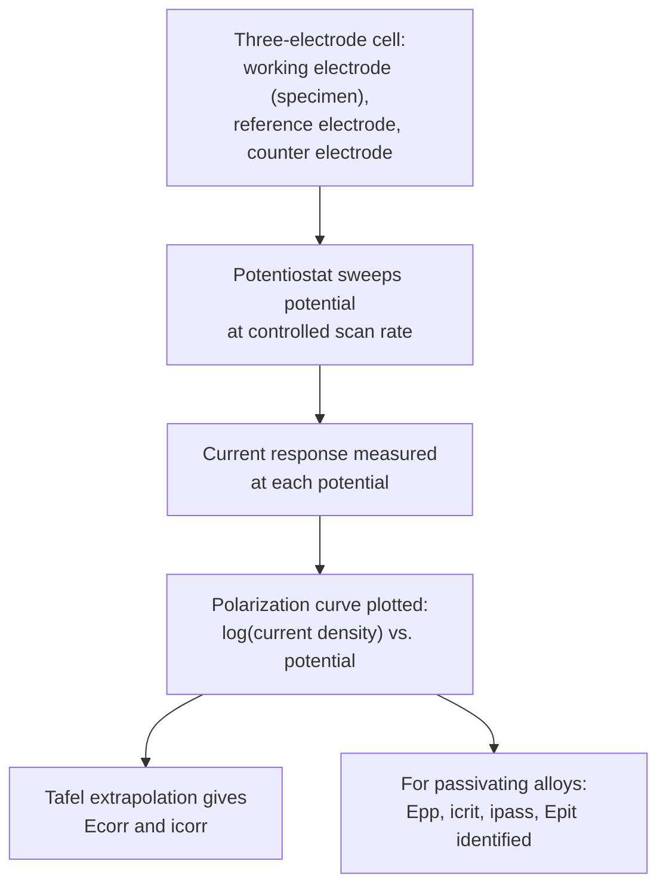
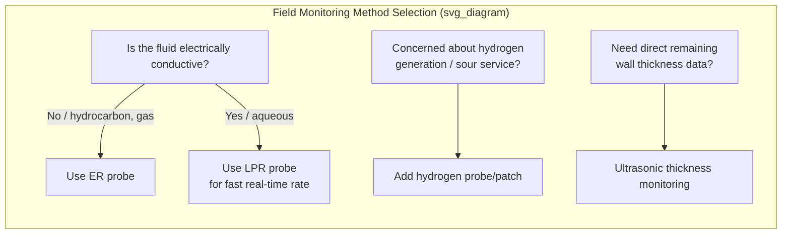

## Corrosion Testing and Monitoring

### Overview

Corrosion testing and monitoring encompass the laboratory methods used to evaluate material susceptibility before service and the field techniques used to track corrosion rate and detect damage during service. The two serve different purposes: laboratory testing supports material selection and qualification against a specification, while field monitoring supports operational integrity management, inspection scheduling, and early warning of upset conditions.

### Weight-Loss (Gravimetric) Testing

**Key Points**

- The most fundamental corrosion test method: a pre-weighed coupon of known area is exposed to the environment of interest for a defined period, then cleaned of corrosion product and reweighed
- Corrosion rate is calculated from the mass loss using the standard corrosion rate formula:

$$CR = \frac{K \cdot W}{A \cdot T \cdot \rho}$$

where $CR$ is corrosion rate, $K$ is a constant depending on desired units (e.g., mils per year, mm per year), $W$ is mass loss, $A$ is exposed area, $T$ is exposure time, and $\rho$ is density.

- Governed by standards such as **ASTM G1** (preparation, cleaning, and evaluation of corrosion test specimens) and **NACE/ASTM G31** (laboratory immersion testing)
- Advantages: simple, low-cost, directly measures actual mass loss with no electrochemical assumptions; suitable for long-term average-rate determination
- Limitations: provides only an average, integrated corrosion rate over the exposure period, with no time-resolved information; cannot readily distinguish localized attack (pitting) from uniform loss unless combined with visual/dimensional pit-depth measurement; requires physical retrieval of the coupon, so it is inherently retrospective rather than real-time

### Electrochemical Testing Techniques

**Potentiodynamic Polarization**

**Key Points**

- The specimen (working electrode) potential is swept at a controlled rate relative to a reference electrode while current is measured, typically using a three-electrode cell (working, reference, and counter electrode) controlled by a potentiostat
- Produces the characteristic polarization curve (log current density vs. potential) discussed in electrochemical corrosion fundamentals, from which $E_{corr}$, $i_{corr}$, Tafel slopes, and — for passivating alloys — $E_{pp}$, $i_{crit}$, $i_{pass}$, and $E_{pit}$ can be extracted
- **Tafel extrapolation**: extrapolating the linear (Tafel) regions of the anodic and cathodic branches back to their intersection gives $i_{corr}$, from which corrosion rate is calculated via Faraday's law
- Standardized methods include **ASTM G5** (standard reference test method for making potentiodynamic anodic polarization measurements) and **ASTM G61** (cyclic potentiodynamic polarization for pitting/crevice susceptibility)

**Cyclic Polarization**: the potential sweep is reversed once a defined upper current or potential limit is reached; the presence and size of a hysteresis loop, and the potential at which the reverse scan crosses back below the forward scan (sometimes taken as an approximation of the protection/repassivation potential), give a qualitative and comparative indication of pitting/crevice susceptibility — a large hysteresis loop generally indicates greater susceptibility to sustained localized attack.

**Linear Polarization Resistance (LPR)**

**Key Points**

- Applies a small potential perturbation (typically ±10–20 mV) around $E_{corr}$ and measures the resulting current, avoiding significant disturbance to the specimen's natural corroding condition (unlike full potentiodynamic sweeps, which can be somewhat destructive to the surface)
- The slope of the resulting near-linear potential-current relationship near $E_{corr}$ gives the **polarization resistance**, $R_p$
- Corrosion current is estimated via the **Stern-Geary equation**:

$$i_{corr} = \frac{B}{R_p}$$

where $B$ is a constant derived from the anodic and cathodic Tafel slopes:

$$B = \frac{\beta_a \beta_c}{2.303(\beta_a + \beta_c)}$$

- Because LPR is fast (measurements can be taken in minutes) and non-destructive to the ongoing corrosion process, it is widely used for **real-time, in-situ corrosion rate monitoring** in process plants, pipelines, and cooling water systems, in addition to laboratory use
- Standardized under **ASTM G59** (practice for conducting potentiodynamic polarization resistance measurements)

[Inference] The accuracy of the Stern-Geary constant $B$ depends on reasonably accurate knowledge of the Tafel slopes for the specific system; where these are not independently known, a commonly assumed default value (often cited around 26 mV, corresponding to certain typical $\beta_a$/$\beta_c$ combinations) introduces some uncertainty into the absolute corrosion rate, though LPR remains useful for tracking relative trends even when the absolute rate carries this uncertainty.

**Electrochemical Impedance Spectroscopy (EIS)**

**Key Points**

- Applies a small-amplitude AC potential perturbation across a range of frequencies (typically from mHz to kHz or higher) and measures the resulting current response, extracting the complex impedance as a function of frequency
- Results are typically visualized on **Nyquist plots** (imaginary vs. real impedance) or **Bode plots** (impedance magnitude and phase angle vs. frequency)
- Enables deconvolution of separate contributions to the total system impedance — solution resistance, charge-transfer resistance (related to $R_p$), double-layer capacitance, and effects of coatings or surface films — that are lumped together and indistinguishable in a simple DC LPR measurement
- Particularly valuable for evaluating **coating performance and degradation** (a high, stable impedance indicates an intact, protective coating; declining impedance over time indicates water uptake, coating breakdown, or underfilm corrosion initiation) and for studying passive film properties
- Standardized guidance includes **ASTM G106** (practice for verification of algorithm and equipment for electrochemical impedance measurements)

### Localized Corrosion Susceptibility Testing

**Key Points**

- **ASTM G48**: standard test methods for pitting and crevice corrosion resistance of stainless steels and related alloys using ferric chloride solution; commonly reported as **critical pitting temperature (CPT)** and **critical crevice temperature (CCT)** — the minimum solution temperature at which localized attack initiates within a specified exposure time, used to comparatively rank alloy resistance
- **ASTM G28**: standard test methods for detecting susceptibility to intergranular attack in wrought, nickel-rich, chromium-bearing alloys (analogous in purpose to A262 for stainless steels)
- **ASTM A262**: practices for detecting susceptibility to intergranular attack in austenitic stainless steels (oxalic acid screening test, ferric sulfate–sulfuric acid test, nitric acid test, copper sulfate–sulfuric acid Strauss test), used for sensitization qualification
- **ASTM G71**: guide for conducting and evaluating galvanic corrosion tests in electrolytes, used to rank galvanic couple severity for material selection in mixed-metal assemblies

### Stress Corrosion Cracking and Hydrogen Embrittlement Testing

**Key Points**

- **Constant load/constant strain tests**: specimens (smooth, notched, or pre-cracked) are held under sustained tensile stress in the environment of interest, with time-to-failure recorded; used to establish threshold stress or threshold stress intensity ($K_{ISCC}$)
- **Slow strain rate testing (SSRT)**: a specimen is pulled to failure at a very slow, controlled strain rate (typically $10^{-6}$ to $10^{-7}$ s⁻¹) in the test environment versus an inert reference environment; reduction in ductility, time-to-failure, or a shift in fracture mode toward brittle/intergranular fracture in the test environment indicates SCC susceptibility — standardized under **ASTM G129**
- **Hydrogen embrittlement testing**: sustained-load testing of notched or smooth specimens after hydrogen charging (electrolytic or gaseous), per standards such as **ASTM F519** (mechanical hydrogen embrittlement evaluation of plated/coated fasteners) and **ASTM F1624** (incremental step loading for hydrogen embrittlement threshold determination)

### Atmospheric and Accelerated Testing

**Key Points**

- **Salt spray (fog) testing**, per **ASTM B117**, exposes specimens to a continuous salt fog under controlled temperature; widely used for comparative coating/plating quality assessment, though [Inference] correlation between salt spray hours and actual real-world service life is generally considered weak and specification-dependent, so results are typically used for pass/fail comparative screening rather than as a direct life prediction
- **Cyclic corrosion testing (CCT)**, e.g., **SAE J2334** or various automotive OEM-specific cycles, alternates wet, dry, and salt-exposure phases to better approximate real atmospheric wet/dry cycling than continuous salt fog, generally providing improved (though still imperfect) correlation to field performance for coated automotive components
- **Atmospheric exposure racks**, per **ASTM G50**/**G92**, involve long-term outdoor exposure at representative sites (marine, industrial, rural) and provide the most realistic but slowest (multi-year) corrosion rate data

### Field Corrosion Monitoring Techniques

**Key Points**

- **Corrosion coupons**: physical weight-loss coupons installed in process piping/vessels via retrievable coupon holders (e.g., through an access fitting), retrieved periodically for gravimetric analysis — simple, low-cost, but provides only average historical rate over the exposure interval
- **Electrical Resistance (ER) probes**: measure the increasing electrical resistance of a thin metal element as it loses cross-sectional area to corrosion; unlike LPR, ER probes work in both conductive and non-conductive (e.g., hydrocarbon, gas) environments, making them suitable for oil and gas service where the fluid may not be sufficiently electrolytically conductive for LPR
- **LPR probes**: provide faster, more real-time corrosion rate data than ER probes in aqueous/conductive service, as described above
- **Hydrogen probes/patches**: measure hydrogen flux permeating through a steel wall (via pressure buildup in a sealed access-side volume or electrochemical hydrogen patch sensors), used in sour service and other hydrogen-generating environments to monitor for conditions favorable to hydrogen embrittlement/hydrogen-induced cracking
- **Ultrasonic thickness (UT) monitoring**: periodic or permanently installed ultrasonic transducers measure remaining wall thickness directly, detecting the cumulative effect of corrosion/erosion regardless of mechanism — widely used for piping and vessel integrity management programs
- **Galvanic (zero-resistance) ammetry**: measures the current flowing between two dissimilar metal (or differently-exposed) electrodes, used to monitor galvanic corrosion tendency or to detect the onset of pitting/crevice conditions in some monitoring system designs

### Test Method Selection Summary

| Objective | Recommended Method(s) |
| --- | --- |
| Baseline material qualification, general corrosion rate | Weight-loss immersion testing (ASTM G31), potentiodynamic polarization |
| Real-time process corrosion rate monitoring (conductive fluid) | LPR probes |
| Real-time process corrosion rate monitoring (non-conductive fluid) | ER probes |
| Pitting/crevice susceptibility ranking (stainless/Ni alloys) | ASTM G48 (CPT/CCT), cyclic potentiodynamic polarization (ASTM G61) |
| Sensitization/intergranular attack screening | ASTM A262 (stainless), ASTM G28 (Ni alloys) |
| Galvanic couple severity ranking | ASTM G71 |
| SCC susceptibility screening | Slow strain rate testing (ASTM G129), constant load testing |
| Hydrogen embrittlement threshold | ASTM F1624, ASTM F519 |
| Coating quality/degradation | Salt spray (ASTM B117), cyclic corrosion testing, EIS |
| Structural integrity/remaining life management | Ultrasonic thickness monitoring, corrosion coupons |

### Related Topics

- Electrochemical Principles of Corrosion (Evans diagrams, Tafel kinetics)
- Uniform, Galvanic, Pitting, and Crevice Corrosion
- Stress Corrosion Cracking and Hydrogen Embrittlement
- Corrosion Behavior of Specific Metals and Alloys
- Coatings and Corrosion-Resistant Surface Treatments
- Cathodic Protection Design and Monitoring
- Risk-Based Inspection (RBI) and Integrity Management Programs