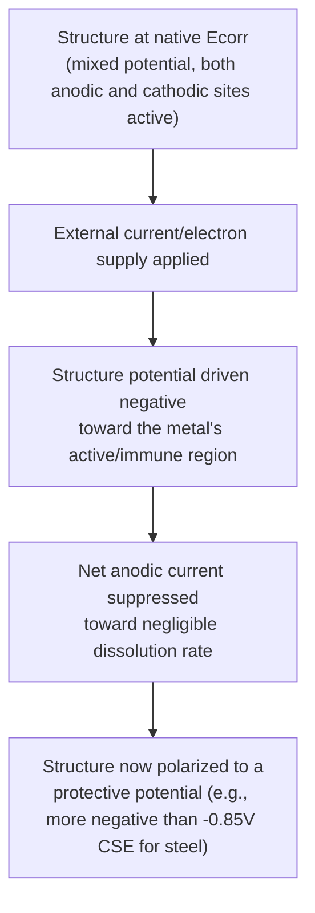
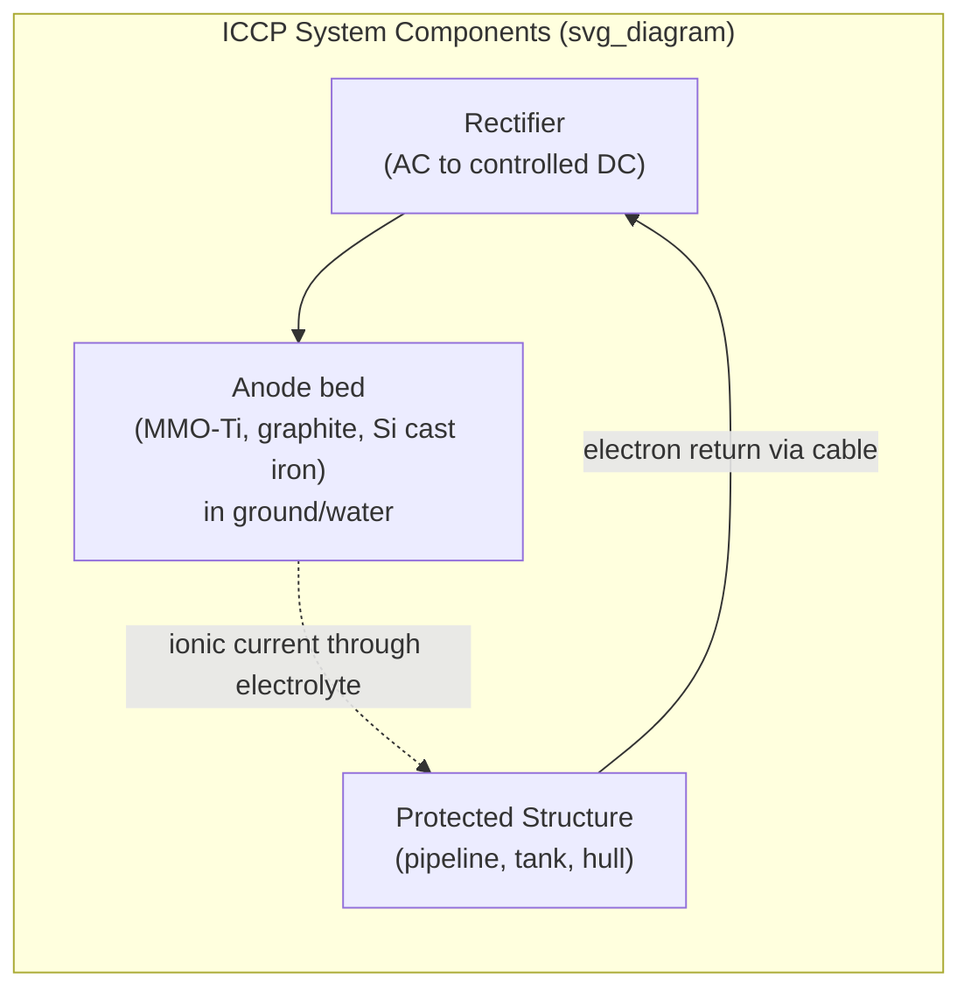
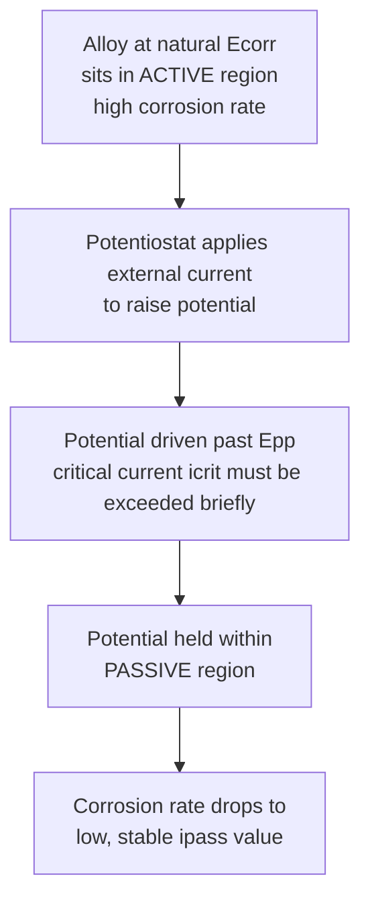

## Cathodic and Anodic Protection

### Overview

Cathodic and anodic protection are active electrochemical corrosion control methods that deliberately shift a structure's potential to suppress corrosion, in contrast to passive methods like coatings or inhibitors. Cathodic protection (CP) works by forcing the entire structure to behave as a cathode, suppressing the anodic dissolution reaction; anodic protection works by the seemingly opposite strategy of deliberately maintaining certain passivating alloys within their stable passive potential region. Both are grounded directly in the polarization/Evans-diagram framework of electrochemical corrosion.

### Cathodic Protection: Fundamental Principle

**Key Points**

- Supplies electrons to the structure to be protected from an external source, driving its potential in the negative (active) direction until it reaches a potential at which the net anodic dissolution current is negligible
- Two implementation methods: **sacrificial (galvanic) anode** systems and **impressed current cathodic protection (ICCP)** systems
- Common criterion for adequate protection of steel: a structure-to-electrolyte potential of **−0.85 V vs. a copper/copper sulfate reference electrode (CSE)**, or a minimum **100 mV cathodic polarization shift** from the native corrosion potential, per criteria in **NACE SP0169** (buried/submerged steel piping systems)

### Sacrificial (Galvanic) Anode Cathodic Protection

**Key Points**

- A more electrochemically active (less noble) metal is electrically connected to the structure; the anode metal corrodes preferentially, sacrificing itself while supplying the protective current
- Common sacrificial anode materials, selected by service environment:
  - **Magnesium**: highest driving voltage (most negative potential), preferred for soil and freshwater applications where electrolyte resistivity is relatively high and a strong driving force is needed to push current through it
  - **Zinc**: moderate driving voltage, commonly used in seawater and marine applications (ship hulls, offshore structures, buried pipelines in low-resistivity soils)
  - **Aluminum (alloyed with indium, zinc, or other activators)**: high current capacity per unit weight and good efficiency, widely used for offshore structures and ship hulls where weight/current output ratio matters
- Advantages: no external power supply required, simple installation, self-regulating (current output naturally decreases as the structure becomes better protected and polarizes toward the anode potential), low risk of overprotection or stray-current interference with neighboring structures
- Limitations: limited driving voltage and current output restrict protection to relatively small structures or well-coated structures with limited current demand; anodes are consumed and require periodic replacement; less effective in high-resistivity environments (dry soil, poorly conductive water) where the limited driving voltage cannot push sufficient current

### Impressed Current Cathodic Protection (ICCP)

**Key Points**

- Uses an external DC power source (a rectifier, converting AC line power to controlled DC) to drive current from relatively inert or slowly-consumed **anodes** through the electrolyte to the structure (the cathode)
- Common ICCP anode materials: high-silicon cast iron, graphite, mixed metal oxide (MMO)-coated titanium, and platinized titanium/niobium — chosen for low consumption rate and ability to sustain high current density over long service life
- Advantages: much higher available driving voltage and current output than sacrificial systems, suitable for large structures (long pipelines, large tank bottoms, ship hulls, well casings) and higher-resistivity environments; output current is adjustable, allowing tuning to changing protection demand over the structure's life
- Limitations: requires external power supply (reliability/availability consideration) and ongoing monitoring/maintenance; risk of **overprotection** if current output is excessive, which can cause hydrogen evolution at the structure surface (relevant to hydrogen embrittlement risk on high-strength steels, and potential disbondment of coatings from evolved hydrogen gas at the metal-coating interface); risk of **interference (stray current) corrosion** on neighboring buried/submerged metallic structures if not properly designed and coordinated

### Sacrificial vs. Impressed Current: Comparison

| Aspect | Sacrificial Anode | Impressed Current (ICCP) |
| --- | --- | --- |
| Power source | None (galvanic driving force only) | External DC rectifier required |
| Typical application scale | Small to medium structures, well-coated structures | Large structures, bare/poorly coated structures, high-resistivity soils |
| Current output | Fixed, self-limiting, generally lower | Adjustable, generally higher |
| Overprotection risk | Low (self-regulating) | Higher if not properly controlled |
| Stray current interference risk | Low | Higher, requires design coordination |
| Maintenance | Periodic anode replacement | Rectifier maintenance, output monitoring, occasional anode bed servicing |
| Typical materials protected | Ship hulls, offshore structures, well-coated pipelines, tank interiors | Long pipelines, poorly coated/bare structures, well casings, large tank bottoms |

### Cathodic Protection Design Considerations

**Key Points**

- **Current density requirement**: depends on coating quality (a well-coated structure requires vastly less protective current than bare metal, since current is only needed at coating holidays/defects), soil/water resistivity, and structure geometry
- **Coating and CP synergy**: CP and coatings are generally complementary rather than alternative strategies — coatings reduce the current demand (and hence system size/cost) to levels practical for CP to fully address, while CP protects any coating defects (holidays) that inevitably exist or develop over time
- **Reference electrodes**: potential measurements use standard reference electrodes — copper/copper sulfate (CSE) for buried/soil applications, silver/silver chloride (Ag/AgCl) commonly for seawater applications — with the appropriate reference-specific criterion applied
- **Attenuation**: on long pipelines, protective current and potential shift diminish with distance from the anode/current source due to the combined effect of coating resistance and longitudinal pipe resistance, requiring multiple distributed anode groundbeds or anodes along the structure's length rather than a single point source

### Anodic Protection

**Key Points**

- Applicable specifically to metals and alloys capable of forming a stable passive film (notably stainless steels, and other passivating alloys) when used in strongly aggressive environments (notably concentrated sulfuric acid and other strong acids) where the alloy would otherwise sit in the active corrosion region of its polarization curve at its natural corrosion potential
- Uses an external power source (potentiostat) to impose and hold the structure's potential within the **passive region** of its anodic polarization curve — deliberately more positive (nobler) than its natural $E_{corr}$, in contrast to cathodic protection, which drives potential more negative
- Requires the alloy-environment combination to actually exhibit an active-to-passive transition with a well-defined passive region (an alloy with no passivation behavior in that environment cannot be anodically protected); careful potentiostatic control is required, since operating below $E_{pp}$ leaves the alloy active, while excessive potential can push it into the transpassive region where film breakdown/oxygen evolution resumes attack

- Advantages: can achieve very low, stable corrosion rates in environments (strong acids) where conventional cathodic protection is not applicable (cathodic protection requires an electrolyte capable of sustaining the required cathodic reaction and is generally not used in this class of strongly aggressive, often non-dilute acid service) and where coatings are often chemically unsuitable
- Limitations: requires continuous, carefully controlled instrumentation (potentiostatic control system) rather than the comparatively simple, passive nature of sacrificial CP; loss of power or control leads to immediate reversion to active corrosion; requires the specific alloy-environment combination to exhibit the necessary active-passive polarization behavior; industrial application is comparatively niche relative to cathodic protection, being used primarily in specific chemical process industries (e.g., sulfuric acid storage tanks)

### Cathodic vs. Anodic Protection: Comparison

| Aspect | Cathodic Protection | Anodic Protection |
| --- | --- | --- |
| Direction of potential shift | More negative (active direction) | More positive (into passive region) |
| Applicable alloys | Broadly applicable to most metals in aqueous/soil environments | Only alloys exhibiting a stable active-passive transition |
| Typical environments | Soil, seawater, freshwater, general aqueous service | Strong acids (e.g., concentrated sulfuric acid) and other environments where a passive film is achievable |
| Control complexity | Simple (sacrificial) to moderate (ICCP, adjustable rectifier) | Requires continuous potentiostatic control |
| Risk if system fails | Structure reverts toward natural (still often tolerable) corrosion rate | Structure can revert rapidly to high active-region corrosion rate |
| Typical applications | Pipelines, ship hulls, tank bottoms, well casings, reinforced concrete | Sulfuric acid storage/process tanks, other passivating-alloy acid service |

### Related Topics

- Electrochemical Principles of Corrosion (mixed potential theory, Evans diagrams, passivity)
- Corrosion Behavior of Specific Metals and Alloys
- Coatings and Corrosion-Resistant Surface Treatments
- Corrosion Testing and Monitoring (reference electrodes, potentiostatic techniques)
- Reinforced Concrete Corrosion and Cathodic Protection of Rebar
- Stray Current Corrosion and Interference Design
- Hydrogen Embrittlement Risk from Cathodic Overprotection