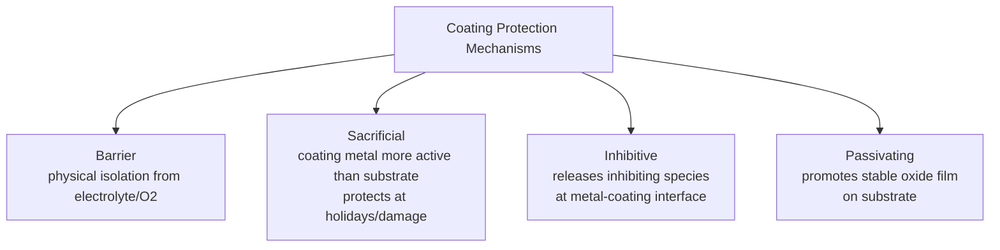
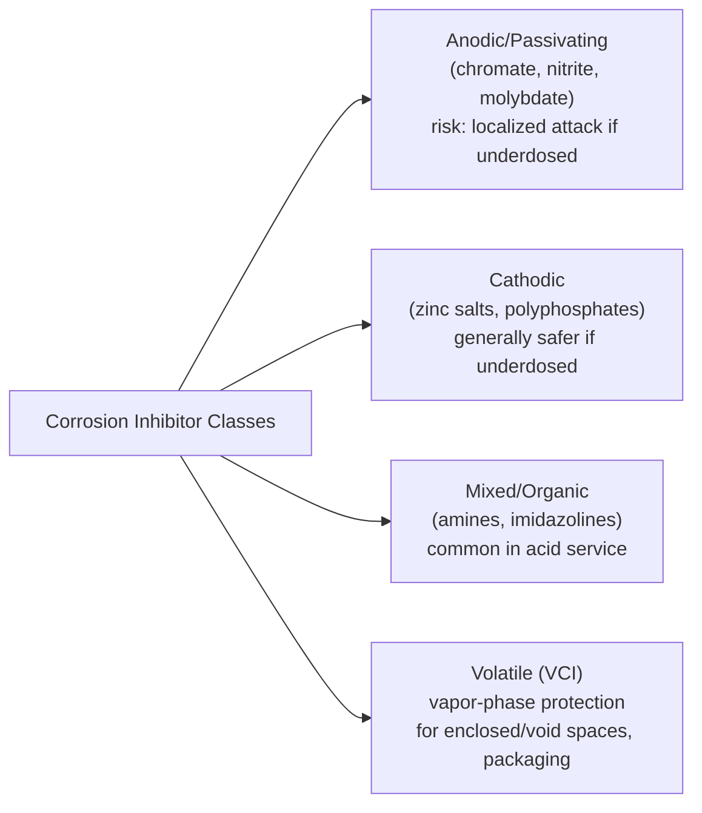

## Corrosion Resistant Coatings and Inhibitors

### Overview

Coatings and inhibitors are the two most widely used passive corrosion control strategies, complementing the active electrochemical methods (cathodic/anodic protection) covered previously. Coatings work primarily by physically separating the metal from its environment (breaking the electrolyte-contact requirement of the corrosion cell), while inhibitors work by chemically modifying the electrochemical reactions occurring at the metal-electrolyte interface itself.

### Coating Classification and Protection Mechanisms

**Key Points**

Protective coatings can be classified by their primary protection mechanism, and a given coating system often combines more than one:

- **Barrier protection**: physically isolates the substrate from the electrolyte and oxygen, interrupting the corrosion cell; effectiveness depends on coating continuity, adhesion, and resistance to moisture/ion permeation over time (e.g., organic paint systems, polymeric linings)
- **Sacrificial (galvanic) protection**: the coating metal is more active (anodic) than the substrate, so it corrodes preferentially and cathodically protects the substrate even at small breaks/holidays in the coating (e.g., zinc galvanizing on steel)
- **Inhibitive protection**: the coating contains or releases a corrosion-inhibiting species at the metal surface, suppressing the electrochemical reaction rate even where the coating is thin or slightly damaged (e.g., zinc-rich or chromate-containing primers)
- **Barrier + passivation**: some coatings (e.g., certain conversion coatings) work by promoting or forming a stable passive layer on the substrate rather than acting purely as a physical barrier

### Metallic Coatings

**Hot-Dip Galvanizing**

**Key Points**

- Steel is immersed in a molten zinc bath (typically ~450 °C), forming a series of zinc-iron intermetallic layers plus an outer layer of relatively pure zinc, per **ASTM A123** (structural steel) and **ASTM A153** (hardware)
- Provides **dual protection**: barrier protection from the zinc layer itself, plus sacrificial (galvanic) protection of any exposed steel at scratches, cut edges, or coating damage, since zinc is anodic to steel — this galvanic backup is the key advantage over a purely barrier coating, which offers no protection once breached
- Zinc's own corrosion rate in atmospheric exposure is itself governed by formation of a protective zinc carbonate/hydroxide patina; coating life is roughly proportional to coating thickness and inversely related to environmental aggressiveness (marine and industrial atmospheres consume the zinc layer faster than rural/dry atmospheres)
- [Inference] Because the sacrificial protection depends on the zinc layer remaining electrically continuous and of sufficient remaining thickness, galvanized coating service life is generally estimated from published atmospheric zinc-loss-rate data for the specific environment category combined with the applied coating thickness, rather than a single universal service-life figure

**Electroplating (Zinc, Nickel, Chromium, Cadmium)**

**Key Points**

- Applies a thin, electrodeposited metallic layer via electrolytic reduction of metal ions onto the substrate as cathode
- **Zinc electroplating**: thinner than hot-dip galvanizing, provides similar sacrificial protection mechanism for fasteners and small parts, often supplemented with chromate or trivalent chromium conversion coatings for enhanced corrosion resistance and appearance
- **Nickel and chromium plating**: predominantly barrier-type protection (nickel and chromium are cathodic to steel), so any coating discontinuity (pore, scratch) exposes the substrate to accelerated localized attack due to the unfavorable small-anode (exposed steel)/large-cathode (Ni/Cr coating) area ratio — decorative chrome plating is typically applied over a nickel underlayer specifically engineered (duplex or microporous/microcracked nickel systems) to distribute any corrosion current over many microscopic sites rather than concentrating it
- **Cadmium plating**: historically valued for excellent corrosion resistance (particularly in marine/aerospace fastener applications) combined with good galling resistance and lubricity, but increasingly restricted or phased out in many jurisdictions due to toxicity, with zinc-nickel alloy plating commonly used as a substitute

**Thermal Spray Coatings**

**Key Points**

- Metal or alloy (zinc, aluminum, or various alloys) is melted and sprayed onto the substrate surface (flame spray, arc spray, or plasma spray processes), building up a porous but generally effective protective layer
- Zinc and aluminum thermal spray coatings provide sacrificial protection similarly to galvanizing and are commonly used for large structures (bridges, offshore platforms) where dip-galvanizing is impractical due to size
- Coatings are typically sealed with a compatible organic topcoat to fill inherent porosity and extend service life

### Organic (Paint) Coating Systems

**Key Points**

- Multi-coat systems are standard practice, with each layer serving a distinct function:
  - **Primer**: provides adhesion to the substrate and often contains corrosion-inhibiting or sacrificial pigments (e.g., zinc-rich primers, providing galvanic protection similar in principle to galvanizing; historically chromate-based inhibitive primers, now increasingly replaced due to toxicity/environmental regulation)
  - **Intermediate coat**: builds film thickness and barrier resistance, often with barrier pigments (e.g., micaceous iron oxide, glass flake) that create a tortuous diffusion path for moisture/oxygen/ions
  - **Topcoat**: provides UV resistance, color/gloss, and additional environmental resistance (chemical, abrasion)
- **Failure modes**: coating failure typically progresses through UV degradation and chalking of the topcoat, moisture permeation and blistering, loss of adhesion (disbondment), and eventually substrate corrosion initiating beneath the coating (underfilm corrosion), which can then propagate laterally beneath still-intact coating from a single breach point
- **Surface preparation** is widely regarded as the single most critical factor governing coating system service life — inadequate removal of mill scale, rust, or contaminants before application compromises adhesion regardless of coating quality; standardized per **SSPC** (Society for Protective Coatings) and **NACE** joint surface preparation standards (e.g., SSPC-SP 10/NACE No. 2 near-white blast cleaning)

### Conversion Coatings

**Key Points**

- Formed by a chemical reaction between the metal surface and a treatment solution, converting the outer surface layer itself into a more corrosion-resistant, adherent form (rather than depositing an entirely foreign material as in plating)
- **Phosphate coatings** (zinc phosphate, iron phosphate, manganese phosphate): commonly applied to steel as a paint pretreatment (improving adhesion and providing some standalone corrosion resistance/moisture resistance beneath the paint film) and, in manganese phosphate form, for wear/lubricity applications
- **Chromate conversion coatings**: applied to aluminum, magnesium, zinc, and cadmium surfaces, forming a thin chromium-rich film with good corrosion resistance and paint adhesion; increasingly being replaced by **trivalent chromium** or entirely chromate-free conversion coatings due to hexavalent chromium's toxicity and regulatory restrictions (e.g., RoHS, REACH)
- **Anodizing** (technically an electrolytic thickening of the natural oxide film rather than a conversion coating in the strictest sense, but often grouped with this category): electrochemically thickens the native aluminum oxide film well beyond its naturally-forming thickness, substantially improving both corrosion resistance and wear resistance; can be further sealed (hot water or chemical sealing) to close the porous anodized structure and improve performance, and can incorporate dyes for coloration

### Non-Metallic and Polymeric Linings

**Key Points**

- Used extensively for internal protection of tanks, pipes, and vessels handling aggressive chemicals where metallic coatings would be inadequate
- Common lining materials: epoxy, polyurethane, rubber, PTFE, PVDF, and glass-flake-reinforced systems, selected based on chemical compatibility with the specific service fluid, temperature, and mechanical/abrasion demands
- **Cathodic disbondment** is a specific failure mode relevant to coatings used in conjunction with cathodic protection (notably pipeline coatings): excessive cathodic current can generate hydroxide ions and hydrogen gas at coating defects, which can degrade adhesion and cause the coating to disbond outward from the defect over time, evaluated via **ASTM G8** or **ASTM G95** testing

### Corrosion Inhibitors

**Key Points**

Inhibitors are chemical substances added to an environment in relatively small concentrations that decrease the corrosion rate, typically by adsorbing onto the metal surface and interfering with the anodic dissolution reaction, the cathodic reduction reaction, or both.

**Classification by mechanism**:

- **Anodic (passivating) inhibitors**: promote or stabilize a passive film, shifting the corrosion potential in the noble direction; examples include chromates (historically), nitrites, molybdates, and orthophosphates. [Inference] A key caution with anodic inhibitors is that insufficient concentration can, in some systems, fail to fully passivate the entire surface, leaving small unprotected anodic areas coupled to a much larger passivated cathodic area — an unfavorable area ratio that can produce more severe localized (pitting-like) attack than if no inhibitor had been used at all; this is a well-recognized reason for maintaining inhibitor concentration above a required minimum threshold in treated systems.
- **Cathodic inhibitors**: suppress the cathodic reaction (e.g., by precipitating as an insoluble compound at cathodic sites, blocking access of dissolved oxygen or reducible species, or increasing hydrogen evolution overpotential); examples include zinc salts, polyphosphates, and certain calcium-based compounds that precipitate as scale specifically at cathodic sites; generally considered "safer" than anodic inhibitors regarding localized attack risk, since underdosing simply reduces overall effectiveness proportionally rather than creating unfavorable small-anode conditions
- **Mixed/organic inhibitors**: adsorb as a film over the entire metal surface (both anodic and cathodic sites) via polar functional groups (often containing nitrogen, sulfur, or oxygen), commonly used in acidic environments (acid pickling baths, oilfield acidizing) — examples include amines, imidazolines, and various nitrogen/sulfur-containing organic compounds
- **Volatile Corrosion Inhibitors (VCIs)**: compounds with sufficient vapor pressure to volatilize within an enclosed space and condense/adsorb onto metal surfaces, providing protection in vapor-phase or enclosed void spaces (e.g., packaging for shipped metal parts, enclosed equipment during layup/storage) without requiring direct liquid contact

**Application contexts**:

- **Closed recirculating water systems** (cooling towers, chilled water loops, boiler feedwater): commonly treated with blended inhibitor packages (often combining a cathodic and anodic or mixed-mechanism component) alongside scale and biological control
- **Oilfield and pipeline service**: film-forming organic inhibitors (often amine/imidazoline-based) are widely used to protect internal pipe surfaces from CO₂ and H₂S-related corrosion in produced fluids
- **Acid pickling and cleaning**: inhibitors are added to acid cleaning/descaling solutions specifically to protect the base metal from excessive attack by the acid while still allowing it to dissolve scale, and can also help limit hydrogen pickup (relevant to hydrogen embrittlement risk during pickling)
- **Concrete admixtures**: corrosion inhibitors (e.g., calcium nitrite) can be added to fresh concrete or applied as a surface treatment to reduce reinforcing steel corrosion risk from chloride ingress (from deicing salts or marine exposure)

### Coating and Inhibitor Selection Considerations

**Next Steps**

- Environmental exposure severity (atmospheric category, immersion, buried, chemical service) and temperature range
- Substrate material and any galvanic compatibility considerations between coating and substrate
- Required service life versus maintenance/reapplication cost and accessibility for future recoating
- Regulatory and environmental restrictions on coating chemistries (hexavalent chromium, VOC content, biocide restrictions in water treatment)
- Compatibility with any concurrent cathodic protection system (avoiding cathodic disbondment-prone coatings on CP-protected structures)
- Surface preparation requirements and practicality for the specific application (new construction versus in-service maintenance/repair)

### Related Topics

- Cathodic and Anodic Protection
- Corrosion Behavior of Specific Metals and Alloys
- Corrosion Testing and Monitoring (EIS for coating evaluation, ASTM B117 salt spray)
- Uniform, Galvanic, Pitting, and Crevice Corrosion
- Surface Preparation Standards (SSPC/NACE joint standards)
- Reinforced Concrete Corrosion and Chloride-Induced Rebar Corrosion
- Environmental Regulation of Coating Chemistries (RoHS, REACH, hexavalent chromium restrictions)