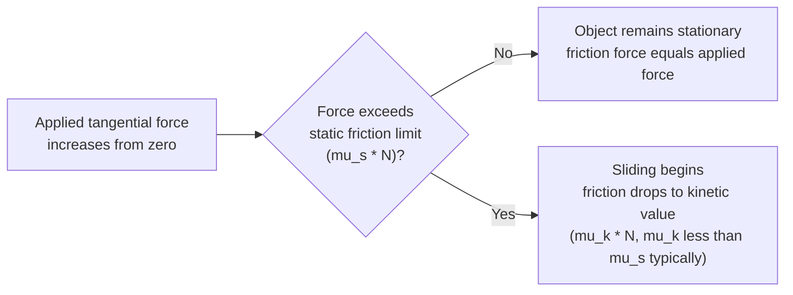
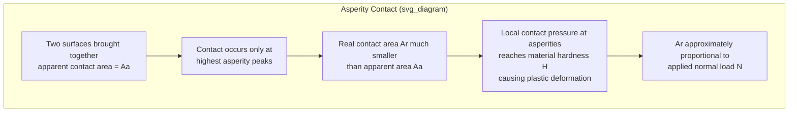
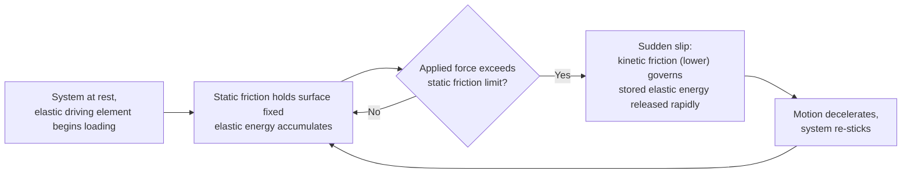

## Fundamentals of Friction

### Overview

Friction is the resistive force opposing relative motion (or the tendency toward relative motion) between two surfaces in contact. Tribology — the science of interacting surfaces in relative motion — treats friction, wear, and lubrication as an interconnected system, since the same surface interactions that generate frictional resistance are typically also responsible for material removal (wear). This section establishes the fundamental laws, mechanisms, and classifications of friction that underpin the study of wear and lubrication.

### Classical (Amontons-Coulomb) Laws of Friction

**Key Points**

The empirical laws of friction, developed by Guillaume Amontons and later refined by Charles-Augustin de Coulomb, remain the standard first-order engineering description:

- **Amontons' First Law**: the friction force $F$ is directly proportional to the normal (applied) load $N$, independent of the apparent contact area:

$$F = \mu N$$

where $\mu$ is the coefficient of friction.

- **Amontons' Second Law**: friction force is independent of the apparent (geometric) area of contact — a large flat block and a small block of the same material and same normal load produce approximately the same friction force
- **Coulomb's Law (Third Law)**: kinetic friction force is approximately independent of sliding velocity (a more approximate relationship than the first two laws, with real systems showing velocity-dependent deviations, particularly at very low or very high sliding speeds)

**Static vs. kinetic friction**: the coefficient of **static friction** ($\mu_s$), governing the force required to initiate relative motion from rest, is generally somewhat greater than the coefficient of **kinetic (dynamic) friction** ($\mu_k$), governing the force resisting motion once sliding has begun. This is why a resting object typically requires a larger initial force to "break loose" than the force needed to keep it sliding afterward.

### Physical Origin: Real Contact Area and Asperity Interaction

**Key Points**

- Even surfaces that appear smooth to the naked eye are microscopically rough, consisting of peaks (**asperities**) and valleys at the micro- and nano-scale
- When two surfaces are brought together under a normal load, actual contact occurs only at the tips of the highest asperities — the **real (true) area of contact** ($A_r$) is typically only a small fraction (often on the order of well under 1% for lightly loaded, hard surfaces) of the **apparent (nominal) contact area** ($A_a$)
- For most metals under typical loads, individual asperity contacts deform **plastically** (rather than purely elastically) under the locally very high contact pressures concentrated at these small real contact points, and the real contact area is approximately proportional to the applied normal load:

$$A_r \approx \frac{N}{H}$$

where $H$ is the hardness of the softer contacting material (the flow pressure the asperities can sustain before plastically yielding)

- This relationship between real contact area and load is the physical basis for Amontons' First Law: since friction force is fundamentally proportional to the real contact area (where the actual adhesive/shearing interactions occur) rather than the apparent area, and real contact area itself scales with load, friction force emerges as proportional to load — explaining why apparent geometric area does not independently affect friction force (Amontons' Second Law)

### Adhesion Theory of Friction

**Key Points**

- The dominant modern explanation (developed principally by Bowden and Tabor) attributes friction primarily to **adhesion** at the real asperity contact junctions, followed by shearing of these junctions during relative sliding
- At the microscopic asperity contacts, the intimate proximity and high local pressure can promote a degree of interatomic/adhesive bonding (sometimes described as microscopic "cold welding" at the junctions, particularly pronounced for clean, similar, and ductile metal surfaces in the absence of protective oxide/contaminant films)
- The friction force is then modeled as the force required to shear these adhesive junctions:

$$F = A_r \cdot \tau_s$$

where $\tau_s$ is the shear strength of the junction material (which may be the shear strength of the softer bulk metal, or of an interfacial oxide/contaminant film if one is present and if it is weaker than the bulk metal)

- Combining this with $A_r \approx N/H$ gives $F \approx (\tau_s/H) N$, so $\mu \approx \tau_s/H$ — indicating that, all else equal, the coefficient of friction depends on the *ratio* of shear strength to hardness of the contacting materials, rather than on either property alone
- [Inference] This simplified adhesion model provides useful first-order physical insight into why friction scales with load and why surface films/contamination strongly affect friction, but it does not fully capture more complex contributions (discussed below), and real coefficients of friction for engineering material pairs are still generally obtained experimentally rather than predicted purely from $\tau_s/H$

### Additional Contributing Mechanisms

**Key Points**

Beyond adhesion, several other mechanisms contribute to the total friction force, with relative importance depending on the specific materials, surface condition, and sliding regime:

- **Ploughing (deformation) component**: when one surface is significantly harder than the other, or when hard wear debris/asperities become embedded, the harder asperities can plough furrows through the softer surface as sliding occurs, contributing an additional deformation-based friction component distinct from pure adhesive shearing
- **Junction growth**: under combined normal and tangential (shear) stress, asperity junctions can grow in real contact area beyond what the normal load alone would produce, since the junction material must satisfy a combined yield criterion under the combined stress state — this can increase friction beyond what a simple adhesion model predicts, particularly relevant to very clean, easily-adhering metal surfaces
- **Elastic hysteresis (for viscoelastic materials, notably rubber and polymers)**: as asperities deform and recover during sliding contact, viscoelastic materials dissipate energy internally (rather than at the interface) due to imperfect elastic recovery, contributing a friction component that can be significant for elastomers and is notably dependent on sliding velocity and temperature (unlike the classical Coulomb assumption of velocity independence)
- **Surface films (oxides, contaminants, adsorbed layers)**: naturally forming oxide films, adsorbed moisture, or contamination layers on most engineering metal surfaces in ambient conditions typically have lower shear strength than the bulk metal, which generally reduces friction and prevents the severe adhesion ("galling" or seizure) that can occur between clean, similar, unlubricated metals in vacuum or inert-atmosphere conditions

### Coefficient of Friction: Typical Ranges and Influencing Factors

**Key Points**

- Coefficient of friction is not a fundamental material property of a single material but rather a property of a specific **tribological pair** (both materials) under specific conditions (surface finish, lubrication state, environment, load, temperature, sliding speed)
- Approximate representative ranges for common unlubricated (dry) metal-on-metal and other material pairs in ambient air are widely available in tribology references, but [Inference] quoted single-value coefficients of friction should generally be treated as approximate and condition-dependent rather than as precise material constants, since surface roughness, oxide film state, humidity, temperature, and even minor contamination can shift measured values meaningfully for the same nominal material pair
- Similar metal pairs (e.g., steel-on-steel, especially clean/unoxidized) generally exhibit higher friction and greater galling/adhesive wear tendency than dissimilar metal pairs (e.g., steel-on-bronze), a key reason dissimilar metal combinations are frequently selected for bearing and bushing applications
- Lubrication (discussed further under lubrication regimes) can reduce coefficient of friction by one or more orders of magnitude relative to the dry (unlubricated) condition for the same material pair, by introducing a low-shear-strength interfacial film or fluid layer that reduces or eliminates direct asperity-to-asperity adhesive contact

### Rolling Friction

**Key Points**

- Distinct from sliding friction in mechanism: rolling friction (rolling resistance) arises primarily from **elastic hysteresis** within the rolling bodies (energy dissipated as the contact zone is cyclically deformed and recovered as it rolls through, since no real material is perfectly elastic) and, secondarily, from minor local slip within the contact patch and adhesion effects
- Rolling friction coefficients are typically one to two orders of magnitude lower than sliding friction coefficients for comparable material pairs, which is the fundamental reason rolling-element bearings (ball and roller bearings) achieve dramatically lower friction than plain sliding bearings under equivalent load and why wheeled/rolling transport is far more energy-efficient than sliding transport
- Rolling friction increases with increasing deformation of the contacting bodies (softer materials, higher load, or greater conformity between the rolling body and its track/raceway) since greater deformation means more material undergoing the hysteresis cycle

### Static Friction, Stick-Slip, and Friction Instabilities

**Key Points**

- **Stick-slip** phenomena arise when static friction significantly exceeds kinetic friction and the driving system has some compliance (elasticity): the surface initially "sticks" (elastic energy builds up in the driving mechanism) until the static friction limit is exceeded, then "slips" suddenly as the stored elastic energy is released and kinetic friction (now lower) governs, after which the process can repeat cyclically
- Stick-slip is responsible for phenomena ranging from the squeal of poorly lubricated machine components and brakes, to the "chatter" sometimes observed in machine tool operations, to the characteristic sound produced by drawing a bow across a violin string
- Mitigated by improving lubrication (reducing the gap between $\mu_s$ and $\mu_k$), increasing system stiffness/damping, or selecting material pairs with more closely matched static and kinetic friction coefficients

### Related Topics

- Wear Mechanisms (adhesive, abrasive, fatigue, corrosive)
- Lubrication Regimes (boundary, mixed, hydrodynamic, elastohydrodynamic)
- Surface Roughness Characterization and Asperity Contact Models
- Tribological Material Pair Selection for Bearings and Sliding Contacts
- Rolling-Element Bearing Design
- Contact Mechanics (Hertzian contact theory)
- Brake and Clutch Friction Material Design