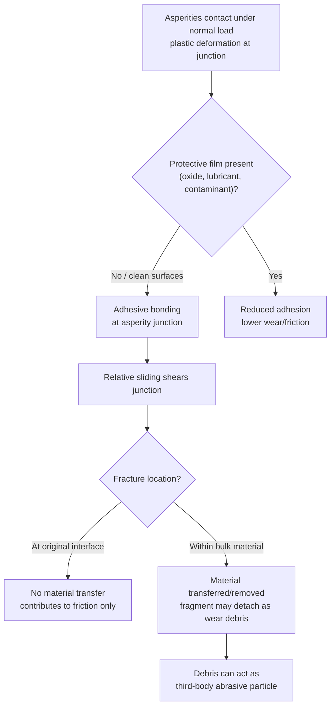
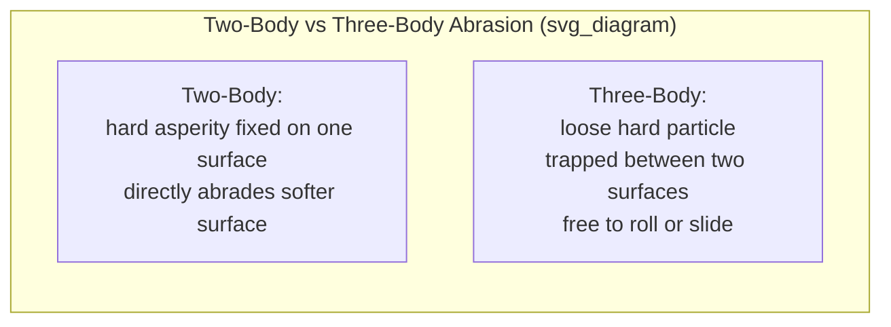

## Adhesive and Abrasive Wear

### Overview

Adhesive and abrasive wear are the two most common and fundamentally distinct wear mechanisms in engineering practice, together accounting for a large majority of wear-related material loss and component failure across mechanical systems. Both result in progressive removal of material from a surface subjected to relative motion, but they arise from different physical interactions at the interface — adhesive wear from junction formation and fracture between contacting surfaces, abrasive wear from hard particles or asperities ploughing/cutting into a softer surface.

### Adhesive Wear

**Key Points**

- Occurs when two surfaces in sliding contact form localized adhesive junctions at asperity contact points (the same junctions responsible for the adhesion component of friction), and subsequent relative motion fractures these junctions — if fracture occurs not at the original interface but within the bulk of one of the two materials, a fragment of that material is transferred to (or detached from) the mating surface
- Most severe between similar, mutually soluble/compatible metals in direct, unlubricated, clean contact (e.g., like-on-like steel, or metal pairs with high mutual solid solubility), since these combinations most readily form strong adhesive junctions; dissimilar or immiscible metal pairs generally show reduced adhesive wear tendency
- In its most severe form, adhesive wear can escalate to **galling** (gross surface damage with visible material transfer and surface roughening, often self-perpetuating as roughened surfaces increase real contact area and further adhesion) and ultimately **seizure** (the mating surfaces effectively weld together, preventing further relative motion) — a critical failure mode in unlubricated threaded fasteners, valve stems, and other close-tolerance sliding metal-on-metal assemblies, particularly with certain stainless steel and other self-mating combinations prone to galling

**Mechanism sequence**:

1. Asperities on the two surfaces come into intimate contact under normal load, with local contact pressure sufficient to cause plastic deformation and, in the absence of a protective film, adhesive bonding at the junction
2. Relative sliding motion applies shear stress to the junction
3. The junction fractures — the fracture plane may lie at the original interface (no material transfer, contributing only to friction) or within one of the two base materials (material transfer/removal occurs)
4. Transferred fragments may remain attached to the receiving surface, be further fragmented by subsequent passes, or detach entirely as loose wear debris, which can then act as a third-body abrasive (linking adhesive wear to subsequent abrasive wear)

**Archard Wear Equation**: the standard quantitative model for adhesive (and, with appropriate constants, more generally for sliding) wear volume:

$$V = \frac{K \cdot N \cdot L}{H}$$

where $V$ is the wear volume, $N$ is the normal load, $L$ is the sliding distance, $H$ is the hardness of the softer material, and $K$ is a dimensionless wear coefficient (empirically determined, encapsulating the probability that a given asperity encounter produces a detached wear fragment).

- The wear coefficient $K$ typically ranges over several orders of magnitude depending on lubrication state and material compatibility — [Inference] published $K$ values for a given material pair are generally specific to the lubrication regime and test conditions under which they were measured, and applying a $K$ value from one lubrication/contact condition to a substantially different service condition can produce a large error in predicted wear volume, so Archard's equation is most reliably used for interpolation/comparison within a characterized regime rather than for extrapolation across regimes
- The equation's key practical insight is that wear volume scales inversely with hardness (harder materials generally wear less under otherwise identical adhesive wear conditions) and linearly with load and sliding distance, all else equal

**Mitigation approaches**:

- **Lubrication**: separating the surfaces with a low-shear-strength film (oil, grease, solid lubricant) to prevent direct asperity adhesion
- **Material pair selection**: choosing dissimilar, mutually insoluble, or naturally low-friction/anti-galling material combinations (e.g., steel against bronze or other copper alloys, rather than steel against steel, for plain bearings)
- **Surface hardening**: increasing surface hardness (case hardening, nitriding, hard chrome plating) increases resistance per the Archard relationship and can reduce the tendency toward plastic junction growth
- **Surface treatments/coatings specifically for anti-galling**: anti-galling coatings, dissimilar-metal fastener plating, or specified reduced thread engagement torque/lubricant application for known galling-prone bolted assemblies (e.g., certain stainless steel fastener applications)

### Abrasive Wear

**Key Points**

- Occurs when hard particles, or hard asperities on one of the two contacting surfaces, plough, cut, or gouge material from a softer opposing surface
- Classified into two principal sub-types based on the source of the abrading hard phase:
  - **Two-body abrasion**: hard asperities on one surface (or a bonded abrasive, as in grinding) directly abrade the opposing, softer surface — e.g., a file cutting metal, or a hard, rough shaft wearing a softer bushing
  - **Three-body abrasion**: loose hard particles, free to roll or slide between two surfaces (neither of which is necessarily itself abrasive), cause wear to one or both surfaces — e.g., sand or dust particles trapped between a piston and cylinder wall, or contaminant grit in a lubricant film

**Micro-mechanisms of material removal** under abrasive contact:

- **Micro-cutting**: the hard particle/asperity acts like a miniature cutting tool, removing a discrete chip of material — the most efficient (highest material removal per unit sliding distance) abrasive mechanism
- **Micro-ploughing**: material is plastically displaced to the sides and ahead of the abrading particle rather than being removed as a chip, forming a groove; if no material is actually removed (only displaced), this alone does not directly constitute wear, but repeated ploughing along the same or intersecting paths can eventually remove material via a low-cycle-fatigue-like ratcheting/fragmentation mechanism
- **Micro-cracking/fragmentation**: relevant particularly to more brittle materials, where the abrading particle induces cracking that leads to fragment detachment ahead of or beside the groove, rather than ductile chip formation or ploughing

**Key influencing factors**:

- **Hardness ratio**: a critical, well-established threshold in abrasive wear behavior is the ratio of abrasive particle hardness ($H_{abrasive}$) to the hardness of the wearing surface ($H_{surface}$); when $H_{abrasive}/H_{surface}$ exceeds approximately 1.2 (a widely cited, empirically-derived value in tribology literature), abrasive wear rate increases sharply and then plateaus at a comparatively severe rate, whereas below this ratio, wear rate is markedly and increasingly lower as the ratio decreases — this threshold behavior is a major basis for material and hardfacing selection intended to resist a specific abrasive medium (matching or exceeding the abrasive's hardness provides disproportionate benefit)
- **Particle size, shape, and angularity**: larger, more angular particles generally produce more severe abrasive wear (more effective micro-cutting) than smaller or more rounded particles at equivalent hardness and load
- **Applied load/contact pressure**: abrasive wear rate generally increases with load, broadly consistent with an Archard-type relationship, though the specific wear coefficient for abrasive wear conditions is typically substantially higher than for well-lubricated adhesive wear conditions
- **Surface/material hardness**: increasing the hardness of the wearing component (through material selection, heat treatment, or hardfacing) is the primary engineering lever for abrasive wear resistance, consistent with the hardness-ratio threshold behavior described above

**Common abrasive wear scenarios**: earthmoving and mining equipment (bucket teeth, crusher liners, ball mill liners) exposed to rock and ore particles; agricultural equipment (plow shares, tillage tools) in soil containing sand and grit; slurry pump components; and any system where airborne dust or particulate contamination can enter a lubricated sliding or rolling interface (engine wear from ingested dust being a classic example motivating air filtration system design).

**Mitigation approaches**:

- **Hardfacing and hard coatings**: weld-deposited hardfacing alloys (e.g., high-chromium white iron overlays, tungsten carbide composites), thermal spray coatings, or surface hardening treatments (carburizing, nitriding) to raise surface hardness above or near the abrasive particle hardness
- **Bulk material selection**: through-hardened or naturally hard/wear-resistant alloys (e.g., high-manganese austenitic steel, which additionally work-hardens under impact loading, for crusher and mill liner applications; white cast irons for high-abrasion, lower-impact service)
- **Sealing and filtration**: excluding abrasive contaminants from lubricated interfaces via seals, filters (air, oil), and wipers, directly addressing three-body abrasion by preventing particle ingress
- **Lubricant selection and maintenance**: proper lubricant viscosity and regular replacement/filtration to remove accumulated wear debris and ingested contaminants before they can act as three-body abrasive particles

### Comparative Summary

| Aspect | Adhesive Wear | Abrasive Wear |
| --- | --- | --- |
| Primary mechanism | Junction formation and fracture at asperity contacts | Ploughing, cutting, or fragmentation by hard particles/asperities |
| Most severe between | Similar, mutually compatible/soluble metal pairs | Any surface softer than the abrading particle/asperity (esp. below ~1.2 hardness ratio) |
| Governing quantitative model | Archard wear equation | Archard-type relationship; strongly hardness-ratio dependent |
| Primary mitigation lever | Lubrication, dissimilar material pairing | Surface hardness increase, contaminant exclusion |
| Characteristic failure escalation | Galling, seizure | Progressive material loss, gouging, scoring |
| Key contaminant/debris relationship | Detached fragments can become abrasive debris | Loose particles (three-body) directly cause the wear |

### Related Topics

- Fundamentals of Friction (asperity contact, adhesion, real contact area)
- Fatigue and Erosive/Corrosive Wear Mechanisms
- Lubrication Regimes and Lubricant Selection
- Surface Hardening Treatments (carburizing, nitriding, hardfacing)
- Wear-Resistant Alloys (high-manganese steel, white cast iron, tungsten carbide composites)
- Tribological Testing Methods (pin-on-disk, ASTM G65 dry sand rubber wheel test)
- Contact Mechanics and Asperity Deformation Models