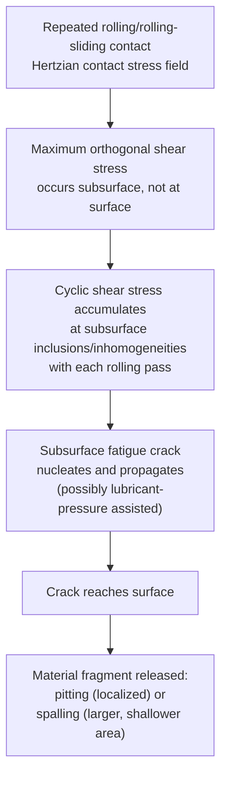
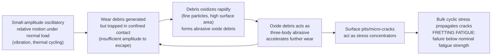

## Fatigue Wear and Fretting

### Overview

Fatigue wear and fretting are cyclic-loading-driven surface damage mechanisms, distinguishing them from the largely monotonic sliding processes of adhesive and abrasive wear. Fatigue wear occurs in rolling and repeated-sliding contacts where subsurface cyclic stresses accumulate damage over many loading cycles before material is released as discrete particles. Fretting is a related but distinct phenomenon arising from very small-amplitude oscillatory relative motion between nominally clamped or static contacting surfaces, combining mechanical wear and, typically, an oxidative/corrosive component.

### Fatigue Wear (Contact/Rolling Fatigue)

**Key Points**

- Occurs in components subjected to repeated rolling or rolling-sliding contact (rolling-element bearings, gear teeth, rail-wheel contacts, cam-follower systems) where cyclic subsurface stresses, rather than direct surface abrasion or adhesion, are the primary driver of eventual material loss
- Distinguished from adhesive and abrasive wear by its **delayed, cumulative** nature: significant subsurface damage accumulates over many thousands to millions of loading cycles before any visible material loss occurs, followed by relatively sudden pit or spall formation once a critical fatigue crack reaches the surface — this incubation period is analogous in character to the delayed nature of structural fatigue and hydrogen embrittlement, though the underlying mechanism (cyclic subsurface shear stress from rolling contact) is distinct from either

**Mechanism**:

1. Rolling (or rolling-sliding) contact between two curved surfaces produces a Hertzian contact stress field; the maximum **orthogonal shear stress** occurs not at the surface itself but at a subsurface depth typically on the order of a fraction of the contact半-width, beneath the center of the contact zone
2. As the contact rolls through repeatedly, this subsurface region experiences a cyclically reversing shear stress with each pass, analogous to conventional fatigue loading but driven by repeated rolling contact rather than macroscopic applied cyclic stress
3. Cyclic plastic strain accumulates around subsurface material inhomogeneities (non-metallic inclusions, carbides, microstructural discontinuities), nucleating a subsurface fatigue crack
4. The crack propagates, typically running roughly parallel to the surface initially and then branching or turning toward the surface, guided by the local stress field and any lubricant that becomes trapped and pressurized within the growing crack under subsequent rolling passes (a hydraulic-pressure-assisted propagation mechanism sometimes cited for lubricated rolling contacts)
5. Once the crack reaches the surface, a discrete fragment of material is released, leaving a **pit** (localized, roughly circular pit) or, if the damage is more extensive, a **spall** (larger, shallower area of material loss)

**Key influencing factors**:

- **Contact stress magnitude**: fatigue life in rolling contact is strongly (inversely, and steeply nonlinear) sensitive to peak contact (Hertzian) stress — modest increases in contact stress can substantially reduce fatigue life, which is the basis for the standard L10 bearing life rating methodology used in rolling-element bearing selection
- **Material cleanliness**: non-metallic inclusions (oxides, sulfides) act as stress concentrators and preferred crack nucleation sites; modern vacuum-degassed and vacuum-arc-remelted bearing steels achieve substantially improved rolling contact fatigue life over conventionally melted steels specifically by reducing inclusion content and size
- **Lubrication regime**: operation in the full elastohydrodynamic lubrication regime (a coherent, load-supporting lubricant film fully separating the surfaces) significantly extends rolling contact fatigue life relative to boundary or mixed lubrication conditions, where asperity contact introduces additional surface-initiated damage mechanisms alongside subsurface fatigue
- **Residual stress**: compressive residual stresses at and near the surface (introduced by shot peening, carburizing, or other surface hardening treatments) are generally beneficial, since they oppose the tensile stress components of the cyclic contact stress field and can retard both crack nucleation and early propagation
- **Surface-initiated vs. subsurface-initiated fatigue**: while classical rolling contact fatigue theory emphasizes subsurface crack initiation at inclusions, [Inference] surface-initiated fatigue (originating from surface asperity interactions, surface roughness, or lubricant film breakdown under marginal lubrication) is also recognized as a significant and, in some operating regimes, dominant mechanism, particularly where lubrication is inadequate to fully separate the surfaces — so which initiation mode governs in a given application depends substantially on the achieved lubrication regime and surface finish, not purely on subsurface material cleanliness

### Fretting

**Key Points**

- A distinct surface damage phenomenon occurring at contacts subjected to **small-amplitude oscillatory relative motion** (typically in the range of micrometers to a few tens of micrometers of relative displacement), under normal load, where the surfaces are nominally intended to remain static/clamped relative to one another
- Commonly occurs at bolted and riveted joints, press-fit and shrink-fit assemblies, splines, wire ropes and cables under vibration, and any clamped mechanical interface subjected to cyclic vibration or thermal-cycling-induced micro-movement
- Combines elements of adhesive wear, abrasive wear (from trapped oxidized debris), and oxidation/corrosion in a mutually reinforcing cycle, and is frequently discussed as encompassing three related but distinguishable damage modes:
  - **Fretting wear**: progressive loss of material and dimensional change at the contact interface
  - **Fretting corrosion**: the oxidative component of the process, particularly pronounced for ferrous materials where fine iron oxide debris ("cocoa" or reddish-brown fretting debris) is a characteristic visible indicator of fretting damage
  - **Fretting fatigue**: the most structurally significant consequence in many engineering failures — fretting damage at a clamped or fitted interface creates stress concentrations and surface micro-cracks that then propagate under the bulk cyclic stress of the component (which may be far lower than would cause fatigue failure at an undamaged location), often producing fatigue failure at a fretted interface at stress levels and cycle counts well below what the component's nominal (un-fretted) fatigue strength would predict

**Mechanism**:

1. Under normal clamping load, the two surfaces are nominally static, but small relative oscillatory displacement occurs due to vibration, differential thermal expansion, or cyclic elastic deformation of the surrounding structure
2. This small-amplitude motion is generally insufficient to fully escape the contact zone (unlike conventional reciprocating sliding), so wear debris generated at the interface tends to remain trapped rather than being expelled
3. Trapped metallic debris rapidly oxidizes (particularly for steels, forming the characteristic reddish iron oxide fretting debris) since it is finely divided and has high surface area
4. This oxidized debris is harder and more abrasive than the parent metal, so it acts as a three-body abrasive within the confined contact, accelerating further material removal — a self-reinforcing cycle distinguishing fretting from ordinary reciprocating sliding wear, where debris is more readily expelled from the contact
5. Surface damage (pits, micro-cracks) generated by this process act as stress concentrators; under the component's ambient cyclic bulk stress (from vibration, rotation, or thermal cycling), these become fatigue crack initiation sites, potentially leading to fretting fatigue failure

**Key influencing factors**:

- **Slip amplitude**: fretting damage rate is generally non-monotonic with slip amplitude — very small amplitudes may produce limited damage (partial slip regime, with much of the contact remaining in stick condition), damage tends to be most severe over an intermediate amplitude range (gross slip regime with debris retention), and sufficiently large amplitude eventually transitions toward conventional reciprocating sliding wear behavior where debris can be expelled from the contact more readily
- **Contact pressure**: higher clamping/contact pressure generally increases fretting fatigue severity by increasing the stress concentration effect and can influence the transition between partial-slip and gross-slip conditions
- **Environment**: humidity and temperature affect oxide debris formation rate and its abrasive character; [Inference] fretting behavior in vacuum or inert atmosphere is generally understood to differ substantially from ambient-air behavior due to the reduced or altered oxidation of debris, though the specific alloy-dependent details of this difference are less universally characterized than the general fretting mechanism in air
- **Frequency**: higher oscillation frequency generally increases the number of fretting cycles accumulated per unit time, though the relationship between frequency and total damage is also influenced by how quickly debris oxidizes and whether that oxidation keeps pace with the mechanical damage rate

**Mitigation approaches**:

- **Increasing clamping force/eliminating relative motion**: sufficient preload or interference fit to prevent any relative micro-motion at the interface, where design allows
- **Surface treatments and coatings**: hard coatings, shot peening (introducing beneficial compressive residual stress that resists fretting fatigue crack initiation), or low-friction/anti-fretting coatings and interlayers (e.g., soft metallic coatings such as silver or certain polymer films designed to accommodate the small relative motion without generating abrasive debris)
- **Lubrication**: appropriate lubricants or anti-fretting compounds can reduce the coefficient of friction at the interface and help exclude oxygen, reducing oxidative debris formation, though lubricant selection for fretting-prone joints requires attention to retention within the very tight, low-amplitude contact
- **Design changes**: reducing local stress concentration at contact edges (e.g., using a compliant interlayer, tapering the mating surface, or redesigning the joint geometry to reduce differential displacement between mating parts) and vibration isolation/damping to reduce the source oscillatory input where feasible

### Comparative Notes: Fatigue Wear vs. Fretting

| Aspect | Fatigue Wear (Rolling Contact) | Fretting |
| --- | --- | --- |
| Relative motion type | Continuous rolling or rolling-sliding | Small-amplitude oscillatory (micrometers) |
| Typical components affected | Bearings, gears, rail-wheel contacts, cams | Bolted/riveted/press-fit joints, splines, clamped interfaces |
| Damage initiation site | Often subsurface (inclusions), also surface-initiated | Surface, at the contact interface |
| Role of oxidation | Generally secondary | Central — abrasive oxide debris formation is a defining feature |
| Characteristic failure mode | Pitting, spalling | Surface damage, and critically, fretting fatigue crack initiation |
| Key mitigation lever | Material cleanliness, lubrication regime, contact stress control | Eliminating relative micro-motion, clamping force, surface treatment |

### Related Topics

- Fundamentals of Friction
- Adhesive and Abrasive Wear
- Rolling-Element Bearing Design and L10 Life Rating
- Fatigue and Fracture Mechanics (structural fatigue crack propagation)
- Contact Mechanics (Hertzian contact stress distribution)
- Lubrication Regimes (elastohydrodynamic lubrication)
- Stress Corrosion Cracking and Hydrogen Embrittlement (comparative delayed-failure mechanisms)