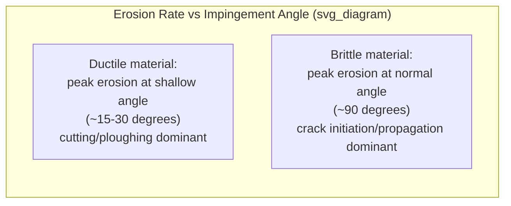
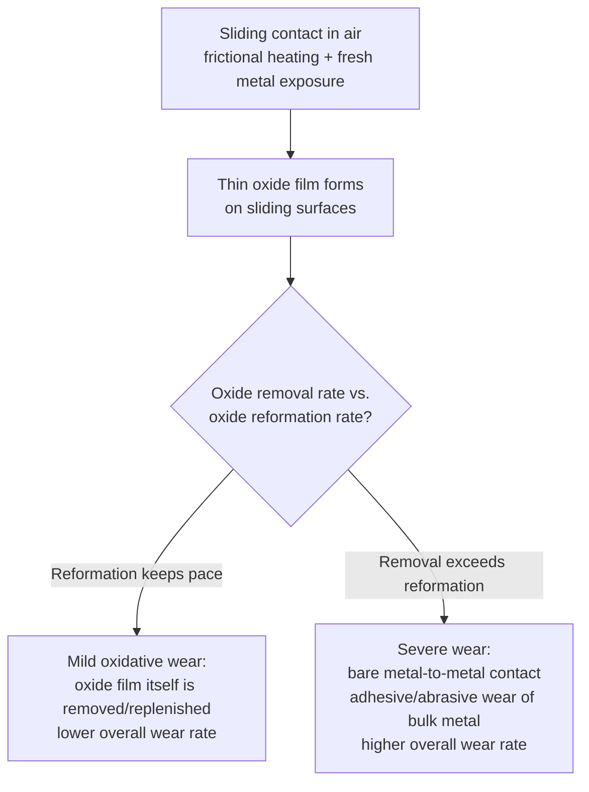

## Erosive and Corrosive Wear

### Overview

Erosive and corrosive wear are mechanisms in which material loss results from the action of a moving fluid or entrained particles (erosion) or from the combination of mechanical action with a chemical/electrochemical reaction (corrosive wear, including the erosion-corrosion synergy). While erosion-corrosion in flowing liquids was introduced under corrosion science, this section treats erosion more broadly — including solid particle erosion in gas streams, liquid impingement, and cavitation — and examines corrosive wear as a general tribological category distinct from the purely mechanical wear mechanisms (adhesive, abrasive, fatigue) covered previously.

### Solid Particle Erosion

**Key Points**

- Material loss caused by repeated impact of small, solid particles entrained in a moving fluid (typically a gas stream, though liquid-borne particle erosion, sometimes termed slurry erosion, is also common) striking a target surface
- Distinguished from abrasive wear primarily by the nature of contact: abrasive wear generally involves sustained sliding contact between a hard particle/asperity and a surface, whereas solid particle erosion involves discrete, repeated impact events, often at a defined impingement angle, with the particle typically not remaining in prolonged contact
- Governing variables: particle velocity, particle size and shape (angular particles generally erode more aggressively than rounded particles for a given material), particle hardness relative to the target material, particle flux (concentration), and **impingement angle** (the angle between the particle trajectory and the target surface)

**Impingement angle and material ductility interaction**: erosion rate as a function of impingement angle shows a characteristic, well-documented dependence on target material ductility:

- **Ductile materials** (most metals): erosion rate is typically **maximum at a shallow (low) impingement angle**, commonly cited in the range of roughly 15–30° from the surface, and decreases at both very shallow and near-normal (90°) angles. This behavior reflects a transition between two competing micro-mechanisms — at shallow angles, particles produce a cutting/ploughing action similar to abrasive micro-cutting (maximizing removal), while at near-normal incidence, the dominant mechanism shifts toward repeated plastic deformation and extrusion/forging of surface material into lips that eventually fatigue and detach, which is generally less efficient per impact than the shallow-angle cutting mechanism
- **Brittle materials** (ceramics, glasses, brittle cast irons): erosion rate is typically **maximum at or near normal (90°) impingement angle**, since material removal is governed by impact-induced crack initiation and propagation (radial and lateral cracking beneath the impact site), which is most effectively driven by the normal component of impact energy rather than a shearing/cutting action

**Micro-mechanisms in ductile erosion**:

- **Micro-cutting**: at shallow angles, particles act similarly to abrasive cutting tools, directly removing chips of material
- **Repeated plastic deformation/extrusion**: at steeper angles, impact energy plastically deforms the surface, extruding material into raised "platelets" or lips at the impact crater rim; these become increasingly work-hardened and embrittled with repeated impacts until they fracture and detach — an accumulation/fatigue-like process rather than immediate single-impact removal

**Micro-mechanisms in brittle erosion**: impact generates a localized stress field that nucleates **radial cracks** (extending outward from the impact point, contributing primarily to strength degradation rather than material loss) and **lateral cracks** (propagating roughly parallel to the surface beneath the impact site, which upon reaching the surface release a chip of material) — lateral cracking is generally considered the primary material-removal mechanism in brittle erosion.

**Erosion rate relationships**: erosion rate is commonly correlated with particle velocity via a power-law relationship:

$$E \propto v^n$$

where $E$ is erosion rate (mass loss per unit mass of impacting particles, or similar normalized measure), $v$ is particle impact velocity, and $n$ is an empirical exponent typically found in the range of approximately 2 to 3 for many ductile metal-particle combinations, though [Inference] the specific exponent is material- and particle-combination-dependent and should be determined experimentally for a given application rather than assumed universal, since reported values in the tribology literature span a fairly wide range depending on test conditions and materials studied.

**Common applications and susceptible components**: gas turbine compressor and turbine blades (particle/dust ingestion, especially in desert/sandy operating environments), pipeline elbows and fittings in pneumatic/hydraulic particle-conveying systems, slurry pump and pipeline components, boiler tubes exposed to fly ash in coal-fired power plants, and helicopter rotor blade leading edges (sand/dust erosion).

**Mitigation approaches**:

- **Material selection**: harder surface materials or erosion-resistant coatings (e.g., tungsten carbide, chromium carbide thermal spray coatings) for ductile-erosion-dominated service; tougher (rather than simply harder) materials for brittle-erosion-prone applications, since fracture toughness governs resistance to the crack-driven brittle erosion mechanism
- **Geometric/flow design**: minimizing impingement angle where the target is ductile (directing flow to graze rather than impinge normally), or conversely avoiding near-normal impingement geometries in ductile systems (e.g., avoiding sharp direction changes in particle-laden pneumatic conveying lines)
- **Particle removal/velocity reduction**: filtration or separation of entrained particles upstream (inlet air filtration on gas turbines, cyclone separators), and reducing fluid/particle velocity where process conditions allow, given the strong power-law dependence of erosion rate on velocity
- **Sacrificial/replaceable wear components**: designing known high-erosion-risk locations (pipe elbows, impact plates) as easily replaceable wear parts rather than integral structural components

### Liquid Impingement Erosion

**Key Points**

- A related erosion mode caused by high-velocity liquid droplets (rather than solid particles) striking a surface, most classically observed on the leading edges of steam turbine blades exposed to wet steam (condensed water droplets) and on aircraft components exposed to rain at high flight speed
- Damage mechanism involves the very high transient impact pressures generated at the moment of droplet impact (related to water-hammer pressure effects at the droplet-surface contact edge), which can exceed the yield strength of even hard engineering alloys at sufficiently high relative velocity, producing progressive surface pitting and roughening
- Mitigated by erosion-shield materials/coatings on turbine blade leading edges (e.g., stellite erosion shields, historically, and various hardened coating systems), and by steam path design/moisture separation to reduce liquid droplet content and size in the wet-steam stages of turbines

### Cavitation Erosion

**Key Points**

- Distinct from particle- or droplet-impingement erosion in that the damaging medium is the liquid itself, specifically vapor bubbles that form in a region of locally reduced pressure (below the liquid's vapor pressure at the local temperature) and then violently collapse when they are subsequently swept into a higher-pressure region
- Bubble collapse near a solid surface generates extremely high localized transient pressures and, in many cases, a high-velocity liquid microjet directed at the surface, both of which can exceed the yield strength of the material and cause progressive surface damage through repeated micro-impacts
- Common in pump impellers (particularly at reduced net positive suction head, NPSH), ship propellers, hydraulic turbine runners, and downstream of control valves/orifices where a local pressure drop is sufficient to induce vaporization
- Cavitation damage is frequently discussed jointly with erosion-corrosion, since [as noted in corrosion science coverage] repeated protective film disruption by cavitation bubble collapse, combined with the underlying electrochemical corrosion reaction, typically produces a substantially higher combined damage rate than either mechanism would produce in isolation
- Mitigation follows principles analogous to those covered under cavitation-related erosion-corrosion: adequate NPSH margin in pump system design, avoiding excessive pressure drops across valves and restrictions, and selecting cavitation-resistant materials (harder, tougher alloys, or specific alloys known for good cavitation resistance such as certain cobalt-based alloys and cavitation-resistant stainless steels) at known high-risk locations

### Corrosive Wear (General Category)

**Key Points**

- A broader tribological category describing wear processes in which a chemical or electrochemical reaction (typically oxidation, but potentially other corrosion reactions depending on environment) acts synergistically with mechanical wear, such that the combined material loss rate exceeds the sum of the mechanical wear rate and the corrosion rate acting independently
- Encompasses several of the more specific mechanisms already introduced under corrosion science and tribology: erosion-corrosion (mechanical erosion/impingement plus corrosion), fretting corrosion (oscillatory micro-motion plus oxidation), and more generally, **oxidative wear** in ordinary sliding contacts
- **Oxidative wear in sliding contacts**: even in the absence of a specifically corrosive environment, many metals form a thin oxide film during sliding in ordinary air due to frictional heating and fresh metal exposure at asperity contacts; if this oxide film is mechanically removed by continued sliding faster than it can reform, wear proceeds essentially as adhesive/abrasive wear of bare metal (a comparatively severe wear regime); if the oxide film reforms and is worn away at a moderate, sustained rate, a milder, more controlled "mild oxidative wear" regime can result, in which the oxide film itself — rather than the bulk metal — is the material predominantly being removed and replenished
- [Inference] The transition between mild (oxide-dominated) and severe (metal-to-metal, oxide-breakdown-dominated) wear regimes in sliding metal contacts is generally understood to depend on sliding speed, load, and temperature, with transitions often occurring at identifiable critical values for a given material pair, but the specific transition conditions are alloy- and environment-specific and are typically established experimentally (e.g., via pin-on-disk testing across a range of speed/load combinations) rather than predicted from first principles for a new material pair

### Comparative Summary of Erosive Mechanisms

| Mechanism | Damaging Medium | Governing Variable | Typical Susceptible Components |
| --- | --- | --- | --- |
| Solid particle erosion | Entrained hard particles in gas/liquid flow | Impingement angle, particle velocity, hardness | Turbine blades, pipe elbows, boiler tubes |
| Liquid impingement erosion | High-velocity liquid droplets | Droplet velocity, size, impact frequency | Steam turbine blade leading edges, high-speed aircraft surfaces |
| Cavitation erosion | Collapsing vapor bubbles | Local pressure drop below vapor pressure, NPSH | Pump impellers, propellers, hydraulic turbines, valve downstream faces |
| Corrosive/oxidative wear | Chemical/electrochemical reaction + mechanical action | Environment aggressiveness, sliding conditions, film reformation rate | Sliding contacts in corrosive/humid environments, fretting joints |

### Related Topics

- Erosion-Corrosion (detailed electrochemical/cavitation coverage under Corrosion Science)
- Fundamentals of Friction
- Adhesive and Abrasive Wear
- Fatigue Wear and Fretting
- Cavitation Damage and Pump/Propeller Hydraulic Design
- Gas Turbine Blade Materials and Coatings
- Tribological Testing Methods (ASTM G76 solid particle erosion, ASTM G32 cavitation erosion)