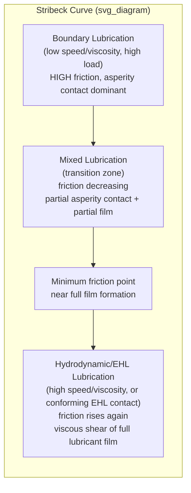
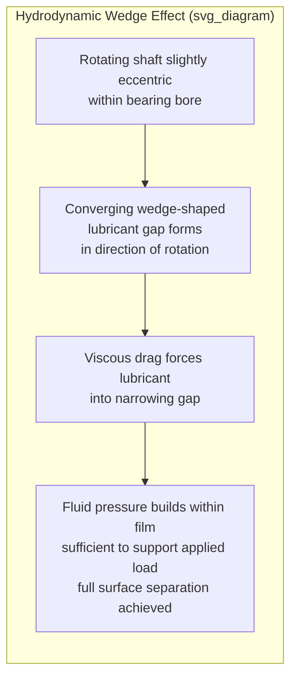

## Lubrication Regimes

### Overview

Lubrication is the introduction of a substance between contacting surfaces to reduce friction and wear by separating them, wholly or partially, with a low-shear-strength film. The relationship between friction, film thickness, and operating conditions across different lubrication conditions is classically summarized by the **Stribeck curve**, which organizes lubrication behavior into distinct regimes based on the degree of surface separation achieved by the lubricant film.

### The Stribeck Curve

**Key Points**

- Plots the coefficient of friction against a dimensionless (or composite) parameter, the **Stribeck number**, commonly expressed as $\eta N / P$ (or a closely related grouping), where $\eta$ is lubricant dynamic viscosity, $N$ is relative sliding/rotational speed, and $P$ is the applied load (or contact pressure)
- Reveals a characteristic non-monotonic friction behavior: friction is high at very low values of $\eta N/P$ (boundary lubrication), decreases through an intermediate region (mixed lubrication) to a minimum, then increases again at higher values of $\eta N/P$ (hydrodynamic/full-film lubrication), where friction is now governed by viscous shearing of the lubricant film itself rather than by asperity interaction
- The location of the minimum-friction point represents the optimal transition zone and is of significant practical design interest, since operating too far into boundary lubrication risks excessive wear, while operating unnecessarily far into the hydrodynamic regime incurs higher viscous friction losses than necessary for adequate surface separation

<svg xmlns="http://www.w3.org/2000/svg" viewBox="0 0 560 340">
<text x="280" y="24" text-anchor="middle" font-size="15" font-weight="bold" fill="#222">Stribeck Curve (svg_diagram)</text>
<line x1="70" y1="290" x2="500" y2="290" stroke="#333" stroke-width="1.5" />
<line x1="70" y1="50" x2="70" y2="290" stroke="#333" stroke-width="1.5" />
<text x="285" y="320" text-anchor="middle" font-size="12" fill="#333">Stribeck number (viscosity x speed / load)</text>
<text x="30" y="170" text-anchor="middle" font-size="12" fill="#333" transform="rotate(-90 30 170)">Coefficient of friction</text>
<path d="M 90 90 C 150 110, 190 250, 250 265 C 310 275, 340 200, 400 130 C 440 90, 470 75, 490 65" stroke="#c0392b" stroke-width="2.5" fill="none" />
<line x1="150" y1="290" x2="150" y2="50" stroke="#999" stroke-dasharray="3,3" />
<line x1="330" y1="290" x2="330" y2="50" stroke="#999" stroke-dasharray="3,3" />
<text x="100" y="45" font-size="12" fill="#333">Boundary</text>
<text x="215" y="45" font-size="12" fill="#333">Mixed</text>
<text x="400" y="45" font-size="12" fill="#333">Hydrodynamic / EHL</text>
<circle cx="255" cy="266" r="4" fill="#111" />
</svg>

### Boundary Lubrication

**Key Points**

- Occurs under conditions of low speed, high load, or low lubricant viscosity, where the lubricant film is too thin to fully separate the surfaces; a significant fraction of the load is carried directly by asperity-to-asperity contact rather than by the fluid film
- Friction and wear in this regime are governed predominantly by the physical/chemical properties of thin, often molecularly-thin, adsorbed or chemically-formed surface films rather than by bulk lubricant viscosity, since the bulk viscous film is not the primary load-bearing element
- **Boundary additives** are specifically formulated to function in this regime:
  - **Anti-wear (AW) additives** (e.g., zinc dialkyldithiophosphate, ZDDP, historically dominant in engine oils): react with the metal surface under the frictional heat generated at asperity contacts to form a thin, sacrificial, low-shear-strength protective film that reduces direct metal-to-metal wear
  - **Extreme pressure (EP) additives** (e.g., sulfur- and phosphorus-containing compounds): activate at higher contact temperatures/pressures than typical AW additives, forming a more robust (often somewhat more chemically reactive) protective film specifically intended to prevent scuffing/galling under the most severe momentary boundary conditions (e.g., gear tooth mesh, heavily loaded bearings during startup)
  - **Friction modifiers**: polar organic molecules or other additives that adsorb onto the metal surface to reduce boundary friction coefficient directly, distinct from the anti-wear film-forming mechanism, often used to fine-tune friction characteristics (e.g., for fuel economy in engine oils, or for controlling stick-slip/chatter behavior)
- Common operating scenarios: engine startup (before hydrodynamic films are established), heavily loaded gear teeth at the point of minimum sliding velocity in the mesh cycle, and any lubricated contact operating at inherently low relative velocity

### Mixed Lubrication

**Key Points**

- An intermediate regime in which the load is shared between a partial fluid film and direct asperity contact — some, but not all, of the surface roughness peaks penetrate through the lubricant film
- Represents a transitional condition frequently encountered during machinery startup/shutdown (as speed ramps through the low-speed boundary region toward steady-state hydrodynamic operation) and can also be the steady-state operating condition for some lightly-loaded, low-speed, or marginally lubricated systems
- Wear and friction behavior reflects a combination of boundary-lubrication-type asperity interaction (requiring the same boundary/EP additive protection) and viscous film effects, making formulation and design for this regime inherently more complex than for the clearly-separated boundary or hydrodynamic extremes

### Hydrodynamic Lubrication

**Key Points**

- Occurs when relative sliding velocity, lubricant viscosity, and geometry are sufficient to generate a coherent, continuous fluid film thick enough to fully separate the two surfaces, such that essentially no asperity contact occurs and the entire load is supported by the pressure generated within the fluid film
- The pressure-generating mechanism relies on the **wedge effect**: as the moving surface drags viscous lubricant into a converging gap (e.g., a journal bearing where the shaft is slightly eccentric within the bearing bore, or a tilting-pad thrust bearing), the fluid is forced through a narrowing passage, and viscous drag generates a pressure buildup within the film sufficient to support the applied load
- Governed by the **Reynolds equation** (derived from the Navier-Stokes equations under standard thin-film lubrication assumptions — negligible fluid inertia, negligible curvature effects across the film thickness, and a Newtonian, isoviscous, incompressible fluid within the thin gap), which relates film pressure distribution to film geometry, viscosity, and relative velocity; solving this equation for a given bearing geometry yields the pressure distribution, load capacity, and minimum film thickness
- Friction in this regime arises purely from viscous shearing of the lubricant film itself and increases with speed and viscosity (consistent with the rising right-hand branch of the Stribeck curve), rather than from any asperity interaction, since the surfaces are (ideally) fully separated
- Classic applications: plain journal bearings and thrust bearings operating at sufficient speed (e.g., engine crankshaft main and rod bearings under normal running conditions, large turbomachinery journal bearings), where the film is generated purely by the relative motion of the (nominally) conforming surfaces themselves

### Elastohydrodynamic Lubrication (EHL)

**Key Points**

- A specialized form of full-film lubrication occurring in **non-conforming (concentrated) contacts** — where the contacting surfaces have significantly different radii of curvature and contact over a small, highly loaded area, as in rolling-element bearings, gear tooth contacts, and cam-follower interfaces — as distinct from the conforming, larger-area contacts (journal bearings) typical of classical hydrodynamic lubrication
- Distinguished from classical hydrodynamic lubrication by two additional physical effects that become significant at the very high contact pressures typical of concentrated contacts (often on the order of 0.5–3+ GPa):
  - **Elastic deformation** of the contacting surfaces under the high local pressure, which flattens the contact zone and significantly alters the film geometry compared to the undeformed (rigid-body) Hertzian contact shape
  - **Piezoviscous effect**: lubricant viscosity increases dramatically (often by several orders of magnitude) with the very high local pressure within the contact zone, according to relationships such as the Barus equation, $\eta_p = \eta_0 e^{\alpha p}$, where $\alpha$ is the pressure-viscosity coefficient; this pressure-induced viscosity increase is essential to sustaining an adequate load-bearing film at the extremely high pressures found in concentrated contacts, where the ambient (low-pressure) viscosity alone would be far too low to generate sufficient hydrodynamic pressure
- The resulting EHL film, while extremely thin (commonly in the range of tens to a few hundred nanometers), is nonetheless generally sufficient to fully separate the surfaces under well-designed operating conditions, dramatically reducing wear relative to boundary or mixed conditions and enabling the long service lives achieved by properly lubricated rolling-element bearings and gears
- The specific film thickness formula (relating minimum film thickness to speed, viscosity, pressure-viscosity coefficient, elastic modulus, and load) is well established in EHL theory (e.g., Dowson-Higginson-type formulas); [Inference] such formulas provide good engineering estimates of EHL film thickness for design purposes, but achieving the calculated film thickness in practice also depends on adequate lubricant supply to the contact inlet and surface finish quality relative to the calculated film thickness (captured by the **lambda ratio**, film thickness divided by composite surface roughness), so a calculated film thickness alone does not guarantee full-film operation if the surfaces are too rough relative to that film

**Lambda ratio ($\Lambda$)**: the ratio of minimum EHL (or hydrodynamic) film thickness to the composite RMS surface roughness of the two contacting surfaces, used as a practical indicator of lubrication regime:

- $\Lambda > 3$: generally considered full-film separation (minimal asperity interaction expected)
- $\Lambda \approx 1$–$3$: mixed lubrication, partial asperity interaction likely
- $\Lambda < 1$: boundary lubrication conditions, significant asperity contact expected

### Comparative Summary of Lubrication Regimes

| Regime | Film Condition | Governing Mechanism | Typical Applications |
| --- | --- | --- | --- |
| Boundary | Essentially no separating film; asperity contact dominant | Adsorbed/chemically-formed boundary films (AW/EP additives) | Startup conditions, heavily loaded gear mesh points, low-speed sliding |
| Mixed | Partial film, partial asperity contact | Combination of boundary film chemistry and partial hydrodynamic support | Transitional startup/shutdown, marginally lubricated low-speed contacts |
| Hydrodynamic | Full film, conforming (large-area) contact | Wedge effect, viscous pressure generation (Reynolds equation) | Journal bearings, thrust bearings at adequate speed |
| Elastohydrodynamic (EHL) | Full film, non-conforming (concentrated) contact | Elastic deformation + piezoviscous pressure effects | Rolling-element bearings, gear teeth, cam-followers |

### Lubricant Selection Considerations

**Next Steps**

- **Viscosity grade**: selected to achieve adequate film thickness (and lambda ratio) at the expected operating speed, load, and temperature range, balanced against the increased viscous friction/power loss of an unnecessarily high viscosity
- **Viscosity index**: describes how strongly viscosity changes with temperature; a higher viscosity index indicates more stable viscosity across an operating temperature range, generally desirable for equipment experiencing wide temperature swings
- **Additive package**: boundary/EP additive chemistry matched to the expected lubrication regime and operating severity (e.g., heavily EP-additized gear oils for gear applications with significant boundary/mixed lubrication at tooth mesh points, versus lower-additive formulations for predominantly hydrodynamic applications)
- **Base oil type**: mineral, synthetic (PAO, ester, etc.), or specialty base stocks selected for temperature range, oxidative stability, and compatibility with seals/materials in the system
- **Contamination control**: filtration and sealing to exclude abrasive particulate and water contamination, both of which can degrade lubricant film-forming capability and accelerate wear regardless of the nominal lubrication regime

### Related Topics

- Fundamentals of Friction
- Adhesive and Abrasive Wear
- Fatigue Wear and Fretting (EHL's role in rolling contact fatigue life)
- Contact Mechanics (Hertzian contact theory, elastic deformation)
- Rolling-Element Bearing Design and Selection
- Lubricant Formulation and Additive Chemistry
- Tribological Testing Methods (four-ball test, Timken test for EP performance)