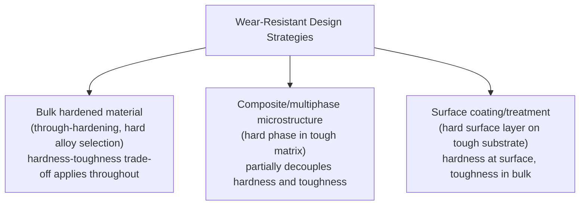
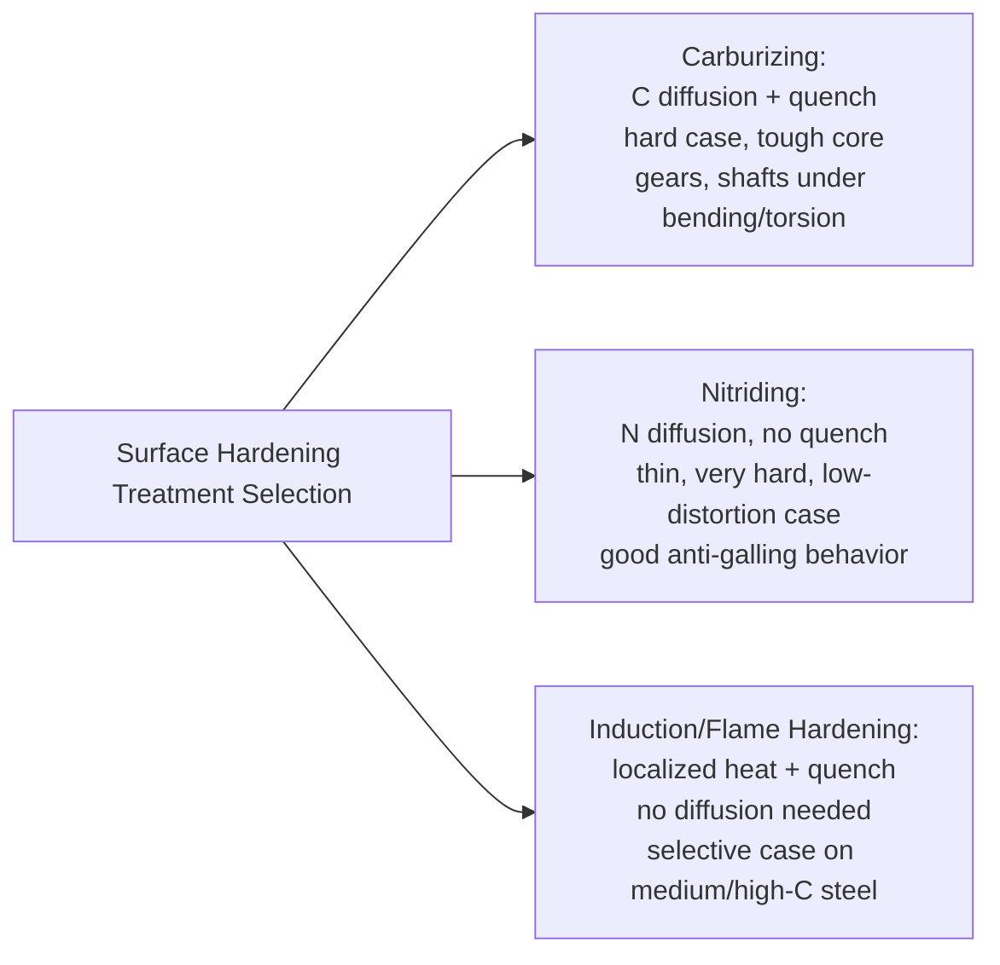

## Wear Resistant Materials and Coatings

### Overview

Wear-resistant materials and coatings represent the engineering response to the wear mechanisms established previously (adhesive, abrasive, fatigue, erosive). No single material or coating system resists all wear mechanisms equally well — selection depends on matching the material's specific properties (hardness, toughness, microstructure) and the coating's specific deposition characteristics to the dominant wear mechanism, contact conditions, and service environment expected at the component surface.

### Fundamental Material Property Considerations

**Key Points**

- **Hardness** is the single most broadly applicable property for wear resistance, particularly against abrasive wear, following the general hardness-ratio principles established under abrasive wear (resistance increases sharply once surface hardness approaches or exceeds abrasive particle hardness)
- **Toughness** (resistance to crack propagation) is equally critical, particularly for erosive wear against brittle materials and for any wear mechanism operating under impact loading — a material that is extremely hard but insufficiently tough can suffer brittle chipping or spalling under impact, potentially performing worse in service than a somewhat softer but tougher alternative
- The **hardness-toughness trade-off** is a near-universal constraint in monolithic materials: increasing hardness (via heat treatment, alloying, or microstructure control) frequently reduces toughness, so wear-resistant material selection typically involves balancing these two properties against the specific combination of abrasion, impact, and fatigue loading expected in service, rather than simply maximizing hardness
- **Microstructural approaches to escaping this trade-off** include composite/multiphase microstructures (hard, wear-resistant phases embedded in a tougher, more ductile matrix) and coatings/surface treatments that place a hard wear-resistant layer over a tough bulk substrate, allowing the two properties to be optimized somewhat independently at different length scales within the component

### Wear-Resistant Bulk Alloys

**High-Manganese (Hadfield) Steel**

**Key Points**

- An austenitic steel (typically ~12–14% manganese, ~1–1.4% carbon) that is soft and relatively tough in its as-cast/solution-annealed condition but exhibits pronounced **work hardening** at the surface under impact or heavy abrasive loading, developing very high surface hardness precisely where wear demand is greatest while retaining a tough, ductile core
- The work-hardening mechanism is generally attributed to a combination of deformation-induced twinning and, in some conditions, strain-induced martensitic transformation within the austenitic matrix, though [Inference] the precise relative contribution of these mechanisms is understood to vary with strain rate, temperature, and alloy composition, and remains an area of ongoing metallurgical study rather than a single fully settled mechanism
- Classic applications: railway track components (crossings, switches), rock crusher jaws and mantles, ball and rod mill liners, and other high-impact abrasive-wear service where the combination of impact toughness and surface work-hardening response is specifically advantageous — notably, Hadfield steel performs comparatively poorly in low-impact, pure sliding abrasion service where the work-hardening mechanism is not effectively activated

**White Cast Irons**

**Key Points**

- Contain a high volume fraction of hard, brittle iron carbides (cementite, $Fe_3C$) within a martensitic or pearlitic matrix, achieved by suppressing graphite formation during solidification (via composition control and cooling rate, in contrast to gray or ductile iron)
- **High-chromium white irons** (typically 12–30% chromium) form chromium-rich $M_7C_3$ carbides rather than cementite, which are both harder and more discretely distributed (rather than the continuous carbide network characteristic of unalloyed white iron), providing a better balance of abrasion resistance and impact toughness, along with improved corrosion resistance from the chromium content
- Excellent resistance to low-impact, high-abrasion service (ball mill liners, slurry pump components, pulverizer parts) but generally unsuitable for high-impact service due to inherent brittleness relative to austenitic manganese steel

**Tool Steels and Hardfacing Alloys**

**Key Points**

- Conventional tool steels (e.g., D2, A2, and various high-speed steel grades) achieve wear resistance through a combination of high hardness (via heat treatment) and a distribution of hard carbide phases (chromium, vanadium, tungsten, molybdenum carbides depending on grade) within a hardened martensitic matrix, widely used for cutting tools, dies, and wear parts requiring dimensional precision and moderate toughness alongside high hardness
- **Hardfacing alloys** are specifically formulated compositions (often high-chromium iron-based, cobalt-based, or nickel-based, frequently with substantial carbide-forming elements) designed for deposition via welding processes onto a tougher base metal substrate, providing a thick, metallurgically bonded wear-resistant surface layer while preserving substrate toughness — commonly used for rebuilding and protecting components subject to severe abrasive or abrasive-impact wear (bucket teeth, crusher components, agricultural tillage tools)

### Surface Hardening Treatments

**Key Points**

- **Carburizing**: diffusion of carbon into the surface of a low-carbon steel at elevated temperature, followed by quenching to form a hard, high-carbon martensitic case over a tougher, lower-carbon core — widely used for gears, shafts, and other components requiring both surface wear/fatigue resistance and core toughness/fatigue resistance under bending or torsional loading
- **Nitriding**: diffusion of nitrogen into the steel surface at relatively lower temperature (typically without subsequent quenching, avoiding the distortion risk associated with the carburizing/quench cycle), forming hard nitride phases at the surface; generally produces a thinner but often harder case than carburizing, with good wear resistance and, notably, good resistance to certain adhesive wear/galling scenarios due to the nitride layer's low tendency toward metal-to-metal adhesion
- **Induction and flame hardening**: localized, rapid heating (via induction coil or flame) of only the near-surface region of a medium-to-high carbon steel component, followed by rapid quenching, producing a hardened case with minimal distortion and without requiring a diffusion treatment, since the base material already contains sufficient carbon for hardening — commonly applied to shafts, gear teeth, and other components where selective, localized hardening (e.g., only at bearing journals or gear tooth flanks) is desired
- **Carbonitriding**: a combined diffusion treatment introducing both carbon and nitrogen simultaneously, producing case properties intermediate between pure carburizing and nitriding, often used as a lower-cost alternative for less demanding applications

### Thermal Spray Coatings

**Key Points**

- A family of processes (flame spray, plasma spray, high-velocity oxy-fuel/HVOF, arc spray) in which a coating material (metal, ceramic, or cermet — a metal-ceramic composite) is heated to a molten or semi-molten state and propelled onto a substrate, building up a coating through the accumulation of individually deposited, rapidly-solidified particles ("splats")
- **HVOF (High-Velocity Oxy-Fuel)** coatings, particularly **tungsten carbide-cobalt (WC-Co)** and **chromium carbide-nickel chromium (Cr3C2-NiCr)** cermet coatings, are widely regarded as offering an excellent combination of very high hardness, good bond strength, and relatively low porosity compared to older flame-spray processes, making them a leading choice for demanding abrasive and erosive wear applications (hydraulic components, pump shafts/sleeves, aerospace landing gear and actuator wear surfaces)
- **Plasma-sprayed ceramic coatings** (e.g., aluminum oxide, chromium oxide) provide excellent hardness and, in some formulations, good corrosion resistance, but generally exhibit greater inherent brittleness and higher porosity than HVOF cermet coatings, making them better suited to purely abrasive, lower-impact wear service than to impact-loaded applications
- [Inference] Coating porosity and bond strength are generally understood to be strongly influenced by the specific deposition process and parameters used (HVOF's high particle velocity generally producing denser, better-bonded coatings than lower-velocity flame spray processes), so a given coating chemistry's real-world performance depends substantially on the deposition method and process control used to apply it, not solely on the nominal coating composition

### Hard Chromium Plating

**Key Points**

- Electrodeposited chromium coating, distinct from thin decorative chromium plating in that it is applied at substantially greater thickness (typically tens to hundreds of micrometers) specifically for wear and corrosion resistance rather than appearance
- Provides high hardness and good resistance to adhesive wear and mild abrasive wear, historically widely used on hydraulic cylinder rods, piston rings, and similar sliding wear applications
- Known limitations include inherent micro-cracking within the deposited chromium layer (a characteristic feature of the electrodeposition process at typical hard chrome thicknesses), which can provide a path for corrosive attack to reach the substrate if the coating is breached, and environmental/regulatory concerns associated with hexavalent chromium electroplating processes, which have driven increasing adoption of HVOF thermal spray coatings (particularly WC-Co) as an alternative for many traditional hard chrome applications

### Diamond-Like Carbon (DLC) and PVD/CVD Coatings

**Key Points**

- **Diamond-Like Carbon (DLC)** coatings are amorphous carbon-based coatings (with varying proportions of sp3 "diamond-like" and sp2 "graphite-like" carbon bonding depending on deposition process and specific DLC variant) applied via physical or chemical vapor deposition, offering very high hardness, low friction coefficient, and good chemical inertness in a thin (typically sub-micrometer to a few micrometers) coating
- **PVD (Physical Vapor Deposition)** coatings, notably titanium nitride (TiN), titanium carbonitride (TiCN), and chromium nitride (CrN), are widely used on cutting tools and precision wear components, providing high surface hardness and, in the case of certain formulations, reduced friction and improved resistance to adhesive wear/built-up-edge formation in machining applications
- **CVD (Chemical Vapor Deposition)** coatings, including CVD diamond and various carbide/nitride coatings, generally achieve thicker, often harder coatings than comparable PVD coatings but typically require higher deposition temperatures, which can limit substrate material compatibility (particularly for substrates sensitive to the tempering-range temperatures involved)
- These thin, hard coatings are particularly well suited to precision components (cutting tool inserts, precision dies, small mechanical components) where the required coating thickness is small relative to component dimensions and tight dimensional tolerances must be preserved

### Coating and Material Selection Summary

| Wear Mechanism | Preferred Material/Coating Strategy |
| --- | --- |
| High-stress, high-impact abrasion | Austenitic manganese (Hadfield) steel — work hardens under impact |
| Low-impact, high abrasion (grinding, slurry) | High-chromium white iron, HVOF WC-Co or Cr3C2-NiCr coatings |
| Adhesive wear/galling | Nitriding, dissimilar material pairing, anti-galling coatings |
| Gear/shaft fatigue + wear (bending/torsion loaded) | Carburizing (case-core combination) |
| Precision component wear, cutting tools | PVD/CVD hard coatings (TiN, TiCN, CrN, DLC) |
| Hydraulic rods, sliding wear, moderate abrasion | Hard chromium plating or HVOF WC-Co (increasingly preferred) |
| Erosive wear (particle impingement) | Hard, tough coatings/alloys matched to ductile vs. brittle erosion regime |

### Related Topics

- Adhesive and Abrasive Wear
- Erosive and Corrosive Wear
- Fatigue Wear and Fretting
- Corrosion Resistant Coatings and Inhibitors
- Surface Hardening Metallurgy (carburizing, nitriding transformation mechanisms)
- Tribological Testing Methods (ASTM G65, pin-on-disk, Taber abraser)
- Cermet and Composite Coating Deposition Processes (HVOF, plasma spray, PVD/CVD)