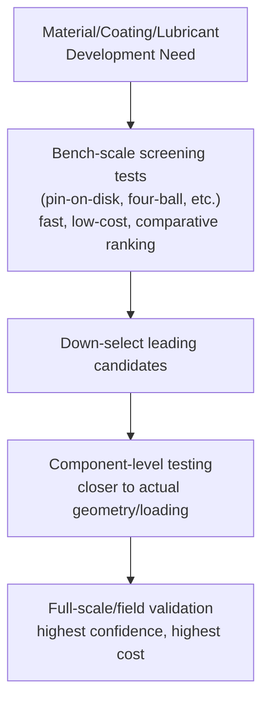

## Tribological Testing Methods

### Overview

Tribological testing evaluates friction, wear, and lubrication performance under controlled, typically simplified, contact conditions before a material, coating, or lubricant is committed to full-scale service. Because tribological behavior is a system property (depending on the specific material pair, contact geometry, environment, and operating conditions) rather than an intrinsic material property, test method selection and careful interpretation of results relative to actual service conditions are especially critical — a wear coefficient or friction value measured in one test geometry does not automatically transfer to a different contact configuration or loading regime.

### General Principles of Tribological Test Design

**Key Points**

- The most fundamental and widely emphasized principle in tribological testing is that results are strongly dependent on the specific test conditions (contact geometry, load, speed, temperature, environment, surface finish, and material pairing) — this is often summarized by the observation that friction and wear are not simple material properties but properties of the entire tribological *system*
- **Bench-scale (model) tests** using standardized, simplified geometries (pin-on-disk, four-ball, etc.) are widely used for material screening, ranking, and comparative evaluation, and for fundamental mechanistic studies, but generally provide only qualitative or comparative guidance for predicting absolute wear rates or service life in a specific real-world application
- **Component and full-scale tests** more closely replicate actual service contact geometry, loading, and environment, providing higher confidence for direct service-life prediction, but at substantially greater cost, time, and complexity than bench-scale screening tests
- [Inference] A common and generally sound testing strategy is to use bench-scale tests for initial material/coating/lubricant screening and mechanistic understanding, reserving more expensive component or full-scale testing for final validation of the leading candidates identified through screening — though the appropriate balance between screening and validation testing depends on the criticality of the application and the degree to which bench-scale results have been previously correlated to service performance for similar systems

### Sliding Wear and Friction Tests

**Pin-on-Disk Test**

**Key Points**

- One of the most widely used general-purpose sliding wear and friction tests: a stationary pin (or ball) is pressed against a rotating disk under a controlled normal load, with friction force, wear volume/mass loss, and coefficient of friction recorded over a defined sliding distance
- Standardized under **ASTM G99**, allowing systematic variation of load, speed, sliding distance, lubrication condition, and material pair to characterize a given combination's wear coefficient (often reported in Archard-equation terms) and friction behavior
- Widely used for comparative ranking of candidate materials, coatings, and lubricants under controlled, repeatable conditions, and for fundamental studies of wear mechanism transitions (e.g., mild-to-severe wear transitions, oxidative wear regime boundaries)

**Reciprocating (Ball-on-Flat) Wear Testing**

**Key Points**

- A ball or pin slides back and forth (reciprocates) against a flat specimen under controlled load, frequency, and stroke length, rather than the continuous unidirectional motion of pin-on-disk testing
- Better represents reciprocating service conditions (e.g., piston ring/cylinder liner contact, certain reciprocating machinery components) and is commonly used for lubricant and coating evaluation under conditions more representative of boundary/mixed lubrication regimes with direction reversal

### Extreme Pressure and Lubricant Performance Tests

**Four-Ball Test**

**Key Points**

- A standardized lubricant test geometry in which three stationary balls are clamped together in a cup and a fourth ball is rotated against them under load, with lubricant flooding the contact zone
- **Four-Ball Wear Test** (ASTM D4172): conducted at a fixed, moderate load for a defined duration, with the resulting wear scar diameter on the stationary balls used as a comparative measure of the lubricant's anti-wear performance — smaller wear scars indicate better anti-wear additive performance
- **Four-Ball EP (Extreme Pressure) Test** (ASTM D2783 and related methods): load is progressively increased until welding/seizure of the balls occurs, with the **load wear index (LWI)** and **weld point** load reported as comparative measures of the lubricant's extreme-pressure additive performance under severe boundary lubrication conditions
- Widely used in lubricant formulation development and specification for gear oils, greases, and metalworking fluids, given the standardized, well-characterized, and relatively rapid nature of the test

**Timken Test**

**Key Points**

- A lubricant EP performance test (ASTM D2782) in which a rotating test cup is loaded against a stationary test block, with load progressively increased in a series of test runs until scoring/failure of the block surface occurs
- The maximum load sustained without scoring (the "Timken OK Load") provides a comparative EP performance rating, historically widely used in gear oil and industrial lubricant specification alongside or as an alternative to four-ball EP results

**FZG Gear Test**

**Key Points**

- A back-to-back gear test rig (widely standardized in various forms, e.g., DIN 51354, ISO 14635) that evaluates lubricant scuffing (scoring) load capacity and, in some test variants, micropitting resistance, using actual meshing gear teeth rather than a simplified point/line contact geometry
- Provides results more directly relevant to actual gear lubrication performance than the four-ball or Timken tests, since it replicates the combined rolling-sliding contact and varying contact conditions actually experienced across a gear tooth mesh cycle, though at correspondingly greater test complexity and cost than the simpler bench tests

### Abrasive Wear Tests

**Dry Sand/Rubber Wheel Abrasion Test**

**Key Points**

- Standardized under **ASTM G65**: a test specimen is pressed under controlled load against a rotating rubber-rimmed wheel while a controlled flow of dry sand (a specific standardized silica sand grade) is fed into the contact zone, providing a reproducible three-body abrasive wear condition
- Widely used for ranking and specifying abrasion-resistant materials (hardfacing alloys, wear plate, white cast irons, and similar) intended for earthmoving, mining, and agricultural abrasive service, given its good representativeness of relatively coarse, dry, three-body mineral abrasion
- Results are typically reported as volume loss under a specified standard procedure (varying load and sand exposure duration/method across several defined procedure variants within the standard)

**Taber Abraser Test**

**Key Points**

- Standardized under **ASTM D4060** (and related standards for specific material classes such as coatings and plastics): abrasive wheels of controlled type and grit are rotated against a flat rotating specimen under controlled load, with mass loss measured after a specified number of cycles
- Widely used for coatings, paints, plastics, and flooring materials, providing a comparative abrasion resistance ranking under two-body abrasive contact conditions distinct from the three-body dry-sand-rubber-wheel configuration

### Erosion and Cavitation Tests

**Key Points**

- **ASTM G76** (solid particle erosion test): a controlled stream of abrasive particles entrained in a gas jet is directed at a test specimen at a specified velocity and impingement angle, allowing systematic evaluation of erosion rate as a function of impingement angle (relevant to the ductile vs. brittle erosion behavior established previously) and comparative material ranking for particle erosion resistance
- **ASTM G32** (vibratory cavitation erosion test): a specimen is vibrated at ultrasonic frequency in a liquid bath (or held stationary near a vibrating horn), inducing cavitation bubble formation and collapse at the specimen surface, with mass loss over time used to rank cavitation erosion resistance of candidate materials and coatings

### Corrosion-Coupled Tribological Testing

**Key Points**

- Where wear and corrosion act synergistically (erosion-corrosion, fretting corrosion, corrosive wear), test methods increasingly combine mechanical wear apparatus with controlled corrosive/electrochemical environments (e.g., a pin-on-disk or reciprocating wear test conducted within a corrosive electrolyte, sometimes with simultaneous electrochemical potential control or monitoring) to properly capture the combined damage rate rather than testing each mechanism in isolation
- [Inference] Because erosion-corrosion and similar synergistic mechanisms can produce combined damage rates substantially exceeding the simple sum of separately-measured mechanical wear and corrosion rates, purely mechanical (dry) wear testing or purely electrochemical corrosion testing conducted independently is generally understood to be insufficient for reliably predicting service performance in systems where such synergy is expected, making combined/simultaneous test methods the more appropriate approach for those specific applications

### Fretting Test Methods

**Key Points**

- Fretting-specific test rigs impose controlled small-amplitude oscillatory relative displacement (typically in the micrometer range) between a test specimen and a counter-body under controlled normal load and frequency, distinct from the larger-stroke reciprocating wear tests described above
- Tests are typically designed to characterize behavior across the partial-slip to gross-slip transition (relevant to the fretting damage mechanisms discussed previously) and, for fretting fatigue evaluation specifically, combine the fretting contact with a superimposed cyclic bulk stress on the specimen to directly assess the reduction in fatigue strength caused by the fretting contact — an approach necessary because standard (non-fretted) fatigue testing does not capture this specific, often dominant, failure mode in clamped/fitted joint applications

### Test Method Selection Summary

| Test Method | Standard | Primary Purpose |
| --- | --- | --- |
| Pin-on-disk | ASTM G99 | General sliding wear/friction screening and ranking |
| Reciprocating ball-on-flat | Various (e.g., ASTM G133) | Reciprocating sliding wear, lubricant/coating evaluation |
| Four-ball wear/EP | ASTM D4172 / D2783 | Lubricant anti-wear and extreme-pressure performance |
| Timken | ASTM D2782 | Lubricant EP performance (gear/industrial oils) |
| FZG gear test | DIN 51354 / ISO 14635 | Gear lubricant scuffing and micropitting resistance |
| Dry sand/rubber wheel | ASTM G65 | Three-body abrasive wear resistance ranking |
| Taber abraser | ASTM D4060 | Two-body abrasive wear (coatings, plastics, flooring) |
| Solid particle erosion | ASTM G76 | Erosion rate vs. impingement angle, particle erosion ranking |
| Vibratory cavitation | ASTM G32 | Cavitation erosion resistance ranking |
| Fretting/fretting fatigue rigs | Various (no single universal standard) | Fretting wear, fretting corrosion, fretting fatigue strength reduction |

### Related Topics

- Fundamentals of Friction
- Adhesive and Abrasive Wear
- Fatigue Wear and Fretting
- Erosive and Corrosive Wear
- Lubrication Regimes
- Wear Resistant Materials and Coatings
- Corrosion Testing and Monitoring (for combined wear-corrosion test approaches)