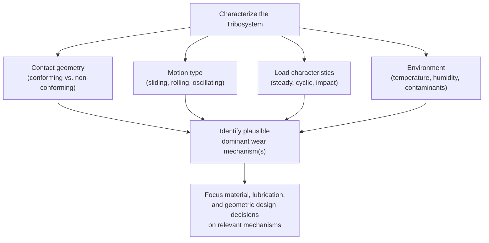
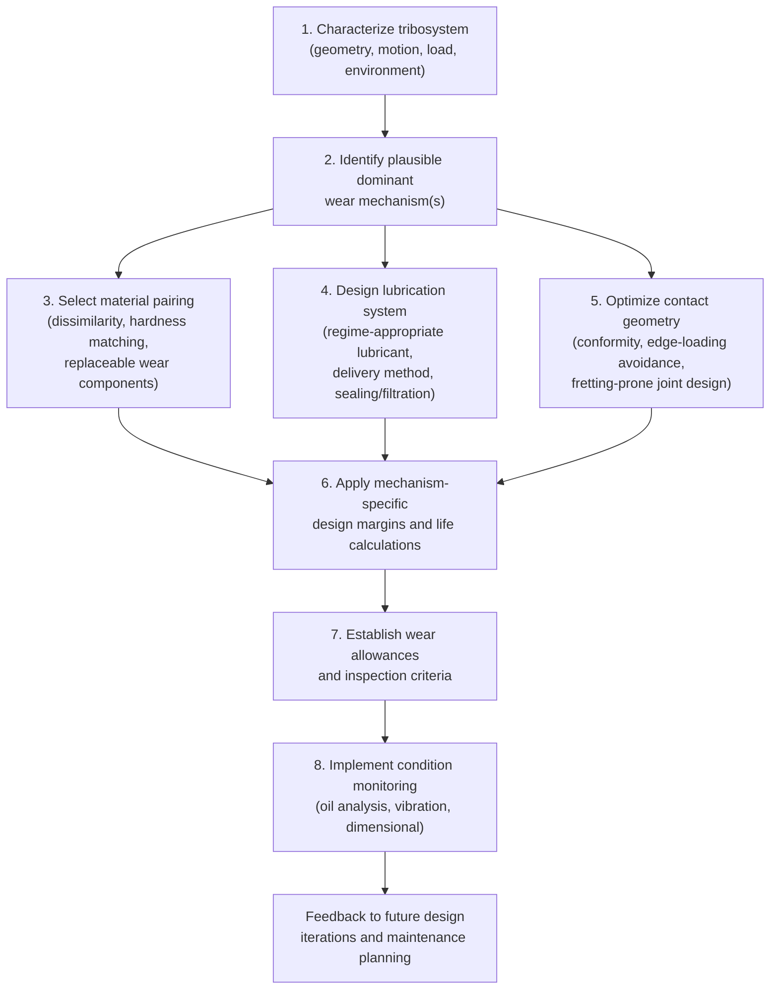

## Tribology in Engineering Design

### Overview

Tribology in engineering design is the systematic application of friction, wear, and lubrication principles to component and system design decisions — material pairing, geometry, lubrication strategy, and maintenance planning — rather than addressing wear failures reactively after they occur. This synthesizes the mechanistic and testing knowledge from preceding topics (friction fundamentals, wear mechanisms, lubrication regimes, wear-resistant materials, and testing methods) into a practical design framework.

### Tribological System Analysis

**Key Points**

- A central principle in design-stage tribology is treating the **tribological system (tribosystem)** as the unit of analysis, rather than any single component in isolation — the tribosystem encompasses both contacting bodies, any interfacial medium (lubricant, contaminant, or ambient atmosphere), and the surrounding environment (temperature, humidity, corrosive species)
- Systematic tribological design typically begins with characterizing the tribosystem's operating parameters before any material or lubricant selection is made: contact geometry (conforming vs. non-conforming), relative motion type (sliding, rolling, rolling-sliding, oscillating/fretting), load magnitude and variability (steady, cyclic, impact), relative velocity range, temperature range, and environmental exposure (humidity, contamination, corrosive species)
- This upfront characterization determines which wear mechanisms are plausible for the application (e.g., a non-conforming rolling contact under cyclic load points toward fatigue/pitting as the dominant concern and EHL as the relevant lubrication regime, whereas an oscillating low-amplitude bolted joint points toward fretting), which in turn focuses subsequent material, lubricant, and geometric design decisions on the mechanisms actually relevant to that specific application rather than attempting to defend against every possible wear mode generically

### Material Pairing Strategy

**Key Points**

- **Dissimilar material selection** is a foundational design lever established across the wear mechanism topics: pairing dissimilar, mutually insoluble materials (e.g., steel against bronze, or hardened steel against a polymer bearing material) generally reduces adhesive wear and galling tendency relative to like-on-like metal pairs, while a sufficient hardness differential (with the harder material chosen based on which component is more difficult/costly to replace) can direct wear preferentially toward the more easily replaceable, softer component
- **Hardness matching for abrasive service**: per the hardness-ratio principle established under abrasive wear, when abrasive contamination is anticipated, both contacting surfaces (not just one) should generally be hardened where practical, since a hard-on-soft pairing in an abrasive environment simply relocates rapid wear to the softer member rather than eliminating it
- **Replaceable wear component design**: a widely applied design strategy is deliberately concentrating expected wear onto an inexpensive, easily replaceable component (a bushing, wear plate, sacrificial liner, or similar) rather than allowing wear to occur on a more expensive, harder-to-replace structural component — this converts a wear problem into a scheduled maintenance/replacement item, generally a more economically favorable outcome than protecting the expensive component alone and risking wear-related failure of a component that cannot be conveniently serviced

### Lubrication System Design

**Key Points**

- Lubricant and lubrication method selection should be matched to the anticipated dominant lubrication regime for the tribosystem (per the Stribeck curve framework established previously) — a non-conforming rolling-sliding contact under high pressure calls for EHL-appropriate lubricant viscosity and pressure-viscosity behavior, while a heavily loaded, low-speed sliding contact calls for boundary/EP-additive-appropriate lubricant formulation
- **Lubricant delivery method** (splash/bath lubrication, forced circulation, grease packing, oil mist, once-through/loss lubrication) should be selected based on accessibility for maintenance, contamination risk, operating temperature, and the specific film-replenishment demand of the application — e.g., a fully enclosed gearbox is well suited to splash or forced-circulation oil lubrication with integrated filtration, whereas an open, difficult-to-access, low-speed pivot point may be better served by long-life grease
- **Seals and contamination exclusion** are an integral part of lubrication system design rather than an afterthought, given the established sensitivity of both abrasive wear (three-body particle ingress) and rolling contact fatigue life (lubricant cleanliness) to contamination — seal selection must itself account for tribological considerations, since seals are themselves a sliding/rotating tribological contact subject to their own wear
- [Inference] A frequently cited principle in machinery reliability engineering is that lubricant contamination (particulate and water ingress) is a leading practical contributor to premature wear-related failures in properly designed lubricated machinery, which is why contamination control (sealing, filtration, and lubricant sampling/monitoring programs) is generally considered as significant a design lever as the initial lubricant selection itself, though the relative contribution of contamination versus other factors will vary by application and cannot be quantified as a single universal figure

### Geometric and Contact Design Considerations

**Key Points**

- **Conforming vs. non-conforming contact geometry** is a fundamental design choice affecting achievable lubrication regime and contact stress: conforming contacts (journal bearings, large-radius contacts) can achieve full hydrodynamic separation at comparatively lower contact pressure, while non-conforming contacts (gear teeth, rolling-element bearings) concentrate load into a small area, requiring EHL film formation and making fatigue (pitting/spalling) a primary design concern
- **Edge loading and stress concentration avoidance**: sharp geometric transitions, misalignment, and edge contact conditions (e.g., a roller bearing or gear tooth edge carrying disproportionate load due to misalignment or insufficient crowning) concentrate contact stress and can dramatically reduce fatigue life relative to the nominal, well-distributed contact condition assumed in standard bearing/gear life calculations — crowning (a slight geometric modification of contact surfaces) is a common design feature specifically intended to accommodate minor misalignment without edge-loading concentration
- **Fretting-prone joint design**: as established under fretting mechanisms, bolted, press-fit, and similarly clamped joints subject to vibration or cyclic thermal expansion should be designed with sufficient clamping force/interference to minimize relative micro-motion, or with deliberate accommodation (compliant interlayers, reduced stress concentration at the joint edge) where eliminating motion entirely is impractical
- **Access for inspection and maintenance**: designing wear-critical components and lubrication points for practical accessibility (grease fittings, sight glasses, inspection ports, replaceable wear liners) directly supports the condition-monitoring and preventive maintenance strategies discussed below, and is frequently a decisive practical factor in whether a theoretically sound tribological design is actually maintained properly in service

### Failure Mode Anticipation and Design Margins

**Key Points**

- Effective tribological design anticipates the specific failure mode(s) established as plausible for the tribosystem (from the upfront system characterization) and applies appropriate design margins and material/lubricant choices specifically targeted at those modes, rather than relying on generic "make it harder" or "make it well-lubricated" approaches without mechanism-specific reasoning
- **Rolling contact fatigue life** (bearings, gears) is typically addressed through standard statistical life-rating methodologies (e.g., L10 bearing life) that explicitly incorporate load, speed, lubrication condition (via a lubrication adjustment factor in many bearing life calculation standards), and material cleanliness factors, reflecting the probabilistic, cumulative-damage nature of contact fatigue established previously
- **Boundary/mixed lubrication risk periods** (startup, shutdown, low-speed operation, momentary lubricant starvation) should be explicitly considered even in systems designed to operate predominantly in the hydrodynamic or EHL regime during normal steady-state operation, since these transient periods can dominate cumulative wear or determine component life if not specifically addressed (e.g., via appropriate boundary/EP additive selection even in a predominantly hydrodynamic system, or via controlled startup procedures)
- **Wear allowance and condition-based replacement criteria**: components subject to gradual wear (bushings, guide rails, brake/clutch friction materials) are typically designed with an explicit dimensional or performance wear allowance and a defined inspection/replacement criterion, converting an otherwise open-ended wear process into a bounded, manageable maintenance activity

### Condition Monitoring and Predictive Maintenance

**Next Steps**

- **Lubricant analysis (oil analysis) programs**: periodic sampling and analysis of in-service lubricant for wear metal content (via spectroscopic analysis), particulate contamination, viscosity change, and additive depletion provide an indirect but valuable indicator of internal component wear condition and lubricant degradation, often enabling detection of developing wear problems before they progress to functional failure
- **Vibration monitoring**: increasing vibration signature, particularly at characteristic frequencies associated with bearing defect progression, gear mesh irregularities, or looseness from wear-induced clearance increase, is a widely used condition-monitoring technique complementary to lubricant analysis, particularly for rotating machinery
- **Ultrasonic and dimensional wear monitoring**: direct measurement of remaining wear allowance (via ultrasonic thickness measurement, dimensional gauging, or visual/borescope inspection at accessible wear points) provides direct confirmation of wear progression against the design wear allowance established during the design phase
- **Ferrography and wear debris analysis**: detailed examination of wear debris morphology recovered from lubricant samples can provide diagnostic information about the specific wear mechanism actively occurring (e.g., distinguishing normal mild wear debris from more severe adhesive wear or rolling contact fatigue debris based on particle size, shape, and surface characteristics), supporting more targeted maintenance response than generalized condition trending alone

### Integrated Design Workflow Summary

### Related Topics

- Fundamentals of Friction
- Adhesive and Abrasive Wear
- Fatigue Wear and Fretting
- Erosive and Corrosive Wear
- Lubrication Regimes
- Wear Resistant Materials and Coatings
- Tribological Testing Methods
- Rolling-Element Bearing Design and L10 Life Rating
- Reliability Engineering and Predictive Maintenance Strategies