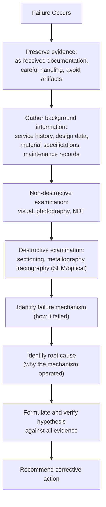

## Failure Analysis Methodology

### Overview

Failure analysis methodology is the systematic process of investigating a failed component to determine its root cause, distinguishing this disciplined approach from ad hoc inspection or premature conclusion-drawing. A rigorous methodology preserves evidence, follows a logical sequence from macro to micro examination, and distinguishes the failure's proximate mechanical mechanism from its underlying root cause — often a design, material, manufacturing, or service condition that enabled that mechanism to operate.

### General Principles of Failure Investigation

**Key Points**

- **Evidence preservation** is the foundational first principle: as-received documentation (photographs before any cleaning or sectioning), careful handling to avoid introducing artifacts (secondary damage from careless handling, cutting-induced heating, or corrosion from improper storage), and retention of all fracture surfaces and failed components in their as-received condition until the investigation plan is established
- **Sequential, non-destructive-before-destructive examination**: the investigation should generally proceed from non-destructive techniques (visual inspection, photography, non-destructive testing) to destructive techniques (sectioning, metallographic preparation) only after non-destructive evidence has been fully documented, since destructive examination is irreversible and can destroy evidence needed to answer questions that only become apparent later in the investigation
- **Avoiding premature conclusions**: a well-recognized pitfall in failure analysis is fixating on an initial hypothesis before sufficient evidence has been gathered, then selectively interpreting subsequent findings to support that hypothesis rather than following the evidence — a disciplined methodology maintains multiple working hypotheses until the evidence sufficiently discriminates between them
- **Distinguishing root cause from failure mechanism**: the failure mechanism (e.g., "fatigue crack propagation") describes *how* the component failed mechanically/metallurgically, while the root cause addresses *why* that mechanism was able to operate (e.g., a design stress concentration, a material defect, an unanticipated service load, or an assembly error) — a complete failure analysis identifies both, since corrective action requires knowing the root cause, not merely the mechanism

### Background Information Gathering

**Key Points**

- **Service history**: operating conditions (loads, temperatures, environment, duty cycle), time in service or number of loading cycles at failure, any known prior incidents or anomalies, and maintenance/inspection records for the specific component
- **Design information**: intended material specification, design loads and safety factors, drawings and tolerances, and the component's intended function within the larger system/assembly
- **Manufacturing history**: material certification/mill test reports, heat treatment records, welding procedures (if applicable), and any known process deviations or non-conformances during manufacture
- **Failure circumstances**: the specific conditions at the time of failure (was the equipment operating normally, was there a known upset condition, unusual load, or environmental exposure immediately preceding failure), and whether the failure was sudden/catastrophic or preceded by observable degradation (leaks, vibration, noise, reduced performance)
- [Inference] Background information gathering is frequently identified in failure analysis practice as being as important as, and sometimes more revealing than, the physical examination itself, since many root causes (a service condition outside design intent, a maintenance lapse, an undocumented design change) are only discoverable through this background research rather than through examination of the failed part alone — though the relative weight of background information versus physical evidence naturally varies with the specific failure and how much documentation exists

### Visual and Macroscopic Examination

**Key Points**

- Conducted first, before any destructive sectioning, using the naked eye, low-power magnification (magnifying glass, stereo/macro photography), and systematic photographic documentation from multiple angles and distances
- **Fracture surface examination** at the macro scale can already reveal significant diagnostic information: the general fracture surface texture (bright/crystalline suggesting brittle fracture, fibrous/dull suggesting ductile fracture), the presence of beach marks (curved arrest lines characteristic of fatigue, marking successive positions of a slowly advancing crack front), the presence of a distinct final-fracture (overload) zone versus a smoother, more slowly-propagated zone, and the general fracture path relative to the component geometry and loading direction
- **Overall component examination**: deformation (bending, necking, twisting) indicating overload or ductile failure, evidence of corrosion or environmental attack, evidence of wear or mechanical damage, weld quality and location relative to the fracture, and any secondary damage (from the failure event itself, from subsequent handling, or pre-existing and unrelated to the primary failure) that must be distinguished from the primary failure-causing damage
- Macroscopic examination generally guides the subsequent selection of sectioning locations and higher-magnification examination techniques, making thorough documentation at this stage important for planning the remainder of the investigation

### Fractographic Examination

**Key Points**

- **Optical (stereo) microscopy**: used for lower-magnification examination of fracture surface features, often as an intermediate step between macroscopic visual examination and higher-resolution electron microscopy, useful for identifying regions of interest for further, more detailed examination
- **Scanning Electron Microscopy (SEM)**: the primary high-resolution fractographic tool, providing high-magnification imaging with substantial depth of field (well suited to the irregular topography of fracture surfaces) and typically supplemented with **Energy-Dispersive X-ray Spectroscopy (EDS)** for compositional analysis of the fracture surface or of any foreign material/inclusions/corrosion products present
- Characteristic microscopic fracture features identifiable via SEM include **striations** (fine, closely-spaced parallel lines, each generally corresponding to a single load cycle in fatigue crack propagation, though not universally resolvable at all growth rates or in all materials), **dimples** (indicating microvoid coalescence, characteristic of ductile fracture), **cleavage facets** (flat, crystallographic fracture surfaces characteristic of brittle transgranular fracture), and **intergranular fracture surfaces** (revealing the grain boundary facets themselves, associated with intergranular corrosion, hydrogen embrittlement, or certain high-temperature creep/grain-boundary-sliding failure modes)
- [Inference] While these fractographic features are generally reliable diagnostic indicators when clearly present and well-documented, real fracture surfaces frequently show mixed or transitional features (e.g., regions transitioning between fatigue striations and final ductile overload dimples, or fracture surfaces partially obscured by post-failure rubbing, corrosion, or oxidation), so fractographic interpretation typically requires examining multiple regions of the fracture surface and correlating fractographic evidence with the macroscopic examination and metallurgical findings rather than relying on a single micrograph or feature in isolation

### Metallurgical and Materials Characterization

**Key Points**

- **Metallography**: sectioning through the fracture or a representative unfailed region, followed by mounting, grinding, polishing, and etching to reveal microstructure via optical microscopy — used to verify the material's actual microstructure against its specification (confirming correct heat treatment, grain size, absence of unexpected phases), to examine the crack path relative to microstructural features (intergranular vs. transgranular, association with specific phases or inclusions), and to assess for microstructural degradation (e.g., sensitization, overheating, decarburization)
- **Hardness testing**: comparing measured hardness against the material specification's expected range, providing a rapid indication of whether the material received the intended heat treatment or whether unexpected softening (overheating, tempering) or hardening (untempered martensite, work hardening) occurred
- **Chemical composition analysis**: confirming the material's actual chemical composition matches its specification, ruling out (or identifying) material substitution or composition-related metallurgical issues as a contributing factor
- **Mechanical property verification**: tensile, impact (Charpy), or other mechanical testing on material recovered from the failed component or from an exemplar/sister component, where sufficient material is available and testing is warranted, to verify whether the material met its specified mechanical property requirements

### Stress Analysis and Root Cause Correlation

**Key Points**

- Physical and metallurgical evidence is correlated with an engineering assessment of the stresses the component actually experienced — this may involve simple hand calculations, more detailed finite element analysis, or comparison against known design stress levels, depending on the failure's complexity and consequence
- The objective is to establish whether the identified failure mechanism is consistent with the calculated/estimated stress state and the material's known properties — for example, confirming that a fatigue failure's crack initiation location corresponds to a location of calculated or measured stress concentration, or confirming that an overload failure's fracture stress is consistent with the material's actual (as-tested) strength and the loads the component is known or believed to have experienced
- This correlation step is essential to converting a plausible-looking mechanism into a well-supported conclusion, and often reveals whether the root cause lies in the design (insufficient margin, unanticipated stress concentration), the material (substandard properties, defects), the manufacturing process (residual stress, improper heat treatment, poor weld quality), or the service conditions (loads or environment outside the original design basis)

### Hypothesis Formulation, Testing, and Reporting

**Key Points**

- A rigorous methodology treats the failure investigation as a process of hypothesis formulation and testing against evidence, rather than working backward from an assumed conclusion — competing hypotheses (e.g., fatigue versus overload, versus a material defect, versus an environmental mechanism) are evaluated against the full body of evidence (background information, macroscopic, fractographic, and metallurgical findings, and stress analysis) until the evidence sufficiently discriminates between them
- **Consistency check**: a sound conclusion should be consistent with *all* the collected evidence, not merely the evidence that supports the favored hypothesis — unexplained or apparently contradictory evidence should be actively investigated rather than dismissed, since it may indicate either an error in the analysis or an additional contributing factor not yet identified
- The final failure analysis report typically documents the background information, the examination methodology and findings at each stage, the identified failure mechanism and root cause (with the supporting evidence explicitly linked to each conclusion), and recommended corrective actions — with a clear logical chain from evidence to conclusion that another qualified investigator could follow and evaluate independently

### Common Pitfalls in Failure Analysis

**Key Points**

- **Confirmation bias**: allowing an initial, often intuitively appealing hypothesis (e.g., "it must be a material defect" or "it must be operator error") to bias the collection and interpretation of subsequent evidence, rather than maintaining genuinely open competing hypotheses until the evidence discriminates between them
- **Insufficient background information**: proceeding directly to physical examination without adequately gathering service history, design basis, and manufacturing records, potentially missing root causes that are only evident from this contextual information
- **Destructive examination before adequate non-destructive documentation**: sectioning or otherwise destructively examining evidence before fully documenting and photographing the as-received condition, potentially destroying evidence relevant to questions that arise later in the investigation
- **Conflating mechanism with root cause**: reporting only the proximate mechanical mechanism (e.g., "fatigue fracture") without identifying and reporting the underlying root cause that allowed that mechanism to operate, which limits the practical value of the analysis for preventing recurrence
- **Overgeneralizing from limited evidence**: drawing a firm conclusion from a single fracture surface feature, a single micrograph, or a single data point without corroborating evidence from multiple examination techniques and multiple locations on the failed component

### Related Topics

- Fracture Types: Ductile vs. Brittle Fracture
- Fatigue Failure Mechanisms and Fractography
- Stress Corrosion Cracking and Hydrogen Embrittlement (as failure mechanisms in failure analysis context)
- Fractography and Microscopy Techniques (SEM, EDS, optical metallography)
- Root Cause Analysis Methodologies
- Non-Destructive Testing Methods
- Materials Specifications and Quality Assurance/Traceability