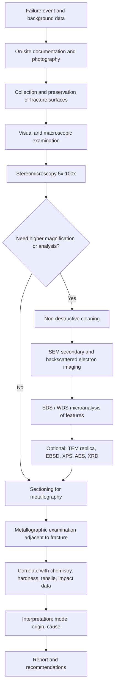

## Fractographic Examination Techniques

Fractography is the systematic study of fracture surfaces to determine the mode of failure, the initiation site, the direction and mechanism of crack propagation, and the contributing causes (material, stress, environment, processing). This reference covers the full examination workflow from field observation and specimen handling through macroscopic, light-optical, electron-optical, and analytical techniques, up to interpretation and reporting.

### 1. Objectives and Principles

**Key Points**

- Fracture surfaces record the history of crack initiation, propagation, and final separation; the surface is *evidence* and must be preserved before any interpretation.
- Examination proceeds from **low magnification to high magnification** and from **non-destructive to destructive** methods. Each step is documented before proceeding to the next.
- The goals of fractography are:
  1. Identify the **fracture mode** (ductile overload, brittle cleavage, intergranular, fatigue, creep rupture, environmentally assisted cracking, etc.).
  2. Locate the **fracture origin(s)** and the **crack propagation direction**.
  3. Estimate the **relative magnitude of applied stress** and stress concentration.
  4. Detect **material or processing anomalies** (inclusions, porosity, segregation, weld defects, heat-treatment flaws, coating damage).
  5. Detect **environmental contributions** (corrosion products, hydrogen, liquid metal, high temperature oxidation).
- Fractography is one part of a broader failure investigation; conclusions should be corroborated by metallography, chemical analysis, mechanical testing, and stress analysis.

### 2. Examination Workflow

The following flowchart summarizes the recommended sequence.

### 3. Evidence Collection and Preservation

#### 3.1 Documentation Before Handling

- Photograph the failed component **in situ**, including surrounding parts, service environment, damage patterns, corrosion deposits, and witness marks.
- Record part identification, service history, operating conditions (load, temperature, environment, time in service), maintenance records, and any prior repairs.
- Use scale bars, orientation markers, and consistent lighting. Document both mating fracture halves.

#### 3.2 Handling Rules

- **Never fit the mating fracture surfaces back together.** Contact damages fine features (fatigue striations, microvoids) and can destroy the origin.
- Handle only by non-fracture areas using clean, powder-free gloves; avoid touching fracture surfaces.
- Do not clean fracture surfaces until they have been fully documented in the as-received condition. Loose debris, deposits, and corrosion products are evidence.
- Protect surfaces from moisture, fingerprints, and mechanical contact.

#### 3.3 Preservation Methods

| Situation | Recommended Practice |
| --- | --- |
| Short-term storage | Wrap in non-abrasive, non-acidic tissue or place in individual bags; store in desiccator |
| Long-term storage | Desiccator or dry nitrogen cabinet; vapor-phase corrosion inhibitor (VPI) packaging if compatible with later analyses |
| Corrosion-prone steel surfaces | Coat lightly with a removable lacquer (e.g., clear acrylic) or use desiccant; verify compatibility with later SEM/EDS |
| Field cutting | Cut **far** from the fracture (by abrasive saw with coolant or by saw); avoid torch cutting near the fracture because heat alters microstructure and surface features |
| Large components | Cut a section containing the origin region; mark orientation and location before removal |

**Key Points**

- Record how and where the specimen was removed, cutting method, and any cleaning done.
- If liquid-metal, hydrogen, or chloride involvement is suspected, do not wash with water; preserve deposits for analysis.

### 4. Visual and Macroscopic Examination

Macroscopic (naked eye to ~10×) examination provides the framework for all later steps.

#### 4.1 What to Observe

- Overall fracture plane orientation relative to the principal stress axis (e.g., 90° to axis for tensile overload, 45° for shear).
- **Ductility indicators:** necking, gross plastic deformation, shear lips, fibrous appearance.
- **Brittle indicators:** flat, granular, shiny surface with little deformation; **chevron (herringbone) marks** pointing back to the origin; **radial marks**.
- **Fatigue indicators:** beach marks (clamshell marks), ratchet marks, a smooth thumbnail-shaped initiation region, and a rougher final fracture region.
- **Environmental indicators:** discoloration, oxides, deposits, intergranular facets, multiple branched cracks.
- Surface condition: machining marks, decarburization, weld toes, notches, corrosion pits, fretting damage, mechanical damage.

#### 4.2 Macroscopic Fracture Features

| Feature | Appearance | Significance |
| --- | --- | --- |
| Beach marks | Concentric arcs around the origin | Cyclic loading with variable amplitude or load interruptions; indicates fatigue |
| Ratchet marks | Small steps on the surface at the periphery | Multiple fatigue origins linking up; indicates high stress concentration |
| Chevron marks | V-shaped lines pointing toward origin | Rapid (brittle) crack propagation direction; **apex points to origin** |
| Radial marks | Lines radiating from the origin | Fast fracture direction, common in brittle fracture |
| Shear lips | 45° angled edges at the surface | Plane-stress final fracture, ductile behavior |
| Fibrous zone | Dull, rough, gray zone | Slow, ductile crack growth |
| Radial zone | Radiating ridges | Fast fracture region in a tensile test specimen |
| Woody or laminar fracture | Fibrous, split along planes | Anisotropy from banding, rolling, or inclusion stringers |

#### 4.3 Cup-and-Cone Tensile Fracture

A classical ductile tensile fracture in round bars consists of three zones: **fibrous zone** at the center (initiation by microvoid coalescence), **radial zone** (rapid crack growth), and the **shear lip** (final fracture at ~45°). The relative sizes of these zones are influenced by strength, temperature, and strain rate.

### 5. Stereomicroscopy and Light-Optical Techniques

#### 5.1 Stereomicroscope (Low-Power Optical Microscope)

- Typical range: **5× to 100×**; large depth of field and 3D perception make it the primary tool for locating fracture origins.
- Use oblique, ring, and fiber-optic illumination to reveal surface relief; polarized light can reduce glare on shiny surfaces.
- Capture images with calibrated scale bars, including entire fracture surfaces and close-ups of origins.

#### 5.2 Reflected-Light Microscopy (Metallographic Microscope)

- Magnification up to ~1000×, but a very shallow depth of field limits use on rough fracture surfaces.
- Extended-depth-of-field digital microscopes (focus stacking or z-stacking) partially overcome this limitation and produce all-in-focus composites and height maps.
- Also used for **metallographic cross sections** taken perpendicular to the fracture surface.

#### 5.3 Confocal Laser Scanning and White-Light Interferometry

- Provide quantitative 3D topography (roughness, height profiles) of fracture surfaces.
- Useful for measuring fracture surface roughness, which can be correlated with toughness and crack path tortuosity.

### 6. Scanning Electron Microscopy (SEM)

SEM is the primary tool for high-resolution fractography, offering both large depth of field (hundreds of times that of an optical microscope) and magnifications of roughly 20× to more than 100,000×.

#### 6.1 Operating Principles

An electron beam is rastered across the specimen. Interaction volume signals include:

- **Secondary electrons (SE):** low-energy electrons from the top few nanometers; provide **topographic contrast** (the standard fractography mode).
- **Backscattered electrons (BSE):** high-energy electrons whose yield depends on the atomic number $Z$; provide **compositional (Z) contrast** and are useful for locating inclusions, second phases, or corrosion deposits.
- **Characteristic X-rays:** used for elemental analysis (EDS/WDS).

The beam interaction depth increases with accelerating voltage and decreases with atomic number. A rough guide for the interaction volume range is the Kanaya–Okayama range:

$$R = \frac{0.0276\, A\, E_0^{1.67}}{Z^{0.89}\, \rho}$$

where $R$ is the electron range in micrometers, $A$ is the atomic weight (g/mol), $E_0$ is the beam energy (keV), $Z$ is the atomic number, and $\rho$ is the density (g/cm³).

#### 6.2 Practical SEM Settings for Fractography

| Parameter | Typical Choice | Rationale |
| --- | --- | --- |
| Accelerating voltage | 5–20 kV (lower for fine surface detail or charging samples; higher for EDS) | Balance surface sensitivity and X-ray excitation |
| Working distance | 10–25 mm for overview; shorter for high resolution | Depth of field vs. resolution |
| Detector | SE (Everhart–Thornley or in-lens) for topography; BSE for composition | Contrast mechanism selection |
| Tilt | 0° for standard imaging; tilt for 3D views or stereo pairs | Reveal relief |
| Probe current | Higher for EDS, lower for fine imaging | Signal-to-noise vs. beam damage/charging |
| Vacuum mode | High vacuum; low-vacuum/variable-pressure for non-conductive or contaminated samples | Charging control |

#### 6.3 Specimen Preparation for SEM

- Maximum specimen size depends on the chamber and stage; large parts must be sectioned.
- Remove loose contamination by **gentle** methods: dry compressed air/nitrogen blowing, soft brush, or ultrasonic cleaning in a solvent (acetone, isopropanol) if preservation of debris is no longer required.
- Non-conductive specimens (ceramics, polymers, composites) require **conductive coating** (Au, Au–Pd, Pt, or carbon; carbon is preferred when EDS is needed) or low-vacuum operation.
- Mount with conductive carbon tape, silver paint, or copper tape; ensure good electrical grounding to the stub.
- Document the specimen orientation on the stage to relate SEM images to macroscopic features.

#### 6.4 Cleaning Techniques and Their Risks

| Method | Use | Risk |
| --- | --- | --- |
| Dry air/N₂ blast, soft brush | Remove loose dust | Minimal |
| Solvent rinse (acetone, ethanol) | Remove oils and greases | May remove organic deposits of interest |
| Ultrasonic cleaning | Remove stubborn debris | Can damage delicate features (fine striations, fragile oxide layers) |
| Replica stripping (cellulose acetate tape softened with acetone) | Lift loose deposits without altering the underlying surface | May leave residues; multiple applications required |
| Chemical cleaning (e.g., inhibited acids, Clarke's solution) | Remove heavy corrosion products | **Alters or destroys surface features and evidence**; use only after complete documentation and on duplicate/sacrificial areas |
| Electrolytic cleaning | Corrosion product removal | Can etch grain boundaries and alter fine features |
| Plasma cleaning | Removes hydrocarbon contamination | Can modify very thin oxide films |

**Key Points**

- Always follow the principle of **least aggressive cleaning first**, and image the surface after each step.
- Corrosion products and deposits can hold the key to the failure cause (e.g., chlorides, sulfides); analyze them before removal.

### 7. Microscopic Fracture Modes and Their Features

The following features are identified at high magnification (SEM) and are diagnostic of the fracture mechanism.

#### 7.1 Ductile (Microvoid Coalescence)

- **Dimples:** cup-like depressions formed by nucleation, growth, and coalescence of microvoids, usually initiated at inclusions, second-phase particles, or carbides.
- Dimple shape depends on stress state:
  - **Equiaxed dimples:** uniaxial tension.
  - **Elongated (parabolic) dimples:** shear or tearing; parabolas point toward the origin on opposite fracture halves in a characteristic manner (in shear, they point in opposite directions on the mating surfaces; in tearing, they point in the same direction).
- Dimple size correlates with particle spacing and material ductility (finer dimples generally indicate a higher strength or finer particle distribution).

#### 7.2 Brittle Transgranular (Cleavage)

- **Cleavage facets:** flat, featureless planes cutting across grains along low-index crystallographic planes (e.g., {100} in BCC iron).
- **River patterns:** stepped lines on facets that converge in the direction of local crack propagation ("tributaries join downstream").
- **Tongues:** small features associated with twins and crack deflection at twin boundaries.
- **Fan patterns:** river patterns radiating from the origin.
- Typical of BCC metals (ferritic steels) at low temperature or high strain rate, and of HCP metals such as Zn and Mg.
- Quasi-cleavage: a mixed appearance with tear ridges around cleavage-like facets, common in tempered martensite and high-strength steels.

#### 7.3 Intergranular Fracture

- Grain facets with a "rock candy" appearance; grain boundaries are the fracture path.
- Causes include:
  - Temper embrittlement (P, Sn, Sb, As segregation)
  - Hydrogen embrittlement of high-strength steels
  - Stress-corrosion cracking (some systems)
  - Creep cavitation at high temperature
  - Grain boundary precipitates (e.g., sensitization in stainless steels)
  - Liquid metal embrittlement (e.g., Ga in Al, Cu in steel)
  - Overheating and burning (grain boundary melting)
- Fine surface details (e.g., particles or cavities on the boundary) help determine the mechanism.

#### 7.4 Fatigue

Fatigue fracture typically shows three stages:

1. **Initiation (Stage I):** at surface defects, stress raisers, inclusions, or subsurface flaws.
2. **Stable propagation (Stage II):** characterized by **fatigue striations**, each representing one load cycle (in many ductile alloys under appropriate conditions).
3. **Final overload fracture (Stage III):** ductile or brittle features.

**Fatigue striations:**

- Regularly spaced ripples perpendicular to the local crack growth direction.
- Spacing relates to crack growth per cycle, $da/dN$. In the Paris regime:

$$\frac{da}{dN} = C\,(\Delta K)^m$$

where $C$ and $m$ are material constants and $\Delta K = K_{max} - K_{min}$ is the stress intensity factor range.

- Measuring striation spacing at several locations allows an estimate of crack growth rate, and therefore an estimate of cycles to failure (with caveats).
- Striations may be absent in high-strength steels, in HCP metals, in very low $\Delta K$ regimes, and in high-cycle fatigue; other features (e.g., cleavage-like facets, ductile tearing, fine parallel steps) may appear instead.
- **Note:** striation spacing does not always equal $da/dN$ at very low $\Delta K$ or in complex load environments. [Inference] — the one-striation-per-cycle correspondence should be verified for each material and loading condition.

**Fatigue macroscopic classification by stress level and concentration**

| Condition | Beach Marks | Origins | Final Fracture Area |
| --- | --- | --- | --- |
| High nominal stress, low stress concentration | Present | Few (often one) | Large |
| Low nominal stress, high stress concentration | Present | Multiple (ratchet marks) | Small |
| Rotating bending | Present | Often single or multiple on surface; marks spiral against rotation | Offset from center |
| Unidirectional bending | Present | One side | Offset to the opposite side |
| Reversed bending | Present | Two opposite origins | Central |
| Torsional fatigue | 45° helical cracks (ductile) or star-shaped (brittle) | Surface | Varies |

#### 7.5 Creep Rupture

- Intergranular fracture with **cavities** at grain boundaries (r-type wedge cracks and w-type cavities).
- Extensive oxidation of the fracture surface, thick oxide scale, and bulging or swelling of the component.
- Mode depends on temperature and stress; at high stress the mode may shift toward transgranular ductile rupture.

#### 7.6 Environmentally Assisted Cracking

| Mechanism | Typical Features |
| --- | --- |
| Stress-corrosion cracking (SCC) | Branched cracks, brittle-appearing fracture with little deformation; intergranular or transgranular depending on the alloy/environment system; corrosion products at the crack |
| Hydrogen embrittlement | Intergranular or quasi-cleavage in high-strength steels; delayed failure under static load; "fish-eye" features in some cases |
| Corrosion fatigue | Multiple initiation sites from corrosion pits; transgranular; corrosion product on fatigue surface; striations may be obscured |
| Liquid metal embrittlement | Brittle intergranular or transgranular fracture with wetting-metal traces detected by EDS |
| Sulfide stress cracking | Brittle, hydrogen-related cracking in steels exposed to H₂S; check hardness limits |

#### 7.7 Other Modes

- **Wear and fretting:** polished areas, oxidized debris, and origin sites under contact.
- **Thermal fatigue:** networks of oxide-filled cracks (heat checking) at surfaces.
- **Impact and shock loading:** mixed features; brittle at low temperatures.
- **Ceramics and glasses:** **mirror, mist, hackle** regions surrounding the origin; the mirror radius relates to fracture stress:

$$\sigma_f \sqrt{R_m} = A_m$$

where $\sigma_f$ is the fracture stress, $R_m$ is the mirror radius, and $A_m$ is the mirror constant (material dependent).

- **Polymers and composites:** river marks, hackle, delamination, fiber pull-out, fiber/matrix debonding, and cusps in shear-loaded composites (cusp orientation indicates shear direction).

### 8. Fracture Origin Location and Crack Direction

Locating the origin is the most critical goal. Combine clues:

1. **Macro-features:** convergence of chevron marks or radial marks; center of beach marks; smallest arc of beach marks.
2. **Surface condition:** notches, tool marks, inclusions, weld defects, or corrosion pits near the apparent origin.
3. **Micro-features at the origin:** in the SEM, examine for inclusions, pores, or oxide films; check the origin for embedded second phases with EDS.
4. **Mating-surface matching:** compare the features across both halves for consistency.
5. **Secondary cracks:** their direction and branching indicate the local principal stress.

**Key Points**

- Never assume the origin is at the geometric center; interpret mode-specific features.
- In fatigue, check for **multiple origins** and **sub-surface origins** (e.g., inclusion-initiated "fish-eye" in very high cycle fatigue or case-hardened parts).

### 9. Elemental and Chemical Analysis Techniques

#### 9.1 Energy-Dispersive X-ray Spectroscopy (EDS/EDX)

- Attached to the SEM; provides qualitative and semi-quantitative composition of features (inclusions, deposits, corrosion products).
- Spot, line-scan, and **elemental mapping** modes.
- Limitations: poor detection of very light elements (H, He, Li; Be–C unreliable); overlaps (e.g., S K and Mo L, Pb M); analysis volume of ~1 µm³ depending on voltage; rough surfaces produce quantification errors.
- Use a lower kV or a polished cross section for more reliable quantification.

#### 9.2 Wavelength-Dispersive Spectroscopy (WDS)

- Higher spectral resolution and better detection limits than EDS; resolves peak overlaps; slower.

#### 9.3 Auger Electron Spectroscopy (AES) and X-ray Photoelectron Spectroscopy (XPS)

- **Surface-sensitive** (top ~1–5 nm); identify segregated species on grain boundaries (P, S, Sn, Sb) in intergranular fractures.
- AES requires in-situ fracture in ultra-high vacuum (UHV) for grain-boundary chemistry of embrittled specimens; XPS gives chemical state information.
- Together with depth profiling by ion sputtering, they map thin films and segregation layers.

#### 9.4 Other Techniques

| Technique | Purpose |
| --- | --- |
| X-ray diffraction (XRD) | Phase identification of corrosion products and scales |
| Raman spectroscopy | Identify oxide and corrosion product phases, polymer features |
| FTIR | Organic contaminants and polymer degradation |
| ToF-SIMS | Trace surface species, including hydrogen isotopes (with special techniques) |
| Glow-discharge OES / bulk OES / ICP | Bulk chemical composition to check against specification |
| Combustion analysis (LECO) | C, S, O, N, H content |
| Atom probe tomography | Nanoscale segregation at boundaries (research use) |

### 10. Advanced Electron-Optical Techniques

#### 10.1 Electron Backscatter Diffraction (EBSD)

- Provides crystallographic orientation maps; used on polished cross sections near the fracture to identify crack path relative to grain boundaries (e.g., special boundaries, prior-austenite grain boundaries), texture, and deformation.
- Fracture-surface EBSD is difficult because of surface roughness; **fracture facet orientation** can be measured by combining fractography and EBSD on matched features (quantitative fractography).

#### 10.2 Transmission Electron Microscopy (TEM)

- Requires thin foils or **extraction replicas**.
- **Two-stage replicas:** plastic first-stage replica coated with carbon or shadowed with heavy metal; historically important for high-resolution fractography and fatigue striation imaging.
- **Extraction replicas:** capture particles from the surface for diffraction and EDS (identify precipitates on fracture facets).
- **FIB (focused ion beam) lift-out** prepares site-specific TEM lamellae from the origin region.

#### 10.3 Focused Ion Beam (FIB)

- Site-specific cross-sectioning of the origin (e.g., beneath a suspected inclusion, coating interface, or oxide) with nanometer precision.
- Combine with SEM in dual-beam instruments for serial sectioning and 3D reconstruction.

#### 10.4 X-ray Computed Tomography (Micro-CT)

- Non-destructive 3D imaging of internal defects (pores, cracks, inclusions) prior to sectioning; can guide where to cut.

### 11. Metallographic Examination Adjacent to the Fracture

Fractography alone is insufficient; metallography provides microstructural context.

#### 11.1 Sectioning Strategy

- Section **perpendicular to the fracture surface** through the origin, and parallel to the crack path.
- Protect the fracture surface during mounting: plate with electroless nickel or apply a protective lacquer before mounting to preserve edge retention.
- Use low-deformation cutting (precision saw, low speed, adequate coolant).

#### 11.2 Preparation and Etching

- Mount in a low-shrinkage epoxy or hot-mount resin; grind and polish sequentially (SiC papers, diamond suspensions, final colloidal silica or oxide polish).
- Examine as-polished for inclusions, porosity, cracks, and oxide penetration before etching.
- Etch to reveal microstructure (e.g., Nital for carbon and low-alloy steels; Kalling's or Vilella's for stainless steels; Keller's for aluminum alloys).

#### 11.3 What to Look For

- Crack path relative to microstructure (transgranular vs. intergranular; along carbides, banding, or prior-austenite grain boundaries).
- Decarburization, carburization, case depth, grain size, heat-affected zone.
- Corrosion penetration, branching, and secondary cracking.
- Inclusions and segregation at the origin.
- Cold work, overheating, grain growth, retained austenite, or untempered martensite.
- Microhardness traverses from the surface into the core.

### 12. Quantitative Fractography

Quantitative methods transform qualitative observations into measurements.

| Measurement | Method | Use |
| --- | --- | --- |
| Fatigue striation spacing | SEM at multiple distances from the origin | Estimate crack growth rate and cycles |
| Dimple size and depth | SEM stereo pairs, image analysis | Correlate with toughness and inclusion spacing |
| Fracture surface roughness | Profilometry, confocal, stereo photogrammetry | Correlate with fracture energy |
| Fractal dimension of the fracture surface | Slit-island or vertical section method | Empirical relations with toughness (results are material-specific) |
| Area fractions (fibrous, shear, cleavage) | Image analysis | Ductile-to-brittle transition (e.g., % shear fracture in Charpy specimens) |
| Beach mark spacing | Macro-imaging | Load-block estimate for variable-amplitude service |
| Crack length at transition | Macro-measurement | Back-calculate fracture toughness $K_c$ or critical crack size |

**Critical crack size estimate**

For a through-thickness edge crack in a wide plate under remote stress $\sigma$:

$$K_I = Y\,\sigma\sqrt{\pi a}$$

At final fracture, $K_I = K_{Ic}$, so

$$a_c = \frac{1}{\pi}\left(\frac{K_{Ic}}{Y\,\sigma}\right)^2$$

where $Y$ is a geometry factor (≈1.12 for a shallow edge crack) and $a_c$ is the critical crack length. This can be compared with the observed size of the fatigue zone on the fracture surface to estimate service stress. [Inference] — the accuracy depends on the validity of linear-elastic assumptions and the estimate of $K_{Ic}$ for the actual service temperature and microstructure.

**Cycle estimate from striations (illustrative)**

If striation spacing $s(a)$ is measured as a function of crack length $a$, the number of cycles to grow from $a_0$ to $a_f$ is approximately

$$N \approx \int_{a_0}^{a_f} \frac{da}{s(a)}$$

evaluated numerically by integrating measured spacings. Results have significant uncertainty because of spacing variability and non-striated regions.

### 13. Stereo Photogrammetry and 3D Reconstruction

- Take two SEM images at different tilt angles ($\Delta\theta$, typically 5–10°) to form a **stereo pair**.
- The height difference between two points is:

$$\Delta h = \frac{p}{2 M \sin(\Delta\theta / 2)}$$

where $p$ is the parallax (displacement) measured in the image, $M$ is the magnification, and $\Delta\theta$ is the tilt angle difference. (Exact form depends on the tilt geometry; verify against the instrument documentation.)

- Modern software uses multi-tilt stereo or photometric methods to build digital elevation models for roughness and dimple-depth analysis.

### 14. Fractography of Different Material Classes

#### 14.1 Steels

- Check inclusion content at origins (oxides, sulfides, nitrides); MnS stringers can cause lamellar tearing or anisotropy.
- Identify quench cracks (intergranular, decarburized edges, oxide-filled), grinding cracks (shallow, aligned, in tempered regions), and hydrogen flakes (silvery patches on forged sections).
- Temper embrittlement: intergranular fracture with P, Sn, Sb, or As segregation verified by AES.

#### 14.2 Stainless Steels

- Sensitization: intergranular attack and cracking due to chromium carbide precipitation at boundaries.
- Chloride SCC of austenitic grades: transgranular branched cracks.
- Sigma-phase and 475 °C embrittlement in ferritic/duplex grades: cleavage or mixed features with reduced toughness.

#### 14.3 Aluminum Alloys

- Exfoliation and intergranular corrosion in 2xxx/7xxx series; SCC along grain boundaries.
- Fatigue striations are well-defined and ideal for quantitative analysis.
- Constituent particle cracking (Fe-bearing intermetallics) as origin sites.

#### 14.4 Titanium Alloys

- Faceted α-phase fracture at dwell fatigue (cold dwell) origins with quasi-cleavage facets.
- Hydrogen embrittlement: brittle facets and hydride phases along the crack.
- Alpha-case at the surface from high temperature oxygen exposure.

#### 14.5 Nickel-Base Superalloys

- Creep rupture with grain-boundary cavitation in equiaxed alloys; in single crystals, crystallographic slip-plane fracture and rafting effects.
- Thermal-mechanical fatigue with oxidized crack-tip morphology.

#### 14.6 Cast Irons

- Graphite morphology controls the fracture path; gray iron shows flake-graphite-linked fracture; ductile iron shows dimpled matrix with graphite nodule voids.

#### 14.7 Welds

- Hot cracking (solidification or liquation): interdendritic, oxidized fracture surface.
- Cold (hydrogen-assisted) cracking: intergranular or quasi-cleavage in the HAZ; delayed.
- Lack of fusion, porosity, slag inclusions at fatigue origins.
- Lamellar tearing: terraced, fibrous appearance in the plate through-thickness direction.

#### 14.8 Ceramics and Glasses

- Locate the origin at the center of the mirror; classify as surface flaw, volume flaw, or processing defect (agglomerate, pore, inclusion).
- Use mirror size to estimate fracture stress and compare to strength data.

#### 14.9 Polymers and Composites

- Craze and hackle patterns in thermoplastics; rib markings indicate crack arrest.
- In composites: matrix cracking, fiber pull-out, delamination fronts, and **cusps** indicate shear mode; fractographic identification of mode I vs. mode II delamination is key.

### 15. Interpretation Guidelines

#### 15.1 Diagnostic Summary Table

| Observation | Likely Interpretation |
| --- | --- |
| Dimples, necking, shear lips | Ductile overload |
| Flat facets, river patterns, chevrons | Brittle cleavage; low temperature, high strain rate, or embrittlement |
| Rock-candy grain facets | Intergranular failure (embrittlement, SCC, creep, hydrogen) |
| Beach marks plus striations | Fatigue |
| Oxidized, cavitated grain boundaries | Creep |
| Multiple branched cracks and corrosion products | Stress corrosion cracking |
| Pits at origin plus fatigue features | Corrosion fatigue |
| Inclusion or pore at origin | Material or processing defect |
| Sharp corner or fillet at origin | Design-related stress concentration |
| Decarburized or oxide-filled edge cracks | Heat-treatment or quench cracks |

#### 15.2 Avoiding Interpretation Errors

- Post-fracture damage (rubbing, corrosion, cleaning) can mimic or obscure real features.
- The mode may **change along the crack path** (e.g., fatigue then cleavage then ductile tearing); document each region.
- Do not rely on a single feature; require **converging evidence** from macro, micro, metallography, and chemistry.
- Consider **contributing versus root causes**: the fractography identifies *how* the part failed; determining *why* requires service, design, and process data.
- Account for **secondary damage** from the failure event itself (impact with adjacent structures, fire).

### 16. Documentation and Reporting

A defensible failure report includes:

1. Background and service history.
2. Photographic record with scale (as-received, both mating surfaces).
3. Description of macro-features and mapped origin(s).
4. SEM images (SE and BSE) at systematic magnifications with labeled features.
5. EDS/analysis results with spectra and maps, and note of standards or normalization.
6. Metallographic sections with etchant, magnification, and key observations.
7. Chemical, hardness, and mechanical test results compared with specification.
8. Interpretation with explicit distinction between **observations, inferences, and unverified hypotheses**.
9. Conclusions on failure mode, origin, and probable cause(s); recommendations for corrective action.
10. Chain of custody and record of all cleaning and sectioning steps.

### 17. Example Case Study Walkthrough

**Example**

*A rotating shaft (medium-carbon quenched-and-tempered steel) fractured in service.*

1. **Macro exam:** flat fracture plane perpendicular to the shaft axis; beach marks emanate from a keyway corner on the surface; the final fracture zone is small and offset.
2. **Interpretation:** rotating-bending fatigue with high stress concentration at the keyway corner and low nominal stress (small final zone).
3. **Stereomicroscopy:** multiple ratchet marks at the origin region, indicating several initiation sites linking up.
4. **SEM:** at the origin, machining tool marks and a small radius; away from the origin, fatigue striations with spacing increasing from ~0.1 µm to ~2 µm toward the final fracture zone; final zone shows dimples (ductile overload).
5. **EDS:** no foreign elements at the origin (rules out an inclusion-related origin; clean steel).
6. **Metallography:** tempered martensite microstructure consistent with the specification; no decarburization; hardness within range.
7. **Critical crack size:** using measured hardness-estimated toughness and shaft stress, the observed final-zone size was consistent with the estimated $a_c$ (calculation approximate).
8. **Conclusion:** fatigue initiated by a sharp keyway corner radius (design/manufacturing issue). **Corrective action:** increase the keyway fillet radius, shot-peen the fillet region, and revise inspection intervals.

**Output** (summary of findings): Mode — high-cycle rotating-bending fatigue; Origin — keyway corner (multiple origins); Cause — stress concentration from an insufficient radius; Material — conforming.

### 18. Standards and Reference Practices

- ASTM E3 (metallographic specimen preparation), ASTM E407 (microetching), ASTM E112 (grain size).
- ASTM E1558 (electrolytic polishing), ASTM E2109 (porosity area fraction).
- ASTM E1382 and E1245 (image analysis), ASTM E986 (SEM performance characterization), ASTM E766 (SEM magnification calibration).
- ASTM E2015 and related guides for failure analysis; ASM Handbook Volume 11 (Failure Analysis and Prevention) and Volume 12 (Fractography).
- ASTM C1322 (fractography and characterization of fracture origins in advanced ceramics); ASTM D5045 and other test methods for fracture behavior of plastics; ASTM D7332 and related standards for fractography of polymer composites.
- ISO 17025 quality practices for laboratories performing failure analysis.

[Unverified] — standard numbers and titles should be verified against the current edition before citation, since revisions and withdrawals occur.

### 19. Common Pitfalls

- Cleaning too aggressively or too early, removing key evidence.
- Fitting fracture halves together, damaging fine features.
- Relying on EDS quantification from rough surfaces without caveats.
- Overinterpreting striation spacing as an exact cycle counter.
- Ignoring the mating fracture surface and adjacent cracks.
- Neglecting sub-surface origins or secondary origins.
- Reporting a "cause" without confirming the material and processing state through metallography and testing.
- Failing to record specimen orientation in the SEM, making later correlation with macroscopic features impossible.

### Conclusion

Fractographic examination is a disciplined, stepwise process that begins with careful evidence preservation and macroscopic mapping, proceeds through stereomicroscopy and SEM to identify the microscopic fracture mechanism, and is completed by chemical analysis, metallography, and quantitative assessment. The value of the results depends on rigorous documentation, avoidance of post-fracture artifacts, and integration with material, process, and service-history data. Proper application of these techniques allows the failure mode, origin, and contributing causes to be established with confidence and supports corrective and preventive action.

### Related Topics

- Fatigue Fracture Mechanics and Life Prediction
- Hydrogen Embrittlement and Stress Corrosion Cracking
- Creep Damage Assessment and Remaining Life Evaluation
- Metallographic Specimen Preparation and Etching
- Electron Backscatter Diffraction for Crack Path Analysis
- Fractography of Composites and Ceramics
- Root Cause Analysis Methodologies and Failure Reporting
- Non-Destructive Evaluation for Crack Detection