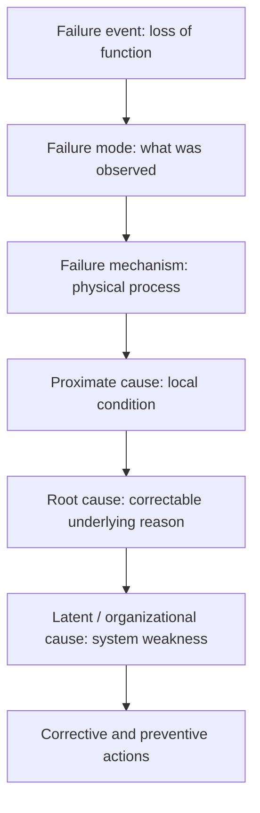
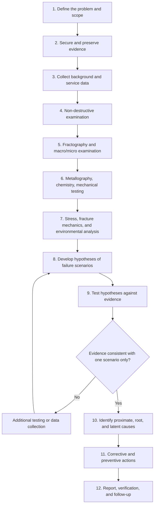
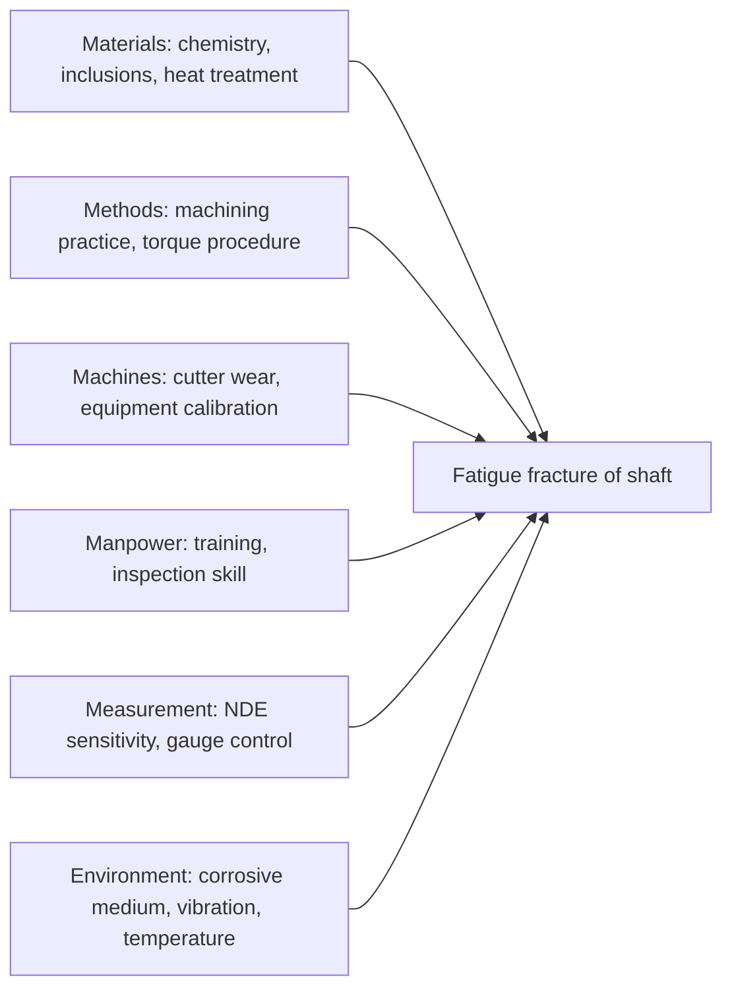
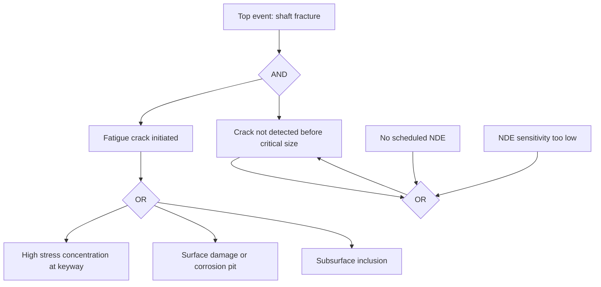

## Root Cause Analysis of Component Failures

Root cause analysis (RCA) of component failures is the structured process of determining not only *how* a component failed (the failure mode and mechanism) but *why* it failed: the chain of physical, human, organizational, and latent conditions that allowed the failure to occur. In materials science and metallurgy, RCA integrates fractography, metallography, chemical and mechanical testing, stress analysis, and service-history review into a defensible causal explanation, followed by corrective and preventive actions.

### 1. Definitions and Framework

**Key Points**

- **Failure:** loss of ability of a component to perform its intended function. Failure can be *complete* (fracture, seizure), *partial* (loss of efficiency, excessive deformation), or *potential* (a condition that will lead to loss of function).
- **Failure mode:** the manner in which failure is observed (e.g., fracture, distortion, wear, corrosion perforation, leakage).
- **Failure mechanism:** the physical process producing the failure (e.g., high-cycle fatigue, stress-corrosion cracking, creep rupture, hydrogen embrittlement, abrasive wear).
- **Proximate (direct) cause:** the immediate physical condition that produced the failure (e.g., a fatigue crack initiated at a machining groove).
- **Root cause:** the fundamental, correctable reason that, if eliminated, would prevent recurrence (e.g., the specification allowed a surface finish that promotes fatigue initiation, or inspection did not detect the deviation).
- **Contributing factors:** conditions that increased likelihood or severity but were not sufficient alone.
- **Latent causes:** system-level weaknesses in design, procurement, quality, maintenance, or management that allow proximate causes to exist.

The relationship between these levels is often described as a causal chain:

### 2. Categories of Root Causes

Component failures are generally attributed to one or more of the following categories. A single failure frequently involves more than one.

| Category | Typical Examples |
| --- | --- |
| **Design** | Sharp fillets and notches, inadequate section size, wrong material selection, neglected thermal expansion mismatch, insufficient fatigue or corrosion allowance, incorrect load assumptions |
| **Material** | Off-specification chemistry, inclusions, segregation, banding, improper heat-treatment response, hydrogen pickup, counterfeit or mixed-up material |
| **Manufacturing and processing** | Forging laps, casting porosity, weld defects, grinding burns, quench cracks, decarburization, residual tensile stress, improper surface finish, machining marks, incorrect coating or plating (hydrogen embrittlement risk) |
| **Assembly and installation** | Over-torque or under-torque, misalignment, improper fit, galvanic couples, contamination, incorrect gasket or seal |
| **Service conditions and operation** | Overload, unanticipated cyclic load, temperature excursion, unexpected environment (chlorides, H₂S), vibration, resonance, cavitation |
| **Maintenance and inspection** | Missed inspection intervals, inadequate NDE sensitivity, unauthorized repairs, wrong lubricant, deferred maintenance |
| **Environmental degradation** | Corrosion, oxidation, thermal aging, irradiation, UV (polymers), erosion |
| **Human and organizational** | Inadequate procedures, training gaps, communication failures, management-of-change lapses, cost-driven substitutions |

### 3. The RCA Process

#### 3.1 Overview

#### 3.2 Step 1: Define the Problem and Scope

- State the failure event precisely: what failed, when, where, under what conditions, and with what consequences (safety, environmental, financial).
- Establish the objectives: determine cause only, or also assign responsibility, support litigation or insurance, or guide redesign.
- Define the boundaries: which components, systems, and time periods are included.
- Identify stakeholders and confidentiality or chain-of-custody requirements, particularly where legal action is possible.

#### 3.3 Step 2: Secure and Preserve Evidence

- Photograph in situ before disturbance; record positions, orientation, and surrounding damage.
- Preserve fracture surfaces (do not fit mating halves together; avoid cleaning until documented).
- Collect witness materials: debris, corrosion products, lubricants, process fluids, fasteners, nearby unfailed components, and control samples.
- Maintain a written **chain of custody** log covering every transfer, cut, and test.
- Preserve **exemplar parts** (unfailed components from the same lot or location) for comparison.

#### 3.4 Step 3: Collect Background Data

| Data Type | Purpose |
| --- | --- |
| Design drawings, specifications, calculations | Compare as-built to as-designed; check safety factors |
| Material certifications and heat/lot numbers | Verify traceability and conformance |
| Manufacturing records (heat treatment charts, weld procedures, NDE reports) | Identify process deviations |
| Operating logs, alarms, temperature/pressure/vibration history | Reconstruct loading and environment |
| Maintenance and inspection records | Identify prior repairs, degradation, missed inspections |
| Failure history of similar components | Detect systemic or repeat failures |
| Witness statements | Reconstruct events (treated as evidence requiring corroboration) |
| Environmental data (chemical analyses of process streams, weather) | Identify aggressive species |

#### 3.5 Step 4 to 6: Physical Examination and Testing

These steps follow the fractographic workflow (documentation, visual and stereomicroscopic examination, SEM/EDS, sectioning) and add:

- **Non-destructive examination (NDE):** radiography, ultrasonic testing, magnetic particle, dye penetrant, eddy current, and micro-CT to locate secondary cracks and internal defects before destructive sectioning.
- **Chemical analysis:** bulk composition (OES, ICP, combustion analysis for C, S, N, O, H) compared with the specification; local analysis of deposits, scales, and corrosion products (EDS, XRD, Raman).
- **Metallography:** microstructure, grain size, inclusion rating, decarburization or carburization, case depth, weld and HAZ structure, crack path relative to microstructure.
- **Mechanical testing:** hardness traverses, tensile, impact (Charpy) testing, and where practical, fracture toughness testing of material taken from the failed component or a sister part.
- **Residual stress measurement:** XRD ($\sin^2\psi$ method), hole drilling, or neutron diffraction where processing-induced stress is suspected.

#### 3.6 Step 7: Analytical Assessment

**Stress analysis and load reconstruction**

- Compute nominal stress from the known loads and geometry, then apply stress concentration factors:

$$\sigma_{max} = K_t\,\sigma_{nom}$$

- For fatigue, compare against the endurance limit or S-N data with appropriate modifying factors. A commonly used form for the corrected endurance limit is

$$S_e = k_a k_b k_c k_d k_e\, S_e'$$

where $S_e'$ is the ideal endurance limit and the $k$ factors account for surface finish, size, load type, temperature, and reliability.

- Use finite element analysis (FEA) to identify high-stress locations, and compare the predicted location with the observed origin. Agreement supports the load hypothesis; disagreement suggests missing loads (e.g., vibration, thermal stress, assembly stress).

**Fracture mechanics**

- Estimate the critical flaw size from fracture toughness:

$$a_c = \frac{1}{\pi}\left(\frac{K_{Ic}}{Y\,\sigma}\right)^2$$

- Estimate crack growth life with the Paris relation:

$$\frac{da}{dN} = C\,(\Delta K)^m \quad\Rightarrow\quad N_f = \int_{a_0}^{a_c} \frac{da}{C\,(\Delta K)^m}$$

Results depend strongly on the initial flaw size and the constants $C$ and $m$, so they should be presented with uncertainty bounds. [Inference] — predicted lives are order-of-magnitude estimates unless material constants are measured for the specific heat and environment.

**Creep and thermal exposure**

- The Larson–Miller parameter relates temperature and rupture time:

$$P_{LM} = T\,(C_{LM} + \log t_r)$$

where $T$ is absolute temperature, $t_r$ is time to rupture (hours), and $C_{LM}$ is a material constant (commonly about 20 for steels). It allows estimation of the equivalent temperature or stress experienced by a creep-failed component. [Inference] — the constant and validity range depend on the alloy; confirm against the specific data set.

**Corrosion assessment**

- Corrosion rate from mass loss:

$$CR = \frac{K\,W}{A\,t\,\rho}$$

where $W$ is mass loss, $A$ is exposed area, $t$ is time, $\rho$ is density, and $K$ is a units constant (for example, $K = 8.76\times10^4$ gives mm/year when $W$ is in g, $A$ in cm², $t$ in hours, and $\rho$ in g/cm³).

- For SCC, evaluate the three necessary conditions: susceptible material, tensile stress (applied or residual), and specific environment. Elimination of any one condition prevents cracking.

**Wear**

- Archard's equation provides a first-order estimate of wear volume:

$$V = k\,\frac{F\,s}{H}$$

where $V$ is wear volume, $k$ is a dimensionless wear coefficient, $F$ is normal load, $s$ is sliding distance, and $H$ is hardness of the softer surface.

### 4. Structured RCA Tools

#### 4.1 The "5 Whys"

Repeatedly ask "why" until a correctable, systemic cause is reached. It is simple and fast, but can oversimplify complex, multi-causal failures and depends on the analyst's knowledge.

**Example**

| Level | Question | Answer |
| --- | --- | --- |
| Problem | Why did the shaft fracture? | A fatigue crack grew from the keyway corner until the remaining section overloaded |
| Why 1 | Why did a fatigue crack start there? | The keyway corner radius was very small, producing a high stress concentration |
| Why 2 | Why was the radius small? | The drawing did not specify a minimum radius, and the cutter default was used |
| Why 3 | Why did the drawing lack the radius? | The design template omitted stress-concentration guidance for keyed shafts |
| Why 4 | Why was this not caught in review? | The design review checklist did not include fatigue-critical features |
| Root cause (systemic) |  | Design standards and review process did not address fatigue-critical geometry |

#### 4.2 Fishbone (Ishikawa) Diagram

Organizes potential causes into categories (commonly Materials, Methods, Machines, Manpower, Measurement, Environment). Useful for brainstorming and ensuring no category is overlooked. A text form:

#### 4.3 Fault Tree Analysis (FTA)

A top-down, deductive method: begin with the top event (the failure) and decompose it using AND/OR logic gates into contributing events down to basic events. Probabilities of basic events can be combined:

- For an **AND** gate with independent events: $P = \prod_i P_i$
- For an **OR** gate with independent events: $P = 1 - \prod_i (1 - P_i)$

#### 4.4 Failure Mode and Effects Analysis (FMEA)

A proactive, inductive method that lists potential failure modes, their effects, causes, and current controls, scoring **Severity (S)**, **Occurrence (O)**, and **Detection (D)** to compute a Risk Priority Number:

$$RPN = S \times O \times D$$

FMEA is used after RCA to update the design or process FMEA so that the discovered failure mode is captured and controlled. [Unverified] — some organizations now prefer Action Priority (AP) tables (per AIAG-VDA guidance) over RPN thresholds; confirm the applicable standard.

#### 4.5 Barrier Analysis and Change Analysis

- **Barrier analysis:** identify the defenses (design margins, inspections, alarms, procedures) that should have prevented the failure, and determine why each failed or was absent.
- **Change analysis:** compare the failed situation with a previously successful one and list every difference (material lot, supplier, process parameter, operator, environment); each difference is a candidate cause.

#### 4.6 Event and Causal Factor Charting / Timeline Analysis

Construct a time-ordered chart of events, conditions, and decisions leading to the failure. This helps expose sequences (e.g., an overheating event followed by a routine load that caused fracture) and separates causation from coincidence.

#### 4.7 Comparison of Tools

| Tool | Strength | Limitation | Best Used For |
| --- | --- | --- | --- |
| 5 Whys | Fast, easy | Linear, analyst-dependent | Simple, single-path failures |
| Fishbone | Comprehensive brainstorming | Does not prioritize or verify | Initial hypothesis generation |
| Fault tree | Rigorous logic, quantifiable | Time-intensive, needs data | Complex, safety-critical systems |
| FMEA | Proactive, systematic | Subjective scoring | Prevention and design updates |
| Barrier analysis | Highlights control failures | Requires clear barrier definition | Systemic and safety events |
| Change analysis | Isolates differences | Needs a good baseline | Sudden change in failure rate |
| Timeline analysis | Reveals sequence | Requires reliable records | Multi-event accidents |

### 5. Hypothesis Development and Testing

RCA is fundamentally scientific: propose competing hypotheses and test each against physical evidence.

1. **Enumerate scenarios** consistent with the initial observations (e.g., fatigue from bending, fatigue from vibration, hydrogen embrittlement from plating, overload).
2. **Define what each scenario predicts** (fracture appearance, origin location, microstructure, chemistry, load history).
3. **Compare predictions with evidence.** A single inconsistent, well-verified observation can eliminate a hypothesis.
4. **Seek disconfirming evidence** actively to avoid confirmation bias.
5. **Retain only hypotheses that explain *all* the evidence**; if two remain, design additional tests to discriminate.
6. **Consider multiple causes**: failures often require the coincidence of several factors (e.g., a defect, a load, and a missed inspection).

**Key Points**

- Distinguish **observations** (measured facts), **inferences** (logical deductions), and **speculation** in every report.
- Avoid *premature closure*: fixing on the first plausible cause before eliminating alternatives.
- Avoid *hindsight bias*: evaluating past decisions with knowledge not available at the time.

### 6. Evidence Matrix Approach

An evidence matrix systematically scores each hypothesis against each observation.

| Evidence | H1: Overload | H2: Fatigue (bending) | H3: Hydrogen embrittlement | H4: Material defect |
| --- | --- | --- | --- | --- |
| Beach marks present | Inconsistent | Consistent | Inconsistent | Neutral |
| Origin at keyway corner | Neutral | Consistent | Neutral | Neutral |
| Striations in Stage II | Inconsistent | Consistent | Inconsistent | Neutral |
| Intergranular facets | Inconsistent | Inconsistent | Consistent | Neutral |
| Hardness within specification | Neutral | Consistent | Consistent | Inconsistent |
| No inclusion at origin (EDS) | Neutral | Consistent | Neutral | Inconsistent |
| **Overall** | Rejected | **Supported** | Rejected | Rejected |

Hypotheses with any strongly *inconsistent* verified observation are rejected; the remaining hypothesis (or combination) is carried forward as the most probable explanation.

### 7. Common Failure Mechanisms and Their Typical Root Causes

| Mechanism | Diagnostic Evidence | Frequent Root Causes |
| --- | --- | --- |
| Ductile overload | Necking, dimples, shear lips | Undersized section, unexpected load, wrong material or temper, operator misuse |
| Brittle fracture | Chevrons, cleavage, low absorbed energy | Low service temperature, wrong steel grade (transition temperature), thick sections, flaws, high strain rate |
| Fatigue | Beach marks, striations, single or multiple origins | Stress raisers, surface damage, vibration, residual tension, poor weld toe geometry, missing shot peening |
| Corrosion fatigue | Pits at origin, corrosion products on crack | Aggressive environment, coating failure, lack of cathodic protection |
| Stress-corrosion cracking | Branched cracks, intergranular or transgranular, corrosive deposits | Wrong alloy for environment, residual weld stress, chloride or caustic or ammonia contamination |
| Hydrogen embrittlement | Intergranular or quasi-cleavage, delayed failure, high hardness | Electroplating without baking, cathodic protection over-polarization, sour service, high-strength steel selection |
| Creep | Cavitation, oxide-covered surface, swelling | Temperature above design, local overheating, fouled tubes, material degradation |
| Thermal fatigue | Multiple oxide-filled cracks, "craze" pattern | Rapid thermal cycling, constrained expansion |
| Wear (abrasive, adhesive, fretting) | Scoring, transferred material, oxidized debris | Inadequate lubrication, contamination, wrong hardness combination, micromotion at joints |
| Erosion-corrosion, cavitation | Horseshoe pits, directional grooves, pitted surface | High velocity or turbulence, entrained solids, poor hydraulic design |
| Galvanic corrosion | Attack at the anodic member near junction | Dissimilar metals in electrolyte without isolation |
| Embrittlement (temper, sigma phase, 475 °C) | Intergranular or cleavage with reduced toughness | Improper heat treatment, prolonged service in the embrittling temperature range |
| Weld failures | Lack of fusion, porosity, hot or cold cracking, HAZ softening | Wrong procedure, insufficient preheat, hydrogen-bearing consumables, poor fit-up |

### 8. Human and Organizational Factors

Physical evidence often leads to a human or organizational cause. Structured approaches include:

- **Human Factors Analysis and Classification System (HFACS):** classifies causes into unsafe acts, preconditions, supervision failures, and organizational influences.
- **Management-of-change (MOC) review:** verifies whether a design, material, supplier, or process change occurred without adequate evaluation.
- **Procedural compliance assessment:** examines whether procedures existed, were correct, were followed, and were practical.

**Key Points**

- A root cause statement that ends with "operator error" is usually incomplete; ask why the system permitted or induced the error.
- Effective RCA distinguishes *individual* error from *system* weakness and prescribes corrective actions accordingly (training alone is a weak control).

### 9. Writing Effective Root Cause Statements

A good root cause statement is specific, evidence-based, and actionable, following a *cause → effect → consequence* structure.

- **Weak:** "The bolt failed because of fatigue."
- **Better:** "The bolt failed by fatigue initiating at a thread root with a poor rolled-thread profile (observed laps at 200× SEM), because the supplier's rolling process was not controlled and incoming inspection did not include thread-form verification."

Criteria for a valid root cause:

1. It is supported by physical evidence.
2. It is under management control (correctable).
3. Its elimination would have prevented, or substantially reduced the likelihood of, the failure.
4. It is not merely a restatement of the failure mode.

### 10. Corrective and Preventive Actions (CAPA)

Recommendations should address each identified cause and be ranked by effectiveness. A widely used hierarchy of controls (from most to least effective) is:

1. **Eliminate** the hazard (redesign to remove the failure-prone feature or environment).
2. **Substitute** (change material, coating, or process).
3. **Engineer controls** (increase fillet radius, add shot peening, cathodic protection, filters, relief devices).
4. **Detection and monitoring** (NDE intervals, condition monitoring, vibration analysis, corrosion coupons).
5. **Administrative controls** (procedures, training, revised specifications).

| Cause Identified | Example Corrective Action | Example Preventive Action |
| --- | --- | --- |
| Sharp fillet at fatigue origin | Redesign fillet radius; shot-peen | Update design standards and review checklist |
| Non-conforming heat treatment | Reheat-treat, requalify lot | Add hardness verification at receiving; audit heat-treat vendor |
| Chloride SCC of austenitic stainless | Change to duplex or nickel alloy; stress relieve | Environmental monitoring; material selection guide |
| Hydrogen embrittlement from plating | Baking within specified time; alternate coating | Process control audits; hardness limits for plated parts |
| Undetected cracks | Introduce NDE with validated probability of detection | Risk-based inspection program |
| Overload from misuse | Add torque limiter or overload clutch | Operator training and interlocks |

- Verify effectiveness: define measurable success criteria, implement, and follow up with inspection, monitoring, or audit.
- Extend the corrective action to **similar components and systems** (extent-of-condition review), since the same root cause may exist elsewhere.

### 11. Reporting

A complete RCA report typically includes:

1. **Executive summary** (failure, cause, key recommendations).
2. **Background** (component description, service history, consequences).
3. **Scope and methods** (standards followed, tools used).
4. **Evidence and findings** (photos, fractography, chemistry, mechanical tests, metallography, analyses), each with clear scale and identification.
5. **Analysis** (hypotheses tested, evidence matrix, calculations with assumptions and uncertainties).
6. **Root cause statements** (proximate, root, contributing, latent).
7. **Recommendations** (corrective and preventive, with owners and timelines).
8. **Appendices** (raw data, chain of custody, drawings, certificates).

Reporting guidelines:

- Write for the intended audience, including non-technical decision makers.
- Clearly separate facts from opinion and label unresolved uncertainties (e.g., [Inference], [Unverified]).
- Avoid assigning blame; focus on causes and prevention. Where legal liability is involved, follow legal counsel's guidance on scope and privilege.

### 12. Worked Example: Fractured Bolt in a Pressure Flange

**Example**

*Situation:* A high-strength alloy steel stud (nominal hardness ~38 HRC) in a flange joint fractured 4 months after installation, causing a leak.

1. **Problem definition:** Determine why the stud fractured and whether other studs are at risk.
2. **Evidence collection:** Fractured stud halves, adjacent intact studs, nuts, washers, gasket, lubricant, installation torque records, and process fluid sample.
3. **Macroscopic exam:** Fracture at the first engaged thread; flat, granular surface; no necking; no beach marks; a few radial marks pointing to the thread root.
4. **SEM:** Predominantly intergranular facets with fine secondary cracking; no fatigue striations; traces of sulfur detected on facets (EDS); zinc-rich plating remnants on the surface.
5. **Metallography:** Tempered martensite; prior-austenite grain boundaries outlined along the crack path; no decarburization.
6. **Hardness:** 41 to 43 HRC at the surface (above the specified 32 to 38 HRC range); the core near the upper end of the specification.
7. **Chemistry:** Within specification for the grade.
8. **Hypotheses:**
   - H1: Overload, rejected (no ductile features; torque within limits).
   - H2: Fatigue, rejected (no striations or beach marks).
   - H3: Hydrogen embrittlement (from plating or in-service), consistent with intergranular fracture, high hardness, and delayed failure.
   - H4: Sulfide stress cracking, considered because of sulfur traces; process fluid analysis showed no H₂S, so the sulfur was attributed to a surface contaminant. [Inference] — a minor contribution cannot be fully excluded without further testing.
9. **Supporting analysis:** Hydrogen content measured by inert gas fusion was above the level typically associated with embrittlement risk for this strength grade (compare against the applicable specification or laboratory threshold). Zinc plating records showed no post-plating bake.
10. **Root cause statement:**
    - *Proximate:* Hydrogen-assisted intergranular cracking initiated at the first-engaged thread root under sustained preload.
    - *Root:* Studs were electroplated without the required post-plating hydrogen-relief bake, and the hardness exceeded the specified range.
    - *Latent:* The purchase specification did not require certification of the bake, and receiving inspection did not include hardness verification.
11. **Corrective actions:** Replace all studs from the same lot; specify hardness limits and mandatory post-plating bake within a defined time after plating; add receiving hardness testing and hydrogen-embrittlement testing (such as sustained-load testing per the relevant standard); consider a non-electroplated coating (e.g., mechanically deposited or zinc-flake) to reduce hydrogen risk.
12. **Extent of condition:** Inspect other flanges assembled with the same lot; quarantine remaining inventory.

**Output** (summary): Mechanism: hydrogen embrittlement; Root cause: missing post-plating bake plus out-of-range hardness; Latent cause: procurement and inspection gaps.

### 13. Special Considerations

#### 13.1 Multiple and Interacting Causes

Many failures require several conditions simultaneously (for example, a material flaw plus a load transient plus inadequate inspection). In such cases, RCA should identify all necessary conditions and the *most controllable* one, rather than forcing a single cause.

#### 13.2 Undetermined Cause

Sometimes the evidence is insufficient (destroyed fracture surface, missing service data). A legitimate conclusion is that the *most probable* cause is X, with stated confidence and identified evidence gaps. Avoid over-claiming; recommend protective actions consistent with the plausible scenarios.

#### 13.3 Statistical Approaches for Populations of Failures

When many components fail, reliability tools help determine whether the failures are due to infant mortality, random causes, or wear-out. The two-parameter Weibull distribution is widely used:

$$F(t) = 1 - \exp\left[-\left(\frac{t}{\eta}\right)^{\beta}\right]$$

where $\eta$ is the characteristic life and $\beta$ is the shape parameter: $\beta < 1$ suggests early-life (infant mortality) failures, $\beta \approx 1$ suggests random failures, and $\beta > 1$ suggests wear-out or fatigue-type failures. The Weibull shape parameter is a diagnostic clue, but it does not by itself identify the mechanism. [Inference] — interpretation requires supporting physical evidence.

#### 13.4 Legal and Regulatory Context

- Follow chain-of-custody and destructive-testing protocols agreed among all parties (joint examination, protocols) when litigation is foreseeable.
- Some industries require formal RCA and regulatory reporting (aviation, nuclear, pressure equipment, pipelines, medical devices). Requirements vary by jurisdiction; consult the applicable regulations and codes.

#### 13.5 Cost and Risk Prioritization

Prioritize RCA effort by consequence and likelihood. A simple risk score:

$$R = P \times C$$

where $P$ is probability and $C$ is consequence. High-consequence events warrant a full RCA with formal methods; low-consequence recurring failures may be best handled with statistical trending and standardized checks.

### 14. Standards and Reference Guides

- ASM Handbook, Volume 11: *Failure Analysis and Prevention*.
- ASTM E2332 (investigation and analysis of physical component failures).
- ASTM E1820 and E399 (fracture toughness testing).
- ASTM E647 (fatigue crack growth rate testing).
- API 579-1/ASME FFS-1 (fitness-for-service assessment).
- ISO 14224 (reliability and maintenance data collection for equipment).
- IEC 61025 (fault tree analysis) and IEC 60812 (FMEA).
- NACE/AMPP MR0175 / ISO 15156 (materials for sour service).

[Unverified] — standard numbers, titles, and current editions should be confirmed before citation in a formal report.

### 15. Common Pitfalls

- Jumping to a conclusion before examining the evidence (premature closure).
- Destroying or altering evidence through unnecessary cleaning, cutting, or reassembly.
- Stopping at the proximate cause (e.g., "fatigue") without identifying why the conditions existed.
- Ignoring the mating surface, adjacent components, and unfailed exemplars.
- Accepting service history or witness accounts without verification.
- Confusing correlation with causation (a defect found in the part is not necessarily the cause of failure).
- Using inspection results without considering detection limits or sampling.
- Recommending only administrative controls (retraining) when engineering controls are feasible.
- Omitting verification of corrective-action effectiveness.
- Presenting inferences as facts, or failing to disclose uncertainty.

### Conclusion

Root cause analysis of component failures transforms fractographic and metallurgical evidence into an actionable understanding of why a failure occurred. By combining rigorous evidence preservation, systematic physical examination, quantitative analysis, structured causal tools (5 Whys, fishbone, fault tree, barrier and change analysis), and disciplined hypothesis testing, the analyst can distinguish proximate, root, and latent causes. Effective RCA culminates in clearly worded root cause statements, prioritized corrective and preventive actions, verification of their effectiveness, and extension of lessons to similar components. Transparent reporting of facts, inferences, and uncertainties ensures that conclusions are defensible and useful for engineering, operational, and regulatory decision making.

### Next Steps

- Fatigue Life Prediction and Damage Tolerance
- Fitness-for-Service Assessment (API 579)
- Hydrogen Embrittlement Testing and Mitigation
- Corrosion Failure Analysis and Prevention
- Weld Failure Investigation
- Reliability Engineering and Weibull Analysis
- Non-Destructive Evaluation Methods and Probability of Detection
- Failure Reporting, Analysis, and Corrective Action Systems (FRACAS)