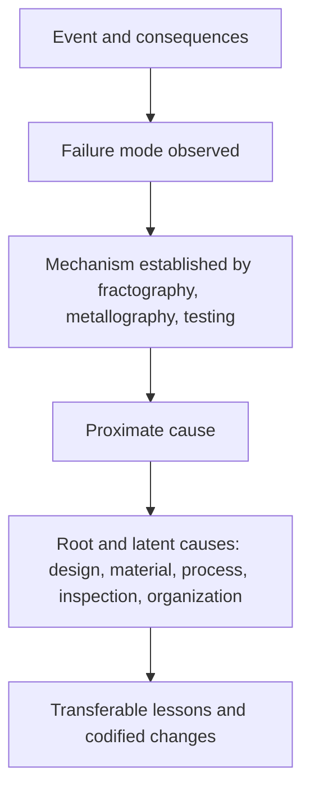
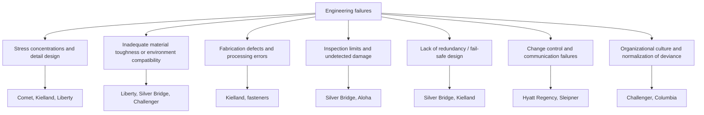

## Case Studies in Engineering Failures

Case studies of engineering failures connect the theory of fracture, fatigue, corrosion, creep, and processing defects to real events with documented consequences. Each case below is summarized in a consistent format: background, failure mode and mechanism, key evidence, root causes, and lessons. Details are drawn from widely published investigation reports and standard failure-analysis literature; specific figures (dates, quantities, temperatures) are given as commonly reported and may vary between sources. [Unverified] — numeric details should be checked against the primary investigation reports before formal citation.

### 1. How to Use Case Studies

**Key Points**

- Case studies train pattern recognition: the same handful of mechanisms (fatigue, brittle fracture, SCC, hydrogen embrittlement, corrosion, creep, overload) recur across industries and centuries.
- Almost every major failure has **multiple contributing causes** spanning design, materials, fabrication, inspection, operation, and organizational culture.
- The value lies in extracting transferable lessons: what evidence identified the mechanism, and what system weakness allowed it.
- Distinguish **documented findings** from **later reinterpretations**; several classic cases (Liberty ships, Titanic) have evolved as analytical methods improved.

The analytical lens applied to every case follows the same sequence:

### 2. Summary Matrix of Cases

| Case | Year | Primary Mechanism | Key Root Causes | Codified Response |
| --- | --- | --- | --- | --- |
| Boston Molasses Tank | 1919 | Overload and brittle fracture of riveted steel tank | Thin plates, no adequate stress analysis, no proper testing | Engineer licensing and stronger design review |
| Liberty Ships | 1940s | Brittle fracture (ductile-to-brittle transition) | Welded design with sharp corners, high-transition-temperature steel, welding defects | Charpy testing, crack arrestors, rounded hatch corners |
| de Havilland Comet | 1954 | Fatigue from pressurization cycles | Square windows, riveted punched holes, underestimated stress | Fail-safe design, full-scale fatigue tests, rounded windows |
| Silver Bridge | 1967 | Stress corrosion and corrosion fatigue in eyebar | Single-eyebar chain, no redundancy, inaccessible inspection | National Bridge Inspection Standards |
| Hyatt Regency Walkways | 1981 | Structural overload from connection change | Design change to hanger rods, no recalculation | Professional review, engineering ethics reforms |
| Aloha Airlines 243 | 1988 | Multiple-site fatigue and disbonding | Aging aircraft, disbond corrosion, crack linking | Aging aircraft program, inspection rules |
| Challenger (O-ring) | 1986 | Elastomer seal failure at low temperature | Material temperature limits ignored, normalization of deviance | Redesigned joint, safety organization reform |
| Alexander L. Kielland Platform | 1980 | Fatigue crack from fillet weld at brace hydrophone support | Weld defects, poor detail design, no redundancy | North Sea design and inspection rules |
| Sleipner A GBS | 1991 | Structural failure of concrete shell (analysis error) | FEA inaccuracy in tricell wall design | Analysis verification procedures |
| Space Shuttle Columbia | 2003 | Thermal protection damage and reentry breakup | Foam strike damage, organizational complacency | Inspection and repair capability, culture reforms |
| Deepwater and pipeline examples | Various | SCC, hydrogen cracking, corrosion | Environmental and welding factors | Materials selection and inspection standards |
| Point Pleasant: Silver Bridge (see above) | 1967 | See above | See above | See above |

The sections that follow examine the cases most instructive for materials science and metallurgy in detail.

### 3. Case A: The Liberty Ships (1940s)

#### 3.1 Background

Over 2,700 Liberty ships were mass-produced in the United States during World War II using all-welded construction, a novel approach that replaced riveting to increase production speed. A number of ships suffered sudden, catastrophic brittle fractures, some splitting in two while in calm harbors or at sea in cold water.

#### 3.2 Failure Mode and Mechanism

**Brittle (cleavage) fracture** initiated at stress concentrations and propagated at high speed through welded plate. The steel exhibited a **ductile-to-brittle transition** near or above the service temperature in cold seawater.

#### 3.3 Key Evidence

- Fracture surfaces showed flat, crystalline, cleavage-type appearance with chevron patterns pointing to origins at hatch corners, welded attachments, and weld defects.
- Charpy V-notch testing revealed that the steel had a transition temperature considerably higher than expected; steels from failed regions transitioned at higher temperatures than better-performing plates.
- Continuous welded structures allowed cracks to run across the hull, unlike riveted construction where seams arrested cracks.

The ductile-to-brittle transition is commonly characterized by the Charpy energy versus temperature curve, often fitted with a hyperbolic tangent function:

$$CVN(T) = A + B\,\tanh\!\left(\frac{T - T_0}{C}\right)$$

where $A$ and $B$ set the midpoint and amplitude of the absorbed energy, $T_0$ is the transition temperature (midpoint), and $C$ controls the width of the transition region.

#### 3.4 Root Causes

| Level | Cause |
| --- | --- |
| Proximate | Cleavage cracks initiated at stress concentrators (square hatch corners, weld defects) |
| Material | High sulfur and low manganese-to-carbon ratio steel with poor notch toughness, transition temperature near service temperature |
| Fabrication | Weld defects, hydrogen cracking, high residual stress, arc strikes |
| Design | Sharp re-entrant corners, discontinuities in hull structure |
| Environmental | Cold water and cold weather; high strain rate from wave loading |
| Systemic | Lack of a toughness requirement in specifications; novelty of all-welded ship construction |

#### 3.5 Lessons and Corrective Actions

- Introduced **notch-toughness (Charpy) requirements** and specification of steel with a transition temperature below service temperature.
- Redesigned hatch corners with generous radii; added **riveted crack arrestor strakes** and improved welding practice.
- Established the foundation for modern fracture mechanics and the concept of **fracture-critical design**.
- Improved steel chemistry and deoxidation practices (killed, fine-grain steels).

### 4. Case B: de Havilland Comet Airliners (1954)

#### 4.1 Background

The de Havilland Comet was the world's first commercial jet airliner. In 1954, two aircraft broke up in flight within months of each other after around 1,000 to 3,500 pressurization cycles, leading to grounding and an extensive investigation.

#### 4.2 Failure Mode and Mechanism

**Low-cycle fatigue** of the pressurized fuselage skin from repeated pressurization and depressurization. Cracks initiated at corners of windows (notably the automatic direction finder windows on the roof) and propagated until rapid, unstable fracture of the fuselage occurred.

#### 4.3 Key Evidence

- The investigation team recovered wreckage from the Mediterranean and reconstructed the aircraft.
- A **water-tank test** of a complete fuselage, pressurized and depressurized repeatedly, reproduced a fatigue crack at the window corner after a number of cycles consistent with the failures.
- Fractography showed fatigue beach marks originating at a rivet hole at the corner of a cutout, with fast fracture in the surrounding skin.
- Stress at the corners was far higher than nominal because of the stress concentration of the near-square window and stress raisers from punched rivet holes (punching leaves cracks and cold-worked material at hole edges).

The local stress at a hole in a plate is characterized by a stress concentration factor. For a circular hole in a wide plate in uniaxial tension:

$$K_t = \frac{\sigma_{max}}{\sigma_{nom}} = 3$$

Corners of near-rectangular cutouts with small radii can produce substantially higher factors. [Inference] — the exact factor at the Comet window corners depends on corner radius and reinforcement; the value of 3 is the classical circular-hole baseline, not the Comet-specific figure.

#### 4.4 Root Causes

| Level | Cause |
| --- | --- |
| Proximate | Fatigue crack initiation at window corner and rivet holes, linking to unstable fracture |
| Design | Square-cornered windows with high stress concentration, insufficient fatigue design allowance |
| Manufacturing | Punched rivet holes leaving microcracks; thin skin gauge |
| Analysis and testing | Underestimation of local stresses; inadequate fatigue testing of full-scale structure (the test airframe had been used for prior static proof pressurization, which likely beneficially cold-worked stress-concentrated areas and masked fatigue behavior) |
| Systemic | Then-limited understanding of fatigue in pressurized thin-walled structures |

#### 4.5 Lessons and Corrective Actions

- **Fail-safe and damage-tolerant design:** structures must tolerate the presence of cracks for a defined inspection interval and contain them through tear straps and crack stoppers.
- **Full-scale fatigue testing** as a certification requirement.
- **Rounded window corners** and drilled or reamed rivet holes.
- Improved stress analysis and use of fracture mechanics in aircraft design.

### 5. Case C: Silver Bridge Collapse (1967)

#### 5.1 Background

The Silver Bridge, an eyebar-chain suspension bridge over the Ohio River at Point Pleasant, West Virginia, collapsed suddenly during rush-hour traffic in December 1967, killing 46 people.

#### 5.2 Failure Mode and Mechanism

Failure of a single eyebar in the chain. The origin was a small **cleavage fracture** that initiated at a flaw produced by **stress corrosion cracking and corrosion fatigue** in the eye of the eyebar, in the region of the bearing surface with the pin. The failure of one link overloaded the adjacent components because the design was **non-redundant** (a two-link chain).

#### 5.3 Key Evidence

- The fracture surface at the critical eyebar showed a pre-existing crack about a fraction of an inch deep, with corrosion products, in the eye near the pinhole; the remainder was a cleavage-type final fracture.
- Bridge components were made of heat-treated eyebar steel with relatively low toughness at winter temperatures.
- The crack was located in a region that was difficult to inspect because of the assembly geometry (pin and adjacent bar hidden).

The critical flaw size can be estimated from linear elastic fracture mechanics. For a small surface flaw with crack depth $a$:

$$K_I = 1.12\,\sigma\sqrt{\pi a}$$

and fracture occurs when $K_I \ge K_{Ic}$. The low toughness of the steel at low temperature reduced $K_{Ic}$, so a small flaw sufficed for fast fracture. [Inference] — the reported critical size varies by source and depends on assumed stress and toughness.

#### 5.4 Root Causes

| Level | Cause |
| --- | --- |
| Proximate | Fast fracture from a small corrosion-assisted crack in an eyebar |
| Material | Susceptibility of the high-strength steel to SCC and corrosion fatigue; modest toughness |
| Design | Non-redundant (fracture-critical) eyebar chain; hidden critical locations |
| Inspection | Difficult or infeasible to inspect the critical area with then-available methods; inspection practices were visual and limited |
| Systemic | Lack of national standards for bridge inspection |

#### 5.5 Lessons and Corrective Actions

- Establishment of the **National Bridge Inspection Standards** in the United States.
- Recognition of **fracture-critical members** and mandatory special inspections.
- Preference for redundant load paths and detail design that enables inspection.
- Improved understanding of environmentally assisted cracking in structural steels.

### 6. Case D: Aloha Airlines Flight 243 (1988)

#### 6.1 Background

A Boeing 737-200 in Hawaii experienced explosive decompression in flight when a large section of upper fuselage skin ripped away. The aircraft landed safely with one fatality (a flight attendant). The aircraft had accumulated an exceptionally high number of pressurization cycles (about 89,000) due to short inter-island flights, which combined with a humid, salt-laden environment.

#### 6.2 Failure Mode and Mechanism

**Multiple-site damage (MSD)** in a lap joint: fatigue cracks initiated at rivet holes along a fuselage lap joint and linked up. **Disbonding** (failure of the cold-bonded adhesive) and corrosion in the joint increased load transfer to the rivets and accelerated crack initiation.

#### 6.3 Key Evidence

- Numerous small fatigue cracks were found along a row of rivet holes; the adjacent skin panels showed corrosion and disbond of the bonded layer.
- Fractography showed fatigue striations and multiple origins along the rivet hole line.
- Analysis showed that linking of many small cracks reduced residual strength dramatically below that predicted for a single crack, a phenomenon not accounted for in the original damage-tolerance analysis.

A simple conceptual expression for reduced residual strength with cracks ($2a$ each) spaced pitch $p$ apart is that the effective stress intensity is magnified by neighboring crack interaction:

$$K_{I,eff} = \beta_{MSD}\,\sigma\sqrt{\pi a}, \quad \beta_{MSD} > \beta_{single}$$

with $\beta_{MSD}$ increasing as the ratio $a/p$ approaches values where crack tips interact. [Inference] — this is a qualitative representation; actual MSD analysis uses detailed numerical or handbook solutions.

#### 6.4 Root Causes

| Level | Cause |
| --- | --- |
| Proximate | Simultaneous fatigue cracking at many rivet holes leading to fuselage skin rupture |
| Material and joint | Cold-bonded lap joint prone to disbond; corrosion in a humid, marine environment |
| Operational | Very high number of short-cycle flights; exceeded design service goals |
| Maintenance and inspection | Inspection methods and intervals did not detect widespread fatigue damage; disbond corrosion was under-recognized |
| Regulatory | Aging-aircraft issues not adequately addressed in the original certification approach |

#### 6.5 Lessons and Corrective Actions

- The **Aging Aircraft program** and mandated inspections and modifications for aging fleets.
- Consideration of **widespread fatigue damage (WFD)** in structural certification; establishment of limits of validity of the engineering data.
- Better nondestructive evaluation techniques (eddy current, low-frequency methods) for lap-joint cracks.
- Improved corrosion prevention and joint sealing.

### 7. Case E: Space Shuttle Challenger (1986)

#### 7.1 Background

The Space Shuttle Challenger broke apart 73 seconds after launch on a cold morning (temperature near freezing, well below prior launch experience). All seven crew members were lost.

#### 7.2 Failure Mode and Mechanism

A failure of the **elastomeric O-ring seals** in a field joint of the right solid rocket booster allowed hot combustion gas to blow by and erode the joint. The O-rings lost resilience at low temperature and did not seat quickly enough against the gap opening caused by joint rotation at ignition.

#### 7.3 Key Evidence

- Post-flight inspections from earlier missions showed increasing O-ring erosion and blow-by, correlated with lower launch temperatures.
- Laboratory demonstrations showed that the rubber's resilience decreased markedly at low temperature (a materials behavior analogous to a glass transition effect: below a characteristic temperature the elastomer stiffens and recovers slowly).
- Telemetry and imagery showed a smoke puff at the joint at ignition and a subsequent flame plume from the joint.

For elastomers, the temperature dependence of relaxation is often described by the Williams-Landel-Ferry (WLF) equation:

$$\log a_T = \frac{-C_1\,(T - T_{ref})}{C_2 + (T - T_{ref})}$$

where $a_T$ is the time-temperature shift factor and $C_1$, $C_2$ are material constants. Lower temperatures dramatically increase relaxation times, meaning slower sealing response. [Inference] — the WLF form is a standard description of amorphous polymers above their glass transition; its application to the specific O-ring compound is illustrative.

#### 7.4 Root Causes

| Level | Cause |
| --- | --- |
| Proximate | O-ring failed to seal the field joint in cold conditions |
| Design | Joint design permitted rotation and gap opening under pressure loading, making seal performance dependent on O-ring resilience |
| Material | Elastomer with inadequate low-temperature performance for the launch conditions |
| Organizational | **Normalization of deviance**: recurring anomalies accepted as acceptable risk; pressure to maintain schedule; communication failures between engineers and management |

#### 7.5 Lessons and Corrective Actions

- Redesign of the joint (added a capture feature and heaters) and requalification of seals.
- Reform of safety and quality organizations with independent authority.
- A broadly cited lesson: **data that contradicts expectation must be treated as a signal**, and go/no-go decisions must be based on demonstrated safety margins rather than the absence of prior catastrophe.

### 8. Case F: Alexander L. Kielland Platform (1980)

#### 8.1 Background

The Alexander L. Kielland was a semi-submersible accommodation platform in the North Sea. In March 1980 it capsized in rough weather after one of its bracing members failed, resulting in 123 deaths.

#### 8.2 Failure Mode and Mechanism

A **fatigue crack** initiated at a fillet weld attaching a hydrophone support to a bracing member. The crack grew around the brace, causing it to separate. The loss of that brace led to a cascade of failures of adjacent braces and the loss of a column, capsizing the platform.

#### 8.3 Key Evidence

- Examination of the recovered brace showed a fatigue crack of considerable size emanating from a poorly executed fillet weld with lack of fusion and cold cracking.
- Fracture surfaces showed beach marks and a large pre-existing crack of significant length before final failure.
- Weld toe geometry and a non-load-bearing attachment welded to a primary structural member created a severe local stress concentration and a low fatigue category detail.

Fatigue life of welded details is typically assessed with the S-N approach in the form:

$$N = \frac{C}{(\Delta\sigma)^m}$$

with $m \approx 3$ for many welded joints, so a doubling of the local stress range reduces life by roughly a factor of eight ($2^3$). [Unverified] — the constants $C$ and $m$ depend on the detail category in the applicable design code.

#### 8.4 Root Causes

| Level | Cause |
| --- | --- |
| Proximate | Fatigue crack from a weld defect at a brace attachment |
| Design | Non-structural attachment welded onto a primary member; poor detail with high stress concentration; lack of structural redundancy (progressive collapse) |
| Fabrication and inspection | Weld defects not detected; inadequate quality control |
| Systemic | Insufficient consideration of fatigue for offshore structures at the time |

#### 8.5 Lessons and Corrective Actions

- Strengthened offshore standards for **fatigue design**, structural redundancy, and progressive-collapse resistance.
- Emphasis on weld quality, inspection, and avoidance of attachments to primary structural members.
- Improved evacuation and stability requirements for offshore installations.

### 9. Case G: Hyatt Regency Walkway Collapse (1981)

#### 9.1 Background

In Kansas City, two suspended walkways in a hotel atrium collapsed during a crowded event, causing 114 deaths. The failure is a classic study in how a **change during fabrication** can double the load on a critical connection.

#### 9.2 Failure Mode and Mechanism

**Structural (connection) overload**: box-beam connections at the fourth-floor walkway pulled through the hanger-rod nut and washer. The original design had continuous rods carrying both walkways; a change to two offset rods meant the upper connection had to carry the load of both walkways.

#### 9.3 Key Evidence

- In the original design, each hanger rod supported one walkway, and the load on the upper connection was the load of one walkway. In the as-built configuration, the upper walkway's connection also had to support the lower walkway's load, doubling the load on that connection.
- Even the original design would have had marginal capacity relative to building code requirements.

If the connection design capacity is $P_{cap}$ and the demand in the original design is $P$, the changed detail imposes approximately

$$P_{as\text{-}built} \approx 2P$$

so a design with a safety factor of $SF = P_{cap}/P$ around 1 to 1.5 falls below unity after the change ($P_{cap}/2P \approx 0.5$ to $0.75$).

#### 9.4 Root Causes

| Level | Cause |
| --- | --- |
| Proximate | Box-beam and hanger-rod connection failed under load |
| Design | Connection detail with low capacity; no recalculation after design change |
| Communication | Shop drawing change approved without engineer's structural review; ambiguity over responsibility |
| Organizational | Diffuse accountability among the engineer of record, the fabricator, and the contractor |

#### 9.5 Lessons and Corrective Actions

- Requirement that **engineers of record review and approve shop drawings and design changes** for critical connections.
- Reinforcement of professional responsibility and ethics in engineering practice.
- A reminder that failures may arise from *load path* changes independent of material problems.

### 10. Case H: Space Shuttle Columbia (2003)

#### 10.1 Background

Columbia disintegrated during reentry after a mission in which a piece of foam insulation from the external tank struck the left wing's leading edge during launch. All seven crew members were lost.

#### 10.2 Failure Mode and Mechanism

Impact damage to a **reinforced carbon-carbon (RCC)** wing leading-edge panel created a breach. During reentry, hot plasma entered the wing structure, melting internal aluminum structure and leading to loss of control and breakup.

#### 10.3 Key Evidence

- Launch video showed foam debris striking the wing leading edge.
- A ballistic impact test (foam projectile fired at a leading-edge panel) replicated a hole in RCC.
- Debris analysis showed slag deposits and melted metal consistent with hot gas intrusion at the left wing.
- Sensor data showed temperature and pressure anomalies in the left wing prior to breakup.

The kinetic energy of the foam projectile provided the impact energy:

$$E_k = \tfrac{1}{2} m v^2$$

Even though the foam mass was small (on the order of about a kilogram), the relative velocity at impact (hundreds of meters per second) delivered sufficient energy to fracture the brittle RCC panel. [Unverified] — quoted projectile mass and velocity vary among sources.

#### 10.4 Root Causes

| Level | Cause |
| --- | --- |
| Proximate | Breach of the RCC wing leading edge from foam impact, followed by hot-gas intrusion |
| Material | Brittle, impact-sensitive RCC with limited damage tolerance |
| Design | Foam shedding from the external tank was a known but tolerated behavior |
| Organizational | Foam-shedding accepted as a maintenance issue rather than a flight safety issue; limited imagery and no viable inspection or repair plan; inadequate escalation of engineering concerns |

#### 10.5 Lessons and Corrective Actions

- Improved external tank design to reduce foam shedding; additional imaging during launch and on-orbit inspection.
- On-orbit inspection and repair techniques for thermal protection.
- Renewed emphasis on organizational safety culture, mirroring lessons from Challenger.

### 11. Additional Cases in Brief

#### 11.1 Boston Molasses Tank (1919)

- A large riveted steel tank storing molasses ruptured, releasing a wave that killed 21 people.
- Contributing factors included thin plate, inadequate safety factor, stress concentration at rivet holes and around a manhole, and repeated fill-and-empty cycling; evidence also suggests possible brittle behavior in cold conditions. [Inference] — modern analyses have suggested a combination of overstressing and fatigue-type crack growth; precise attribution remains debated.
- Outcome: stronger regulatory review of structural design and the push for licensed professional engineers.

#### 11.2 Sleipner A Gravity Base Structure (1991)

- A concrete offshore platform substructure sank during a controlled ballast test; there was no loss of life.
- Cause: inaccurate finite-element analysis (coarse mesh, incorrect shear force estimate) led to under-designed cell walls in the tricell region, resulting in inadequate reinforcement and shear failure.
- Lesson: **verify computational models** with independent checks, sensitivity studies, and simplified hand calculations.

#### 11.3 Tacoma Narrows Bridge (1940)

- Aeroelastic **flutter** of a slender plate-girder deck caused destructive torsional oscillation in moderate wind.
- Not a materials failure in the strict sense; it is included because it illustrates that failure can arise from dynamic behavior and structural stiffness distributions rather than static strength. The failure led to wind-tunnel testing requirements in bridge design.

#### 11.4 Hydrogen Embrittlement of High-Strength Fasteners

- Recurrent failures of high-strength (typically above ~1000 MPa tensile strength) electroplated bolts occurring hours or days after installation under sustained load.
- Fracture is intergranular or quasi-cleavage with little plasticity; hydrogen from plating or environmental exposure diffuses to regions of high triaxial stress.
- Lessons: post-plating bake treatments, hardness limits, alternative coatings, and sustained-load testing.

#### 11.5 Stress Corrosion Cracking of Pipelines

- Near-neutral pH and high-pH SCC in buried steel pipelines cause longitudinal cracking in the presence of coating disbondment, cathodic protection shielding, and cyclic pressure.
- Lessons: coating selection, inline inspection (crack detection tools), hydrotesting, and pressure-cycle management.

#### 11.4 Turbine Blade Creep and Thermal Fatigue

- High-pressure turbine blades in gas turbines operate near the material's capability; overtemperature or coating loss leads to creep rupture or thermal-mechanical fatigue cracking.
- Fractography shows oxidized, intergranular or crystallographic fracture with cavitation; single-crystal blades fail along specific slip systems.
- Lessons: cooling-hole integrity, coating maintenance, temperature monitoring, and life-usage tracking.

### 12. Cross-Case Analysis

#### 12.1 Mechanism Frequency and Typical Evidence

| Mechanism | Cases | Distinguishing Fractographic Evidence |
| --- | --- | --- |
| Brittle fracture | Liberty ships, molasses tank (possible) | Cleavage, chevrons, low Charpy energy |
| Fatigue | Comet, Aloha, Kielland | Beach marks, striations, ratchet marks, multiple origins |
| SCC / corrosion fatigue | Silver Bridge, pipelines | Branched cracks, corrosion products, intergranular or transgranular |
| Hydrogen embrittlement | Fasteners | Intergranular or quasi-cleavage, delayed failure |
| Overload / design error | Hyatt Regency, Sleipner | Ductile or shear features at connections; load path analysis |
| Polymer / elastomer behavior | Challenger | Seal erosion, low-temperature loss of resilience |
| Impact on brittle ceramic composite | Columbia | Impact fracture, thermal damage, slag |

#### 12.2 Recurring Root Causes

#### 12.3 Timeline of Codified Changes

| Failure | Resulting Practice or Standard |
| --- | --- |
| Liberty ships | Charpy notch-toughness specifications; fracture-control design; steel deoxidation and grain refinement |
| Comet | Fail-safe design, full-scale fatigue testing, damage tolerance |
| Silver Bridge | National Bridge Inspection Standards; fracture-critical member concept |
| Aloha 243 | Aging aircraft program; widespread fatigue damage considerations |
| Kielland | Offshore fatigue design and structural redundancy |
| Challenger and Columbia | Independent safety oversight; risk-based decision making |
| Hyatt Regency | Engineer-of-record responsibility for connection design and changes |

### 13. Lessons for Materials Scientists and Metallurgists

1. **Toughness matters as much as strength.** Specify and verify fracture toughness or impact energy at the *lowest service temperature*, not just tensile strength.
2. **Details govern fatigue.** Local geometry, surface condition, and residual stress often dominate over nominal stress and base-material properties.
3. **Environment changes material behavior.** Seawater, chlorides, hydrogen, sulfides, and temperature extremes can convert a satisfactory material into a susceptible one.
4. **Inspection is only as good as its detection capability and access.** Design for inspectability and quantify the probability of detection.
5. **Redundancy and damage tolerance provide a margin against the unforeseen.**
6. **Processing changes properties.** Welding, plating, heat treatment, and forming alter microstructure, residual stress, and hydrogen content.
7. **Small design or process changes need engineering review.** Change management is a materials and structural safety issue.
8. **Human and organizational factors are causal factors,** not afterthoughts; a materials-based cause often coexists with a system-level cause.
9. **Analytical models must be verified.** Numerical results (FEA, fracture mechanics, life predictions) require validation by testing and independent checks.
10. **Learn from near-misses.** Anomalies that do not result in failure often provide the earliest warning of the mechanism that later causes a catastrophe.

### 14. Framework for Analyzing a New Case Study

**Example**

A structured template for any new failure case:

| Step | Questions |
| --- | --- |
| 1. Event | What failed, when, and with what consequences? |
| 2. Component and service | Materials, design loads, environment, service history? |
| 3. Observations | Macroscopic and microscopic fracture features; secondary cracks; corrosion products? |
| 4. Mechanism | Which mechanism is consistent with *all* the evidence? |
| 5. Analysis | Stress, fracture mechanics, life estimate, environmental factors; do calculations agree with observations? |
| 6. Causes | Proximate, root, contributing, and latent causes? |
| 7. Barriers | Which defenses (design margin, inspection, procedure) failed or were absent? |
| 8. Actions | Corrective and preventive actions; extent of condition? |
| 9. Lessons | What is transferable to other components, industries, or materials? |

### 15. Sources and Further Reading

- ASM Handbook, Volume 11: *Failure Analysis and Prevention*.
- Petroski, H., *To Engineer Is Human* and *Design Paradigms: Case Histories of Error and Judgment in Engineering*.
- Levy, M., and Salvadori, M., *Why Buildings Fall Down*.
- Rogers Commission Report (Challenger) and Columbia Accident Investigation Board Report.
- Reports of the Royal Aircraft Establishment on the Comet investigation.
- National Transportation Safety Board reports on Silver Bridge, Aloha 243, and pipeline failures.
- Norwegian Public Reports on the Alexander L. Kielland accident.
- Broek, D., *Elementary Engineering Fracture Mechanics*; Anderson, T. L., *Fracture Mechanics: Fundamentals and Applications*.

[Unverified] — report titles and numbering should be verified against current archives before formal citation.

### Conclusion

Engineering failures repeatedly demonstrate that catastrophic events emerge from the interaction of material behavior, design details, fabrication quality, environment, inspection limitations, and organizational decisions. The Liberty ships, Comet, Silver Bridge, Aloha 243, Kielland, Hyatt Regency, Challenger, and Columbia cases each led to significant changes in codes, testing practices, and safety culture. For the materials scientist or metallurgist, the central skills reinforced by these cases are careful evidence-based analysis, understanding of fracture and degradation mechanisms across material classes, and the ability to trace a physical failure back to its systemic origins so that similar failures can be prevented.

### Next Steps

- Fatigue and Damage-Tolerance Design Principles
- Fracture Toughness Testing and Transition Temperature Assessment
- Stress-Corrosion Cracking and Hydrogen Embrittlement Case Studies
- Welding Metallurgy and Weld Failure Case Studies
- Aging Infrastructure and Inspection Strategies
- Safety Culture, Normalization of Deviance, and Human Factors in Failure
- Failure Analysis Report Writing and Expert Testimony