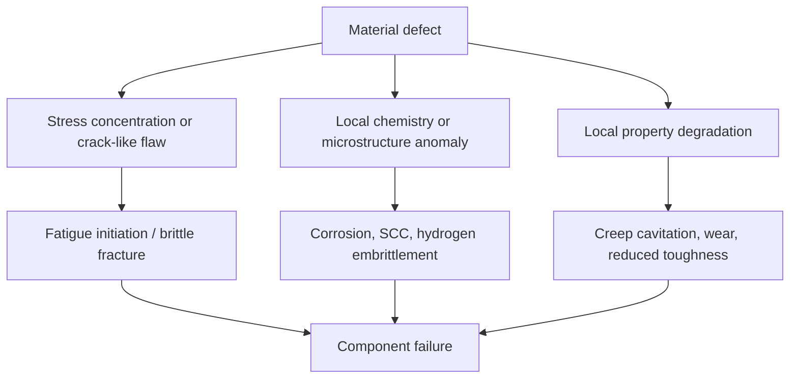
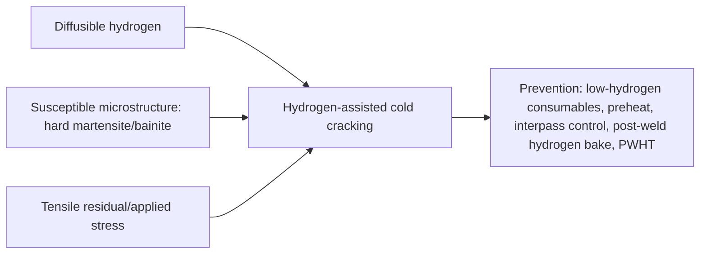

## Material Defects Leading to Failure

Material defects are deviations from the intended structure, composition, or continuity of a material that reduce its ability to carry load, resist the environment, or perform its function. Defects range from atomic-scale imperfections (vacancies, dislocations) through microstructural features (inclusions, segregation, precipitates on grain boundaries) to macroscopic discontinuities (porosity, cracks, laps, weld flaws). Whether a defect leads to failure depends on its **type, size, location, orientation, and sharpness**, together with the applied stress, the environment, and the material's toughness and fatigue resistance. This reference organizes defects by origin (crystalline, solidification, wrought processing, welding, heat treatment, surface and machining, and service-induced), describes how each initiates failure, and outlines detection and mitigation.

### 1. Framework: How Defects Cause Failure

**Key Points**

- A defect acts as a **stress raiser** and/or a **preferred initiation site** for fracture, fatigue, corrosion, or creep damage.
- Severity increases with **sharpness** (small tip radius), **size** (crack-like length), **proximity to a free surface**, and **orientation perpendicular to the principal tensile stress**.
- Materials with **high strength but low toughness** (e.g., ultra-high-strength steels, ceramics, hardened tool steels) tolerate much smaller defects than tough, ductile materials.
- Defect significance is judged against **acceptance criteria** derived from fitness-for-service and fracture-mechanics principles, not simply by presence or absence.

#### 1.1 Stress Concentration at Defects

For an elliptical flaw with semi-axis $a$ (perpendicular to the load) and $b$ (parallel to the load) in an infinite plate under remote tension $\sigma$, the maximum stress at the tip is

$$\sigma_{max} = \sigma\left(1 + \frac{2a}{b}\right) = \sigma\left(1 + 2\sqrt{\frac{a}{\rho}}\right)$$

where $\rho = b^2/a$ is the tip radius of curvature. As $\rho \to 0$ (crack-like), the concentration increases without bound, and the fracture-mechanics stress-intensity approach is used instead.

#### 1.2 Fracture-Mechanics Criterion

For a crack-like defect of characteristic size $a$:

$$K_I = Y\,\sigma\sqrt{\pi a}$$

Fracture occurs when $K_I \ge K_{Ic}$, so the critical defect size is

$$a_c = \frac{1}{\pi}\left(\frac{K_{Ic}}{Y\sigma}\right)^2$$

For a given stress, materials with lower $K_{Ic}$ tolerate a much smaller defect ($a_c \propto K_{Ic}^2$). A geometry factor $Y$ accounts for the defect shape and location (about 1.12 for a shallow surface edge crack, about $2/\pi \approx 0.64$ for a buried penny-shaped flaw with $K_I = (2/\pi)\sigma\sqrt{\pi a}$ in an infinite body).

#### 1.3 Fatigue Crack Growth from Defects

A subcritical defect can grow under cyclic loading according to the Paris law:

$$\frac{da}{dN} = C\,(\Delta K)^m$$

so the fatigue life depends strongly on the **initial defect size** $a_0$. Fatigue thresholds ($\Delta K_{th}$) determine whether a small defect will grow at all. In the high-cycle regime, a defect (inclusion, pore) can control the fatigue limit; the Murakami $\sqrt{\text{area}}$ model estimates the fatigue limit of a hard metal containing a small defect as

$$\sigma_w = \frac{C_M\,(H_V + 120)}{\left(\sqrt{\text{area}}\right)^{1/6}}$$

where $H_V$ is Vickers hardness, $\sqrt{\text{area}}$ is the square root of the defect area projected perpendicular to the stress (in µm), and $C_M$ is 1.43 for surface defects, 1.41 for near-surface defects, and 1.56 for interior defects; $\sigma_w$ is in MPa. [Unverified] — the empirical constants and validity range should be confirmed against the current literature for the specific alloy class.

#### 1.4 Classification of Defects by Dimensionality

| Class | Examples | Typical Scale |
| --- | --- | --- |
| Point defects (0D) | Vacancies, interstitials, substitutional atoms | Atomic |
| Line defects (1D) | Dislocations | Nanometers (core) |
| Planar defects (2D) | Grain boundaries, stacking faults, twin boundaries, phase boundaries, cracks | Micrometers to millimeters |
| Volume defects (3D) | Voids, pores, inclusions, precipitates, second-phase particles | Nanometers to millimeters |
| Macroscopic defects | Shrinkage cavities, laps, seams, weld flaws, delaminations | Millimeters to centimeters |

### 2. Crystalline (Atomic-Scale) Defects

#### 2.1 Point Defects

- Vacancies and interstitials mediate **diffusion**, so their equilibrium concentration governs creep, sintering, and precipitation. The equilibrium vacancy fraction is

$$\frac{n_v}{N} = \exp\!\left(-\frac{Q_v}{k_B T}\right)$$

where $Q_v$ is the vacancy formation energy, $k_B$ is Boltzmann's constant, and $T$ is absolute temperature.

- **Radiation damage** produces excess point defects, leading to hardening, embrittlement, void swelling, and creep acceleration in reactor materials.
- **Interstitial impurities** (H, C, N, O) can embrittle: hydrogen in high-strength steels and titanium; oxygen and nitrogen in Ti, Nb, Ta; oxygen in copper (hydrogen disease in oxygen-bearing copper).

#### 2.2 Dislocations

- Dislocation interactions give strain hardening and, through pile-ups at obstacles, can nucleate cracks (Stroh mechanism) in cleavage-prone materials.
- Persistent slip bands (PSBs) form under cyclic loading and are common fatigue initiation sites at the surface (extrusions and intrusions).

#### 2.3 Grain Boundaries and Interfaces

- Grain boundaries are preferred sites for **segregation** (P, S, Sn, Sb, As), precipitation, corrosion attack, and cavitation, leading to intergranular fracture modes: temper embrittlement, creep rupture, sensitization, and liquid metal embrittlement.
- The Hall–Petch relationship links grain size $d$ to yield strength:

$$\sigma_y = \sigma_0 + k_y\,d^{-1/2}$$

but coarse-grain regions (abnormal grain growth) can locally lower strength and increase susceptibility to fatigue and creep.

### 3. Defects from Solidification (Casting and Ingot Defects)

#### 3.1 Overview

Solidification defects arise from shrinkage, gas evolution, segregation, and thermal stress during freezing. They are present in castings and carry over into ingots, welds, and additively manufactured parts.

| Defect | Description | Origin | Failure Consequence |
| --- | --- | --- | --- |
| Shrinkage porosity / cavity | Irregular voids in last-to-freeze regions | Volume contraction on freezing with inadequate feeding | Reduced section, fatigue initiation, leak paths in pressure parts |
| Gas porosity | Rounded voids | Dissolved gas (H₂ in Al, N₂/H₂/CO in steel) released on freezing | Fatigue initiation, reduced ductility, leak paths |
| Hot tears (hot cracks) | Irregular, oxidized, intergranular cracks | Restraint during solidification with liquid films at boundaries | Direct crack-like flaws; low-cycle fatigue, fracture |
| Cold shuts | Lines or seams with incomplete fusion between metal streams | Low pouring temperature, interrupted flow | Planar flaws; fracture along the line |
| Misruns | Incomplete filling | Low fluidity | Loss of section |
| Inclusions (oxide, dross, slag) | Nonmetallic particles or films | Oxidation of the melt, entrained slag, refractory erosion | Initiation of fatigue and fracture; bifilms act as cracks |
| Macrosegregation | Large-scale composition variation | Solute rejection and fluid flow during solidification | Local property variation; banding; weld cracking susceptibility |
| Microsegregation / coring | Composition gradients within dendrites | Nonequilibrium solidification | Local incipient melting on heat treatment; reduced corrosion resistance |
| Ingot piping | Deep central cavity | Shrinkage at ingot top | Internal defects in rolled products if not cropped |
| Centerline segregation and centerline cracks | Segregated central zone in continuously cast steel | Solute enrichment at the last-to-freeze region | Lamellar and hydrogen-induced cracking, low toughness in the mid-thickness |

The Scheil–Gulliver equation describes solute distribution during nonequilibrium solidification:

$$C_s = k\,C_0\,(1 - f_s)^{k-1}$$

where $C_s$ is the solid composition at solid fraction $f_s$, $C_0$ is the initial liquid composition, and $k$ is the equilibrium partition coefficient. Low $k$ means strong solute enrichment in the final liquid.

#### 3.2 Bifilms and Oxide Defects in Cast Aluminum and Steel

- A **bifilm** is a folded, entrained oxide double film that acts as a pre-existing crack inside the casting, giving scatter in tensile and fatigue properties.
- Mitigation: turbulence-free filling, filtration, degassing, and optimized gating design.

#### 3.3 Porosity and Fatigue

Fatigue life of cast alloys is strongly controlled by the largest pore near the surface. Fracture surfaces frequently show fatigue initiation at a pore or oxide film, with a characteristic smooth, dendritic, or oxidized surface inside the defect.

### 4. Nonmetallic Inclusions in Steel

#### 4.1 Types and Effects

| Inclusion Type | Typical Composition | Behavior During Hot Working | Effect |
| --- | --- | --- | --- |
| Alumina and calcium aluminates | Al₂O₃, CaO·Al₂O₃ | Hard, brittle, remain angular or cluster | Severe fatigue initiators, especially in bearing and spring steels |
| Manganese sulfide | MnS | Plastic; elongate into stringers | Anisotropy of toughness and ductility; lamellar tearing; hydrogen-induced cracking initiation |
| Silicates | Mn/Fe/Ca silicates | Plastic at hot-working temperatures | Elongated stringers |
| Titanium nitrides / carbonitrides | TiN, Ti(C,N) | Hard, angular | Fatigue initiation sites in clean steels |
| Spinels | MgO·Al₂O₃ | Hard | Fatigue initiators |
| Oxysulfides | Ca-S-O compounds | Variable | Depends on shape control practice |

#### 4.2 Consequences

- Inclusions concentrate stress because of their **elastic-modulus and thermal-expansion mismatch** with the matrix and can debond, forming a void at the matrix interface.
- **Inclusion size and location** dominate high-cycle and very-high-cycle fatigue in hard steels; subsurface inclusions produce "fish-eye" fracture patterns with the inclusion at the center of an optically dark area (ODA) in very-high-cycle fatigue.
- **Inclusions with hydrogen** can nucleate hydrogen-induced cracking (HIC) and stepwise cracking in sour-service line pipe.
- **Stringers** reduce through-thickness (Z-direction) ductility, causing lamellar tearing in restrained welded joints.

#### 4.3 Mitigation

- Clean steelmaking (vacuum degassing, ladle metallurgy, calcium treatment for inclusion shape control, vacuum arc remelting or electroslag remelting for critical applications).
- Specification of inclusion rating limits (e.g., standard rating charts and image analysis methods).
- Through-thickness testing of plate for lamellar tearing susceptibility.

### 5. Defects from Wrought Processing (Forging, Rolling, Extrusion, Drawing)

| Defect | Description | Cause | Effect |
| --- | --- | --- | --- |
| Laps and folds | Surface material folded over without bonding | Improper die fill, material folding during forging | Crack-like surface flaws; fatigue origin |
| Seams | Longitudinal surface discontinuities in bar or rod | Rolling of ingot surface defects, blowholes | Fatigue and fracture initiation; heat-treatment cracking |
| Forging bursts and internal cracks | Internal ruptures | Excessive deformation at low temperature, poor workability, or hydrogen | Loss of section, fracture initiation |
| Flakes (hairline cracks) | Internal, thin, silvery cracks in heavy steel sections | Hydrogen release on cooling; insufficient hydrogen removal | Sudden brittle failure of heavy forgings and rails; must be avoided by slow cooling or hydrogen-removal cycles |
| Chevron cracking (central bursts) | Internal V-shaped cracks in drawn or extruded bar | Excessive reduction with insufficient die angle or friction conditions | Hidden internal cracks |
| Delamination and laminations | Planar separation in plate and sheet | Rolled-in ingot defects, shrinkage, or inclusions | Plate delamination; loss of through-thickness strength |
| Banding | Alternating layers of ferrite and pearlite (or segregated layers) | Segregation aligned during hot rolling | Anisotropy; "woody" fracture; variable response to heat treatment |
| Grain flow disruption | Machined-through grain flow | Machining forged parts across flow lines | Reduced fatigue and stress-corrosion resistance (short transverse grain exposure) |
| Coarse grain / abnormal grain growth | Locally large grains | Critical strain plus annealing | Reduced fatigue strength and toughness, orange-peel surface |
| Edge cracking | Cracks at rolled edges | Low ductility at temperature | Rejects and sources of crack initiation |

**Key Points**

- Wrought products have **directional properties**: the short-transverse direction is generally weakest, and stress-corrosion cracking in high-strength aluminum and steels typically follows the short-transverse grain boundaries.
- Machined features exposing end-grain (short transverse) in forgings and plates are prone to SCC and are avoided by design and inspection.

### 6. Welding Defects

Welds combine casting-type solidification, thermal cycling, and restraint, producing a wide variety of defects.

#### 6.1 Classification

| Defect | Description | Cause | Failure Consequence |
| --- | --- | --- | --- |
| Lack of fusion | Unbonded interface between weld metal and base or between passes | Low heat input, poor technique, contamination | Planar, crack-like flaw; fatigue and fracture initiation |
| Incomplete penetration | Root not fused | Improper joint preparation, insufficient current | Stress concentration at the root; fatigue |
| Porosity | Spherical or wormhole voids | Moisture, contamination, shielding gas loss, hydrogen | Reduced section; fatigue initiation (clusters worse) |
| Slag inclusions | Nonmetallic entrapment | Poor interpass cleaning, technique | Stress concentration; fatigue |
| Undercut | Groove melted into base metal at the weld toe | Excessive current, travel speed | Toe stress concentration; fatigue origin |
| Excess reinforcement and poor toe profile | Steep transition at the toe | Technique | Reduced fatigue category |
| Overlap | Weld metal flowing onto base metal without fusion | Technique | Crack-like notch at the toe |
| Arc strikes | Local melting and rapid quench of base metal | Accidental arc initiation | Hard, brittle spots; cracking |
| Weld spatter | Adherent droplets | Technique | Local notches |
| Hot cracking (solidification or liquation) | Interdendritic or grain-boundary cracks in weld metal or HAZ | Low-melting films (S, P, Nb, B), high restraint, wide freezing range | Crack-like flaws; oxidized fracture surface |
| Cold cracking (hydrogen-assisted or delayed) | Cracks in HAZ or weld metal appearing hours to days after welding | Hydrogen + susceptible (hard) microstructure + tensile residual stress | Sudden delayed fracture |
| Lamellar tearing | Stepped cracking parallel to plate surface | Through-thickness restraint on plate with elongated inclusions | Terraced, fibrous fracture |
| Reheat (stress-relief) cracking | Intergranular HAZ cracks on post-weld heat treatment or service at high temperature | Precipitation strengthening of grain interior (V, Cr, Mo, Nb) with weak boundaries | Cracks in creep-resistant steels and nickel alloys |
| Crater cracks | Cracks at weld end | Crater not filled | Crack initiation |
| Burn-through | Melt-through of base metal | Excess heat | Perforation |
| Distortion and residual stress | Not a discontinuity, but a driver | Constrained thermal contraction | Promotes fatigue, brittle fracture, and SCC |

#### 6.2 Hydrogen Cold Cracking: The Three Necessary Conditions

The hardenability of steel is often estimated by the carbon equivalent; a common form (IIW) is

$$CE_{IIW} = C + \frac{Mn}{6} + \frac{Cr + Mo + V}{5} + \frac{Ni + Cu}{15}$$

Higher $CE$ implies greater hardenability and greater risk of hard, crack-susceptible HAZ microstructure, requiring higher preheat. Different standards use alternative formulas such as $P_{cm}$ for low-carbon steels. [Unverified] — the appropriate index and preheat thresholds depend on the governing code and steel grade.

#### 6.3 Fatigue of Welded Joints

Weld toes, roots, and defects define fatigue categories in design codes; S-N curves take the form $N = C/(\Delta\sigma)^m$ with $m \approx 3$ for many details. Improvement techniques include toe grinding, TIG dressing, hammer or ultrasonic impact treatment, and shot peening.

#### 6.4 Weld Metal and HAZ Metallurgical Defects

- **HAZ softening** in quenched and tempered or cold-worked materials (e.g., 6xxx and 7xxx aluminum, Q&T steels).
- **Grain coarsening** in the coarse-grained HAZ with low toughness (local brittle zones).
- **Sensitization** of austenitic stainless steel in the HAZ (chromium carbide precipitation), leading to intergranular corrosion.
- **Sigma phase** and other embrittling phases in duplex and austenitic weld metals with prolonged exposure.
- **Dilution** and **dissimilar metal** effects: carbon migration, martensite layers at fusion boundaries, galvanic effects.

### 7. Heat-Treatment Defects

| Defect | Cause | Consequence |
| --- | --- | --- |
| Quench cracks | Thermal and transformation stress during quenching, especially in high-carbon or high-hardenability steels with sharp section changes | Deep, often intergranular cracks with decarburized or oxidized edges (indicating pre-existing cracks at temperature) or straight, fresh surface |
| Distortion | Non-uniform cooling and transformation | Dimensional nonconformance; residual stress |
| Soft spots / incomplete hardening | Poor quench, surface contamination, decarburization | Reduced wear and fatigue strength |
| Decarburization | Loss of carbon at surface in oxidizing atmosphere | Reduced surface hardness and fatigue strength; residual tension |
| Carburization or nitriding excess (brittle networks) | Overly high carbon potential, improper cycle | Brittle case, spalling |
| Overheating / burning | Excess temperature causing coarse grain or grain-boundary melting | Coarse grains (recoverable) or incipient melting (irreversible; brittle, oxidized boundaries) |
| Retained austenite | Incomplete transformation in high-carbon or alloy steels | Dimensional instability, lower hardness; delayed transformation to brittle martensite |
| Temper embrittlement | Slow cooling or holding in about 350 to 550 °C with P, Sn, Sb, As present | Intergranular fracture and raised ductile-to-brittle transition temperature |
| Tempered martensite embrittlement (350 °C embrittlement / one-step) | Tempering around 250 to 400 °C | Reduced toughness and intergranular or interlath fracture |
| Grinding cracks and burns | Excessive local heating in grinding of hardened steel | Re-hardened (untempered martensite) or over-tempered zones and shallow, networked cracks perpendicular to grinding direction |
| Improper stress relief | Incomplete residual stress removal | Distortion, SCC, delayed cracking |
| Solution-treatment issues in aluminum, nickel, and stainless alloys | Under- or over-aging, quench delay | Loss of strength, corrosion susceptibility (e.g., exfoliation, intergranular corrosion in 7xxx and 2xxx) |
| Sensitization and sigma phase | Holding in critical temperature range | Intergranular corrosion, embrittlement |

The tempering response is often summarized by the Hollomon–Jaffe parameter:

$$P_{HJ} = T\,(C_{HJ} + \log t)$$

where $T$ is absolute temperature, $t$ is time in hours, and $C_{HJ}$ is a constant (about 20 for many steels). Equal $P_{HJ}$ implies approximately equal tempered hardness, allowing time-temperature trade-offs; it is an approximation and does not capture embrittlement regimes. [Unverified] — the constant varies with composition.

### 8. Surface and Machining Defects

The surface condition strongly governs fatigue, SCC, and corrosion initiation because most fatigue cracks initiate at the surface where stress is highest and slip is easiest.

| Defect | Description | Effect |
| --- | --- | --- |
| Tool marks, scratches, and gouges | Grooves parallel or perpendicular to loading | Local stress concentration; fatigue initiation |
| Sharp fillets and undercuts | Insufficient radius at section changes | High $K_t$; fatigue and brittle fracture origins |
| Burrs and sharp edges | Machining remnants | Crack initiation; sometimes fretting |
| Grinding burns and cracks | See heat-treatment table | Fatigue initiation in hardened parts |
| White layer / recast layer (EDM, laser) | Rapidly re-solidified brittle layer with microcracks | Fatigue and SCC initiation |
| Tensile residual stress from machining, grinding, welding, or forming | Plastic deformation and thermal effects | Reduced fatigue strength; promotes SCC |
| Smeared or torn metal | Poor cutting conditions | Local damage and microcracking |
| Surface roughness | Peaks and valleys | Effective notch factor; fatigue strength reduction |
| Peened or burnished surface | Beneficial residual compression | (Beneficial) Improves fatigue and SCC resistance; over-peening can cause laps or cracks |
| Coating and plating defects | Cracks, pores, or disbonds in coatings; brittle chrome cracks | Substrate crack initiation; hydrogen pickup during electroplating |
| Corrosion pits (pre-service or in service) | Localized attack | Fatigue and SCC initiation |
| Fretting damage | Micromotion at contact | Fatigue initiation |
| Marking and stamping | Impact stamping of identification marks | Stress raisers and residual stress; common origin of cracks in high-strength parts |

The effect of surface finish and stress concentration on fatigue is often modeled with the fatigue notch factor:

$$K_f = 1 + q\,(K_t - 1)$$

where $q$ (notch sensitivity, $0 \le q \le 1$) accounts for the reduced sensitivity of the material to sharp notches; the fatigue strength is reduced by $1/K_f$.

### 9. Hydrogen-Related and Environmental Material Defects

- **Hydrogen in steels:** trapped at inclusions, voids, dislocations, and grain boundaries; leads to hydrogen embrittlement, HIC, and flaking. Hydrogen enters during steelmaking, welding, electroplating, pickling, cathodic protection, and sour service.
- **Hydrogen effects in titanium and zirconium alloys:** formation of brittle hydrides.
- **Hydrogen disease in copper:** in oxygen-bearing (tough-pitch) copper heated in reducing atmosphere, hydrogen reacts with Cu₂O to form steam that opens grain-boundary voids and cracks.
- **Intergranular attack:** sensitized stainless steels (chromium depletion), exfoliation and intergranular corrosion in high-strength aluminum alloys.
- **Dezincification and graphitic corrosion:** selective leaching of brass or gray cast iron leaving a weak, porous residue.
- **Alpha case in titanium:** oxygen-enriched brittle surface layer from high-temperature exposure, initiating fatigue cracks.
- **Liquid metal contamination:** mercury, gallium, zinc, or copper contact with susceptible alloys leading to liquid metal embrittlement.

### 10. Microstructural and Compositional Defects

#### 10.1 Grain-Boundary Segregation and Precipitation

| Phenomenon | Materials | Result |
| --- | --- | --- |
| Temper embrittlement | Low-alloy steels with Mn, Cr, Ni and impurities (P, Sn, Sb, As) | Intergranular fracture; raised transition temperature |
| Sensitization | Austenitic stainless steels (Cr₂₃C₆ at boundaries) | Intergranular corrosion and SCC |
| Sigma and chi phase | Stainless steels, superalloys | Embrittlement, reduced corrosion resistance |
| Grain-boundary carbides | Superalloys (beneficial when discrete, harmful as continuous films) | Creep ductility and crack path effects |
| Precipitate-free zones | Age-hardened Al alloys | Localized softening, strain localization, intergranular fracture |
| Topologically close-packed (TCP) phases | Nickel superalloys | Loss of creep strength |
| Alpha-prime (475 °C embrittlement) | Ferritic and duplex stainless steels | Loss of toughness |
| Massive carbide networks | Hypereutectoid and tool steels | Brittleness |

#### 10.2 Compositional Deviations

- Off-specification alloying elements or tramp elements (e.g., excess S, P, Sn, Cu, Pb, Bi) lead to embrittlement, hot shortness, or poor weldability.
- **Mixed or wrong material** (material mix-ups, counterfeit or nonconforming products) is a recurring root cause; positive material identification (PMI) helps detect it.
- **Residual elements in recycled scrap:** Cu, Sn causing hot shortness in steel during hot working.

### 11. Defects in Non-Metallic and Composite Materials

#### 11.1 Ceramics and Glasses

- **Strength-limiting flaws:** pores, agglomerates, inclusions, machining cracks, surface scratches, and thermal shock cracks. Because ceramics lack plasticity to blunt flaws, strength follows

$$\sigma_f = \frac{K_{Ic}}{Y\sqrt{\pi a}}$$

and is highly sensitive to the largest flaw, leading to a **statistical (Weibull) strength distribution**:

$$P_f = 1 - \exp\!\left[-\left(\frac{\sigma}{\sigma_0}\right)^m\right]$$

where $m$ is the Weibull modulus (higher means less scatter) and $\sigma_0$ is the characteristic strength. Larger volumes have a higher probability of containing a critical flaw, so strength decreases with size.

- Fractography identifies the **origin** at the center of the mirror region with mist and hackle surrounding it.

#### 11.2 Polymers

- Voids, contaminants, weld-line (knit-line) weakness in molded parts, residual molding stress, poor fusion of particles, degradation from processing (thermal or hydrolytic), and molecular-weight loss (leading to embrittlement).
- Environmental stress cracking (ESC) is promoted by residual and applied stress with specific chemical agents.

#### 11.3 Fiber-Reinforced Composites

| Defect | Cause | Effect |
| --- | --- | --- |
| Voids and porosity | Entrapped air, volatiles, insufficient pressure | Reduced interlaminar shear strength and compression strength; moisture ingress |
| Delamination | Impact, poor cure, edge effects, drilling damage | Loss of compressive strength and stiffness |
| Fiber waviness and misalignment | Layup or cure distortion | Reduced compression strength |
| Resin-rich or resin-starved regions | Improper resin flow | Local property variation |
| Poor fiber-matrix adhesion (weak interface) | Sizing or contamination issues | Reduced strength; fiber pull-out |
| Foreign object inclusions (backing film, peel ply, tape) | Layup contamination | Disbond, delamination initiation |
| Ply gaps and overlaps | Manufacturing tolerances | Local stress concentrations |
| Barely visible impact damage (BVID) | Low-energy impact | Hidden subsurface delamination with strongly reduced compression-after-impact strength |

### 12. Defects in Additively Manufactured Materials

| Defect | Cause | Effect |
| --- | --- | --- |
| Lack-of-fusion voids | Low energy density or poor overlap | Irregular, planar pores; strong fatigue initiators |
| Keyhole porosity | Excess energy density and vapor depression collapse | Spherical pores at track base |
| Gas porosity | Entrapped gas in powder or shielding gas | Spherical pores |
| Unmelted or partially melted powder | Insufficient energy | Rough surfaces and voids |
| Cracking (solidification or strain-age) | Restraint and high thermal gradients, crack-susceptible alloys | Crack-like flaws |
| Residual stress and distortion | Steep thermal gradients | Warping, cracking, reduced fatigue life |
| Anisotropy and columnar grain structure | Directional solidification | Orientation-dependent properties |
| Poor as-built surface finish | Adhered powder, stair-stepping | Surface-initiated fatigue |
| Balling | Unstable melt pool | Rough surface, porosity |

Post-processing (hot isostatic pressing, heat treatment, machining or polishing) reduces but may not eliminate these defects, particularly surface-connected pores after HIP. [Unverified] — HIP effectiveness varies with defect connectivity and process parameters.

### 13. Service-Induced Damage That Behaves Like Defects

- **Fatigue cracks** and **corrosion fatigue cracks** from prior loading.
- **Creep cavitation** and microcracks in high-temperature components.
- **Thermal fatigue** (heat checking) networks.
- **Corrosion pits and localized wall loss** in pipes and vessels.
- **Erosion and cavitation damage** in pumps, valves, and turbine components.
- **Wear grooves**, galling, and spalling in contact systems.
- **Overload dents, bulges, and plastic deformation** that create stress raisers and residual stress.
- **Radiation-induced voids and embrittlement** in nuclear materials.

These are assessed in fitness-for-service evaluations similarly to fabrication flaws: measure the flaw, compare with critical sizes, and determine the remaining life.

### 14. Defect Detection and Characterization

#### 14.1 Nondestructive Evaluation (NDE) Methods

| Method | Detects | Notes |
| --- | --- | --- |
| Visual testing (VT) | Surface flaws, undercut, corrosion, distortion | Essential first step; aided by borescopes and magnification |
| Dye penetrant (PT) | Surface-breaking flaws in nonporous materials | Simple; requires clean surfaces |
| Magnetic particle (MT) | Surface and near-surface flaws in ferromagnetic materials | Sensitive to tight cracks; field orientation matters |
| Eddy current (ET) | Surface and near-surface flaws, conductivity, coating thickness | Good for tubing, aircraft skin, fastener holes |
| Ultrasonic testing (UT), including phased array and TOFD | Internal planar and volumetric flaws, wall thickness | Excellent for planar defects like lack of fusion and cracks; depends on orientation |
| Radiographic testing (RT) and digital radiography | Volumetric flaws (porosity, slag, voids) | Less sensitive to planar flaws not aligned with the beam |
| Computed tomography (CT) | 3D internal defect mapping | Used for castings, AM parts, composites |
| Acoustic emission (AE) | Active crack growth, corrosion, leaks | Monitoring; needs a loading stimulus |
| Thermography | Delaminations, disbonds, subsurface flaws | Useful for composites |
| Leak testing | Through-wall defects | Pressure boundary verification |
| Hardness and conductivity checks | Heat-treatment condition, burns, alloy mix-ups | Simple screening |
| Barkhausen noise / etch inspection | Grinding burns, residual stress | Used on hardened steel parts |

The **probability of detection (POD)** curve characterizes how detectability increases with flaw size. The smallest flaw reliably detected (commonly $a_{90/95}$: the size detected with 90% probability at 95% confidence) should be well below the critical defect size and should be used with inspection intervals in damage-tolerance approaches.

#### 14.2 Destructive and Microstructural Characterization

- **Metallography** (as-polished for inclusions and porosity; etched for microstructure).
- **Inclusion rating** by image analysis or standard charts.
- **Fractography** to confirm defect involvement at the origin (SEM/EDS to identify inclusion composition).
- **Chemical analysis** (OES, combustion analysis for C, S, O, N, H).
- **Hydrogen determination** by inert gas fusion.
- **Mechanical tests** (tensile, Charpy, fracture toughness, hardness traverses).
- **Grain-boundary analysis** by AES or TEM for segregation.

### 15. Assessment, Acceptance, and Mitigation

#### 15.1 Fitness-for-Service and Acceptance Criteria

- Compare the measured defect (size, location, orientation) with acceptance limits in the governing code or a fracture-mechanics-based assessment (e.g., failure assessment diagrams that combine brittle fracture and plastic collapse).
- The failure assessment diagram (FAD) uses the ratios

$$K_r = \frac{K_I}{K_{mat}}, \qquad L_r = \frac{\sigma_{ref}}{\sigma_y}$$

and a point $(L_r, K_r)$ inside the assessment curve is acceptable. Detailed procedures are given in codes such as API 579-1/ASME FFS-1 and BS 7910. [Unverified] — confirm the current edition and applicable option level.

#### 15.2 Prevention by Stage

| Stage | Preventive Measures |
| --- | --- |
| Material selection | Adequate toughness, clean steel grades, low-impurity specifications, suitable alloy for environment |
| Melting and casting | Degassing, filtration, controlled solidification, riser and gating design, HIP for critical castings |
| Forming | Proper workability, controlled reductions and temperatures, hydrogen-removal cooling of heavy forgings, grain-flow-aware design |
| Welding | Qualified procedures, low-hydrogen consumables, preheat and interpass control, PWHT, weld profile control |
| Heat treatment | Controlled atmosphere, adequate quenchant and fixturing, prompt tempering, avoiding embrittlement ranges |
| Machining and finishing | Radii at transitions, controlled grinding, avoidance of stamping on critical areas, shot peening or burnishing |
| Coating and plating | Post-plating bake for high-strength steels, low-embrittlement processes |
| Inspection | Suitable NDE with validated sensitivity, incoming material verification (PMI), lot testing |
| Design | Fail-safe or damage-tolerant philosophies; avoid sharp notches and fracture-critical single load paths |
| Service | Monitoring, inspection intervals based on crack growth calculations, environmental control |

### 16. Worked Example: Fatigue Failure from a Subsurface Inclusion

**Example**

*Situation:* A hardened bearing-quality steel spring (hardness about 55 HRC, roughly 600 HV) fractured in high-cycle fatigue well below its expected life.

1. **Fractography:** The fracture surface showed a fish-eye pattern with a hard, angular oxide inclusion at the center, about 40 µm across, located approximately 0.3 mm beneath the surface.
2. **EDS:** The inclusion was rich in Al, Ca, and O, consistent with a calcium aluminate.
3. **Murakami estimate:** With $\sqrt{\text{area}} \approx 40\,\mu\text{m}$, $H_V \approx 600$, and $C_M = 1.56$ for an interior defect:

$$\sigma_w = \frac{1.56\,(600 + 120)}{(40)^{1/6}} = \frac{1123}{1.849} \approx 607\ \text{MPa}$$

using $40^{1/6} \approx 1.849$. This estimated defect-controlled fatigue limit lies below the upper end of the service stress amplitude in the spring, consistent with failure in the high-cycle regime. [Inference] — the estimate is empirical and the comparison with the actual service stress depends on the loading spectrum.

4. **Metallography:** Microstructure of tempered martensite, in specification; inclusion rating of the lot showed occasional large oxide clusters.
5. **Root cause:** A large, hard oxide inclusion in the melt escaped clean-steel practices; incoming inspection did not include an inclusion-cleanliness check for critical spring wire.
6. **Corrective actions:** Specify cleanliness (maximum inclusion size and rating), require vacuum-degassed or remelted steel for the application, verify with supplier audits and lot-based inclusion testing, and apply shot peening to shift initiation and add compressive stress.

**Output** (summary): Defect: subsurface calcium aluminate inclusion; Mechanism: high-cycle fatigue with fish-eye initiation; Root cause: insufficient steel cleanliness and inspection.

### 17. Summary Table: Defect to Failure Mechanism Mapping

| Defect Type | Primary Failure Modes | Key Diagnostic Evidence |
| --- | --- | --- |
| Porosity, shrinkage | Fatigue, leak, reduced strength | Rounded or dendritic voids at origin |
| Hot tears / hot cracks | Fracture, fatigue | Oxidized, intergranular, dendritic surface |
| Inclusions (hard, oxide) | Fatigue (fish-eye), fracture | Inclusion at origin (EDS) |
| Inclusions (MnS stringers) | Lamellar tearing, HIC, anisotropic fracture | Stepped, fibrous fracture; elongated sulfides |
| Laps, seams | Fatigue | Oxidized or decarburized surface layers at crack mouth |
| Hydrogen flakes | Brittle fracture | Bright silvery patches on fracture surface |
| Weld lack of fusion | Fatigue, fracture | Smooth planar surface at fusion line |
| Weld hot cracking | Fracture | Dendritic, oxidized surfaces |
| Hydrogen cold cracking | Delayed brittle fracture | Intergranular or quasi-cleavage in hard HAZ |
| Quench cracks | Fracture, fatigue | Decarburized or oxidized crack edges; often branching |
| Grinding burns | Fatigue | Re-hardened or over-tempered layer; network cracks |
| Temper embrittlement | Brittle intergranular fracture | Intergranular facets; P/Sn/Sb at boundaries (AES) |
| Sensitization | Intergranular corrosion and SCC | Chromium-depleted boundaries; intergranular attack |
| Sigma phase | Embrittlement | Brittle fracture; sigma in metallography |
| Surface scratches, sharp notches | Fatigue | Initiation at surface features |
| Ceramic flaws | Brittle fracture | Mirror-mist-hackle with origin at flaw |
| Composite voids and delamination | Compression and shear failures | Delamination fronts, void clusters |
| AM lack-of-fusion | Fatigue | Irregular planar voids with unmelted powder |

### 18. Common Pitfalls in Defect Assessment

- Treating every indication as a defect without evaluating its **actual severity** (size, orientation, location, loading, toughness).
- Relying on a single NDE method that is insensitive to the defect orientation or type (e.g., radiography for tight planar cracks).
- Assuming that a component that passed inspection is free of defects below the detection limit; the **detection threshold** must be considered in life prediction.
- Ignoring **residual stress** and **environment** effects when assessing small flaws.
- Attributing failure to a defect that is **incidental** (present but not at the origin); verify with fractography that the defect is actually the initiation site.
- Overlooking **post-fracture artifacts** that mimic defects (corrosion pits and scratches created after failure).
- Neglecting **process-history** causes, such as a hydrogen source during plating or an undocumented rework.
- Confusing **material defects** with **design deficiencies**; many failures involve both.

### Conclusion

Material defects lead to failure by acting as stress concentrators, crack initiators, or sites of local property degradation. Their origins span every stage of a component's life: melting and solidification, forming, welding, heat treatment, machining and finishing, and service exposure. Understanding a defect's type, size, location, and orientation, together with the material's toughness and the loading and environment, allows engineers to judge its significance through fracture-mechanics and fitness-for-service approaches. Effective control combines clean and well-specified materials, process discipline at every stage, validated inspection with known detection capability, damage-tolerant design, and systematic fractographic and metallurgical investigation when failures occur.

### Related Topics

- Fracture Mechanics and Critical Flaw Size Assessment
- Nonmetallic Inclusion Control and Clean Steel Practice
- Welding Metallurgy and Weld Defect Acceptance Criteria
- Hydrogen Embrittlement and Delayed Cracking
- Residual Stress Measurement and Mitigation
- Nondestructive Evaluation and Probability of Detection
- Fitness-for-Service Assessment (API 579, BS 7910)
- Defect Control in Additive Manufacturing and Composites