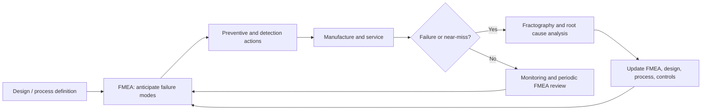
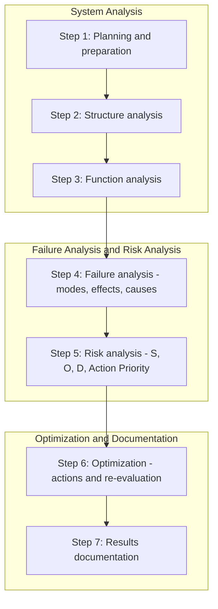

## Failure Modes and Effects Analysis

Failure Modes and Effects Analysis (FMEA) is a structured, inductive (bottom-up) method for identifying how a product, component, or process could fail, what the consequences of each failure would be, how likely and how detectable each failure is, and what actions should be taken to reduce risk. Where root cause analysis (RCA) works backward from a failure that has already occurred, FMEA works forward from a design or process to anticipate failures before they occur. For materials science and metallurgy, FMEA links known degradation mechanisms (fatigue, corrosion, creep, embrittlement, wear) and process variability (heat treatment, welding, casting, coating) to risk-ranked preventive and detection actions.

### 1. Purpose and Place in the Failure-Analysis Workflow

**Key Points**

- FMEA is **proactive**: it is applied during design and process development, and revisited when changes occur, when field failures are found, or when RCA reveals a previously unrecognized failure mode.
- It is **team-based and cross-functional**; the quality of the output depends on the knowledge of the team (design, materials, manufacturing, quality, maintenance, operations), not on the form or software used.
- It is **qualitative-to-semi-quantitative**: ratings are ordinal judgments, not measurements, so scores must be interpreted with care.
- It is **complementary** to other tools: fault tree analysis (FTA) is deductive and suited to specific top events; FMEA is inductive and exhaustive across components; RCA feeds FMEA with real failure knowledge.

### 2. Terminology

| Term | Definition |
| --- | --- |
| **Function** | What the item or process step is intended to do, with performance requirements |
| **Failure mode** | The manner in which the function could fail to be met (e.g., fracture, leakage, seizure, excessive wear, loss of hardness) |
| **Effect** | The consequence of the failure mode as perceived at the local level, the next higher level, and the end user or system |
| **Cause** | The reason the failure mode could occur (e.g., inadequate fillet radius, hydrogen pickup during plating, incorrect quench) |
| **Mechanism** | The physical process linking cause to mode (e.g., high-cycle fatigue, stress-corrosion cracking) |
| **Current controls (prevention)** | Measures that reduce the likelihood of the cause occurring (design rules, process controls, material specification) |
| **Current controls (detection)** | Measures that detect the cause or mode before the item reaches the customer (inspection, testing, monitoring) |
| **Severity (S)** | Rating of the seriousness of the effect |
| **Occurrence (O)** | Rating of the likelihood that a cause will occur and result in the failure mode |
| **Detection (D)** | Rating of the ability of current controls to detect the cause or mode before impact |
| **Risk Priority Number (RPN)** | Product $S \times O \times D$ (traditional prioritization metric) |
| **Action Priority (AP)** | High, Medium, or Low priority assigned from a lookup of S, O, D combinations (AIAG-VDA approach) |
| **Criticality** | Combination of severity and probability used in FMECA |

### 3. Types of FMEA

| Type | Focus | Typical Materials-Related Content |
| --- | --- | --- |
| **Concept FMEA** | Early concepts, architecture, material and technology selection | Material family selection, corrosion compatibility, thermal limits |
| **Design FMEA (DFMEA)** | Product design, functions, interfaces, specifications | Section sizing, fillet radii, fatigue and fracture margins, material grade and temper, coatings, galvanic couples |
| **Process FMEA (PFMEA)** | Manufacturing and assembly steps | Heat treatment, welding, casting, forging, machining, plating, surface treatment, torque, cleaning |
| **System FMEA** | Interactions between subsystems | Load paths, thermal management, environmental exposure |
| **Equipment / Machinery FMEA (MFMEA)** | Production equipment reliability | Furnace control failures, quench system failure, tool wear |
| **Maintenance and Service FMEA** | Repair and inspection activities | Incorrect repair welding, wrong lubricant, missed inspection |
| **FMECA** | FMEA plus criticality analysis | Used in aerospace, defense, and nuclear applications (e.g., MIL-STD-1629A tradition) |
| **Software FMEA** | Software failure behavior | Relevant to embedded monitoring and process control |

[Unverified] — the standards that govern each type differ by industry (for example SAE J1739, AIAG-VDA FMEA Handbook, IEC 60812, MIL-STD-1629A, SAE ARP5580); the currently applicable edition and required format should be confirmed for the customer or sector.

### 4. The FMEA Process (AIAG-VDA Seven-Step Approach)

The AIAG-VDA harmonized handbook structures FMEA in seven steps grouped into three phases. This is a common modern reference; other standards use different but similar sequences. [Unverified] — confirm against the current edition.

#### 4.1 Step 1: Planning and Preparation

- Define the **scope** (system, subsystem, component, or process boundaries; what is included and excluded).
- Define the **objectives**: customer requirements, regulatory needs, lessons learned, timing.
- Assemble the **cross-functional team** with materials, design, manufacturing, quality, testing, and field-service knowledge. Assign a facilitator.
- Collect inputs: drawings, specifications, block diagrams, process flow diagrams, control plans, past failure data, warranty data, RCA reports, similar-product FMEAs, and environmental and duty-cycle definitions.
- Define the **rating criteria** (severity, occurrence, and detection scales) and the risk-prioritization approach before starting, so the team rates consistently.

#### 4.2 Step 2: Structure Analysis

- Decompose the system into elements (system → subsystem → component → feature) using a **block diagram** or **structure tree**. For processes, use a **process flow diagram** listing each operation.
- Identify **interfaces** (mechanical, thermal, chemical, electrical) and boundaries with the environment, since many material failures (galvanic corrosion, fretting, thermal mismatch) occur at interfaces.

#### 4.3 Step 3: Function Analysis

- For each element, state its functions and requirements in verb-noun form with measurable criteria (e.g., "Transmit torque of 500 N·m for 10⁸ cycles without fracture", "Resist chloride-containing seawater for 25 years").
- Link functions across levels (function network) so that the effect of a lower-level failure on higher-level functions is traceable.
- For processes, the function of each step is what the step must accomplish, along with the associated product characteristics (e.g., "Achieve surface hardness 58 to 62 HRC and case depth 0.8 to 1.2 mm").

#### 4.4 Step 4: Failure Analysis

For each function, build the **failure chain**: failure mode → effects → causes.

- **Failure modes** are the negation, degradation, or unintended behavior of the function: loss of function, partial function, degraded function, intermittent function, or unintended function.
- **Failure effects** are described at three levels: local (the item itself), next higher level, and end effect (customer, vehicle, plant, environment, safety, or regulatory).
- **Failure causes** are the design or process reasons the mode could occur, preferably expressed at the **mechanism** level so that actions can address them.

**Example failure-chain phrasing for materials-related topics:**

| Function | Failure Mode | Effect | Cause |
| --- | --- | --- | --- |
| Transmit torque without fracture | Shaft fractures | Loss of drive; secondary damage; potential safety hazard | Fatigue initiation at keyway corner with small radius |
| Provide corrosion resistance in chloride environment | Perforation of tube wall | Leakage, loss of containment | Pitting and crevice corrosion due to insufficient alloy Mo content |
| Maintain preload | Bolt loses clamp load and breaks | Joint leakage or separation | Hydrogen embrittlement from plating without bake |
| Retain hardness 58 to 62 HRC | Surface too soft | Premature wear | Decarburization during furnace cycle |
| Withstand 700 °C service | Blade creeps and ruptures | Turbine damage | Local overtemperature due to blocked cooling hole |

#### 4.5 Step 5: Risk Analysis

Assign ratings to each failure chain.

**Severity (S)** is assigned to the **effect** (not to the cause). It depends only on the consequence, so it can be reduced only by changing the design (for example adding redundancy or a fail-safe feature), not by better controls.

**Occurrence (O)** rates the likelihood that the **cause** occurs and produces the mode, taking into account **prevention controls** (design rules, validated materials, process capability, mistake-proofing).

**Detection (D)** rates the ability of the **detection controls** to reveal the cause or mode *before* the product is released or before the failure impact occurs.

An illustrative rating framework (10-point scales; actual criteria must be defined by the organization or customer):

| Rating | Severity (effect) | Occurrence (cause likelihood) | Detection (control capability) |
| --- | --- | --- | --- |
| 10 | Hazardous, without warning; safety or regulatory noncompliance | Very high; failure almost inevitable | Absolutely cannot detect, or no control exists |
| 9 | Hazardous, with warning | Very high | Very remote chance of detection |
| 8 | Loss of primary function | High | Remote |
| 7 | Reduced primary function; customer dissatisfied | High | Very low |
| 6 | Loss of comfort or secondary function | Moderate | Low |
| 5 | Reduced secondary function | Moderate | Moderate |
| 4 | Minor effect noticed by most customers | Low to moderate | Moderately high |
| 3 | Minor effect noticed by some customers | Low | High |
| 2 | Very minor effect | Very low | Very high |
| 1 | No discernible effect | Remote; failure eliminated by preventive control | Almost certain detection |

**Risk Priority Number:**

$$RPN = S \times O \times D, \qquad 1 \le RPN \le 1000$$

**Limitations of RPN** (well recognized in the FMEA literature):

- The scales are **ordinal**, so multiplication of ranks is mathematically questionable.
- Different combinations of S, O, D can give the same RPN with very different risk (e.g., $S=10, O=1, D=1$ gives 10, while $S=2, O=5, D=1$ gives 10, yet the first involves a safety-critical effect).
- RPN gaps are uneven; many products of 1 to 10 integers are unattainable.
- Detection is often over-weighted, encouraging inspection-based "fixes" instead of prevention.

Because of these problems, many organizations use **severity-first** rules (any $S \ge 9$ requires action regardless of RPN) or the **Action Priority (AP)** tables from AIAG-VDA, which assign High (H), Medium (M), or Low (L) priority using a lookup with severity weighted most strongly. [Unverified] — exact AP table entries should be taken from the current handbook.

#### 4.6 Step 6: Optimization

- Define **recommended actions** for each high-priority item, with a responsible person and target date.
- Follow the hierarchy: (1) **eliminate the cause or change the design** to reduce severity or occurrence, (2) add or improve **prevention controls**, (3) improve **detection controls** last.
- After implementation, **re-rate** S, O, D (revised values) with evidence (test results, capability data, validation) and record the status of each action.
- Do not lower ratings without objective evidence that the action was implemented and is effective.

#### 4.7 Step 7: Results Documentation

- Document the FMEA in a controlled form (worksheet, database, or software) and communicate results to design, manufacturing, quality, and service.
- Link the FMEA to the **control plan** (for PFMEA), the **design verification plan** (for DFMEA), **test plans**, and **inspection and maintenance schedules**.
- Maintain the FMEA as a **living document**, updated with design changes, field data, and RCA findings.

### 5. FMEA Worksheet Structure

A typical worksheet has the following columns:

| Column | Content |
| --- | --- |
| Item / Process step | Component or operation under analysis |
| Function / Requirement | Intended function with measurable requirement |
| Potential failure mode | How the function could fail |
| Potential effect(s) | Consequences at local, higher, and end level |
| Severity (S) | Rating of the worst credible effect |
| Classification | Special characteristic flag (safety, regulatory, critical) |
| Potential cause / mechanism | Reason and physical mechanism |
| Current prevention controls | Design rules, process controls, material specs |
| Occurrence (O) | Rating of the cause |
| Current detection controls | Tests, inspections, monitoring |
| Detection (D) | Rating of the controls |
| RPN or AP | Risk metric |
| Recommended action(s) | Specific, measurable, assigned actions |
| Responsibility and target date | Owner and due date |
| Action taken and completion date | Evidence of implementation |
| Revised S, O, D and RPN/AP | Re-evaluated risk |

### 6. Worked Example: Design FMEA for a Bolted Flange Joint

**Example**

*Scope:* A bolted flange joint on a pressurized process line carrying a chloride-bearing fluid at 150 °C, using zinc-plated, high-strength alloy steel studs (approximately 38 HRC nominal).

| Item | Function | Failure Mode | Effect | S | Cause / Mechanism | Prevention Control | O | Detection Control | D | RPN |
| --- | --- | --- | --- | --- | --- | --- | --- | --- | --- | --- |
| Stud | Maintain preload to seal joint | Stud fractures during service | Leak of hazardous fluid; potential release and shutdown | 9 | Hydrogen embrittlement from plating without post-plating bake | Specification requires plating per standard | 5 | Receiving hardness check only | 7 | 315 |
| Stud | Maintain preload | Stud fractures | Leak | 9 | Hardness above limit due to heat-treatment deviation | Heat-treatment specification | 4 | Lot hardness sampling | 4 | 144 |
| Stud | Maintain preload | Stud loses clamp load | Gasket leak | 7 | Relaxation from insufficient torque or gasket creep | Torque procedure | 5 | Torque audit | 5 | 175 |
| Flange face | Seal against gasket | Crevice corrosion under gasket | Leak; wall loss | 8 | Insufficient alloy resistance to chlorides | Material selection guide | 4 | Periodic inspection | 6 | 192 |
| Flange–stud interface | Prevent seizure | Thread galling or seizure | Difficult maintenance; damaged threads | 4 | Incompatible coatings, no lubricant | Lubricant specification | 3 | Visual on assembly | 4 | 48 |

**Prioritization:** Using a severity-first rule, the two S = 9 items receive action regardless of RPN. Recommended actions include:

1. Specify **hardness limits** (with upper bound) and a **mandatory post-plating bake** within a defined time after plating; alternatively switch to a **non-electrolytic zinc-flake coating** that avoids hydrogen introduction.
2. Add **sustained-load or incremental-step-load hydrogen-embrittlement testing** per lot and require plating-bake certification (this improves both prevention and detection).
3. Upgrade the flange material or add a compatible gasket and joint design that reduces crevice geometry.

**Re-evaluation (illustrative):** After implementing the bake requirement and lot testing, O for the hydrogen cause drops from 5 to 2 and D from 7 to 3, giving a revised RPN of $9 \times 2 \times 3 = 54$. Severity stays at 9, so the item remains flagged as safety-relevant and is tracked in the control plan. [Inference] — the revised ratings are illustrative and would require objective evidence (test data, process capability) in practice.

### 7. Process FMEA for Materials Processing

PFMEA focuses on manufacturing operations that determine microstructure, defects, and residual stress. Examples:

| Process Step | Failure Mode | Effect | Typical Causes | Typical Controls |
| --- | --- | --- | --- | --- |
| Vacuum melting / casting | Excess inclusions or porosity | Fatigue initiation, leaks | Poor degassing, turbulence, contaminated charge | Degassing procedure, filtration, melt cleanliness testing, radiography |
| Forging | Laps, bursts, coarse grain | Cracks, low fatigue life | Wrong temperature, die design, reduction ratio | Temperature monitoring, die maintenance, UT and macroetch |
| Heat treatment (quench and temper) | Wrong hardness, quench cracks, decarburization | Wear, fracture | Furnace temperature drift, quenchant contamination, delayed tempering | Furnace uniformity surveys (pyrometry), quench-oil control, hardness testing, magnetic particle inspection |
| Welding | Lack of fusion, porosity, hydrogen cracking | Fracture, leaks | Wrong parameters, wet consumables, insufficient preheat | Welder and procedure qualification, consumable storage, preheat checks, NDE |
| Grinding | Grinding burns and cracks | Fatigue failure | Excess feed, dull wheel, insufficient coolant | Process parameter control, temper etch, Barkhausen noise inspection |
| Shot peening | Low or non-uniform coverage | Reduced fatigue life | Wrong intensity, nozzle wear | Almen strip verification, coverage checks |
| Electroplating | Hydrogen embrittlement, poor adhesion | Delayed fracture, coating spall | No bake, wrong bath chemistry | Bake within specified time, bath analysis, adhesion tests |
| Assembly | Wrong material or fastener installed; wrong torque | Loosening, fracture, leakage | Mix-ups, tool calibration | Poka-yoke, positive material identification, calibrated torque tools |

**Key Points**

- Process FMEA should reference **special characteristics** (hardness, case depth, grain size, chemistry, residual stress, cleanliness) that link the design's functional requirements to process controls.
- Effective PFMEA detection controls include **in-process, statistically based controls** (SPC, capability studies such as $C_{pk}$) rather than only final inspection.

### 8. Linking FMEA to Failure Mechanisms

FMEA is most valuable in materials engineering when causes are tied to specific degradation mechanisms and their controlling variables.

| Mechanism | Controlling Variables to Address in FMEA | Prevention Examples | Detection Examples |
| --- | --- | --- | --- |
| High-cycle fatigue | Stress range, stress concentration, surface finish, residual stress, defects | Larger fillet radius, shot peening, cleaner steel, surface finish limits | Fatigue testing, NDE with known probability of detection, strain gauging |
| Low-cycle / thermal fatigue | Strain range, temperature gradient, constraint | Design for thermal expansion, material with better thermal-fatigue resistance | Thermal cycling tests, borescope inspection |
| Brittle fracture | Toughness, transition temperature, flaw size, stress | Charpy-specified steel, avoid sharp notches, PWHT | Charpy testing, NDE for flaws |
| Stress-corrosion cracking | Susceptible alloy, tensile stress, specific environment | Alloy selection, stress relief, environmental control | Inspection of susceptible locations, coupon monitoring |
| Hydrogen embrittlement | Strength/hardness, hydrogen source, stress | Hardness limits, bake, alternative coatings | Sustained-load tests, hydrogen analysis |
| Corrosion (pitting, crevice, galvanic) | Alloy composition, environment chemistry, geometry, electrical connectivity | Alloy upgrade, coatings, isolation of dissimilar metals, cathodic protection | Corrosion monitoring, ultrasonic thickness measurement |
| Creep | Temperature, stress, time, microstructure | Creep-resistant alloy, cooling design, stress limits | Temperature monitoring, replica metallography, dimension measurement |
| Wear and fretting | Contact pressure, sliding distance, hardness pair, lubrication | Hardness matching, coatings, lubrication, joint design | Wear measurement, condition monitoring |
| Embrittlement by aging or phase precipitation | Temperature-time history, composition | Composition limits, heat-treatment control | Hardness and microstructure checks |

Where a first-order model exists, occurrence estimates can be supported by quantitative analysis. For example, wear volume from Archard's equation:

$$V = k\,\frac{F\,s}{H}$$

or fatigue life from an S-N relationship such as

$$N = \frac{C}{(\Delta\sigma)^m}$$

give a basis for judging whether the design margin is adequate, rather than assigning an occurrence rating purely by opinion. [Inference] — such calculations inform, but do not replace, team judgment because the input uncertainties are often large.

### 9. FMECA: Adding Criticality Analysis

FMECA extends FMEA by quantifying **criticality** for each failure mode. In the classical (MIL-STD-1629A-style) approach, the mode criticality number is

$$C_m = \beta\,\alpha\,\lambda_p\,t$$

where $\beta$ is the conditional probability that the effect occurs given the failure mode, $\alpha$ is the failure mode ratio (fraction of the item's failure rate attributed to this mode), $\lambda_p$ is the item failure rate, and $t$ is the operating time (or cycles). The item criticality is the sum over its modes:

$$C_r = \sum_{n=1}^{j} \left(\beta\,\alpha\,\lambda_p\,t\right)_n$$

Criticality matrices plot severity category against occurrence probability to visualize priorities. [Unverified] — exact definitions, severity categories, and formulas differ between editions and sectors; confirm the governing document.

If failure data follow a Weibull distribution, the failure rate can be derived from

$$\lambda(t) = \frac{\beta_W}{\eta}\left(\frac{t}{\eta}\right)^{\beta_W - 1}$$

where $\beta_W$ is the shape parameter and $\eta$ the characteristic life. A shape parameter below 1 indicates decreasing failure rate (infant mortality), near 1 indicates constant failure rate, and above 1 indicates increasing failure rate (wear-out), which is typical of fatigue and wear mechanisms. The Weibull parameters help set occurrence ratings but do not by themselves identify the mechanism. [Inference] — interpretation requires supporting physical evidence.

### 10. Integration with Other Tools

| Tool | Relationship to FMEA |
| --- | --- |
| **Fault Tree Analysis (FTA)** | Top-down complement; FMEA failure modes with high severity become candidate top events for FTA, and FTA minimal cut sets identify combinations of failures that FMEA (single-point analysis) may miss |
| **Root Cause Analysis** | Field failures and RCA findings update FMEA causes, occurrence ratings, and controls; FMEA highlights where prevention was expected but failed |
| **Control Plan** | PFMEA feeds special characteristics and control methods into the control plan |
| **Design Verification Plan and Report (DVP&R)** | DFMEA identifies tests needed to verify robustness against the causes |
| **Failure Reporting, Analysis, and Corrective Action System (FRACAS)** | Field data closes the loop with FMEA occurrence estimates |
| **Reliability Block Diagrams and Physics of Failure** | Provide quantitative life models to support occurrence ratings |
| **Hazard and Operability Study (HAZOP)** | Process-industry counterpart for deviations in flow, temperature, pressure, and composition |
| **Risk-Based Inspection (RBI)** | Uses failure modes and likelihood/consequence categories to set inspection intervals (e.g., API 580/581 approach) |
| **Design of Experiments and Robust Design** | Reduce sensitivity of the design to noise factors identified in FMEA |

Fault-tree probability rules used alongside FMEA (independent events):

$$P_{AND} = \prod_i P_i, \qquad P_{OR} = 1 - \prod_i (1 - P_i)$$

### 11. Team and Facilitation Practices

**Key Points**

- Include **materials and metallurgical expertise** so that failure mechanisms and controls are technically correct rather than generic.
- Start from **functions and requirements**, not from a brainstormed list of problems; this prevents both omissions and vague entries.
- Separate **effect, mode, and cause** carefully; a frequent error is listing a cause as a mode (e.g., "corrosion" as a mode and "corrosion" again as a cause).
- Use **lessons learned**: prior FMEAs of similar products, field returns, RCA reports, and known failure cases in the same alloy or process.
- Rate **severity first, then occurrence, then detection**, and rate each based on the defined criteria, not on personal expectation.
- Avoid **anchoring on RPN thresholds** (e.g., "act only above 100"); always review high-severity items regardless of RPN.
- Keep the FMEA at a manageable scope; overly broad FMEAs become superficial.

### 12. Software and Documentation

- FMEA can be maintained in spreadsheets, but dedicated FMEA software provides structure trees, function networks, failure nets, revision control, and traceability to control plans and requirements.
- Maintain a **revision history** and record the basis for each rating change.
- Store supporting evidence (test reports, capability studies, fractography and RCA findings) with the FMEA so ratings can be audited.

### 13. Common Pitfalls

- **Treating FMEA as a paperwork exercise** completed by one person after the design is frozen, instead of a design tool used by a team early enough to influence decisions.
- **Confusing modes, effects, and causes**, producing entries that cannot be acted upon.
- **Over-reliance on detection** (adding inspection) instead of eliminating causes.
- **Using RPN alone** to rank items and ignoring high-severity, low-RPN items.
- **Rating occurrence based on optimism** or on the existence of a control without evidence that it works.
- **Lowering ratings without evidence** after "actions" that have not been implemented or validated.
- **Ignoring interfaces and interactions**, such as galvanic couples, thermal mismatch, and fretting between components.
- **Omitting process-induced conditions** (residual stress, hydrogen, decarburization, surface damage) that are not visible on drawings but dominate real failures.
- **Neglecting to update the FMEA** after field failures, design changes, supplier changes, or new operating conditions.
- **Assuming independent failures** when common-cause failures (shared environment, shared heat-treatment lot, shared supplier) can cause simultaneous multiple failures.

### 14. Standards and References

- AIAG & VDA, *FMEA Handbook* (harmonized DFMEA and PFMEA, seven-step approach, Action Priority).
- SAE J1739 (automotive DFMEA/PFMEA and machinery FMEA); SAE ARP4761 (aerospace safety assessment) and SAE ARP5580 (FMEA for non-automobile applications).
- IEC 60812 (analysis techniques for system reliability, procedure for FMEA).
- MIL-STD-1629A (procedures for performing FMECA; historical, cancelled but still referenced).
- ISO 31000 and IEC 31010 (risk management and risk assessment techniques).
- API 580 and API 581 (risk-based inspection).
- ASM Handbook, Volume 11: *Failure Analysis and Prevention* (for mechanism-specific inputs).

[Unverified] — standard numbers, titles, status (current, superseded, or withdrawn), and edition dates should be verified before citation.

### Conclusion

Failure Modes and Effects Analysis converts accumulated knowledge of material degradation mechanisms, processing variability, and past failures into a systematic, forward-looking risk assessment. Its strength lies in decomposing a design or process into functions, enumerating failure modes with their effects and causes, rating severity, occurrence, and detection, and driving actions that preferentially eliminate causes rather than merely detect them. Used with metallurgical expertise, mechanism-based cause statements, quantitative support where available, and feedback from RCA and field data, FMEA becomes a living tool that prevents the recurrence of known failure modes and anticipates new ones. Its limitations, chiefly the subjectivity of ordinal ratings and the weaknesses of RPN, are mitigated through severity-first review, Action Priority methods, evidence-based re-rating, and integration with FTA, FRACAS, and physics-of-failure analysis.

### Related Topics

- Fault Tree Analysis and Minimal Cut Set Evaluation
- FMECA and Criticality Assessment
- Process Control Plans and Statistical Process Control
- Design Verification Testing and Accelerated Life Testing
- Risk-Based Inspection (API 580/581)
- Reliability Engineering and Weibull Analysis
- Physics-of-Failure Approaches for Materials
- FRACAS and Lessons-Learned Management