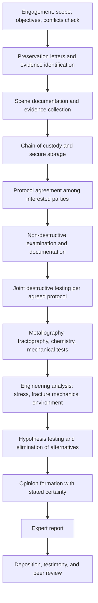

## Forensic Metallurgy

Forensic metallurgy is the application of metallurgical and materials-science principles to the investigation of failures, accidents, and disputes, with the objective of producing findings that are technically sound, defensible under scrutiny, and usable in legal, regulatory, insurance, or contractual settings. It shares its analytical toolkit with general failure analysis (fractography, metallography, chemical analysis, mechanical testing, stress and fracture-mechanics assessment) but adds requirements that arise when findings may be challenged by opposing parties: evidence integrity, chain of custody, agreed test protocols, impartiality, admissibility standards, and clear separation of fact from opinion. Typical settings include product-liability claims, structural and industrial accidents, aviation and rail incidents, pressure-equipment and pipeline failures, fire and explosion investigations, insurance subrogation, warranty and supply-chain disputes, counterfeit or nonconforming material claims, and criminal or regulatory inquiries.

### 1. Scope and Distinguishing Features

**Key Points**

- The technical questions are those of failure analysis: what failed, how, in what sequence, and why.
- The added forensic questions are: *who* or *what condition* bears responsibility, whether the evidence supports a given account of events, and whether the conclusions would withstand cross-examination.
- The forensic metallurgist's duty is to the **evidence and the tribunal**, not to the party who retained them. Independence and objectivity are ethical and practical requirements; an opinion that appears advocacy-driven loses credibility.
- Conclusions are expressed at a stated **level of certainty**, and alternative explanations that remain open are disclosed.

| Aspect | General Failure Analysis | Forensic Metallurgy |
| --- | --- | --- |
| Primary audience | Engineering and management | Courts, regulators, insurers, arbitrators, opposing experts |
| Evidence handling | Good practice | Formal chain of custody, documented protocols, often joint inspection |
| Destructive testing | Decided by the investigator | Often requires agreement or court approval among all interested parties |
| Reporting | Technical report | Expert report meeting procedural rules; may include declarations of independence |
| Opinions | Engineering judgment | Must meet admissibility standards; must be grounded in reliable method |
| Scrutiny | Peer and client review | Adversarial challenge, deposition, cross-examination |

### 2. Typical Application Areas

| Area | Typical Questions | Typical Evidence |
| --- | --- | --- |
| Product liability | Was the product defective in design, manufacture, or warnings? Was the failure due to misuse? | Failed part, exemplars, design records, material certifications, use history |
| Structural and industrial accidents | Did a material or weld defect, overload, or maintenance lapse cause the collapse or release? | Fracture surfaces, weld records, inspection data, load records |
| Aviation, rail, marine | Fatigue, corrosion, overload, or maintenance-induced damage? Sequence of breakup? | Wreckage distribution, fracture surfaces, maintenance logs, recorded data |
| Pipelines and pressure equipment | SCC, corrosion, hydrogen damage, weld defect, overpressure? | Ruptured pipe, coating condition, soil and product analysis, operating pressure data |
| Fire and explosion investigation | Where and how did the fire start? Were metallic components the source (arcing, overheating, ignition)? | Melted or oxidized metals, wire arc beads, heat-affected microstructure |
| Insurance and warranty | Sudden and accidental failure or gradual deterioration? Manufacturing defect or misuse? | Comparative microstructures, corrosion products, service records |
| Counterfeit and nonconforming material | Does the material match the specification? Was it substituted? | Chemistry, microstructure, hardness, markings, mill test report authenticity |
| Criminal and security | Tool marks, firearm and explosive-related fragment examination, tampering | Fracture matching, striations, deformation, chemical residue |
| Intellectual property and contractual | Does the process or alloy infringe or fail the specification? | Composition, microstructure, processing signatures |

### 3. Investigation Workflow

#### 3.1 Engagement and Scope

- Perform a **conflict-of-interest check** and confirm independence from the parties.
- Define the questions to be answered in writing. Avoid being asked to reach a predetermined conclusion.
- Establish access to evidence, records, personnel, and site, and confirm who holds the right to authorize destructive testing.
- Clarify confidentiality, privilege, and work-product arrangements (these vary by jurisdiction; consult counsel).

#### 3.2 Evidence Preservation

- Issue **preservation notices** early: physical evidence deteriorates (corrosion, contamination), and site conditions change.
- Preserve the failed part, mating parts, adjacent components, debris, fluids, deposits, fasteners, tools, and unfailed exemplars from the same lot.
- Protect fracture surfaces (no fitting of halves, no cleaning before documentation, use of suitable packaging and desiccation), and record environmental conditions during storage.

#### 3.3 Scene Documentation

- Photograph and video in place with scale, orientation markers, and wide, medium, and close views; make sketches and measurements; record GPS or survey coordinates and debris distribution.
- Record ambient conditions (temperature, weather, exposure to water or chemicals) and any post-failure events (fire suppression, recovery operations) that could have altered evidence.
- Interview witnesses separately and record their statements as testimonial information, to be corroborated by physical evidence. [Inference] — witness accounts are useful for hypothesis generation but are not treated as measurements.

#### 3.4 Chain of Custody

A defensible chain of custody records, for every item:

| Element | Content |
| --- | --- |
| Unique identifier | Tag or label number and description |
| Origin | Where, when, and by whom it was collected |
| Condition at collection | Photographs and notes on state, orientation, and damage |
| Transfers | Date, time, from whom, to whom, purpose, and signatures |
| Storage | Location, conditions, access control |
| Handling and alterations | Any cleaning, cutting, sampling, or testing, with authorization and description |
| Disposition | Retained, returned, or destroyed, with authorization |

Breaks in the chain of custody, undocumented alterations, or unauthorized destructive testing (**spoliation**) can lead to evidence being excluded or to adverse inferences. Requirements differ by jurisdiction. [Unverified] — legal consequences of spoliation vary and should be confirmed with counsel.

#### 3.5 Test Protocols and Joint Examination

- When multiple parties have an interest, agree on a **written protocol** before any destructive step: sequence of examinations, sampling locations, cutting methods, laboratories, standards, and attendance rights.
- Perform non-destructive examinations first and document thoroughly, so that later steps are reproducible in principle even when the sample is consumed.
- Where practical, retain **portions of each sample** and split test specimens for independent testing by other parties.
- Record all deviations from the protocol and the reasons.

### 4. Technical Examination Methods in a Forensic Context

The techniques are those of fractographic and metallurgical failure analysis (macroscopic examination, stereomicroscopy, SEM and EDS, metallography, chemical analysis, hardness and mechanical testing, NDE), applied with additional documentation rigor and method validation.

#### 4.1 Method Selection and Validation

- Prefer **standardized, recognized methods** (ASTM, ISO, EN, or laboratory-validated procedures) so that results can be defended as reliable.
- Use **accredited laboratories** where possible (for example, accreditation to ISO/IEC 17025), with calibrated equipment, documented uncertainty, and traceable standards. [Unverified] — accreditation scope should be confirmed for each specific test.
- Record instrument settings, calibration status, reference materials used, and any data-processing steps.
- Retain **raw data** (spectra, images with metadata, logs) in addition to reported results.

#### 4.2 Measurement Uncertainty and Reporting Results

Results are reported with uncertainty where relevant. For repeated measurements with sample mean $\bar{x}$ and sample standard deviation $s$ from $n$ measurements, the standard uncertainty of the mean is

$$u = \frac{s}{\sqrt{n}}$$

and an expanded uncertainty with coverage factor $k$ (commonly $k = 2$ for about 95% coverage under approximate normality) is

$$U = k\,u$$

Compliance decisions (for example whether a measured hardness or composition meets a specification limit) should consider this uncertainty. [Inference] — the decision rule (guard-banding or shared risk) should be agreed or stated explicitly.

#### 4.3 Material Identification and Conformance

A frequent forensic task is to determine whether a component conforms to its specification or is counterfeit or mixed.

| Check | Method | Notes |
| --- | --- | --- |
| Bulk chemistry | Optical emission spectrometry (OES), ICP, combustion analysis for C, S, N, O, H | Compare with specification limits and tolerances; note product-analysis tolerances |
| Field screening | Handheld XRF or LIBS | Rapid; limited for light elements (C in steels); confirm with laboratory methods |
| Hardness and strength | Hardness traverses; tensile tests; conversion tables for approximate tensile strength | Conversions are approximate and material dependent |
| Microstructure | Metallography; grain size (ASTM E112) | Compare with expected heat-treatment condition |
| Toughness | Charpy impact, fracture toughness | Compare with specification and service temperature |
| Markings and traceability | Heat numbers, mill test reports, manufacturer marks, packaging | Authenticate documentation; check for altered or forged markings |
| Coating and plating | Cross-section thickness, XRF, adhesion tests | Verify against specification |
| Dimensional conformance | CMM, calibrated gauges | Compare with drawings and tolerances |

#### 4.4 Timing and Sequence of Damage

Forensic questions often turn on *when* damage occurred (before, during, or after the event of interest). Evidence types:

| Question | Diagnostic Indicators |
| --- | --- |
| Was a crack pre-existing? | Oxidation, corrosion product, tarnish, or deposits on the crack surface; beach marks; smooth rubbed surfaces; heat tint; crack-tip blunting. Fresh fracture surfaces are bright and clean, with features unaffected by oxidation |
| How long did the crack exist? | Thickness of oxide films (only a rough guide because rates depend on environment and temperature); fatigue striation counting; corrosion-product growth. [Inference] — such estimates carry wide uncertainty |
| Was there heat exposure before failure? | Temper colors (steel), recrystallization or grain growth, precipitate coarsening, hardness change, scale thickness; compare with unheated regions |
| Did fire cause or follow the failure? | Location of soot and heat damage relative to fracture faces; whether fracture surfaces were oxidized or sooted (soot on fracture surfaces suggests fracture preceded the fire exposure); melted or distorted metal patterns |
| Was overload the initiating event or a consequence? | Fracture-surface features and sequence: fatigue zone, then fast fracture; deformation patterns |
| Was damage caused during recovery? | Fresh scratches, gouges, clean bright marks with no corrosion; tool marks; disturbed debris fields |

The rate of oxide growth on many metals at elevated temperature follows a parabolic law:

$$x^2 = k_p\,t$$

where $x$ is scale thickness, $t$ is time, and $k_p$ is the parabolic rate constant, which depends strongly on temperature (Arrhenius form $k_p = k_0\exp(-Q/RT)$). This can bound the time or temperature of exposure in high-temperature scenarios. [Unverified] — rate constants depend on alloy and atmosphere; laboratory or literature data for the specific material are required, and field conditions add uncertainty.

### 5. Sub-Disciplines and Typical Analyses

#### 5.1 Fire and Explosion Metallurgy

- **Arc beads on electrical conductors:** Localized melting at an arc; copper beads from arcing show characteristic microstructure and porosity differing from beads formed by external fire heat. Interpretation is complex and the diagnostic reliability of arc-mapping and bead analysis has been debated in the fire-investigation community. [Inference] — such evidence should be used with caution and corroborated by other findings, in line with recognized fire-investigation guides (for example NFPA 921).
- **Heat exposure indicators:** Temper colors, softening of cold-worked or heat-treated alloys, melting of low-melting metals (aluminum about 660 °C, zinc about 420 °C, lead about 327 °C, copper about 1085 °C) provide bounds on local temperature history. The values are for pure metals; alloys melt over ranges.
- **Explosion fragments:** Fragment size, shape, and fracture features distinguish high-order detonation (extensive fragmentation, high strain rate features, possible shear lips and adiabatic shear) from low-order pressure-vessel rupture (fewer, larger fragments, ductile bulging, and tearing). The Mott fragmentation concept relates fragment size distribution to case ductility and strain rate, though details are specialized.
- **Pressure-vessel failures:** Ductile bulging and thinning indicate overpressure; brittle cracking at low temperature suggests toughness deficiency; corrosion-thinned walls suggest deterioration; weld flaws and hydrogen damage are considered for localized failures.

#### 5.2 Aviation and Accident Investigation

- Wreckage is mapped and reconstructed; fracture surfaces from critical structural elements are examined for fatigue, overload, corrosion, and stress-corrosion cracking.
- Sequence of breakup is inferred from fracture morphologies, deformation directions, paint transfer, and debris distribution.
- Investigation follows the authority's protocol (for example national transport safety boards), with parties participating under defined rules; laboratory examinations are typically coordinated by the authority.

#### 5.3 Pipelines, Pressure Equipment, and Corrosion Failures

- Determine whether cracking is SCC (near-neutral pH or high-pH), hydrogen-related, fatigue, or defect-driven; examine coating disbondment, cathodic protection records, soil and product chemistry, and operating pressure cycles.
- Compare crack morphology and orientation with the stress state; identify the origin and crack-growth history.
- For corrosion-thinned components, evaluate remaining strength with recognized fitness-for-service approaches and compare against actual burst pressure.

#### 5.4 Weld and Fabrication Disputes

- Compare as-built welds with the qualified procedure (WPS/PQR) and applicable code acceptance criteria; identify defects and determine whether they originated in fabrication, or service.
- Assess whether observed features (lack of fusion, porosity, hydrogen cracking) were detectable by required inspection and whether inspection was performed.

#### 5.5 Tool Marks, Fracture Matching, and Physical Matching

- **Fracture matching** (physical fit) of two fragments can establish that they were once one piece; features include macroscopic contours and microscopic topography. Quantitative topographic comparison of fracture surfaces (for example using 3D surface-topography and statistical correlation of surface roughness at appropriate length scales) has been proposed as an objective, statistically grounded approach. [Unverified] — forensic acceptance and error rates of such methods are under active research and should be checked in current literature.
- **Tool marks and striations:** Comparison of striations on cut or broken surfaces with suspected tools is a classic forensic technique; the reliability and reporting practices of pattern-comparison disciplines have been the subject of scientific review. [Inference] — conclusions of "identification" should be stated cautiously and supported by documented, validated methods.

### 6. Quantitative Analyses Supporting Forensic Opinions

Quantitative analyses should be transparent: state assumptions, inputs, sources, sensitivities, and uncertainty.

#### 6.1 Load and Stress Reconstruction

$$\sigma_{max} = K_t\,\sigma_{nom}$$

Stress at the origin is estimated from the loading scenario and geometry; finite-element analysis can test whether the alleged load produces stresses consistent with the observed fracture location and mode. Comparison of predicted and observed origin locations provides a check on the load hypothesis.

#### 6.2 Fracture Mechanics

$$K_I = Y\,\sigma\sqrt{\pi a}, \qquad a_c = \frac{1}{\pi}\left(\frac{K_{Ic}}{Y\sigma}\right)^2$$

The observed size of the pre-existing crack at fast fracture is compared with the calculated critical size for the estimated stress and toughness; agreement supports the reconstructed scenario, while large discrepancies signal missing information.

#### 6.3 Fatigue Life and Crack Growth

$$\frac{da}{dN} = C(\Delta K)^m, \qquad N = \int_{a_0}^{a_f}\frac{da}{C(\Delta K)^m}$$

Striation spacing measured along the crack path provides a check on the number of cycles. Results should be presented with uncertainty bounds because the constants and initial sizes are uncertain. [Inference] — cycle counts from striations are estimates, and striations may be absent or incomplete in some materials and conditions.

#### 6.4 Corrosion and Time-to-Failure Estimates

$$CR = \frac{K\,W}{A\,t\,\rho}$$

Corrosion-rate estimates from wall loss and exposure time are compared with the time available (installation date to failure) to test scenarios such as rapid attack by an unusual contaminant versus long-term gradual corrosion.

#### 6.5 Thermal History

For tempering-type heat exposure of steels, the Hollomon–Jaffe parameter provides equivalence between time and temperature:

$$P_{HJ} = T\,(C_{HJ} + \log t)$$

Hardness or microstructural changes measured near the failure can be compared with reference tempering data to bracket the temperature and duration of exposure. [Unverified] — the constant and reference data depend on the alloy and initial condition.

#### 6.6 Statistical Treatment

- Small sample sizes limit confidence; state the sampling plan and the limitations.
- Where population failure data exist (multiple similar failures), Weibull analysis can distinguish infant-mortality, random, and wear-out behavior:

$$F(t) = 1 - \exp\left[-\left(\frac{t}{\eta}\right)^{\beta}\right]$$

A shape parameter $\beta > 1$ indicates wear-out-type behavior, but the physical mechanism must be established by examination, not inferred from $\beta$ alone. [Inference] — statistical patterns support but do not prove causation.

### 7. Opinion Formation and Reasoning

#### 7.1 Scientific Method Applied to Forensic Questions

1. **Observe** and document without preconception.
2. **Generate multiple working hypotheses** consistent with initial observations.
3. **Test each hypothesis** against all evidence, including physical data, records, and testimony.
4. **Eliminate** hypotheses that are inconsistent with verified evidence.
5. **State the conclusion** and the degree of confidence, identifying assumptions and remaining uncertainty.

This approach is often described as the method of **multiple working hypotheses**, and is a safeguard against confirmation bias.

#### 7.2 Cognitive Biases to Guard Against

| Bias | Description | Countermeasure |
| --- | --- | --- |
| Confirmation bias | Favoring evidence that supports an initial theory | Actively seek disconfirming evidence; test alternative hypotheses |
| Anchoring | Over-reliance on the first information received | Delay hypothesis formation; review data before hearing narratives |
| Hindsight bias | Judging past decisions with knowledge of the outcome | Evaluate what was knowable at the time |
| Contextual (expectation) bias | Influence of irrelevant case information (for example, knowing a party's accusation) | Limit exposure to task-irrelevant information; use blind or sequential unmasking where feasible |
| Allegiance bias | Tendency to favor the retaining party | Maintain independence; document the basis for each opinion; obtain peer review |
| Premature closure | Stopping investigation once a plausible answer emerges | Define completion criteria; check that all evidence is explained |

#### 7.3 Levels of Certainty

Expressions of certainty should be defined and used consistently. A commonly used scale (terminology varies by organization and jurisdiction):

| Term | Meaning (illustrative) |
| --- | --- |
| Consistent with | The evidence does not contradict the hypothesis, but does not exclude others |
| More likely than not / probable | Greater than 50% likelihood based on the evidence |
| Highly probable | Substantially greater likelihood, with alternatives considered unlikely |
| Reasonable engineering certainty | Alternatives considered and judged not credible; phrase requires care because meaning differs across jurisdictions |
| Cannot be determined | Evidence insufficient to distinguish among hypotheses |

Legal standards of proof (for example "preponderance of evidence" in civil matters or "beyond reasonable doubt" in criminal matters) are determined by the tribunal, not by the expert; the expert reports technical probability and leaves legal thresholds to the trier of fact. [Unverified] — terminology and standards differ by jurisdiction; consult counsel.

### 8. Admissibility, Ethics, and Legal Context

**Key Points**

- Standards for admitting expert testimony vary by jurisdiction. In U.S. federal courts, the framework built on *Daubert v. Merrell Dow Pharmaceuticals* (1993), and codified in Federal Rule of Evidence 702, asks whether testimony rests on sufficient facts or data, uses reliable principles and methods, and reflects a reliable application of those methods to the case. Some U.S. states follow the *Frye* "general acceptance" standard or state-specific variations. Other legal systems have their own rules and expert-duty codes (for example, expert duties to the court in the United Kingdom and other common-law jurisdictions). [Unverified] — rules are amended over time and differ by jurisdiction; the current rule and case law should be confirmed with counsel.
- Factors commonly considered for reliability include: testability of the method, peer review and publication, known or potential error rate, existence of standards controlling the operation, and general acceptance.
- **Qualifications:** Education, training, licensing (for example professional engineer registration where applicable), experience, publications, and prior testimony are examined.

**Ethical principles for forensic metallurgists**

| Principle | Practice |
| --- | --- |
| Objectivity and independence | Base opinions on evidence; do not adjust conclusions to favor the client |
| Competence | Work within the area of expertise; involve specialists when needed |
| Transparency | Disclose methods, data, assumptions, limitations, and materials relied upon |
| Integrity of evidence | Follow chain-of-custody and protocol requirements; avoid spoliation |
| Confidentiality | Protect privileged and proprietary information within legal limits |
| Duty to the tribunal | Provide honest opinions even when unfavorable to the retaining party |
| Fee arrangements | Avoid contingency fees tied to outcome; compensation should not depend on the opinion |
| Peer review | Seek independent technical review where possible |

### 9. Expert Report Structure

A well-structured forensic report typically contains:

1. **Identification:** author, qualifications, date, case reference, and statement of independence.
2. **Assignment and questions addressed.**
3. **Materials reviewed and evidence examined:** with identifiers and chain-of-custody references.
4. **Background facts and assumptions:** clearly labeled, with sources.
5. **Methods and procedures:** standards, equipment, and laboratories used; deviations.
6. **Observations and results:** photographs, images, spectra, data tables, with scale and identification, presented before interpretation.
7. **Analysis:** calculations, models, and reasoning, with assumptions and uncertainty.
8. **Hypotheses considered:** including those rejected, and the basis for rejection.
9. **Opinions and conclusions:** each with the degree of certainty and the evidence supporting it; separation of facts, inferences, and opinions.
10. **Limitations and reservations:** information not available, tests not performed, and the right to amend opinions if new information emerges.
11. **Appendices:** raw data, protocols, curriculum vitae, list of prior testimony and publications (if required), and documents relied upon.

Language should be **precise, neutral, and understandable** to non-specialists. Avoid unnecessary jargon, undefined acronyms, and language that appears argumentative. Use figures and annotated photographs to make the reasoning traceable.

### 10. Worked Example: Fractured Crane Hook and a Liability Dispute

**Example**

*Situation:* A forged alloy-steel crane hook fractured during a lift, dropping a load and injuring a worker. The hook manufacturer, the employer, and an inspection company are parties to a dispute over responsibility.

1. **Engagement and protocol:** The metallurgist confirms independence, issues a preservation request, and proposes a joint protocol among the three parties: non-destructive examination first, agreed cutting locations, split samples, and attendance of party representatives.
2. **Documentation and chain of custody:** The hook halves, shank, load block, and slings are photographed in the as-received state and logged. Unfailed hooks from the same fleet and manufacturing lot are collected as exemplars.
3. **Macroscopic examination:** The fracture is at the hook saddle-to-shank transition. One region shows a smooth, darkened, partially rusted surface with beach marks; the remainder is a bright, granular, fast-fracture region with shear lips. No significant gross plastic deformation of the hook throat opening is observed, indicating that the hook was not visibly overloaded before fracture.
4. **SEM and EDS:** The dark, rusted region shows fatigue striations and corrosion products; the bright region shows dimples and quasi-cleavage. EDS of deposits in the dark region shows iron oxide with chlorine and sulfur, consistent with prolonged exposure to a marine industrial environment.
5. **Timing evidence:** Oxide and corrosion products across the dark zone indicate the crack existed for a considerable period before the final fracture, so the crack was present during previous inspections. [Inference] — the exact duration cannot be determined from oxide alone.
6. **Metallography and mechanical testing (per protocol):** Microstructure is tempered martensite; hardness and Charpy energy meet the specification; chemistry conforms to the grade. A forging lap is not found. A shallow tool-mark groove (from a stamped identification number) is located at the fatigue origin.
7. **Quantitative analysis:** Using the rated load and geometry, the local stress at the stamped-number location, with an assumed stress concentration factor, is compared with the fatigue limit; and the critical crack size for fast fracture is calculated from measured toughness and stress. The size of the fast-fracture region is consistent with the calculated critical size within the uncertainty.
8. **Hypotheses:**
   - H1: Overload beyond rated capacity, rejected (no gross deformation; fatigue features dominate; the lift was within rated load per load-cell records).
   - H2: Material nonconformance, rejected (chemistry, hardness, and toughness conform).
   - H3: Fatigue initiated at a stamped marking in a high-stress region, propagating during service, and not detected in periodic inspections, consistent with all evidence.
   - H4: Corrosion-assisted fatigue, considered a contributing factor because of deposits at the crack surface; the extent of its contribution is uncertain.
9. **Opinions (illustrative wording):**
   - The hook failed by fatigue that initiated at a stamped identification mark at the saddle transition; corrosion products indicate the crack was present for an extended period.
   - The hook material conformed to the specification.
   - The stamp location was within the manufacturer's control; periodic inspections, if performed to the required method, would have had an opportunity to detect a crack of the observed size. Whether inspections were performed adequately is a matter for review of inspection records and methods; the metallurgical evidence does not by itself establish this. [Inference]
   - Uncertainty: the precise crack age and the corrosion contribution cannot be determined; the opinion is stated as probable for fatigue initiation at the stamp and as undetermined for the corrosion contribution.
10. **Report:** The report separates observations from opinions, discloses assumptions (stress concentration factor, toughness data), and notes the limitations.

**Output** (summary): Mechanism: fatigue from a stamped mark at a stress concentration, with corrosion products on the crack surface; Material: conforming; Open questions: crack age, inspection adequacy.

### 11. Common Pitfalls

- **Breach of evidence integrity:** unilateral destructive testing, cleaning before documentation, or fitting of fracture halves.
- **Failing to secure exemplars and records** early, so that comparison and background verification become impossible.
- **Pre-committing to a theory** based on the retaining party's narrative or the first apparent defect (confirmation and anchoring bias).
- **Confusing a defect present in the part with the cause of failure;** the fractographic origin must be linked to the defect.
- **Interpreting post-failure damage** (recovery, fire, corrosion after fracture) as pre-failure conditions.
- **Overreaching:** expressing opinions outside expertise, or with a certainty the evidence does not support.
- **Insufficient documentation:** lack of scale, orientation, magnification, calibration, or data retention.
- **Inadequate consideration of alternative hypotheses** and failure to explain all evidence.
- **Relying on non-validated methods** or on rules of thumb (for example simplistic oxide-thickness dating) without stating uncertainty.
- **Poor communication:** reports that mix fact and opinion, use unexplained jargon, or omit the basis of conclusions.
- **Ignoring legal and procedural rules** of the jurisdiction (disclosure deadlines, format requirements, privilege).

### 12. Standards, Guides, and Reference Sources

- ASTM E2332 (investigation and analysis of physical component failures); ASTM E620 (reporting opinions of technical experts); ASTM E860 and E1188 (examining and preparing items and collecting information related to forensic evidence, in the engineering-investigation context).
- ASM Handbook, Volume 11: *Failure Analysis and Prevention*; ASM Handbook, Volume 12: *Fractography*.
- NFPA 921 (guide for fire and explosion investigations) and NFPA 1033 (professional qualifications for fire investigators).
- ISO/IEC 17025 (competence of testing and calibration laboratories).
- Federal Rules of Evidence (Rule 702) and related case law in the United States; equivalent civil-procedure and expert-witness rules in other jurisdictions.
- National Academy of Sciences report *Strengthening Forensic Science in the United States: A Path Forward* (2009) and subsequent reviews, which discuss validation and reliability of forensic pattern-comparison disciplines.
- Publications of national transportation safety investigation authorities and professional societies (for example ASM International, ASTM International, AIME, and the relevant forensic engineering societies).

[Unverified] — standard designations, titles, and current status (active, revised, or withdrawn) should be verified before citation in a report.

### Conclusion

Forensic metallurgy applies the full technical toolkit of failure analysis under the additional discipline demanded by legal and regulatory settings: rigorous evidence preservation and chain of custody, agreed protocols for destructive testing, validated and documented methods, transparent quantitative analysis with stated uncertainty, systematic testing of competing hypotheses, and clearly bounded opinions. Its value depends on independence, technical soundness, and clarity of communication. By separating observation from inference, guarding against cognitive bias, and expressing conclusions at the level of certainty the evidence supports, the forensic metallurgist provides findings that can be relied upon by courts, regulators, insurers, and industry to determine causes, allocate responsibility fairly, and prevent recurrence.

### Related Topics

- Expert Witness Practice and Report Writing
- Fire and Explosion Investigation Metallurgy
- Physical and Fracture Matching Techniques
- Cognitive Bias and Blind Analysis in Forensic Science
- Chain of Custody and Evidence Management
- Fitness-for-Service and Remaining-Life Assessment
- Counterfeit and Nonconforming Material Detection
- Accident Investigation Methodologies (Aviation, Rail, Process Industry)