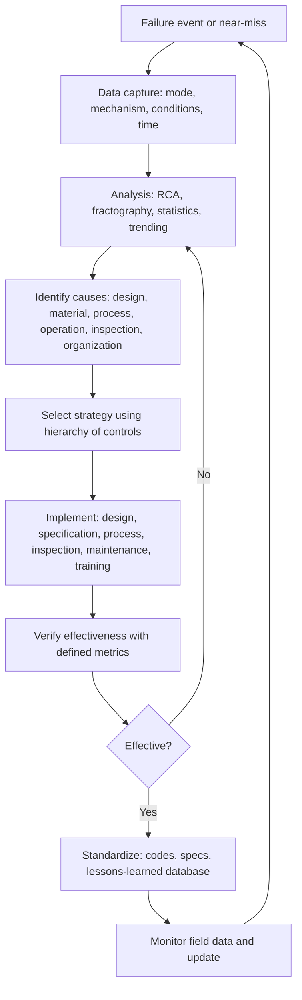

## Preventive Strategies Derived from Failure Data

Preventive strategies derived from failure data close the loop between failure investigation and design, materials selection, manufacturing, inspection, and operation. Failure analysis is only economically and ethically justified if its findings change what is built, how it is made, how it is operated, and how it is monitored. This reference describes how failure data are collected and structured, how they are analyzed quantitatively and qualitatively, and how the results are converted into preventive actions: design and materials changes, process controls, inspection and monitoring programs, maintenance strategies, specifications and standards, and organizational learning.

### 1. Principles

**Key Points**

- **Prevention is the purpose of failure analysis.** A root cause that does not result in a verified corrective or preventive action has not been fully exploited.
- **Data quality determines strategy quality.** Failure records that lack mode, mechanism, operating conditions, time in service, and cause cannot support reliable prevention decisions.
- **Elimination before detection.** Preventive actions are most effective when they remove or reduce the cause (design, material, process) rather than relying on inspection to catch consequences.
- **Extent of condition.** A failure of one component indicates the possible presence of the same cause in similar components, lots, processes, and sites.
- **Verification of effectiveness** must be planned: define measurable criteria and follow-up, since untested actions often fail to change outcomes.
- **Learning must persist.** Lessons are captured in standards, design rules, specifications, checklists, training, and databases so that they survive personnel turnover.

### 2. Failure Data: Sources, Structure, and Quality

#### 2.1 Sources of Failure Data

| Source | Content | Strengths | Limitations |
| --- | --- | --- | --- |
| Failure analysis reports and RCA | Mechanism, origin, root cause, material condition | High-quality, mechanism-level | Small sample; biased to severe failures |
| Warranty and service-return data | Failure counts, time in service, usage | Large volume; population level | Often lacks mechanism; censored data |
| Maintenance records (CMMS) | Repairs, replacements, downtime | Continuous history | Inconsistent coding; "replaced" may not equal "failed" |
| Inspection and NDE records | Flaw sizes, wall thickness, crack findings | Direct condition data | Detection limits; sizing error |
| Condition monitoring (vibration, temperature, acoustic emission, corrosion probes, strain) | Degradation trends | Early warning; continuous | Requires interpretation; sensor reliability |
| Test data (fatigue, corrosion, creep, qualification) | Controlled property data | Known conditions | May not represent service |
| Incident and near-miss reports | Precursor events | Reveal latent conditions | Under-reporting |
| Industry and public databases | Cross-company experience (accident investigation reports, regulatory databases, industry failure reporting) | Broad coverage | Variable detail; confidentiality |
| Supplier and process data (SPC, lot records, certificates) | Process capability and variation | Links failure to production lot | Requires traceability |

#### 2.2 Minimum Data Elements for a Usable Failure Record

| Element | Examples |
| --- | --- |
| Identification | Part number, serial and lot or heat number, location, install date |
| Service history | Operating hours, cycles, load spectrum, temperature, environment, repairs |
| Failure description | Mode (fracture, leak, wear, distortion), location, detection method, consequence |
| Mechanism | Fatigue, SCC, corrosion type, creep, overload, wear, embrittlement |
| Cause classification | Design, material, manufacturing, assembly, operation, maintenance, environment, organization |
| Evidence | Reports, photographs, fractography, chemistry, mechanical tests |
| Actions | Corrective and preventive actions, owners, dates, verification results |
| Status | Open, implemented, verified, closed |

A **controlled vocabulary** (taxonomy) for modes, mechanisms, and causes is essential so that records can be aggregated and searched.

#### 2.3 Censoring and Bias in Failure Data

- **Right censoring:** many units are still operating at the time of analysis; they carry information (they have survived to time $t$) and must be included in life-data analysis rather than discarded.
- **Left truncation and unknown age:** items installed before records began.
- **Survivorship and reporting bias:** failures that are not reported, that cause no consequence, or that are removed preventively are under-represented.
- **Mixed populations:** combining different lots, designs, or environments can hide distinct mechanisms.
- **Preventive replacement** removes units before failure and censors their data.

### 3. Analysis Methods That Convert Data into Prevention Targets

#### 3.1 Pareto Analysis

Rank failure modes, mechanisms, or causes by frequency, cost, or downtime; typically a small number of categories account for most losses (the "vital few"). The cumulative fraction after ranking $k$ categories is

$$F_k = \frac{\sum_{i=1}^{k} n_i}{\sum_{i=1}^{N} n_i}$$

Focus prevention effort on categories that dominate cumulative loss, but always review low-frequency, high-consequence modes separately, since Pareto by count can hide safety-critical items.

#### 3.2 Trending and Control Charts

Track failure rate, corrosion rate, crack incidence, or defect rate over time. For a count-based process with expected rate $\bar{c}$, a c-chart uses control limits

$$UCL = \bar{c} + 3\sqrt{\bar{c}}, \qquad LCL = \max\!\left(0,\ \bar{c} - 3\sqrt{\bar{c}}\right)$$

A point beyond the limits or a run of points on one side of the mean indicates a change in the underlying process, prompting investigation (for example a new supplier lot or a process drift). [Inference] — standard chart rules assume approximately Poisson-distributed counts and independent observations.

#### 3.3 Life-Data (Weibull) Analysis

The two-parameter Weibull distribution is widely used for mechanical, fatigue, and wear failures:

$$F(t) = 1 - \exp\!\left[-\left(\frac{t}{\eta}\right)^{\beta}\right], \qquad R(t) = \exp\!\left[-\left(\frac{t}{\eta}\right)^{\beta}\right]$$

$$h(t) = \frac{\beta}{\eta}\left(\frac{t}{\eta}\right)^{\beta-1}$$

where $\eta$ is the characteristic life (time by which 63.2% have failed) and $\beta$ is the shape parameter.

| $\beta$ range | Failure-rate behavior | Typical interpretation | Preventive implication |
| --- | --- | --- | --- |
| $\beta < 1$ | Decreasing | Infant mortality: defects, assembly errors, poor quality | Improve quality control, screening, burn-in; time-based replacement is not useful |
| $\beta \approx 1$ | Constant | Random events, external overloads | Condition monitoring and robust design; age-based replacement is not useful |
| $\beta > 1$ | Increasing | Wear-out: fatigue, wear, corrosion, creep | Scheduled replacement or inspection before the onset of wear-out can be effective |

Linearized Weibull plotting (median-rank regression) uses

$$\ln\!\left[\ln\!\frac{1}{1-F}\right] = \beta\ln t - \beta\ln\eta$$

so a straight line on Weibull probability paper gives $\beta$ (slope) and $\eta$ (from the intercept). Maximum-likelihood estimation is preferred for censored data. A curved plot suggests mixed failure modes or a threshold (three-parameter Weibull with location parameter $\gamma$). The shape parameter is a diagnostic clue, not proof of mechanism; physical evidence must confirm the mechanism. [Inference]

**B-life** is the time by which a given fraction fails; for example $B_{10}$ (10% failed):

$$B_{10} = \eta\left[-\ln(0.9)\right]^{1/\beta}$$

Design and replacement intervals are often set using a $B$-life with appropriate confidence.

#### 3.4 Exposure-Based and Cumulative Damage Models

- **Miner's linear damage rule** for variable-amplitude fatigue:

$$D = \sum_i \frac{n_i}{N_i}, \qquad \text{failure predicted when } D \approx 1$$

Experimental values of $D$ at failure scatter widely (often about 0.3 to 3), so a design or inspection interval should not rely on $D = 1$ without margin. [Unverified] — critical damage values depend on load sequence and material.

- **Paris-law crack growth** to set inspection intervals:

$$\frac{da}{dN} = C(\Delta K)^m, \qquad N_{a_0 \to a_c} = \int_{a_0}^{a_c}\frac{da}{C(\Delta K)^m}$$

- **Corrosion allowance and remaining life:**

$$RL = \frac{t_{act} - t_{min}}{CR}$$

where $t_{act}$ is the measured wall thickness, $t_{min}$ is the minimum required thickness, and $CR$ is the corrosion rate (long-term or short-term from measurements).

- **Larson–Miller creep-life parameter:**

$$P_{LM} = T\,(C_{LM} + \log t_r)$$

used to translate temperature excursions into consumed creep life. [Unverified] — the constant and validity range depend on the alloy.

#### 3.5 Physics-of-Failure and Statistical Integration

Field failure data (statistics) are combined with mechanism models (physics-of-failure) to calibrate model parameters, validate design assumptions, and predict the effect of proposed changes. For example, a measured fatigue life distribution can update the S-N curve parameters used in design:

$$N = \frac{C}{(\Delta\sigma)^m}$$

and the effect of a proposed reduction in stress range on life follows from the exponent: reducing $\Delta\sigma$ by 20% increases life by a factor $(1/0.8)^m$, or about 1.95 for $m = 3$.

#### 3.6 Reliability Growth

For repairable systems, the Crow–AMSAA (NHPP power-law) model tracks cumulative failures during improvement programs:

$$E[N(t)] = \lambda\,t^{\beta}$$

A fitted $\beta < 1$ indicates reliability growth (decreasing failure intensity), $\beta \approx 1$ no change, and $\beta > 1$ deterioration. [Inference] — the model assumes a specific intensity form; validity should be checked with goodness-of-fit.

#### 3.7 Qualitative and Structured Learning Tools

| Tool | Use in Prevention |
| --- | --- |
| Fault tree analysis | Identify combinations of failures; find single points of failure and cut sets to target |
| FMEA/FMECA | Update failure modes, causes, controls, and ratings with real field data |
| Barrier analysis | Determine which barriers failed and strengthen or add barriers |
| Change analysis | Isolate what changed when a failure rate rose (lot, supplier, process, environment) |
| Comparative analysis of failed vs. surviving components | Reveal differentiating factors such as location, batch, or operating regime |
| Trend and near-miss review | Detect precursors before failure |

### 4. From Cause to Strategy: Hierarchy of Controls

Preventive actions are ranked by effectiveness and reliability:

| Rank | Strategy | Materials and Metallurgy Examples |
| --- | --- | --- |
| 1. Eliminate | Remove the failure mechanism or hazard | Remove the sharp notch by redesign; eliminate the wet, chloride-laden environment by sealing; remove electroplating for high-strength fasteners |
| 2. Substitute | Replace the material, process, or coating | Change to a duplex or nickel alloy for chloride SCC service; substitute a cleaner steel grade; replace zinc electroplating with zinc-flake coating |
| 3. Engineer controls (design and process) | Reduce stress, improve resistance, add fail-safe features | Larger fillet radii; shot peening; PWHT; cathodic protection; redundant load paths; crack arrestors |
| 4. Detection and monitoring | Find damage early | NDE intervals from crack growth calculations; corrosion monitoring; vibration and acoustic emission monitoring |
| 5. Administrative | Procedures, training, and checklists | Welding procedure control; torque procedures; inspection protocols; management-of-change |

Detection and administrative controls are weaker because they rely on human performance and on detection capability; they should complement, not replace, higher-ranked controls.

### 5. Design and Materials-Selection Strategies

#### 5.1 Design Rules Derived from Failure Data

| Failure Data Pattern | Design Response |
| --- | --- |
| Fatigue origins at fillets, keyways, holes, weld toes | Increase radii; relocate features away from high-stress regions; use stress-relief grooves; specify weld toe grinding or peening; reduce $K_t$ |
| Brittle fracture at low temperature | Specify toughness (Charpy or fracture toughness) at the minimum design temperature; reduce section thickness or use tougher grade; design against crack arrest |
| Single-member catastrophic collapse | Provide load-path redundancy and progressive-collapse resistance; identify fracture-critical members with special requirements |
| Corrosion at crevices and dissimilar-metal junctions | Eliminate crevices; provide drainage; isolate dissimilar metals; choose galvanically compatible materials |
| SCC in susceptible alloy and environment | Break the triad: change alloy, reduce tensile stress (stress relief, peening), or change environment |
| Creep or thermal-fatigue failure in hot sections | Lower metal temperature (cooling, coatings); use creep-resistant alloy; accommodate thermal expansion; reduce constraint |
| Wear and fretting | Increase hardness of one surface; improve lubrication; add wear coatings; eliminate micromotion by preload or design |
| Hidden or inaccessible critical areas | Design for inspectability and access; add inspection ports; avoid crevices where inspection is impossible |

#### 5.2 Damage-Tolerance and Fail-Safe Philosophy

Based on lessons from fatigue failures in aircraft and welded structures:

- **Safe-life:** demonstrate that the structure survives the design life with a scatter factor; typically applied where inspection is impractical.
- **Fail-safe:** structure retains adequate residual strength after failure of a single element (redundancy).
- **Damage-tolerant:** assume initial flaws of a defined size (based on the detection capability of NDE), predict growth, and set inspection intervals so that flaws are detected before reaching critical size.

The inspection interval logic for damage tolerance is:

$$\Delta t_{insp} \le \frac{N_{a_{det}\to a_c}}{SF \cdot \dot{n}}$$

where $N_{a_{det}\to a_c}$ is the number of cycles to grow from the reliably detectable flaw size $a_{det}$ to the critical size $a_c$, $SF$ is a safety factor (often 2 or more, depending on the governing rules), and $\dot{n}$ is the cycle rate. [Unverified] — actual safety factors and the number of inspection opportunities are prescribed by the applicable regulations or standards.

#### 5.3 Materials Selection and Specification Updates

- Use failure data to **screen materials** for the actual environment: for example, chloride SCC failures in austenitic stainless steel lead to a rule restricting use above defined chloride and temperature limits and specifying duplex or higher-alloy materials.
- Add or tighten **specification requirements** that address the discovered cause:
  - maximum hardness and hydrogen-relief bake for plated high-strength fasteners;
  - cleanliness limits (inclusion rating, maximum inclusion size) for fatigue-critical steels;
  - through-thickness ductility (Z-grade) requirements to prevent lamellar tearing;
  - impact-toughness testing at the lowest service temperature;
  - restrictions on tramp elements (P, S, Sn, Sb, As) to prevent temper embrittlement;
  - requirements for solution annealing and quenching of austenitic stainless to prevent sensitization.
- Use **material-selection tools** (property charts, performance indices, corrosion tables) with failure data as constraints.

### 6. Manufacturing and Process-Control Strategies

Process-related failures are prevented by controlling the variables that determine microstructure, defects, and residual stress.

| Failure Cause Found | Preventive Process Strategy |
| --- | --- |
| Inclusions and porosity | Vacuum degassing, ladle metallurgy, filtration, controlled pouring; HIP for critical castings; incoming cleanliness testing |
| Forging laps and bursts | Die and preform design, temperature control, ultrasonic testing of billets and forgings |
| Heat-treatment deviations (hardness, quench cracks, decarburization) | Furnace uniformity surveys, calibrated instrumentation, controlled atmosphere, prompt tempering, quenchant monitoring, hardness and magnetic-particle inspection |
| Weld defects and hydrogen cracking | Qualified procedures, low-hydrogen consumables with controlled storage, preheat and interpass control, post-weld heat treatment, welder qualification, NDE |
| Grinding burns | Controlled feeds and coolant, wheel dressing, temper-etch or Barkhausen inspection |
| Hydrogen embrittlement from plating | Post-plating bake within a specified time after plating, low-embrittlement processes, sustained-load testing |
| Residual tensile stress | Stress relief, shot peening, laser or ultrasonic peening, cold working of holes, low-plasticity burnishing |
| Mix-ups and wrong material | Positive material identification, segregated storage, traceability, color coding |

#### 6.1 Statistical Process Control and Capability

Monitor critical characteristics (hardness, case depth, chemistry, plating thickness, residual stress) with control charts. The process capability index is

$$C_{pk} = \min\!\left(\frac{USL - \mu}{3\sigma},\ \frac{\mu - LSL}{3\sigma}\right)$$

where $USL$ and $LSL$ are the upper and lower specification limits, $\mu$ is the process mean, and $\sigma$ is the process standard deviation. Many industries expect $C_{pk} \ge 1.33$ for ordinary characteristics and higher values for critical or safety-related characteristics. [Unverified] — required capability levels are defined by customer or industry requirements.

The approximate defect rate for a centered, normally distributed process is $2\Phi(-3C_p)$ for two-sided limits. A capability index quantifies process variation but does not itself guarantee that the process cannot produce nonconforming items (drifts, non-normality, and special causes matter).

#### 6.2 Mistake-Proofing and Traceability

- **Poka-yoke:** design fixtures, tooling, and procedures so that errors (wrong part, wrong orientation, missed step) are impossible or immediately detected.
- **Lot and heat traceability** allows quick containment when a failure is found (identify all items from the affected lot) and supports investigation of supplier-related causes.

### 7. Inspection, Monitoring, and Maintenance Strategies

#### 7.1 Maintenance Strategy Selection Based on Failure Behavior

| Failure Behavior (from data) | Suitable Strategy |
| --- | --- |
| Wear-out with $\beta > 1$ and predictable life | Scheduled replacement or overhaul before $B$-life threshold; or condition-based replacement |
| Random failures ($\beta \approx 1$) | Condition monitoring, redundancy, run-to-failure where consequences are low |
| Infant mortality ($\beta < 1$) | Improve quality control and acceptance testing; avoid time-based replacement, which reintroduces infant-mortality risk |
| Detectable degradation with a warning period (P–F interval) | Condition-based maintenance with inspection interval shorter than the P–F interval |
| Hidden failures (protective devices) | Periodic functional testing |
| Safety-critical with high consequences | Design-out, redundancy, and conservative inspection or replacement |

The P–F interval concept: the time between the point at which a potential failure (P) becomes detectable and the functional failure (F). The inspection interval should be a fraction (commonly about half) of the P–F interval so that there is a high chance of detection before failure, with the exact fraction depending on the required confidence. [Inference] — the fraction depends on detection reliability and consequence.

#### 7.2 Risk-Based Inspection (RBI)

RBI allocates inspection resources by risk:

$$Risk = P_f \times C_f$$

where $P_f$ is the probability of failure (informed by damage mechanisms, materials, and inspection history) and $C_f$ is the consequence (safety, environmental, economic). Equipment with the highest risk receives the most frequent and most effective inspection; low-risk items receive less. Recognized practices include API 580 and API 581. Failure data determine the damage mechanisms assigned to each item and the credibility of the estimated probability. [Unverified] — application requirements should be confirmed against the current edition of the practice.

#### 7.3 Inspection Effectiveness and Probability of Detection

Inspection is only as good as its **probability of detection (POD)** for the relevant flaw type and size. A POD curve is often modeled with a log-odds or log-normal form:

$$POD(a) = \Phi\!\left(\frac{\ln a - \mu}{\sigma}\right)$$

where $a$ is flaw size, and $\mu$ and $\sigma$ are fitted parameters. The size $a_{90/95}$ (detected with 90% probability at 95% confidence) is commonly reported. The inspection method must be selected so that $a_{90/95}$ is well below the critical size, and the interval set so that a flaw missed at one inspection cannot grow to critical size before the next opportunity.

Where multiple independent inspection opportunities exist, the probability of missing a flaw at all $k$ inspections is

$$P_{miss} = \prod_{i=1}^{k}\left(1 - POD_i\right)$$

although independence is often optimistic because the same method, inspector, or flaw geometry can systematically cause repeated misses. [Inference]

#### 7.4 Condition Monitoring and Structural Health Monitoring

| Technique | Damage Detected | Typical Use |
| --- | --- | --- |
| Vibration and spectral analysis | Fatigue cracks, imbalance, bearing wear, looseness | Rotating machinery |
| Acoustic emission | Active crack growth, corrosion, leaks | Pressure equipment, bridges, tanks |
| Electrical potential drop and corrosion probes | Corrosion rate, wall loss | Pipelines, process plants |
| Ultrasonic thickness monitoring (permanently installed sensors) | Wall thinning | Piping and vessels |
| Strain gauges and load monitoring | Actual load spectrum, overloads | Structures, aircraft, cranes |
| Fiber-optic sensing | Strain, temperature | Structures, pipelines |
| Thermography | Overheating, delamination | Electrical and composite parts |
| Oil debris analysis | Wear particles | Gearboxes, engines |
| Usage and life-consumption tracking | Cumulative cycles, temperature exposure | Turbines, aircraft components |

Monitoring data should be trended against defined alert and alarm limits, with documented response actions.

### 8. Standards, Codes, and Knowledge Management

#### 8.1 Converting Lessons into Requirements

Historic failures have driven many code requirements. Examples of the pattern:

| Failure Pattern | Typical Codified Response |
| --- | --- |
| Brittle fracture of welded steel structures | Impact-toughness requirements and minimum design metal temperature rules |
| Fatigue in aircraft pressurized structures | Damage-tolerance and full-scale fatigue-test requirements |
| Undetected cracks in fracture-critical bridge members | Mandatory inspection programs and fracture-critical member designation |
| Hydrogen-related fastener failures | Post-plating bake and hardness limits in fastener specifications |
| Sour-service cracking in pipelines | Hardness limits and material qualification for sour service |
| Offshore structural fatigue | Fatigue design standards and structural redundancy |

Within an organization, the same pattern is applied through **engineering standards, design guides, material and process specifications, inspection procedures, and checklists**, updated after each significant failure.

#### 8.2 Lessons-Learned Systems

An effective system:

1. Captures the failure, cause, and prevention in a searchable database with controlled taxonomy.
2. Distributes lessons to designers, manufacturing, quality, maintenance, and suppliers.
3. Integrates lessons into **design review checklists**, FMEA templates, and training.
4. Tracks actions to closure and verifies effectiveness.
5. Reviews the database periodically to identify recurring patterns.

**Key Points**

- Lessons that remain only in reports are usually forgotten; embed them in **requirements and gates** (for example, a design review cannot pass without the fatigue-critical feature checklist).
- Share **near-miss** learning across sites and, where appropriate, across the industry (subject to confidentiality and legal considerations).
- Update FMEAs and control plans whenever field data or RCA reveal a new cause or a mis-rated occurrence or detection.

#### 8.3 Management of Change (MOC)

Many failures follow undocumented changes in material, supplier, process, load, or environment. MOC requires:

- Identification of the change and its potential effects on failure modes.
- Technical review by qualified personnel (materials and design).
- Approval before implementation and documentation of the decision basis.
- Verification after implementation.

### 9. Organizational and Human-Factors Strategies

- **Independent safety and quality oversight** with authority to stop operations.
- **Reporting culture:** protect people who report anomalies; treat repeated "acceptable" deviations as a warning sign (normalization of deviance).
- **Competence and training:** train personnel on failure mechanisms relevant to their tasks (for example, welders on hydrogen cracking, inspectors on the limits of NDE methods, operators on temperature and pressure limits).
- **Clear accountability** for design authority, change approval, and inspection acceptance, especially across contractor and supplier boundaries.
- **Decision discipline:** define objective criteria for go/no-go decisions, and require justification when data conflict with expectations.
- **Supply-chain controls:** supplier qualification, audits, incoming inspection, and counterfeit-avoidance measures.

### 10. Verification of Effectiveness

Preventive actions must be verified with objective measures:

| Action Type | Verification Approach |
| --- | --- |
| Design change | Analysis, testing (fatigue, corrosion, prototype), and field monitoring of the modified design |
| Process change | Capability study ($C_{pk}$), first-article inspection, metallography, and mechanical testing on production lots |
| Material change | Qualification testing, exposure tests, service trials |
| Inspection change | POD demonstration or validation on representative flawed samples |
| Procedure or training | Audits, observation, and competency assessment |
| Overall program | Post-implementation failure rate, downtime, cost, and near-miss trends |

A before-and-after comparison of failure rates should account for exposure. For counts $x_1$ and $x_2$ over exposures $T_1$ and $T_2$ (for example operating hours), the rate ratio is

$$RR = \frac{x_2 / T_2}{x_1 / T_1}$$

and its statistical significance should be assessed (for example by an exact Poisson test or confidence interval) because small counts fluctuate naturally. [Inference] — a lower observed count over a short period does not by itself demonstrate effectiveness.

**Cost-benefit** analysis supports prioritization:

$$BCR = \frac{\Delta R \cdot C_f}{C_{action}}$$

where $\Delta R$ is the reduction in expected failure frequency, $C_f$ the consequence cost, and $C_{action}$ the cost of the action over the same period. For safety-critical or regulated risks, decisions are made against risk-acceptance criteria and legal duties, not by cost-benefit alone. [Unverified] — risk-acceptance frameworks (such as ALARP) differ by jurisdiction and sector.

### 11. Worked Example: Fatigue Failures in Welded Brackets

**Example**

*Data:* Over five years, a fleet of 400 welded steel brackets on vibrating equipment shows 18 cracking failures. Investigation of ten failed brackets by fractography shows fatigue cracks initiating at the weld toe at the same location in all ten. Metallography and chemistry show conforming material; weld toe profiles have high angles with undercut in seven brackets.

1. **Life-data analysis:** Failure times (operating hours) are fitted to a Weibull distribution using maximum likelihood with the 382 survivors treated as right-censored. The fitted parameters are $\beta \approx 2.6$ and $\eta \approx 41{,}000$ h (illustrative). Since $\beta > 1$, wear-out (fatigue) behavior is confirmed, consistent with the fractography.
2. **B-life:** The $B_{10}$ life is

$$B_{10} = 41{,}000\,[-\ln(0.9)]^{1/2.6} = 41{,}000 \times (0.1054)^{0.3846} \approx 41{,}000 \times 0.4246 \approx 17{,}400\ \text{h}$$

3. **Pareto and cause analysis:** Weld-toe fatigue accounts for the majority of the fleet's failures. Change analysis shows that brackets from a second production period (a new welding contractor) fail earlier, with more undercut.
4. **Root causes:**
   - *Design:* weld toe located at a high-stress region with a low fatigue category detail.
   - *Process:* inadequate weld profile control and no toe treatment.
   - *Inspection:* visual inspection did not measure undercut depth; no fatigue-critical weld requirement in the specification.
5. **Preventive strategies (hierarchy of controls):**
   - *Eliminate/engineer:* redesign the bracket to move the weld away from the peak-stress region and reduce load-path eccentricity, decreasing the stress range by an estimated 25%. With $m = 3$, the life improvement factor is $(1/0.75)^3 \approx 2.37$.
   - *Engineer (process):* introduce weld-toe grinding or ultrasonic impact treatment and specify a maximum toe angle and undercut depth.
   - *Detection:* add magnetic-particle inspection of the weld toe for a defined initial sample, and periodic inspection at intervals based on crack growth calculation and POD of the method.
   - *Administrative:* update the welding procedure specification and contractor qualification; add fatigue-critical-weld requirements to the design standard.
6. **Verification:** Post-implementation, monitor cracking incidence per 100,000 bracket-hours; compare with the previous rate using the rate ratio and a confidence interval; verify weld profile compliance through inspection statistics (control chart of undercut depth). Conduct a fatigue test on redesigned and treated brackets to confirm improvement.
7. **Extent of condition:** Inspect other equipment types using the same weld detail and contractor; update the FMEA (occurrence rating for this cause) and the design-review checklist.

**Output** (summary): Mechanism: weld-toe fatigue; Data insight: Weibull $\beta > 1$ with contractor-related shift; Strategy: redesign to reduce stress range, toe treatment, targeted NDE, specification updates, verified by monitoring and testing.

### 12. Implementation Roadmap for a Prevention Program

| Phase | Key Activities | Outputs |
| --- | --- | --- |
| Foundation | Define taxonomy, data fields, reporting rules; integrate CMMS, inspection, and quality data | Failure database with controlled vocabulary |
| Analysis | Regular Pareto and trend reviews; Weibull analysis on major populations; RCA on significant events | Ranked list of prevention targets |
| Action | Assign owners; apply hierarchy of controls; plan verification | Action plans with metrics and dates |
| Integration | Update standards, specs, FMEA, control plans, RBI, inspection plans | Revised controlled documents |
| Verification | Track leading and lagging indicators; audit effectiveness | Closure evidence and residual risk statement |
| Learning | Lessons-learned distribution; training; cross-site sharing | Institutional knowledge retained |

### 13. Metrics for Preventive Programs

| Metric | Type | Purpose |
| --- | --- | --- |
| Failure rate per unit exposure | Lagging | Overall reliability outcome |
| Mean time between failures (MTBF) for repairable items, or $B_{10}$ life for non-repairable | Lagging | Life performance |
| Repeat-failure rate (same cause recurring) | Lagging | Effectiveness of corrective actions |
| Percentage of actions closed and verified on time | Leading | Program discipline |
| Near-miss and anomaly reports per period | Leading | Reporting culture and early detection |
| Inspection findings trend (defects per inspection) | Leading | Emerging degradation |
| Process capability ($C_{pk}$) for critical characteristics | Leading | Process control |
| Percentage of critical items with current RBI/FMEA | Leading | Coverage |
| Cost of poor quality, downtime, and warranty | Lagging | Business impact |

### 14. Common Pitfalls

- **Treating symptoms:** replacing failed parts without changing the cause (repeat failures).
- **Relying on inspection or procedures alone** when a design or material change would remove the cause.
- **Poor data structure:** free-text records without mechanism or cause coding, making trend analysis impractical.
- **Ignoring censored data:** analyzing only failed units gives biased, pessimistic life estimates.
- **Mixing failure modes** in one Weibull fit, producing a misleading $\beta$ and hiding distinct mechanisms.
- **Over-interpreting small samples:** conclusions from a handful of failures or from short before-and-after intervals.
- **Failing to verify** that corrective actions were implemented and effective.
- **Scope too narrow:** not extending actions to similar components, lots, sites, or suppliers.
- **Time-based replacement for infant-mortality or random failures,** which adds cost and can increase failures by reintroducing early-life defects.
- **Neglecting change management:** reintroducing the original cause through a later change of supplier, process, or design.
- **Prioritizing only by frequency,** overlooking rare but catastrophic modes that require design-out or redundancy.
- **Losing lessons through personnel turnover** because they were never embedded in standards and training.

### 15. Standards and Reference Sources

- ASM Handbook, Volume 11: *Failure Analysis and Prevention*.
- API 580 and API 581 (risk-based inspection); API 579-1/ASME FFS-1 (fitness-for-service).
- IEC 60812 (FMEA), IEC 61025 (fault tree analysis), IEC 61649 and related reliability data-analysis standards (Weibull analysis).
- ISO 31000 and IEC 31010 (risk management and assessment techniques).
- ISO 55000 series (asset management); ISO 14224 (collection and exchange of reliability and maintenance data for equipment).
- SAE JA1011 and JA1012 (reliability-centered maintenance evaluation criteria); Moubray, *Reliability-Centered Maintenance*.
- Abernethy, *The New Weibull Handbook*; Meeker and Escobar, *Statistical Methods for Reliability Data*.
- MIL-HDBK-189 (reliability growth management) and related Crow–AMSAA literature.
- ISO 9001 and IATF 16949 (quality management, including corrective and preventive action requirements); AS9100 in aerospace.

[Unverified] — standard numbers, titles, and status (current, superseded, or withdrawn) should be verified before citation.

### Conclusion

Preventive strategies derived from failure data turn isolated investigations into systematic reliability improvement. The process begins with structured, high-quality data capture; proceeds through quantitative analysis (Pareto ranking, trending, Weibull life-data analysis, damage and crack-growth models) and qualitative tools (RCA, FTA, FMEA, barrier and change analysis); and culminates in actions prioritized by the hierarchy of controls: eliminate or substitute the cause, engineer it out through design and process control, and only then rely on detection, monitoring, and administrative measures. Effective programs verify each action with objective metrics, extend corrections to similar items, embed lessons in specifications, standards, and training, and use management of change to prevent regression. By treating every failure and near-miss as data for improvement, organizations reduce recurrence, extend service life, and manage risk in a demonstrable way.

### Related Topics

- Reliability Engineering and Weibull Life-Data Analysis
- Risk-Based Inspection and Fitness-for-Service Assessment
- Damage-Tolerance Design and Inspection Interval Determination
- Reliability-Centered Maintenance
- Statistical Process Control and Process Capability
- Structural Health and Condition Monitoring
- Management of Change and Safety Culture
- Failure Reporting, Analysis, and Corrective Action Systems (FRACAS)