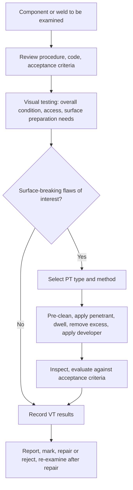
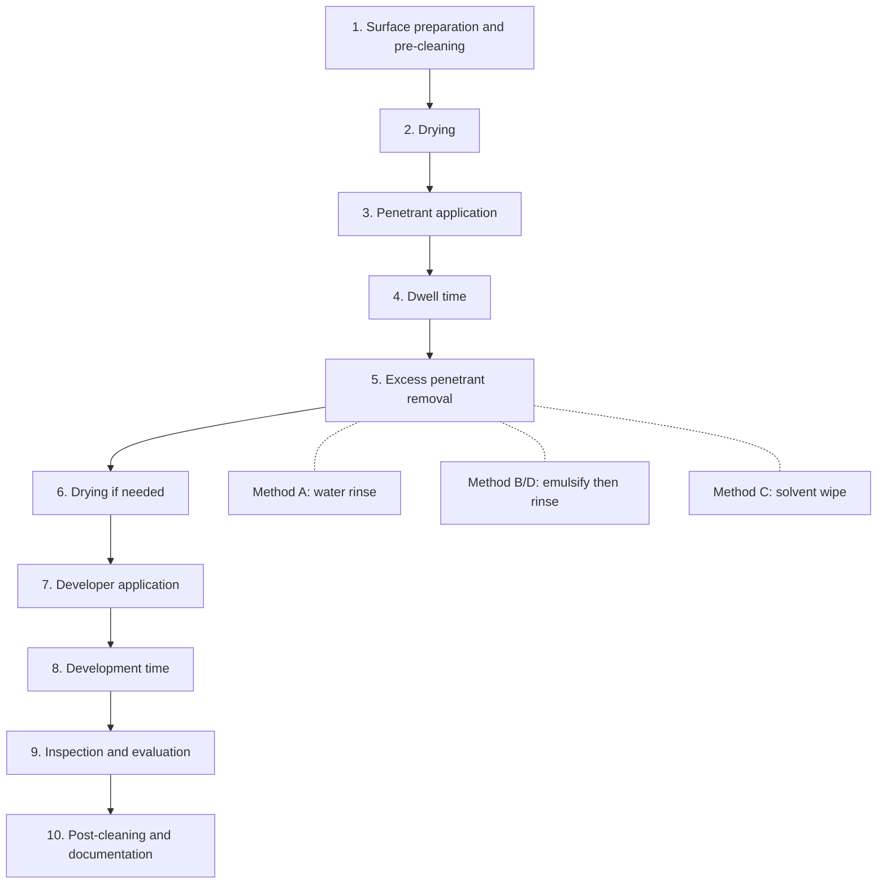

## Visual and Liquid Penetrant Testing

Visual testing (VT) and liquid penetrant testing (PT) are the two most widely used surface nondestructive examination methods. VT relies on the trained human eye, alone or aided by optical, video, or measuring devices, to detect and evaluate surface conditions. PT uses capillary action to draw a visible or fluorescent dye into surface-breaking discontinuities, then a developer to draw it back out so that the indication becomes visible. Both are low in cost, portable, applicable to a very wide range of geometries and materials, and are usually the first examinations applied in fabrication, in-service inspection, and failure analysis. Their limits are equally important: VT and PT detect only what is open to, or visible on, the surface, and both are strongly dependent on surface condition, lighting, procedure, and inspector competence.

### 1. Role in Quality Assurance and Failure Analysis

**Key Points**

- VT is normally the **first** examination performed. It can reveal gross defects, dimensional nonconformance, weld profile problems, corrosion, and surface damage, and it frequently determines where other methods should be applied.
- PT is applicable to **nonporous, non-absorbent** materials (metals, ceramics, glass, dense plastics), including non-magnetic alloys where magnetic particle testing cannot be used (austenitic stainless steels, aluminum, titanium, nickel alloys, copper alloys).
- Both methods detect **surface-breaking** discontinuities only. PT cannot find subsurface flaws or closed cracks, and VT cannot find anything hidden from view.
- In fractographic and failure work, VT and PT must be applied **before** any cleaning or destructive step that could alter evidence, and PT contaminates surfaces, so it should not be applied to fracture surfaces or to areas destined for later SEM/EDS analysis without deliberate planning. [Inference] — dye and solvent residues may interfere with later microanalysis and corrosion-product evidence.

### 2. Visual Testing (VT)

#### 2.1 Principle and Scope

VT is the evaluation of an item by observing its surface, directly or with aids, to assess its condition, dimensions, and the presence of discontinuities. It covers:

- Weld profile, reinforcement, undercut, overlap, surface porosity, cracks, spatter, misalignment, and distortion.
- Corrosion, pitting, erosion, wear, mechanical damage, coating condition, leakage evidence, and marking.
- Fit-up and assembly checks (gaps, alignment, fasteners, thread engagement).
- Internal surfaces of pipes, vessels, engines, and castings (remote VT).

The physical basis is the interaction of light with the surface: a discontinuity is detected when it produces **contrast** (difference in luminance or color) or **geometric relief** (shadowing, reflection change) large enough for the observer's visual system to resolve.

#### 2.2 Visual Acuity and Human Factors

**Key Points**

- Inspectors must have adequate **near-vision acuity** and **color discrimination** as required by the applicable qualification scheme. Common requirements are near-vision acuity (for example, reading a defined Jaeger or Snellen-equivalent chart at a specified distance) with periodic (often annual) re-examination, and color-contrast differentiation appropriate to the method. [Unverified] — exact acuity criteria and test frequencies differ between standards (for example ISO 9712, EN ISO 17637, ASNT SNT-TC-1A, and NAS 410); confirm against the governing document.
- Detection reliability decreases with **fatigue, time pressure, poor access, glare, and monotony**. Structured procedures, checklists, breaks, and calibrated aids reduce human-factor errors.
- Minimum resolvable detail depends on the visual angle. The angle subtended by a feature of size $s$ at viewing distance $d$ is

$$\theta \approx \frac{s}{d}\ \text{(radians, for small angles)}$$

The human eye with normal acuity resolves roughly 1 arcminute ($\approx 2.9\times10^{-4}$ rad), so at $d = 300\,\text{mm}$ the smallest resolvable feature is about $s \approx 0.09\,\text{mm}$ under ideal contrast. In practice, detectability of a real flaw is much poorer than this limit because of low contrast, roughness, and distractions. [Inference] — figures are idealized limits, not inspection capabilities.

#### 2.3 Lighting Requirements

Adequate illumination is essential. Typical code requirements specify a **minimum illuminance at the surface** (for example, in lux or foot-candles) and a maximum viewing distance and angle. Illustrative values often quoted (verify against the governing code):

| Task | Typical Minimum Illuminance |
| --- | --- |
| General inspection | ≥ 350 to 500 lux (about 30 to 50 fc) |
| Detailed inspection of small features | ≥ 1000 lux (about 100 fc) |
| Weld inspection per common welding codes | Commonly ≥ 1000 lux at the surface, or 500 lux for some general requirements |

Illuminance follows the inverse-square relationship for a point source:

$$E = \frac{I\cos\theta}{r^2}$$

where $E$ is illuminance (lux), $I$ is luminous intensity (candela), $r$ is distance to the surface, and $\theta$ is the angle between the surface normal and the direction to the source. Doubling the distance reduces illuminance to one quarter.

Practical lighting guidance:

- Use **oblique (raking) light** to reveal surface relief such as cracks, laps, and undercut through shadow.
- Avoid **glare** and specular reflection; use diffused or polarized light where necessary.
- Match the **color temperature** and spectrum to the task (cool white or daylight-like sources improve color discrimination of corrosion products and heat tint).
- Check that illuminance is measured with a calibrated light meter at the surface.

#### 2.4 Direct and Remote Visual Testing

| Type | Description | Typical Use |
| --- | --- | --- |
| Direct VT | Eye within a specified distance (commonly within about 600 mm) and at an angle of typically not less than about 30° to the surface, unaided or with magnifiers, mirrors | Weld and surface inspection with access |
| Remote VT | Optical aids or video systems transmit the image: borescopes, fiberscopes, videoscopes, pan-tilt-zoom cameras, crawlers, drones, robotic and underwater systems | Internal surfaces, hazardous or inaccessible areas, large structures |

[Unverified] — the maximum distance and minimum viewing angle for direct VT differ among codes (for example ASME Section V Article 9); confirm the applicable edition.

#### 2.5 Visual Aids and Measuring Tools

| Tool | Purpose |
| --- | --- |
| Magnifier (2× to 10×) or loupe | Enlarge small surface detail |
| Mirrors | Access to hidden faces |
| Borescope, fiberscope, videoscope | Internal cavity inspection; resolution and field of view depend on optics and sensor |
| Weld gauges (fillet gauge, Cambridge gauge, bridge cam gauge, high-low gauge) | Measure throat, leg length, reinforcement, undercut depth, and misalignment |
| Feeler gauges and depth micrometers | Gap, pit, and undercut depth |
| Calipers, micrometers, straightedges, profile gauges | Dimensional verification |
| Surface roughness comparators and replicas | Surface finish and casting surface evaluation |
| Digital imaging, photogrammetry, 3D scanning, laser profilometry | Documentation and quantitative geometry |
| Light meter | Verify illuminance |
| Temperature indicators | Verify preheat and interpass conditions when required |

#### 2.6 Visual Testing of Welds

Typical stages: **before welding** (material identification, joint preparation, fit-up, cleanliness, preheat), **during welding** (interpass cleaning, bead sequence, parameters, interpass temperature), and **after welding** (profile, surface defects, dimensions, marking).

| Feature | What to Look For | Significance |
| --- | --- | --- |
| Cracks | Fine linear indications at the surface, crater cracks, toe cracks | Usually unacceptable; hydrogen, hot, or fatigue-related |
| Undercut | Groove at the toe | Stress concentrator; reduces fatigue life |
| Overlap | Weld metal lapping onto the base metal without fusion | Notch-like flaw; reduces fatigue life |
| Excess or insufficient reinforcement | Height outside the allowed range | Stress concentration or reduced section |
| Incomplete fusion (visible at surface) | Unfused edge | Planar flaw |
| Incomplete penetration or root concavity/suck-back | Visible at the root side | Section reduction, crack initiation |
| Surface porosity and wormholes | Voids opening at the surface | Reduced section, corrosion, fatigue initiation |
| Arc strikes | Local burn marks outside the weld | Hard, brittle spots; crack initiation |
| Spatter | Adherent droplets | Cosmetic, may hide defects, coating problems |
| Misalignment (high-low) | Offset of the plates | Stress concentration and reduced fatigue category |
| Distortion | Angular or bowing deformation | Dimensional nonconformance |
| Heat tint (oxidation color) on stainless and titanium | Color of the oxide layer | Indicates shielding-gas effectiveness; heavy oxidation may reduce corrosion resistance |

#### 2.7 Visual Testing in Failure Analysis and In-Service Inspection

- Visual examination of a failed component documents fracture location, orientation, deformation, corrosion, and witness marks, and it guides sampling.
- In-service VT checks for corrosion under insulation, coating breakdown, leaks, cracks at attachment welds, wear, loosening, and impact damage.
- **Recording** is essential: photographs with scale and orientation markers, sketches, dimensions, and standardized reporting terms, so that observations are reproducible and comparable between inspections.

#### 2.8 Advantages and Limitations of VT

| Advantages | Limitations |
| --- | --- |
| Low cost, immediate results | Surface only; depends on access and lighting |
| Applicable to all materials | Subjective; dependent on inspector skill and alertness |
| Quantitative dimensional checks possible | Small or tight cracks may be invisible |
| Precedes and complements other NDE | Surface contamination and coatings can hide defects |
| Portable; minimal equipment | Difficult to standardize sensitivity without reference samples |

### 3. Liquid Penetrant Testing (PT)

#### 3.1 Principle

PT exploits **capillary action**. A low-viscosity liquid with good wetting properties is applied to a clean surface; it enters surface-breaking discontinuities by capillary rise. After dwell time, excess surface penetrant is removed, and a fine, absorbent **developer** draws the entrapped penetrant back to the surface, where it spreads (bleed-out) and forms an enlarged, high-contrast indication.

#### 3.2 Physics of Capillary Action

The capillary pressure driving penetrant into a narrow opening of effective radius $r$ (or half-width for a slit-like crack) is given by the Young–Laplace relationship:

$$\Delta P = \frac{2\gamma\cos\theta}{r}$$

where $\gamma$ is the surface tension of the liquid and $\theta$ is the contact angle between the liquid and the solid. For effective penetration:

- The contact angle should be **small** (good wetting; $\cos\theta$ near 1).
- The surface tension should be adequate; in practice the penetrant is formulated for a balance of wetting and retention rather than maximum surface tension.
- Narrower cracks generate higher capillary pressure but fill more slowly and hold small liquid volumes.

The rate of penetration into a capillary follows the Washburn equation:

$$L^2 = \frac{\gamma\, r\cos\theta}{2\eta}\,t \quad\Rightarrow\quad L = \sqrt{\frac{\gamma\, r\cos\theta}{2\eta}\,t}$$

where $L$ is the penetration length, $\eta$ is the dynamic viscosity, and $t$ is time. The square-root dependence explains why finer cracks and higher-viscosity penetrants need longer **dwell times**. [Inference] — real cracks are irregular, rough, and often partially filled or closed, so the idealized capillary model gives trends but not exact dwell times; dwell times are set by procedure and qualification.

Additional physical points:

- **Entrapped air or gas** in blind, tight cracks resists penetration, since the gas must be compressed or dissolved; this limits detection in very fine cracks.
- **Contaminants** (oil, water, scale, paint) fill or block the opening, preventing entry; hence cleaning is critical.
- **Closed cracks** (tightly compressed by residual stress, or smeared over by machining, peening, blasting, or grinding) may not accept penetrant.

#### 3.3 Classification of Penetrant Systems

Penetrant systems are classified by dye type, removal method, and developer form. A commonly used classification (for example in ASTM E1417 and ISO 3452 / EN ISO 3452-1 and AMS 2644) is:

**By penetrant type (dye)**

| Type | Description | Viewing |
| --- | --- | --- |
| Type I | Fluorescent dye penetrant | Ultraviolet-A (UV-A) light in reduced white light |
| Type II | Visible (color contrast) dye penetrant, usually red | White light |
| Type III (in some specifications) | Dual-mode (fluorescent and visible) | Either |

**By removal method**

| Method | Description | Use |
| --- | --- | --- |
| Method A | Water-washable | Rougher surfaces, high-volume; risk of over-washing |
| Method B | Post-emulsifiable, lipophilic (oil-based emulsifier) | Higher sensitivity; controlled removal |
| Method C | Solvent-removable | Portable, field, spot inspection |
| Method D | Post-emulsifiable, hydrophilic (water-based emulsifier) | High sensitivity; good control and reduced over-removal risk |

**By developer form**

| Form | Description |
| --- | --- |
| Form a | Dry powder |
| Form b | Water-soluble |
| Form c | Water-suspendible |
| Form d | Non-aqueous wet (solvent-suspended), the most common for portable work |
| Form e | Aqueous (specific applications) |
| Form f | Special applications |

[Unverified] — designations and sub-classifications (for example sensitivity levels 1/2 (or ½), 3, 4 for fluorescent penetrants, and the exact letter and form assignments) vary between ASTM E1417, ISO 3452, AMS 2644, and customer specifications; confirm against the governing standard.

**Sensitivity levels** (fluorescent penetrants, ASTM/AMS convention): from ultra-low (level ½) through low, medium, high, to ultra-high (level 4). Higher sensitivity detects smaller flaws but may produce more background fluorescence and require more careful removal. The selection is a compromise between flaw detectability and background noise.

**Common combinations**

| Combination | Typical Application |
| --- | --- |
| Type II, Method C, Form d (visible, solvent-removable, non-aqueous wet developer) | Field and portable inspection of welds, general fabrication |
| Type I, Method A or D (fluorescent, water-washable or hydrophilic) | Production inspection of castings, forgings, machined parts, aerospace components |
| Type I, Method B or D, high sensitivity | Critical aerospace and rotating parts where fine fatigue cracks must be found |

#### 3.4 Penetrant Materials

- **Penetrant:** carrier oil or solvent with dissolved dye (visible red dye; fluorescent dyes emitting typically yellow-green light under UV-A). The formulation provides wetting, low viscosity, stability, and washability appropriate to the type.
- **Emulsifier (Methods B and D):** oil-based (lipophilic) or water-based (hydrophilic) surfactant that renders the penetrant washable after a defined emulsification time.
- **Remover:** water (Methods A, B, D) or solvent (Method C).
- **Developer:** a fine, white powder (for example kaolin or talc-type powders) applied dry, suspended in water or solvent; it acts as a blotter, draws penetrant out, spreads it laterally to enlarge the indication, and provides a white contrast background for visible dyes.
- **Cleaners and pre-cleaning agents:** solvents, alkaline or acid cleaners, degreasers, and mechanical aids as appropriate.

**Material controls:** many specifications require penetrant materials to be **certified for sulfur, halogen (chlorine and fluorine), and sodium content** when used on austenitic stainless steels, nickel alloys, and titanium, because residual sulfur or halogens can promote corrosion or stress-corrosion cracking, and some contaminants cause embrittlement of titanium. Consumables from different manufacturers or different families should not be mixed in the same system unless qualified. [Unverified] — acceptable limits (for example percent by weight of chlorine or fluorine) are set by the applicable specification such as ASME Section V Article 6 / SE-165 requirements or customer requirements.

#### 3.5 The PT Process Step by Step

**Step 1: Surface preparation and pre-cleaning**

- Remove all contaminants that can block flaws or interfere with the indication: oil, grease, paint, scale, rust, weld spatter, flux, sealers, and machining fluids.
- Methods: solvent wiping, vapor degreasing, detergent or alkaline cleaning, ultrasonic cleaning, steam cleaning, chemical (acid) etching where needed, and mechanical cleaning (wire brushing, grinding) used with caution.
- **Mechanical cleaning risk:** blasting, wire brushing, sanding, grinding, machining, peening, and buffing can **smear metal over surface-breaking flaws** and close them. Where such operations preceded PT, an **etch** (chemical removal of a thin surface layer) is commonly required to reopen flaws, followed by thorough rinsing and drying. [Unverified] — etching requirements and solutions (for example for aluminum, titanium, and high-strength steels) are defined by process specifications and must be followed.
- Ensure that **cleaning solvents and moisture have evaporated** from flaws before penetrant application, since trapped liquids block entry. Drying at controlled temperatures is standard. Avoid overheating that could bake contaminants into cracks.

**Step 2: Penetrant application**

- Apply by spraying, brushing, dipping, or flooding so the entire area is wetted. Avoid pooling or drying.
- Standard **temperature range** for the part and penetrant is commonly about 10 to 52 °C (50 to 125 °F) for standard procedures. Outside this range, the procedure must be qualified with comparator blocks or reference panels. [Unverified] — confirm range with the governing code (for example ASME Section V Article 6).

**Step 3: Dwell time**

- The **penetrant dwell time** allows penetration into flaws. Typical dwell times range from about 5 to 60 minutes depending on material, penetrant type, flaw type, and temperature. Examples often specified: 5 to 10 minutes for many weld and casting applications with visible dyes; longer (up to 30 to 60 minutes) for tight cracks, fatigue cracks, or low temperatures. Penetrant must not dry on the surface; re-apply if needed. [Unverified] — dwell times are tabulated in specifications by material and discontinuity type; use the applicable table.

**Step 4: Excess penetrant removal**

Goal: remove penetrant from the surface while leaving penetrant in flaws.

| Method | Removal Procedure | Key Cautions |
| --- | --- | --- |
| A (water-washable) | Rinse with water spray (coarse spray, controlled pressure and temperature, typically limited pressure such as up to about 275 kPa (40 psi) and water temperature below about 40 °C (100 °F)). Under fluorescent UV monitoring | Over-washing can remove penetrant from shallow or wide flaws |
| B (lipophilic post-emulsifiable) | Apply oil-based emulsifier for a controlled emulsification time (not exceeding the maximum time); then water rinse | Too long emulsification removes penetrant from flaws; too short leaves background |
| C (solvent-removable) | Wipe with lint-free cloth dampened with solvent, first dry wipe then a lightly solvent-dampened wipe. **Do not spray solvent directly onto the surface or flush**, since that can wash out penetrant from flaws | Over-wiping; solvent flushing is prohibited in most procedures |
| D (hydrophilic post-emulsifiable) | Pre-rinse with water, apply hydrophilic emulsifier (spray or dip at a controlled concentration and time), post-rinse | Emulsifier concentration and contact time must be controlled |

For fluorescent penetrants, removal is monitored under UV-A light to confirm adequate background reduction.

**Step 5: Drying**

- After water removal, dry the surface by wiping, forced warm air, or oven, with temperature control (for example, not exceeding a specified surface temperature such as about 71 °C or 160 °F) to avoid evaporating penetrant from flaws. Skip drying only where the developer type and specification permit (for example after solvent removal, the surface is left to air-dry briefly).

**Step 6: Developer application**

- **Dry powder (Form a):** applied by dipping, electrostatic, fluidized bed, or dust cloud; a light, uniform coat. Used mainly with fluorescent penetrants.
- **Water-suspendible or water-soluble (Forms b/c):** applied by dipping or spraying before drying; then dried.
- **Non-aqueous wet (Form d):** sprayed as a thin, uniform white layer after the surface is dry; the solvent evaporates leaving a fine powder film. Shake the can well; hold at the specified distance. Excessive thickness masks fine indications.

**Step 7: Development time**

- Time allowed for penetrant to bleed out, typically not less than about 10 minutes and often not more than about 60 minutes (dry developers may allow longer). Interpret indications **during and after** development, since the rate and pattern of bleed-out provide information about flaw size and type. Very fine cracks develop slowly; a large, rapidly spreading indication suggests a wide or deep flaw.

**Step 8: Inspection**

- **Visible-dye PT:** in white light, typical minimum illuminance at the surface about 1000 lux (about 100 fc), sometimes lower (for example 500 lux) depending on code. Red indications on a white developer background.
- **Fluorescent PT:**
  - **UV-A radiation** (wavelength about 315 to 400 nm, peak at about 365 nm) with minimum intensity at the surface commonly 1000 µW/cm² (about 10 W/m²) measured with a calibrated UV-A meter.
  - **Ambient white light** in the inspection area must be low (commonly below about 20 lux, 2 fc, or a specified low level) so that the fluorescent glow is visible.
  - Allow the inspector's eyes to **dark-adapt** for a minimum period (commonly at least 1 to 5 minutes) before inspection. Photochromic or tinted spectacles are not permitted in many procedures because they change the light reaching the eye.
  - UV lamps require a **warm-up period** (for mercury-vapor lamps, commonly about 5 to 10 minutes) for stable output; LED UV-A lamps stabilize faster. Check lamp intensity at defined intervals and after bulb replacement. UV filters should be inspected for cracks and dirt.
  - Safety: avoid direct exposure of eyes and skin to UV-A; use appropriate eyewear where required.

[Unverified] — the numerical values for intensity, ambient light, and dwell/development times differ between standards (ASTM E1417, ASME Section V Article 6, ISO 3452-1, EN ISO 3059); consult the governing procedure.

**Step 9: Post-cleaning**

- Remove residual penetrant and developer, particularly where they could cause corrosion, interfere with subsequent processes (welding, plating, coating, heat treatment), or contaminate service fluids (oxygen systems, food-contact, nuclear).
- Methods: water washing, solvent cleaning, ultrasonic cleaning, or steam. In some applications, a **protective coating or rust preventive** is applied afterward.

#### 3.6 Interpretation of Indications

Indications are classified as **relevant**, **non-relevant**, or **false**.

| Category | Description | Examples |
| --- | --- | --- |
| Relevant | Caused by a discontinuity (flaw) | Cracks, laps, seams, porosity, lack of fusion, shrinkage cavities |
| Non-relevant | Caused by part geometry or a condition that is not a defect | Keyways, splines, press-fit edges, sharp fillets, threads, rough surface that traps penetrant |
| False | Caused by improper technique or contamination | Penetrant on the inspector's hands or clothing, incomplete removal, lint, insufficient cleaning, developer contamination |

**Typical indication appearances**

| Discontinuity | Typical PT Indication |
| --- | --- |
| Crack (fatigue, quench, grinding, hot, cold) | Continuous or intermittent thin line, often sharp and jagged; may show gradual bleed-out; grinding cracks often appear as a network or lines perpendicular to the grinding direction |
| Lap or fold | Curved or irregular, often at an angle to the surface, sometimes a wider line |
| Seam | Straight or slightly wavy line along the working direction |
| Porosity | Round or elongated dots, isolated or clustered |
| Cold shut (castings) | Smooth, continuous or intermittent line with rounded ends |
| Lack of fusion (surface open) | Straight or curved line along the weld edge |
| Shrinkage | Ragged, irregular, often broad clusters in castings |
| Leaks (through-wall) | Indication on the opposite side when penetrant is applied on the other side |
| Delamination or laminations (open at edges) | Line at edge of plate |

**Evaluation** distinguishes linear from rounded indications by the aspect ratio: an indication is commonly classified as **linear** if its length is at least three times its width ($l \ge 3w$) and **rounded** if $l < 3w$; acceptance limits differ between these categories. [Unverified] — confirm the ratio and acceptance limits in the applicable code (for example ASME Section VIII Div. 1 Appendix 8 or ASME B31.3).

**Key Points**

- **Bleed-out** rate and spread aid interpretation, but the indication size does not equal the true flaw size; the enlargement depends on the amount of penetrant, dwell, and development time.
- **Evaluate indications within the prescribed window** after developer application; longer times can produce overspreading and merged indications, while premature reading may miss fine flaws.
- **Re-testing** (after re-cleaning) may be needed to resolve doubtful indications; use the full process again after thorough cleaning, because residual developer or penetrant interferes.
- **Surface condition affects interpretation:** rough, porous, or scale-covered surfaces produce high background; grinding or light blending of surface irregularities (with subsequent PT) may be allowed by procedure.

#### 3.7 Sensitivity, Detectability, and Process Control

**Factors affecting sensitivity**

- Surface condition and cleanliness; smeared metal.
- Flaw characteristics: width, depth, length, tightness, contamination inside the flaw, orientation is not critical (unlike magnetic particle testing) since PT is omnidirectional.
- Penetrant type and sensitivity level; dwell time; temperature.
- Removal technique quality (over- or under-removal).
- Developer type, coating thickness, and development time.
- Lighting conditions and inspector visual acuity (and dark adaptation for fluorescent).
- The **contrast ratio** (visibility) between the indication and background.

**System performance checks (routine QA)**

| Check | Purpose | Typical Frequency |
| --- | --- | --- |
| Comparator block or test panel (for example, cracked chrome-plated panel, TAM or PSM panel, or aluminum quench-cracked block; ISO 3452-3 reference blocks) | Verify the entire process yields expected indications | Daily or per shift, and after any process change |
| UV-A intensity measurement (radiometer) | Confirm minimum UV-A irradiance | Daily or before use, plus periodic calibration of the meter |
| Ambient white light measurement (light meter) | Confirm low ambient light in fluorescent booth | Daily and when the area changes |
| Penetrant contamination and water content check (for water-washable penetrants and recirculated systems) | Verify penetrant performance is not degraded | Weekly or per schedule |
| Fluorescent brightness comparison of used penetrant versus new reference | Detect dye fade | Periodically (for example quarterly) |
| Emulsifier concentration (hydrophilic) check by refractometer | Ensure correct concentration | Weekly or per schedule |
| Water pressure and temperature (wash station) | Ensure removal is controlled | Daily or per schedule |
| Drying oven temperature | Avoid overheating | Daily or per schedule |
| Developer condition (dry powder fluffiness, contamination; wet developer concentration by hydrometer) | Maintain developer performance | Daily or per schedule |
| Lot certification review of new consumables | Confirm compliance with requirements (including sulfur/halogen/sodium limits) | On receipt |

[Unverified] — exact schedules and acceptance limits are defined in ASTM E1417, ASTM E165, ISO 3452 series, and specifications such as AMS 2644 and NADCAP checklists.

**Probability of detection**

PT reliability is characterized by **POD curves** (probability of detection versus flaw size), which for surface cracks in production conditions show a substantial spread. The size detectable with high reliability ($a_{90/95}$) is typically much larger than the smallest flaw that can occasionally be detected under ideal conditions, and it depends heavily on surface preparation, human factors, and procedure. Use of a validated procedure with documented $a_{90/95}$ is important where PT is credited in damage-tolerance inspection. [Inference] — reported $a_{90/95}$ values vary widely by industry study and application and should be taken from the relevant validated programme.

#### 3.8 Special Techniques and Considerations

- **Leak testing by penetrant:** apply penetrant on one side and developer on the other; through-wall leaks appear as bleed-out.
- **Filtered-particle PT:** specialized technique for porous materials such as ceramics and some powder metallurgy parts, with particles that stay on the surface while the fluid enters flaws. [Unverified] — availability and standardization of this technique vary.
- **Low-temperature and high-temperature PT:** special penetrants and qualified procedures for surface temperatures outside the standard range; heated parts cause rapid evaporation, cold parts increase viscosity and dwell.
- **Oxygen-service and nuclear applications:** low-halogen, low-sulfur, or "clean" penetrants; thorough post-cleaning; verification of complete removal.
- **Titanium and stainless steels:** halogen and sulfur controls, and avoid chloride-containing cleaners; ensure complete removal before elevated temperature exposure.
- **Anodized, coated, or plated surfaces:** coatings can mask flaws; inspect before coating when possible; some coatings need removal before PT.
- **Automated fluorescent penetrant lines:** conveyors, dip tanks, spray washers, dryers, developer stations, and UV inspection booths for high-volume aerospace and automotive production; controlled by process parameters and periodic system checks.
- **Portable aerosol kits:** cleaner/remover, penetrant, and developer cans for field work.

#### 3.9 Safety, Health, and Environmental Aspects

- **Flammability:** many solvent cleaners and penetrants are flammable; control ignition sources, provide ventilation, and follow storage rules.
- **Health:** avoid prolonged skin contact and inhalation of vapors and aerosols; use gloves, eye protection, and respirators where needed. Safety Data Sheets (SDS) must be available.
- **UV exposure:** protect eyes and skin from UV-A radiation.
- **Waste and effluent:** used penetrant, emulsifier, and rinse water are regulated as industrial waste in many jurisdictions; use appropriate collection and disposal.
- **Confined spaces:** solvent vapors accumulate; ventilation and monitoring are essential.
- **Electrical safety** in wet processes and UV equipment.

### 4. Comparison of VT and PT

| Aspect | Visual Testing | Liquid Penetrant Testing |
| --- | --- | --- |
| Detects | Surface conditions visible to the observer | Surface-breaking discontinuities |
| Materials | All | Nonporous and non-absorbent materials |
| Sensitivity to tight cracks | Low (depends on relief and contrast) | High, when surface is clean and open |
| Surface preparation | Minimal; clean enough to see | Critical; must be thoroughly cleaned; mechanical smearing must be avoided |
| Equipment | Light, gauges, aids | Chemicals, dwell control, UV lamp for fluorescent |
| Speed and cost | Very fast and inexpensive | Moderate; multi-step process |
| Quantitative capability | Dimensional measurement possible | Indication size not equal to true flaw size |
| Dependence on operator | High (observation and judgment) | High (procedure control and interpretation) |
| Recordability | Photographs, video | Photographs under white or UV light, lifting tapes |
| Environmental and safety | Low concerns | Chemical, flammability, waste, UV concerns |
| Typical role | First-line examination and dimensional/condition assessment | Sensitive surface crack detection, especially on non-magnetic alloys |

Complementary methods: **magnetic particle testing** (more sensitive for ferromagnetic materials and detects near-surface flaws; less dependent on surface cleanliness), **eddy current testing** (surface and near-surface, tolerates coatings), **ultrasonic testing** and **radiography** (subsurface flaws).

### 5. Codes, Standards, and Qualification

| Document | Topic |
| --- | --- |
| ASME Boiler and Pressure Vessel Code, Section V, Article 9 (VT) and Article 6 (PT), with SE-165 for PT practice | Methods and procedure requirements |
| ASTM E165 (standard practice for liquid penetrant testing) and ASTM E1417 (practice for liquid penetrant testing, including classification of materials) | PT practice |
| ASTM E1208 / E1209 / E1210 / E1219 / E1220 | Fluorescent, visible dye, and other PT process variants (individual standards specify process type) |
| ASTM E433 | Reference photographs for liquid penetrant inspection |
| ISO 3452 series (parts 1 to 6: general principles, testing of penetrant materials, reference blocks, equipment, etc.) | International PT standard |
| EN ISO 3059 | Non-destructive testing, PT and MT viewing conditions |
| EN ISO 17637 / ISO 17637 | Visual testing of fusion-welded joints |
| ISO 5817 / ISO 10042 | Quality levels for imperfections in steel and aluminum welds (used as acceptance criteria) |
| AWS D1.1 / D1.6 | Structural welding codes with VT and PT provisions and acceptance criteria |
| API 1104, ASME B31.3, ASME Section VIII | Piping, pipeline, and pressure vessel weld inspection and acceptance |
| AMS 2644 | Aerospace inspection material specification for penetrants |
| NAS 410 / EN 4179 / ISO 9712 / ASNT SNT-TC-1A / CP-189 / ANSI/ASNT CP-105 | Personnel qualification and certification |
| NADCAP checklists (for example AC7114 series for NDT) | Aerospace accreditation of NDT processes |

[Unverified] — standard numbers, titles, current editions, and specific requirements should be verified before citation; many have been revised, withdrawn, or renumbered.

**Personnel qualification** typically involves three levels (Level 1, 2, 3, or equivalents) based on training hours, experience, examination (general, specific, practical), and vision testing. Written practices define responsibilities; Level 2 personnel typically set up and calibrate equipment, perform and interpret tests according to procedures, and report results, while Level 3 personnel develop procedures and oversee qualification.

### 6. Acceptance Criteria and Reporting

**Acceptance criteria** come from the governing code, specification, or customer contract. Typical rejection categories for PT and VT of welds include:

- Any **crack** or **linear indication** exceeding the specified length.
- **Incomplete fusion** or **lack of penetration** at the surface.
- **Rounded indications** larger than a specified dimension (for example greater than about 4.8 mm or 3/16 in. in some codes) or with more than a specified number in a defined area (for example four or more in a line separated by less than 1.6 mm or 1/16 in.).
- **Undercut** deeper than a limit (for example 0.8 mm or 1/32 in. in some structural codes; stricter for fatigue-loaded details).
- **Excess reinforcement** or **misalignment** beyond allowable limits.

[Unverified] — the numerical acceptance limits listed are illustrative of common code provisions and differ by code, service, and joint category; use the applicable acceptance standard.

**Report contents**

1. Component or weld identification, location, material, and thickness.
2. Procedure number and revision; standard and acceptance criteria.
3. Personnel name, qualification level, and certification identification.
4. Equipment, materials (penetrant, cleaner, developer, brand, batch or lot number), and calibration status (light meters, UV meters).
5. Surface condition and temperature; surface preparation method.
6. Process parameters: dwell time, removal method, development time, lighting or UV-A intensity.
7. Description and location of indications (sketch or photograph with scale), classification (relevant, non-relevant, false), dimensions, and disposition (accept, repair, reject).
8. Re-examination results after repair.
9. Date, signature, and any deviations from the procedure.

### 7. Worked Example

**Example**

*Situation:* A stainless steel (austenitic) pressure-vessel nozzle weld requires surface examination after final grinding and before hydrostatic testing. The code requires PT with a visible-dye, solvent-removable system.

1. **VT first:** Illuminance at the weld measured at about 1000 lux. The weld profile, reinforcement, and toe transition are checked with a weld gauge; no visible cracks; slight undercut of 0.3 mm, within the acceptance limit; grinding marks noted near the toe.
2. **Material control:** Penetrant, cleaner, and developer are from a single certified lot with low halogen and sulfur documentation suitable for austenitic stainless steel; certificates are recorded.
3. **Pre-cleaning:** Remove grinding dust and oil using solvent cleaner and lint-free wipes; allow to dry completely (about 5 minutes) at an ambient surface temperature of 22 °C, within the allowed range.
4. **Penetrant application:** Spray visible red penetrant over the weld and at least 25 mm of adjacent base metal; keep wet for a **dwell time of 10 minutes** (procedure value for welds at this temperature).
5. **Excess removal:** First wipe with dry lint-free cloth in one direction, then with a cloth lightly dampened with solvent to remove residual surface penetrant; no direct solvent spray. Confirm a clean background under white light.
6. **Developer:** Shake the can and spray a thin, even white layer of non-aqueous developer at the specified distance; allow **10 minutes** development.
7. **Inspection:** Under white light at about 1000 lux, a **linear red indication 6 mm long** appears at the toe of the weld near the nozzle, aligned along the weld toe and expanding slowly. A separate round indication of 1 mm diameter is a small pore-like dot.
8. **Evaluation:** The linear indication (length-to-width ratio well above 3:1) is relevant, likely a toe crack or lack of fusion at the surface, and exceeds the acceptance limit for linear indications; the 1 mm rounded indication is within limits. The linear indication is rejected.
9. **Disposition:** The defect is documented with a photograph and scale, marked, removed by local grinding with re-inspection by VT and PT after re-cleaning (and, if grinding smeared surface metal, light etching or fine finishing per procedure). The repair area passes; a report is issued and filed with the fabrication records. In the failure-prevention loop, the occurrence is recorded, and the welding parameters and cleanliness controls are reviewed.

**Output** (summary): VT acceptable except for a minor grinding pattern; PT found one rejectable linear surface indication at the toe, repaired and re-examined satisfactorily; all consumables certified for use on austenitic stainless steel.

### 8. Common Pitfalls

- **Inadequate cleaning** leaving oil, paint, or scale that blocks flaws and causes false negatives; or leaving residual penetrant that causes false indications.
- **Mechanical cleaning or surface finishing before PT** that smears metal over cracks (blasting, grinding, wire brushing, machining, peening) without follow-up etching.
- **Insufficient dwell time**, especially for tight fatigue cracks or at low temperature; or letting penetrant **dry** on the surface.
- **Over-washing** or **over-emulsification**, which removes penetrant from shallow or wide flaws; or **under-removal**, which leaves high background.
- **Direct solvent spraying** on the surface during solvent-removable penetrant removal (prohibited in most procedures).
- **Excessively thick developer coating** that masks fine indications; or uneven coverage.
- **Reading indications too early or too late,** or not observing bleed-out behavior during development.
- **Poor lighting**, insufficient illuminance for visible-dye PT, excessive ambient light or weak UV-A intensity for fluorescent PT, or lack of dark adaptation.
- **Using materials outside qualified temperature range** or **mixing incompatible penetrant materials**.
- **Neglecting halogen and sulfur controls** on stainless steel, nickel alloys, and titanium.
- **Ignoring system checks** (comparator panels, UV meter calibration, contaminated recirculated penetrant or emulsifier).
- **Assuming indication size equals flaw size**, or ignoring the possibility of closed cracks that PT cannot detect.
- **Relying on VT alone** for critical parts where surface cracks require a more sensitive method; or **relying on PT alone** where subsurface flaws matter.
- **Contaminating fracture surfaces** or evidence in failure investigations by applying PT before documentation and sampling.
- **Poor documentation** of indications, parameters, and inspector identity.
- **Safety lapses:** flammable solvent use near ignition sources, inadequate ventilation, UV exposure, and improper waste disposal.

### Conclusion

Visual and liquid penetrant testing form the foundation of surface NDE. VT provides a rapid, low-cost assessment of overall condition, geometry, and gross surface flaws, but depends on lighting, access, aids, and the observer's skill. PT extends sensitivity to fine, surface-breaking discontinuities in nonporous materials through capillary action, with performance governed by cleanliness, dwell time, removal control, developer application, and the viewing conditions. Both methods require documented procedures, calibrated equipment, qualified personnel, controlled consumables, routine system performance checks, and clear acceptance criteria. Used together and in combination with other NDE methods, they support fabrication quality assurance, in-service inspection, and failure investigations, provided their limitations (surface-only detection, dependence on surface condition, and human factors) are understood and controlled.

### Next Steps

- Magnetic Particle Testing and Eddy Current Testing
- Ultrasonic Testing Fundamentals and Phased Array Techniques
- Radiographic Testing and Computed Tomography
- Probability of Detection Studies and Inspection Reliability
- NDT Personnel Qualification and Certification Systems
- Weld Inspection Codes and Acceptance Criteria
- Remote and Automated Visual Inspection (Drones, Crawlers, Machine Vision)
- Selection of NDE Methods for Fitness-for-Service and Failure Prevention