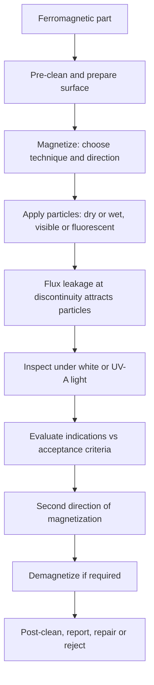

## Magnetic Particle Testing

Magnetic particle testing (MT, also called magnetic particle inspection, MPI) is a nondestructive method for detecting surface and near-surface discontinuities in **ferromagnetic** materials. The part is magnetized; where a discontinuity interrupts the magnetic flux, flux lines leak out of the surface, forming a **magnetic flux leakage (MFL) field**. Fine ferromagnetic particles applied to the surface are attracted to and held by this leakage field, producing a visible indication (a build-up of particles) that outlines the discontinuity. MT is fast, sensitive to tight cracks (including fatigue, grinding, quench, and hydrogen cracks), tolerant of thin coatings and light surface contamination, and can be applied to complex shapes. It applies only to ferromagnetic alloys (carbon and low-alloy steels, martensitic and ferritic stainless steels, duplex steels to a limited degree, cast iron, nickel, cobalt) and is not applicable to austenitic stainless steels, aluminum, copper, titanium, and other non-magnetic materials, for which liquid penetrant or eddy current testing is used.

### 1. Role and Scope

**Key Points**

- MT detects **surface-breaking and shallow subsurface** discontinuities; sensitivity falls rapidly with depth below the surface.
- It is generally **more sensitive and faster than liquid penetrant testing** on ferromagnetic material, and it does not require the flaw to be open to the surface or the surface to be as meticulously cleaned.
- **Orientation matters:** the method is most sensitive when the magnetic flux is **perpendicular** to the discontinuity. Detection weakens as the angle between flux and flaw approaches parallel, so at least two directions of magnetization are required to detect flaws of arbitrary orientation.
- Typical applications: weld inspection (toes, roots, fillet welds), castings, forgings, machined components, crankshafts, gears, bearings, fasteners, axles, rail, pressure equipment, offshore structures, and in-service fatigue crack detection.
- In failure analysis, MT identifies secondary cracks, crack networks, and grinding or quench cracks, but the residual magnetism and the particle suspension can alter or contaminate surfaces, so MT must be planned in sequence with fractography and other examinations. [Inference] — applying MT to a fracture surface or to areas reserved for microanalysis is normally avoided.

### 2. Physical Principles

#### 2.1 Magnetic Quantities

| Quantity | Symbol | SI Unit | Meaning |
| --- | --- | --- | --- |
| Magnetic field strength (magnetizing force) | $H$ | A/m | Field produced by current or external magnet |
| Magnetic flux density (induction) | $B$ | tesla (T) | Flux per unit area in the material |
| Permeability | $\mu$ | H/m | Ease with which a material carries flux |
| Relative permeability | $\mu_r$ | dimensionless | $\mu/\mu_0$ |
| Magnetization | $M$ | A/m | Magnetic moment per unit volume |
| Remanence (retentivity) | $B_r$ | T | Flux density remaining after $H$ returns to zero |
| Coercive force (coercivity) | $H_c$ | A/m | Reverse field required to reduce $B$ to zero |

The fundamental relations are

$$B = \mu H = \mu_0\mu_r H = \mu_0 (H + M)$$

where $\mu_0 = 4\pi\times10^{-7}\ \text{H/m}$ is the permeability of free space. Non-SI units still appear in older specifications: 1 gauss = $10^{-4}$ T, and 1 oersted $\approx 79.6$ A/m.

#### 2.2 Hysteresis and Material Behavior

Ferromagnetic materials exhibit a **B–H (hysteresis) loop**. Its shape determines how a material behaves in MT:

| Property | Soft (low-carbon) steel | Hard (high-carbon, hardened, or alloy) steel |
| --- | --- | --- |
| Permeability | High | Lower |
| Coercivity | Low | High |
| Retentivity | Low to moderate | High |
| Magnetization | Easy; lower field needed | Requires stronger field |
| Residual magnetism after inspection | Relatively easy to remove | Retained strongly; demagnetization often required |
| Suitability for residual (retentive) technique | Poor | Good |

Saturation is the state in which further increase in $H$ produces little further increase in $B$. Excessively high magnetization approaching saturation increases **non-relevant indications** (background) and reduces contrast, so field strength is controlled within specified limits.

#### 2.3 Flux Leakage at a Discontinuity

In a magnetized ferromagnetic part, flux lines follow the low-reluctance path through the material. A discontinuity (crack, inclusion, void) has much lower permeability than the surrounding metal, so flux is diverted around it; when the discontinuity is at or near the surface and oriented across the flux, a portion of the flux is forced out into the air, forming north and south poles on either side. Fine magnetic particles are polarized by this field and are drawn to the region of highest field gradient.

Factors affecting the strength of the leakage field:

| Factor | Effect |
| --- | --- |
| Flux density in the part | Higher $B$ increases leakage, up to the point where non-relevant indications increase |
| Angle of flaw to flux | Maximum at 90°; weak below roughly 45°; negligible when parallel |
| Depth of flaw below surface | Leakage decreases rapidly with depth |
| Flaw width and height (depth) | Deeper, narrower flaws relative to width give stronger leakage; wide shallow flaws give weak indications |
| Material permeability and heat treatment | Affects flux distribution and required field |
| Surface condition | Roughness and coatings increase the effective lift-off and reduce sensitivity |

A commonly used approximation is that the leakage field magnitude scales with the flux density and with the flaw depth-to-opening ratio, and decays approximately exponentially with distance (lift-off) from the surface. [Inference] — exact leakage models require numerical (finite-element) analysis and depend on geometry.

#### 2.4 Circular and Longitudinal Fields

**Circular field:** current passed **through** a part (or a central conductor through a hollow part) produces a circular magnetic field around the current path. It is the most sensitive to flaws **parallel to the current flow** (axial or longitudinal flaws).

For a long straight conductor of radius $a$ carrying current $I$, the field just outside the surface at distance $r$ from the axis is

$$H = \frac{I}{2\pi r}\quad (r \ge a)$$

At the surface of a solid nonmagnetic conductor, $H_{surface} = I/(2\pi a)$. For a **ferromagnetic** solid bar carrying DC, the field inside increases linearly from zero at the center to the surface value, and at the surface it is

$$H_{surface} = \frac{I}{\pi d}\quad\text{(for } d \text{ = bar diameter, } a = d/2\text{)}$$

which is the basis of the classical rule of thumb of 12 to 32 A per mm of diameter (about 300 to 800 A per inch) for direct-contact circular magnetization. [Unverified] — actual current values must follow the governing standard and be verified with field indicators or pie gauges.

**Longitudinal field:** produced by a **coil** or **yoke** so that the flux runs along the length of the part; most sensitive to **transverse** flaws (perpendicular to the length).

For an ideal long solenoid with $N$ turns per unit length carrying current $I$:

$$H = nI$$

where $n$ is turns per meter. For short parts, the **demagnetizing field** reduces the effective field inside the part.

#### 2.5 Demagnetizing Effect and the L/D Ratio

When a part is magnetized longitudinally, free magnetic poles form at the ends, and they produce a **demagnetizing field** $H_d$ opposing the applied field:

$$H_d = -N_d\,M$$

where $N_d$ is the **demagnetizing factor**, which depends on the part's shape. Short, stubby parts (low length-to-diameter ratio, $L/D$) have a large $N_d$ and are difficult to magnetize longitudinally. The effective field in the part is

$$H_{eff} = H_{applied} - N_d M$$

Practical consequences and remedies:

- Parts with $L/D$ below about 2 are difficult to magnetize longitudinally in a coil; use **pieces of similar steel** attached end-to-end to extend the effective length, or use a circular field or yoke technique.
- Coil ampere-turn recommendations depend on $L/D$ (see Section 5.4).
- Long parts are magnetized in sections along the length of the coil's effective region.

#### 2.6 Skin Depth for AC Magnetization

With alternating current, flux and current concentrate near the surface (skin effect). The skin depth $\delta$ in a conductor is

$$\delta = \sqrt{\frac{2}{\omega\,\mu\,\sigma}} = \frac{1}{\sqrt{\pi f\,\mu\,\sigma}}$$

where $f$ is frequency, $\mu$ is permeability, and $\sigma$ is electrical conductivity. For ferromagnetic steels at 50 to 60 Hz, $\delta$ is on the order of a millimeter or less, so AC magnetization is very effective for **surface-breaking** flaws but poor for subsurface flaws. Rectified (half-wave or full-wave DC) or pure DC penetrates deeper, favoring near-surface flaw detection.

### 3. Magnetization Methods and Equipment

#### 3.1 Sources of Magnetizing Current

| Current Type | Characteristics | Penetration | Typical Use |
| --- | --- | --- | --- |
| **AC** (alternating current, 50/60 Hz) | Skin effect; particle mobility from alternating field; simple equipment (yokes, portable units) | Surface only (very shallow) | Surface flaws in welds, in-service cracks; portable yoke inspection |
| **HWDC** (half-wave rectified AC) | Pulsating; good particle mobility; deeper than AC | Moderate; near-surface | Castings, weldments, near-surface detection |
| **FWDC** (full-wave rectified, single or three phase) | Smoother DC; less mobility | Deeper | Subsurface flaws, heavier sections |
| **DC** (battery or DC power) | Steady field; deepest penetration | Deepest | Subsurface detection; limited use |
| **Capacitor discharge / impulse** | Short high-current pulses | Depends | Residual-technique inspection, special cases |
| **Permanent magnets** | No power; fixed field strength | Depends on strength | Restricted use; some codes limit their use in favor of electromagnets |

Choice of current type is a trade-off: AC gives the best sensitivity to surface-breaking flaws and useful particle mobility; DC-type currents penetrate deeper. Specifications usually state which types are permitted for a given application.

#### 3.2 Magnetization Techniques

| Technique | Method | Field Produced | Best for |
| --- | --- | --- | --- |
| **Head-shot (direct contact)** | Current passed through the part between contact heads (headstock and tailstock of a bench unit) | Circular | Longitudinal flaws in bars, shafts, cylinders |
| **Prods** | Handheld contacts pressed on the surface; current flows between them | Circular (local, between prods) | Welds, castings, large parts; risk of arcing and local burns |
| **Central conductor (threader bar)** | Current passed through a conductor (copper or steel bar) running through a hollow part | Circular (on the inside and outside surface of the part) | Rings, tubes, gears, bearing races, nuts; avoids arcing on the part |
| **Coil shot** | Part placed inside or wound with a coil | Longitudinal | Transverse flaws in shafts, bars, and other elongated parts; note $L/D$ limitations |
| **Cable wrap** | Flexible cable wound around the part | Longitudinal | Large or irregular parts |
| **Yoke (electromagnetic, AC or DC)** | Legs placed on the surface; flux flows between the legs | Longitudinal (between legs) | Portable inspection of welds and large surfaces; articulated legs; low risk of arc burns |
| **Induced current (toroidal)** | Current induced in a ring part by a coil around a laminated core | Circular | Rings and closed forms, without contact |
| **Multidirectional (swinging field)** | Two or more fields at different orientations applied simultaneously in phase-shifted fashion | Combined | Detects flaws in any orientation in a single operation (with wet method) |
| **Flexible cable / rigid conductor** | Cable laid along a weld or through a hole | Circular | Localized inspection, hole edges |

**Prod cautions:** poor contact causes arc burns and local hardening on the surface, which can nucleate cracks, and is prohibited or restricted on critical or finished parts in many specifications. Use clean contact points, adequate pressure, current applied only after contact, and prod tips (lead or copper) as required.

#### 3.3 Continuous vs. Residual Method

| Method | Description | Sensitivity | Comments |
| --- | --- | --- | --- |
| **Continuous** | Particles applied **during** magnetization, and current remains on during application and until particle build-up has formed | Highest; the applied field maximizes leakage | Standard for most work; preferred for low-retentivity materials |
| **Residual** | Part is magnetized, then current is removed and particles are applied afterward, relying on residual magnetism | Lower; only for high-retentivity (hard) steels | Used in specialized production (for example, some hardened components) |

The **continuous method** is generally required where sensitivity is a concern (welds, low-carbon steels). Some standards permit the residual method only after validation with reference standards.

#### 3.4 Wet vs. Dry Particles

| Aspect | Wet Method | Dry Method |
| --- | --- | --- |
| Carrier | Suspension of particles in water (with conditioners) or light petroleum oil | Dry powder applied as a cloud or dusting |
| Particle size | Fine (typically 1 to 10 µm range, with fluorescent versions similar) | Coarse (about 50 to 150 µm) |
| Sensitivity to fine surface cracks | Higher | Lower for fine cracks; better for larger subsurface flaws and rough surfaces |
| Typical use | Stationary shop equipment; critical parts; high sensitivity; fluorescent inspection | Portable use, rough surfaces (weld, castings), hot surfaces (with heat-resistant powders) |
| Advantages | Good coverage and mobility; suits fluorescent | Simple; works on hot surfaces and rough surfaces |
| Cautions | Suspension concentration must be controlled; contamination and settling | Wind interferes; dust; less effective for fine flaws |

Particle types: visible (typically black, red, gray, yellow, or white depending on the background), and **fluorescent** (viewed under UV-A) used for high-sensitivity inspection. **Contrast paint** (a thin white coating) is often applied to the surface so that black particles show clearly on dark surfaces.

### 4. Materials and Consumables

- **Particles:** finely divided ferromagnetic iron oxide or iron powder with **high permeability and low retentivity** so that they respond readily to weak leakage fields but do not cling to each other or to the surface after the field is removed. They are also shaped and sized to give mobility and adequate build-up.
- **Vehicle (wet method):** water with conditioners (wetting agent, rust inhibitor, anti-foam) or **low-viscosity, low-fluorescence petroleum distillate oil**. Oil vehicles need low viscosity (for example, not exceeding a specified value at the test temperature) so that particles migrate freely. Water baths require verification of corrosion protection and wetting.
- **Contrast paint or background coating:** applied in thin uniform layers to improve visibility; thick coatings reduce sensitivity by increasing lift-off.
- **Fluorescent dye:** attached to particles; brightness and stability are checked by comparing used bath against a reference.
- **Suspension concentration:** typically determined by settling a measured volume (commonly 100 mL) in a **pear-shaped centrifuge tube** for a specified settling time (for example, 30 minutes for petroleum-based, longer for water-based) and reading the settled volume. Typical values (verify against the governing procedure):

| Particle Type | Settling Volume (per 100 mL) |
| --- | --- |
| Fluorescent | About 0.1 to 0.4 mL |
| Visible | About 1.2 to 2.4 mL |

[Unverified] — settling-volume limits differ by standard (for example ASTM E1444, ASME Section V Article 7, ISO 9934); use the governing requirements.

### 5. Field Strength, Direction, and Verification

Adequate magnetizing field strength is essential: too low results in missed indications; too high produces heavy non-relevant background (especially at sharp changes in section) and masks relevant indications.

#### 5.1 Magnetic Field Direction

- Perform **at least two examinations** with fields in approximately perpendicular directions (for example, circular and longitudinal) to detect flaws in any orientation, unless a multidirectional technique is used.
- Flaws at an angle to the field are detected with decreasing sensitivity as the angle diverges from 90°; an acceptable practical range is roughly within about ±45° of perpendicular, so two fields at 90° cover all orientations.

#### 5.2 Verification of Field Strength and Direction

| Device | Description | Purpose |
| --- | --- | --- |
| **Hall-effect gaussmeter (tangential field probe)** | Measures the tangential component of the field at the surface | Verify surface field strength; commonly cited range about 2.4 to 4.8 kA/m (30 to 60 oersteds) tangential field strength, or per standard |
| **Pie-shaped indicator (pie gauge)** | Low-carbon steel segments brazed together with a copper face; particles form lines at the joints where field is present | Indicates the presence and approximate direction of the field; qualitative |
| **Quantitative Quality Indicator (QQI)** or **shim indicators (for example, flexible laminated steel shims with slots)** | Contain artificial defects that show whether the field is adequate and oriented | Verify flux direction and adequacy; used for wet fluorescent processes |
| **Artificial-flaw reference standards and known-defect test parts** | Parts with real or artificial flaws | Demonstrate overall system sensitivity |
| **Yoke lift-force test** | Lift test with a standardized steel block | Verify yoke capability (see below) |

**Yoke lifting power:** a common requirement is that an AC yoke can lift a steel block of at least about 4.5 kg (10 lb) at the maximum leg spacing used, and a DC (or permanent magnet) yoke at least about 18 kg (40 lb), verified periodically. [Unverified] — confirm exact values and frequency in the governing code (for example ASME Section V Article 7).

#### 5.3 Current Recommendations for Circular Magnetization

Guidelines of the form "amperes per unit diameter or width" are used for head-shot and prods, and they are meant as starting values to be verified with the devices above:

| Technique | Typical Guideline (Illustrative) |
| --- | --- |
| Head-shot / central conductor | About 12 to 32 A per mm of diameter (300 to 800 A per inch), based on the outer diameter or the largest cross-sectional diagonal for non-round parts |
| Prods | About 3.9 to 5.9 A per mm (100 to 150 A per inch) of prod spacing, for material thickness up to about 19 mm (3/4 in.); higher for thicker sections; spacing commonly between about 75 and 200 mm (3 and 8 in.) |

[Unverified] — these are common consensus values, but actual requirements come from the applicable standard (for example ASTM E1444, ASME Section V Article 7, EN ISO 9934-1), and may specify different values or require tangential field verification instead.

#### 5.4 Coil Magnetization Rules of Thumb

For a **fixed coil** with the part in the coil, an older rule uses **ampere-turns** $NI$ as a function of $L/D$:

$$NI = \frac{K}{L/D}\quad\text{with } K \approx 35{,}000$$

for parts positioned near the coil's inside wall and $L/D$ between about 2 and 15 (so $NI \approx 35{,}000/(L/D)$ ampere-turns). Where the part is much smaller than the coil, a different fill-factor version applies:

$$NI = \frac{45{,}000}{L/D}$$

for parts centered in the coil (with a range of $L/D$ typically 2 to 15). For $L/D < 2$, extend with steel pieces; for $L/D > 15$, use $L/D = 15$ for calculation. [Unverified] — these formulas are based on legacy practice and are being replaced in current standards by direct field verification with a gaussmeter or QQI; consult the applicable edition of the governing standard before use.

#### 5.5 Yoke Technique Parameters

- Leg spacing typically 50 to 200 mm (2 to 8 in.); the effective examination area is limited to the region between and close to the legs (for example, about 25 mm beyond each leg for effective flux).
- Overlap adjacent yoke positions (commonly at least 25 mm), and repeat with the yoke rotated about 90° to cover flaws in both directions.
- Maintain good leg contact with the surface.
- Keep the yoke energized while applying particles (continuous method) and until excess particles have been removed by a gentle air stream (dry) or the bath has drained (wet).

### 6. Test Procedure

#### 6.1 Step-by-Step

1. **Procedure review and preparation:** confirm the written procedure, the acceptance criteria, personnel qualification, and equipment calibration.
2. **Surface preparation and cleaning:** remove loose scale, grease, oil, paint (thick coatings), weld spatter, and moisture, which can hold particles or impede mobility. Thin, tightly bonded coatings (typically up to about 50 µm, or as allowed by the standard) may be tolerated but reduce sensitivity; a coating thickness limit and a demonstration of sensitivity through the coating are required. [Unverified] — coating thickness limits vary; use the code.
3. **Select technique:** current type, magnetization method (yoke, coil, head-shot, prods, central conductor), continuous or residual, wet or dry, fluorescent or visible.
4. **Verify magnetization and sensitivity:** use tangential-field gaussmeter, pie gauge, QQI, or reference blocks; confirm that lighting conditions are adequate.
5. **Magnetize and apply particles:**
   - **Wet continuous:** bathe the part with the suspension, then apply the magnetizing current during and briefly (commonly 0.5 to 1 second, and typically two or more shots for a bench unit) just after the bath is applied so the particles can accumulate; stop flow before or as current ends according to the procedure (to avoid washing away indications).
   - **Dry continuous:** dust particles lightly and uniformly while the current flows, remove excess by a gentle air stream, keeping current on until excess is blown off.
6. **Inspect:** evaluate indications during and immediately after application, under required light (see Section 7). Record the location, size, and type.
7. **Second direction:** repeat magnetization and inspection in the other required direction.
8. **Demagnetize** where required (see Section 9).
9. **Post-clean** and apply corrosion protection if needed.
10. **Record and report.**

#### 6.2 Multi-Directional and Automated Systems

- Multidirectional magnetization applies two or more phase-shifted fields simultaneously and can reveal flaws in all orientations in one pass (usually with wet fluorescent methods).
- Automated bench lines use conveyors, robotic handling, controlled magnetization, particle application, and machine vision or camera-based UV-A viewing, with automated part sorting. Periodic verification is required against reference defect parts.

### 7. Lighting and Viewing Conditions

| Technique | Requirement (Typical, Illustrative) |
| --- | --- |
| Visible particles (white light) | Minimum illuminance at the surface commonly about 1000 lux (about 100 fc) |
| Fluorescent particles | **UV-A radiation** (about 320 to 400 nm, peak about 365 nm) with minimum irradiance commonly 1000 µW/cm² at the surface; **ambient white light** commonly not more than about 20 lux (2 fc) |
| Dark adaptation (fluorescent) | Inspector's eyes adapt for a minimum period before inspecting (commonly at least about 1 to 5 minutes) |
| UV-A lamp warm-up | Commonly at least about 5 to 10 minutes for mercury-vapor lamps; LED lamps stabilize faster |
| UV filters and lamp condition | Check for cracks, dirt, and output decline |

[Unverified] — specific values vary by standard (ASTM E1444, ASME Section V Article 7, EN ISO 3059, ISO 9934). Photochromic spectacles are generally not allowed for fluorescent inspection, and all measuring meters must be calibrated.

### 8. Interpretation and Evaluation of Indications

#### 8.1 Types of Indications

| Type | Cause | Appearance |
| --- | --- | --- |
| **Relevant** | Discontinuity (crack, lap, seam, lack of fusion, inclusions) | Sharp, well-defined particle build-up along the flaw |
| **Non-relevant** | Geometry or magnetic feature that is not a defect (for example, keyways, sharp fillets, threads, section changes, cold-worked areas, material permeability changes at the weld HAZ, changes of composition) | Fuzzy or diffuse; often at a known geometric feature |
| **False** | Improper technique or contamination (for example, particles trapped by scale, rust, lint, or rough surface; **magnetic writing** from contact with another magnetized steel object; drips and pools of suspension) | Irregular; often removed by re-cleaning and re-testing |

#### 8.2 Typical Indication Patterns

| Discontinuity | Typical MT Indication |
| --- | --- |
| Fatigue crack | Sharp, well-defined, continuous or slightly ragged line, usually perpendicular to the principal stress; may branch |
| Grinding cracks | Fine, closely spaced lines, often in a network or aligned perpendicular to the grinding direction; typical in hardened steels |
| Quench (heat-treatment) cracks | Deep, jagged lines, often at sharp section changes or holes |
| Hydrogen (cold) cracks in welds | Sharp lines in the HAZ, often transverse or along the weld toe |
| Hot cracks / crater cracks | Irregular, dendritic, or star-shaped at weld craters |
| Laps and seams | Straight or curved lines; laps at an angle to the surface; seams parallel to working direction |
| Inclusions and stringers | Short, straight, parallel lines (often in rolled stock); fuzzy if subsurface |
| Porosity | Rounded, weak indications if near the surface |
| Lack of fusion (near-surface) | Weak, broad, fuzzy indications |
| Subsurface flaws | Broad, fuzzy, low-intensity indications; require higher magnetization (DC or rectified) |

**Key Points**

- Distinguish **relevant** from **non-relevant** indications by re-testing after **demagnetization** and re-cleaning, by using a different magnetization level or direction, by examining the geometry, or by using another method (PT, UT) to confirm.
- **Subsurface indications** are broader and fuzzier than surface-breaking cracks; treat with caution because they can be caused by non-relevant permeability variations.
- Indications are evaluated as **linear** or **rounded** using length-to-width criteria (commonly linear if $l \ge 3w$), and acceptance limits depend on the code.
- **Record** indications by photograph, sketch, transparent lifting tape, or digital image, with scale and orientation.

### 9. Demagnetization

#### 9.1 Why Demagnetize

Residual magnetism after MT can:

- Attract ferrous chips and debris during machining, causing tool damage or poor surface finish.
- Interfere with subsequent welding (magnetic arc blow), electrical instruments, compasses, and sensors.
- Increase wear in bearings, gears, and moving parts (attracted wear particles).
- Interfere with electroplating, painting, and subsequent inspections.
- Cause safety and operational problems in aircraft, naval, and instrument applications.

Demagnetization is required before machining, plating, painting (in many contexts), welding, and in-service use for certain components, or as specified.

#### 9.2 Methods

| Method | Description |
| --- | --- |
| **AC coil demagnetizing** | Part is passed slowly through and away from an AC coil (typically 1 m or more from the coil) while the alternating field decays as the part leaves the field |
| **Reversing and decaying DC** | Current is reversed with steadily decreasing amplitude in steps (automatic in many bench units) |
| **Yoke (AC) demagnetizing** | The AC yoke is slowly withdrawn from the surface with the field on |
| **Heating above the Curie temperature** | Heating above the Curie point (about 770 °C for iron; alloy-dependent) eliminates magnetism but is rarely practical |
| **Reversing DC with step-down** | Applicable to large parts and high-retentivity steels |

The principle is to **alternate the field direction while reducing its amplitude gradually** to zero, so the domain alignment is randomized and the remanent flux density is minimized. Ideal demagnetization requires a starting field at least as high as the magnetizing field used.

#### 9.3 Verification

- Measure residual field with a **field indicator** (a calibrated indicator such as a pocket-type field indicator), **Hall-effect gaussmeter**, or **fluxgate meter**.
- Commonly required limits: residual field not exceeding about 3 gauss (0.3 mT), sometimes 0.5 to 5 gauss depending on specification and application. [Unverified] — confirm the limit for the specific application and standard.
- Demagnetization is easier for **soft** steels and harder for **high-retentivity, high-coercivity** steels; large or long parts may retain residual field at ends and edges, particularly after circular magnetization when the flux is contained and hard to measure externally (closed circular fields leave little external field but may still cause issues).

### 10. Equipment, Calibration, and Quality Control

#### 10.1 Equipment Types

| Equipment | Features |
| --- | --- |
| **Stationary bench unit (wet horizontal)** | Headstock and tailstock (contact plates), coil, bath system, demagnetizer, UV-A lamp booth; high-volume production |
| **Mobile and portable units** | Power supplies with cable, prods, yokes, coils for field use |
| **Yokes** | Compact AC or DC electromagnetic yokes, some with articulated legs; permanent magnet yokes in limited cases |
| **Automated multi-directional systems** | Robotic handling, in-line inspection and demagnetization, automatic particle application |
| **Special systems** | Rail inspection, tubular inspection, in-situ bolt or rod inspection, and magnetic flux leakage (MFL) inspection tools for pipelines and tank floors (MFL is a related but distinct technology that uses sensors rather than particles) |

#### 10.2 Routine Checks and Calibration

| Item | Purpose | Typical Frequency (Illustrative) |
| --- | --- | --- |
| Ammeter accuracy check (calibrated meter) | Verify current output | At least annually and after repairs |
| Timer, shot duration | Verify magnetization timing | Periodic (for example annually) |
| Yoke lift test | Verify yoke capacity | Periodically and before use or per schedule |
| Bath concentration (settling test) and contamination | Verify particle content and cleanliness | Daily or per shift for wet baths |
| Bath fluorescence and water-break test (water baths) | Verify brightness and wetting | Weekly or per schedule |
| UV-A intensity and ambient light | Verify lighting conditions | Daily or at the start of the shift |
| System sensitivity check using reference defect part, ring standard (for example, Ketos ring), or QQI | Verify overall sensitivity | Daily or per shift, and after any change |
| Gaussmeter and light meters | Verify instruments | Calibrated at intervals (commonly annually) |
| Demagnetization effectiveness | Verify residual field | Periodic sample checks |
| Dry powder condition | Verify dryness and contamination | Periodic |

**Ketos ring:** a tool-steel ring with drilled holes at graduated depths beneath the surface, used to assess the effective sensitivity of a magnetization system to subsurface flaws. A given number of visible holes at a specified current corresponds to a system sensitivity rating. [Unverified] — acceptance thresholds (for example, number of visible holes at a given amperage and technique) are prescribed by specific standards and specifications.

### 11. Codes, Standards, and Personnel

| Document | Topic |
| --- | --- |
| ASME BPVC Section V, Article 7 (with SE-709) | Magnetic particle examination method and procedure requirements |
| ASTM E709 | Standard guide for magnetic particle testing |
| ASTM E1444 | Standard practice for magnetic particle testing (aerospace and other applications) |
| ASTM E3024 | Standard practice for magnetic particle testing for general industry |
| ASTM E1571 and E1316 | Related NDT terminology and practice items |
| ISO 9934 series (parts 1 to 3) | Magnetic particle testing: general principles, detection media, equipment |
| EN ISO 17638 | MT of welds |
| EN ISO 3059 | Viewing conditions for penetrant and magnetic particle testing |
| ISO 23278 / EN ISO 23278 | Magnetic particle testing of welds: acceptance levels |
| AWS D1.1, API 1104, ASME B31.3, ASME Section VIII | Weld inspection requirements and acceptance criteria |
| AMS 2641, AMS 2300 (cleanliness of steels), AMS 2301, AMS 3040–3045 (particle specifications), AMS-STD-2175 | Aerospace MT process, materials, and castings |
| ISO 9712, NAS 410, ASNT SNT-TC-1A, ANSI/ASNT CP-189 | Personnel qualification and certification |

[Unverified] — standard numbers, titles, and edition status must be verified; many are revised, renumbered, or superseded.

Personnel are qualified at Level 1, 2, or 3 (or equivalents) based on training, experience, vision (near-acuity and color discrimination), and examinations (general, specific, practical). A **written procedure** covers, at a minimum, the material and geometry, the magnetization technique and parameters, the particle type and concentration, surface preparation, lighting, sequence, demagnetization, acceptance criteria, and reporting.

### 12. Acceptance Criteria and Reporting

**Acceptance criteria** are set by the design code, specification, or customer. Illustrative common categories:

- **Cracks and linear indications** typically rejected, or accepted only up to a small stated length.
- **Rounded indications** accepted up to a maximum size and number in a defined area (for example, a maximum dimension of about 4.8 mm, or 3/16 in., in some codes), with limits on alignment and spacing.
- **Weld toe indications and undercut** evaluated as per weld-quality levels.
- **Critical parts (aerospace, rotating machinery)** frequently accept **no linear indications** of any length in defined critical areas.

[Unverified] — the specific limits vary widely; use the applicable code.

**Report contents**

1. Part identification, material, heat treatment condition, and location or extent examined.
2. Procedure number and revision; standard and acceptance criteria.
3. Personnel name, level, and certification.
4. Equipment, particle type (visible or fluorescent, dry or wet), and batch or lot numbers of materials.
5. Magnetization method, current type and level, field verification result (gaussmeter reading or indicator), direction(s), and number of shots and duration.
6. Surface condition and cleaning method; coating thickness if present.
7. Lighting and UV-A measurements.
8. Indications found: location, orientation, length, type, classification (relevant, non-relevant, false), and dispositions; photographs and sketches.
9. Demagnetization method and measured residual field.
10. Date, signature, and any deviations.

### 13. Worked Example

**Example**

*Situation:* A quenched-and-tempered alloy-steel shaft (60 mm diameter, 600 mm length, about 40 HRC) requires final inspection for surface cracks after grinding. The specification calls for wet fluorescent MT, continuous method, with two field directions.

1. **Preparation:** The part is degreased, ground surface inspected visually, and cleaned to remove coolant residue. No coating is present.
2. **Circular magnetization (head-shot):** Using the guideline of about 12 to 32 A/mm of diameter as a starting range for the 60 mm diameter, the current range is about 720 to 1920 A; the procedure specifies a mid-range value of approximately 1500 A. The suspension is applied during the shot (about 1 second of current, two shots), and the tangential field at the surface is confirmed with a gaussmeter within the specified range. [Inference] — the exact current and verification method are defined by the procedure, and current guidelines are only starting points.
3. **Inspection under UV-A:** UV-A irradiance measured at 1200 µW/cm² at the surface, with ambient white light below 15 lux; the inspector dark-adapts for 3 minutes. Circular field inspection reveals one fine linear indication about 5 mm long parallel to the shaft axis near a fillet region, sharp and persistent.
4. **Longitudinal magnetization (coil):** The shaft has $L/D = 600/60 = 10$. Using the legacy guideline $NI \approx 35{,}000/(L/D) = 3500$ ampere-turns, a coil with 5 turns would need about 700 A; the field direction and strength are then verified with a QQI and a gaussmeter. Inspection reveals a network of very fine, closely spaced lines in a ground area, oriented perpendicular to the grinding direction (grinding cracks).
5. **Evaluation:** Both indications are sharp, relevant, and linear; per the customer specification (no linear indications in critical fillets and ground surfaces), the part is rejected.
6. **Further analysis:** The grinding-crack pattern suggests localized overheating during grinding (grinding burns); a temper-etch (nital) examination on a sister part confirms rehardened and overtempered zones. The linear indication at the fillet is examined by metallography on a section, revealing a shallow forging lap. In the failure-prevention loop: the process parameters (feed, wheel dressing, coolant) are adjusted, and lot and forging vendor findings are recorded.
7. **Demagnetization:** For the retest of remaining parts, demagnetization through an AC coil reduces the residual field to below the limit (for example under 3 gauss) as verified with a field meter, and parts are post-cleaned and given corrosion protection.

**Output** (summary): Two relevant indications (grinding cracks and a forging lap) found by MT using two field directions; part rejected; root causes addressed in process control; demagnetization verified.

### 14. Advantages and Limitations

| Advantages | Limitations |
| --- | --- |
| High sensitivity to fine surface and near-surface cracks in ferromagnetic materials | Applicable only to ferromagnetic materials |
| Rapid, inexpensive, and portable | Sensitivity depends on flaw orientation; multiple directions required |
| Tolerant of thin coatings and modest surface contamination compared with PT | Thick coatings and heavy scale reduce sensitivity |
| Indications form directly on the part, near the flaw's true location and shape | Cannot detect deep subsurface flaws; sensitivity falls with depth |
| Immediate results; visual record possible | Requires demagnetization for many applications |
| Detects flaws not open to the surface (near-surface) | Arc burns from prods, large currents, and heating risks; electrical safety |
| Suitable for complex shapes and in-service inspection | Non-relevant indications can confuse interpretation |
| Can be automated | Requires suitable lighting, especially for fluorescent methods; operator skill is critical |

### 15. Safety, Health, and Environmental Considerations

- **Electrical hazards:** high currents and voltages in contact units; interlocks and proper grounding; avoid touching energized parts.
- **Burns and arcing:** prods and contact heads can cause arcing, burns, and fires; keep flammable vapors away and use appropriate contact pressure.
- **Strong magnetic fields:** interference with implanted medical devices (pacemakers), sensitive equipment, and mechanical hazards from attracted ferrous tools; follow site restrictions and medical guidance.
- **UV-A radiation:** protect eyes and skin; use appropriate filters and avoid direct exposure.
- **Chemical hazards:** oil-based vehicles are flammable; water baths may cause skin irritation and require conditioners; use gloves and ventilation; maintain Safety Data Sheets.
- **Waste:** used suspensions, oils, and rinse water must be handled per environmental regulations.
- **Ergonomics and visual fatigue:** rest periods, comfortable inspection booths, and suitable viewing stations.

### 16. Common Pitfalls

- **Inadequate magnetization** (too low) or **excessive magnetization** (background from non-relevant indications and masking).
- **Only one field direction used,** missing flaws oriented parallel to the flux.
- **Applying particles after current is off** in the continuous method or interrupting the current too early, washing away indications.
- **Wrong wet-bath concentration** or contamination; degraded fluorescent brightness; water bath lacking proper conditioning.
- **Poor surface condition** (heavy scale, oil, thick paint, rough finish) reducing sensitivity or causing false indications.
- **Poor lighting** or **insufficient dark adaptation**, low UV-A intensity, or dirty filters.
- **Arc burns from prods** on critical surfaces.
- **Ignoring $L/D$ effects** in longitudinal magnetization of short parts.
- **Misinterpreting non-relevant indications** at geometric features and section changes, or magnetic writing.
- **Failure to demagnetize** when required, or insufficient verification of residual field.
- **Neglecting periodic system checks** (ammeter, yoke lift, ring standard, reference defect parts).
- **Using MT on non-magnetic or weakly magnetic materials** (austenitic stainless steels and weld metal that may be partially magnetic); misjudging duplex or dissimilar-metal welds with variable permeability.
- **Overlooking safety** with UV, electrical, and flammable vehicles.
- **Insufficient documentation** and unclear reporting of indications.

### Conclusion

Magnetic particle testing is a fast, sensitive method for detecting surface and shallow subsurface discontinuities in ferromagnetic materials. Its effectiveness rests on sound physics (flux leakage at flaws oriented across the magnetic field), correct technique (current type, magnetization method, continuous application, two directions), controlled consumables (particle type, concentration, contrast and lighting), verified field strength (gaussmeter, indicators, reference standards), and disciplined interpretation that separates relevant, non-relevant, and false indications. Demagnetization, post-cleaning, thorough documentation, calibrated equipment, qualified personnel, and adherence to governing codes complete the quality framework. Combined with visual, penetrant, eddy current, ultrasonic, and radiographic methods, MT plays a central role in fabrication quality assurance, in-service inspection, and failure-prevention programs.

### Next Steps

- Eddy Current Testing and Electromagnetic Techniques
- Magnetic Flux Leakage Inspection of Pipelines and Tank Floors
- Ultrasonic Testing Fundamentals and Phased Array Techniques
- Radiographic Testing and Computed Tomography
- Probability of Detection and Inspection Reliability
- Weld Inspection Codes and Acceptance Criteria
- NDT Personnel Qualification and Certification Systems
- Automated and Digital NDT Data Management