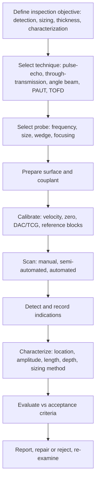

## Ultrasonic Testing

Ultrasonic testing (UT) is a nondestructive evaluation method that uses high-frequency mechanical waves, typically 0.5 to 25 MHz for flaw detection and thickness gauging, to detect internal and surface discontinuities, measure thickness, characterize material properties, and size flaws. A transducer converts electrical pulses into ultrasonic waves that propagate through the material; reflections, transmissions, and scattering from interfaces and discontinuities are converted back into electrical signals and displayed for interpretation. UT is one of the few methods that reliably finds **planar, volumetric, and subsurface** flaws (cracks, lack of fusion, laminations, inclusions, porosity, disbonds) in metals, composites, ceramics, and plastics, and it can size flaws in through-thickness dimension, which is essential for fracture-mechanics-based fitness-for-service assessment. Its limits are dependence on skilled operators, need for coupling, sensitivity to flaw orientation and surface condition, and difficulty with coarse-grained or highly attenuating materials.

### 1. Role and Scope

**Key Points**

- UT complements surface methods (VT, PT, MT) by inspecting the **entire volume** of the part; it is the primary volumetric method for **planar flaws** (cracks, lack of fusion), which radiography detects poorly unless aligned with the beam.
- Applications: weld inspection (conventional, phased array, TOFD), plate and forging inspection (laminations, inclusions, flakes), bar and tube inspection, thickness measurement and corrosion mapping, rail and wheel/axle inspection, aerospace composites and bonded structures, casting inspection (limited by grain structure), in-service fatigue and stress-corrosion crack detection and sizing, bolt and fastener inspection, and material characterization (elastic constants, grain size, hardness correlations, texture).
- In failure analysis and fracture-mechanics workflows, UT provides **flaw location, orientation, and through-wall size**, which feed critical-flaw-size calculations. [Inference] — sizing accuracy depends strongly on technique, flaw morphology, and operator skill, and should be stated with uncertainty.

### 2. Physical Principles of Ultrasound

#### 2.1 Wave Fundamentals

An ultrasonic wave is a periodic mechanical disturbance propagating through an elastic medium. Fundamental relations:

$$v = f\lambda$$

where $v$ is the wave velocity, $f$ is frequency, and $\lambda$ is wavelength. Wavelength governs resolution and the smallest detectable flaw: as a rule of thumb the smallest reliably detectable flaw is about $\lambda/2$ (some sources cite $\lambda/2$ to $\lambda$), and higher frequencies give better resolution but greater attenuation.

For example, for longitudinal waves in steel ($v \approx 5900$ m/s) at 5 MHz, $\lambda = 5900/(5\times10^6) \approx 1.18$ mm; at 2 MHz, $\lambda \approx 2.95$ mm.

#### 2.2 Wave Modes

| Mode | Particle Motion | Typical Velocity in Steel | Use |
| --- | --- | --- | --- |
| **Longitudinal (compression, L)** | Parallel to propagation | ~5900 m/s | Normal-beam inspection, thickness, laminations, TOFD, general flaw detection |
| **Shear (transverse, S)** | Perpendicular to propagation | ~3230 m/s | Angle-beam weld inspection; about half the longitudinal velocity |
| **Surface (Rayleigh)** | Elliptical near the surface; decays with depth (about one wavelength) | ~0.9 of shear velocity | Surface-breaking cracks, surface condition |
| **Plate (Lamb)** | Symmetric and antisymmetric modes in thin plates | Dispersive (varies with frequency-thickness) | Thin plate, sheet, pipe walls; guided-wave inspection |
| **Creeping wave** | Longitudinal type traveling along a surface | ~L velocity | Near-surface flaws in some special techniques |

The acoustic wave velocities in an isotropic solid relate to the elastic constants:

$$v_L = \sqrt{\frac{E(1-\nu)}{\rho(1+\nu)(1-2\nu)}}, \qquad v_S = \sqrt{\frac{G}{\rho}} = \sqrt{\frac{E}{2\rho(1+\nu)}}$$

where $E$ is Young's modulus, $G$ the shear modulus, $\nu$ Poisson's ratio, and $\rho$ density. The ratio $v_S/v_L$ is about 0.55 for steels.

Typical velocities (approximate, material-condition dependent):

| Material | $v_L$ (m/s) | $v_S$ (m/s) | Density (kg/m³) | Acoustic impedance $Z$ (MRayl) |
| --- | --- | --- | --- | --- |
| Carbon steel | ~5900 | ~3230 | 7850 | ~46 |
| Stainless steel (austenitic) | ~5700 | ~3100 | 7900 | ~45 |
| Aluminum | ~6320 | ~3130 | 2700 | ~17 |
| Titanium | ~6100 | ~3120 | 4500 | ~27 |
| Copper | ~4660 | ~2260 | 8960 | ~42 |
| Water (20 °C) | ~1480 | (none) | 1000 | ~1.48 |
| Oil (typical couplant) | ~1400 to 1500 | (none) | ~900 | ~1.3 |
| Air | ~343 | (none) | 1.2 | ~0.0004 |
| Acrylic (Plexiglas, wedge material) | ~2730 | ~1430 | 1180 | ~3.2 |
| Glass | ~5640 | ~3280 | 2500 | ~14 |

[Unverified] — velocities vary with alloy, temperature, heat treatment, and texture; use measured values from calibration blocks for the actual material.

#### 2.3 Acoustic Impedance, Reflection, and Transmission

The acoustic impedance of a medium is

$$Z = \rho v$$

At a planar interface between media 1 and 2 at normal incidence, the fractions of sound **pressure** reflected and transmitted are

$$R = \frac{Z_2 - Z_1}{Z_2 + Z_1}, \qquad T = \frac{2Z_2}{Z_2 + Z_1} = 1 + R$$

and the fractions of **intensity** (energy) are

$$R_I = \left(\frac{Z_2 - Z_1}{Z_2 + Z_1}\right)^2, \qquad T_I = \frac{4Z_1Z_2}{(Z_1+Z_2)^2} = 1 - R_I$$

Consequences:

- A steel–air interface reflects essentially all energy ($R_I \approx 0.9999$): the reason **couplant** is required to transmit sound across the probe–part boundary, and also why a crack or lamination (air-filled gap) gives a strong echo.
- Steel–water: $R_I = \left(\frac{1.48-46}{1.48+46}\right)^2 \approx 0.88$, so about 12% of intensity transmits.
- The **backwall echo** at a steel–air boundary is nearly total.
- Large impedance mismatches between transducer element (piezoceramic, $Z \approx 30$ MRayl) and the test material or couplant cause poor energy transfer; **matching layers** improve efficiency and bandwidth.

For flaws that are not gas-filled (for example inclusions with different impedance), reflection depends on the impedance difference; slag and oxide inclusions reflect less energy than cracks or lack of fusion with an air gap. Thin flaws with thickness comparable to wavelength give frequency-dependent transmission (thin-layer resonance effects). [Inference] — real flaw reflectivity is also affected by roughness, tightness, and orientation.

#### 2.4 Refraction and Mode Conversion (Snell's Law)

At an interface between media 1 and 2, the angles of incidence and refraction follow

$$\frac{\sin\theta_1}{v_1} = \frac{\sin\theta_2}{v_2}$$

Angle-beam probes use a plastic **wedge** (low velocity) to refract a **shear wave** into steel at a chosen angle (commonly 45°, 60°, 70°). For a longitudinal wave in an acrylic wedge ($v_1 \approx 2730$ m/s) refracting into a steel shear wave ($v_2 = 3230$ m/s), the angle of incidence $\theta_1$ required for a refracted shear angle $\theta_2$ is

$$\sin\theta_1 = \frac{v_1}{v_2}\sin\theta_2$$

so for a 60° shear angle: $\sin\theta_1 = 0.845\times0.866 = 0.732$, giving $\theta_1 \approx 47°$.

**Critical angles:**

- **First critical angle:** angle of incidence at which the refracted longitudinal wave reaches 90° (travels along the surface). For acrylic to steel: $\theta_{c1} = \arcsin(v_1/v_{L2}) = \arcsin(2730/5900) \approx 27.6°$.
- **Second critical angle:** angle at which the refracted shear wave reaches 90°: $\theta_{c2} = \arcsin(v_1/v_{S2}) = \arcsin(2730/3230) \approx 57.7°$.

Between the first and second critical angles, only a shear wave propagates in the steel (the useful range for angle-beam shear inspection, giving refracted shear angles from 0° to 90°). Beyond the second critical angle, surface (Rayleigh) waves are generated.

At each interface, incident waves can undergo **mode conversion** (for example, a shear wave hitting a boundary may produce reflected longitudinal and shear components). At certain angles (notably near 30° to 35° shear incidence on a free steel surface), a shear wave reflects with significant mode conversion to longitudinal, which can produce unexpected "ghost" or mode-converted indications and reduced reflected amplitude, so **60° and 70°** angles are preferred for some weld inspections, and **45°** used with attention to geometric and mode-conversion echoes.

#### 2.5 Attenuation

Sound amplitude decays with distance due to **absorption** (conversion to heat), **scattering** (grain boundaries, inclusions, porosity), and **beam spreading**. For a plane wave the amplitude follows

$$A(x) = A_0\,e^{-\alpha x}$$

where $\alpha$ is the attenuation coefficient (Np/m or dB/m). In decibels, the amplitude ratio between two levels is

$$\text{dB} = 20\log_{10}\left(\frac{A_2}{A_1}\right)$$

(so a 6 dB change corresponds to a factor of 2 in amplitude, and 20 dB to a factor of 10).

Scattering attenuation depends on grain size $D$ relative to wavelength:

| Regime | Condition | Scattering Behavior |
| --- | --- | --- |
| Rayleigh | $D \ll \lambda$ | $\alpha_s \propto D^3 f^4$ |
| Stochastic | $D \approx \lambda$ | $\alpha_s \propto D f^2$ |
| Diffusive | $D \gg \lambda$ | $\alpha_s \propto 1/D$ |

Thus **coarse-grained materials** (cast austenitic stainless steel, cast iron, some nickel alloys and weld metals, anisotropic forgings) strongly attenuate and scatter high-frequency ultrasound, generating "grass" (structural noise); lower frequencies (0.5 to 2 MHz), lower-frequency focused or dual-element probes, and specialized techniques (for example, dual-element longitudinal angle probes, low-frequency phased arrays) are used.

#### 2.6 Beam Characteristics: Near Field and Far Field

For a circular piston transducer of diameter $D$ radiating into a medium with wavelength $\lambda$, the beam has a **near field (Fresnel zone)** with complex pressure variations and a **far field (Fraunhofer zone)** with a smoothly diverging beam. The near-field length is

$$N = \frac{D^2}{4\lambda} = \frac{D^2 f}{4v}$$

(for rectangular elements, the effective near-field uses equivalent dimensions). The **beam divergence half-angle** in the far field is approximately

$$\sin\gamma = 1.22\,\frac{\lambda}{D}\quad(\text{to the first null}),\qquad \sin\gamma_{-6\text{dB}} \approx 0.51\,\frac{\lambda}{D}$$

where $\gamma_{-6\text{dB}}$ is the half-angle at which the amplitude falls to half (−6 dB) relative to the axis.

Practical implications:

- Sensitivity to small reflectors is unreliable inside the near field because of pressure fluctuations; use the far field for amplitude-based sizing (DAC or DGS methods), or use focused probes.
- Larger diameter or higher frequency increases $N$ and reduces divergence (narrower beam), but attenuates more in the material.
- Example: a 10 mm diameter, 5 MHz probe in steel: $\lambda = 1.18$ mm, $N = 100/(4\times1.18) \approx 21$ mm.

The far-field on-axis pressure from a circular piston decays approximately as $1/x$ (spherical spreading), whereas from a large planar reflector (backwall) it follows $1/(2x)$, and from a small (point-like) reflector the round-trip echo amplitude follows approximately $1/x^2$, and from a long cylinder (side-drilled hole) approximately $1/x^{3/2}$. These distance laws are the foundation of **distance-amplitude-correction (DAC)** and **distance-gain-size (DGS/AVG)** methods.

#### 2.7 Resolution

- **Axial (depth) resolution** is limited by the pulse length: approximately $\Delta z \approx \tfrac{1}{2}\,n_c\lambda$ where $n_c$ is the number of cycles in the pulse (for a highly damped transducer $n_c \approx 1$ to 2, giving $\Delta z \approx \lambda/2$ to $\lambda$).
- **Lateral resolution** depends on beam width, improved by focusing.
- **Dead zone:** the region beneath the surface in which echoes cannot be resolved because of the initial pulse (main bang) ringdown; reduced by damping, higher frequency, dual-element (TR) probes, and delay lines.
- **Near-surface resolution** and **far-surface resolution** (the ability to distinguish a flaw from the front and back surface echoes).

### 3. Equipment

#### 3.1 Piezoelectric Transducers

The active element converts electrical energy to mechanical vibration and vice versa (piezoelectric effect). Common materials:

| Material | Characteristics | Typical Use |
| --- | --- | --- |
| Lead zirconate titanate (PZT) ceramics | High efficiency, strong coupling, high impedance (~30 MRayl), lower bandwidth | General-purpose flaw detection; conventional probes |
| Piezocomposites (ceramic in polymer matrix) | Lower impedance (~10 to 20 MRayl), broad bandwidth, good matching, suitable for arrays | PAUT, immersion, high resolution |
| Lithium niobate, PVDF | High temperature (lithium niobate), broadband, low impedance (PVDF) | Special applications, hydrophones, high-temperature |
| Quartz | Stable, low efficiency | Historical, calibration |
| EMAT (electromagnetic acoustic transducers) | Generate sound in the part via Lorentz force/magnetostriction; no couplant | High temperature, moving parts, rough or scaled surfaces |
| Laser-ultrasonics | Laser generation and interferometric detection | Non-contact, hot or complex-shaped parts |

Transducer design elements: **damping (backing)** material (broadens bandwidth, shortens pulse, reduces sensitivity), **matching layers** (improve transfer to the load), **case and connector**, and the **element diameter and frequency** (resonance at half wavelength thickness: $t = \lambda_{elem}/2 = v_{elem}/(2f_0)$).

#### 3.2 Probe Types

| Probe | Description | Use |
| --- | --- | --- |
| **Normal (straight) beam contact probe** | Single element, longitudinal wave perpendicular to the surface | Thickness, laminations, backwall echoes |
| **Angle-beam probe** | Element on a wedge producing refracted shear (or longitudinal) waves at a fixed angle | Weld inspection, cracks perpendicular to the surface |
| **Dual-element (TR, pitch-catch) probe** | Separate transmitter and receiver elements angled toward each other with delay | Corrosion and thin-wall thickness, near-surface resolution, rough surfaces |
| **Delay-line probe** | Element with a plastic delay to separate the initial pulse from near-surface echoes | Thin materials, high-resolution near-surface inspection |
| **Immersion probe (focused or unfocused)** | Coupled through water path; often focused with a lens | Automated scanning, high-resolution C-scan, small defects |
| **Phased-array probe** | Multiple elements (16 to 256+) individually pulsed with time delays | Beam steering, focusing, electronic scanning, sector scanning |
| **Creeping-wave/surface-wave probes** | Generate surface or near-surface waves | Surface flaws, near-surface flaws |
| **Guided-wave transducer rings** | Circumferential arrays on pipes | Long-range screening of pipes (tens of meters) |
| **Rolling wheel (wheel probe) transducers** | Liquid-filled tire with a transducer inside | Rapid scanning of composites and flat plates |
| **EMAT probes** | Magnet and coil | Couplant-free inspection |

#### 3.3 Pulser–Receiver and Instrument

- The **pulser** delivers a high-voltage (typically 100 to 500 V spike or square wave; higher for some systems) electrical pulse to the transducer.
- The **receiver** amplifies and conditions the returning signal (gain, filters, rectification, dynamic range, time-corrected gain).
- The **timebase** converts time to distance on the display; **gates** monitor the signal for amplitude and time-of-flight thresholds.
- Displays: **A-scan** (amplitude versus time), **B-scan** (cross-section), **C-scan** (plan view), **D-scan** and **S-scan** (sectorial scan for PAUT).
- Digital instruments provide data storage, signal processing, and encoded position tracking for recorded inspections.

### 4. Inspection Techniques

#### 4.1 Coupling Techniques

| Technique | Description | Notes |
| --- | --- | --- |
| **Contact** | Probe pressed on the surface with a couplant film (water, gel, oil, grease, glycerin) | Portable; requires good surface condition and consistent pressure |
| **Immersion** | Part and probe submerged (or water-jet, squirter, or bubbler) | Consistent coupling; suitable for automation and high resolution; focused beams; gating of interface echoes |
| **Air-coupled** | Special transducers with high impedance matching in air | Non-contact for composites and porous materials; low sensitivity |
| **Dry-coupled (elastomer)** | Elastomer wheel or dry membrane | Composite scanning without liquid |
| **EMAT / laser** | No couplant | Hot, moving, or scaled surfaces |

**Couplant** requirements: displace air, wet the surface, appropriate viscosity, no corrosion or contamination of the material (low sulfur and halogen for stainless steel, nickel alloys, and titanium in many specifications), and consistent acoustic properties. The transmission through a thin couplant layer depends on thickness relative to wavelength; couplant thickness variations cause amplitude variations, so calibration should use the same couplant and surface condition as the test.

#### 4.2 Pulse-Echo (Reflection) Technique

A single probe transmits and receives. Echo time gives depth:

$$d = \frac{v\,t}{2}$$

where $t$ is the round-trip time. The amplitude relates to the reflector size and orientation. It is the most common method: applicable when access is available from one side.

#### 4.3 Through-Transmission and Pitch-Catch

Separate transmitter and receiver on opposite sides (through-transmission) or same side (pitch-catch). A defect between the probes reduces received signal amplitude (attenuation or shadow). Used for composites, bond inspection, and where backwall echo is unavailable or the material is highly attenuating. A limitation is that it gives no depth information (only presence and lateral extent) unless combined with time-of-flight analysis.

#### 4.4 Normal-Beam (Straight-Beam) Inspection

- Detects flaws with planes parallel to the surface (laminations, forging flakes, disbonds, inclusions).
- Monitors the **backwall echo** and intermediate reflections: a loss of backwall amplitude, or a new echo at an intermediate depth, signals a flaw.
- Used for plate, forgings, bar stock, and thickness gauging.

#### 4.5 Angle-Beam (Shear-Wave) Inspection

- Standard weld inspection method: a shear wave at 45°, 60°, or 70° is introduced by a wedge probe; the beam propagates in **half-skip** (direct beam) and **full-skip** (after one backwall reflection) paths.
- Geometry: for a beam angle $\theta$ in a plate of thickness $T$, the surface distance (skip distance) for a single reflection is

$$S = 2T\tan\theta$$

and the **sound path** $W$ to a flaw at depth $d$ (direct beam) is

$$W = \frac{d}{\cos\theta}$$

with the surface (beam-exit-point to flaw projection) distance $x = W\sin\theta$. For a flaw reached after one backwall bounce at depth $d$ from the top surface, the sound path is $W = (2T - d)/\cos\theta$ and the surface distance is $x = W\sin\theta$.

- The **beam index point** (probe index) and the **beam angle** must be verified on calibration blocks (for example IIW or V1/V2 blocks).
- Angle selection: the beam should hit the expected flaw plane as close to **perpendicular** as possible (for example 60° or 70° for lack of sidewall fusion in V-groove welds at 60° bevel; 45° for vertical planar flaws), and beam skips should cover the weld root and HAZ.
- **Geometric indications** (root reflections, weld cap, backing strips, mismatch, weld profile) must be distinguished from flaws using knowledge of the weld geometry and probe position (plotting the reflector position on a scale drawing).

#### 4.6 Time-of-Flight Diffraction (TOFD)

TOFD uses a pair of angled longitudinal-wave probes (transmitter and receiver) facing each other across the weld. Sound is diffracted from the **tips of cracks** and other planar flaws; the arrival time of tip signals gives their depth precisely. Key features:

- Signals: **lateral wave** (traveling along the surface), **backwall echo**, and **diffracted signals** from flaw tips between them. A phase reversal between upper- and lower-tip signals helps identify the upper and lower tips.
- **Depth calculation:** with probe center separation $2S$ and time of flight $t$ (for a flaw tip at depth $d$ midway between probes):

$$t = \frac{2\sqrt{S^2 + d^2}}{v} \quad\Rightarrow\quad d = \sqrt{\left(\frac{vt}{2}\right)^2 - S^2}$$

(with corrections for wedge delay).

- **Advantages:** high sizing accuracy (often about ±1 mm or better for through-wall height under good conditions), independence from flaw amplitude and orientation (in a wide range), full-volume weld coverage in one pass, and data recording (D-scan images).
- **Limitations:** dead zones near the scanning surface (lateral wave) and near the backwall; reduced sensitivity to flaws poorly oriented for diffraction; difficulties distinguishing near-surface flaws; interpretation demands experience; limited application on very thin sections and coarse-grained materials. TOFD is often combined with pulse-echo or phased-array techniques to cover dead zones.

#### 4.7 Phased-Array Ultrasonic Testing (PAUT)

A phased-array probe contains many small elements pulsed with programmed time delays (a **focal law**), enabling electronic **beam steering**, **focusing**, and **scanning** without moving the probe.

For a linear array with element pitch $p$, the time delay between adjacent elements to steer the beam to angle $\theta$ is

$$\Delta t = \frac{p\sin\theta}{v}$$

and to focus at depth $F$ on-axis, element $n$ (at lateral position $x_n$ from the array center) is delayed so that all wavefronts arrive simultaneously:

$$t_n = \frac{\sqrt{F^2 + x_n^2} - F}{v}\quad(\text{delay relative to the outermost element, sign convention varies})$$

To avoid **grating lobes** (spurious side beams), the element pitch is limited approximately by

$$p \le \frac{\lambda}{1 + \sin\theta_{max}}$$

(commonly $p \le \lambda/2$ for wide steering).

Display and scan types:

| Scan | Description |
| --- | --- |
| **Sectorial (S-scan)** | Fan of beams over a range of angles from a single position; provides a cross-sectional view |
| **Linear (E-scan)** | Electronic scanning along the array with a fixed angle (for example 0° or 45°) using sub-apertures |
| **Compound scans** | Combination of angles and aperture positions |
| **Total focusing method (TFM) and full matrix capture (FMC)** | Acquire all transmit–receive element pair signals and reconstruct high-resolution images by synthetic focusing at every pixel |
| **Phased-array corrosion mapping** | Encoded scanning to produce thickness maps |

**Advantages:** faster inspection, coverage of multiple angles from one probe position, improved detectability of misoriented flaws, better sizing through focusing, encoded data and imaging (S-scan, C-scan), and easier inspection of complex geometries. **Limitations:** higher equipment cost, more complex setup and calibration (focal laws, element checks), larger data volumes, and required qualified procedures and personnel. [Unverified] — standards for PAUT (for example ISO 13588, ASME Section V Article 4 Mandatory Appendices, ASTM E2700) define calibration and coverage requirements; confirm the applicable edition.

#### 4.8 Automated Ultrasonic Testing (AUT) and Immersion C-Scan

- Mechanized scanners move probes over plate, weld, or pipe with encoders to record position; results displayed as **B-, C-, or D-scans**. Used for pipeline girth welds (zonal discrimination), pressure vessel welds, aerospace components, composites, and turbine disks.
- **Immersion C-scan:** part and focused probe in a water tank; the gated amplitude or time-of-flight of echoes in a selected depth window is mapped in plan view, revealing flaw size, shape, and lateral extent (for example delaminations, porosity distributions, inclusions, and bond quality).

#### 4.9 Guided-Wave Ultrasonic Testing

Low-frequency (typically 10 to 100 kHz) guided waves (torsional T(0,1), longitudinal L(0,2)) propagate along pipes, rails, and plates for tens of meters from a single transducer ring position, screening for corrosion and wall loss with modest sensitivity (typically a few percent of cross-sectional area). Results are interpreted based on reflections and mode conversion at features (welds, supports, flanges). It is a **screening** method that identifies areas for follow-up with conventional UT. [Inference] — sensitivity, range, and coverage depend on coating, contents, attenuation, and geometry, and validation with follow-up methods is typical.

#### 4.10 Thickness Gauging and Corrosion Mapping

- **Single-element or dual-element thickness gauges** measure the time between the initial pulse (or interface echo) and the backwall echo, or between successive backwall echoes:

$$T = \frac{v\,\Delta t}{2}$$

- Accuracy depends on knowing the velocity precisely (calibration on a same-material step wedge), surface condition, temperature (velocity decreases with temperature; a common correction is about −1 m/s per °C in steel, or about 1% per 60 °C, so hot-surface measurements need correction), and coating (paint layers inflate readings if included, unless multiple-echo coating-compensated modes are used).
- **Corrosion mapping** (automated C-scan or PAUT thickness mapping) yields a wall-thickness map with statistics (minimum, average, area of thinning) used in fitness-for-service (API 579) and remaining-life calculations, e.g.

$$RL = \frac{t_{act} - t_{min}}{CR}$$

with $CR$ the corrosion rate from successive measurements. Localized pitting and hydrogen damage (HIC/blistering) may need specialized methods.

- **Pitting and rough back surfaces** cause echo loss or dropout; use of dual-element probes and higher gain or specialized processing may be required.

#### 4.11 Specialized and Emerging Techniques

| Technique | Brief Description |
| --- | --- |
| **Creep and hydrogen damage detection** (backscatter, velocity ratio, attenuation) | Uses velocity ratio and attenuation changes to detect microstructural degradation. [Unverified] — reliability varies by material and damage stage |
| **Shear-wave velocity and birefringence (acoustoelasticity)** | Measures residual and applied stress via small velocity changes; requires careful calibration and texture control |
| **Nonlinear ultrasonics** (second harmonic generation) | Sensitive to early fatigue and microstructural changes; research and specialized use |
| **Ultrasonic spectroscopy and resonance methods** | Elastic modulus, grain size, coating adhesion, and material characterization |
| **Acoustic microscopy (C-SAM, high frequency 15 MHz to GHz)** | Very high-resolution imaging for electronics, coatings, and delaminations |
| **Laser ultrasonics** | Non-contact generation and detection for hot or complex parts |
| **Ultrasonic testing of composites** | Through-transmission, pulse-echo, PAUT, and air-coupled; detection of delaminations, porosity (through attenuation), and impact damage |
| **Ultrasonic testing of bolts** | Time-of-flight or echo methods to detect cracks and to measure bolt elongation and preload |
| **In-line inspection tools (ILI)** | Pipeline pigs with UT sensors (wall thickness, crack detection with angled beams in a liquid medium) |
| **Machine learning for signal classification and flaw sizing** | Research and emerging practice; requires validation and transparent performance metrics. [Unverified] — acceptance for code compliance is limited and evolving |

### 5. Calibration and Reference Blocks

#### 5.1 Purpose

Calibration establishes the correct time base (distance), verifies the beam angle and probe index, sets sensitivity (gain), and defines reference levels (DAC/TCG, DGS, or other) so that indications can be located and sized consistently.

#### 5.2 Common Reference Blocks

| Block | Features | Uses |
| --- | --- | --- |
| **IIW (V1) block** | Steel block with 100 mm radius, 25 mm and 50 mm thickness sections, 50 mm diameter side-drilled hole, notches | Beam index, angle, distance calibration, sensitivity checks, resolution |
| **V2 (miniature) block** | Small block with 25 mm and 50 mm radii, 1.5 mm hole | Field calibration of time base and angle |
| **Step wedge or stepped calibration block** | Steps of known thickness | Thickness gauge calibration, linearity check |
| **Distance-amplitude blocks (for example ASTM E127 aluminum, E428 steel reference blocks, area-amplitude and distance-amplitude sets)** | Flat-bottom holes at different sizes and depths | Establishing DAC and sensitivity for forgings and plates |
| **Side-drilled-hole (SDH) blocks (basic calibration blocks)** | Holes drilled parallel to the surface at various depths, typically 1.5 to 3 mm diameter | DAC/TCG for angle-beam weld inspection |
| **Notch blocks (e.g., 2% wall notch)** | Machined notches of defined depth | Sensitivity setting for pipe and tube inspection; surface-breaking flaws |
| **Weld-specific or qualification mock-ups** | Representative material with real or artificial flaws | Procedure qualification and personnel qualification |
| **Resolution and beam-profile blocks (for example the IIW resolution slots)** | Slots or holes for checking resolution, dead zone, beam profile | Equipment verification |

The calibration block should be acoustically similar (velocity, attenuation, surface condition) to the test material, with any transfer corrections applied.

#### 5.3 Instrument Linearity and Verification

Instrument checks (periodic, per code) include vertical linearity (amplitude linearity), horizontal (time base) linearity, gain (attenuator) accuracy, resolution, and sensitivity. For example, screen-height linearity is verified by ensuring that a signal at 80% of full screen height drops to about 40% when the gain is reduced by 6 dB and to 20% at 12 dB (within tolerances such as ±5% of full screen height). [Unverified] — check intervals and tolerances follow the governing standard (for example ASME Section V Article 4, EN ISO 22232 series, ASTM E317).

#### 5.4 Distance-Amplitude Correction (DAC) and Time-Corrected Gain (TCG)

Reflectors of the same size give lower echoes at greater distances because of beam spread and attenuation. A **DAC curve** is constructed by plotting the peak amplitudes from identical reference reflectors (for example side-drilled holes) at different depths. **TCG** electronically compensates the amplitude so that equal reflectors give equal screen heights over the range. Evaluation levels are referenced to the DAC (for example 20% DAC or 50% DAC as a recording level, 100% DAC as a reference level for acceptance).

The **DGS (distance-gain-size, or AVG)** method uses generalized curves relating echo amplitude to flat-bottom hole equivalent size as a function of normalized distance ($x/N$) to determine equivalent reflector size without a separate reference block for each distance; it requires knowledge of probe near-field length, material attenuation, and surface transfer loss (**transfer correction**). Equivalent reflector size is a **comparative measure**, not the true flaw size.

**Transfer correction** compensates for differences in surface roughness, curvature, and couplant between the calibration block and the test part: it is determined by comparing backwall or transmitted signals between block and part (in dB) and adding the difference to the gain setting.

#### 5.5 Sensitivity Setting and the Decibel Scale

Gain adjustments are in decibels (dB). A convenient reminder:

| Change (dB) | Amplitude ratio |
| --- | --- |
| +6 | ×2 |
| +12 | ×4 |
| +20 | ×10 |
| −6 | ×0.5 |
| −20 | ×0.1 |

The **amplitude** of an indication relative to the reference is expressed in dB ("indication at +4 dB over DAC"), and the **evaluation, recording, and rejection thresholds** are defined relative to the reference level.

### 6. Flaw Detection, Characterization, and Sizing

#### 6.1 Detection

- Detection depends on flaw amplitude relative to noise, scanning coverage (beam overlap and index), scan speed, and operator or system performance. Scan with a **scanning gain** above the reference (commonly +6 dB or as required) to ensure detection, and evaluate at the reference gain.
- Scanning patterns: raster, zigzag (for weld inspection, with lateral movement to cover the weld and HAZ), and both sides of the weld when accessible, with two or more angles.
- Ensure full **volumetric coverage** by adequate overlap (often at least 10% of probe width) and proper index spacing.

#### 6.2 Characterization

The following are considered: **position** (depth, surface distance, lateral location from the weld center line or reference point), **amplitude** (relative to DAC), **echo dynamics** (envelope shape as the probe is moved), **length** (by amplitude-drop techniques), **through-wall height**, **orientation**, and **flaw type** classification (planar or volumetric).

| Echo Dynamic Pattern (Angle Beam) | Typical Interpretation |
| --- | --- |
| Sharp, high-amplitude echo that drops rapidly when the probe is moved, and changes with beam angle | Planar flaw (crack, lack of fusion), strongly orientation-dependent |
| Echo with a smooth, broad envelope, similar in amplitude from several angles | Volumetric flaw (porosity, slag) |
| Multiple small, uncorrelated echoes | Cluster of small flaws (porosity cluster) or grain structure noise |
| Echo persists at a fixed position while the probe rotates or swivels | Spherical/pore-like reflector |
| Rapid vibration of echo amplitude (bouncing) as probe moves slightly | Rough or irregular crack face |
| Echo at geometric location (root, cap) with consistent signature | Geometric indication (not a flaw) |
| Multiple echoes spaced at regular intervals | Laminations, reverberation, backwall multiples |

#### 6.3 Sizing Techniques

| Technique | Principle | Typical Use | Notes |
| --- | --- | --- | --- |
| **6 dB drop (half-amplitude)** | Move the probe until the echo falls to half of its maximum; the beam center is at the flaw edge | Length sizing of flaws larger than the beam width | Overestimates or underestimates depending on beam width and flaw shape |
| **20 dB drop** | Similar, used for flaws smaller than the beam width or for beam-profile edges | Length sizing for small or complex flaws | Adds coverage of the beam width; may oversize |
| **DAC-based end-point (for example 20% DAC or 50% DAC)** | Edge is defined by the drop in echo to a reference level | Code-based length sizing | Standardized but conservative |
| **Tip diffraction (crack tip echo)** | Detect diffracted signals from the top and bottom tips | Through-wall height of cracks | Relies on shear (creeping) or longitudinal tip signals; requires skilled analysis |
| **TOFD** | Timing of tip-diffracted signals | High-accuracy through-wall height | Good for planar flaws; dead zones near surfaces |
| **PAUT with S-scan and TFM imaging** | Focused beams and images | Sizing, characterization, imaging | Depends on focal laws and probe aperture |
| **Amplitude comparison, DGS** | Equivalent reflector size | Volumetric flaws, forgings | Equivalent size is not true size |
| **Reference notches or known-flaw comparison** | Compare echoes with those from artificial flaws in a mock-up | Qualification, sensitivity | Depends on similarity between mock-up and real flaw |
| **Dual-probe or pitch-catch techniques** | Detect surface-breaking cracks by mode-converted or corner echoes | Surface-breaking crack detection and rough sizing | Depends on geometry |
| **Creeping wave and surface-wave sizing** | Surface-wave reflection and diffraction | Shallow surface flaws | Limited depth capability |

**Sizing uncertainty:** typical root-mean-square errors for through-wall sizing of cracks with conventional amplitude methods are relatively large (often a millimeter to several millimeters or more), while TOFD and tip-diffraction techniques under favorable conditions achieve about ±0.5 to ±1.5 mm. [Unverified] — quoted accuracies vary by industry study and application (for example results from round-robin and performance demonstration programs); use validated performance data for the specific procedure.

For fitness-for-service, the measured through-wall height $a$ and length $2c$ feed into fracture-mechanics evaluation:

$$K_I = Y\,\sigma\sqrt{\pi a}$$

with a sizing-uncertainty margin applied to $a$ so that undersizing does not produce non-conservative results.

### 7. Factors Affecting Ultrasonic Test Results

| Factor | Effect |
| --- | --- |
| **Flaw orientation** | Reflected energy directed away from the receiver if the flaw is not perpendicular to the beam; specular reflection from smooth cracks; multiple angles needed |
| **Flaw size relative to wavelength and beam width** | Very small flaws (below about $\lambda/2$) scatter weakly and are undetectable; large flaws beyond the beam width give amplitude saturation |
| **Flaw type and impedance** | Gas-filled cracks reflect strongly; inclusions and tight cracks (closed by compressive stress or oxide) reflect weakly |
| **Flaw roughness and tightness** | Rough faces scatter; tight cracks transmit sound; compressive residual stress can hide cracks |
| **Surface roughness** | Reduces coupling efficiency and increases noise (transfer loss) |
| **Couplant** | Thickness, viscosity, and consistency alter sensitivity |
| **Material structure (grain size, anisotropy, texture, welds)** | Attenuation, scattering noise, beam skewing and distortion in anisotropic welds and cast austenitic materials |
| **Geometry** | Curved surfaces cause beam divergence or focusing effects; corners and fillets cause mode conversion; nearby edges produce spurious echoes |
| **Temperature** | Alters velocity, attenuation, couplant properties, and probe wedge properties (wedge velocity changes with temperature, shifting the beam angle) |
| **Probe condition** | Wear, cracking, or delamination degrades performance; wedge wear changes index point and angle |
| **Instrument settings** | Gain, filters, pulser voltage, damping, rejection (suppression) settings can mask small indications; excessive suppression is prohibited in most codes |
| **Operator technique** | Scanning speed, probe pressure, angle, and alertness; human factors dominate reliability |

### 8. Applications by Product Form and Weld

| Application | Typical Technique | Typical Flaws |
| --- | --- | --- |
| **Plate** | Normal beam (contact or immersion), C-scan | Laminations, inclusions, segregation |
| **Forgings and bar** | Normal and angle beam, DGS/DAC with flat-bottom holes; immersion for high sensitivity | Flakes (hydrogen), laps, bursts, inclusions, pipes |
| **Castings** | Low-frequency, dual-element, sometimes PAUT | Shrinkage, porosity, hot tears (limited by grain structure) |
| **Tubes and pipes (seamless, welded)** | Angle beam (circumferential and axial), immersion, automated lines | Longitudinal and transverse cracks, laps, wall thickness variation |
| **Welds (butt, fillet, T, nozzle)** | Manual angle beam, PAUT, TOFD, AUT | Lack of fusion, lack of penetration, cracks, slag, porosity |
| **Corrosion and thickness** | Thickness gauging, dual-element probes, PAUT and C-scan mapping | Wall thinning, pitting, erosion |
| **Fatigue-crack monitoring in service** | Angle-beam, PAUT, TOFD, creeping wave | Fatigue cracks at fillets, keyways, welds |
| **Bolts and shafts** | Pulse-echo from the end face, angle beam | Thread-root fatigue cracks |
| **Rail and wheel inspection** | Multiple-angle probes, PAUT, guided waves | Head checks, transverse defects, wheel rim flaws |
| **Composites** | Through-transmission, pulse-echo (immersion or dry-coupled wheel), PAUT, air-coupled | Delaminations, porosity, disbonds, impact damage |
| **Bond testing** | Resonance, pitch-catch, low-frequency methods | Disbonds in adhesive or brazed joints |
| **High-temperature systems** | High-temperature probes, EMAT | Cracks and wall loss on hot lines |

### 9. Codes, Standards, and Personnel Qualification

| Document | Topic |
| --- | --- |
| ASME BPVC Section V, Article 4 (weld UT) and Article 5 (UT for materials), Article 23 (SE standards) | UT method and procedure requirements |
| ASTM E114, E164, E317, E428, E127, E494, E797, E2375, E2700, E2491, E1065 | Practices for contact and immersion testing, evaluation of instruments, reference blocks, thickness measurement, weld examination, PAUT |
| ISO 17640 (UT of welds: techniques, testing levels, and assessment), ISO 11666 (acceptance levels), ISO 10863 (TOFD), ISO 13588 (PAUT), ISO 16810 (general principles), ISO 16811 (sensitivity and range setting), ISO 16826, ISO 16827 | International UT standards |
| EN ISO 22232-1/-2/-3 | Characterization and verification of UT equipment |
| API 1104, AWS D1.1 (Annex/Clause on UT), API 5UE, API 579, ASME B31.3 | Pipeline, structural welding, FFS, and process piping UT provisions |
| ASTM A388, A609, A578 | Ultrasonic examination of heavy steel forgings, castings, and plate |
| SAE AMS-STD-2154 | Aerospace ultrasonic inspection of wrought metals |
| ISO 9712, ASNT SNT-TC-1A, ANSI/ASNT CP-189, NAS 410, EN 4179 | Personnel qualification and certification |

[Unverified] — verify standard numbers, titles, and current status before citation.

**Qualification** typically demands documented training hours, experience, vision tests, and written and practical examinations. For critical applications, **performance demonstration** (for example blind trials on samples with realistic flaws, as required for some nuclear and pipeline applications) is used to establish detection and sizing capability. A **written procedure** defines the applicable material and thickness, probe and wedge types, frequencies, scanning plan, calibration, sensitivity, evaluation and recording levels, acceptance criteria, reporting, and equipment verification.

### 10. Acceptance Criteria and Reporting

Acceptance criteria depend on the code, service, and weld quality level. Typical structure (weld examples):

- **Reject** all indications characterized as **cracks, lack of fusion, or incomplete penetration**, regardless of amplitude (in many codes for critical service), or evaluate by amplitude and length for less critical service.
- **Amplitude-based limits** relative to DAC or reference reflector (for example indications above 100% DAC rejected if longer than a specified length; those between 50% and 100% DAC evaluated by length).
- **Length limits** related to weld thickness (for example, maximum accepted length of $T/3$ for thicker sections, with lower and upper caps in millimeters).
- **Height limits** using TOFD or PAUT sizing for flaws under engineering critical assessment (ECA) approaches, with acceptance based on fracture mechanics and **sizing uncertainty**.

[Unverified] — specific acceptance criteria and formulae are code-dependent and must be taken from the governing standard.

**Report contents**

1. Item identification, material, thickness, geometry, weld details.
2. Procedure and standard used, revision, and acceptance criteria.
3. Personnel name, qualification level, and certification identification.
4. Equipment: instrument, probe(s), wedge(s), cables, scanners, software versions; calibration and verification records.
5. Couplant, surface condition, temperature.
6. Calibration blocks and reference reflectors, DAC/TCG and gain settings (reference gain, scanning gain, transfer correction).
7. Scan plan and coverage (probe positions, angles, index, areas not inspected and reasons).
8. Indications: location (coordinates), depth, amplitude, length, height, orientation, classification, and disposition.
9. Recorded data files (A-, B-, C-, D-, S-scan) with encoded positions where applicable.
10. Date, signature, and any deviations or limitations.

### 11. Worked Examples

**Example 1: Angle-beam weld inspection calculation**

*Situation:* A 25 mm thick carbon-steel butt weld is inspected with a 60° shear-wave probe from one side. A rejectable echo is found at a sound path of 40 mm (measured from the beam index point) with the probe's beam index point at a surface distance of 30 mm from the weld centerline.

1. **Depth of the reflector (direct beam, first leg):**

$$d = W\cos\theta = 40\cos60° = 20\ \text{mm}$$

2. **Surface distance from the index point to the projection of the reflector:**

$$x = W\sin\theta = 40\sin60° \approx 34.6\ \text{mm}$$

3. **Check the leg:** The half-skip distance (surface distance to the first backwall reflection) is $T\tan\theta = 25\tan60° \approx 43.3$ mm. Because $x = 34.6$ mm < 43.3 mm and $d = 20$ mm < 25 mm, the echo is from the **first leg** (direct beam), at 20 mm depth (i.e., 5 mm above the bottom surface, near the root region).
4. **Position relative to the weld:** The index point is 30 mm from the weld centerline, so the reflector lies at approximately $34.6 - 30 = 4.6$ mm **beyond** the weld centerline toward the far side, at 20 mm depth (consistent with a lack of fusion on the far-side bevel, near the lower part of the weld). [Inference] — the classification must be confirmed by echo dynamics, scanning from the other side, using a different angle, and by comparing with the weld geometry.
5. **Sizing (length):** The 6 dB drop technique gives a length of about 12 mm with the maximum echo reaching 150% of DAC (that is, +3.5 dB over DAC), classified as planar. Per typical criteria for critical service, planar flaws are rejected regardless of size. The indication is documented and reported.

**Example 2: Thickness and remaining life**

*Situation:* A carbon-steel pipe with nominal wall of 12.7 mm has a minimum required wall $t_{min} = 8.0$ mm. Thickness is measured at 10.6 mm in Year 0 and 9.8 mm after 4 years at the same grid location.

1. Corrosion rate: $CR = (10.6 - 9.8)/4 = 0.20$ mm/year.
2. Remaining life: $RL = (9.8 - 8.0)/0.20 = 9$ years.
3. Apply a safety factor and verify with a repeat measurement at the location of maximum wall loss; consider that localized pitting can exceed the average rate. [Inference] — the estimate assumes constant corrosion rate and reliable, repeatable measurement at the same location with the same technique and temperature correction.

**Example 3: Near-field length**

*Situation:* A 12 mm diameter, 4 MHz probe in steel.

$$\lambda = \frac{5900}{4\times10^6} = 1.475\ \text{mm}, \qquad N = \frac{D^2}{4\lambda} = \frac{144}{4\times1.475} \approx 24.4\ \text{mm}$$

So amplitude-based evaluation of small flaws should be done at depths beyond about 25 mm or the probe should be focused. The −6 dB divergence half-angle is $\arcsin(0.51\lambda/D) = \arcsin(0.0627) \approx 3.6°$.

### 12. Advantages and Limitations

| Advantages | Limitations |
| --- | --- |
| Detects internal, subsurface, and surface flaws; excellent for planar flaws | Requires skilled and qualified personnel; interpretation is subjective in manual work |
| Accurate location and through-wall sizing (especially TOFD and PAUT) | Needs couplant and adequate surface condition (EMAT and dry-coupled options exist) |
| One-sided access sufficient (pulse-echo) | Sensitivity depends on flaw orientation; multiple angles required |
| Portable equipment; immediate results; no radiation hazard | Difficult with coarse-grained, cast, anisotropic, or highly attenuating materials |
| Thickness measurement and corrosion mapping | Complex geometries produce geometric echoes and dead zones |
| High penetration depth (meters in fine-grained metals) | Records are less intuitive than radiographs unless encoded data is used |
| Encoded, digital records with automation (PAUT, TOFD, AUT) | Reference standards and calibration are necessary; comparison with equivalent reflectors only |
| Applicable to metals, composites, ceramics, plastics | Near-surface dead zones; small or thin flaws near the surface may be missed |

### 13. Safety and Practical Considerations

- **Electrical safety:** pulsers use high voltage; keep cables and connectors intact; avoid moisture ingress in instruments.
- **Couplant:** avoid slip hazards on floors and platforms; some couplants irritate skin; ensure compatibility with the part (halogen and sulfur limits) and remove after testing where required.
- **Access and working at heights, confined spaces, hot surfaces:** use appropriate permits, high-temperature couplants and probes, and protective equipment.
- **Automation:** moving scanners and immersion tanks present mechanical and electrical hazards.
- **Radiation safety** is not applicable to UT itself, but is relevant when UT is used in radiation areas (for example nuclear plants), where dose limits, ALARA, and access control apply.
- **Data integrity:** protect and archive encoded data; maintain traceability between data files, part identification, and reports.

### 14. Common Pitfalls

- **Using the wrong velocity** or failing to calibrate on the correct material, giving wrong depths and thickness readings; ignoring temperature effects on velocity and wedge angle.
- **Unverified probe index and angle**, wedge wear changing the beam angle, and reusing calibrations after changes in wedge, cable, or instrument.
- **Insufficient scanning coverage:** inadequate overlap, only one side or one angle used, or missing the near-surface or root region dead zones.
- **Setting sensitivity without transfer correction,** or with reference blocks that are unrepresentative of the test surface.
- **Excessive reject (suppression) or filtering** hiding small indications, or excessive gain producing noise and false calls.
- **Confusing geometric indications** (root, cap, mismatch, backing strips, mode-converted echoes) with flaws, or vice versa.
- **Assuming the equivalent reflector size equals the true flaw size,** or trusting amplitude alone to size planar flaws.
- **Poor couplant practice** (insufficient couplant, air bubbles, inconsistent pressure, dry spots).
- **Neglecting grain structure effects** in cast austenitic materials and dissimilar-metal welds: beam skewing, attenuation, and noise.
- **Relying on TOFD alone** without complementary techniques to cover dead zones, or misinterpreting lateral-wave and backwall signals.
- **Overconfidence in PAUT images** without verifying focal laws, coverage plots, and calibration of each aperture or angle.
- **Not accounting for sizing uncertainty** in fitness-for-service, producing non-conservative assessments.
- **Poor documentation** or lack of encoded data for later review.
- **Using UT on unsuitable surfaces** (heavy scale, deep pitting, rough as-cast) without preparation.

### Conclusion

Ultrasonic testing provides the most versatile volumetric NDE capability, supporting flaw detection, positioning, through-wall sizing, thickness measurement, and material characterization across metals, composites, and other materials. Its performance rests on fundamental wave physics (velocity, impedance, refraction, attenuation, beam behavior), correct equipment and probe selection, controlled coupling and calibration (blocks, DAC/TCG, transfer correction), disciplined scanning and interpretation, and validated sizing techniques (amplitude drop, tip diffraction, TOFD, PAUT). Advanced methods such as phased arrays, TOFD, full-matrix imaging, guided waves, and automated scanners extend capability and data quality, but they demand qualified procedures, personnel, and awareness of limitations and uncertainty. Integrated with visual, penetrant, magnetic particle, eddy current, and radiographic methods, UT underpins fabrication quality assurance, in-service inspection, remaining-life assessment, and failure prevention.

### Next Steps

- Radiographic Testing and Computed Tomography
- Eddy Current Testing and Electromagnetic Methods
- Phased Array and Total Focusing Method Advanced Imaging
- Time-of-Flight Diffraction and Flaw Sizing for Engineering Critical Assessment
- Guided-Wave and Long-Range Inspection
- Acoustic Emission and Structural Health Monitoring
- Probability of Detection and Performance Demonstration
- NDT Data Management, Digital Reporting, and Automated Analysis