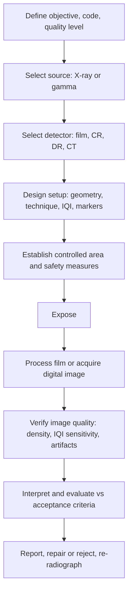

## Radiographic Testing

Radiographic testing (RT) is a volumetric nondestructive examination method that uses penetrating ionizing radiation, X-rays or gamma rays, to produce an image of the internal structure of a component. Radiation passes through the object and is attenuated in proportion to the material thickness, density, and composition along each ray path; a detector (film, imaging plate, or digital detector array) records the transmitted intensity as a shadow image. Voids, porosity, inclusions, cracks aligned with the beam, and thickness changes appear as density differences. RT gives a permanent, interpretable image of internal conditions, is widely used for weld and casting inspection, corrosion and wall-thickness assessment, assembly verification, and, with computed tomography, full three-dimensional imaging. It requires strict radiation-safety controls, and its sensitivity to planar flaws depends strongly on their orientation relative to the beam.

### 1. Role and Scope

**Key Points**

- RT detects **volumetric** discontinuities (porosity, slag, inclusions, shrinkage, burn-through, missing or misplaced internal parts) reliably, and **planar** discontinuities (cracks, lack of fusion) only when the beam is nearly parallel to the flaw plane.
- It is applicable to metals, ceramics, composites, plastics, electronics, and assemblies, across a very wide range of thicknesses through selection of the radiation source and energy.
- RT produces a **permanent record** and is comparatively intuitive to interpret, but it requires access to both sides of the component (source on one side, detector on the other) except in special backscatter or single-wall techniques.
- Typical applications: pressure-vessel and pipeline girth welds, castings (aerospace, automotive), forgings (limited), corrosion-under-insulation screening by profile radiography, aircraft structure and honeycomb, electronics and additive-manufactured parts (CT), and failure investigations to locate internal defects before sectioning.
- Radiation hazards make RT the most heavily regulated NDE method; controls on exposure, access, licensing, and training are mandatory. [Unverified] — regulatory limits and licensing details differ by country and authority.

### 2. Physical Principles

#### 2.1 Electromagnetic Radiation and Sources

X-rays and gamma rays are high-energy photons. Photon energy $E$ and wavelength $\lambda$ are related by

$$E = h\nu = \frac{hc}{\lambda}\qquad\Rightarrow\qquad \lambda\,[\text{nm}] \approx \frac{1.2398}{E\,[\text{keV}]}$$

where $h$ is Planck's constant and $c$ the speed of light. Higher photon energy corresponds to shorter wavelength and greater penetrating power.

| Aspect | X-ray | Gamma ray |
| --- | --- | --- |
| Origin | Electrons decelerated in a target (bremsstrahlung) and characteristic emission | Nuclear decay of a radioisotope |
| Energy spectrum | Continuous (polychromatic) up to the tube voltage, plus characteristic lines | Discrete lines (near monochromatic) |
| Control | Switched on and off; adjustable kV and mA | Always emitting; decays with time; fixed energy |
| Focal or source size | Small focal spots (about 0.1 to 5 mm; microfocus down to micrometers) | Isotope pellet typically 1 to 4 mm or more |
| Portability | Requires electrical power; heavier for high energy | Compact projectors; field use without power |
| Typical use | Shop and lab, thin to medium sections, high image quality; linear accelerators for very thick sections | Field pipeline work, remote or power-less sites, thick sections |

#### 2.2 X-ray Generation

In an X-ray tube, electrons emitted from a heated cathode are accelerated by the tube voltage $V$ toward a metal anode (target, commonly tungsten). The maximum photon energy equals the electron energy:

$$E_{max} = eV \quad\Rightarrow\quad \lambda_{min}\,[\text{nm}] = \frac{1.2398}{V\,[\text{kV}]}$$

The **tube current** (mA) controls the number of photons (intensity), and the **kilovoltage** (kV) controls the spectrum and penetrating power. Only about 1% of the electron energy becomes X-rays; the remainder is heat, so anode cooling and duty-cycle limits apply. The **focal spot size** governs geometric unsharpness (see Section 5). Very thick sections use high-energy sources such as megavolt linear accelerators (LINAC) or betatrons (typically 1 to 15 MeV or more).

#### 2.2.1 Common Gamma-Ray Isotopes

| Isotope | Approximate Photon Energies | Half-Life | Typical Steel Thickness Range (Single-Wall, Indicative) | Notes |
| --- | --- | --- | --- | --- |
| Iridium-192 (Ir-192) | ~0.31, 0.47, 0.60 MeV (mean about 0.36 MeV, effective) | ~74 days | About 10 to 75 mm (0.4 to 3 in.) | Most widely used in field industrial radiography; compact, high specific activity |
| Selenium-75 (Se-75) | ~0.12 to 0.40 MeV (mean about 0.21 MeV) | ~120 days | About 5 to 30 mm | Better contrast on thinner sections; increasingly used as an alternative to Ir-192 |
| Cobalt-60 (Co-60) | 1.17 and 1.33 MeV | ~5.27 years | About 40 to 150 mm or more | Thick sections; heavier shielding required |
| Ytterbium-169 (Yb-169) | ~0.06 to 0.31 MeV | ~32 days | About 2 to 15 mm | Thin materials, good contrast |
| Thulium-170 (Tm-170) | ~0.084 MeV | ~129 days | Very thin sections | Special applications |
| Cesium-137 (Cs-137) | 0.662 MeV | ~30 years | Limited industrial use | Less common in NDT |

[Unverified] — the thickness ranges shown are indicative only; actual applicable ranges depend on the code, image quality requirements, and technique.

**Radioactive decay** follows

$$A(t) = A_0\,e^{-\lambda_d t} = A_0\,2^{-t/T_{1/2}}$$

where $A$ is activity (becquerel or curie), $\lambda_d = \ln 2/T_{1/2}$ is the decay constant, and $T_{1/2}$ is the half-life. Exposure times must be adjusted as the source decays, and sources are replaced periodically (for example, Ir-192 sources commonly around 2 to 3 half-lives, or when exposure times become impractical).

#### 2.3 Interaction of Radiation with Matter

Photons interact with matter primarily by three processes in the NDT energy range:

| Process | Dominant Energy Range | Dependence | Effect |
| --- | --- | --- | --- |
| **Photoelectric absorption** | Low energy (below about 100 keV in steel) | $\propto Z^{3}$ to $Z^{4}$ and $E^{-3}$ | Photon fully absorbed; strong contrast; primary source of image contrast |
| **Compton scattering** | Intermediate (about 0.1 to 5 MeV in steel) | $\propto$ electron density, weak dependence on $Z$ | Photon deflected with energy loss; major source of scattered radiation, reduces contrast |
| **Pair production** | High energy (above 1.02 MeV threshold; dominant above about 5 to 10 MeV in steel) | $\propto Z^2$ | Photon converts to electron–positron pair; used in MeV radiography |

Additional interaction: **Rayleigh (coherent) scattering** at low energies.

#### 2.4 Attenuation (Beer–Lambert Law)

For a narrow monoenergetic beam through a uniform material of thickness $x$:

$$I = I_0\,e^{-\mu x}$$

where $I_0$ is the incident intensity, $I$ is the transmitted intensity, and $\mu$ is the **linear attenuation coefficient** (cm⁻¹), a function of photon energy and material. It is related to the **mass attenuation coefficient** by

$$\mu = \left(\frac{\mu}{\rho}\right)\rho$$

The **half-value layer (HVL)** is the thickness that reduces intensity by half, and the **tenth-value layer (TVL)** by a factor of ten:

$$HVL = \frac{\ln 2}{\mu} \approx \frac{0.693}{\mu},\qquad TVL = \frac{\ln 10}{\mu} \approx \frac{2.303}{\mu}$$

Approximate HVL values in commonly used materials (broad-beam, indicative):

| Source | Steel HVL (approx.) | Lead HVL (approx.) | Concrete HVL (approx.) |
| --- | --- | --- | --- |
| Ir-192 | ~13 mm | ~4.8 mm | ~44 mm |
| Se-75 | ~10 mm | ~2.0 mm | ~33 mm |
| Co-60 | ~21 mm | ~12 mm | ~62 mm |
| 200 kV X-ray | ~5 mm (approx., strongly kV-dependent) | ~0.5 mm | ~25 mm |

[Unverified] — HVL and TVL values vary with spectrum, filtration, geometry, and reference; use tabulated data from a recognized source for shielding design and technique planning.

Real X-ray beams are **polychromatic**, so lower-energy photons are removed preferentially as the beam traverses material (**beam hardening**), so the effective attenuation coefficient decreases with thickness. Real (broad-beam) measurements also include **scattered radiation**, modeled with a **build-up factor** $B$:

$$I = B\,I_0\,e^{-\mu x}$$

where $B \ge 1$ depends on energy, material, thickness, and geometry.

#### 2.5 Subject Contrast

If a discontinuity of thickness $\Delta x$ (along the ray path) lies in a section of thickness $x$, the intensity difference between the region with and without the discontinuity gives **subject contrast**:

$$C_s = \frac{\Delta I}{I} \approx \mu\,\Delta x \quad (\text{for small } \mu\Delta x,\ \text{ignoring scatter})$$

More generally, with scatter included:

$$C_s \approx \frac{\mu\,\Delta x}{1 + SPR}$$

where $SPR$ is the scatter-to-primary ratio. Consequences:

- **Lower photon energy** gives higher $\mu$ and therefore higher subject contrast, but requires longer exposure and cannot penetrate thick sections.
- **Scattered radiation** reduces contrast and image sharpness; controlled by collimation, masking, filters, lead screens, and backscatter shielding.
- A discontinuity is more detectable if it presents a greater thickness of low-attenuation material (a void) in the beam direction; thin planar flaws perpendicular to the beam present very small $\Delta x$ and are hard to see.

### 3. Detectors and Recording Media

#### 3.1 Film Radiography

**Film structure:** a transparent polyester base coated on one or both sides with silver-halide emulsion. X-rays or gamma rays (and light from fluorescent screens) create a latent image that is developed into metallic silver.

**Optical density (film blackening)** is defined as

$$D = \log_{10}\frac{I_0}{I_t}$$

where $I_0$ is the light intensity incident on the film and $I_t$ is the intensity transmitted through it. Density 2.0 transmits 1% of incident light; density 3.0 transmits 0.1%.

**Film speed and grain:** faster films require less exposure but have coarser grain (lower resolution and lower contrast); slower, fine-grain films give higher sensitivity.

| Film System Class (ISO 11699-1 / ASTM E1815 style) | Speed | Contrast and Graininess | Typical Use |
| --- | --- | --- | --- |
| Class I (special) / T1 | Slowest | Highest contrast, finest grain | Critical, high-sensitivity inspection |
| Class II / T2 | Slow to medium | High contrast | Aerospace, pressure equipment |
| Class III / T3 | Medium | Medium | General industrial |
| Class IV / T4 | Fastest | Lower contrast, coarser grain | Where exposure time is limiting; lead-screen use restricted |

[Unverified] — designation systems differ between ISO 11699-1 (C1 to C6), ASTM E1815 (special, I to IV), and manufacturers' proprietary classes; refer to the governing specification.

**Intensifying screens:**

- **Lead screens** (front and back, typically 0.02 to 0.25 mm depending on energy) increase the photographic effect by emitting electrons upon irradiation and **absorb low-energy scattered radiation**, improving contrast.
- **Fluorescent screens** (calcium tungstate or rare-earth) convert X-rays into light, greatly reducing exposure but increasing unsharpness and graininess; used where exposure reduction outweighs image quality.
- **Fluorometallic screens** combine lead with fluorescent material.

**Film characteristic curve (H&D curve):** plots density versus the logarithm of relative exposure; the slope in the linear region is the **film gradient (contrast)** $G$, which increases with density. The **film contrast** amplifies subject contrast:

$$\Delta D = \frac{0.434\,G\,\mu\,\Delta x}{1 + SPR}$$

(an approximation combining subject contrast and film gradient). Hence higher density generally gives greater sensitivity, up to the limit of viewer brightness.

**Density requirements (typical):** commonly 2.0 to 4.0 for single-film viewing in many codes (for example, minimum density 2.0 for X-ray, 2.0 to 3.0 for gamma in some standards), with limits on density variation across the region of interest (for example, −15% to +30% of the density at the IQI). [Unverified] — exact limits differ by code (ASME Section V Article 2, EN ISO 17636-1, ASTM E1032, API 1104).

**Processing:** manual or automatic development, stop bath, fixing, washing, and drying. Processing chemistry, temperature, and time must be controlled (with periodic monitoring using step-wedge or sensitometric strips). Archival stability depends on adequate fixing and washing.

**Film viewing:** viewing in a dimly lit room with a high-intensity illuminator; the maximum viewable density depends on illuminator brightness (typically up to density 3.5 to 4.5 with high-intensity lamps and masking).

#### 3.2 Computed Radiography (CR)

CR uses reusable **photostimulable phosphor imaging plates (IP)**. Radiation stores energy in the phosphor as a latent image; a laser scanner stimulates the plate to emit light in proportion to stored energy, which is digitized. The plate is then erased with white light and reused.

| Feature | CR |
| --- | --- |
| Advantages | Cassette-like flexibility, reusable plates, wide dynamic range, digital image processing, no chemicals, similar workflow to film |
| Limitations | Lower spatial resolution than film for some plates, scanner cost, plate wear and artifacts (scratches, dust), scanning delay, fading (latent image decay) |
| Typical resolution | Pixel pitch about 50 to 100 µm (scanner dependent) |
| Standards | ISO 17636-2, ASTM E2033 (CR practice), ASTM E2445 (CR system performance), ASTM E2446 |

#### 3.3 Digital Radiography (DR) and Digital Detector Arrays (DDA)

DR uses flat-panel detectors that convert X-rays directly (photoconductor such as amorphous selenium) or indirectly (scintillator such as CsI or Gd₂O₂S coupled to a photodiode/TFT array or CMOS), giving immediate digital images.

| Feature | DR/DDA |
| --- | --- |
| Advantages | Real-time or near real-time imaging, wide dynamic range, no consumables, image averaging (frame integration) to improve signal-to-noise ratio, integration with automated systems, easy storage and transfer |
| Limitations | High detector cost, susceptibility to radiation damage over time, dead or defective pixels (corrected by calibration), limited size and flexibility, sensitivity to temperature and scatter, bad-pixel maps and gain calibration required |
| Typical pixel pitch | About 50 to 200 µm |
| Standards | ISO 17636-2, ASTM E2597 (DDA characterization), ASTM E2698 (DDA practice), ASTM E2737 (DDA qualification) |

Key digital metrics: **signal-to-noise ratio (SNR)**, **normalized SNR (SNRN)** (SNR normalized to the basic spatial resolution), **contrast-to-noise ratio (CNR)**, **basic spatial resolution (SRb)**, **modulation transfer function (MTF)**, and **detective quantum efficiency (DQE)**. The normalized SNR is defined in ISO 17636-2 relative to $88.6\,\mu\text{m}$ resolution:

$$SNR_N = SNR \times \frac{88.6\ \mu\text{m}}{SR_b}$$

Image quality requirements specify a **minimum normalized SNR** (for example, several tens to over 100 depending on class and material thickness). [Unverified] — required values are set by the applicable standard.

#### 3.4 Real-Time Radiography and Fluoroscopy

Image intensifiers or flat-panel detectors give live images of moving or rotating parts (for example, castings under manipulation, inspection of electronics, food and security inspection). Sensitivity is generally lower than static film or DDA techniques, though digital averaging narrows the gap.

#### 3.5 Computed Tomography (CT)

CT reconstructs cross-sectional and volumetric images from many projections acquired at different angles. Using filtered back-projection (FBP) or iterative algorithms, the linear attenuation coefficient distribution $\mu(x,y,z)$ is reconstructed from line integrals, following

$$p(\theta, s) = \int_{L(\theta,s)} \mu(x,y)\,dl = -\ln\!\left(\frac{I}{I_0}\right)$$

Reconstruction gives values commonly reported as **CT numbers** (grey values, or Hounsfield units in medical work). Industrial CT provides 3D visualization, dimensional metrology (wall thickness, internal features, comparison with CAD), porosity analysis, assembly inspection, and defect quantification (for example in additively manufactured and cast parts, composites, and batteries).

| Feature | Industrial CT |
| --- | --- |
| Advantages | Full 3D data, no superposition of features, quantitative volumes and dimensions, detection of subsurface and internal flaws in complex geometry |
| Limitations | Long scan and reconstruction times, high equipment cost, size and density limits of parts, artifacts (beam hardening, scatter, ring artifacts, metal artifacts), large data volumes |
| Types | Microfocus CT (micrometer resolution for small parts), high-energy CT (LINAC for large castings), laminography (planar components), synchrotron CT (research) |

### 4. Image Quality and Sensitivity

#### 4.1 Definition

Radiographic image quality is characterized by **contrast** (density or grey-value differences) and **definition** (sharpness), together with noise (graininess in film, SNR in digital). **Radiographic sensitivity** is the smallest detail that can be reliably discerned.

#### 4.2 Image Quality Indicators (IQIs, Penetrameters)

IQIs are used to verify that the radiographic technique achieves the required sensitivity, and they are placed on the source side of the object (or on the film side with a specified marker when access requires).

| IQI Type | Description | Standards |
| --- | --- | --- |
| **Hole-type (penetrameter)** | A thin plate of the same or radiologically similar material with holes (commonly 1T, 2T, and 4T, where T is the plate thickness); the required visible hole is defined by the code | ASTM E1025, ASME Section V (ASTM E1025 and E1742) |
| **Wire-type** | A set of parallel wires of graduated diameters in a holder; the smallest visible wire indicates sensitivity | ASTM E747, ISO 19232-1, EN ISO 17636 |
| **Step-hole or duplex wire (for resolution)** | Duplex-wire IQI used to determine basic spatial resolution of digital systems | ISO 19232-5, ASTM E2002 |

**Sensitivity expression:** for a hole-type IQI, the **equivalent sensitivity** is

$$S = \frac{100}{t}\sqrt{\frac{T\,h}{2}}\ \%$$

where $t$ is the specimen thickness, $T$ is the IQI thickness, and $h$ is the diameter of the smallest visible hole. Typical achieved sensitivities are 2% (for example 2-2T for many general applications), and 1-1T or better for critical work. [Unverified] — the formula and code designations (such as "2-2T" meaning IQI thickness 2% of specimen thickness and a hole diameter of 2T) vary by standard; use the governing definition.

IQI placement: on the side of the object facing the source, near the region of interest, with the identification numbers and shims (when needed to match the thickness, such as weld reinforcement) placed appropriately. For weld radiography with reinforcement, IQI is selected based on the **nominal single-wall thickness plus reinforcement** as required by the code.

#### 4.3 Factors Affecting Image Quality

| Factor | Effect |
| --- | --- |
| Radiation energy (kV or isotope) | Higher energy lowers contrast and penetrates more; select the lowest energy that allows adequate penetration (within density and IQI requirements) |
| Exposure (mA·s or Ci·min) | Determines density (film) or SNR (digital) |
| Source-to-object distance (SOD) and source size | Geometric unsharpness and intensity |
| Object-to-detector distance | Geometric unsharpness and magnification |
| Scatter (internal from the object, side scatter, backscatter) | Loss of contrast and sharpness |
| Film type, screen type, or detector type | Sensitivity, graininess, resolution |
| Film processing or digital calibration and processing | Contrast and noise |
| Flaw orientation and thickness in beam direction | Detectability |

#### 4.4 Geometric Unsharpness

An extended source of size $F$ produces a penumbra (blurring) at the edges of features. The **geometric unsharpness** $U_g$ is

$$U_g = \frac{F\cdot d}{D - d}$$

where $F$ is the effective focal spot or source size, $d$ is the distance from the object's source-side surface (or the feature) to the detector (object-to-detector distance), and $D$ is the source-to-object distance (equivalently, if $SFD$ = source-to-film distance, then $U_g = F\,d/(SFD - d)$).

To minimize unsharpness: use a **small source**, a **large source-to-object distance**, and place the detector **in contact** with the object. Many codes limit $U_g$ to a maximum (for example, 0.5 mm for material thickness up to 50 mm, or thickness-dependent limits).

The **minimum source-to-object distance** for a given maximum allowable unsharpness $U_{g,max}$ is

$$D_{min} = d\left(\frac{F}{U_{g,max}} + 1\right)$$

For example, with $F = 3$ mm, $d = 25$ mm (thickness), and $U_{g,max} = 0.5$ mm: $D_{min} = 25\,(6 + 1) = 175$ mm. [Inference] — codes may prescribe a different formula or limit depending on thickness, so verify against the governing standard.

**Inherent (film or detector) unsharpness** $U_i$ adds to geometric unsharpness; the total is often approximated by

$$U_t = \sqrt{U_g^2 + U_i^2}$$

#### 4.5 Inverse Square Law and Exposure

Radiation intensity from a point source falls off with the square of distance:

$$\frac{I_1}{I_2} = \left(\frac{d_2}{d_1}\right)^2$$

For exposure calculation, the exposure factor is proportional to the product of intensity and time:

$$\text{Exposure} \propto \frac{A \cdot t}{d^2}\ (\text{for gamma sources}), \qquad \frac{mA\cdot t}{d^2}\ (\text{for X-ray})$$

Hence a change in distance from $d_1$ to $d_2$ requires exposure time to be scaled by $(d_2/d_1)^2$ to keep the same density. Exposure charts or software (for a given material, thickness, film type, and kV or isotope) provide starting values, and test exposures verify density.

**Thickness compensation:** a rule of thumb for X-rays is that a change in material thickness of approximately one HVL requires the exposure to be changed by a factor of about 2 (approximately), and that the **reciprocity law** ($E = I\times t$ gives the same density) holds for direct exposure but fails for fluorescent screens at very long or short times. [Inference] — use calibrated exposure charts rather than rules of thumb for production.

### 5. Radiographic Techniques

#### 5.1 Basic Setup

The source is placed on one side of the object and the detector on the other. The central ray should be directed at the region of interest and, for welds, centered at the weld with the beam **perpendicular** to the film plane in the standard case (angled beams are used to detect planar flaws parallel to the bevel, such as lack of sidewall fusion).

Essential accessories: **location markers** (lead letters and numbers), **identification markers**, **IQI**, **backscatter shielding** (lead sheet behind the film or detector, with lead letter "B" to detect backscatter fogging), **masks** or **collimators**, and **filters** (for example a filter at the tube to remove soft radiation or minimize scatter).

#### 5.2 Weld Radiography Techniques

| Technique | Description | Typical Use |
| --- | --- | --- |
| **Single-wall single-image (SWSI)** | Source on one side, film on the opposite side of the single wall; the film sees only the near or far wall thickness | Plates; large-diameter pipes and vessels where access to the inside is available (source inside, panoramic, or source outside with film inside) |
| **Panoramic exposure** | Source at the center of a circular weld (for example inside a pipe), film wrapped around the outside; the entire circumference exposed in one shot | Pipe and vessel girth welds with internal access (fast, good image quality, minimal source-to-film distance variation) |
| **Double-wall single-image (DWSI)** | Source outside, film outside on the opposite side; radiation passes through both walls but only the wall next to the film is evaluated (source-side wall flaws are out of focus). Multiple exposures are required (for example three at 120° or four at 90°, for full coverage) | Small-to-medium diameter pipes (typically over about 89 mm or 3.5 in.) |
| **Double-wall double-image (DWDI)** | Source outside, film outside; both walls appear on the film as an ellipse or superimposed image; used for small diameter pipes (generally 89 mm or less). Two exposures at 90° are typical; the source offset produces an elliptical image of the weld so both walls are visible | Small-diameter pipes and tubing |
| **Elliptical technique (offset)** | Source offset from the weld plane so the weld appears as an ellipse | Small-diameter pipes |
| **Superimposed technique** | Source directly above the weld axis so the walls superimpose; less common | Special cases |
| **Contact/profile radiography** | Tangential shots across the pipe wall in profile to measure wall thickness and detect corrosion or deposits | Corrosion under insulation, wall loss screening |
| **Stereoscopic** | Two exposures with a small source shift; viewed stereoscopically to determine depth of a discontinuity | Depth localization in complex parts |
| **Parallax method** | Two exposures with source shift; the apparent displacement of a flaw relative to reference markers gives depth: for source shift $s$ and flaw apparent shift $p$ on the film at distances $H$ (source to film) and depth $z$ (flaw above film): $z = \dfrac{p\,H}{p + s}$ (with appropriate sign conventions) | Locating depth of flaws for repairs |

[Unverified] — the pipe-diameter thresholds and number of exposures for DWSI and DWDI depend on the code (ASME Section V Article 2, API 1104, EN ISO 17636-1, ASTM E1032); consult the applicable standard.

#### 5.3 Beam Direction and Flaw Orientation

- The beam should be as **parallel as possible** to planar flaws (cracks, lack of fusion) to maximize the thickness of the flaw seen along the ray path.
- For V-groove welds, exposure along the bevel direction (angled beam) improves detection of lack of sidewall fusion; standard perpendicular exposures may miss these flaws. Many codes require an additional angled exposure only when specifically required.
- Cracks perpendicular to the beam (lying in the plane of the film) are generally undetected.

#### 5.4 Special Techniques

| Technique | Description |
| --- | --- |
| **Microfocus radiography** | Very small focal spots (about 5 to 100 µm) give geometric magnification with low unsharpness; used for small parts and electronics |
| **Neutron radiography** | Uses neutrons, which are attenuated differently (strong for hydrogenous materials, weak for many metals); complementary to X-ray for detecting hydrogenous material such as adhesives and corrosion products in metal structure |
| **Backscatter radiography (Compton)** | Detects scattered radiation to image objects accessible from one side only |
| **Radioscopy with image processing** | Live imaging with digital enhancement |
| **High-energy (MeV) radiography** | LINAC or betatron for thick sections (for example steel over 100 mm) |
| **Laminography and tomosynthesis** | Blur out structures above and below a selected plane; useful for flat or layered structures such as printed circuit boards |
| **Dual-energy radiography** | Two energy levels to separate material types |
| **Phase-contrast imaging** | Uses phase shift of coherent X-rays; research and specialized applications |

### 6. Test Procedure and Technique Selection

1. **Procedure review:** governing code, technique class (for example ISO 17636-1/2 Class A basic or Class B improved; ASME Section V Article 2), acceptance criteria, personnel qualification.
2. **Source and detector selection:** based on material, thickness, required sensitivity, and access. Gamma sources are chosen for field work; X-ray for higher image quality and lower energies in thin sections. Select the lowest energy that gives the required penetration and density.
3. **Geometry:** determine source-to-object distance to meet $U_g$ limits; position the film or detector in contact; plan the number and angle of exposures (for pipe DWSI/DWDI).
4. **Placement of IQI, markers, and backscatter shielding.**
5. **Radiation safety setup:** controlled area, barriers, warning signs, interlocks, survey meters, dosimeters, exposure logs.
6. **Exposure:** according to exposure charts or calculation; with digital systems, appropriate frame averaging, gain calibration, and bad-pixel maps.
7. **Processing or scanning:** film processing or CR scanning or DDA image acquisition and calibration.
8. **Image quality verification:** density (for film), IQI visibility, absence of artifacts, adequate coverage, correct identification; reject and repeat if needed.
9. **Interpretation:** by qualified personnel under proper viewing conditions (for film) or on calibrated monitors (for digital), with reference to the code's acceptance criteria.
10. **Recording and reporting.**
11. **Archiving:** film retention (commonly years, up to the life of the item, per contract or code) or digital data storage with backup and integrity checks (for example DICONDE format for digital NDT data, ASTM E2339).

### 7. Interpretation of Radiographs

#### 7.1 Radiographic Appearance of Discontinuities

Discontinuities that present **less material** in the beam (voids) appear **darker** on a film radiograph (higher density) and, in the digital positive display, likewise darker (more transmission). Inclusions of higher density than the base metal (tungsten, dense inclusions) appear **lighter**.

| Discontinuity | Typical Radiographic Appearance | Notes |
| --- | --- | --- |
| **Porosity (gas)** | Round or oval dark spots; may be scattered, clustered, or aligned | Clusters and linear arrangements are treated differently in acceptance criteria |
| **Wormholes (elongated gas pores)** | Elongated dark tubular indications, often at an angle to the weld axis | Often along the fusion line |
| **Slag inclusions** | Irregular, elongated dark indications with uneven density; can have sharp or ragged edges | Often parallel to the weld axis, in the root or between passes |
| **Tungsten inclusions (GTAW)** | Light (dense) irregular spots | Higher density than steel appears brighter |
| **Lack of fusion (LOF)** | Straight, thin dark line along the weld bevel or between passes; sharp edges | Difficult if the beam is not parallel to the plane |
| **Incomplete (lack of) penetration (LOP)** | Continuous or intermittent dark line at the root centerline, sharp-edged | Often visible as a straight, dark line along the root |
| **Cracks** | Fine, sharp, dark, jagged or straight lines, often with branching, of variable density; may be longitudinal, transverse, or crater | Detectability depends on orientation and opening; highly critical |
| **Burn-through / excessive penetration (drop-through)** | Dark or light irregular area at the root (concavity or excessive protrusion changes density) | Density change correlated to root shape |
| **Root concavity / suck-back** | Dark region along the root, with a smooth density transition | Section reduction |
| **Undercut** | Dark line at the weld toe, with a diffuse edge on one side | Confirm with visual inspection |
| **Shrinkage (castings)** | Dark, ragged, feathery or dendritic patterns (filamentary, sponge-type) | Typical of casting; classified against reference radiographs (ASTM E446, E186, E280) |
| **Gas holes (castings)** | Round, dark, smooth-edged spots | Similar to weld porosity |
| **Hot tears, cold shuts (castings)** | Dark, irregular or linear indications | Cracks in castings |
| **Inclusions and dross (castings)** | Light or dark irregular spots depending on relative density |  |
| **Segregation** | Variation of density in a region | Subtle |
| **Corrosion or wall loss** | Local density increase (thinning) relative to surrounding material; deposits appear lighter or darker depending on density | Profile radiography measures remaining wall |
| **Missing or displaced internal components** | Shape and location differences | Assembly verification |

#### 7.2 Artifacts and False Indications

| Artifact | Cause |
| --- | --- |
| Film scratches, pressure marks, kinks | Handling; appear as dark or light lines |
| Fog (general density increase) | Light leaks, old film, improper storage, scatter, excessive development temperature |
| Static marks | Dry conditions, rapid film removal from cassette; branching dark lines |
| Streaks and stains | Processing chemistry problems |
| Backscatter | Radiation scattered from surfaces behind the film; the "B" marker appears as a light image if backscatter present |
| Screen artifacts | Dust, damaged lead screens, lint |
| Processing marks (roller marks) | Automatic processor rollers |
| Fingerprints, water marks | Handling and drying |
| Imaging plate artifacts (CR) | Scratches, dust, phosphor fading, scanner lines |
| Detector artifacts (DR) | Dead pixels, gain or offset errors, image lag or ghosting |

Distinguish artifacts from true indications by re-examination, re-radiography, or additional techniques, and by noting whether the pattern coincides with film handling or geometric features.

#### 7.3 Viewing Conditions (Film)

- Viewing area with subdued ambient light; illuminator with adjustable brightness and masks to reduce glare.
- Adequate viewer light intensity for high density (for example, luminance at least about 30 cd/m² through the film). [Unverified] — verify criteria in the applicable standard (for example EN ISO 5580, ASTM E1390).
- Interpreters need suitable visual acuity and are dark-adapted before evaluating.

For digital images: calibrated monitors, controlled ambient light, appropriate grey-scale display, zoom, and image processing tools (contrast, filters, profile plots), with documentation that processing did not obscure data and that original raw data are preserved.

### 8. Acceptance Criteria and Codes

Acceptance criteria are defined in the governing code and vary by service and quality level.

| Discontinuity | Typical Criteria (Illustrative) |
| --- | --- |
| Cracks | Not acceptable in any length |
| Lack of fusion and lack of penetration | Not acceptable, or limited length for less critical service |
| Slag inclusions and elongated indications | Length limits related to thickness (for example, maximum length T/3 or specific mm caps), aggregate length within a defined weld length |
| Porosity (rounded indications) | Size (maximum dimension related to thickness) and distribution limits using charts (for example ASME Section VIII Appendix 4 rounded indication charts); cluster and aligned porosity limits |
| Undercut and root concavity | Depth limits, evaluated by RT density comparison and visual inspection |
| Burn-through | Limits on size and density |

[Unverified] — specific values must be taken from the governing document.

| Document | Topic |
| --- | --- |
| ASME BPVC Section V, Article 2 (RT), Article 22 (SE-94, SE-1030 etc.) | RT method requirements |
| ASME Section VIII Div. 1 UW-51/UW-52, Section I, B31.3, B31.1 | Acceptance criteria for pressure equipment and piping |
| API 1104 | Pipeline welding, RT acceptance |
| AWS D1.1 Section 6 Part E (RT), AWS D1.6, D17.1 | Structural steel welds and aerospace welding |
| ASTM E94, E1030, E1032, E1025, E747, E1742, E999, E142, E1254, E1390 | Radiographic practices, IQIs, film, viewing, quality control |
| ASTM E446, E186, E280, E505 | Reference radiographs for castings |
| ASTM E2033, E2445, E2446, E2597, E2698, E2737, E2007 | CR and DR practices and system qualification |
| ISO 17636-1 (film) and ISO 17636-2 (digital), ISO 10675-1 (acceptance levels for welds), ISO 5579, ISO 19232 (IQIs), ISO 11699 (film systems), ISO 11699-2, ISO 5580 (illuminators) | International RT standards |
| EN 12681 (castings), EN 13068 (real-time), EN 16016 (CR), EN 12543 (X-ray tubes, focal spots) | European standards |
| ISO 9712, NAS 410, ASNT SNT-TC-1A, ANSI/ASNT CP-189 | Personnel qualification |
| IAEA and national regulations (for example NRC 10 CFR Part 34 in the United States, ionising radiation regulations in other jurisdictions) | Radiation safety and licensing |

[Unverified] — standard numbers, titles, and current status must be verified before citation.

### 9. Radiation Safety

Radiation safety is fundamental to RT. The principles are **time, distance, and shielding**, within the **ALARA** (as low as reasonably achievable) framework, plus regulatory dose limits and licensing.

#### 9.1 Units

| Quantity | SI Unit | Older Unit | Conversion |
| --- | --- | --- | --- |
| Activity | becquerel (Bq) | curie (Ci) | 1 Ci = 3.7×10¹⁰ Bq |
| Exposure (in air) | coulomb per kg (C/kg) | roentgen (R) | 1 R = 2.58×10⁻⁴ C/kg |
| Absorbed dose | gray (Gy) = J/kg | rad | 1 Gy = 100 rad |
| Equivalent (effective) dose | sievert (Sv) | rem | 1 Sv = 100 rem |

For X-rays and gamma rays the radiation weighting factor is 1, so 1 Gy corresponds to 1 Sv (for the purpose of equivalent dose).

#### 9.2 Dose Rate Estimation and Shielding

The dose rate from a gamma point source varies with activity $A$, distance $d$, and the source's **specific gamma-ray constant** $\Gamma$ (or "RHM", roentgen per hour at one meter per curie):

$$\dot{D} = \frac{\Gamma\,A}{d^2}$$

Approximate values for Γ (R·m²/(h·Ci), indicative): Ir-192 about 0.48; Co-60 about 1.3; Se-75 about 0.2; Cs-137 about 0.33. [Unverified] — use tabulated constants and manufacturer or regulatory data for calculations.

Example: a 3.7 TBq (100 Ci) Ir-192 source at 1 m produces approximately $0.48\times100 = 48$ R/h. At 10 m the dose rate is 100 times lower, or about 0.48 R/h.

**Shielding attenuation** with $n$ half-value layers reduces the dose rate by $2^{-n}$:

$$\dot{D}_{shielded} = \dot{D}_0\,\left(\tfrac{1}{2}\right)^{x/HVL}$$

Materials: lead, steel, tungsten, depleted uranium (source containers and collimators), and concrete or earth (radiography bays and barriers).

#### 9.3 Dose Limits

Occupational and public dose limits are set by national regulators, commonly based on ICRP recommendations. Typical figures (illustrative): occupational effective dose about 20 mSv per year averaged over five years (with a maximum of 50 mSv in any single year in ICRP-based schemes), or 50 mSv per year (5 rem) in some national regulations, and about 1 mSv per year for members of the public. Boundaries of controlled areas are set so that dose rates do not exceed regulatory limits (for example, 2 mR/h, 0.02 mSv/h at the barrier in some regimes). [Unverified] — actual limits differ by jurisdiction and are updated periodically; consult the applicable regulation.

#### 9.4 Safety Practices

| Measure | Description |
| --- | --- |
| **Controlled area** | Barriers and rope/tape, warning signs ("Caution Radiation Area", trefoil), flashing lights, area monitoring, sentries |
| **Survey meters** | Calibrated ionization chamber or Geiger–Müller meters used before, during, and after exposure to confirm the source has returned to its shielded position and to verify boundary dose rates |
| **Personal dosimetry** | Film badges, thermoluminescent dosimeters (TLD), optically stimulated luminescence (OSL) dosimeters, plus direct-reading electronic personal dosimeters with alarm |
| **Source security and control** | Locked storage, inventory, transport requirements, leak testing of sealed sources, source-exchange procedures by licensed personnel |
| **Crank-out projectors and remote control** | Sources are moved remotely from a shielded container through a guide tube; positive connection and locking checks; radiographers remain at a safe distance |
| **Emergency procedures** | Stuck source or disconnected source retrieval plan, emergency equipment (long tongs, shielded containers), notification of regulatory bodies |
| **Training and licensing** | Certified radiographers, radiation safety officer (RSO), documented procedures |
| **X-ray equipment interlocks** | Door interlocks, key control, warning lights, emergency stops, shielded enclosure or cabinet systems |
| **Transport** | Packaging, labeling, and documentation under transport regulations (IAEA/ADR/DOT) |
| **Two-person rule** | Radiographers usually work in pairs (or as required by regulation) |

**Key Points**

- Never approach a projector or exposure device without a functioning survey meter confirming that the source is fully shielded.
- Radiation cannot be detected by human senses; reliance on instruments and procedures is essential.
- Accidents typically occur with source retraction failures, bypassed safety procedures, poor communication, and unauthorized access; strict discipline prevents most incidents.
- Pregnant workers may be subject to additional dose limitation to the fetus under regulations.

### 10. Comparison of RT with Other Methods

| Aspect | RT | UT | MT and PT |
| --- | --- | --- | --- |
| Detects | Volumetric flaws well; planar flaws only if aligned | Planar and volumetric flaws; excellent for cracks and lack of fusion | Surface (PT) and surface/near-surface (MT) flaws |
| Access | Both sides (source and detector) | Usually one side | One side |
| Record | Permanent image (film or digital) | Encoded data (PAUT, TOFD) or operator notes (manual) | Photos, notes |
| Sizing | Length and width in the image plane; depth information limited (parallax or CT) | Through-wall height (TOFD/PAUT tip diffraction) | Surface length only |
| Safety | Ionizing radiation hazards; heavy regulation | Minimal hazards | Chemical, electrical, UV |
| Speed and cost | Moderate to slow; exposures, processing, safety setup | Fast | Fast, low cost |
| Geometry | Complex shapes difficult for interpretation (superposition) | Complex shapes with beam-path challenges | Complex shapes accessible |
| Thickness range | Very wide (thin foils to over 300 mm steel with MeV) | Wide (mm to meters) | Surface only |

Radiography and ultrasonic testing are often used **together**: RT excels at volumetric defects and gives an easily reviewed image, while UT better finds and sizes planar flaws, so complementary use covers the flaw types of concern.

### 11. Worked Examples

**Example 1: Geometric unsharpness and minimum distance**

*Situation:* A 20 mm thick steel plate weld is radiographed with an X-ray tube having an effective focal spot of 2.5 mm; the film is in contact with the back surface. The code limits geometric unsharpness to 0.5 mm.

1. Object-to-detector distance for a flaw at the source-side surface: $d \approx 20$ mm.
2. Minimum source-to-object distance:

$$D_{min} = d\left(\frac{F}{U_{g,max}} + 1\right) = 20\left(\frac{2.5}{0.5} + 1\right) = 20 \times 6 = 120\ \text{mm}$$

(the distance from the source to the source-side surface). So the source-to-film distance must be at least $120 + 20 = 140$ mm. In practice, a larger distance (for example 600 mm) is chosen to also give uniform coverage, and the exposure is scaled by the inverse square law.

**Example 2: Exposure adjustment**

*Situation:* An exposure of 5 mA at 300 mm source-to-film distance requires 60 s. The distance must be increased to 600 mm.

Scale time by the square of the distance ratio: $t_2 = 60\times(600/300)^2 = 240$ s at the same mA. Alternatively, increase current to 20 mA to keep 60 s. [Inference] — reciprocity generally holds for direct-exposure film; verify with a test radiograph.

**Example 3: Gamma source decay and exposure time**

*Situation:* An Ir-192 source of initial activity 3.7 TBq (100 Ci) is used; after 74 days (one half-life) the activity is 50 Ci. If the original exposure time was 4 minutes for a given technique, the required time now is about $4\times(100/50) = 8$ minutes at the same distance and geometry. After 148 days (two half-lives) the activity is 25 Ci and the time is about 16 minutes.

**Example 4: Dose rate and boundary distance**

*Situation:* A 50 Ci Ir-192 source is exposed in an open field. The dose-rate constant $\Gamma \approx 0.48$ R·m²/(h·Ci), giving at 1 m: $0.48\times50 = 24$ R/h. To reach the 2 mR/h (0.002 R/h) boundary:

$$d = \sqrt{\frac{\Gamma A}{\dot{D}_{limit}}} = \sqrt{\frac{24}{0.002}} = \sqrt{12{,}000} \approx 110\ \text{m}$$

without additional shielding, collimation, or beam direction control. In practice, collimators, shielding, and directing the beam toward safe zones shorten the boundary distance considerably. [Inference] — actual boundary determination must be by survey meter measurements during the first exposure.

**Example 5: Radiographic contrast and flaw detectability (illustrative)**

*Situation:* A void 0.5 mm thick (in the beam direction) in a 20 mm steel section is radiographed with a 200 kV X-ray. Using an effective linear attenuation coefficient $\mu \approx 1.4\ \text{cm}^{-1}$ (indicative for filtered radiation at this energy, steel), the subject contrast is

$$C_s \approx \mu\,\Delta x = 1.4\ \text{cm}^{-1}\times0.05\ \text{cm} = 0.07 \quad (7\%)$$

With scatter-to-primary ratio $SPR = 1$, contrast is reduced to about 3.5%. With film gradient $G = 3.5$ at density 2.5, $\Delta D \approx 0.434\times3.5\times0.035 = 0.053$, a density difference just at the limit of visual detectability (about 0.02 to 0.05 under good viewing). This illustrates why reducing scatter (lead screens, masking, filtration) and using appropriate energy are essential, and why very small or thin flaws are near the detection limit. [Unverified] — the attenuation coefficient depends strongly on effective energy and filtration; the calculation is illustrative.

### 12. Advantages and Limitations

| Advantages | Limitations |
| --- | --- |
| Volumetric inspection with a permanent record | Ionizing radiation hazard; strict regulation, training, and controls |
| Detects a wide range of volumetric flaws (porosity, inclusions, shrinkage) | Poor sensitivity to planar flaws not aligned with the beam (cracks, lack of fusion) |
| Applicable to most materials and thicknesses with suitable energy | Requires access to both sides; not suitable for many in-service situations without special techniques |
| Intuitive images; suitable for casting and assembly verification | Superimposition of features complicates interpretation (2D projection) |
| Digital techniques allow rapid inspection, image processing, and archiving | Slower and more costly than UT for many weld applications; exposure and safety set-up time |
| CT gives 3D information and dimensional metrology | Depth of flaws not directly known in single projection |
| Field-portable with gamma sources | Regulatory and transport burdens for isotopes; source decay management |
| Wide standardization and experience | Sensitivity dependent on geometry, scatter control, and image quality control |

### 13. Quality Assurance and Process Control

| Item | Purpose | Typical Frequency (Illustrative) |
| --- | --- | --- |
| Film processing control (sensitometric strips, temperature, replenishment) | Consistent development | Daily/each batch |
| Film and screen condition, cassette integrity | Avoid artifacts | Periodic and after damage |
| Viewer luminance and ambient light check | Ensure interpretability | Periodic (for example every 6 months) |
| Densitometer calibration | Accurate density measurement | Every 90 days or per code, with calibrated step wedges |
| X-ray tube focal-spot measurement and output check | Verify geometry and performance | Periodic per standard (EN 12543) |
| Gamma source activity and leak test; projector maintenance | Safety and exposure control | Per regulation (often every 6 months for leak test; annual maintenance) |
| Survey meter and dosimeter calibration | Accurate radiation measurement | Annually |
| CR scanner and plate checks; DDA calibration (offset, gain, bad-pixel maps) and performance verification (SNR, SRb, contrast sensitivity) | Digital image quality | Per standard, daily and periodic |
| Monitor and display calibration | Reliable interpretation | Periodic |
| Personnel qualification and vision testing | Reliability | Per certification scheme |
| Written procedures and technique sheets | Repeatability | Controlled documents |

### 14. Reporting

A radiographic report typically includes:

1. Item identification, material, thickness, weld details, and location or joint identification.
2. Procedure, technique class, code, and acceptance criteria.
3. Radiation source (type, size or focal spot, kV/mA or isotope and activity), exposure parameters, and source-to-object and object-to-detector distances.
4. Detector (film type and classification, screens, CR plate, or DDA type and settings), and processing or acquisition details.
5. IQI type and placement, essential hole or wire visible, measured density range or SNR, and geometric unsharpness.
6. Arrangement (SWSI, DWSI, DWDI, panoramic), number of exposures and coverage.
7. Personnel identification and qualification level.
8. Interpretation results: description, location, size, and type of indications; acceptance or rejection with reference to the criteria; comments on artifacts or limitations.
9. Reference to repaired areas and re-radiography results.
10. Date, signatures, and archive location or digital file identification.

### 15. Emerging Developments

| Development | Description |
| --- | --- |
| **Digital radiography replacing film** | Growing adoption of DDA and CR, with standards for qualification and image quality; improved productivity and safety through shorter exposures |
| **Automated defect recognition (ADR) and AI** | Machine learning for flaw detection in weld and casting radiographs; requires validation, transparent performance metrics, and human oversight. [Unverified] — code acceptance of ADR varies |
| **X-ray CT for additive manufacturing and battery inspection** | 3D quality control, porosity analysis, dimensional verification |
| **Portable and compact X-ray sources** | Battery-powered pulsed X-ray units and portable generators replacing gamma sources in some field applications, reducing source-security and transport burdens |
| **Selenium-75 and other alternative isotopes; replacement of sources by X-ray systems** | Trends driven by safety, security, and regulatory factors |
| **Robotic and crawler-based pipeline radiography** | Automated systems for girth weld inspection |
| **Dual-energy and photon-counting detectors** | Improved material discrimination and contrast; research and early industrial adoption |

### 16. Common Pitfalls

- **Incorrect flaw orientation strategy:** relying on single perpendicular exposures for weld inspection where lack of sidewall fusion or cracks are of concern.
- **Excessive geometric unsharpness** from short source-to-object distance, large source, or detector not in contact.
- **Inadequate density (film) or low SNR (digital)**, too high energy (low contrast) or wrong film/screen combination.
- **Scatter and backscatter** not controlled: missing lead screens, masks, and back shielding; failure to check the "B" marker.
- **IQI misuse:** wrong type or size, wrong placement (film side instead of source side without proper marker), wrong thickness basis for welds with reinforcement.
- **Processing errors and artifacts** interpreted as flaws; poor film handling; failure to maintain processing controls.
- **Uncalibrated viewing conditions,** insufficient illuminator brightness or ambient light control, and poor monitor calibration in digital review.
- **Misjudging source activity decay** and exposure times; not updating exposure charts.
- **Neglecting bad-pixel correction and calibration** in DDA systems, and using unverified compression or image processing that can hide or create indications.
- **Safety breaches:** failing to survey, bypassing barriers, ignoring dosimeter alarms, inadequate source security, poor communication.
- **Assuming RT alone is sufficient** for cracks or planar flaws; failing to supplement with UT or other methods when the risk is high.
- **Inadequate coverage** in pipe DWSI/DWDI (missed sections), and incorrect identification marking preventing traceability.
- **Poor archiving and record management,** loss of data integrity for digital records.

### Conclusion

Radiographic testing provides a permanent, interpretable volumetric image of internal conditions. Its capability depends on fundamental physics (photon interaction and attenuation, contrast, and scatter), careful selection of source energy and detector, geometric control of unsharpness and beam direction, verified image quality through IQIs and density or SNR requirements, and disciplined interpretation against acceptance criteria. Digital radiography and computed tomography extend RT through faster workflows, image processing, and three-dimensional quantification, while the ionizing nature of the method demands rigorous radiation-safety practice based on time, distance, shielding, monitoring, and regulatory compliance. Used alongside ultrasonic, magnetic particle, penetrant, and eddy current methods, RT remains a cornerstone of fabrication quality assurance, in-service inspection, and failure investigation.

### Next Steps

- Digital Radiography, Computed Radiography, and Image Quality Metrics
- Industrial Computed Tomography and Dimensional Metrology
- Radiation Protection, Dosimetry, and Regulatory Compliance
- Weld Inspection Codes and Acceptance Criteria
- Complementary Use of RT and Ultrasonic Testing (TOFD and Phased Array)
- Neutron and Backscatter Radiography
- Automated Defect Recognition and Machine Learning in NDT
- NDT Data Management (DICONDE) and Digital Archiving