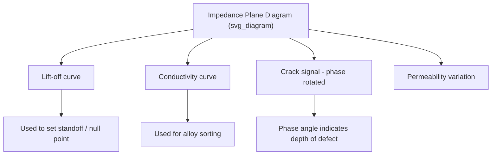

## Eddy Current Testing

### Fundamental Principles

Eddy current testing (ECT) is an electromagnetic NDT method based on the principle of electromagnetic induction. A coil carrying alternating current, when brought near an electrically conductive material, generates a fluctuating magnetic field. This field induces circulating currents — eddy currents — within the material, in accordance with Faraday's law of electromagnetic induction.

$$\varepsilon = -N\frac{d\Phi}{dt}$$

where $\varepsilon$ is the induced electromotive force, $N$ is the number of coil turns, and $\Phi$ is the magnetic flux.

The eddy currents induced in the test material generate their own secondary magnetic field, which opposes the primary field (Lenz's law) and alters the impedance of the excitation coil. Any discontinuity, dimensional variation, or change in material property that disrupts the flow of eddy currents produces a measurable change in coil impedance. This impedance change — measured as amplitude and phase shift — is the fundamental signal used for defect detection, thickness measurement, and material sorting.

### Depth of Penetration and Skin Effect

Eddy current density is greatest at the surface and decreases exponentially with depth, a phenomenon known as the skin effect.

$$J_x = J_0 e^{-x/\delta}$$

where $J_x$ is current density at depth $x$, $J_0$ is surface current density, and $\delta$ is the standard depth of penetration.

The standard depth of penetration is defined as the depth at which current density falls to $1/e$ (about 37%) of the surface value:

$$\delta = \sqrt{\frac{1}{\pi f \mu \sigma}}$$

where:

- $f$ = test frequency (Hz)
- $\mu$ = magnetic permeability of the material (H/m)
- $\sigma$ = electrical conductivity of the material (S/m)

**Key Points**

- Higher frequency → shallower penetration, better sensitivity to surface/near-surface defects
- Lower frequency → deeper penetration, but reduced resolution for small discontinuities
- Ferromagnetic materials (high $\mu$) drastically reduce penetration depth compared to non-ferromagnetic materials (e.g., aluminum, copper, austenitic stainless steel)
- Effective inspection depth is generally limited to about 3$\delta$, beyond which sensitivity drops to roughly 5% of the surface value

### Governing Variables

Several material and system variables affect the eddy current response, often summarized by the concept of the "four M's" affecting conductivity/permeability response:

| Variable | Effect on Eddy Current Response |
| --- | --- |
| Electrical conductivity ($\sigma$) | Alloy composition, heat treatment, cold work alter conductivity |
| Magnetic permeability ($\mu$) | Ferromagnetic vs. non-ferromagnetic behavior; dominates signal in magnetic materials |
| Geometry | Part thickness, curvature, edges cause "edge effect" signals |
| Lift-off | Distance between coil and surface; strongly affects impedance (used for coating thickness) |
| Frequency | Operator-selected; governs penetration depth and resolution |
| Fill factor | Ratio of coil diameter to test-piece diameter in encircling/bobbin coil configurations |

### Instrumentation and Probe Types

**Coil Configurations**

- **Absolute coils**: Single coil measuring the total impedance response; sensitive to all variables, including gradual ones like temperature
- **Differential coils**: Two coils compared against each other; sensitive to localized discontinuities, less sensitive to gradual property changes, tends to reject slowly varying signals
- **Reflection (driver-pickup) coils**: Separate excitation and sensing coils; used for optimized sensitivity in specific applications

**Probe Types**

- **Surface probes (pencil probes)**: Hand-held, for scanning flat or contoured surfaces
- **Bobbin probes**: Inserted inside tubes (heat exchanger tubing, condenser tubes) for internal inspection
- **Encircling (feed-through) coils**: Surround the test piece (bar, tube, wire) for high-speed production inspection
- **Array probes**: Multiple coil elements for wider coverage and imaging capability (eddy current array, ECA)

### Impedance Plane Analysis

The impedance plane diagram is the primary analytical tool in conventional ECT. Coil impedance is plotted with resistive reactance (X) on the vertical axis and resistance (R) on the horizontal axis (or normalized equivalents). As probe-to-part coupling and material conditions change, the operating point traces a characteristic locus.

Key interpretation principles:

- **Lift-off signal**: Nearly linear trajectory as probe moves away from surface; typically nulled out or used as reference vector
- **Conductivity variation**: Moves the operating point along a curve distinct from lift-off, enabling alloy/temper sorting
- **Crack response**: Produces a signal vector at a phase angle distinct from lift-off; phase angle correlates with defect depth, enabling depth estimation once calibrated against reference standards
- Signal phase and amplitude are analyzed together — amplitude alone is insufficient to characterize defect severity or depth

### Standard Depth of Penetration — Worked Example

For 6061-T6 aluminum ($\sigma \approx 2.5 \times 10^7$ S/m, $\mu_r \approx 1$) tested at 100 kHz:

$$\delta = \sqrt{\frac{1}{\pi (10^5)(4\pi \times 10^{-7})(2.5 \times 10^7)}}$$

$$\delta \approx 1.0 \text{ mm}$$

**Example**

For a steel component ($\sigma \approx 6 \times 10^6$ S/m, $\mu_r \approx 100$ for mild steel), penetration depth at the same 100 kHz would be roughly an order of magnitude shallower due to the much higher permeability — illustrating why lower frequencies (1–10 kHz) are typically used for ferromagnetic parts and why ferromagnetic materials are often demagnetized or saturated with a DC bias field prior to testing to stabilize permeability effects.

### Applications

- **Surface and near-surface crack detection**: Fatigue cracks in aircraft skins, fastener holes, and welds
- **Heat exchanger/condenser tube inspection**: Internal bobbin probe or array inspection for pitting, wall loss, and cracking
- **Conductivity sorting and alloy verification**: Distinguishing heat-treatment states (e.g., verifying proper aging in aluminum aerospace structures)
- **Coating/plating thickness measurement**: Using lift-off response on non-conductive coatings over conductive substrates
- **Case depth and hardness variation detection**: Via permeability-related conductivity shifts in ferromagnetic parts
- **Wire, tube, and bar production testing**: High-speed encircling coil inspection on continuous product lines

### Advanced Variants

**Eddy Current Array (ECA)**

Multiple coil elements arranged in a matrix, multiplexed electronically to produce a C-scan image without mechanical raster scanning. Improves coverage speed and provides visual mapping of defect location and extent.

**Pulsed Eddy Current (PEC)**

Uses a broadband pulse (containing multiple frequencies) instead of a single sinusoidal excitation, allowing simultaneous multi-depth information extraction from a single pulse. Commonly used for wall-thickness/corrosion assessment through insulation or coatings without removing them.

**Remote Field Eddy Current Testing (RFT/RFEC)**

Employed primarily for ferromagnetic tube inspection (e.g., carbon steel heat exchanger tubes), using a low-frequency exciter coil and a detector coil placed axially distant (typically 2–3 tube diameters) to sense the "remote field" that has diffused through the tube wall twice, giving more uniform sensitivity to inner and outer wall defects than conventional bobbin probes on ferromagnetic tubing.

### Advantages and Limitations

**Key Points**

Advantages:

- No couplant required (unlike UT); can be performed on painted or coated surfaces within lift-off limits
- Fast, automatable, suitable for high-speed production screening
- Sensitive to very small surface-breaking cracks
- Provides quantitative data (conductivity, thickness) in addition to defect detection
- Can be used at elevated temperatures with appropriate probe design

Limitations:

- Applicable only to electrically conductive materials
- Limited penetration depth, particularly for ferromagnetic materials
- Signal interpretation requires skilled operators and calibration against known reference standards/artificial defects
- Surface condition, geometry (edges, holes), and probe wobble can generate noise signals that mask or mimic defect indications
- Ferromagnetic materials introduce permeability noise, complicating interpretation unless magnetic saturation is applied

### Calibration and Reference Standards

Calibration blocks with EDM (electrical discharge machined) notches of known depth, or reference tubes with drilled holes, are used to establish signal amplitude and phase response prior to inspection. Standards such as ASTM E243 (eddy current testing of seamless copper/copper-alloy tubes), ASTM E426, ASME Section V Article 8, and ASNT SNT-TC-1A personnel qualification guidelines govern procedure and reporting requirements in industrial practice. [Unverified] Exact standard revisions and applicability should be confirmed against the current edition in force for a given jurisdiction or industry sector, as codes are periodically updated.

### Comparison with Other NDT Methods

| Method | Surface Sensitivity | Subsurface Capability | Conductive Materials Only | Couplant Needed |
| --- | --- | --- | --- | --- |
| Eddy Current | Excellent | Limited (skin effect) | Yes | No |
| Ultrasonic Testing | Good | Excellent | No | Yes |
| Magnetic Particle | Excellent | Very limited | Ferromagnetic only | No (dry) / Yes (wet) |
| Liquid Penetrant | Excellent (surface only) | None | No | No |
| Radiography | Limited | Excellent (volumetric) | No | No |

### Signal Schematic

<svg xmlns="http://www.w3.org/2000/svg" viewBox="0 0 600 320" font-family="sans-serif">
<text x="300" y="20" font-size="14" text-anchor="middle" font-weight="bold">Eddy Current Probe and Field Interaction (svg_diagram)</text>
<rect x="50" y="150" width="500" height="120" fill="#d9d9d9" stroke="black" stroke-width="1" />
<text x="55" y="145" font-size="12">Conductive Test Material</text>
<circle cx="300" cy="100" r="30" fill="none" stroke="#2b6cb0" stroke-width="4" />
<text x="300" y="65" font-size="12" text-anchor="middle">Excitation Coil</text>
<path d="M300,130 Q260,180 300,220 Q340,180 300,130" fill="none" stroke="#c53030" stroke-width="2" stroke-dasharray="4,3" />
<text x="380" y="200" font-size="11" fill="#c53030">Induced Eddy Currents</text>
<line x1="230" y1="150" x2="230" y2="270" stroke="black" stroke-width="3" />
<text x="180" y="195" font-size="11">Surface-breaking crack</text>
<path d="M330,90 a30,30 0 0,1 0,20" fill="none" stroke="#2f855a" stroke-width="2" />
<text x="345" y="105" font-size="10" fill="#2f855a">Primary Field</text>
<path d="M280,180 a20,15 0 0,0 0,15" fill="none" stroke="#805ad5" stroke-width="2" />
<text x="180" y="240" font-size="10" fill="#805ad5">Secondary (opposing) Field</text>
</svg>

**Next Steps**

- Ultrasonic Testing (UT) fundamentals and comparison with ECT
- Magnetic Particle Inspection (MPI) principles
- Phased Array Eddy Current and imaging techniques
- Skin effect derivation and frequency selection strategy in depth
- Remote Field Testing (RFT) for ferromagnetic tubing
- NDT personnel certification standards (ASNT SNT-TC-1A, ISO 9712)
- Calibration standards and reference defect design (EDM notches, flat-bottom holes)