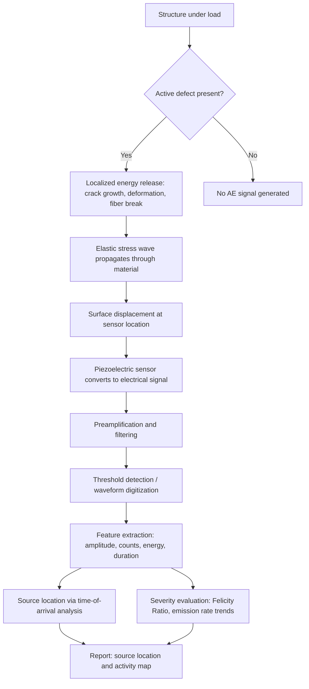

## Acoustic Emission Testing

### Definition and Fundamental Principle

Acoustic Emission (AE) testing is a nondestructive testing (NDT) method that detects transient elastic stress waves generated by the rapid release of energy from localized sources within a material. Unlike most NDT methods (ultrasonic testing, radiography), AE is passive: the material itself generates the signal in response to an external stimulus such as applied load, pressure, or thermal change. The technique does not send energy into the material to probe it; instead, sensors listen for energy the material emits as it deforms or fails.

The core physical principle: when a material undergoes localized irreversible change — crack initiation, crack growth, plastic deformation, fiber breakage, corrosion cracking, or friction/impact events — strain energy stored in the lattice is released suddenly. This releases a burst of elastic energy that propagates through the material as a high-frequency stress wave (typically 20 kHz to 1 MHz), reaching the surface where it produces minute, transient surface displacements (on the order of picometers to nanometers). Piezoelectric sensors convert these displacements into electrical signals for analysis.

### Governing Physics

**Source mechanisms** generating AE signals include:

- Crack initiation and propagation (most significant source in structural monitoring)
- Plastic deformation and dislocation movement
- Twinning in crystalline materials
- Phase transformations
- Fiber breakage and matrix cracking in composites
- Corrosion processes (e.g., hydrogen embrittlement, stress corrosion cracking)
- Fretting, friction, and leakage (fluid/gas escaping through a defect)
- Fracture of inclusions or precipitates

**Wave propagation**: AE waves propagate as a combination of longitudinal (P), shear (S), and surface (Rayleigh) waves, and in thin structures as Lamb waves (symmetric and antisymmetric modes). Because these modes travel at different velocities and disperse differently, the waveform recorded at a sensor is a distorted, attenuated version of the source event, complicated further by reflections and mode conversion at geometric discontinuities.

Wave velocity relates to material elastic properties:

$$c_L = \sqrt{\frac{E(1-\nu)}{\rho(1+\nu)(1-2\nu)}}$$

where $c_L$ is longitudinal wave velocity, $E$ is Young's modulus, $\nu$ is Poisson's ratio, and $\rho$ is density. This relationship underlies source location algorithms, since time-of-flight differences between sensors are converted to distance using measured or assumed wave velocity.

### Signal Characteristics

AE signals are classified into two general types:

**Burst-type (transient) emissions**: Discrete, short-duration pulses associated with individual discontinuous events (a crack jump, a fiber break). Characterized by:

- **Amplitude** — peak signal voltage, usually reported in dB relative to $1 \, \mu V$ at the sensor: $A_{dB} = 20\log_{10}(V/V_{ref})$
- **Rise time** — time from first threshold crossing to peak amplitude
- **Duration** — time from first to last threshold crossing
- **Counts** — number of times the signal crosses a preset threshold
- **Energy** — proportional to the area under the rectified signal envelope
- **Peak frequency / frequency centroid** — from FFT of the waveform

**Continuous emissions**: Sustained signal with no discernible individual peaks, typical of leaks, fluid flow through a crack, or fretting/rubbing sources. Analyzed using RMS voltage or energy rate rather than discrete-event parameters.

### Instrumentation

A typical AE monitoring system comprises:

1. **Sensors** — Piezoelectric transducers (lead zirconate titanate, PZT) that convert surface displacement to voltage. Resonant sensors are tuned to a narrow frequency band for high sensitivity; wideband sensors provide flatter frequency response for waveform-based analysis. Sensors are coupled to the structure using couplant (grease, epoxy) and often held with magnetic hold-downs or adhesive.
2. **Preamplifiers** — Mounted close to the sensor (to minimize noise pickup over cable runs), typically providing 20–60 dB gain, often with built-in bandpass filtering.
3. **Signal conditioning/filtering** — Bandpass filters remove low-frequency mechanical noise (machinery vibration) and high-frequency electromagnetic interference.
4. **Data acquisition system** — Multi-channel systems with threshold detection, waveform digitization (for modern systems, typically 1–10 MHz sampling), and timestamping for source location.
5. **Software** — Extracts hit-based features (amplitude, counts, duration, energy, rise time) and/or performs full waveform capture for advanced signal processing (FFT, wavelet transform, modal analysis).

### Source Location Techniques

**Linear location** (1D): Uses arrival time difference between two sensors along an axis:

$$\Delta x = \frac{c \cdot \Delta t}{2}$$

where $\Delta t$ is the arrival time difference and $c$ is wave velocity, giving source position relative to the sensor midpoint.

**Planar (zonal/triangulation) location** (2D): Requires three or more sensors arranged in a plane. Source coordinates are computed by solving a system of hyperbolic equations based on time-of-arrival differences across sensor pairs — a technique closely related to GPS/TDOA (time difference of arrival) positioning.

**Zonal location**: Simpler alternative when full triangulation isn't feasible — the sensor detecting the earliest/strongest signal defines the zone of the source.

**3D/volumetric location**: Used for large pressure vessels and structures, requiring a sensor array with known geometry and iterative solvers (since the equations are generally overdetermined and nonlinear when more than three sensors are used).

Accurate location depends critically on correct wave velocity input, sensor array geometry, and structural homogeneity (location accuracy degrades near geometric discontinuities, welds, or material transitions where wave velocity changes).

### Testing Methodology

**Load application**: Because AE requires an active source mechanism, testing is typically conducted during controlled loading:

- **Proof/hydrostatic testing** of pressure vessels and storage tanks — AE monitored during pressurization above service pressure
- **Fatigue/cyclic loading** in laboratory structural testing
- **Thermal cycling** for monitoring thermally induced cracking
- **In-service/continuous monitoring** of structures under normal operational loads (bridges, pipelines, cranes)

**Procedure outline**:

1. Sensor array placement based on structure geometry and attenuation characteristics of the material
2. Sensor coupling verification and calibration — typically via pencil-lead break (Hsu-Nielsen source), an artificial AE source used to confirm sensor sensitivity and coupling quality, and to characterize propagation velocity for the specific structure
3. Background noise characterization at zero/low load
4. Threshold setting (fixed or floating, above background noise floor)
5. Load application per test procedure (often following a prescribed load-hold-unload schedule)
6. Real-time monitoring for Kaiser effect violations, cluster formation, and location activity
7. Post-test data analysis and reporting

### Key Diagnostic Phenomena

**Kaiser Effect**: A material subjected to a stress cycle will not emit further AE activity until the previous maximum applied stress is exceeded — i.e., AE is essentially absent during reloading up to a previously reached stress level. This is used to infer the maximum stress previously experienced by a structure (useful in geological and metal fatigue applications).

**Felicity Effect**: The occurrence of measurable AE activity below the previous maximum stress level — a violation of the Kaiser effect. This indicates the presence of significant damage, and is quantified by the **Felicity Ratio**:

$$FR = \frac{\sigma_{AE \, onset}}{\sigma_{previous \, max}}$$

A Felicity Ratio significantly less than 1 is a strong indicator of structural degradation and is a standard acceptance criterion in fiberglass/composite pressure vessel evaluation (per ASME Section X and related codes).

**Emission rate analysis**: Sharp increases in AE hit rate or energy rate with increasing load (rather than a gradual, load-proportional increase) often signal the onset of unstable crack growth.

### Applications in Materials Science and Metallurgy

- **Pressure vessel and pipeline integrity testing** — locating active flaws (cracks, corrosion) under hydrostatic proof pressure, without requiring vessel emptying/entry in many configurations
- **Weld monitoring** — detecting hydrogen-induced cracking during and after welding, since delayed cracking generates AE during cooling
- **Fatigue crack growth monitoring** in laboratory fracture mechanics testing, correlating AE hit rate/energy with crack growth rate ($da/dN$)
- **Composite material testing** — matrix cracking, delamination, and fiber breakage produce distinct AE signatures (fiber breaks typically higher amplitude/frequency than matrix cracking), useful for damage progression studies in aerospace composites
- **Corrosion monitoring** — detecting active stress corrosion cracking (SCC) and hydrogen embrittlement in susceptible alloys
- **Bridge and structural health monitoring** — continuous monitoring of steel bridge components for fatigue crack activity
- **Storage tank floor testing** — detecting active corrosion/leak sources in aboveground storage tank floors (per API 653/AEWG guidelines)
- **Rotating machinery and bearing monitoring** — detecting early-stage spalling and friction-based degradation (an application bordering condition monitoring)

### Advantages

- Global monitoring capability — a sparse sensor array can monitor an entire large structure simultaneously, unlike UT or RT, which examine one location at a time
- Detects active, growing defects specifically — as opposed to static geometric NDT methods that detect all flaws regardless of activity
- Real-time/continuous monitoring feasible
- Sensitive to very small-scale deformation events
- Minimal surface preparation compared to other volumetric NDT methods

### Limitations

- **Qualitative significance, not sizing**: AE indicates that a discontinuity is active and approximately where it is located, but does not directly measure flaw size, depth, or geometry — follow-up with UT, RT, or other sizing methods is standard practice
- **Requires active loading**: A defect that is not growing under the applied stress state produces no signal (a fundamental distinction from methods like UT that detect static geometry)
- **High sensitivity to extraneous noise**: Mechanical rubbing, fluid flow/turbulence, electromagnetic interference, and environmental factors (rain, wind) can generate false AE signals, requiring careful filtering and pattern recognition
- **Attenuation**: Signal amplitude decreases with distance due to geometric spreading, material damping, and scattering at grain boundaries and interfaces, limiting effective sensor spacing (highly material- and geometry-dependent)
- **Result interpretation requires significant expertise** and is influenced by material anisotropy, structural complexity, and coupling variability
- [Inference] Reliable AE-based defect severity grading in complex composite structures is comparatively harder to standardize industry-wide than for simpler geometries such as pressure vessels, given the layered, anisotropic damage modes involved

### Governing Standards

- **ASTM E1316** — Standard Terminology for Nondestructive Examinations (AE definitions)
- **ASTM E650** — Standard Guide for Mounting Piezoelectric AE Sensors
- **ASTM E976** — Standard Guide for Determining the Reproducibility of AE Sensor Response
- **ASME Boiler and Pressure Vessel Code, Section V, Article 12** — AE examination of fiber-reinforced plastic vessels
- **ASME Section X** — AE acceptance criteria for FRP pressure vessels (Felicity Ratio criteria)
- **API 653 Appendix G** — AE testing of aboveground storage tank floors
- **EN 13554** — European standard for general AE testing principles

### Worked Example: Source Location Calculation

Given a linear sensor array with sensor spacing $D = 1.0 \, \text{m}$, measured wave velocity $c = 5000 \, \text{m/s}$ (typical for steel), and an arrival time difference $\Delta t = 60 \, \mu s$ between Sensor 1 and Sensor 2 (Sensor 1 triggers first):

$$\Delta x = \frac{c \cdot \Delta t}{2} = \frac{5000 \times 60 \times 10^{-6}}{2} = 0.15 \, \text{m}$$

The source is located $0.15 \, \text{m}$ from the array midpoint, offset toward Sensor 1 (since it triggered first). This places the source $0.35 \, \text{m}$ from Sensor 1 and $0.65 \, \text{m}$ from Sensor 2 along the array axis.

### Process Flow Diagram

**Related Topics:**

- Ultrasonic Testing (UT) and Phased Array UT — complementary sizing method for AE-located indications
- Fracture Mechanics and Fatigue Crack Growth ($da/dN$ analysis)
- Stress Corrosion Cracking and Hydrogen Embrittlement mechanisms
- Composite Damage Mechanisms (delamination, fiber-matrix debonding)
- Structural Health Monitoring (SHM) systems
- Time Difference of Arrival (TDOA) triangulation algorithms
- ASME Boiler and Pressure Vessel Code, Section V (NDE methods overview)