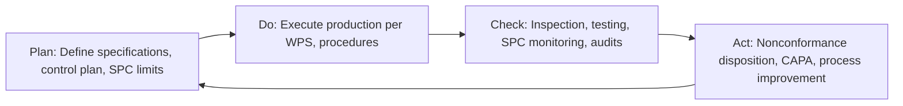

## Quality Management Systems in Materials Production

### Definition and Purpose

A Quality Management System (QMS) is a formalized, documented framework of policies, processes, procedures, and responsibilities used by an organization to ensure that products consistently meet specified requirements and that processes are continually monitored and improved. In materials production and metallurgical operations, a QMS governs everything from raw material procurement and process control through final inspection, testing, and delivery, ensuring traceability and conformance at every stage of the material lifecycle.

The core objective is not merely inspecting finished product for defects, but building quality into the process itself — shifting from reactive detection to proactive prevention.

### Core Principles (ISO 9001 Foundation)

Modern QMS frameworks, particularly those based on ISO 9001, rest on seven management principles:

1. **Customer focus** — meeting and exceeding customer requirements
2. **Leadership** — establishing unity of purpose and direction
3. **Engagement of people** — competent, empowered personnel at all levels
4. **Process approach** — managing activities as interrelated processes forming a coherent system
5. **Improvement** — continual improvement as a permanent organizational objective
6. **Evidence-based decision making** — decisions grounded in data analysis
7. **Relationship management** — managing relationships with suppliers and interested parties

### Governing Standards in Materials and Metallurgical Industries

**ISO 9001** — The generic, sector-agnostic QMS standard. Establishes requirements for a documented QMS including context of the organization, leadership, planning, support, operation, performance evaluation, and improvement (the "Plan-Do-Check-Act" structure embedded in its clause architecture).

**IATF 16949** — Automotive sector-specific QMS standard (built on ISO 9001 with automotive-specific supplemental requirements), heavily used by metal component and materials suppliers to the automotive industry. Adds requirements for production part approval process (PPAP), advanced product quality planning (APQP), and statistical process control.

**AS9100** — Aerospace sector QMS standard, incorporating ISO 9001 plus aerospace-specific requirements including configuration management, risk management, and first article inspection (FAI) — critical for aerospace-grade alloys and structural materials.

**ISO/IEC 17025** — General requirements for the competence of testing and calibration laboratories. Directly relevant to materials testing labs (tensile testing, metallography, chemical analysis) verifying that lab results are valid and traceable.

**API Q1** — Quality management system standard specific to the petroleum and natural gas industry, applied heavily to pipe, casing, and drilling equipment manufacturers.

**NADCAP (National Aerospace and Defense Contractors Accreditation Program)** — Industry-managed accreditation for special processes including heat treatment, welding, non-destructive testing, and materials testing, layered atop a base QMS like AS9100.

**ASME Boiler and Pressure Vessel Code, Section II & IX** — Material specifications and welding qualification requirements that integrate with a facility's QMS for pressure-retaining component manufacture.

### QMS Structure in a Materials Production Context

**1. Document Control**

Controlled procedures, work instructions, specifications, and drawings govern every production step. Revision control ensures personnel always operate from the current approved version. In metallurgical operations this includes chemistry specifications, heat treatment procedures, welding procedure specifications (WPS), and inspection criteria.

**2. Incoming Material Control**

Raw material (ore, scrap, alloying elements, purchased components) is verified against specification before acceptance — via certified mill test reports (MTRs), chemical composition analysis (OES, XRF), and supplier qualification records. Traceability is typically maintained via heat/lot numbers from receipt through final product.

**3. Process Control**

Statistical Process Control (SPC) monitors key process parameters (furnace temperature, casting speed, rolling reduction, cooling rate, heat treatment soak time) in real time to detect drift before out-of-specification product is produced. Control charts (X-bar/R charts, individual/moving range charts) plot process parameters against statistically derived control limits:

$$UCL = \bar{X} + 3\sigma, \quad LCL = \bar{X} - 3\sigma$$

where $\bar{X}$ is the process mean and $\sigma$ is the process standard deviation, defining the range within which the process is considered in statistical control.

**Process capability indices** quantify how well a process meets specification limits:

$$C_{pk} = \min\left(\frac{USL - \bar{X}}{3\sigma}, \frac{\bar{X} - LSL}{3\sigma}\right)$$

A $C_{pk} \geq 1.33$ is a commonly required threshold in automotive and aerospace supply chains, indicating the process is centered and capable relative to specification limits.

**4. Inspection and Testing**

Includes destructive testing (tensile, impact/Charpy, hardness, metallographic examination) and nondestructive testing (UT, RT, MT, PT, AE — see related NDT topics) at defined hold points. Sampling plans (e.g., per ASTM or ANSI/ASQ Z1.4 acceptance sampling) define lot acceptance criteria.

**5. Calibration and Equipment Control**

All measuring and test equipment (hardness testers, load cells, spectrometers, dimensional gauges) must be calibrated on a defined schedule against traceable reference standards (NIST-traceable in the U.S., or equivalent national metrology institutes), per ISO 10012 or ISO/IEC 17025 principles.

**6. Nonconformance Management**

A formal system for identifying, segregating, documenting, and dispositioning nonconforming material — including Material Review Board (MRB) processes common in aerospace and defense, where nonconforming material is evaluated for use-as-is, rework, repair, or scrap.

**7. Corrective and Preventive Action (CAPA)**

Structured root cause analysis (5-Why, fishbone/Ishikawa diagrams, Fault Tree Analysis) applied to nonconformances and customer complaints, driving systemic process correction rather than one-off fixes.

**8. Traceability**

Heat/lot traceability is fundamental in materials production — every unit of finished product must be traceable back to the specific melt/heat, chemical composition, and processing history, critical for failure investigation and recall management.

**9. Internal and External Audits**

Scheduled internal audits verify QMS conformance; third-party certification bodies conduct periodic surveillance and recertification audits (typically 3-year certification cycles with annual surveillance for ISO 9001).

**10. Management Review**

Top management periodically reviews QMS performance data (audit results, customer feedback, process performance, nonconformance trends) to drive continual improvement decisions.

### Statistical and Quality Engineering Tools

- **Six Sigma (DMAIC)** — Define-Measure-Analyze-Improve-Control methodology targeting defect rate reduction, often quantified in defects per million opportunities (DPMO), targeting 3.4 DPMO at a "six sigma" performance level
- **Failure Mode and Effects Analysis (FMEA)** — Systematic identification of potential failure modes in a process or design, ranked by Risk Priority Number (RPN):

$$RPN = S \times O \times D$$

where $S$ = severity, $O$ = occurrence, $D$ = detection (each typically rated 1–10)

- **Advanced Product Quality Planning (APQP)** — Structured product development framework used heavily in automotive supply chains, culminating in Production Part Approval Process (PPAP) submission
- **Poka-yoke (error-proofing)** — Process or fixture design that physically prevents defects from occurring or passing undetected
- **Gauge Repeatability and Reproducibility (Gauge R&R)** — Statistical study quantifying measurement system variation, ensuring that observed process variation reflects true process variation rather than measurement error

### Application to Specific Materials Production Processes

**Steelmaking**: QMS governs scrap/raw material chemistry verification, BOF/EAF process parameter control, ladle metallurgy chemistry adjustment, continuous casting parameter control (mold level, casting speed, secondary cooling), and rolling mill dimensional/mechanical property control — all tied to heat traceability from charge to final coil/billet.

**Casting foundries**: Sand/mold quality control, pouring temperature control, chemistry verification via spectrometer prior to pour, radiographic/UT inspection of castings per ASTM grade acceptance criteria, and heat treatment verification.

**Heat treatment operations**: Furnace uniformity surveys (per AMS 2750, the aerospace pyrometry standard), temperature uniformity classification, and NADCAP accreditation for heat treat as a special process — since heat treatment results cannot be fully verified by end-product inspection alone and depend on controlled process parameters.

**Welding fabrication**: Welding Procedure Specifications (WPS) qualified per ASME Section IX or AWS D1.1, welder performance qualification records, and in-process/final NDT per project-specific acceptance criteria.

**Additive manufacturing of metals**: An emerging QMS challenge — since traditional bulk-material qualification approaches don't directly map to layer-by-layer processes; standards such as **AMS7003**, **ASTM F3049**, and **ISO/ASTM 52920** address powder feedstock control, in-process monitoring (melt pool monitoring, thermal imaging), and process parameter qualification specific to AM. [Inference] The relative immaturity of AM-specific process qualification standards compared to conventional wrought/cast material standards means many aerospace and medical device producers still rely heavily on statistically extensive first-article and witness testing to supplement standard QMS process control.

### PDCA Cycle in Materials Quality Context

### Benefits

- Reduced scrap, rework, and warranty costs through defect prevention rather than detection
- Improved customer confidence and market access (many OEMs mandate certified QMS as a supplier qualification prerequisite)
- Enhanced traceability, enabling rapid and targeted response to field failures or recalls
- Data-driven process optimization through SPC and capability analysis
- Regulatory and legal risk mitigation, particularly in pressure equipment, aerospace, and medical device supply chains

### Limitations and Challenges

- Implementation and certification maintenance carry significant administrative and audit overhead
- Risk of "compliance theater" — documentation satisfying audit requirements without genuinely driving process improvement, if organizational culture treats QMS as a checkbox exercise rather than an operating philosophy
- SPC effectiveness depends on measurement system capability (Gauge R&R); poor measurement systems can mask real process variation or create false alarms
- Integrating QMS requirements across complex, multi-tier supply chains (common in metals industries with extensive subcontracted processing) requires significant coordination and flow-down of requirements
- [Inference] Smaller materials producers may face disproportionate cost burden in achieving and maintaining sector-specific certifications (e.g., NADCAP, AS9100) relative to their production volume, compared to large-scale integrated producers

**Next Steps:**

- ISO 9001 Clause Structure and Process Approach
- Statistical Process Control (SPC) and Control Chart Interpretation
- Nondestructive Testing Methods (UT, RT, MT, PT, AE) as QMS Inspection Tools
- Material Traceability and Heat/Lot Numbering Systems
- Failure Mode and Effects Analysis (FMEA) in Process Design
- NADCAP Special Process Accreditation
- Welding Procedure Qualification per ASME Section IX