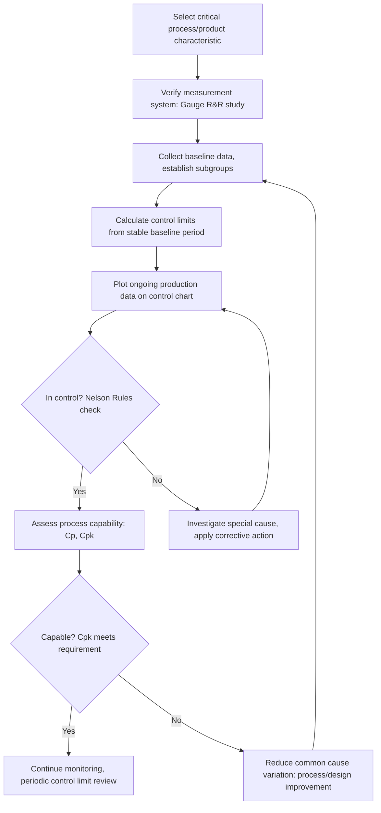

## Statistical Process Control for Materials Quality

### Definition and Purpose

Statistical Process Control (SPC) is a quality management methodology that uses statistical methods to monitor, control, and improve a production process by analyzing process data over time. Rather than relying solely on inspecting finished product for defects, SPC monitors the process itself, distinguishing between natural, inherent process variation and variation caused by identifiable, correctable factors. In materials production, SPC is applied to control parameters such as chemical composition, dimensional tolerances, mechanical properties, and thermal processing parameters, enabling detection of process drift before out-of-specification product is generated.

The foundational premise, established by Walter Shewhart in the 1920s, is that all processes exhibit variation, and that variation falls into two categories requiring fundamentally different management responses.

### Common Cause vs. Special Cause Variation

**Common cause (chance) variation**: Inherent, random variation always present in a process due to the cumulative effect of many small, unavoidable factors (minor equipment vibration, ambient temperature fluctuation, material micro-heterogeneity). A process exhibiting only common cause variation is considered **statistically stable** or **in control** — predictable within known limits, though not necessarily meeting specification.

**Special cause (assignable) variation**: Variation from an identifiable, non-random source — tool wear, equipment malfunction, operator error, a raw material lot change, furnace calibration drift. A process exhibiting special cause variation is **out of control** — unpredictable, and requires investigation and correction rather than statistical adjustment.

A critical distinction: a process can be **in statistical control** (stable, predictable) while still producing product **out of specification**, if the natural process variation is wider than the tolerance band. Conversely, a process can be **out of control** yet still produce conforming product by chance. SPC addresses process stability; capability analysis (below) addresses whether the stable process actually meets requirements.

### Control Charts

Control charts are the primary SPC tool, plotting a process parameter over time against statistically derived control limits.

**Standard control limits** are set at $\pm 3\sigma$ from the process mean, based on the empirical rule that approximately 99.73% of data from a normally distributed, stable process falls within this range:

$$UCL = \bar{X} + 3\sigma, \quad CL = \bar{X}, \quad LCL = \bar{X} - 3\sigma$$

where $UCL$ = upper control limit, $LCL$ = lower control limit, $CL$ = center line (process mean), and $\sigma$ = process standard deviation (estimated from within-subgroup variation, not simple population standard deviation).

**Variables control charts** (for continuous, measurable data — e.g., tensile strength, wall thickness, carbon content):

- **X-bar and R chart**: Tracks subgroup mean ($\bar{X}$) and subgroup range ($R$) for subgroup sizes typically 2–10. The R chart is evaluated first (since $\bar{X}$ chart limits depend on within-subgroup variation being in control); if R is in control, the $\bar{X}$ chart is interpreted.
- **X-bar and S chart**: Uses subgroup standard deviation ($S$) instead of range; more statistically efficient for larger subgroup sizes ($n > 10$)
- **Individual and Moving Range (I-MR) chart**: Used when data is collected one unit at a time (e.g., single heat chemistry results, low-volume production), tracking individual values and the moving range between consecutive points

**Attributes control charts** (for count/categorical data — e.g., number of defective castings per lot, surface defect counts):

- **p-chart**: Proportion nonconforming in a variable subgroup size
- **np-chart**: Number nonconforming in a fixed subgroup size
- **c-chart**: Count of defects in a fixed inspection unit (e.g., number of porosity indications per casting)
- **u-chart**: Defects per unit in a variable inspection unit size

### Out-of-Control Signals (Western Electric / Nelson Rules)

Beyond a single point exceeding $\pm 3\sigma$, additional pattern-based rules detect non-random behavior indicating special cause variation, commonly codified as the Nelson Rules or Western Electric Rules:

1. One point beyond $3\sigma$ from centerline
2. Nine consecutive points on the same side of the centerline
3. Six consecutive points steadily increasing or decreasing (trend)
4. Fourteen consecutive points alternating up and down
5. Two of three consecutive points beyond $2\sigma$ (same side)
6. Four of five consecutive points beyond $1\sigma$ (same side)
7. Fifteen consecutive points within $1\sigma$ of centerline (indicates reduced variation — may signal a measurement system issue or an overly tight subgrouping)
8. Eight consecutive points beyond $1\sigma$ on both sides with none within $1\sigma$

These rules detect shifts, trends, and cyclical patterns that a simple control-limit-exceedance check would miss, extending SPC's sensitivity to subtler forms of process drift.

### Process Capability Analysis

Once a process is demonstrated to be in statistical control, capability indices quantify how well the process output fits within specification limits.

**$C_p$ (potential capability)**: Compares the spread of specification limits to process spread, assuming the process is centered:

$$C_p = \frac{USL - LSL}{6\sigma}$$

**$C_{pk}$ (actual capability)**: Accounts for process centering relative to specification limits — the more meaningful real-world metric, since it penalizes a process that is narrow but off-center:

$$C_{pk} = \min\left(\frac{USL - \bar{X}}{3\sigma}, \frac{\bar{X} - LSL}{3\sigma}\right)$$

**Interpretation guidelines** (widely used, though acceptance thresholds vary by industry and contract requirements):

- $C_{pk} < 1.0$: Process not capable; produces out-of-spec product even when centered and in control
- $C_{pk} = 1.33$: Commonly required minimum in automotive/aerospace supply chains (equivalent to roughly a 4σ process)
- $C_{pk} \geq 1.67$: High capability, often required for critical safety characteristics
- $C_{pk} \geq 2.0$: "Six Sigma" capability level

**$P_p$/$P_{pk}$** (performance indices) use overall (long-term) standard deviation across all data rather than within-subgroup (short-term) standard deviation used for $C_p$/$C_{pk}$, capturing both common and special cause variation — useful for assessing total realized process performance rather than potential capability.

### Prerequisite: Measurement System Analysis (Gauge R&R)

SPC validity depends entirely on the measurement system used to generate the data. A **Gauge Repeatability and Reproducibility (Gauge R&R)** study decomposes total observed variation into:

$$\sigma^2_{total} = \sigma^2_{part} + \sigma^2_{repeatability} + \sigma^2_{reproducibility}$$

where repeatability is variation from the same operator measuring the same part repeatedly (equipment variation), and reproducibility is variation between different operators measuring the same part (operator variation). A measurement system consuming too large a fraction of total observed variation (commonly a threshold of %R&R < 10% "acceptable," 10–30% "marginal," >30% "unacceptable" is applied) can mask true process variation or generate false out-of-control signals, undermining SPC conclusions entirely.

### Application to Materials Production Processes

**Chemical composition control**: SPC applied to spectrometer (OES/XRF) readings of alloying element content during steelmaking, aluminum smelting, or alloy casting — tracking carbon, manganese, chromium, or other critical elements against specification bands, with control charts flagging ladle-to-ladle drift before it produces off-chemistry heats.

**Dimensional control**: Rolling mill gauge control (strip/plate thickness), extrusion cross-section dimensions, and forging dimensional tolerances monitored via X-bar/R charts on in-line or periodic sampling measurements.

**Mechanical property control**: Tensile strength, yield strength, elongation, and hardness test results from production lots tracked via control charts to detect drift in heat treatment effectiveness or alloy chemistry consistency over time.

**Thermal process parameters**: Furnace temperature uniformity, quench delay time, tempering soak time, and cooling rate monitored as process parameters correlating directly to resulting mechanical properties — often the earliest-available signal of an impending out-of-spec condition, since these parameters can be monitored continuously in-process rather than only via destructive post-process testing.

**Casting and welding defect rates**: Attributes charts (c-chart, u-chart) tracking porosity counts, inclusion counts, or weld defect rates per unit area/length across production lots, feeding into process improvement initiatives.

**Surface finish and coating thickness**: Variables charts applied to galvanizing thickness, plating thickness, or surface roughness measurements in continuous coating lines.

### SPC Implementation Workflow

### Relationship to Broader Quality Systems

SPC functions as the real-time monitoring engine within a broader Quality Management System (ISO 9001, IATF 16949, AS9100): while the QMS defines the overall framework of procedures, responsibilities, and documentation, SPC provides the quantitative, ongoing evidence that processes are operating predictably and capably, directly supporting the "evidence-based decision making" principle central to modern quality frameworks. IATF 16949 (automotive) and AS9100 (aerospace) both mandate formal SPC application to identified critical characteristics as part of Advanced Product Quality Planning (APQP) and control plan requirements.

### Advantages

- Enables early detection of process drift before nonconforming product is produced, reducing scrap and rework versus end-of-line inspection alone
- Distinguishes between variation requiring process-level investigation (special cause) and variation requiring fundamental process/design change (common cause), directing improvement effort appropriately
- Provides objective, data-driven evidence for process capability claims to customers and auditors
- Reduces reliance on 100% inspection by demonstrating statistically justified process reliability

### Limitations

- Requires a sufficiently large and representative dataset to establish valid control limits; premature limit-setting on limited data can produce unreliable charts
- Assumes approximate normality of underlying data for many standard chart types and control limit calculations; non-normal distributions (common in some defect-count or skewed dimensional data) require transformation or alternative chart types
- Only as reliable as the underlying measurement system (see Gauge R&R above) — poor measurement systems undermine the validity of all downstream SPC conclusions
- Effective implementation requires organizational discipline in data collection consistency, subgroup rationality, and response to out-of-control signals; SPC charts maintained without genuine investigation of flagged signals provide limited practical value
- [Inference] In lower-volume or highly customized materials production (e.g., specialty alloy small-batch casting), the statistical basis for control limits may be less robust than in high-volume continuous processes, given smaller available sample sizes per process configuration

**Related Topics:**

- Process Capability Analysis and Six Sigma Methodology
- Gauge Repeatability and Reproducibility (Gauge R&R) Studies
- Quality Management Systems in Materials Production (ISO 9001, IATF 16949, AS9100)
- Design of Experiments (DOE) for Process Optimization
- Advanced Product Quality Planning (APQP) and Control Plans
- Acceptance Sampling (ANSI/ASQ Z1.4)
- Failure Mode and Effects Analysis (FMEA)