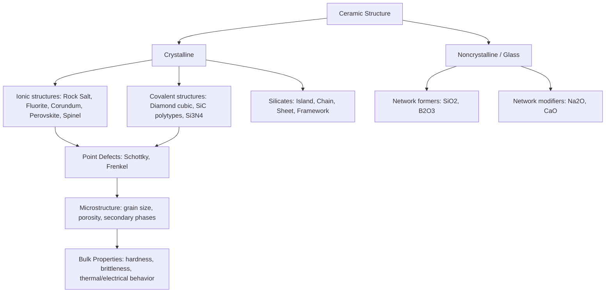

## Structure of Ceramic Materials

### Definition and Bonding Character

Ceramic materials are inorganic, nonmetallic solids composed of metallic and nonmetallic elements bonded primarily through ionic and/or covalent bonding, in contrast to the metallic bonding characteristic of metals. This bonding character fundamentally determines ceramic properties: high hardness, high melting points, low electrical and thermal conductivity, brittleness, and chemical stability. The degree of ionic versus covalent character in a given ceramic bond can be estimated from the electronegativity difference between constituent atoms, using Pauling's relationship:

$$\%\text{Ionic Character} = \left(1 - e^{-0.25(X_A - X_B)^2}\right) \times 100$$

where $X_A$ and $X_B$ are the electronegativities of the two bonded elements. Materials like MgO (large electronegativity difference) are predominantly ionic; materials like SiC (smaller difference) exhibit substantial covalent character.

### Crystal Structures of Ionic Ceramics

Ionic ceramic structures are governed primarily by two factors: maintaining electrical neutrality (stoichiometric charge balance) and geometric packing efficiency, the latter described by the **radius ratio rule**, which predicts coordination number based on the ratio of cation to anion radii ($r_C/r_A$):

| Radius Ratio ($r_C/r_A$) | Coordination Number | Geometry |
| --- | --- | --- |
| 0.155–0.225 | 3 | Triangular |
| 0.225–0.414 | 4 | Tetrahedral |
| 0.414–0.732 | 6 | Octahedral |
| 0.732–1.000 | 8 | Cubic |

**Common ionic ceramic crystal structures:**

**Rock Salt (NaCl-type) structure** — Cation and anion each form interpenetrating FCC sublattices, coordination number 6:6. Adopted by MgO, CaO, FeO, and NiO — technologically important refractory oxides.

**Cesium Chloride (CsCl-type) structure** — Simple cubic arrangement with coordination number 8:8, requiring a radius ratio near unity.

**Zinc Blende (Sphalerite) structure** — FCC anion sublattice with cations occupying half the tetrahedral interstitial sites, coordination number 4:4. Adopted by ZnS and SiC (in its cubic β-polytype), reflecting higher covalent bonding character.

**Fluorite (CaF₂-type) structure** — Cations form an FCC sublattice; anions occupy all tetrahedral sites, giving coordination 8:4 (cation:anion). Adopted by $UO_2$ (nuclear fuel ceramic), $ZrO_2$ (in cubic stabilized form), and $ThO_2$.

**Corundum ($Al_2O_3$) structure** — Oxygen ions form a hexagonal close-packed (HCP) arrangement with $Al^{3+}$ cations occupying two-thirds of the octahedral interstitial sites in an ordered pattern. This is the structure of alumina, one of the most widely used structural and refractory ceramics.

**Perovskite ($ABO_3$) structure** — Cubic structure with a large cation ($A$) at cube corners, a smaller cation ($B$) at the body center in octahedral coordination with oxygen, and oxygen at face centers. Adopted by $BaTiO_3$ (ferroelectric/piezoelectric applications) and $CaTiO_3$; technologically critical for electronic ceramics.

**Spinel ($AB_2O_4$) structure** — Oxygen forms an FCC sublattice; divalent cations occupy tetrahedral sites and trivalent cations occupy octahedral sites (normal spinel), or with site inversion (inverse spinel, as in magnetite $Fe_3O_4$). Important for magnetic ceramics (ferrites).

### Covalent Ceramic Structures

Covalently bonded ceramics adopt structures dictated by directional bonding requirements rather than simple ionic packing rules.

**Diamond cubic structure** — Each atom tetrahedrally coordinated to four neighbors via $sp^3$ hybridized covalent bonds. Adopted by diamond itself and, in a related form, silicon and germanium.

**Silicon carbide (SiC)** — Exists in numerous polytypes (over 250 identified), all built from $SiC_4$ tetrahedra but differing in stacking sequence: cubic β-SiC (zinc blende-type, 3C polytype) and multiple hexagonal/rhombohedral α-SiC polytypes (4H, 6H common). Polytype controls electronic and thermal properties, relevant to SiC's use in both structural ceramics and semiconductor applications.

**Silicon nitride ($Si_3N_4$)** — Built from $SiN_4$ tetrahedra, exists in α and β hexagonal polytypes; elongated β-phase grains provide crack-deflection toughening mechanisms exploited in structural ceramic engineering.

### Silicate Structures

Silicates, the most abundant ceramic/mineral class in the Earth's crust, are built from the fundamental $SiO_4^{4-}$ tetrahedron (silicon covalently/ionically bonded to four oxygen atoms at tetrahedron corners). Silicate structural classification is based on the degree of tetrahedral sharing:

- **Island (nesosilicate)** — Isolated $SiO_4$ tetrahedra linked only through intervening cations (e.g., forsterite, $Mg_2SiO_4$)
- **Chain (inosilicate)** — Tetrahedra share corners forming single or double chains (pyroxenes, amphiboles)
- **Sheet (phyllosilicate)** — Tetrahedra share three corners forming continuous 2D sheets (clays, micas, kaolinite) — structurally central to traditional/whiteware ceramics and clay-based processing
- **Framework (tectosilicate)** — All four corners shared, forming a fully connected 3D network (quartz, feldspar)

Amorphous silica-based glass forms when the $SiO_4$ tetrahedral network lacks long-range periodic order — the network former concept central to glass structure (see below).

### Noncrystalline (Glass) Structure

Glass is a noncrystalline (amorphous) solid, typically formed by cooling a melt fast enough to bypass crystallization, resulting in a disordered atomic arrangement that retains short-range order (local coordination, e.g., $SiO_4$ tetrahedra) but lacks long-range periodicity.

**Zachariasen's random network theory** classifies glass-forming oxides by role:

- **Network formers** — Cations forming strong, directional bonds with oxygen in coordination polyhedra that link into a continuous disordered 3D network (e.g., $SiO_2$, $B_2O_3$, $GeO_2$, $P_2O_5$)
- **Network modifiers** — Cations (typically alkali/alkaline earth, e.g., $Na^+$, $Ca^{2+}$) that break the network's bridging oxygen bonds, creating non-bridging oxygens and lowering melt viscosity and processing temperature
- **Intermediates** — Cations (e.g., $Al^{3+}$) that can substitute into network-former positions under certain conditions but cannot form a glass network alone

The glass transition is characterized by the glass transition temperature ($T_g$), below which the supercooled liquid becomes a rigid glass without a discontinuous first-order phase transition (unlike crystallization), marked by a change in slope of the specific volume/temperature curve rather than a step discontinuity.

### Defects in Ceramic Structures

Point defects in ceramics must satisfy charge neutrality, leading to defects occurring in compensating pairs rather than isolated defects (unlike metals, where a single vacancy is charge-neutral):

**Schottky defect** — A cation vacancy and anion vacancy pair, maintaining stoichiometry and neutrality, common in rock-salt structure ceramics like MgO.

**Frenkel defect** — A cation (or less commonly anion, given typical relative ionic sizes) displaced from its normal lattice site to an interstitial position, leaving a vacancy behind — a self-compensating pair within the same sublattice.

**Nonstoichiometry**: Some ceramics, particularly transition metal oxides (e.g., $FeO$, $Fe_{1-x}O$), exhibit deviation from ideal stoichiometry accommodated by variable cation valence states (e.g., mixed $Fe^{2+}/Fe^{3+}$) rather than simple point defect pairs, directly affecting electrical and magnetic properties.

**Solid solutions**: Substitutional (e.g., $Al^{3+}$ substituting for $Cr^{3+}$ in $Al_2O_3$-$Cr_2O_3$ forming ruby-related solid solutions) and interstitial solid solutions occur in ceramics analogous to metallic alloys, subject to charge compensation requirements when substituting ions differ in valence.

### Microstructural Features

Beyond crystal structure, the polycrystalline microstructure governs bulk mechanical and functional behavior:

- **Grain size and grain boundaries** — Ceramic strength often follows Hall-Petch-type grain size dependence; grain boundaries also serve as fast-diffusion paths and can be sites of impurity segregation affecting high-temperature behavior
- **Porosity** — A dominant factor in ceramic mechanical properties given processing via powder consolidation and sintering; elastic modulus and strength both decrease strongly with increasing porosity fraction, commonly modeled with relationships such as $E = E_0(1 - 1.9P + 0.9P^2)$ for modulus as a function of porosity fraction $P$ (empirical form; specific coefficients are material-dependent) [Inference, since exact empirical coefficients vary by ceramic system and are reported differently across sources]
- **Secondary/grain boundary phases** — Often present from sintering aids (e.g., glassy phases from $MgO$ additions in alumina, or from liquid-phase sintering aids in silicon nitride), significantly affecting high-temperature creep resistance and fracture behavior

### Structure-Property Relationships

The ionic/covalent bonding and resulting crystal structures directly explain characteristic ceramic behavior:

- **Brittleness**: Directional covalent bonds and the requirement to maintain charge neutrality during ionic bond breaking severely restrict dislocation glide systems compared to metals, leading to limited plasticity and brittle fracture
- **High hardness and melting point**: Strong ionic/covalent bonds require substantial energy to break, correlating with high lattice energy, hardness, and melting temperature
- **Low electrical conductivity**: Electrons are localized in ionic or covalent bonds rather than delocalized as in metallic bonding (exceptions exist — certain oxide ceramics and doped ceramics exhibit semiconducting or even superconducting behavior)
- **Chemical and thermal stability**: High bond strength and typically already-oxidized/stable constituent elements confer resistance to further oxidation and chemical attack

### Structural Hierarchy Diagram

**Related Topics:**

- Ceramic Powder Processing and Sintering Mechanisms
- Mechanical Behavior and Fracture Toughness of Ceramics
- Phase Diagrams for Ceramic Systems (e.g., $Al_2O_3$-$SiO_2$)
- Glass Formation and the Glass Transition
- Advanced Structural Ceramics ($Si_3N_4$, SiC, $ZrO_2$ toughening mechanisms)
- Electronic and Functional Ceramics (Perovskites, Ferrites)
- Point Defect Chemistry and Nonstoichiometry in Oxides