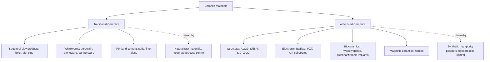

## Traditional versus Advanced Ceramics

### Definition and Classification Basis

Ceramic materials are broadly divided into two categories based on raw material source, processing sophistication, microstructural control, and application domain: **traditional ceramics**, derived from naturally occurring raw materials (primarily clay-based silicates) using long-established processing routes, and **advanced ceramics** (also termed technical, engineering, or fine ceramics), synthesized from highly purified or synthetic compounds with tightly controlled composition and microstructure for demanding structural, electronic, or functional applications. The distinction reflects both historical development and a fundamental difference in the degree of engineering control exercised over composition, particle size, and microstructure.

### Traditional Ceramics

**Raw material basis**: Primarily natural clay minerals (kaolinite, illite, montmorillonite), feldspar, and silica sand — abundant, relatively low-cost, naturally occurring materials requiring comparatively modest beneficiation before use.

**Characteristic composition**: Complex, often variable multi-component silicate systems, typically within the $SiO_2$-$Al_2O_3$ system with flux additions (feldspar) and other natural impurities, rather than single-phase pure compounds.

**Microstructure**: Coarser grain size, higher and less-controlled porosity levels, and multi-phase microstructures including glassy phases formed from flux melting during firing. Grain size and pore distribution are generally not tightly specified or controlled compared to advanced ceramics.

**Processing route**: Plastic forming methods exploiting clay's natural plasticity when mixed with water — throwing, jiggering, extrusion, slip casting — followed by drying and firing (sintering) in kilns at moderate temperatures (typically 900–1300°C depending on composition), often with a fluxing glassy phase that promotes liquid-phase sintering at comparatively lower temperatures than pure oxide/nonoxide ceramics require.

**Representative products and applications**:

- **Structural clay products** — brick, roofing tile, drain pipe, sewer pipe
- **Whitewares** — porcelain, china, stoneware, earthenware (tableware and sanitaryware)
- **Refractories** (some traditional refractories, e.g., fireclay brick, though advanced refractories also exist)
- **Portland cement and concrete** — often classified within or adjacent to traditional ceramics given natural raw material basis and hydraulic/pozzolanic reaction processing
- **Glass** (soda-lime glass, container and flat glass) — though glass composition control has advanced considerably, conventional commercial glass is generally grouped with traditional ceramic processing given its natural raw material basis (silica sand, soda ash, limestone)
- **Abrasives** (natural abrasives; note that synthetic abrasives like fused alumina and SiC cross into advanced ceramic territory)

**Property profile**: Generally lower strength, lower and less predictable fracture toughness, higher porosity, and greater property variability lot-to-lot compared to advanced ceramics — acceptable given the property demands of their applications (structural/architectural, tableware, general refractory service) do not require the tight tolerances of structural or electronic engineering applications.

### Advanced Ceramics

**Raw material basis**: Highly purified, often synthetically produced powders — single-phase oxides ($Al_2O_3$, $ZrO_2$, $MgO$), carbides ($SiC$, $B_4C$, $WC$), nitrides ($Si_3N_4$, $AlN$, $BN$), and other engineered compounds, frequently produced via chemical synthesis routes (sol-gel processing, chemical vapor synthesis, precipitation) to achieve high purity and controlled, often submicron or nanoscale, particle size.

**Characteristic composition**: Tightly specified, often near-stoichiometric single-phase or deliberately engineered multi-phase compositions, with dopants and sintering aids added in precisely controlled quantities to achieve targeted microstructural and property outcomes (e.g., $Y_2O_3$-stabilized $ZrO_2$, $MgO$-doped $Al_2O_3$).

**Microstructure**: Fine, controlled grain size (frequently submicron), minimized and controlled porosity (often <1–2% for high-performance structural ceramics), and engineered secondary phases (e.g., elongated β-$Si_3N_4$ grains for toughening, or controlled grain-boundary glassy phase composition for high-temperature creep resistance).

**Processing route**: Sophisticated powder processing techniques including precisely controlled particle size distribution, advanced forming methods (dry pressing, isostatic pressing, tape casting, injection molding, additive manufacturing), and specialized densification techniques — pressureless sintering, hot pressing, hot isostatic pressing (HIP), spark plasma sintering (SPS) — often at significantly higher temperatures (1400–2000°C+ for many nonoxide ceramics) and under controlled atmospheres to prevent oxidation or achieve target stoichiometry.

**Representative categories and applications**:

- **Structural ceramics** — $Al_2O_3$, $Si_3N_4$, SiC, $ZrO_2$ (including transformation-toughened zirconia) used in cutting tools, bearings, engine components, armor, and wear-resistant parts, exploiting high hardness, wear resistance, and (in toughened systems) improved fracture toughness relative to traditional ceramics
- **Electronic ceramics** — $BaTiO_3$-based dielectrics (capacitors), $Al_2O_3$ and $AlN$ substrates (electronic packaging), piezoelectric ceramics (lead zirconate titanate, PZT, for actuators/sensors), and varistors ($ZnO$-based)
- **Bioceramics** — hydroxyapatite and other calcium phosphate ceramics for bone grafts/implants, alumina and zirconia for hip joint components, exploiting biocompatibility alongside mechanical performance
- **Magnetic ceramics** — spinel and garnet ferrites for transformer cores, magnetic recording media, and microwave devices
- **Advanced refractories** — high-purity magnesia, zirconia, and spinel-based refractories for demanding furnace and reactor lining applications exceeding traditional fireclay/silica refractory capability
- **Nuclear ceramics** — $UO_2$ fuel pellets, exploiting the fluorite structure's radiation tolerance and high melting point
- **Cutting tool and abrasive ceramics** — synthetic fused alumina, silicon carbide, cubic boron nitride, and polycrystalline diamond-based tooling

**Property profile**: Substantially higher and more consistent strength, improved (though still limited relative to metals) fracture toughness in engineered systems, tailored electrical/magnetic/optical functional properties, and tighter dimensional and property tolerances suited to demanding engineering service.

### Comparative Summary

| Characteristic | Traditional Ceramics | Advanced Ceramics |
| --- | --- | --- |
| Raw materials | Natural clay, feldspar, silica | Synthetic, high-purity powders |
| Composition control | Variable, multi-component | Tightly specified, often near-stoichiometric |
| Grain size | Coarse, less controlled | Fine, often submicron, tightly controlled |
| Porosity | Higher, variable | Minimized, tightly controlled (<1–2% typical) |
| Forming methods | Plastic forming (throwing, extrusion, slip casting) | Dry/isostatic pressing, tape casting, injection molding, AM |
| Densification | Kiln firing, moderate temperature | Pressureless sintering, hot pressing, HIP, SPS; often higher temperature |
| Property consistency | Moderate, batch-variable | High, tightly toleranced |
| Typical strength/toughness | Lower | Significantly higher (though still limited vs. metals) |
| Cost | Generally lower | Generally higher (raw material purity, processing complexity) |
| Representative examples | Brick, porcelain, sanitaryware, soda-lime glass | $Al_2O_3$, $Si_3N_4$, SiC, PZT, hydroxyapatite bioceramics |

### Processing Complexity as the Underlying Driver

The traditional/advanced distinction is fundamentally a consequence of the processing control required to achieve the target microstructure. Traditional ceramic processing exploits clay's natural plasticity and readily available fluxing agents to achieve adequate (not optimized) densification at moderate cost and temperature. Advanced ceramic processing instead invests heavily in raw material purification, particle size engineering, and controlled-atmosphere high-temperature densification specifically to eliminate the porosity, impurity phases, and grain-size variability that limit traditional ceramic mechanical and functional performance. This is why advanced ceramic components command substantially higher cost per unit mass despite often chemically simpler compositions than traditional multi-component silicate systems.

### Category Relationship Diagram

**Related Topics:**

- Structure of Ceramic Materials (crystal structures underlying both categories)
- Ceramic Powder Synthesis and Processing (sol-gel, precipitation, CVS)
- Sintering Mechanisms and Densification Techniques (HIP, SPS)
- Transformation Toughening in Zirconia Ceramics
- Bioceramics and Biocompatibility Requirements
- Electronic and Piezoelectric Ceramic Applications
- Refractory Materials for High-Temperature Service