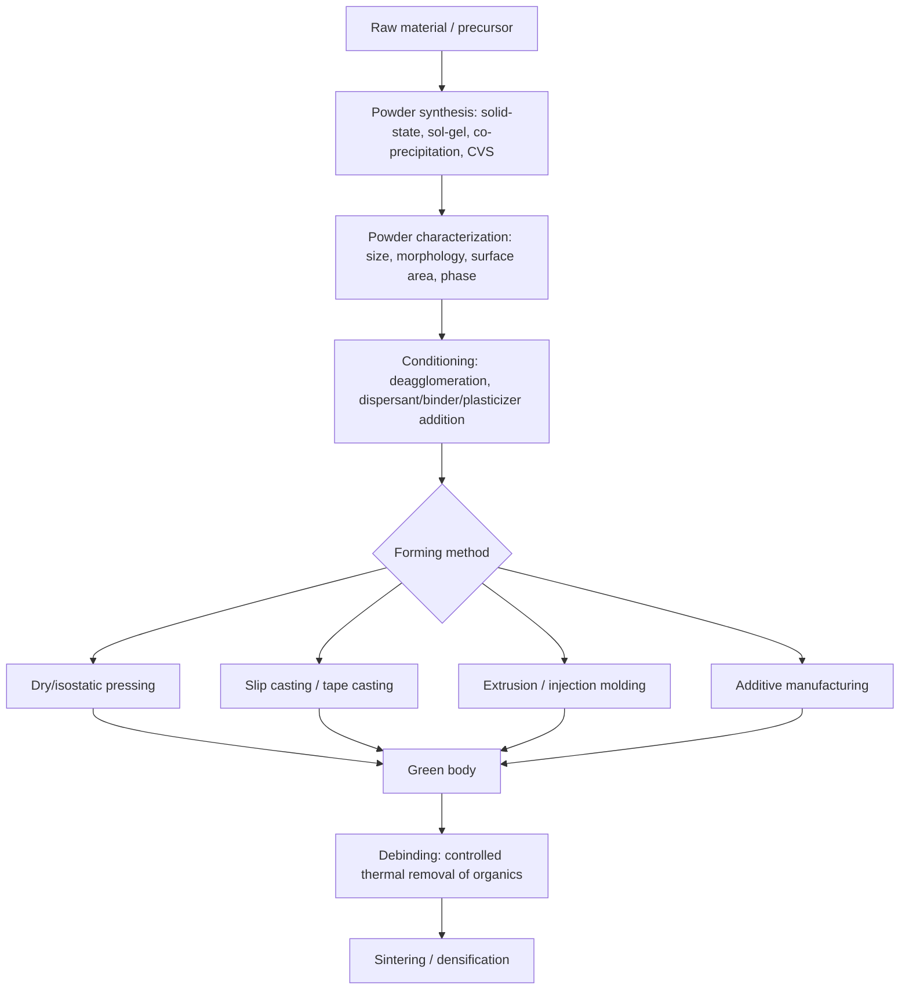

## Ceramic Powder Processing

### Definition and Role in Ceramic Manufacturing

Ceramic powder processing encompasses the sequence of operations that transform raw or synthesized ceramic powders into a green (unfired) body with the composition, particle packing, and shape necessary to achieve target microstructure and properties after densification. Because ceramics generally cannot be melted and cast economically at production scale (given their high melting points and brittleness upon solidification) as most metals are, the overwhelming majority of ceramic components are produced via powder-based routes: powder synthesis, powder characterization and conditioning, forming (shaping), and sintering (densification). The quality of every downstream step is fundamentally constrained by decisions made during powder processing — a poorly processed powder cannot be fully corrected by even optimal sintering.

### Powder Synthesis Methods

**Mechanical (top-down) methods**:

- **Comminution/milling** — Reduction of coarser raw material to powder via ball milling, attrition milling, or jet milling. Widely used for traditional ceramic raw materials (clay, feldspar, silica) and for reducing synthesized advanced ceramic powders to target particle size. Introduces risk of milling media contamination (addressed via wear-resistant media matched to or compatible with the target composition).

**Chemical (bottom-up) methods** — generally preferred for advanced ceramics requiring high purity, fine particle size, and narrow size distribution:

- **Solid-state reaction/calcination** — Mixing and heating solid precursor compounds (often carbonates or oxides) below melting point to drive a solid-state reaction forming the target compound, followed by milling to break up agglomerates. Common for producing electronic ceramic powders such as $BaTiO_3$.
- **Sol-gel processing** — Hydrolysis and condensation of metal alkoxide or metal salt precursors in solution, forming a colloidal sol that transitions to a gel network, subsequently dried and calcined. Produces very fine, high-purity, often nanoscale powder with excellent chemical homogeneity, particularly valuable for multi-component oxide ceramics where achieving atomic-scale mixing by solid-state methods is difficult.
- **Co-precipitation** — Simultaneous precipitation of multiple cation species from a mixed solution (via pH adjustment or precipitating agent addition) to achieve intimate chemical mixing at the molecular level prior to calcination, improving compositional homogeneity over solid-state mixing.
- **Hydrothermal synthesis** — Reaction of precursors in aqueous solution under elevated temperature and pressure (typically in an autoclave), enabling direct crystallization of fine, often single-crystal powder particles without a separate calcination step, useful for producing well-crystallized fine powders such as hydrothermal $BaTiO_3$ or zirconia.
- **Chemical vapor synthesis (CVS)/gas-phase synthesis** — Vapor-phase reaction (e.g., of metal halides with oxygen or ammonia) producing extremely fine, often nanoscale powder via homogeneous gas-phase nucleation, used for high-purity powders such as fumed silica and some nitride/carbide powders.
- **Spray pyrolysis** — Atomization of a precursor solution into a heated reaction zone, where droplet evaporation and precursor decomposition occur nearly simultaneously, producing spherical, often hollow or dense particles with controlled size.

### Powder Characterization

Critical powder attributes governing subsequent processing and final microstructure:

**Particle size and size distribution** — Measured via laser diffraction, sedimentation, or (for finer powders) dynamic light scattering or BET surface area analysis. Finer particle size promotes higher sintering driving force (see sintering discussion below) but increases agglomeration tendency and handling difficulty.

**Particle shape and morphology** — Equiaxed, platy, or acicular (needle-like) morphology affects packing behavior and green density; characterized via SEM imaging.

**Specific surface area** — Typically measured via BET (Brunauer-Emmett-Teller) gas adsorption; directly related to sintering activity, since sintering driving force scales with surface energy reduction, itself a function of surface area.

**Agglomeration state** — Distinguishing **soft agglomerates** (weakly bonded, dispersible via mechanical or chemical deagglomeration) from **hard agglomerates** (strongly bonded, often via necking during synthesis/calcination, resistant to breakdown) is critical, since hard agglomerates sinter as discrete units, producing differential densification and residual porosity/flaws in the final microstructure that cannot be eliminated by extended firing.

**Phase purity and crystallinity** — Verified via X-ray diffraction (XRD), particularly important where polymorphic transformations (e.g., $ZrO_2$ monoclinic/tetragonal/cubic) affect processing behavior and final properties.

### Powder Conditioning and Additive Systems

Raw synthesized or milled powder is rarely forming-ready; conditioning steps and functional additives are required:

**Deagglomeration** — Breaking soft agglomerates via wet milling, ultrasonic dispersion, or high-shear mixing to achieve a more uniform, well-dispersed powder feed for forming.

**Dispersants/deflocculants** — Chemical additives (e.g., polyelectrolytes, ammonium polyacrylate) adsorbed onto particle surfaces to create electrostatic or steric repulsion, preventing particle agglomeration in a slurry and enabling higher solids loading at workable viscosity — essential for slip casting and tape casting.

**Binders** — Organic polymers (polyvinyl alcohol, PVA; polyvinyl butyral, PVB; various acrylics and waxes) added to provide green (unfired) strength and plasticity for handling and machining prior to firing, particularly critical for dry pressing and tape casting where the ceramic powder itself has no inherent cohesion.

**Plasticizers** — Additives (often used alongside binders, e.g., in tape casting formulations) that impart flexibility to the green body, preventing cracking during forming and handling.

**Lubricants** — Reduce die-wall friction during pressing operations, improving density uniformity and reducing tooling wear.

**Sintering aids** — Additives (e.g., $MgO$ in $Al_2O_3$ processing, $Y_2O_3$/$Al_2O_3$ in $Si_3N_4$ processing) that promote densification during sintering via grain boundary pinning (inhibiting exaggerated grain growth) or liquid-phase formation at the sintering temperature, without which full densification of many advanced ceramics is impractical at economical temperatures.

**Binder removal (debinding)**: A critical, often rate-limiting step prior to sintering — organic binder/plasticizer/lubricant additives must be removed via slow, controlled thermal decomposition (typically well below the sintering temperature) to avoid defect formation (cracking, blistering, carbon residue) from rapid gas evolution; this step is frequently the most defect-prone stage in the entire processing sequence for binder-rich forming methods such as injection molding.

### Forming (Shaping) Methods

**Dry pressing (uniaxial and isostatic)**:

- **Uniaxial (die) pressing** — Powder (with binder/lubricant) compacted in a rigid die under uniaxial pressure; fast and suited to simple geometries (tiles, discs, cutting tool inserts) but prone to density gradients from die-wall friction, particularly in taller/more complex parts
- **Cold isostatic pressing (CIP)** — Powder in a flexible mold subjected to uniform hydrostatic pressure via a fluid medium, producing more uniform green density than uniaxial pressing, suited to more complex or larger shapes

**Plastic forming** — Extrusion and injection molding of powder mixed with substantial binder/plasticizer content to achieve a moldable, clay-like consistency; injection molding in particular enables complex, near-net-shape geometries but requires careful, extended debinding given high binder content.

**Casting methods**:

- **Slip casting** — A stable, deflocculated slurry (slip) is poured into a porous plaster mold; capillary suction draws liquid into the mold, building a consolidated layer of powder against the mold wall, used for complex hollow shapes (traditional whiteware sanitaryware, and some advanced ceramic components)
- **Tape casting** — A slurry (with binder/plasticizer) is spread as a thin, uniform film via a doctor blade onto a moving carrier film, dried to form a flexible "green tape," used extensively for thin electronic ceramic substrates and multilayer capacitor dielectric layers
- **Gel casting** — A ceramic slurry containing a monomer solution is cast into a mold and polymerized in situ, forming a rigid, uniform green body with reduced defect content relative to some conventional forming methods

**Additive manufacturing (ceramic AM)** — Emerging/expanding techniques including stereolithography of ceramic-loaded photopolymer resins, binder jetting of ceramic powder beds, and robocasting/direct ink writing of ceramic pastes, enabling complex geometries not achievable by conventional forming, though typically requiring subsequent debinding and sintering identical in principle to conventional powder routes. [Inference] Because ceramic AM is a comparatively recent and still-maturing processing area relative to conventional forming methods, achieving fully dense, defect-free structural ceramic parts via AM routes remains more process-sensitive and less broadly standardized than established methods like dry pressing or tape casting.

### Green Body Characteristics and Their Consequence

The **green density** and **green density uniformity** achieved during forming directly govern sintered outcome: regions of lower local green density sinter more slowly and to a lesser final density than surrounding higher-density regions, producing differential shrinkage, internal stress, warping, or cracking during firing. This makes powder packing behavior during forming a primary determinant of final part quality, independent of sintering process optimization.

### Process Flow: Powder to Green Body

### Relationship to Sintering Outcome

Powder processing quality is the primary input controlling sinterability and final microstructure. Fine particle size and narrow size distribution increase sintering driving force (higher surface-area-to-volume ratio, greater curvature-driven diffusion potential) and generally enable lower sintering temperatures or shorter sintering times to reach target density. Conversely, hard agglomerates, wide particle size distributions, or poor green density uniformity from inadequate forming process control commonly manifest as residual porosity, abnormal/exaggerated grain growth, or microcracking in the sintered part — defects that cannot generally be remedied through sintering schedule adjustment alone, reinforcing why powder processing is treated as foundational rather than a preliminary formality within ceramic manufacturing.

### Advantages of Powder-Based Processing

- Enables production of ceramics with melting points far exceeding practical furnace/mold capability for melt-casting
- Allows fine control over composition, including deliberate multi-phase and doped systems
- Supports a wide range of forming methods suited to different geometric complexity and production volume requirements
- Amenable to near-net-shape forming, minimizing costly post-sinter machining of hard, brittle ceramic material

### Limitations and Challenges

- Multi-step process (synthesis, forming, debinding, sintering) with cumulative defect risk at each stage; a flaw introduced during powder synthesis or forming often cannot be corrected downstream
- Debinding is frequently a slow, carefully controlled step (hours to days for larger or binder-rich parts) representing a significant fraction of total processing time and cost
- Achieving full theoretical density, particularly in nonoxide ceramics (SiC, $Si_3N_4$) without pressure-assisted densification, can require sintering aids that may compromise high-temperature mechanical properties via residual grain-boundary glassy phases
- Hard agglomerate control requires careful synthesis and milling process design; inadequately addressed agglomeration is a common root cause of unexplained batch-to-batch property variability in production settings

**Next Steps:**

- Sintering Mechanisms: Solid-State and Liquid-Phase Densification
- Hot Pressing, HIP, and Spark Plasma Sintering
- Traditional versus Advanced Ceramics (raw material and processing contrast)
- Structure of Ceramic Materials (crystal structures governing powder behavior)
- Ceramic Additive Manufacturing Techniques
- Rheology of Ceramic Slurries for Slip and Tape Casting
- Defect Formation During Debinding and Sintering