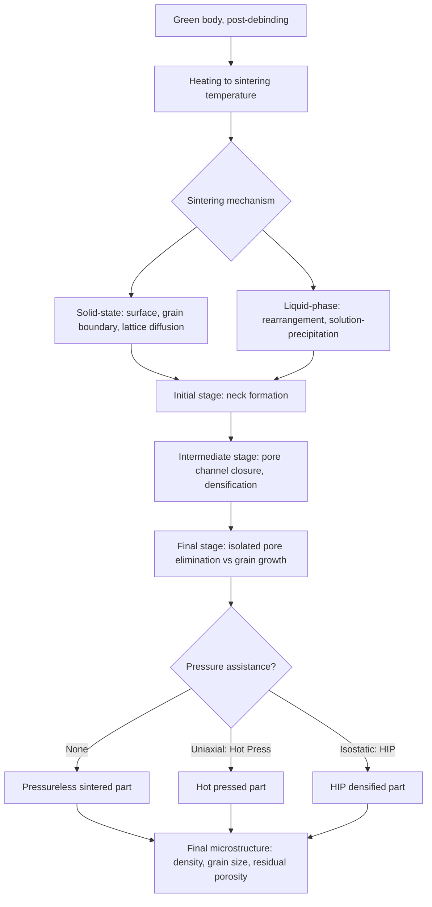

## Sintering of Ceramics

### Definition and Driving Force

Sintering is the thermal densification process by which a compacted powder green body is transformed into a coherent, dense (or controlled-porosity) solid through atomic diffusion at elevated temperature, without complete melting of the material. The fundamental driving force for sintering is the reduction of total surface free energy: a powder compact possesses a large amount of high-energy free surface area (particle-air interfaces), and sintering proceeds because the system can lower its total energy by replacing particle-particle contact points with lower-energy grain boundaries and eliminating porosity, thereby reducing overall surface area.

The thermodynamic driving force can be expressed in terms of the reduction in surface energy:

$$\Delta G = \gamma_{sv} \Delta A_{sv} - \gamma_{gb} \Delta A_{gb}$$

where $\gamma_{sv}$ is solid-vapor (surface) energy, $\gamma_{gb}$ is grain boundary energy, and $\Delta A$ represents the respective change in surface-vapor and grain boundary area during densification. Since grain boundary energy is typically substantially lower than surface energy, the process is thermodynamically favorable as porosity is eliminated and grain boundary area increases correspondingly.

### Stages of Sintering

Sintering is conventionally described in three overlapping stages, tracked by relative density or shrinkage:

**Initial stage**: Neck formation between adjacent particles at contact points via diffusion, without significant densification or particle center-to-center approach. Relative density increases only modestly (typically to approximately 60–65% of theoretical density by the end of this stage, though the precise value is material- and particle-packing-dependent).

**Intermediate stage**: The dominant densification stage — pore channels along grain edges shrink and become discontinuous, porosity decreases substantially, and grain growth begins to occur alongside densification. Most of the total density increase (commonly cited as reaching roughly 90–95% relative density) occurs during this stage.

**Final stage**: Remaining porosity exists as isolated, typically spherical pores located at grain boundaries or, if grain growth outpaces pore mobility, trapped within grains. Densification continues slowly via diffusion of vacancies from pores to grain boundaries, while grain growth competes with further pore elimination — a critical competition governing whether full theoretical density can be achieved.

### Mass Transport Mechanisms

Multiple atomic transport mechanisms can contribute to neck growth and densification; only some produce actual densification (center-to-center particle approach), while others cause neck growth without shrinkage:

**Non-densifying mechanisms** (neck growth without shrinkage):

- **Surface diffusion** — Atoms migrate along particle surfaces to the neck region
- **Evaporation-condensation** — Material evaporates from convex particle surfaces and condenses at the concave neck region (significant primarily for high-vapor-pressure materials)
- **Lattice diffusion from the surface** — Volume diffusion originating at the particle surface, terminating at the neck

**Densifying mechanisms** (produce actual shrinkage/densification):

- **Grain boundary diffusion** — Atoms diffuse along the grain boundary formed at the particle contact, generally the dominant densification mechanism in many ceramic systems at typical sintering temperatures
- **Lattice (volume) diffusion from the grain boundary** — Vacancies diffuse from the neck/grain boundary region into the bulk lattice, becoming increasingly significant at higher homologous temperature
- **Plastic flow/dislocation creep** — Generally minor in ceramics given limited dislocation mobility, more relevant in pressure-assisted densification of some systems
- **Viscous flow** — Dominant mechanism in glass and glass-containing (liquid-phase sintering) systems, where the glassy phase flows to fill porosity

Because multiple mechanisms operate simultaneously and their relative rates depend on temperature, particle size, and material system, sintering behavior is generally modeled and controlled empirically via measured densification curves (dilatometry) rather than through first-principles mechanism prediction alone in practical processing.

### Solid-State Sintering

Sintering conducted entirely below the material's melting point, relying on solid-state diffusion mechanisms (surface, grain boundary, and lattice diffusion) as described above. Governs densification of pure single-phase ceramics such as high-purity $Al_2O_3$ or $MgO$ without a liquid phase. Requires generally higher temperature and/or longer time than liquid-phase sintering to achieve comparable density, and is more sensitive to starting particle size and green density uniformity given the absence of a liquid phase to assist pore filling.

**Grain growth control** is a central challenge in solid-state sintering: since densification and grain growth both proceed via diffusion at similar temperature ranges, excessive grain growth can trap pores within grain interiors (where they become essentially immobile, since intragranular pore elimination requires much slower lattice diffusion than grain-boundary-located pore elimination), preventing full densification. Dopants such as $MgO$ in $Al_2O_3$ processing are used specifically to pin grain boundaries (via solute drag effects), slowing grain growth relative to densification rate and enabling near-theoretical density (translucent/transparent alumina is a well-known demonstration of this effect).

### Liquid-Phase Sintering

Sintering in the presence of a liquid phase formed at the sintering temperature, typically via a deliberately added sintering aid that forms a eutectic or otherwise low-melting liquid with the primary ceramic phase or with surface impurities. Widely used for nonoxide structural ceramics ($Si_3N_4$, SiC) where solid-state diffusion alone is too slow for practical densification given their strong covalent bonding.

**Mechanism stages**:

1. **Rearrangement** — Liquid formation provides capillary forces that rapidly rearrange solid particles into more efficient packing, producing rapid initial densification
2. **Solution-precipitation** — Solid material dissolves preferentially at high-curvature (small particle/asperity) regions, diffuses through the liquid, and reprecipitates at lower-curvature (larger particle) regions, driving further densification and characteristic grain shape evolution (e.g., elongated β-$Si_3N_4$ grains)
3. **Final densification/coarsening** — Continued slow densification via solid-state diffusion through the now largely solid skeleton, with residual liquid typically remaining as a grain-boundary glassy phase upon cooling

The residual grain-boundary glassy phase from liquid-phase sintering is a double-edged consequence: it enables full densification at practical temperatures, but often degrades high-temperature creep resistance and strength retention, since the glassy phase softens at elevated service temperature — a key trade-off in engineering structural nonoxide ceramics for high-temperature applications.

### Pressure-Assisted Sintering Techniques

**Hot pressing (HP)** — Simultaneous application of uniaxial pressure and elevated temperature (typically via a heated die, often graphite for nonoxide ceramics), providing an additional densification driving force beyond surface energy alone, enabling higher final density, finer grain size, and reduced sintering temperature/time relative to pressureless sintering. Limited largely to simple geometries (discs, blocks) due to uniaxial pressure application and die constraints.

**Hot isostatic pressing (HIP)** — Simultaneous elevated temperature and isostatic (uniform, all-direction) gas pressure applied via a pressure vessel, either directly on a presintered (closed-porosity) part or via an encapsulated green/presintered part in a sealed container ("glass encapsulation" or "can" HIP). Achieves near-full theoretical density with excellent microstructural uniformity, commonly used as a secondary densification step after pressureless presintering to close residual porosity for the most demanding structural ceramic applications (e.g., aerospace $Si_3N_4$ components).

**Spark plasma sintering (SPS)/field-assisted sintering (FAST)** — Pulsed DC current passed through the powder/die assembly (for electrically conductive dies/powders) combined with uniaxial pressure, enabling extremely rapid heating rates and short sintering times, which can suppress grain growth while achieving high density — of particular interest for nanocrystalline ceramic processing where minimizing grain growth during densification is a primary objective. [Inference] Because SPS is a comparatively recently industrialized technique relative to conventional hot pressing, its scale-up to large or geometrically complex components remains more limited in established production settings than for conventional pressureless or hot-pressing routes.

### Sintering Kinetics and Modeling

Sintering rate is strongly temperature-dependent, generally following an Arrhenius-type relationship for the underlying diffusion coefficient:

$$D = D_0 \exp\left(-\frac{Q}{RT}\right)$$

where $D_0$ is a pre-exponential factor, $Q$ is the activation energy for the dominant diffusion mechanism, $R$ is the gas constant, and $T$ is absolute temperature. Because sintering rate depends on diffusion coefficient, particle size (finer particles sinter faster and at lower temperature, since driving force and diffusion distances both scale favorably with decreasing particle size), and applied pressure (in pressure-assisted techniques), sintering schedules (heating rate, hold temperature, hold time, cooling rate) are typically developed empirically for a given powder/composition system via dilatometric shrinkage measurement, rather than derived purely analytically for production process design.

### Sintering Furnace Atmosphere Considerations

Atmosphere control is critical for many advanced ceramics: nonoxide ceramics (SiC, $Si_3N_4$, $AlN$) generally require inert (argon, nitrogen) or reducing atmosphere sintering to prevent oxidation at high temperature; some systems (e.g., $Si_3N_4$) are sintered under elevated nitrogen partial pressure specifically to suppress decomposition (since $Si_3N_4$ can dissociate at high sintering temperatures under insufficient nitrogen partial pressure).

### Sintering Process Flow

### Relationship to Microstructure and Properties

Sintering conditions directly determine final grain size, residual porosity level and distribution, and (in liquid-phase sintered systems) the composition and distribution of grain-boundary secondary phases — the three microstructural features most strongly governing mechanical strength, fracture toughness, and high-temperature performance of the finished ceramic. Because these microstructural outcomes are highly sensitive to green body quality (from powder processing) as well as sintering schedule, ceramic component quality is frequently understood as jointly determined by powder processing and sintering process control rather than by sintering parameters alone.

### Advantages

- Enables densification of materials with melting points too high for practical melt processing
- Allows fine control over final grain size and porosity through schedule and additive selection
- Near-net-shape processing minimizes costly post-sinter machining of hard ceramic material
- Liquid-phase and pressure-assisted techniques extend practical densification to otherwise difficult-to-sinter covalent ceramics (SiC, $Si_3N_4$)

### Limitations

- Achieving full theoretical density without pressure assistance can be difficult for strongly covalent, low-self-diffusivity ceramics without sintering aids, which in turn introduce grain-boundary phases affecting high-temperature performance
- Significant shrinkage occurs during sintering (commonly 15–20% linear shrinkage, material- and green-density-dependent), requiring the green/forming dimensions to be scaled accordingly and complicating tight dimensional tolerance achievement without post-sinter machining
- Pressure-assisted techniques (HP, HIP, SPS) substantially increase equipment cost and generally limit achievable part size/geometry complexity relative to pressureless sintering
- Grain growth and densification compete kinetically; achieving fine grain size and full density simultaneously often requires carefully tailored schedules (e.g., two-step sintering profiles) or additive systems specifically engineered to decouple the two processes

**Related Topics:**

- Ceramic Powder Processing (green body quality determining sinterability)
- Structure of Ceramic Materials (grain boundary and defect structures)
- Traditional versus Advanced Ceramics (differing sintering approaches)
- Transformation Toughening and Microstructural Engineering in Zirconia
- Dilatometry and Sintering Kinetics Characterization
- Hot Isostatic Pressing (HIP) Process Design
- Grain Growth Control via Dopant Addition