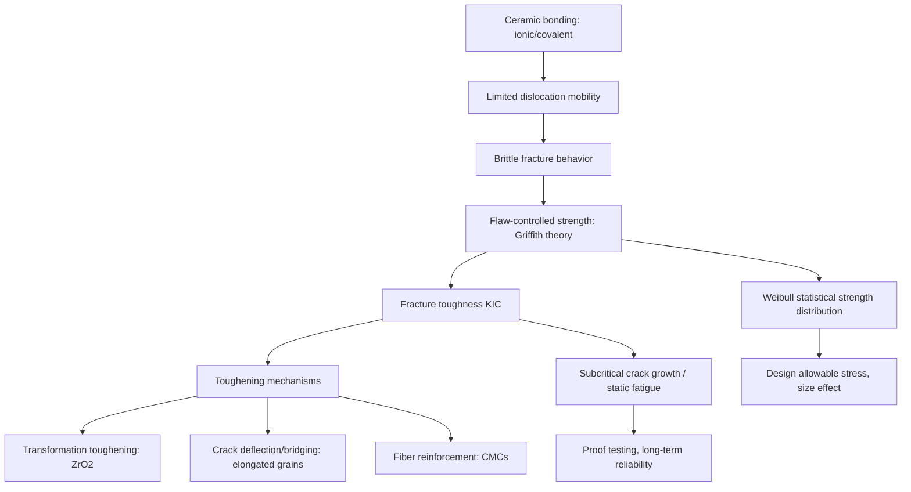

## Mechanical Behavior of Ceramics

### Fundamental Character: Brittle Fracture

Ceramic materials are characterized mechanically by their propensity for brittle fracture — failure occurring with minimal plastic deformation prior to crack propagation, in sharp contrast to the ductile behavior typical of metals. This stems directly from the ionic/covalent bonding discussed in ceramic structure: dislocation motion, the primary plastic deformation mechanism in metals, is severely restricted in ceramics because dislocation glide requires breaking and reforming directional covalent bonds or disrupting charge neutrality along ionic slip planes, both requiring far greater energy than metallic dislocation glide. Consequently, ceramics typically fracture at stresses well below their theoretical bond strength, with failure governed almost entirely by pre-existing flaws rather than by intrinsic material strength.

### Griffith Fracture Theory and Flaw Sensitivity

**Griffith's criterion** establishes that brittle fracture initiates from pre-existing flaws (surface cracks, internal pores, inclusions, machining damage) that act as stress concentrators. The critical stress for crack propagation from a flaw of length $2a$ (an internal crack) is:

$$\sigma_f = \sqrt{\frac{2E\gamma_s}{\pi a}}$$

where $E$ is Young's modulus, $\gamma_s$ is the surface energy, and $a$ is the half-length of the critical flaw. This relationship reveals the central practical consequence of ceramic mechanical behavior: **fracture strength is controlled by the largest flaw present**, not by an intrinsic material constant, meaning nominally identical ceramic specimens can exhibit substantially different measured strengths depending on their individual flaw populations.

**Stress concentration at flaw tips** is more precisely described by the stress concentration factor:

$$\sigma_{max} = \sigma_{applied}\left(1 + 2\sqrt{\frac{a}{\rho}}\right)$$

where $\rho$ is the flaw tip radius — illustrating why sharp cracks (small $\rho$) are far more damaging than rounded pores of the same characteristic size.

### Fracture Mechanics: Fracture Toughness

Linear elastic fracture mechanics (LEFM) provides the modern, more rigorous framework for ceramic fracture prediction via the **fracture toughness**, $K_{IC}$ (mode I, plane strain critical stress intensity factor):

$$K_{IC} = Y\sigma_f\sqrt{\pi a}$$

where $Y$ is a geometric factor dependent on specimen and crack geometry, $\sigma_f$ is fracture stress, and $a$ is the critical flaw size. Fracture occurs when the applied stress intensity factor $K_I$ reaches $K_{IC}$, the material's critical value.

Typical fracture toughness values are dramatically lower for ceramics than metals — conventional structural ceramics (alumina, silicon nitride) typically exhibit $K_{IC}$ in the range of roughly 3–10 $MPa\sqrt{m}$, compared to tens to over 100 $MPa\sqrt{m}$ for structural metals — quantifying the fundamentally greater flaw sensitivity and lower tolerance to crack-like defects characteristic of ceramics.

### Statistical Strength Distribution: Weibull Analysis

Because ceramic strength depends on the (essentially random) size and location of the worst flaw in a given specimen or component, ceramic strength data exhibits significant scatter and is characteristically treated using **Weibull statistics** rather than a single deterministic strength value.

The Weibull distribution expresses survival probability as:

$$P_s(V) = \exp\left[-\left(\frac{\sigma}{\sigma_0}\right)^m\right]$$

where $P_s$ is the probability of survival at stress $\sigma$, $\sigma_0$ is a scale parameter (characteristic strength), and $m$ is the **Weibull modulus**, a shape parameter quantifying the degree of flaw population uniformity/scatter in the material.

- **Low Weibull modulus** ($m \approx 2$–10) indicates a wide, inconsistent flaw size distribution and high strength variability — typical of poorly processed or traditional ceramics with variable porosity
- **High Weibull modulus** ($m \approx 15$–30+) indicates a narrow, consistent flaw distribution and more predictable strength — achieved through tightly controlled advanced ceramic powder processing and sintering

The Weibull modulus directly informs design practice: components made from low-$m$ material require larger safety margins (lower allowable design stress relative to mean measured strength) to achieve acceptable failure probability, since the strength distribution tail extends further below the mean.

**Size effect**: Weibull theory also predicts that larger-volume components exhibit statistically lower strength than smaller specimens of the same material (a larger volume has a higher probability of containing the critical-sized flaw), described by:

$$\frac{\sigma_1}{\sigma_2} = \left(\frac{V_2}{V_1}\right)^{1/m}$$

This has direct practical significance: strength data measured on small laboratory test specimens cannot be directly applied to larger production components without size-effect correction, a frequently underappreciated source of design error if unaccounted for.

### Toughening Mechanisms

Because intrinsic ceramic fracture toughness is inherently low, substantial engineering effort in advanced structural ceramics focuses on extrinsic toughening mechanisms that increase the energy required for crack propagation without altering the fundamental bonding character:

**Transformation toughening** — Exploited in partially stabilized and tetragonal zirconia ($ZrO_2$): metastable tetragonal grains transform to the stable monoclinic phase under the stress field ahead of an advancing crack tip, accompanied by a volume expansion (~3–5%) that places the surrounding matrix in compression, effectively shielding the crack tip and requiring additional energy for continued propagation. This mechanism enables $ZrO_2$-based ceramics to achieve $K_{IC}$ values (commonly 8–15 $MPa\sqrt{m}$) substantially higher than most other monolithic ceramics.

**Crack deflection and bridging** — Engineered elongated or acicular grain morphology (e.g., elongated β-$Si_3N_4$ grains from liquid-phase sintering) deflects an advancing crack along a more tortuous path, increasing effective crack path length and energy absorption, and can also bridge the crack wake, applying closure tractions that reduce the effective crack-tip stress intensity.

**Microcracking toughening** — Deliberately introduced microcracks (e.g., from thermal expansion mismatch between phases or grains) around the main crack tip absorb energy and can locally reduce elastic modulus, reducing the stress intensity reaching the main crack tip; must be carefully balanced, since excessive microcracking degrades bulk strength.

**Fiber/whisker reinforcement (ceramic matrix composites)** — Continuous or discontinuous fiber reinforcement (e.g., SiC fiber-reinforced SiC matrix composites) provides crack bridging, fiber pull-out, and fiber/matrix interface debonding energy-absorption mechanisms, achieving substantially higher effective toughness and, critically, non-catastrophic ("graceful") failure behavior rather than the sudden failure typical of monolithic ceramics.

### Strength Testing Methods

Given flaw sensitivity and the difficulty of gripping brittle specimens for direct tensile testing, ceramic strength is most commonly characterized via **flexural (bend) testing**:

- **Three-point bend test** — Simple loading configuration; maximum stress occurs at a single point on the tensile surface, sampling a comparatively small surface area/volume for the critical flaw
- **Four-point bend test** — Loading configuration producing uniform maximum stress across the region between the inner loading points, sampling a larger surface area and generally considered to provide a more representative (and typically somewhat lower, given greater flaw-sampling volume per the size effect above) strength measurement than three-point bending

Flexural strength (modulus of rupture) is calculated from beam theory:

$$\sigma_f = \frac{3FL}{2bd^2} \quad \text{(three-point bend, rectangular cross-section)}$$

where $F$ is fracture load, $L$ is support span, and $b$, $d$ are specimen width and thickness.

**Fracture toughness testing** methods include single-edge notched beam (SENB), single-edge V-notch beam (SEVNB), chevron notch, and indentation fracture (IF) methods (the latter widely used for its simplicity despite generally acknowledged lower accuracy compared to notched-beam methods).

**Hardness testing**: Vickers and Knoop indentation are standard for ceramics, exploiting their high hardness; indentation crack length measurements are also used (with caveats regarding accuracy noted above) to estimate fracture toughness via empirical correlations.

### Elastic and Time-Dependent Behavior

**Elastic modulus**: Ceramics generally exhibit high elastic (Young's) modulus reflecting strong interatomic bonding, with modulus strongly reduced by porosity (following relationships such as $E = E_0(1-1.9P+0.9P^2)$ discussed in ceramic structure, with material-specific coefficients).

**Creep**: At sufficiently high homologous temperature (particularly relevant for high-temperature structural applications such as turbine components), ceramics can exhibit creep deformation via diffusional or grain-boundary sliding mechanisms, especially where a residual grain-boundary glassy phase from liquid-phase sintering is present — the softening of this glassy phase at elevated temperature is frequently the rate-limiting factor governing high-temperature creep resistance, making residual glassy phase composition and volume fraction a critical design/processing variable for high-temperature ceramic components.

**Subcritical crack growth (static fatigue)**: Ceramics can exhibit slow, stable crack growth under sustained stress below the critical fracture toughness, often driven by stress-corrosion mechanisms (particularly moisture-assisted crack growth in oxide ceramics such as glass and alumina), described empirically by a power-law relationship between crack velocity and applied stress intensity:

$$v = A K_I^n$$

where $v$ is crack velocity, $A$ is a material/environment-dependent constant, and $n$ is the stress corrosion susceptibility exponent (high $n$ indicating lower susceptibility to slow crack growth). This phenomenon underlies the practice of proof testing ceramic components (deliberately loading above expected service stress to eliminate specimens with near-critical flaws) and is central to long-term reliability prediction for ceramic components in sustained-load service.

### Compressive versus Tensile Behavior

A distinctive characteristic of ceramic mechanical behavior is the substantial asymmetry between compressive and tensile strength — ceramic compressive strength is typically 10–15 times higher than tensile/flexural strength, since compressive loading tends to close rather than propagate surface and internal flaws, while tensile loading opens and propagates them. This asymmetry is a central consideration in ceramic component design, favoring configurations that place ceramic material predominantly in compression wherever geometrically feasible.

### Mechanical Behavior Relationship Diagram

### Design Implications

Ceramic component design fundamentally differs from metallic design philosophy: rather than a deterministic yield-strength-based safety factor approach, ceramic design typically employs probabilistic (Weibull-based) reliability analysis, accounting for statistical flaw distribution, component size/volume, stress state (favoring compression), and potential subcritical crack growth over service life. Nondestructive testing (see related NDT topics — ultrasonic testing, X-ray computed tomography, dye penetrant) and proof testing are frequently integrated into ceramic component qualification specifically to screen for critical flaws prior to service, given the direct link between flaw population and mechanical reliability established by Griffith/Weibull theory.

### Limitations of Standard Characterization Approaches

- Measured strength values are specimen-geometry- and test-method-dependent (three-point vs. four-point bend, specimen size) due to the size effect, requiring careful specification of test conditions when comparing reported data across sources
- Indentation-based fracture toughness estimates, while convenient, are generally regarded as less accurate than notched-beam methods and should be interpreted with appropriate caution in critical design applications
- [Inference] Because subcritical crack growth parameters ($A$, $n$) are highly sensitive to environmental conditions (humidity, temperature, chemical environment) as well as material microstructure, long-term reliability predictions extrapolated from short-term laboratory data carry greater uncertainty than analogous fatigue-life predictions for metals, where environmental sensitivity is generally less pronounced for typical service environments

**Related Topics:**

- Structure of Ceramic Materials (bonding basis for brittle behavior)
- Sintering of Ceramics (porosity and grain size as strength-controlling factors)
- Transformation Toughening and Ceramic Matrix Composites
- Weibull Statistics and Probabilistic Design
- Nondestructive Testing Methods for Flaw Detection in Ceramics
- Traditional versus Advanced Ceramics (property implications)
- Thermal Shock Resistance in Ceramic Materials