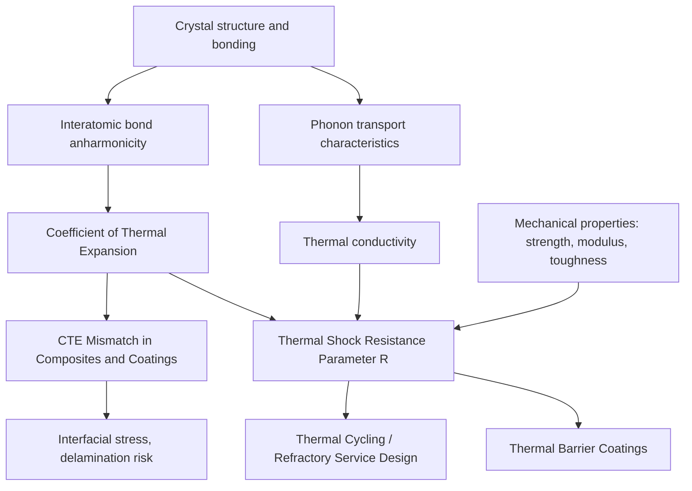

## Thermal Properties of Ceramics

### Overview and Governing Factors

Thermal properties of ceramics — thermal conductivity, thermal expansion, specific heat, and thermal shock resistance — are governed primarily by crystal structure, bonding character, and phonon transport behavior, since ceramics (being electrical insulators in the vast majority of cases) conduct heat almost exclusively via lattice vibrations (phonons) rather than via free electrons as in metals. This phonon-dominated conduction mechanism, combined with generally lower symmetry and more complex crystal structures than metals, produces thermal behavior markedly different from — and often more variable across material systems than — metallic thermal behavior.

### Heat Capacity

**Specific heat capacity** ($c_p$) in ceramics, as in all crystalline solids, follows temperature-dependent behavior described at a fundamental level by the **Debye model**, which predicts heat capacity rising from near zero at very low temperature (following a $T^3$ dependence at low temperature) and approaching the classical Dulong-Petit limit at high temperature:

$$C_v \rightarrow 3nR \quad \text{(high-temperature limit, Dulong-Petit)}$$

where $n$ is the number of atoms per formula unit and $R$ is the gas constant. Most ceramics reach a heat capacity plateau at temperatures well below typical service/processing temperatures, meaning specific heat is relatively insensitive to further temperature increase across much of the practically relevant range — in contrast to thermal conductivity and thermal expansion, which continue to vary more significantly with temperature.

Heat capacity per unit mass tends to be higher for ceramics composed of lighter elements (e.g., $Si_3N_4$, $Al_2O_3$) than for those containing heavier atoms, consistent with the Dulong-Petit relationship's dependence on atoms per unit mass rather than atomic mass directly.

### Thermal Conductivity

**Phonon conduction mechanism**: Heat is transported through the crystal lattice via quantized lattice vibrations (phonons). Thermal conductivity depends on phonon mean free path, phonon group velocity, and phonon scattering rate:

$$k = \frac{1}{3}C_v v \lambda$$

where $C_v$ is volumetric heat capacity, $v$ is phonon (approximately sound) velocity, and $\lambda$ is phonon mean free path — the parameter most strongly affected by microstructure and temperature.

**Phonon scattering mechanisms** limiting thermal conductivity:

- **Phonon-phonon (Umklapp) scattering** — Intrinsic scattering from anharmonic lattice vibration interactions, dominant at higher temperatures, causing thermal conductivity to generally decrease with increasing temperature in dense, high-purity crystalline ceramics (opposite to the trend often seen in metals, where electronic conductivity mechanisms behave differently)
- **Point defect scattering** — Impurity atoms, vacancies, and solid solution alloying disrupt lattice periodicity, scattering phonons and reducing conductivity; this is why doped or solid-solution ceramics typically exhibit lower thermal conductivity than high-purity single-phase material
- **Grain boundary scattering** — Increasingly significant as grain size decreases, since grain boundaries act as phonon scattering interfaces; fine-grained ceramics generally exhibit lower thermal conductivity than coarse-grained material of the same composition and density
- **Porosity scattering** — Pores scatter phonons and, more significantly, simply remove conducting cross-sectional area, making thermal conductivity strongly and negatively dependent on porosity fraction, often modeled with relationships analogous to those used for elastic modulus-porosity dependence

**Comparative thermal conductivity behavior**:

| Ceramic | Approximate Thermal Conductivity (W/m·K, near room temp) | Notes |
| --- | --- | --- |
| Diamond | ~1000–2200 | Exceptionally high; simple, light-atom, strongly covalent structure |
| $BeO$ | ~260–300 | Historically used for high-conductivity electronic substrates (toxicity concerns limit current use) |
| $AlN$ | ~150–285 | High-conductivity electronic packaging/substrate ceramic; strongly purity/processing dependent |
| $SiC$ | ~120–270 | Strongly dependent on polytype, purity, and grain boundary phase content |
| $Al_2O_3$ | ~25–35 | Widely used electronic substrate; moderate conductivity |
| $Si_3N_4$ | ~15–30 | Strongly dependent on grain boundary glassy phase content from sintering aids |
| $ZrO_2$ | ~2–3 | Among the lowest of common structural ceramics; basis for thermal barrier coating use |
| Fused silica glass | ~1.3–1.5 | Amorphous structure lacks long-range order for efficient phonon transport |

[Unverified — the specific numeric ranges above are representative literature values and vary meaningfully with purity, density, grain size, and measurement temperature; exact figures should be confirmed against material-specific datasheets for engineering design use]

The stark contrast between crystalline covalent ceramics (diamond, SiC, AlN — capable of very high conductivity given simple, strongly-bonded, light-atom structures with long phonon mean free paths) and amorphous or complex-structure ceramics (glass, zirconia — low conductivity given disordered structure or heavy-atom/complex unit cells that strongly scatter phonons) illustrates the structure-property link central to thermal conductivity engineering.

### Thermal Expansion

The **coefficient of thermal expansion (CTE)**, $\alpha$, quantifies dimensional change with temperature:

$$\alpha = \frac{1}{L_0}\frac{dL}{dT}$$

CTE originates from the anharmonicity of interatomic bonding potential — as temperature increases and atoms vibrate with greater amplitude, the asymmetric (anharmonic) shape of the interatomic potential well causes the average interatomic spacing to increase. Materials with stronger, more symmetric bonding (higher bond energy, higher melting point) generally exhibit lower CTE, since a deeper, more symmetric potential well produces less asymmetric thermal displacement.

**Representative CTE values** (linear, approximate, room temperature to ~1000°C range):

| Ceramic | CTE (×10⁻⁶/°C) |
| --- | --- |
| Fused silica | ~0.5 |
| $Si_3N_4$ | ~3 |
| $SiC$ | ~4–5 |
| $Al_2O_3$ | ~8–9 |
| $ZrO_2$ (stabilized) | ~10–11 |
| $MgO$ | ~13–14 |

[Unverified — representative literature values; precise CTE is temperature-range and phase-dependent, particularly for $ZrO_2$ given its polymorphic transformations]

**Anisotropic thermal expansion**: Non-cubic crystal structures (hexagonal, e.g., $Al_2O_3$; and others) can exhibit different CTE along different crystallographic axes, which in polycrystalline material with random grain orientation can generate internal microstresses during cooling from processing temperature, potentially contributing to microcracking — a factor of particular concern in some silicate and non-cubic oxide ceramic systems.

**CTE mismatch in composite/multi-material systems**: A critical practical consideration wherever ceramics are joined to, coated onto, or reinforced with a dissimilar material (metal-ceramic joints, ceramic coatings on metal substrates, ceramic matrix composites with differing fiber/matrix CTE) — thermal cycling induces stress at the interface proportional to the CTE mismatch, layer thickness, and temperature excursion, and can lead to interfacial cracking, delamination, or coating spallation if not adequately managed through interface design, compliant layers, or CTE-graded transition structures.

### Thermal Shock Resistance

Thermal shock — rapid temperature change inducing transient thermal gradients and consequent thermal stress — is a critical failure mode for ceramics given their combination of brittleness (low tolerance for stress concentration at flaws) and often relatively low thermal conductivity (which promotes larger transient thermal gradients for a given heating/cooling rate).

**Thermal stress generated** by a temperature differential $\Delta T$ in a constrained or rapidly quenched body is approximately:

$$\sigma_{thermal} = \frac{E\alpha\Delta T}{1-\nu}$$

where $E$ is elastic modulus, $\alpha$ is CTE, $\nu$ is Poisson's ratio, and $\Delta T$ is the effective temperature differential across the relevant thermal gradient.

**Thermal shock resistance parameters** combine the relevant material properties into figures of merit predicting critical quench temperature differential or resistance to crack propagation once initiated:

**First thermal shock resistance parameter** ($R$, critical $\Delta T$ for fracture initiation, for a given heat transfer condition):

$$R = \frac{\sigma_f(1-\nu)}{E\alpha}$$

where $\sigma_f$ is fracture strength — favoring materials with high strength, low modulus, low CTE, and (implicitly, via the heat transfer boundary condition typically incorporated into more complete forms of this parameter) high thermal conductivity, since high conductivity reduces the transient thermal gradient for a given surface heat transfer rate.

**Thermal shock damage resistance parameter** ($R'''$ or similar formulations) additionally incorporates fracture toughness and thermal diffusivity to characterize resistance to crack propagation once thermal shock damage has initiated (relevant for repeated thermal cycling service, where some initial microcracking may be tolerated if it does not propagate to catastrophic failure).

**Practical implications**:

- Materials such as $Si_3N_4$ and $SiC$ exhibit notably favorable combinations of moderate-to-high strength, relatively low CTE, and moderate-to-high thermal conductivity, contributing to their comparatively good thermal shock resistance among structural ceramics — a key reason for their selection in applications involving rapid thermal cycling (e.g., turbine components, kiln furniture, some engine components)
- Conversely, materials combining high CTE with low thermal conductivity and low strength/toughness (many traditional whiteware and refractory compositions) are considerably more thermal-shock-susceptible, requiring careful firing/cooling schedule control during processing and cautious service thermal cycling limits
- Porous or microcracked ceramics can sometimes exhibit improved practical thermal shock damage tolerance despite lower intrinsic strength, since pre-existing porosity/microcracks can blunt or arrest propagating thermal shock cracks — an example of the more nuanced relationship between "thermal shock resistance" (crack initiation resistance) and "thermal shock damage tolerance" (resistance to catastrophic propagation once cracking begins)

### Thermal Barrier and Insulation Applications

The combination of high melting point, chemical stability, and (for specific compositions) low thermal conductivity makes certain ceramics — most notably yttria-stabilized zirconia (YSZ) — the standard material for **thermal barrier coatings (TBCs)** on gas turbine hot-section components, where the ceramic's low thermal conductivity provides substantial insulation of the underlying metallic substrate from combustion gas temperatures, while its CTE (moderate for a ceramic, though still substantially mismatched to the metallic substrate) and phase stability under thermal cycling are engineered via yttria stabilization to manage the CTE-mismatch stresses discussed above.

Conversely, ceramics such as fused silica and various oxide-fiber insulation materials are selected specifically for their low thermal conductivity (given amorphous or highly porous fibrous structure) for high-temperature thermal insulation applications (furnace linings, aerospace thermal protection systems), representing an application space at the opposite end of the thermal conductivity spectrum from electronic substrate or heat-sink ceramic applications.

### Thermal Property Interrelationship Diagram

### Design and Selection Implications

Ceramic thermal property selection is highly application-specific and frequently trades off directly against other design requirements: high-conductivity ceramics (AlN, BeO) are selected for electronic heat-dissipation substrates despite generally higher cost, while low-conductivity ceramics (YSZ, fused silica) are selected for thermal insulation and barrier applications specifically for that same property that would be undesirable in a substrate application. Thermal shock resistance, meanwhile, requires balancing mechanical and thermal properties simultaneously, meaning no single "thermal shock resistant" ceramic exists in absolute terms — resistance is defined relative to the specific heat transfer condition (quench severity, geometry, constraint) and cycling pattern (single severe shock versus repeated moderate cycling) relevant to the intended service.

### Limitations of Standard Thermal Property Data

- Thermal conductivity is strongly processing-dependent (porosity, grain size, secondary phase content, impurity level), meaning handbook values for a given nominal composition can vary considerably from actual measured values for a specific processed component — material-specific characterization is generally warranted for critical thermal design applications
- CTE anisotropy in non-cubic ceramics is frequently reported only as a bulk polycrystalline average in general references, which may not adequately capture the internal microstress state relevant to microcracking risk in coarse-grained or textured (preferentially oriented) material
- Thermal shock resistance parameters, while useful for material screening and comparative ranking, are simplified figures of merit; actual thermal shock behavior of a specific component depends additionally on geometry, heat transfer coefficient, constraint conditions, and pre-existing flaw population not captured in the bulk material parameter alone

**Related Topics:**

- Structure of Ceramic Materials (bonding basis for thermal behavior)
- Mechanical Behavior of Ceramics (strength/toughness inputs to thermal shock parameters)
- Thermal Barrier Coatings and Yttria-Stabilized Zirconia
- Sintering of Ceramics (porosity/grain size effects on conductivity)
- Ceramic Matrix Composites and CTE-Mismatch Management
- Electronic Ceramic Substrates (AlN, Al₂O₃ selection criteria)
- Refractory Materials for High-Temperature Service