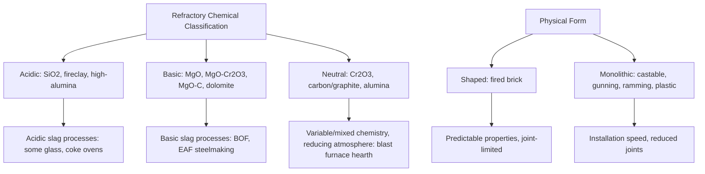

## Refractories and Their Applications

### Definition and Function

Refractories are ceramic materials engineered to withstand high temperatures — typically service temperatures exceeding approximately 1000°C, and in demanding applications well beyond 1700°C — while resisting thermal, chemical, and mechanical degradation over extended service life. They serve primarily as furnace, kiln, and reactor lining materials in metallurgical, glass, cement, ceramic, and chemical process industries, where they contain and insulate high-temperature processes, resist attack from molten metal, slag, and process gases, and provide structural support for furnace vessels and equipment.

Refractory selection and design require simultaneously balancing several, often competing, requirements: high melting/softening temperature, chemical inertness to the specific process environment, adequate mechanical strength at service temperature, thermal shock resistance, and acceptable thermal conductivity for the intended thermal management role (insulating versus heat-containing lining functions require essentially opposite conductivity characteristics).

### Classification by Chemical Character

Refractories are broadly classified according to their acid-base chemical character, since chemical compatibility between the refractory and the process material (slag, molten metal, flux) it contacts is a primary determinant of service life — a fundamental principle rooted in the tendency of chemically similar (acidic-acidic or basic-basic) materials to resist mutual attack, while dissimilar (acidic-basic) combinations react readily.

**Acidic refractories**: Based on silica ($SiO_2$) and aluminosilicate compositions.

- **Silica refractories** — Nearly pure $SiO_2$ (typically >93–96%), used historically and still in some applications for coke oven and glass furnace crowns/roofs given excellent high-temperature strength and resistance to slag containing acidic (silica-rich) compositions; poor resistance to basic slags
- **Fireclay refractories** — Aluminosilicate compositions (typically 25–45% $Al_2O_3$) based on fireclay minerals, among the most widely used general-purpose traditional refractories given low cost and adequate performance for many moderate-temperature applications
- **High-alumina refractories** — Aluminosilicate compositions with elevated $Al_2O_3$ content (commonly classified by alumina content: 50%, 60%, 70%, 80%, 85%, and up to near-pure alumina/mullite-corundum compositions), offering progressively higher refractoriness and improved chemical resistance as alumina content increases, since $Al_2O_3$ itself has a substantially higher melting point (2072°C) than $SiO_2$

**Basic refractories**: Based on magnesia ($MgO$), chrome-magnesite, and related compositions, offering superior resistance to basic slags characteristic of many steelmaking processes.

- **Magnesite (magnesia) refractories** — Predominantly $MgO$, exceptional resistance to basic slag but comparatively poor thermal shock resistance and lower strength than some alternatives, historically critical for basic oxygen furnace (BOF) and electric arc furnace (EAF) steelmaking linings
- **Magnesia-chrome refractories** — $MgO$-$Cr_2O_3$ combinations offering improved thermal shock resistance and strength relative to pure magnesite while retaining good basic slag resistance, historically widespread in steelmaking though usage has declined in some regions due to environmental/regulatory concerns regarding chromium (particularly hexavalent chromium formation risk)
- **Magnesia-carbon refractories** — $MgO$ combined with graphite (carbon) content, exploiting carbon's excellent thermal shock resistance (high thermal conductivity, low CTE) and non-wetting behavior toward molten slag/metal, now dominant in many modern steelmaking vessel linings (BOF, EAF, ladle) despite carbon's oxidation susceptibility requiring careful atmosphere/additive management
- **Dolomite refractories** — Based on calcined dolomite ($CaO \cdot MgO$), used in some steelmaking and cement kiln applications given good basic slag resistance and lower relative cost, though generally more hydration-sensitive than magnesite

**Neutral refractories**: Chemically resistant to both acidic and basic attack, used at interfaces or in applications contacting variable-chemistry process materials.

- **Chromite/chrome refractories** — $Cr_2O_3$-based, historically used as neutral transition zones between acidic and basic refractory linings, though largely superseded by magnesia-chrome and other compositions in many modern applications
- **Carbon/graphite refractories** — Chemically inert to most slag and metal systems, exceptional thermal shock resistance, but requiring protection from oxidizing atmospheres at high temperature (widely used in blast furnace hearth/crucible linings, where the reducing furnace atmosphere is compatible with carbon's oxidation sensitivity)
- **Alumina-based neutral refractories** — High-purity alumina and mullite ($3Al_2O_3 \cdot 2SiO_2$) compositions offer reasonably broad chemical compatibility alongside high refractoriness

**Special/advanced refractories**: Zirconia ($ZrO_2$), zircon ($ZrSiO_4$), silicon carbide (SiC), and various spinel-based compositions used for particularly demanding applications requiring exceptional refractoriness, chemical resistance, or thermal shock resistance beyond conventional oxide refractory capability — for example, zirconia-based refractories in glass furnace contact applications given excellent resistance to molten glass corrosion, and SiC-based refractories where high thermal conductivity and thermal shock resistance are paramount (e.g., blast furnace stave coolers, some kiln furniture).

### Physical Form Classification

**Shaped (fired brick) refractories**: Pre-formed and fired to shape prior to installation, offering predictable, quality-controlled properties and dimensional consistency, though requiring more complex installation (masonry-type construction) and generating more joints (potential weak points for slag/gas penetration) than monolithic alternatives.

**Unshaped (monolithic) refractories**: Installed in unfired or minimally pre-fired form and consolidated/cured in place, including:

- **Castables** — Refractory aggregate bonded with a hydraulic (typically calcium aluminate cement) or chemical binder, installed by casting/vibration similar to concrete, curing and developing strength via hydraulic reaction followed by in-service firing/ceramic bonding development
- **Gunning/shotcrete mixes** — Refractory material pneumatically applied (sprayed) onto a surface, widely used for furnace repair and relining given rapid application without extensive formwork
- **Ramming mixes** — Plastic, low-moisture refractory material compacted in place via ramming/tamping, commonly used for furnace bottoms and other applications requiring dense, monolithic construction
- **Plastic refractories** — Pre-mixed, ready-to-use plastic material installed via ramming or troweling, offering good workability for complex or repair applications

Monolithic refractories have progressively gained market share relative to shaped brick over recent decades given installation speed advantages, reduced joint-related weakness, and improved formulation technology (particularly low-cement and ultra-low-cement castable systems reducing the historical strength/purity trade-offs associated with cement binder content).

### Key Refractory Properties and Testing

**Refractoriness (Pyrometric Cone Equivalent, PCE)**: A traditional comparative measure of refractoriness based on the softening/deformation behavior of standardized pyrometric cones fired alongside a sample, providing a practical (if somewhat empirical) ranking of high-temperature deformation resistance.

**Refractoriness Under Load (RUL)**: A more directly application-relevant test measuring the temperature at which a refractory specimen under a specified compressive load exhibits a defined deformation, since refractories in service experience simultaneous high temperature and mechanical load (furnace structural weight, process material weight/pressure), and refractoriness alone (without load) can substantially overstate practical high-temperature performance.

**Cold crushing strength (CCS)**: Standard compressive strength measurement at room temperature, providing a baseline mechanical property and quality control metric, though not directly predictive of hot strength given the temperature-dependent softening behavior of many refractory bonding phases.

**Hot modulus of rupture (HMOR)**: Flexural strength measured at elevated temperature, more directly relevant to service performance than room-temperature strength given that many refractory failure modes (particularly involving bonding phase softening or secondary phase formation from slag infiltration) manifest specifically at service temperature.

**Apparent porosity and bulk density**: Governs both mechanical strength (higher porosity generally reduces strength) and slag/metal penetration resistance (higher porosity provides more pathways for liquid infiltration, a primary refractory degradation mechanism), while also affecting thermal conductivity (higher porosity generally reduces conductivity, beneficial for insulating refractory applications but detrimental where high conductivity is desired, e.g., in some steelmaking vessel designs for enhanced heat removal).

**Permanent linear change (PLC)**: Dimensional change occurring upon firing/reheating due to continued sintering, phase transformation, or bonding phase reaction, important for predicting joint gap and structural fit behavior over the refractory lining's service life.

**Slag resistance/corrosion testing**: Various standardized and application-specific tests (crucible tests, rotary slag testing, cup tests) evaluating chemical attack rate under conditions simulating actual service slag/metal contact, since chemical corrosion by molten slag is frequently the dominant refractory wear mechanism in metallurgical applications.

### Refractory Degradation Mechanisms

- **Chemical corrosion/slag attack** — Reaction between refractory and contacting slag/metal/flux, often accelerated by chemically incompatible (acid-base mismatched) combinations, forming lower-melting-point reaction products that are subsequently washed away by slag/metal flow, progressively eroding the refractory lining
- **Slag/metal penetration** — Infiltration of liquid slag or metal into refractory porosity, causing subsequent spalling upon cooling (due to thermal expansion mismatch between infiltrated material and refractory matrix) or promoting further chemical attack from within the refractory structure
- **Thermal spalling** — Cracking and material loss driven by thermal shock/thermal cycling stress, particularly significant for refractories with lower thermal shock resistance (see thermal properties discussion) subjected to rapid heating/cooling cycles in batch or intermittent-operation furnaces
- **Mechanical erosion/abrasion** — Physical wear from moving process material (e.g., abrasive particulate flow, mechanical agitation, thermal-cycling-induced structural movement)
- **Hydration** — Particularly relevant to $CaO$- and $MgO$-based basic refractories, which can hydrate upon exposure to atmospheric moisture during storage or idle periods, causing volume expansion and structural degradation prior to even entering service
- **Oxidation** — Relevant to carbon-containing refractories (magnesia-carbon, carbon/graphite refractories), requiring formulation additives (metallic antioxidants) or atmosphere control to limit service-life-reducing carbon oxidation

### Applications by Industry

**Iron and steelmaking**: Blast furnace linings (carbon/graphite hearth, high-alumina/SiC stack refractories), basic oxygen furnace (BOF) and electric arc furnace (EAF) vessel linings (predominantly magnesia-carbon), ladle linings (magnesia-carbon working lining, high-alumina or insulating permanent lining), continuous casting refractories (submerged entry nozzles, tundish linings — often specialized alumina-graphite or zirconia-based compositions given demanding erosion/thermal shock/chemical resistance requirements), and reheat furnace linings.

**Nonferrous metallurgy**: Aluminum smelting/holding furnace linings, copper smelting furnace and converter linings (often magnesia-chrome or specialized basic compositions given aggressive copper matte/slag chemistry), and various nonferrous melting/holding furnace applications with compositions tailored to the specific metal/slag chemistry involved.

**Glass manufacturing**: Glass furnace crown, sidewall, and (particularly demanding) glass-contact refractories, where zirconia-based and fused-cast AZS (alumina-zirconia-silica) refractories are widely used for glass-contact applications given exceptional resistance to molten glass corrosion.

**Cement and lime production**: Rotary kiln linings (typically high-alumina or spinel-based basic brick in the burning zone, given the demanding combination of high temperature, alkali/sulfate chemical attack, and mechanical/thermal cycling stress from kiln rotation), and various preheater/calciner refractory applications.

**Petrochemical and power generation**: Reformer and cracking furnace linings, incinerator refractories, and various process heater applications, generally utilizing insulating or moderate-duty refractories given typically lower peak temperatures than metallurgical applications.

### Application-Chemistry Compatibility Diagram

### Selection Considerations

Refractory selection for a given application requires evaluating the full service environment: peak and cycling temperature profile, contacting slag/metal/gas chemistry (driving acid-base compatibility selection), mechanical loading and abrasion conditions, thermal shock severity (batch versus continuous operation), and economic factors (initial cost versus service life and relining frequency/downtime cost) — with the general engineering principle that refractory selection represents a total-cost-of-ownership optimization rather than a simple maximum-refractoriness selection, since higher-performance refractories generally carry substantially higher material and installation cost that must be justified by proportionally extended service life or process benefit.

### Limitations and Ongoing Challenges

- Chrome-containing refractories face increasing regulatory and environmental pressure in various jurisdictions given hexavalent chromium formation risk during service and disposal, driving ongoing formulation development toward chrome-free basic refractory alternatives with comparable performance
- Carbon-containing refractory oxidation resistance remains an inherent trade-off requiring ongoing antioxidant formulation development, particularly as steelmaking process efficiency improvements sometimes push toward operating conditions (e.g., higher oxygen potential) that increase oxidation severity
- [Inference] Given the wide diversity of process-specific chemical environments across metallurgical and industrial applications, refractory service life prediction from laboratory corrosion/thermal shock testing generally carries greater application-specific uncertainty than comparable structural ceramic mechanical property prediction, since actual service degradation often results from the combined, sometimes synergistic, action of multiple degradation mechanisms (chemical attack, penetration, thermal cycling, mechanical stress) simultaneously rather than a single dominant, readily isolated failure mode

**Related Topics:**

- Thermal Properties of Ceramics (thermal shock resistance basis)
- Traditional versus Advanced Ceramics (fireclay/traditional refractory context)
- Structure of Ceramic Materials (MgO, Al2O3, ZrO2 crystal structures)
- Steelmaking Process Metallurgy (BOF, EAF vessel refractory context)
- Slag Chemistry and Metal-Slag-Refractory Interaction
- Ceramic Powder Processing (monolithic castable/gunning mix formulation)
- Sintering of Ceramics (bonding phase development in refractories)