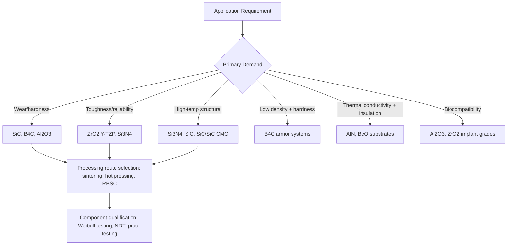

## Technical and Structural Ceramics

### Definition and Scope

Technical and structural ceramics are advanced (engineered) ceramic materials specifically designed and processed to bear mechanical, thermal, or tribological load in demanding engineering applications, distinguishing them from functional/electronic advanced ceramics (dielectrics, piezoelectrics, magnetics) whose primary engineering role is electrical, magnetic, or optical rather than load-bearing. Technical and structural ceramics occupy the application space where high hardness, wear resistance, high-temperature strength retention, chemical inertness, and low density (relative to competing metallic/superalloy solutions in some applications) provide decisive engineering advantage despite the fundamental brittleness and lower fracture toughness inherent to ceramic materials generally.

This category draws directly on the structure, processing, and mechanical/thermal behavior principles established for ceramics generally, applying them specifically to component design and material selection for structural service.

### Principal Material Systems

**Alumina ($Al_2O_3$)**: The most widely used and cost-effective structural/technical ceramic, available across a range of purity grades (typically 85–99.9% $Al_2O_3$, with mechanical and electrical properties improving with increasing purity and decreasing porosity). Offers good hardness, moderate strength, excellent electrical insulation, good chemical inertness, and relatively low cost compared to nonoxide alternatives.

- Applications: cutting tool inserts, wear-resistant liners and nozzles, electrical/electronic insulators and substrates, bioceramic implant components, ballistic armor, pump and valve components in abrasive/corrosive service

**Zirconia ($ZrO_2$)**: Distinguished by transformation toughening (discussed in mechanical behavior), yielding substantially higher fracture toughness than most monolithic ceramics. Commercially available primarily as:

- **Partially stabilized zirconia (PSZ)** — Retains a mixture of cubic matrix with metastable tetragonal precipitates, offering a balance of toughness and strength
- **Tetragonal zirconia polycrystal (TZP)**, notably yttria-stabilized (Y-TZP) — Fine-grained, fully tetragonal microstructure offering the highest strength and toughness among zirconia grades, widely used in dental and orthopedic implant applications given the combination of high strength, biocompatibility, and favorable optical/aesthetic properties (particularly for dental applications)
- Applications: cutting tools, extrusion dies, dental crowns/bridges, orthopedic (hip/knee) implant components, oxygen sensors (exploiting ionic conductivity in stabilized cubic zirconia), thermal barrier coatings

**Silicon carbide (SiC)**: Strongly covalent bonding provides exceptional hardness, high thermal conductivity, good thermal shock resistance, and excellent high-temperature strength retention, though with generally lower toughness than transformation-toughened zirconia.

- Processing routes include reaction-bonded SiC (RBSiC, offering near-net-shape capability via silicon infiltration of a carbon/SiC preform, though residual free silicon limits maximum service temperature), sintered SiC (pressureless sintered with boron/carbon additives, offering higher-temperature capability than reaction-bonded grades), and hot-pressed SiC (highest density/strength, limited to simpler geometries)
- Applications: mechanical seals, bearings, cutting tools, kiln furniture, semiconductor processing components (given high purity achievable and excellent thermal/chemical stability), armor, abrasives, and (in fiber-reinforced form) high-temperature aerospace structural composites

**Silicon nitride ($Si_3N_4$)**: Offers a favorable combination of high strength, good fracture toughness (particularly with engineered elongated-grain microstructures from liquid-phase sintering, as discussed in mechanical behavior), excellent thermal shock resistance (low CTE combined with reasonable thermal conductivity), and good high-temperature strength retention.

- Applications: rolling element bearings (notably in hybrid ceramic-steel bearings and all-ceramic bearings for high-speed/high-temperature/corrosive service), automotive turbocharger rotors, cutting tools (particularly for cast iron machining), metal cutting and forming tooling, and various high-temperature structural components

**Boron carbide ($B_4C$)**: Among the hardest engineering ceramics (third hardest material after diamond and cubic boron nitride), combined with low density, making it particularly valuable for lightweight armor applications.

- Applications: ballistic armor (body armor plates, vehicle armor), abrasive/wear components, neutron absorber applications (exploiting boron's high neutron capture cross-section) in nuclear control rod and shielding applications

**Cubic boron nitride (cBN) and polycrystalline diamond (PCD)**: Superhard materials (cBN second only to diamond in hardness) used predominantly as cutting tool materials, typically as a thin functional layer bonded to a tougher substrate given their extreme hardness but limited bulk toughness and (for diamond) chemical reactivity with ferrous metals at high cutting temperature (a key reason cBN, rather than diamond, is preferred for hardened steel machining).

**Aluminum nitride (AlN)**: Primarily valued for combining high thermal conductivity with excellent electrical insulation — an unusual combination for a ceramic, since electrically insulating ceramics often also exhibit lower thermal conductivity — making it a preferred material for electronic substrates and heat sinks in high-power electronic applications where both electrical isolation and efficient heat dissipation are simultaneously required.

### Ceramic Matrix Composites (CMCs)

A critical development addressing the fundamental brittleness limitation of monolithic structural ceramics: fiber-reinforced ceramic matrix composites incorporate continuous ceramic fibers (commonly SiC fiber, and in some systems carbon fiber) within a ceramic matrix (commonly SiC, though oxide-oxide systems also exist), with an engineered fiber-matrix interface (often a thin interphase coating, e.g., boron nitride or pyrolytic carbon) that promotes controlled interfacial debonding and fiber pull-out under load.

This architecture fundamentally changes failure behavior from the catastrophic, single-crack-propagation failure typical of monolithic ceramics to a more "graceful," progressive failure mode involving matrix microcracking, fiber bridging, and fiber pull-out, absorbing substantially more energy before ultimate failure and providing warning (via progressive stiffness loss and acoustic emission activity — see related NDT topic) prior to catastrophic fracture.

**Applications**: Aerospace and gas turbine hot-section components (combustor liners, turbine shrouds, exhaust nozzles) where CMCs enable higher operating temperature than metallic superalloys (reducing or eliminating cooling air requirements and improving engine efficiency) while offering substantially lower density — a combination driving significant adoption in modern commercial and military gas turbine engine hot sections. [Inference] Given the relatively high cost and processing complexity of CMC fabrication (fiber preform manufacture, matrix infiltration via chemical vapor infiltration or polymer-derived ceramic routes, and often lengthy processing cycles) relative to monolithic structural ceramics or metallic alternatives, CMC adoption remains concentrated in high-value aerospace and defense applications where the performance benefit clearly justifies substantially higher component cost, rather than broader industrial structural applications.

### Key Selection Criteria for Structural Ceramic Applications

**Wear and tribological applications** (bearings, seals, cutting tools): Prioritize hardness, fracture toughness (to resist chipping/spalling under contact stress), and, for lubricated/sealed applications, chemical inertness to the process fluid.

**High-temperature structural applications** (turbine components, kiln furniture): Prioritize high-temperature strength retention (resistance to creep and strength degradation from grain-boundary glassy phase softening — see mechanical behavior), thermal shock resistance, and oxidation resistance at service temperature.

**Armor applications**: Prioritize hardness (to fracture/erode the incoming projectile) combined with low areal density, generally accepting the material's low fracture toughness since armor ceramic function relies on localized fracture/erosion of both projectile and ceramic tile rather than sustained structural load-bearing — a distinctly different design philosophy from most other structural ceramic applications.

**Biomedical implant applications**: Prioritize biocompatibility, adequate strength/toughness for the specific anatomical loading environment, wear resistance (particularly critical for articulating joint surfaces, where wear debris can provoke adverse biological response), and, for dental applications, aesthetic (optical/color) properties alongside mechanical performance.

**Electronic/thermal management substrate applications**: Prioritize the specific combination of electrical insulation and thermal conductivity required (distinguishing AlN and BeO, selected for high conductivity, from general-purpose $Al_2O_3$, selected for lower cost where thermal performance requirements are less demanding).

### Material Selection Comparison

| Material | Relative Hardness | Relative Toughness | Max Service Temp | Key Distinguishing Property | Typical Applications |
| --- | --- | --- | --- | --- | --- |
| $Al_2O_3$ | Moderate-High | Low-Moderate | Moderate-High | Cost-effectiveness, electrical insulation | Substrates, wear liners, cutting tools |
| $ZrO_2$ (Y-TZP) | Moderate | High (transformation toughened) | Moderate | Highest toughness among monolithics | Dental/orthopedic implants, cutting tools |
| SiC | Very High | Low-Moderate | High | Thermal conductivity, hardness | Seals, bearings, armor, semiconductor tooling |
| $Si_3N_4$ | High | Moderate-High | High | Thermal shock resistance | Bearings, turbocharger rotors, cutting tools |
| $B_4C$ | Very High | Low | Moderate | Low density + extreme hardness | Lightweight armor, neutron shielding |
| AlN | Moderate | Low-Moderate | Moderate-High | High thermal conductivity + insulation | Electronic substrates, heat sinks |
| SiC/SiC CMC | N/A (composite) | High (graceful failure) | Very High | Damage tolerance at high temperature | Gas turbine hot sections |

### Structural Ceramic Selection Logic

### Design Practice for Structural Ceramic Components

Given the flaw-sensitive, statistically distributed strength behavior established in ceramic mechanical behavior, structural ceramic component design typically incorporates: probabilistic (Weibull-based) design margins rather than deterministic safety factors; component geometry favoring compressive rather than tensile loading wherever feasible; generous fillet radii and avoidance of sharp geometric stress concentrators (since ceramics cannot locally yield to redistribute stress as metals can); and, for critical/high-consequence applications, nondestructive inspection and/or proof testing as part of component qualification, directly leveraging the subcritical crack growth and flaw population principles established in ceramic mechanical behavior analysis.

### Advantages of Technical/Structural Ceramics

- High hardness and wear resistance substantially exceeding most metallic alternatives, extending service life in abrasive/erosive environments
- High-temperature strength and creep resistance enabling service temperatures beyond practical metallic (even superalloy) capability in many cases
- Low density relative to competing metallic solutions, valuable in weight-sensitive applications (aerospace, armor, high-speed rotating components)
- Chemical inertness enabling service in corrosive environments unsuitable for many metals
- Electrical insulation combined (in select compositions) with useful thermal conductivity, enabling electronic thermal management applications

### Limitations

- Inherent brittleness and limited fracture toughness relative to metals remain a fundamental design constraint even with toughening mechanisms and CMC architectures, requiring fundamentally different design philosophy (probabilistic, flaw-tolerant) than metallic component design
- Higher material and processing cost relative to many metallic alternatives, particularly for CMCs and high-purity/tightly-controlled monolithic grades, limiting adoption to applications where the performance benefit clearly justifies cost premium
- Joining and integration with metallic structures (fasteners, welds) remains more challenging than metal-to-metal joining, generally requiring specialized joining techniques (brazing, mechanical clamping with compliant interlayers, or diffusion bonding) given the CTE mismatch and inability to weld conventionally
- Quality assurance and inspection requirements (NDT, proof testing, statistical strength qualification) add cost and complexity relative to metallic component qualification, reflecting the greater consequence of flaw-driven, less-predictable failure behavior

**Related Topics:**

- Mechanical Behavior of Ceramics (Weibull statistics, toughening mechanisms underlying material selection)
- Thermal Properties of Ceramics (thermal shock and conductivity selection criteria)
- Sintering of Ceramics (RBSC, hot pressing, and other densification routes for structural ceramics)
- Ceramic Matrix Composites and Fiber-Reinforced Ceramics
- Bioceramics and Implant Material Selection
- Acoustic Emission Testing (damage monitoring in CMC structures)
- Traditional versus Advanced Ceramics (positioning within the broader ceramic material landscape)