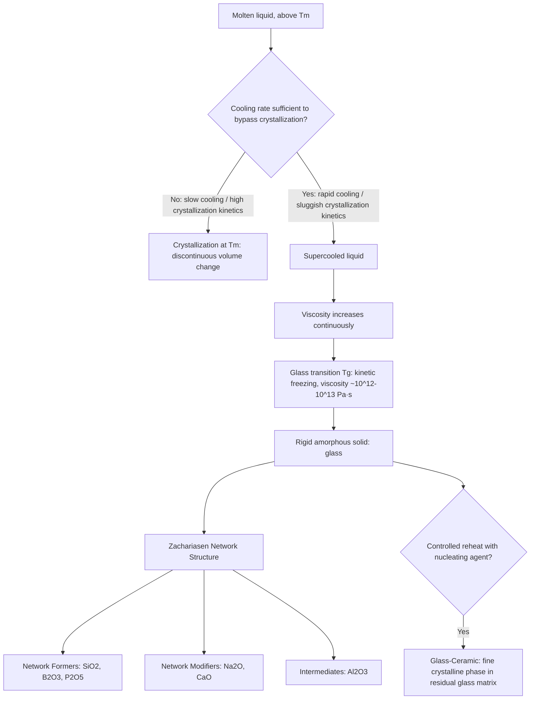

## Glass Structure and Formation

### Definition of the Glassy State

Glass is a noncrystalline (amorphous) solid formed by cooling a liquid melt fast enough to bypass crystallization, retaining the disordered atomic structure characteristic of the liquid state while exhibiting the mechanical rigidity of a solid. More precisely, glass is defined not by composition but by structural state: any material that solidifies from a melt without developing long-range periodic atomic order qualifies as a glass, meaning glasses can form from oxide systems (the most common and commercially important), metallic alloys (metallic glasses), polymers, and even some chalcogenide and halide systems — though oxide, and particularly silicate, glasses dominate structural and technical applications.

A glass retains **short-range order** (the local coordination geometry around a given atom, e.g., the tetrahedral $SiO_4$ unit in silicate glass, closely resembling that in the crystalline counterpart) while lacking **long-range order** (the periodic repetition of a unit cell extending through the material, characteristic of crystals). This distinction is the structural essence separating glass from crystalline ceramics of identical or similar composition.

### Glass Transition and Formation Kinetics

**Thermodynamic pathway**: As a liquid is cooled, it can follow one of two paths at the equilibrium melting/freezing temperature $T_m$:

1. **Crystallization** — Discontinuous volume contraction at $T_m$ as the liquid transforms to an ordered crystalline solid, releasing latent heat of fusion
2. **Glass formation** — The liquid bypasses crystallization, continuing to cool as an increasingly viscous **supercooled liquid** below $T_m$, with no discontinuous volume change at $T_m$

As the supercooled liquid continues cooling, its viscosity rises continuously (rather than dropping discontinuously as in crystallization), until at the **glass transition temperature** ($T_g$), the material's viscosity becomes so high (conventionally, viscosity of approximately $10^{12}$–$10^{13}$ Pa·s, sometimes cited as $10^{13.4}$ poise) that atomic rearrangement becomes kinetically frozen on practical experimental timescales, and the material behaves as a rigid solid despite retaining the liquid's disordered structure.

**Key distinction from crystallization**: Unlike the first-order crystallization transition (discontinuous change in volume, enthalpy, and entropy at $T_m$), the glass transition is not a true thermodynamic phase transition in the classical sense — it is better understood as a kinetic phenomenon, since $T_g$ itself depends on cooling rate. Slower cooling allows the supercooled liquid more time for structural relaxation before viscosity becomes prohibitively high, resulting in a lower observed $T_g$ and, correspondingly, a glass with somewhat lower specific volume (denser structural packing) than one formed via rapid quenching — a phenomenon with direct practical significance for glass annealing and property control.

**Specific volume-temperature behavior**: The characteristic signature distinguishing glass formation from crystallization is the specific volume (or enthalpy) versus temperature curve: crystallization produces a sharp discontinuity (step change) at $T_m$, while glass formation produces a continuous curve with a change in slope (not a discontinuity) at $T_g$, reflecting the continuous, kinetically-controlled nature of the transition rather than an abrupt structural reorganization.

### Kinetic Requirement for Glass Formation

Glass formation requires that the cooling rate be sufficiently rapid to outpace crystal nucleation and growth kinetics. This requirement is classically illustrated by **Time-Temperature-Transformation (TTT) diagrams** (analogous in concept to those used for metallic phase transformations), which plot the time required for a given fraction of crystallization to occur as a function of undercooling temperature below $T_m$, typically exhibiting a characteristic "nose" (minimum time) at intermediate undercooling where nucleation and growth rates are both appreciable.

A material's **glass-forming ability** is fundamentally governed by how readily crystal nucleation and growth can be kinetically avoided — materials with sluggish crystallization kinetics (often correlating with high melt viscosity and complex, difficult-to-nucleate crystal structures) form glass readily even at modest cooling rates, while materials with rapid crystallization kinetics require extremely fast cooling (or may not form bulk glass at all via conventional processing) to bypass crystallization.

### Structural Theory: Zachariasen's Random Network Model

The most widely applied structural framework for oxide glass formation, proposed by Zachariasen (1932), classifies constituent oxides by their structural role in the glass network:

**Network formers**: Cations that, when bonded to oxygen, form strong, directional (predominantly covalent-character) bonds within coordination polyhedra (commonly tetrahedral or triangular) that link together via bridging oxygens into a continuous, three-dimensionally disordered network extending throughout the material. Principal network formers include $SiO_2$ (tetrahedral $SiO_4$ units, the basis of the overwhelming majority of commercial glass), $B_2O_3$ (triangular $BO_3$ units, though capable of tetrahedral coordination under certain compositional conditions — see boron anomaly below), $P_2O_5$, and $GeO_2$.

**Zachariasen's rules** for oxide glass formation specify that: (1) each oxygen atom is bonded to no more than two network-forming cations; (2) the coordination number of the network-forming cation is small (typically 3 or 4); (3) the coordination polyhedra share only corners, not edges or faces, with adjacent polyhedra; and (4) at least three corners of each polyhedron are shared, ensuring a continuously connected 3D network rather than isolated chains or molecular units.

**Network modifiers**: Cations, typically alkali metals ($Na^+$, $K^+$, $Li^+$) or alkaline earth metals ($Ca^{2+}$, $Mg^{2+}$), that do not themselves form part of the continuous covalent network but instead occupy interstitial positions within it, bonding ionically to oxygen and, critically, **breaking bridging oxygen bonds** within the network structure — converting a bridging oxygen (connected to two network-former cations) into a **non-bridging oxygen** (connected to only one network-former cation, with the modifier cation providing local charge balance).

This network-breaking effect of modifiers has major practical consequence: pure $SiO_2$ (fused silica) possesses an essentially fully connected, highly cross-linked network, resulting in very high melt viscosity and correspondingly very high processing temperature (softening point near 1600°C+). Adding network modifiers (e.g., $Na_2O$ in soda-lime glass) progressively breaks network connectivity, substantially reducing melt viscosity and processing temperature — the fundamental reason commercial container and flat glass compositions incorporate substantial soda (and lime, added to improve chemical durability, which pure soda-silica glass lacks) rather than being processed as pure silica.

**Intermediates**: Cations (notably $Al^{3+}$, and in some contexts $Zn^{2+}$, $Pb^{2+}$) that cannot independently form a glass network but can substitute into network-former tetrahedral positions when charge-compensated by an adjacent modifier cation (e.g., $Al^{3+}$ substituting for $Si^{4+}$ in a tetrahedral site, with the resulting local charge deficit compensated by a nearby $Na^+$ or similar modifier ion) — a structural role technologically exploited in aluminosilicate glasses (offering improved chemical durability and mechanical strength relative to simple soda-lime compositions) and central to glass-ceramic and chemically strengthened glass technology.

### The Boron Anomaly

A notable exception/complication to straightforward network-modifier behavior occurs in borate and borosilicate glasses: as modifier oxide content increases in a borate glass system, boron coordination can shift from triangular ($BO_3$, 3-coordinate) to tetrahedral ($BO_4$, 4-coordinate) — the opposite structural response (increased network connectivity/cross-linking) than would be predicted by simple modifier-induced network breaking, before ultimately reverting to non-bridging-oxygen formation at higher modifier content. This "boron anomaly" produces characteristic non-monotonic composition-property relationships (e.g., in thermal expansion, density, and viscosity) in borosilicate glass systems and underlies borosilicate glass's valuable combination of low thermal expansion and good chemical durability — key to its use in laboratory glassware and low-thermal-expansion technical applications (e.g., Pyrex-type compositions).

### Major Commercial Glass Compositional Families

**Soda-lime-silica glass**: The dominant commercial glass composition (roughly 90%+ of glass produced by volume), typically approximately 70–74% $SiO_2$, 12–16% $Na_2O$, 5–13% $CaO$, with minor $MgO$ and $Al_2O_3$ additions. Selected for low raw material cost, good workability (relatively low melting/forming temperature due to substantial modifier content), and adequate chemical durability and mechanical properties for the overwhelming majority of container, flat (window), and general-purpose glass applications.

**Borosilicate glass**: Typically 70–80% $SiO_2$ with substantial $B_2O_3$ (7–13%) and reduced alkali content relative to soda-lime glass, offering markedly lower thermal expansion coefficient (exploiting network connectivity effects including the boron anomaly discussed above) and superior thermal shock resistance and chemical durability, at the cost of higher processing temperature and raw material cost. Used for laboratory glassware, some cookware, and technical/optical applications.

**Aluminosilicate glass**: Elevated $Al_2O_3$ content (often 15–25%) with reduced $SiO_2$, offering improved mechanical strength, higher softening temperature, and (via the intermediate structural role of $Al^{3+}$) enhanced susceptibility to ion-exchange chemical strengthening (exploited in chemically strengthened cover glass for consumer electronic devices). Also used in high-temperature technical/lighting applications given elevated softening point relative to soda-lime and borosilicate compositions.

**Lead (crystal) glass**: Substantial $PbO$ content (historically up to 24%+ in "full lead crystal") substituting partially for alkali/alkaline earth modifiers, imparting high refractive index and optical dispersion (the basis for decorative/optical "crystal" glassware's characteristic brilliance) as well as improved workability at lower temperature; use has declined in many consumer applications given lead toxicity/environmental concerns, with bismuth- and other heavy-metal-free alternatives developed for some applications.

**Fused silica (vitreous silica)**: Essentially pure $SiO_2$ glass with no significant modifier content, offering the highest softening temperature, lowest thermal expansion, and best chemical durability among common oxide glasses, at substantially higher processing cost and temperature given the fully cross-linked network structure. Used in high-temperature optical, semiconductor, and specialty technical applications where its superior thermal and optical properties justify the premium cost.

### Glass-Ceramics: Controlled Crystallization

A distinct materials category bridging glass and crystalline ceramics: **glass-ceramics** are produced by first forming a glass via conventional melt processing (exploiting glass's excellent formability while molten/viscous), then subjecting the formed glass to a controlled heat treatment schedule specifically designed to nucleate and grow a fine, uniformly distributed crystalline phase throughout the bulk material — typically requiring compositions incorporating a nucleating agent (e.g., $TiO_2$, $ZrO_2$, or noble metal particles) to promote the very high nucleation density (and correspondingly fine resultant grain size) required for useful glass-ceramic properties.

This process yields materials combining glass-like formability during initial processing with substantially improved mechanical strength, thermal shock resistance, and (depending on the specific crystalline phase developed) sometimes near-zero thermal expansion (exploited in applications such as cooktop panels and telescope mirror substrates, where dimensional stability across thermal cycling is paramount).

### Glass Structure-Formation Diagram

### Structure-Property Relationships in Glass

The network connectivity established by the formation-modifier-intermediate balance directly governs key glass properties: **viscosity and processing temperature** decrease with increasing modifier (network-breaking) content; **thermal expansion coefficient** generally increases with increasing non-bridging oxygen content (modifier addition), since a more broken, less cross-linked network permits greater thermal displacement; **chemical durability** generally decreases with increasing alkali modifier content (non-bridging oxygens and associated alkali ions provide more accessible sites for aqueous attack/ion exchange), motivating the addition of alkaline earth oxides (e.g., $CaO$ in soda-lime glass) specifically to improve durability relative to simple alkali-silicate compositions; and **mechanical properties** (elastic modulus, hardness) generally correlate with network connectivity/cross-link density, with highly connected network formers (fused silica, and aluminosilicate/borosilicate systems with substantial intermediate substitution) generally exhibiting higher modulus and hardness than heavily modified alkali-silicate compositions.

### Limitations of Standard Structural Models

- Zachariasen's random network model, while foundational and broadly predictive, is a simplified continuous-random-network description; more detailed structural characterization (via techniques such as NMR spectroscopy, neutron/X-ray diffraction pair distribution function analysis) reveals additional structural complexity in many real glass systems, including compositional clustering and intermediate-range ordering not captured by the simplest random network picture
- Glass-forming ability prediction from first principles remains imperfect; empirical glass-forming region diagrams and kinetic (TTT-diagram-based) assessment remain the primary practical tools for evaluating whether a novel composition will form bulk glass under achievable processing cooling rates
- [Inference] Because $T_g$ itself is cooling-rate dependent rather than a fixed thermodynamic constant, reported glass transition temperatures in technical literature should be interpreted alongside the measurement/processing cooling rate context where precise comparison across sources or processing conditions is required, since nominally identical compositions processed under different thermal histories can exhibit meaningfully different measured $T_g$ values

**Related Topics:**

- Glass Forming and Processing Methods (float glass, blow molding, fiber drawing)
- Glass-Ceramics and Controlled Crystallization Technology
- Chemical Strengthening and Ion Exchange in Glass
- Structure of Ceramic Materials (comparison to crystalline oxide structures)
- Thermal Properties of Ceramics (thermal expansion and shock resistance context)
- Optical Properties of Glass
- Metallic Glasses and Amorphous Metal Alloys