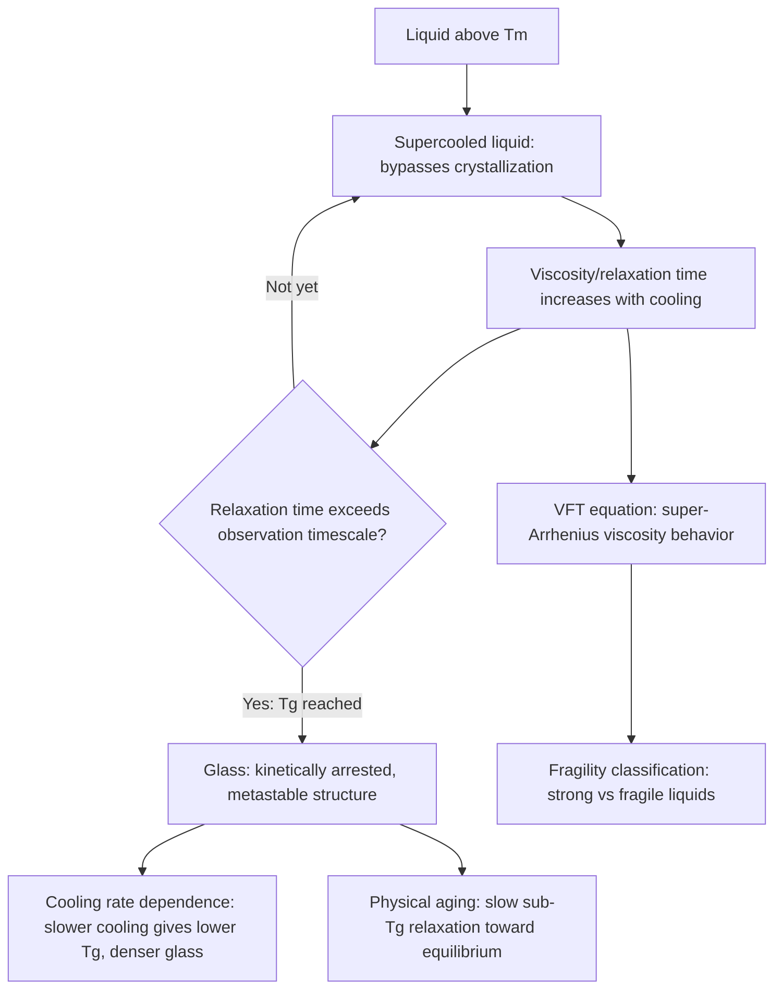

## Glass Transition Phenomena

### Definition and Phenomenological Description

The glass transition is the reversible transformation that occurs in an amorphous (noncrystalline) material as it passes between a rigid, glass-like state and a viscous, liquid-like (supercooled liquid or rubbery, in the case of polymers) state, centered on a characteristic temperature range referred to as the **glass transition temperature**, $T_g$. Unlike melting, which is a first-order thermodynamic phase transition occurring at a fixed, composition-dependent equilibrium temperature $T_m$, the glass transition is fundamentally a **kinetic phenomenon**: it marks the temperature at which molecular/atomic rearrangement (structural relaxation) becomes too slow, relative to the experimental observation timescale, for the material to maintain internal equilibrium as it cools, causing the disordered liquid structure to become effectively "frozen" into a rigid solid without developing crystalline order.

### Thermodynamic Signature of the Glass Transition

The glass transition is identified experimentally by a distinctive signature in temperature-dependent thermodynamic properties, most commonly specific volume, enthalpy, or entropy versus temperature:

**Volume/enthalpy behavior**: As a liquid is cooled through $T_m$ without crystallizing (forming a supercooled liquid), specific volume and enthalpy continue to decrease smoothly and continuously — in contrast to the discontinuous (step) drop that would occur at $T_m$ if crystallization occurred instead. As cooling continues into the glass transition region, the slope of the volume/enthalpy versus temperature curve changes (becoming shallower, more similar to that of the eventual solid glass), producing a continuous curve with a **change in slope rather than a discontinuity** — the defining thermodynamic signature distinguishing the glass transition from a true first-order phase transition like melting/crystallization.

**Heat capacity signature**: Differential scanning calorimetry (DSC) measurements typically reveal the glass transition as a step-like change (rather than a sharp peak, as would be seen for a first-order transition such as melting) in specific heat capacity ($c_p$) over a relatively narrow temperature range, reflecting the onset of additional configurational/conformational degrees of freedom becoming kinetically accessible as the material transitions from glass to supercooled liquid/rubbery behavior upon heating.

### Kinetic (Rate-Dependent) Nature of $T_g$

A central, practically significant feature of the glass transition is that $T_g$ is **not a fixed material constant** but depends on the rate at which the material is cooled (or, correspondingly, heated) through the transition region:

**Cooling rate dependence**: Slower cooling allows the supercooled liquid more time for structural relaxation (molecular/atomic rearrangement toward the liquid's instantaneous equilibrium configuration) before viscosity becomes prohibitively high for further rearrangement on the experimental timescale. This results in the liquid remaining in configurational equilibrium down to a lower temperature before becoming kinetically arrested, producing a **lower observed $T_g$** and a resulting glass with somewhat lower specific volume/enthalpy (a more densely, "relaxed" structural state) than a glass of identical composition formed via more rapid quenching.

**Approximate relationship**: The dependence of $T_g$ on cooling rate is often described (to first approximation, and within limited ranges of practically achievable cooling rates) by a relationship of the form:

$$\frac{d\ln|q|}{d(1/T_g)} \approx -\frac{Q}{R}$$

where $q$ is the cooling (or heating) rate, $Q$ is an apparent activation energy for structural relaxation, and $R$ is the gas constant — reflecting the underlying Arrhenius-type (or more precisely, for many glass-forming systems, super-Arrhenius, as discussed below) temperature dependence of the structural relaxation time governing the transition.

**Practical consequence**: This rate dependence means glass processing thermal history (cooling rate during forming, subsequent annealing treatment) directly influences the resulting glass's density, refractive index (in optical glass applications), and residual internal stress state — the basis for industrial glass annealing practice, where a controlled, slow cooling schedule through the transition region is employed specifically to minimize internal stress gradients that would otherwise develop from non-uniform cooling rates through different sections of a glass article.

### Structural Relaxation and the Vogel-Fulcher-Tammann Equation

The dramatic, highly temperature-sensitive increase in viscosity (and correspondingly, structural relaxation time) as a supercooled liquid approaches $T_g$ is frequently **non-Arrhenius** (super-Arrhenius) in character for many glass-forming systems — meaning the apparent activation energy for viscous flow itself increases as temperature decreases toward $T_g$, rather than remaining constant as simple Arrhenius behavior would predict. This behavior is commonly described empirically by the **Vogel-Fulcher-Tammann (VFT) equation**:

$$\eta(T) = \eta_0 \exp\left(\frac{B}{T - T_0}\right)$$

where $\eta$ is viscosity, $\eta_0$ and $B$ are material-specific fitting constants, and $T_0$ is the **Vogel temperature**, an extrapolated temperature (below $T_g$) at which viscosity would formally diverge to infinity — a temperature that is not itself physically reached in practice (since the material vitrifies at the higher, kinetically-defined $T_g$ before $T_0$ can be approached), but which serves as a useful parameter characterizing the "fragility" of the glass-forming liquid's approach to vitrification.

**Fragility classification**: Glass-forming liquids are classified along a spectrum from "strong" to "fragile" based on how closely their viscosity-temperature behavior follows simple Arrhenius behavior versus pronounced VFT-type super-Arrhenius curvature:

- **Strong liquids** (e.g., $SiO_2$, and other highly cross-linked network-former-dominated silicate glasses) exhibit viscosity behavior closer to Arrhenius, reflecting a relatively temperature-insensitive activation energy for structural rearrangement, consistent with their highly connected, directionally-bonded covalent network structure
- **Fragile liquids** (many molecular and ionic/modifier-rich glass-forming systems) exhibit pronounced VFT-type curvature, with structural relaxation time increasing extremely rapidly as $T_g$ is approached, reflecting a more cooperative, collective character to the structural rearrangement process in less rigidly cross-linked systems

This fragility classification connects directly to the network structure principles established in glass structure/formation: highly network-former-dominated (strongly cross-linked) compositions tend toward "strong" behavior, while heavily modified (network-broken) compositions tend toward more "fragile" behavior — though the correlation is not absolute across all glass-forming chemistries.

### Relaxation Time and the Glass Transition Criterion

The glass transition is conventionally, though somewhat arbitrarily, defined by a **structural relaxation time** reaching a specific characteristic value relative to the experimental observation timescale — commonly expressed via the empirical **viscosity criterion** of approximately $10^{12}$ Pa·s ($10^{13}$ poise), corresponding to a structural relaxation time on the order of 100–1000 seconds, roughly matching typical laboratory cooling/heating experiment timescales.

This observation-timescale dependence is the deeper physical reason behind the cooling-rate dependence of $T_g$ described above: if an experiment is conducted more slowly (allowing longer observation time at each temperature), the material remains able to structurally relax (maintain configurational equilibrium) to a lower temperature before the relaxation time exceeds the (now longer) observation timescale, and vice versa for faster experiments — meaning $T_g$ is fundamentally a statement about the relationship between a material's intrinsic relaxation kinetics and the experimental (or processing) timescale, rather than a purely material-intrinsic property in the way $T_m$ is for a well-defined crystalline phase.

### Physical Aging (Sub-$T_g$ Structural Relaxation)

Glass formed via cooling through $T_g$ is not in true thermodynamic equilibrium — it exists in a metastable, kinetically arrested state that retains "excess" volume/enthalpy relative to the (hypothetical, extrapolated) equilibrium supercooled liquid state at the same temperature. When held at temperatures below (but not too far below) $T_g$ over extended time, glass can undergo slow, continued structural relaxation toward this lower-energy equilibrium state — a phenomenon termed **physical aging**, manifesting as slow densification (volume contraction) and, in polymer glasses particularly, gradual embrittlement or property drift over service life at temperatures near but below $T_g$.

Physical aging is distinct from chemical degradation (no bond breaking/chemical reaction occurs) and is, in principle, reversible by reheating above $T_g$ and re-quenching — though in practical service, physical aging effects (particularly in polymer glasses used near their $T_g$) represent an important, sometimes underappreciated, source of long-term dimensional and mechanical property change that must be accounted for in component design and service-life prediction.

### The Glass Transition in Different Material Classes

While most extensively studied and technologically significant in **oxide (particularly silicate) glasses**, the glass transition is a general phenomenon occurring in any material capable of forming an amorphous, kinetically-arrested structural state:

- **Polymers**: The glass transition is central to polymer engineering, since it demarcates the boundary between rigid, glassy polymer behavior (below $T_g$) and rubbery/viscoelastic behavior (above $T_g$), directly determining service temperature range and mechanical behavior for amorphous and semi-crystalline polymer materials
- **Metallic glasses**: Rapidly quenched metallic alloys (bulk metallic glasses and melt-spun ribbons) exhibit a glass transition analogous in kinetic character to oxide glasses, though typically at much lower homologous temperature relative to melting point and requiring far more rapid cooling rates (or specially designed multi-component alloy compositions with intrinsically sluggish crystallization kinetics) to achieve bulk glass formation given metals' generally much faster crystallization kinetics than oxide network-former systems
- **Pharmaceutical and food science amorphous systems**: Glass transition phenomena govern stability, texture, and shelf-life behavior in amorphous pharmaceutical formulations and various food science contexts, an application area extending well beyond traditional structural/technical materials

### Measurement Techniques

**Differential Scanning Calorimetry (DSC)**: The most widely used technique, detecting $T_g$ via the characteristic step-change in heat capacity as the material transitions from glassy to supercooled-liquid/rubbery behavior during controlled heating (or, less commonly, cooling) at a specified rate.

**Dilatometry**: Direct measurement of specific volume (linear/volumetric expansion) versus temperature, detecting $T_g$ via the characteristic change in thermal expansion coefficient (slope change in the length/volume versus temperature curve) — historically significant for glass industry $T_g$ characterization and annealing point determination.

**Dynamic Mechanical Analysis (DMA)**: Measures viscoelastic response (storage modulus, loss modulus, and their ratio, $\tan\delta$) as a function of temperature, particularly valuable for polymer glass transition characterization given the pronounced modulus drop (often several orders of magnitude) and associated loss-tangent peak occurring through the glass-to-rubber transition.

Because $T_g$ measurement method and applied heating/cooling rate both influence the specific measured value (consistent with the rate-dependent kinetic character discussed above), reported $T_g$ values should generally be interpreted alongside their measurement conditions when precise comparison is required across sources or materials.

### Glass Transition Phenomena Diagram

### Practical and Engineering Significance

The kinetic, rate-dependent nature of the glass transition underlies several critical aspects of glass and amorphous polymer processing and service: **annealing** practice in glass manufacturing is specifically designed around controlled, slow cooling through the $T_g$ region to minimize residual stress from non-uniform cooling rates across a glass article's cross-section; **glass forming operations** (float glass, container forming, fiber drawing) are conducted at temperatures well above $T_g$ where viscosity is low enough for the required forming operation, with the specific viscosity-temperature relationship (itself governed by VFT-type behavior and network structure) directly determining process temperature windows; and **polymer service temperature limits** are frequently defined relative to $T_g$, since mechanical behavior (modulus, toughness, dimensional stability) changes dramatically across this transition.

### Limitations and Open Questions

- The precise theoretical nature of the glass transition remains a subject of ongoing scientific investigation; while the kinetic (relaxation-time-based) description presented here is the standard practical/engineering framework, more fundamental theoretical questions regarding the extent to which an underlying thermodynamic (rather than purely kinetic) transition might exist at very slow cooling rates approaching the Vogel temperature remain areas of active materials physics research
- [Inference] Because reported $T_g$ values in technical literature and datasheets are measurement-condition-dependent (heating/cooling rate, measurement technique) rather than absolute material constants, engineering use of published $T_g$ values for critical service-temperature or processing-window determination should account for this variability, particularly when comparing values sourced from different testing standards or laboratories
- Physical aging effects, while well-established for polymer glasses, are less commonly characterized or accounted for in inorganic oxide glass engineering practice, given the typically much lower service-temperature-to-$T_g$ ratio and correspondingly slower aging kinetics relevant to most structural oxide glass applications relative to polymers frequently used closer to their $T_g$

**Related Topics:**

- Glass Structure and Formation (Zachariasen network model, structural basis for Tg)
- Viscosity of Glass-Forming Melts and Processing Temperature Windows
- Glass Annealing and Residual Stress Management
- Metallic Glasses and Bulk Metallic Glass Alloy Design
- Polymer Structure and Thermal Transitions
- Differential Scanning Calorimetry for Materials Characterization
- Thermal Properties of Ceramics (comparison to crystalline thermal behavior)