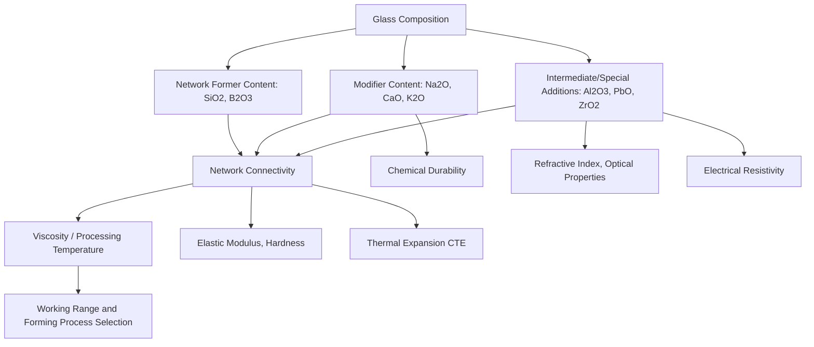

## Glass Composition and Properties

### Overview: Composition as the Primary Property Design Lever

Glass composition is the principal engineering variable through which processors and formulators control the full range of glass properties — viscosity and processing temperature, mechanical strength and elastic modulus, thermal expansion, chemical durability, electrical behavior, and optical characteristics. Because glass lacks the crystallographic phase and microstructural levers (grain size, precipitate distribution, heat treatment response) available in crystalline ceramics and metals, composition and the resulting network structure (network formers, modifiers, and intermediates, as established in glass structure and formation) serve as the dominant, and in commercial practice primary, property-control mechanism.

### Viscosity-Temperature Behavior and Processing Reference Points

Glass processing is organized around a series of standardized **reference viscosity points** along the viscosity-temperature curve, since essentially every forming, annealing, and service consideration maps to a specific viscosity range:

- **Strain point** (~$10^{14.5}$ Pa·s) — Below this viscosity, internal stresses cannot relax within practical timescales; the lower bound of the annealing range
- **Annealing point** (~$10^{12}$ Pa·s) — Approximately coincides with $T_g$; internal stress relaxes within several minutes at this viscosity, the basis for annealing schedule design
- **Softening point** (~$10^{6.6}$ Pa·s) — The temperature at which a glass fiber of standard dimensions deforms under its own weight at a specified rate; marks the upper practical limit for dimensional stability under load
- **Working point** (~$10^{3}$ Pa·s) — Viscosity at which glass can be readily formed (blown, pressed, drawn) by conventional hot-forming operations
- **Melting point (glass industry usage)** (~$10^{1}$–$10^{2}$ Pa·s) — Viscosity low enough for the melt to be adequately fined (bubble removal) and homogenized; distinct from the crystallographic melting point terminology used elsewhere in materials science

Composition directly determines the temperature at which each of these viscosity points occurs, and correspondingly the overall **working range** (temperature interval between working point and softening point) within which a given composition can be economically formed — a critical formulation consideration, since a narrow working range demands tighter process temperature control and faster forming operations than a broad working range.

### Composition-Viscosity Relationship

Network modifier content is the dominant compositional lever controlling viscosity at any given temperature, consistent with the network-breaking mechanism established in glass structure and formation: increasing alkali/alkaline-earth modifier content breaks bridging-oxygen network connectivity, reducing melt viscosity and processing temperature. This is the direct reason soda-lime-silica glass (substantial modifier content) processes at dramatically lower temperature than fused silica (essentially unmodified network), and why formulators trade off processing economy (favoring higher modifier content) against the durability and thermal properties that favor lower modifier, more highly connected network compositions.

**Alumina and other intermediate oxide additions** can increase melt viscosity at a given temperature relative to a simple alkali-silicate composition (since intermediates re-incorporate into the network structure when charge-compensated, partially offsetting modifier-induced network breaking), simultaneously improving mechanical and chemical durability properties — illustrating the characteristic multi-property trade-off inherent to glass composition design.

### Mechanical Properties

**Elastic modulus and hardness**: Generally correlate with overall network connectivity/cross-link density and average bond strength. Highly network-former-dominated compositions (fused silica, borosilicate, aluminosilicate glasses with substantial intermediate incorporation) exhibit higher elastic modulus and hardness than heavily modified alkali-silicate compositions, reflecting the more rigid, more fully cross-linked covalent network structure resisting elastic deformation.

**Strength**: As with crystalline ceramics, glass strength is fundamentally **flaw-controlled** (Griffith fracture mechanics applies directly, given glass's inherently brittle behavior), meaning measured strength depends heavily on surface flaw population (from manufacturing handling, forming process, and in-service surface damage) rather than being a fixed intrinsic material property — pristine, flaw-free glass fibers can approach theoretical strength values (several GPa) dramatically exceeding the practical strength of bulk, surface-flawed glass articles (commonly tens of MPa for ordinary annealed glass).

**Chemical strengthening (ion exchange)**: A major commercial technology for enhancing glass mechanical performance without altering bulk composition or requiring thermal tempering: aluminosilicate glass (selected specifically because $Al^{3+}$ intermediate incorporation creates favorable ion-exchange sites) is immersed in a molten salt bath (typically potassium nitrate) at temperature below $T_g$, causing smaller $Na^+$ ions in the glass surface to be replaced by larger $K^+$ ions from the bath. Because this exchange occurs below $T_g$ (where the network structure is kinetically arrested and cannot relax), the larger substituted ions are forced into the existing $Na^+$ site volume, generating a deep, durable compressive stress layer at the glass surface. Since flaw-driven fracture in brittle materials is dramatically suppressed under compressive stress (a crack cannot propagate under compression), this surface compression layer substantially increases practical strength and damage resistance — the technology underlying chemically strengthened cover glass for smartphones and other consumer electronic devices.

**Thermal tempering** (as an alternative/complementary strengthening approach): Rapid, controlled cooling of a formed glass article from near its softening point induces a compressive surface stress and balancing internal tensile stress from differential cooling/contraction between the rapidly-cooled surface and more slowly cooling interior — a distinct mechanism from ion exchange, though similarly exploiting surface compression to improve practical strength, widely used for architectural safety glass and some automotive applications given its characteristic (and safety-relevant) fragmentation behavior into small, less hazardous pieces upon fracture.

### Thermal Expansion

Coefficient of thermal expansion (CTE) in glass is governed by network connectivity, following the same general structure-property logic established for ceramics generally: highly connected, strongly-bonded network structures (fused silica, CTE ~0.5 ×10⁻⁶/°C) exhibit low CTE, while heavily modified compositions with substantial non-bridging oxygen content (soda-lime glass, CTE ~9 ×10⁻⁶/°C) exhibit considerably higher CTE, reflecting greater thermally-induced displacement permitted by the more loosely connected, less constrained network structure.

The **boron anomaly** (discussed in glass structure and formation) produces characteristically non-monotonic CTE-composition behavior in borosilicate systems, with certain compositions (exploiting the boron coordination shift toward tetrahedral, network-reinforcing behavior at intermediate modifier content) achieving notably low CTE — the compositional basis for low-expansion borosilicate glass (e.g., Pyrex-type compositions, CTE ~3.3 ×10⁻⁶/°C) valued for thermal shock resistance in laboratory and cookware applications.

Ultra-low expansion specialty glass and glass-ceramic compositions (e.g., titania-silicate glasses, and lithium aluminosilicate glass-ceramics exploiting negative-CTE crystalline phase development) extend CTE control to near-zero or even slightly negative values for applications demanding exceptional dimensional stability across temperature (precision optics, telescope mirror substrates, cooktop panels).

### Chemical Durability

Resistance to aqueous, acidic, and alkaline attack is strongly composition-dependent, following logic connected to network structure and modifier content:

**Alkali (hydrolytic) durability**: Generally decreases with increasing alkali modifier content, since non-bridging oxygens and associated mobile alkali ions provide accessible sites for ion-exchange-driven aqueous attack (alkali ions leaching from the glass surface in exchange for hydrogen ions from water, progressively degrading the surface network structure). **Alkaline earth oxide additions** (notably $CaO$ in soda-lime glass) substantially improve durability relative to simple binary alkali-silicate compositions, which is the primary compositional reason virtually all commercial soda-silica glass includes substantial lime content despite lime not being strictly required for glass formation or viscosity reduction.

**Acid resistance**: Generally good for most silicate glass compositions (silica network itself is comparatively acid-resistant), though borosilicate and high-silica compositions offer superior acid resistance relative to simple soda-lime glass in aggressive acidic service environments.

**Alkaline (basic) resistance**: Generally the most challenging durability requirement for silicate glasses, since strongly alkaline solutions can directly attack and dissolve the silica network itself (rather than the more localized ion-exchange mechanism dominant in near-neutral aqueous attack); specialized alkali-resistant glass compositions (incorporating zirconia, for example) are formulated specifically for demanding alkaline-exposure applications such as glass-fiber reinforcement of cementitious (highly alkaline) construction materials.

### Electrical Properties

**Electrical resistivity**: Glass is generally an excellent electrical insulator, though resistivity is composition-dependent — alkali-rich compositions exhibit measurably higher ionic conductivity (via alkali ion mobility through the network, particularly at elevated temperature) than low-alkali or alkali-free compositions, a consideration in specialized electronic and electrical insulator glass applications where minimizing ionic conductivity is specifically required (e.g., some electronic packaging and display glass compositions formulated as alkali-free specifically for this reason).

**Dielectric properties**: Dielectric constant and loss tangent vary with composition and are engineered for specific electronic/electromagnetic applications (substrate glass, glass-ceramic electronic packaging), generally following similar network-connectivity-related trends as other properties, though with composition-specific optimization required for demanding high-frequency electronic applications.

### Optical Properties

**Refractive index**: Strongly influenced by composition, particularly by the presence of heavy-metal-oxide modifiers/intermediates — lead oxide ($PbO$) substantially increases refractive index and optical dispersion (the basis for decorative "lead crystal" glass's optical brilliance), while alternative high-refractive-index formulations (incorporating oxides such as $La_2O_3$, $TiO_2$, or various other heavy-metal oxides) are used in optical lens and precision optical component glass where specific refractive index and dispersion (Abbe number) targets must be met.

**Transmission and color**: Determined by both the base network composition and, critically, by transition-metal or other colorant/decolorant additions — trace iron oxide contamination (common in raw materials, particularly silica sand) imparts a characteristic green tint to ordinary commercial glass unless specifically decolorized (via oxidizing agents or complementary colorant additions), while deliberate transition-metal or rare-earth oxide additions produce a wide range of engineered colored and specialty-transmission (e.g., UV-blocking, IR-absorbing) glass compositions.

### Composition-Property Summary Table

| Property | Increases With | Decreases With |
| --- | --- | --- |
| Viscosity / processing temp | Network former content ($SiO_2$), intermediate incorporation | Alkali/alkaline-earth modifier content |
| Elastic modulus / hardness | Network connectivity, intermediate incorporation | Modifier (network-breaking) content |
| Thermal expansion (CTE) | Modifier content, non-bridging oxygen fraction | Network former content (with boron anomaly exception) |
| Chemical durability | Alkaline earth content ($CaO$), network former content | Alkali modifier content (uncompensated) |
| Electrical resistivity | Low alkali content, network connectivity | Alkali ion content/mobility |
| Refractive index | Heavy-metal oxide content (PbO, La₂O₃, TiO₂) | Low-atomic-number network former dominance |

### Composition-Property Relationship Diagram

### Composition Design as a Multi-Property Optimization

Practical glass formulation is rarely a single-property optimization; commercial compositions represent deliberate compromises among competing requirements — soda-lime container glass sacrifices some chemical durability and thermal shock resistance relative to borosilicate for substantially lower processing cost and temperature; borosilicate laboratory glass accepts higher raw material and processing cost for superior thermal shock resistance and durability; aluminosilicate cover glass accepts higher processing complexity to enable ion-exchange strengthening. This composition-driven, multi-property trade-off structure is a defining characteristic of glass engineering, directly paralleling (while differing mechanistically from) the composition/microstructure trade-offs central to alloy and structural ceramic design.

### Limitations and Formulation Challenges

- Composition-property relationships, while following well-established general trends (network connectivity, modifier content), are not always simply additive or linearly predictable across complex multi-component commercial compositions, given interaction effects (such as the boron anomaly) and the influence of minor/trace component chemistry (colorants, fining agents, trace impurities) on final properties
- Chemical durability testing and prediction remain more empirically-driven than first-principles-predictable, given the complexity of aqueous glass-surface interaction mechanisms and their sensitivity to solution chemistry, temperature, and exposure duration beyond simple bulk composition
- [Inference] Achieving simultaneous optimization across multiple demanding property targets (e.g., very low CTE together with high chemical durability and low processing temperature) often requires increasingly complex, higher-cost multi-component formulations, since the underlying network-former/modifier/intermediate compositional levers frequently drive competing properties in the same direction — making genuinely novel, broadly superior glass compositions comparatively difficult to develop relative to optimizing within an established compositional family

**Related Topics:**

- Glass Structure and Formation (Zachariasen network model underlying composition effects)
- Glass Transition Phenomena (viscosity reference points, processing temperature windows)
- Chemical Strengthening and Ion Exchange Technology
- Thermal Properties of Ceramics (comparative CTE and thermal shock context)
- Mechanical Behavior of Ceramics (flaw-controlled strength, Weibull statistics applied to glass)
- Optical Glass Design and Refractive Index Engineering
- Glass-Ceramics and Controlled Crystallization