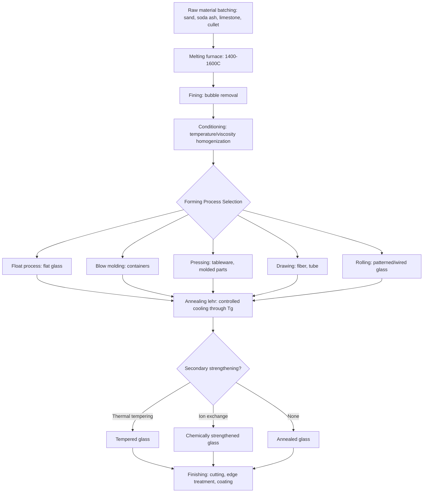

## Glass Processing and Forming

### Overview and Process Sequence

Glass processing and forming encompasses the full production sequence from raw material batching through melting, shaping, and finishing of glass articles, exploiting glass's characteristic property of continuous, reversible viscosity change with temperature (rather than a sharp melting point) to enable a wide range of hot-forming techniques not available to crystalline materials. The general process sequence — batching, melting/fining, forming, annealing, and finishing — applies across the great majority of commercial glass products, with the specific forming method selected according to product geometry, production volume, and required dimensional/optical precision.

### Raw Material Batching

Glass batch formulation combines the primary network-forming oxide source (typically high-purity silica sand for silicate glass) with modifier and intermediate oxide sources — commonly soda ash ($Na_2CO_3$) for $Na_2O$, limestone/dolomite for $CaO$/$MgO$, and various other raw materials depending on target composition — along with minor additions including fining agents (compounds that release gas at melting temperature to assist bubble removal, such as sodium sulfate or antimony/arsenic compounds in specialty applications), colorants/decolorants, and, increasingly in commercial practice, substantial recycled glass ("cullet") content, which reduces energy consumption (cullet melts at lower temperature than raw batch materials) and raw material cost while reducing environmental impact.

Batch homogeneity and precise proportioning are critical, since compositional inconsistency propagates directly into viscosity, working-range, and final property variability — batch mixing and weighing systems in modern glass manufacturing are highly automated and closely controlled for this reason.

### Melting and Fining

**Melting furnaces**: Large-scale commercial glass production predominantly uses continuous regenerative or recuperative furnaces (often natural-gas or oil fired, with increasing adoption of electric boosting and, in some newer installations, full electric melting for emissions reduction), where batch materials are continuously charged at one end and molten, fined, and conditioned glass is continuously withdrawn at the forming end, typically operating at melting zone temperatures in the range of 1400–1600°C for common commercial silicate compositions (temperature requirements scale with network former content and overall composition, per the viscosity-composition relationships established in glass composition and properties).

**Fining (refining)**: The process of removing bubbles and achieving chemical/thermal homogeneity in the melt prior to forming. Fining agents decompose at elevated temperature to release gas, which nucleates and grows existing small bubbles, increasing their buoyancy and accelerating their rise and escape from the melt — a critical quality step, since residual bubbles (seeds) represent both an aesthetic defect and, in structural/technical glass applications, a stress-concentrating flaw directly relevant to the flaw-controlled fracture behavior established in glass composition and properties.

**Conditioning**: After fining, the melt is cooled (while remaining well above the working point) and homogenized in a conditioning/working end section of the furnace to achieve the precise, uniform temperature and viscosity required for the specific downstream forming process.

### Major Forming Processes

**Float glass process**: The dominant process for flat (sheet) glass production, accounting for the substantial majority of architectural and automotive flat glass manufactured globally. Molten glass is continuously poured onto a bath of molten tin (selected for its suitable density relative to glass, chemical compatibility, and appropriate melting/boiling point range relative to glass forming temperature), where the glass spreads to a naturally uniform thickness (governed by the equilibrium between gravity and surface tension, producing a characteristic "equilibrium thickness" around 6-7mm absent additional process control, with thinner or thicker product achieved via controlled stretching or damming) while floating on the tin surface, which provides an exceptionally flat, fire-polished (undistorted) surface finish without requiring mechanical grinding/polishing. The glass ribbon is then cooled sufficiently to be lifted from the tin bath without surface damage and passed into an annealing lehr.

**Blow molding**: Used for hollow glass articles (bottles, jars, light bulbs), where a gob or gather of molten glass is shaped, via air pressure applied within a mold cavity, into the hollow final form. Commercial container manufacturing typically employs either the **press-and-blow process** (glass initially pressed into a parison/preform shape, then blown to final form in a second mold — generally preferred for wide-mouth containers) or the **blow-and-blow process** (glass blown into a parison shape then reblown to final form — generally preferred for narrow-neck containers), both executed at high speed on automated individual section (IS) machines in modern container manufacturing.

**Pressing**: Molten glass gob is formed between a mold and plunger under mechanical pressure, used for items such as glass tableware, some lighting components, and various molded technical glass articles requiring good dimensional precision on non-hollow or simply-shaped geometries.

**Drawing**: Continuous extraction of glass in an elongated form directly from the melt or a feeder, including:

- **Fiber drawing** — Continuous drawing of fine glass fiber (for textile glass fiber, fiber-reinforced composite reinforcement, and specialty applications such as optical fiber) from a bushing or preform, exploiting the very high length-to-diameter ratio achievable via controlled viscous drawing at appropriate working-range viscosity
- **Tube drawing** — Continuous drawing of glass tubing (for pharmaceutical, laboratory, and lighting applications) via processes such as the Danner or Vello processes, where molten glass is drawn over a rotating mandrel or through a die while simultaneously applying internal air pressure to control tube diameter and wall thickness
- **Sheet drawing** (largely historical, predating float glass dominance) — Vertical or horizontal drawing of flat glass directly from the melt, now largely superseded by the float process for standard flat glass given the float process's superior surface quality and economics

**Rolling**: Molten glass passed between water-cooled rollers to form sheet or patterned glass, used for wired glass, patterned/textured architectural glass, and some specialty sheet products where the float process's optical-quality flat surface is not required or where surface texturing is specifically desired.

**Centrifugal (spin) casting**: Used for certain specialty and technical glass articles (e.g., some large optical blanks, glass fiber insulation manufacture via fiberization) where centrifugal force is exploited for shaping or fiber formation.

### Annealing

Following forming, glass articles must be **annealed** — subjected to a controlled, gradual cooling schedule through the glass transition temperature region — to relieve internal stresses that develop from non-uniform cooling rates across the article's cross-section during forming (surface regions cool and become rigid before interior regions, and if cooling proceeds too rapidly and without subsequent controlled reheating/holding, this differential contraction generates residual internal stress).

**Annealing lehr**: A long, temperature-controlled tunnel oven through which formed glass articles pass on a conveyor, first reheated to (or held near) the annealing point (a viscosity of approximately $10^{12}$ Pa·s, as established in glass transition phenomena), held sufficiently long for stress relaxation to occur throughout the article cross-section, then cooled at a carefully controlled, sufficiently slow rate through the transition region down to the strain point and below, to avoid regenerating significant new stress during the cooling itself.

Inadequately annealed glass exhibits residual stress detectable via **polariscope (photoelastic) examination**, exploiting stress-induced birefringence in glass — a standard quality control technique in glass manufacturing given the direct link between residual stress and reduced mechanical strength/increased fracture risk (residual tensile stress at or near the surface is particularly detrimental, since it adds directly to service-applied tensile stress in the region most susceptible to flaw-driven fracture initiation).

### Secondary Strengthening Processes

Following annealing, many glass products undergo additional strengthening treatment, building on the composition-dependent mechanisms established in glass composition and properties:

**Thermal tempering**: Reheating the annealed article to near its softening point, then rapidly quenching (typically via forced air jets) to induce a compressive surface stress layer balanced by internal tensile stress, substantially improving mechanical strength and producing the characteristic small-fragment fracture behavior valued in safety glass applications (architectural, automotive side/rear glazing).

**Chemical strengthening (ion exchange)**: As established in glass composition and properties, immersion of (typically aluminosilicate) glass in a molten alkali salt bath below $T_g$ to develop a deep, durable compressive surface layer via ion exchange — used where tempering is impractical (thin glass, complex shapes) or where superior edge strength and damage resistance are required, notably for consumer electronic cover glass.

### Finishing Operations

**Cutting**: Scoring (typically via a hard wheel or, increasingly, laser scoring for precision applications) followed by controlled fracture along the score line, the standard method for separating flat glass into final dimensions.

**Grinding and polishing**: Mechanical removal of surface material to achieve precise dimensional tolerance and optical-quality surface finish, required for optical components and some technical glass applications where as-formed surface quality is insufficient.

**Edge finishing (seaming/beveling)**: Mechanical treatment of cut glass edges to remove sharp, flaw-prone edge features (a significant source of strength-limiting flaws given the flaw-controlled fracture behavior of glass), both for safety and to reduce edge-initiated fracture risk in service.

**Coating**: Application of functional coatings — low-emissivity (low-E) coatings for architectural energy performance, anti-reflective coatings for optical/display applications, and various decorative or functional (anti-microbial, self-cleaning) surface treatments — via processes including magnetron sputtering (widely used for architectural low-E coating, applied as an "off-line" post-forming process) and pyrolytic/chemical vapor deposition coating (in some cases applied "on-line" during the float process itself, exploiting residual process heat).

### Process Flow Overview

### Process Selection Considerations

Forming process selection is governed primarily by product geometry (flat versus hollow versus fiber/tube form), production volume and economics (float and IS-machine container forming are highly automated, high-volume, continuous processes; pressing and specialty forming methods better suit lower-volume or more geometrically complex products), and required dimensional/optical/surface quality (float glass's fire-polished surface is generally unmatched by rolling or other mechanical forming methods without subsequent grinding/polishing). Quality and process control throughout — batch consistency, melt homogeneity, forming temperature/viscosity control, and annealing schedule — directly determine the residual stress state, dimensional precision, and ultimately the flaw population governing final product mechanical performance, tying process control directly back to the flaw-sensitive fracture behavior fundamental to glass (and ceramic) mechanical behavior generally.

### Advantages of Glass Forming Processes

- Continuous, high-viscosity-range hot forming enables a very broad range of achievable geometries (flat sheet, complex hollow ware, fine fiber) from a single starting melt
- Float process in particular achieves exceptional flat-glass surface quality without mechanical finishing, a major economic and quality advantage over historical drawn/rolled sheet processes
- High-volume automated forming (float, container IS machines) achieves low unit cost at large production scale
- Fiber drawing enables production of glass fiber with mechanical properties (strength) approaching theoretical values, given the minimal surface flaw population achievable in continuously drawn, pristine fiber surfaces

### Limitations and Process Challenges

- Annealing is time- and energy-intensive, representing a significant fraction of total processing time/cost for many glass products, and inadequate annealing directly and significantly compromises final product strength and reliability
- Forming process temperature windows are narrow and composition-specific (per the viscosity reference points established in glass composition and properties), requiring tight process temperature control, particularly for compositions with narrow working ranges
- Cullet (recycled glass) content, while economically and environmentally beneficial, requires careful color/composition sorting to avoid introducing contamination or colorant inconsistency into new production batches
- [Inference] As architectural and technical glass performance requirements continue to increase (e.g., demand for thinner, higher-strength cover glass, or more complex multi-functional coating stacks), process control tolerances across the batching-melting-forming-annealing-coating sequence are correspondingly tightened, likely increasing the relative importance of in-line process monitoring and quality control technology compared to historical glass manufacturing practice

**Related Topics:**

- Glass Structure and Formation (viscosity behavior underlying forming process windows)
- Glass Transition Phenomena (annealing point, strain point references)
- Glass Composition and Properties (composition-dependent working range and strengthening chemistry)
- Chemical Strengthening and Ion Exchange Technology
- Mechanical Behavior of Ceramics (flaw-controlled fracture applied to glass)
- Residual Stress Measurement via Photoelasticity
- Low-Emissivity and Functional Glass Coating Technology