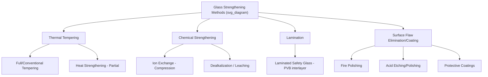

## Strengthening of Glass

### Overview and Failure Mechanism of Glass

Glass, as a brittle amorphous material, exhibits a large discrepancy between its theoretical strength and its observed practical strength. The theoretical cohesive strength of silicate glass, estimated from bond energy considerations, is on the order of 14–35 GPa, yet annealed commercial glass typically fails at only 30–100 MPa.

This discrepancy is explained by the **Griffith theory of brittle fracture**, which attributes low observed strength to the presence of microscopic surface flaws (Griffith flaws) that act as stress concentrators:

$$\sigma_f = \sqrt{\frac{2E\gamma_s}{\pi c}}$$

where:

- $\sigma_f$ = fracture stress
- $E$ = Young's modulus
- $\gamma_s$ = surface energy
- $c$ = half-length of the critical surface flaw

Since glass is amorphous and lacks plastic deformation mechanisms (no dislocation motion, no slip systems), it cannot blunt or arrest a propagating crack. Fracture initiates almost exclusively from surface flaws introduced during forming, handling, or environmental exposure (moisture-assisted stress corrosion, or "static fatigue"). Consequently, **strengthening of glass focuses primarily on protecting or compensating for surface flaws**, rather than modifying bulk atomic bonding.

**Key Points**

- Bulk glass strength is intrinsically high; practical strength is flaw-limited
- Strengthening strategies work by introducing a surface (or near-surface) residual compressive stress layer, which must be overcome by applied tensile stress before any surface flaw can propagate
- The general principle: applied tensile stress at the surface = external load stress − residual compressive stress; failure occurs only once this net stress exceeds the flaw's critical fracture stress

### Classification of Strengthening Methods

### Thermal Tempering

**Process**

Thermal tempering involves heating glass above its glass transition/softening range (typically 600–700°C for soda-lime glass) followed by rapid, uniform quenching (usually with air jets). The surface cools and contracts (solidifies) rapidly while the interior remains hot and viscous; as the interior subsequently cools and contracts, it is constrained by the already-rigid surface layer, generating a stress profile:

- **Surface**: high residual compressive stress
- **Core (mid-plane)**: balancing tensile stress

**Typical stress profile**

$$\sigma(x) = \sigma_c \left[3\left(\frac{2x}{t}\right)^2 - 1\right]$$

where $\sigma_c$ is the mid-plane tensile stress, $x$ is the distance from mid-plane, and $t$ is the glass thickness — giving the characteristic parabolic stress distribution through thickness, with compression at both surfaces and tension in the core.

**Typical values (soda-lime float glass)**

| Property | Annealed | Fully Tempered |
| --- | --- | --- |
| Surface compressive stress | ~0 MPa | 100–150 MPa (code minimum, often higher) |
| Bending strength | 30–50 MPa | 150–200+ MPa (4–5× increase) |
| Fracture behavior | Sharp shard fragments | Dices into small, blunt fragments (safety glazing) |

**Heat-Strengthened Glass**

A lower-stress variant produced by slower quench rates, yielding intermediate surface compression (24–52 MPa typical), roughly double the strength of annealed glass but retaining a fracture pattern closer to annealed glass (larger fragments, not fully dicing) — used where full temper's dicing behavior is undesirable but added strength is needed.

**Key Points**

- Thickness minimum generally required for conventional tempering (typically ≥ 2.5–3 mm) since sufficient thermal gradient must develop between surface and core
- Once tempered, glass cannot be cut, drilled, or edge-worked — the stored strain energy causes catastrophic fragmentation if the surface compression layer is breached
- Edge quality prior to tempering is critical, since edges see lower compressive stress development and are more failure-prone

### Chemical Strengthening (Ion Exchange)

**Mechanism**

Chemical strengthening replaces smaller alkali ions (typically Na⁺) in the glass surface network with larger alkali ions (typically K⁺) via immersion in a molten salt bath (commonly molten KNO₃) at temperatures below the glass transition temperature ($T_g$), typically 380–450°C.

Because the larger K⁺ ion must occupy the site vacated by the smaller Na⁺ ion, and diffusion occurs while the glass network is rigid (below $T_g$), the ion exchange forces local expansion of the glass structure at the surface, generating a compressive stress layer without any change in macroscopic shape.

**Diffusion-controlled process**

The ion exchange depth follows a diffusion relationship:

$$c(x,t) = c_0 \, \text{erfc}\left(\frac{x}{2\sqrt{Dt}}\right)$$

where $D$ is the interdiffusion coefficient (temperature-dependent), $t$ is immersion time, and $x$ is depth from the surface.

**Comparison: Thermal Tempering vs. Chemical Strengthening**

| Characteristic | Thermal Tempering | Chemical (Ion Exchange) |
| --- | --- | --- |
| Compressive layer depth | Deep (~20% of thickness, whole parabolic profile) | Shallow (typically 20–100 μm, depends on process time) |
| Surface compressive stress | 100–150 MPa | Can exceed 600–900 MPa (e.g., Gorilla Glass-type products) |
| Applicable to thin/complex shapes | Limited (needs sufficient thickness/thermal mass) | Excellent — works on thin (<1 mm) and complex geometries |
| Post-process cutting/machining | Not possible | Not possible (compromises compression layer) |
| Typical use | Architectural, automotive, appliance glass | Mobile device cover glass, aerospace canopies, pharmaceutical vials |
| Process temperature | Above $T_g$ (fully viscous surface state) | Below $T_g$ (rigid network, stress from ion size mismatch) |

**Key Points**

- Because the compressive layer is shallow, chemical strengthening is highly vulnerable to deep flaws (e.g., sharp scratches) that penetrate through the compression layer into the tensile region beneath, which can cause the glass to fail at lower loads than an equivalent flaw in tempered glass with a deeper compression layer
- Aluminosilicate and other specialty glass compositions (higher alkali content, more open network structure) are typically used as substrates for ion exchange, as they exchange ions more readily and achieve higher stress magnitudes than standard soda-lime glass

### Lamination (Composite Strengthening)

Laminated glass consists of two or more glass plies bonded with a polymer interlayer (commonly polyvinyl butyral, PVB, or ethylene-vinyl acetate, EVA) under heat and pressure (autoclave process). While lamination does not intrinsically raise the fracture stress of the glass itself, it provides:

- Post-fracture structural integrity (fragments adhere to the interlayer rather than separating)
- Improved impact energy absorption and penetration resistance
- Sound and UV attenuation as secondary benefits

Laminated glass is often combined with heat-strengthened or fully tempered plies to achieve both elevated fracture strength and safe post-breakage behavior (e.g., automotive windshields, architectural blast/hurricane glazing, bullet-resistant laminates).

### Surface Flaw Elimination and Protective Approaches

Since Griffith flaws are the root cause of strength limitation, several methods aim to remove or passivate existing surface flaws rather than superimpose a compressive stress field:

- **Fire polishing**: Reheating the glass surface to the softening point allows surface tension to smooth out microcracks, restoring near-pristine strength (used in glass fiber and container manufacturing)
- **Acid etching (HF-based)**: Chemically dissolves the flawed surface layer, removing crack tips and increasing measured strength; used in research and specialty high-strength fiber production
- **Protective coatings**: Polymeric or inorganic coatings (e.g., on glass fiber and glass containers) prevent mechanical abrasion and moisture-assisted stress corrosion (subcritical crack growth) that would otherwise degrade strength over time in service
- **Edge finishing (seaming, polishing)**: Reduces the severity of edge flaws introduced during cutting, which are common failure origins in architectural and automotive glass

### Static Fatigue and Environmental Effects

Glass strength is time- and environment-dependent due to **stress corrosion cracking**, in which water molecules react with strained Si–O–Si bonds at a crack tip, enabling sub-critical crack growth even at stresses below the instantaneous fracture strength:

$$\text{Si–O–Si} + \text{H}_2\text{O} \rightarrow \text{2 Si–OH}$$

This mechanism is described by a crack velocity–stress intensity relationship (Region I, moisture-controlled):

$$v = A K_I^n$$

where $v$ is crack velocity, $K_I$ is the stress intensity factor, and $A$, $n$ are material/environment-dependent constants (subcritical crack growth index $n$ is typically 15–20 for soda-lime silicate glass in humid air).

**Key Points**

- Strengthening treatments (tempering, ion exchange) indirectly mitigate static fatigue by keeping surface flaws under compressive stress, which suppresses $K_I$ at the flaw tip during service
- Design strength values for structural glass therefore typically incorporate a time-dependent (fatigue) safety factor rather than relying purely on short-term fracture strength testing

### Testing and Quality Assessment

- **Surface compression measurement**: Surface polariscopes (photoelastic stress measurement) using the stress-optic effect; instruments such as GASP (Glass Analysis Stress Predictor) or scattered-light polariscopes (SCALP) measure both surface compressive stress (CS) and depth of layer (DOL)
- **Fragmentation test**: Standard test (e.g., ASTM C1048, EN 12150) evaluates fragment count/pattern per unit area for tempered glass to confirm safety-glazing dicing behavior
- **Four-point or ring-on-ring bend testing**: Determines flexural strength distribution, often analyzed using Weibull statistics due to the flaw-population-controlled nature of glass fracture

$$P_f = 1 - \exp\left[-\left(\frac{\sigma}{\sigma_0}\right)^m\right]$$

where $P_f$ is probability of failure, $\sigma_0$ is the characteristic strength, and $m$ is the Weibull modulus (a measure of strength scatter — lower $m$ indicates more variable flaw population and greater scatter in observed strength).

**Example**

A soda-lime float glass panel with an annealed strength of ~40 MPa (design/allowable, not mean fracture stress) can achieve a design allowable stress of roughly 80–100 MPa when fully tempered, illustrating the typical strength multiplication factor applied in structural glass codes (e.g., ASTM E1300 for structural glass design uses different load-duration and glass-type factors reflecting this multiplication).

### Applications Summary

| Strengthening Method | Typical Applications |
| --- | --- |
| Full temper | Automotive side/rear windows, shower doors, furniture glass, architectural safety glazing |
| Heat-strengthened | Architectural facades subject to thermal stress, where dicing fracture is undesirable |
| Chemical (ion exchange) | Smartphone/tablet cover glass, aircraft canopies/windows, pharmaceutical vials, optical lenses |
| Laminated | Windshields, hurricane/blast-resistant glazing, bullet-resistant glass, structural glass floors/stairs |
| Fire-polished/coated fiber | Glass fiber reinforcement, fiber optics, glass containers |

**Next Steps**

- Griffith theory and fracture mechanics of brittle materials
- Glass composition and network structure (silicate glass formers, modifiers, intermediates)
- Stress corrosion cracking and subcritical crack growth kinetics
- Weibull statistics for brittle material strength design
- Glass-ceramics and their strengthening/crystallization mechanisms
- Structural glass design codes (ASTM E1300, EN 16612)