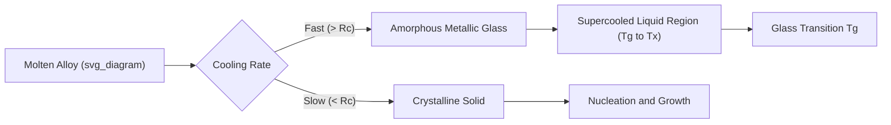

## Metallic Glasses and Amorphous Alloys

### Definition and Structural Characteristics

Metallic glasses (also termed amorphous alloys or glassy metals) are metallic materials that lack long-range crystallographic periodicity, retaining a liquid-like, disordered atomic arrangement frozen in upon rapid solidification. Unlike conventional crystalline metals, metallic glasses exhibit only short-range order (SRO) and medium-range order (MRO) extending to a few atomic diameters, with no translational symmetry or grain boundaries.

**Key Points**

- Structure is typically described by dense random packing of hard spheres (DRPHS) models or, more recently, efficient cluster-packing models involving solute-centered atomic clusters
- Absence of dislocations, grain boundaries, and stacking faults fundamentally changes deformation and fracture behavior compared to crystalline alloys
- X-ray/neutron diffraction patterns show broad diffuse halos rather than sharp Bragg peaks, confirming the absence of long-range order

### Formation Requirements: The Three Empirical Rules

Amorphous alloy formation requires suppressing nucleation and growth of crystalline phases during cooling, generally guided by three empirical rules (Inoue's rules) for bulk metallic glass (BMG) formers:

1. **Multicomponent systems** (typically ≥3 elements) — increases configurational complexity, frustrating crystallization
2. **Significant atomic size mismatch** between constituent elements (generally >12%) — promotes dense random packing and increases the energy barrier for the atoms to rearrange into a crystal lattice
3. **Negative heats of mixing** among the principal constituent elements — increases the thermodynamic driving force to remain in a liquid-like mixed state and raises the viscosity of the melt near $T_g$

### Glass Formation and Critical Cooling Rate

Amorphous structure is achieved by cooling a liquid alloy fast enough to bypass the crystallization "nose" of a Time-Temperature-Transformation (TTT) diagram before nucleation and growth can occur.

**Critical Cooling Rate ($R_c$)**

The minimum cooling rate required to avoid detectable crystallization. Historically, conventional metallic glasses (binary alloys, e.g., Au-Si, Fe-B) required extremely high cooling rates:

$$R_c \sim 10^5 \text{–} 10^6 \text{ K/s}$$

necessitating rapid solidification techniques limiting section thickness to micrometers (ribbons, thin films, powders).

**Reduced Glass Transition Temperature**

A widely used empirical predictor of glass-forming ability (GFA):

$$T_{rg} = \frac{T_g}{T_l}$$

where $T_g$ is the glass transition temperature and $T_l$ is the liquidus temperature. Higher $T_{rg}$ (closer to 1) correlates with better glass-forming ability and lower required cooling rates.

**Supercooled Liquid Region**

The temperature interval between $T_g$ and the onset of crystallization $T_x$:

$$\Delta T_x = T_x - T_g$$

A wide $\Delta T_x$ indicates high thermal stability of the supercooled liquid against crystallization and is a key criterion for bulk (thick-section) glass formers.

### Bulk Metallic Glasses (BMGs)

The discovery of multicomponent alloy systems with dramatically reduced critical cooling rates (as low as 1–100 K/s) enabled **bulk metallic glasses** — amorphous alloys castable in section thicknesses from millimeters up to several centimeters, rather than being limited to thin ribbons or powders.

**Notable BMG systems**

| System | Representative Composition | Critical Casting Thickness |
| --- | --- | --- |
| Zr-based | Zr₄₁.₂Ti₁₃.₈Cu₁₂.₅Ni₁₀Be₂₂.₅ (Vitreloy 1) | ~25–50 mm |
| Pd-based | Pd₄₀Ni₄₀P₂₀ | ~25–72 mm (highest reported GFA) |
| Fe-based | Fe-Cr-Mo-C-B systems | ~a few mm |
| Mg-based | Mg-Cu-Y, Mg-Ni-Nd | ~few mm |
| Ti-based | Ti-Zr-Cu-Ni-Sn | ~few mm |
| Ca-based | Ca-Mg-Cu | ~few mm |

[Unverified] Exact critical casting thicknesses vary across literature sources depending on processing conditions and measurement criteria (e.g., X-ray amorphicity vs. DSC confirmation), so values should be treated as representative rather than absolute.

### Processing Routes

**Rapid Solidification Techniques**

- **Melt spinning**: Molten alloy ejected onto a rapidly rotating copper wheel, producing thin ribbons (~20–50 μm thick) at cooling rates ~10⁵–10⁶ K/s; the original and still widely used technique for conventional (ribbon) metallic glasses
- **Splat quenching**: Rapid quenching between two plates or via piston-anvil techniques for small samples
- **Melt spinning/planar flow casting**: Used industrially for amorphous magnetic ribbon production (e.g., transformer core materials)

**Bulk Casting Techniques (for BMGs)**

- **Copper mold casting**: Injection or suction casting of molten alloy into water-cooled copper molds, achieving cooling rates sufficient for BMG formation in thicker sections
- **Water quenching in fused silica tubes**: Used for high-GFA alloys such as Pd-based systems
- **Die casting**: Adapted for commercial BMG component production (e.g., in electronics casings, sporting goods)

**Other Amorphization Routes**

- **Mechanical alloying**: High-energy ball milling induces amorphization through severe plastic deformation and solid-state diffusion, without melting
- **Vapor deposition**: Sputtering or thermal evaporation onto cooled substrates for thin-film amorphous coatings
- **Ion irradiation**: Amorphization of crystalline material via radiation damage accumulation

### Mechanical Properties

Metallic glasses exhibit a distinctive property combination that differs significantly from their crystalline counterparts:

| Property | Typical Behavior in Metallic Glasses |
| --- | --- |
| Yield strength | Very high (often 2–3× the crystalline alloy of similar composition); e.g., Zr-based BMGs ~1.5–2 GPa |
| Elastic strain limit | Large, up to ~2% (vs. ~0.2% typical for crystalline metals) |
| Young's modulus | Generally lower than crystalline counterpart of similar composition |
| Ductility (tension) | Near-zero macroscopic tensile ductility at room temperature — highly brittle in tension |
| Ductility (compression/bending) | Can show limited plasticity via shear band formation |
| Fracture toughness | Highly composition-dependent; ranges from very low (brittle, e.g., some Fe-based BMGs) to exceptionally high (e.g., certain Pd-based and Zr-Ti-based BMGs, comparable to tough steels) |

**Deformation Mechanism: Shear Banding**

In the absence of dislocations, plastic deformation in metallic glasses at room temperature occurs via highly localized **shear bands** (10–20 nm thick regions of intense shear strain), rather than homogeneous slip. This localization:

- Leads to catastrophic failure once a single dominant shear band propagates across the sample (limited work-hardening capacity)
- Produces characteristic "vein pattern" fracture surfaces, indicative of local adiabatic heating and softening within the shear band during fracture

$$\tau_y \approx 0.02\,G$$

as a rough empirical estimate relating shear yield strength $\tau_y$ to shear modulus $G$ — notably higher than the ~$G/1000$ to $G/100$ range typical of crystalline metals limited by dislocation motion, consistent with the absence of easy dislocation-mediated slip.

**High-Temperature Deformation**

Above $T_g$, in the supercooled liquid region, metallic glasses can exhibit **homogeneous, superplastic-like flow** with very high strain-rate sensitivity, enabling net-shape thermoplastic forming (analogous to blow-molding of oxide glasses) — a key processing advantage exploited in BMG component manufacturing.

### Physical and Functional Properties

- **Soft magnetic behavior**: Fe- and Co-based amorphous alloys exhibit very low coercivity and high permeability due to the absence of magnetocrystalline anisotropy (no crystal lattice to pin domain walls), combined with low core losses — widely used in transformer cores and magnetic sensors
- **Corrosion resistance**: Chemical homogeneity and absence of grain boundaries (common sites for localized corrosion in crystalline alloys) often give metallic glasses, especially Fe-Cr-based and Ni-based systems, superior corrosion resistance compared to their crystalline counterparts
- **Elastic energy storage**: High yield strength combined with large elastic strain limit makes BMGs attractive for elastic strain energy storage applications (e.g., springs, golf club heads)

### Applications

- **Soft magnetic cores**: Amorphous Fe-Si-B ribbons for distribution transformer cores (reduced core losses vs. silicon steel)
- **Sporting goods**: Zr-based BMG golf club heads, tennis racket components (exploiting high elastic limit and energy return)
- **Structural/precision components**: BMG gears, micro-electromechanical system (MEMS) components, exploiting net-shape thermoplastic formability and high hardness
- **Electronics casings**: Consumer electronics housings exploiting high strength-to-weight ratio and surface finish quality achievable via BMG casting
- **Biomedical**: Investigated for implants due to combination of corrosion resistance and mechanical compatibility, though biocompatibility of specific alloying elements (e.g., Ni, Be in some BMG systems) requires careful evaluation [Inference — application viability depends heavily on specific alloy toxicity profile]
- **Coatings**: Amorphous alloy coatings for wear and corrosion protection via thermal spray or laser cladding

### Characterization Techniques

- **X-ray/neutron diffraction**: Confirms amorphous structure via absence of sharp Bragg peaks (broad diffuse halo)
- **Differential Scanning Calorimetry (DSC)**: Identifies $T_g$, $T_x$, and crystallization exotherms; used to quantify $\Delta T_x$ and assess thermal stability
- **Transmission Electron Microscopy (TEM)**: High-resolution imaging to confirm absence of crystalline lattice fringes; used to study medium-range order and shear band structure
- **Atom probe tomography**: Used to investigate compositional homogeneity and potential nanoscale phase separation

### Comparison: Metallic Glass vs. Conventional Crystalline Alloy

| Characteristic | Metallic Glass | Crystalline Alloy |
| --- | --- | --- |
| Atomic structure | Amorphous, no long-range order | Periodic crystal lattice |
| Deformation mechanism | Shear banding (localized) | Dislocation glide/climb (distributed) |
| Yield strength | Very high | Moderate |
| Tensile ductility | Near-zero | Typically significant |
| Grain boundaries | Absent | Present (often corrosion/fatigue initiation sites) |
| Magnetic anisotropy | Absent (soft magnetic behavior) | Present (magnetocrystalline anisotropy) |
| Processing | Requires rapid solidification or specific alloy design | Conventional casting/wrought processing |

**Example**

Vitreloy 1 (Zr₄₁.₂Ti₁₃.₈Cu₁₂.₅Ni₁₀Be₂₂.₅), one of the most extensively studied BMGs, demonstrates the practical outcome of Inoue's rules: five elements with substantial atomic size differences and negative heats of mixing, yielding a critical cooling rate low enough (~1 K/s) to cast fully amorphous rods several centimeters in diameter — illustrating the transition from "must be rapidly quenched as ribbon" conventional metallic glasses to genuinely bulk-castable amorphous alloys.

**Next Steps**

- Glass transition phenomenon and supercooled liquid dynamics
- Shear band nucleation and propagation mechanics
- High-entropy alloys and their structural relationship to metallic glasses
- Rapid solidification processing techniques
- Soft magnetic materials and core loss mechanisms
- Fracture toughness variability across BMG compositions