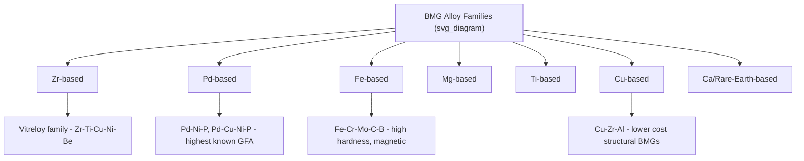

## Bulk Metallic Glasses

### Definition and Distinction from Conventional Metallic Glasses

Bulk metallic glasses (BMGs) are amorphous alloys capable of forming a fully glassy structure at relatively low cooling rates (typically < 10³ K/s, often as low as 1–100 K/s), enabling castable section thicknesses ranging from millimeters to several centimeters — as opposed to conventional metallic glasses, which require cooling rates of 10⁵–10⁶ K/s and are consequently limited to thin ribbons, wires, or powders (typically <100 μm thick).

This distinction is fundamentally one of **glass-forming ability (GFA)**: BMG-forming compositions possess intrinsically sluggish crystallization kinetics, allowing the melt to bypass the crystallization nose of the TTT diagram even under comparatively slow cooling.

**Key Points**

- The term "bulk" refers to the achievable casting dimension, not a distinct atomic structure — BMGs and ribbon-form metallic glasses share the same fundamentally amorphous, short/medium-range-ordered structure
- BMG development transformed metallic glasses from a laboratory curiosity into engineering-viable structural materials

### Historical Development

- **1960**: Duwez et al. produced the first metallic glass (Au-Si) via splat quenching, requiring cooling rates of ~10⁶ K/s
- **1970s–1980s**: Development of Pd-based BMGs (e.g., Pd-Ni-P) by Turnbull and coworkers using fluxing techniques (B₂O₃ flux to remove heterogeneous nucleation sites), achieving critical casting diameters of several millimeters to over 1 cm
- **1990s**: Inoue and coworkers (Tohoku University) and Johnson and coworkers (Caltech) developed multicomponent Zr-, La-, and Mg-based BMG systems, including the influential Zr-Ti-Cu-Ni-Be family (Vitreloy alloys), with critical casting thicknesses of several centimeters using simple copper-mold casting
- **2000s–present**: Expansion to Fe-, Ti-, Ca-, Pt-, Au-, and high-entropy-alloy-adjacent BMG systems, along with commercialization in niche structural and functional applications

### Thermodynamic and Kinetic Basis for High Glass-Forming Ability

**Empirical Design Rules (Inoue's Three Rules)**

1. Multicomponent systems with at least three constituent elements
2. Significant atomic size mismatch among the three main constituent elements (generally >12%)
3. Negative heats of mixing among the three main constituent elements

These conditions collectively increase the complexity of the local atomic packing required for crystallization, raise the liquid viscosity near $T_g$, and increase the thermodynamic and kinetic barriers to nucleation.

**Reduced Glass Transition Temperature**

$$T_{rg} = \frac{T_g}{T_l}$$

BMG-forming alloys typically exhibit $T_{rg} > 0.6$, correlating with dramatically reduced critical cooling rates relative to poor glass formers ($T_{rg} < 0.5$).

**Supercooled Liquid Region Width**

$$\Delta T_x = T_x - T_g$$

A wide $\Delta T_x$ (often 60–130 K in good BMG formers, versus a few Kelvin or none in marginal glass formers) indicates strong resistance of the supercooled liquid to crystallization and provides a practical processing window for thermoplastic forming.

**Critical Cooling Rate and Critical Casting Thickness**

The two metrics are related but not strictly equivalent, since actual casting thickness also depends on mold thermal conductivity, alloy thermal conductivity, and heat transfer geometry:

$$R_c \propto \frac{1}{d_c^2}$$

as an approximate scaling relationship, where $d_c$ is critical casting diameter/thickness — reflecting that heat extraction rate through a given section scales inversely with the square of thickness. [Inference — exact exponent and proportionality vary by alloy system and casting geometry; this is a simplified scaling approximation, not a universal law]

### Major BMG Alloy Families

| System | Representative Alloy | Notable Characteristics |
| --- | --- | --- |
| Zr-based | Zr₄₁.₂Ti₁₃.₈Cu₁₂.₅Ni₁₀Be₂₂.₅ (Vitreloy 1) | High GFA, good toughness, widely studied |
| Pd-based | Pd₄₀Ni₄₀P₂₀, Pd₄₃Cu₂₇Ni₁₀P₂₀ | Highest reported critical casting thickness (>70 mm reported for optimized compositions) |
| Fe-based | Fe-Cr-Mo-C-B-(Y) systems | High hardness (>1000 HV), soft/hard magnetic behavior depending on composition, lower cost |
| Cu-based | Cu-Zr-Al, Cu-Hf-Al | Lower cost than Zr/Pd systems, moderate GFA and strength |
| Mg-based | Mg-Cu-Y, Mg-Ni-Nd | Low density, attractive specific strength |
| Ti-based | Ti-Zr-Cu-Ni-Sn | Biocompatibility interest, moderate GFA |
| Au-based | Au-Cu-Si, Au-Ag-Pd-Cu-Si | Low $T_g$, used in precision/jewelry applications |

[Unverified] Specific critical casting thickness and property values vary considerably across literature reports depending on processing route, purity, and measurement methodology; figures above should be treated as representative ranges.

### Processing Methods

**Copper Mold Casting**

The dominant laboratory and small-scale production method. Molten alloy (prepared by arc-melting or induction melting under inert atmosphere/vacuum) is injected or suction-cast into a water-cooled copper mold, exploiting the high thermal conductivity of copper to achieve the necessary cooling rate within the casting geometry.

**Fluxing (B₂O₃ treatment)**

Used particularly for Pd- and Pt-based systems to remove heterogeneous nucleation sites (oxide inclusions), dramatically increasing achievable casting thickness by suppressing heterogeneous nucleation — historically responsible for pushing Pd-Ni-P critical casting thickness from millimeters to several centimeters.

**Thermoplastic Forming (TPF)**

Exploiting the supercooled liquid region ($T_g < T < T_x$), BMGs can be reheated into a viscous, formable state and shaped using techniques analogous to oxide glass processing — blow molding, injection molding, embossing/imprinting — enabling net-shape or near-net-shape manufacture of complex geometries, including micro/nano-scale features, without the crystallization risk associated with casting from the liquidus.

**Other Routes**

- **Suction/injection casting**: Common lab-scale technique for rod and plate samples
- **Spark plasma sintering of amorphous powders**: Consolidation of gas-atomized amorphous powder while limiting crystallization
- **Additive manufacturing (laser powder bed fusion)**: Emerging route for BMG component fabrication, though rapid re-heating during layer deposition risks partial crystallization in previously deposited layers [Inference — an active research area with process-dependent outcomes rather than a fully mature production method]

### Mechanical Properties

| Property | Typical BMG Range |
| --- | --- |
| Yield/fracture strength (compression) | 1.5–2.5 GPa (Zr-based); up to ~4 GPa (some Fe-based) |
| Elastic strain limit | ~1.8–2.2% |
| Young's modulus | 80–110 GPa (Zr-based, lower than steel) |
| Hardness | 400–500 HV (Zr-based) to >1000 HV (Fe-based) |
| Tensile ductility | Near-zero at room temperature |
| Fracture toughness | Highly variable: ~20–30 MPa·√m (some Fe-based, more brittle) up to >100 MPa·√m (tough Zr-Ti-based systems, comparable to some tool steels) |

**Deformation and Fracture**

Room-temperature plasticity, when present, occurs via highly localized shear bands rather than distributed dislocation slip, since BMGs lack a crystal lattice capable of supporting dislocation-based deformation. This produces:

- Limited strain-hardening capacity, promoting catastrophic shear failure once a dominant shear band forms
- Characteristic vein-pattern fracture surface morphology from local viscous flow and adiabatic heating within the shear band
- Fracture angle in uniaxial compression typically close to 42°, deviating from the 45° predicted by simple Tresca/von Mises shear criteria, attributed to normal-stress sensitivity of shear band formation (Mohr-Coulomb-type behavior)

**BMG Matrix Composites**

To overcome the intrinsic brittleness limitation, in-situ or ex-situ composite BMGs incorporate a crystalline ductile phase (e.g., dendritic β-Zr-Ti-Nb phase) within the glassy matrix. This second phase acts to nucleate multiple shear bands and arrest their propagation, substantially improving tensile ductility and toughness relative to monolithic BMGs, at some cost to yield strength.

### Thermal Stability and Crystallization

Upon reheating above $T_x$, BMGs crystallize, typically through a sequence of one or more metastable/intermediate phases before reaching the final equilibrium crystalline phase assemblage. Crystallization is generally undesirable for structural BMG applications (loss of the amorphous-associated strength/elasticity advantage) but is deliberately exploited in some functional applications (e.g., partial nanocrystallization to tailor magnetic properties in Fe-based systems, producing nanocrystalline soft magnetic alloys such as FINEMET-type materials).

### Functional Properties

- **Soft/hard magnetic behavior**: Fe- and Co-based BMGs can be engineered for either soft magnetic applications (low coercivity, low core loss) or, in some compositions, higher coercivity depending on composition and any induced nanocrystallization
- **Corrosion resistance**: Chemical homogeneity and absence of grain boundaries generally confer superior corrosion resistance relative to crystalline counterparts, particularly in Fe-Cr- and Ni-Cr-based BMG systems
- **Catalytic activity**: Some BMG surfaces (particularly after selective etching to create nanoporous structures) show promise as catalytic substrates [Speculation — this remains largely at the research stage rather than established industrial practice]

### Applications

- **Sporting goods**: Golf club heads, ski/snowboard edges, tennis racket frames (Zr-based BMGs, exploiting high elastic strain limit for energy return)
- **Precision structural components**: Gears, springs, and pressure sensor diaphragms exploiting high strength combined with large elastic limit
- **Consumer electronics**: Casings and structural components (historically explored, e.g., by major electronics manufacturers, for high-end device housings)
- **Medical devices**: Surgical instruments and investigated implant materials, leveraging corrosion resistance and high hardness, though biocompatibility of specific alloying elements (Ni, Be, Cu) requires case-by-case evaluation
- **Micro-electromechanical systems (MEMS)**: Thermoplastic forming enables replication of micro/nano-scale features with high fidelity
- **Coatings**: Amorphous alloy coatings via thermal spray, laser cladding, or sputtering for wear- and corrosion-resistant surface layers on conventional crystalline substrates

### Characterization Techniques

- **DSC/DTA**: Determines $T_g$, $T_x$, $T_l$, and $\Delta T_x$; primary tool for GFA assessment and process window definition
- **XRD**: Confirms full amorphicity (broad halo, no sharp peaks) versus partial crystallization
- **TEM**: Resolves nanoscale structural features, medium-range order, and any embedded crystalline phases in composite BMGs
- **Nanoindentation**: Local hardness and elastic modulus measurement, and study of shear-band-mediated pop-in events during loading

### Limitations and Ongoing Challenges

**Key Points**

- Size limitation: even the best BMG formers rarely exceed several centimeters in critical casting thickness, restricting use in large structural components
- Cost: many high-GFA systems rely on relatively expensive or exotic elements (Pd, Be, rare earths), limiting widespread structural adoption
- Room-temperature brittleness in tension remains a persistent design constraint, generally requiring compressive- or composite-based design approaches
- Toxicity/processing hazards: beryllium (used in Vitreloy-family alloys for its strong glass-forming contribution) requires stringent handling precautions during melting and machining

**Next Steps**

- Metallic glass ribbon processing and soft magnetic applications
- Shear band mechanics and BMG composite toughening strategies
- Thermoplastic forming process design and micro-replication
- Glass-forming ability prediction models and alloy design
- High-entropy alloys as an adjacent compositional design strategy
- Additive manufacturing of amorphous and nanocrystalline alloys