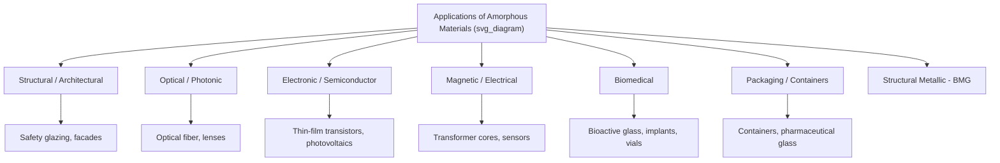

## Applications of Glasses and Amorphous Solids

### Overview

Glasses and amorphous solids span an exceptionally broad application space, spanning oxide glasses, metallic glasses, amorphous semiconductors, polymers, and chalcogenide glasses. Their utility arises from properties unattainable or difficult to achieve in crystalline counterparts: isotropy, optical transparency, absence of grain boundaries, tailorable composition-dependent properties, and, in some cases, unique electronic or magnetic behavior arising directly from structural disorder.

### Structural and Architectural Applications

**Flat/Float Glass**

Soda-lime silicate glass, produced predominantly via the float process, remains the dominant material for architectural glazing, automotive windows, and furniture. Strengthening treatments (thermal tempering, chemical strengthening, lamination) extend its use into structural and safety-critical applications:

- **Tempered glass**: Automotive side/rear windows, shower enclosures, structural balustrades
- **Laminated glass**: Windshields, blast- and hurricane-resistant glazing, structural glass floors and stairs, bullet-resistant glazing
- **Low-emissivity (low-E) coated glass**: Thin metallic/metal-oxide coatings (e.g., silver-based multilayer stacks) reduce radiative heat transfer, improving building energy efficiency
- **Self-cleaning glass**: Photocatalytic TiO₂ coatings that decompose organic contaminants under UV exposure combined with hydrophilic sheeting action

**Fiberglass and Glass-Reinforced Composites**

E-glass and S-glass fibers, drawn from molten borosilicate/aluminosilicate compositions, serve as reinforcement in fiber-reinforced polymer (FRP) composites for construction, marine, automotive, and wind turbine blade applications, exploiting high tensile strength-to-weight ratio.

### Optical and Photonic Applications

**Optical Fiber**

High-purity silica glass (doped with germanium or fluorine to tailor refractive index profile) forms the core technology of modern telecommunications, exploiting extremely low optical attenuation (as low as ~0.2 dB/km at 1550 nm in state-of-the-art silica fiber) achievable due to the homogeneous, defect-minimized amorphous structure.

**Lenses and Precision Optics**

Optical-grade glasses (crown, flint, and specialty compositions with tailored refractive index and dispersion) are used in imaging systems, cameras, telescopes, and ophthalmic lenses. Amorphous structure ensures optical isotropy, avoiding the birefringence associated with crystalline anisotropy.

**Chalcogenide Glasses**

Amorphous alloys of chalcogen elements (S, Se, Te) combined with elements such as As, Ge, or Sb, transparent in the infrared spectral region where silica is opaque, used in infrared optics, thermal imaging lenses, and mid-IR fiber optics.

**Phase-Change Memory and Rewritable Optical Media**

Chalcogenide materials (e.g., Ge-Sb-Te, "GST" alloys) exploit a reversible, rapid transition between amorphous and crystalline states, with the two states exhibiting distinct optical reflectivity and electrical resistivity:

- **Optical storage**: CD-RW, DVD-RW, Blu-ray rewritable discs use focused laser pulses to locally switch material state, encoding data via reflectivity contrast
- **Phase-change memory (PCM/PRAM)**: Electrical (Joule heating) switching between amorphous (high resistance) and crystalline (low resistance) states for non-volatile electronic memory, valued for fast switching speed and scalability

### Electronic and Semiconductor Applications

**Amorphous Silicon (a-Si)**

Hydrogenated amorphous silicon (a-Si:H), deposited via plasma-enhanced chemical vapor deposition (PECVD), is used extensively in:

- **Thin-film transistors (TFTs)**: Backplane switching elements in liquid crystal display (LCD) panels
- **Thin-film photovoltaics**: Lower-cost, lower-efficiency solar cells compared to crystalline silicon, but enabling flexible/large-area deposition
- **Image sensors and photodiodes**: Exploiting tunable optical absorption via hydrogen content and deposition conditions

**Amorphous Oxide Semiconductors**

Materials such as indium gallium zinc oxide (IGZO) are used as TFT channel materials in high-resolution displays (OLED, high-refresh-rate LCD), offering higher electron mobility than a-Si:H TFTs while retaining the processing advantages (large-area, low-temperature deposition) of amorphous thin films.

**Insulating and Passivation Layers**

Amorphous SiO₂ and Si₃N₄ thin films, grown or deposited on crystalline silicon substrates, serve as gate dielectrics, passivation layers, and diffusion barriers throughout semiconductor device fabrication — their amorphous nature provides a defect-free, pinhole-free insulating layer without grain-boundary-mediated leakage paths.

### Magnetic and Electrical Applications

**Amorphous Magnetic Ribbons**

Fe-Si-B and related amorphous alloys, produced via melt spinning, are used extensively as:

- **Distribution transformer cores**: Exploiting very low coercivity and low core (hysteresis + eddy current) losses arising from the absence of magnetocrystalline anisotropy, yielding significant energy efficiency improvements over conventional grain-oriented silicon steel
- **Magnetic sensors and current transformers**: High permeability enabling sensitive detection

**Nanocrystalline Soft Magnetic Alloys**

Partial, controlled crystallization of amorphous Fe-Cu-Nb-Si-B ribbons (e.g., FINEMET-type alloys) produces a nanocrystalline structure with exceptional soft magnetic properties (very high permeability, low core loss), used in high-frequency transformers, common-mode chokes, and magnetic amplifiers.

### Biomedical Applications

**Bioactive Glass**

Silicate glasses with compositions designed to react with physiological fluid (e.g., Bioglass 45S5: SiO₂-CaO-Na₂O-P₂O₅) form a hydroxyapatite-like surface layer upon implantation, bonding directly to bone tissue — used in bone graft substitutes, dental applications, and scaffold materials for tissue engineering.

**Pharmaceutical and Laboratory Glassware**

Borosilicate glass (low thermal expansion, high chemical durability) is the standard for laboratory glassware, pharmaceutical vials, and ampoules, valued for resistance to thermal shock and chemical leaching that could compromise drug stability.

**Metallic Glass Medical Devices**

BMG-based surgical instruments and investigated implant materials leverage high hardness, corrosion resistance, and, in some compositions, favorable biocompatibility, though element-specific toxicity (Ni, Be) requires careful alloy selection for implant applications. [Inference — clinical adoption remains more limited than laboratory/research interest suggests, given regulatory and long-term biocompatibility validation requirements]

### Packaging and Containers

Soda-lime-silica container glass remains widely used for food, beverage, and pharmaceutical packaging due to chemical inertness, impermeability to gases, recyclability, and the ability to be fire-polished to a flaw-minimized, high-strength surface finish during production.

### Structural Metallic Glass Applications

As detailed under bulk metallic glasses, structural applications exploit the high elastic strain limit, strength, and net-shape thermoplastic formability of BMGs:

- Sporting goods (golf clubs, ski edges)
- Precision springs, gears, and MEMS components
- High-end consumer electronics casings

### Amorphous Carbon and Related Materials

**Diamond-like carbon (DLC)** coatings — amorphous carbon films with a mixture of sp²/sp³ bonding — are used as wear-resistant, low-friction protective coatings on engine components, cutting tools, and biomedical implants, exploiting hardness and chemical inertness derived from the disordered but densely cross-linked bonding network.

### Comparative Summary Table

| Application Domain | Representative Amorphous Material | Key Exploited Property |
| --- | --- | --- |
| Architectural glazing | Soda-lime silicate (tempered/laminated) | Transparency, strengthened fracture resistance |
| Telecommunications | High-purity doped silica fiber | Ultra-low optical attenuation |
| Data storage | Ge-Sb-Te chalcogenide (GST) | Reversible amorphous/crystalline optical & electrical contrast |
| Display backplanes | a-Si:H, IGZO | Large-area, low-temperature semiconducting thin films |
| Transformer cores | Fe-Si-B amorphous ribbon | Absence of magnetocrystalline anisotropy (low core loss) |
| Bone grafts/implants | Bioactive silicate glass | Surface bioactivity, hydroxyapatite formation |
| Pharmaceutical packaging | Borosilicate glass | Chemical durability, thermal shock resistance |
| Sporting goods/precision parts | Zr-based BMG | High elastic strain limit, net-shape formability |
| Wear-resistant coatings | Diamond-like carbon | High hardness, low friction, chemical inertness |

**Key Points**

- The unifying theme across applications is that amorphous structure removes specific crystalline features (grain boundaries, magnetocrystalline anisotropy, optical birefringence, dislocation-mediated slip) that are disadvantageous for certain functions, while simultaneously enabling composition-tunable, often metastable property combinations not easily accessible in equilibrium crystalline phases
- Many amorphous material applications rely on non-equilibrium processing (rapid quenching, vapor deposition, ion implantation) to kinetically trap the disordered state, meaning processing-property relationships are often as critical as composition in determining final performance

**Next Steps**

- Optical fiber manufacturing and attenuation mechanisms
- Phase-change memory device physics and switching kinetics
- Amorphous silicon photovoltaic device architecture
- Bioactive glass compositional design and bone-bonding mechanisms
- Soft magnetic material core-loss engineering
- Diamond-like carbon deposition techniques (PVD, PECVD)