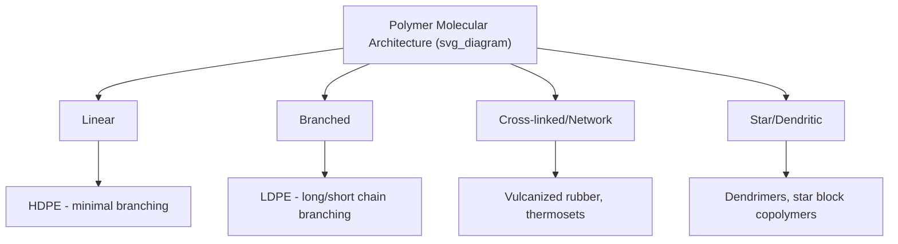
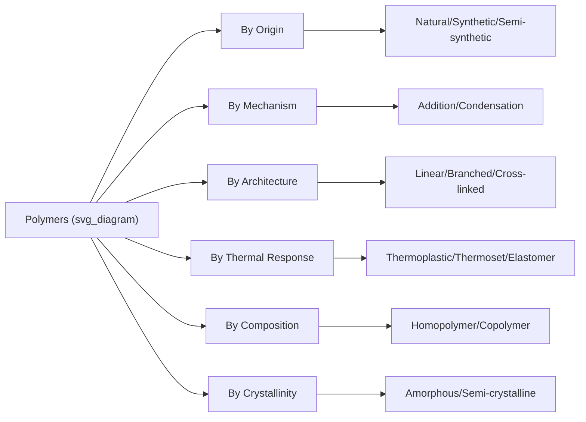

## Polymer Structure and Classification

### Fundamental Concepts

A polymer is a large molecule (macromolecule) composed of repeating structural units called **monomers**, connected via covalent bonds through a process of polymerization. The degree of polymerization ($DP$ or $n$) denotes the number of repeat units in a chain, and the molecular weight of the polymer is directly related to it:

$$M = n \times M_0$$

where $M$ is the total molecular weight, $n$ is the degree of polymerization, and $M_0$ is the molecular weight of the repeat unit.

**Key Points**

- Because polymerization is a statistical process, real polymer samples exhibit a distribution of chain lengths rather than a single molecular weight — described using number-average ($M_n$) and weight-average ($M_w$) molecular weight, with the ratio $M_w/M_n$ termed the **polydispersity index (PDI)**, a measure of molecular weight distribution breadth
- Polymers are classified along several independent axes: origin, chemical structure, polymerization mechanism, molecular architecture, and thermal/mechanical response — a single polymer is typically described using several of these classification schemes simultaneously

### Classification by Origin

| Category | Description | Examples |
| --- | --- | --- |
| Natural polymers | Occur in nature, produced by biological processes | Cellulose, natural rubber, silk, DNA, proteins |
| Synthetic polymers | Man-made via chemical polymerization | Polyethylene, nylon, polystyrene, epoxy |
| Semi-synthetic polymers | Chemically modified natural polymers | Cellulose acetate, vulcanized rubber |

### Classification by Polymerization Mechanism

**Addition (Chain-Growth) Polymerization**

Monomers, typically containing a reactive double bond (vinyl monomers), add sequentially to a growing active chain end (free radical, cationic, or anionic) without loss of any byproduct. The repeat unit has the same molecular formula as the monomer.

$$n\,\text{CH}_2=\text{CH}_2 \rightarrow \text{–(CH}_2\text{–CH}_2\text{)}_n\text{–}$$

Mechanism stages: **initiation** (generation of a reactive species), **propagation** (rapid sequential monomer addition), and **termination** (combination, disproportionation, or chain transfer).

**Condensation (Step-Growth) Polymerization**

Monomers, typically bifunctional (containing two reactive end groups), react stepwise, often with elimination of a small-molecule byproduct (water, HCl, methanol). Any two species present (monomer, dimer, oligomer) can react with each other.

$$n\,\text{HOOC–R–COOH} + n\,\text{HO–R'–OH} \rightarrow \text{–[OC–R–COO–R'–O]}_n\text{–} + (2n-1)\,\text{H}_2\text{O}$$

**Key Points**

- Chain-growth polymerization rapidly produces high-molecular-weight chains early in the reaction, with monomer concentration decreasing steadily throughout
- Step-growth polymerization requires very high conversion (often >99%) before significant molecular weight is achieved, following the Carothers equation:

$$\overline{DP} = \frac{1}{1-p}$$

where $p$ is the fractional extent of reaction — illustrating why step-growth reactions must proceed nearly to completion to produce useful molecular weights (e.g., at $p = 0.99$, $\overline{DP} = 100$; at $p = 0.999$, $\overline{DP} = 1000$).

### Classification by Molecular Architecture

- **Linear polymers**: Monomer units connected in a single continuous chain, with no branch points; e.g., high-density polyethylene (HDPE), which achieves relatively efficient chain packing and higher crystallinity due to minimal branching
- **Branched polymers**: Side chains extend from the main backbone; branching disrupts chain packing, generally reducing crystallinity and density relative to the linear analog; e.g., low-density polyethylene (LDPE)
- **Cross-linked (network) polymers**: Chains connected by covalent bonds at multiple points, forming a three-dimensional network; degree of cross-linking governs rigidity, solvent resistance, and thermal behavior; e.g., vulcanized rubber, epoxy thermosets
- **Star, comb, and dendritic architectures**: More complex, controlled branching topologies achieved via specialized synthesis (living polymerization, dendrimer synthesis), used to tailor rheological and solution properties

### Classification by Thermal/Mechanical Response

| Category | Behavior | Structural Basis | Examples |
| --- | --- | --- | --- |
| Thermoplastics | Soften/melt reversibly on heating; can be reprocessed | Linear or branched chains, held together by secondary (van der Waals, hydrogen) bonding | Polyethylene, polypropylene, PVC, nylon, PET |
| Thermosets | Undergo irreversible chemical cross-linking (curing); do not melt, degrade instead | Rigid 3D covalent network formed during processing | Epoxy, phenolic resins, unsaturated polyester, vulcanized rubber (partially) |
| Elastomers | Exhibit large, reversible elastic deformation | Lightly cross-linked networks with flexible chain segments above $T_g$ | Natural rubber, silicone rubber, polyurethane elastomers |

**Key Points**

- Thermoplastic behavior arises because chains are held together only by secondary bonds and/or chain entanglement, which are disrupted reversibly by thermal energy, allowing flow and reshaping
- Thermoset rigidity is permanent because the covalent cross-link network cannot be reversibly broken by heat alone; excessive heating causes chemical degradation rather than melting
- Elastomeric behavior requires: (1) flexible chain segments capable of large conformational change, (2) service temperature above the glass transition temperature $T_g$, and (3) a sparse cross-link network to prevent permanent (viscous) flow while permitting large reversible elastic strain

### Classification by Monomer Composition

**Homopolymers**

Composed of a single repeating monomer unit: –A–A–A–A–A–A–

**Copolymers**

Composed of two or more distinct monomer units, classified by sequence arrangement:

| Copolymer Type | Sequence Pattern | Example |
| --- | --- | --- |
| Random | –A–B–A–A–B–B–A– | Styrene-butadiene rubber (SBR) |
| Alternating | –A–B–A–B–A–B– | Styrene-maleic anhydride |
| Block | –A–A–A–A–B–B–B–B– | Styrene-butadiene-styrene (SBS) thermoplastic elastomer |
| Graft | Backbone of A with branches of B | High-impact polystyrene (HIPS) |

### Classification by Physical/Morphological State

**Crystallinity**

Polymers rarely achieve 100% crystallinity due to the difficulty of long-chain molecules achieving perfect, extended packing; real semi-crystalline polymers consist of ordered crystalline regions (often organized as lamellae within spherulites) embedded in an amorphous matrix.

$$\% \text{Crystallinity} = \frac{\rho_c(\rho - \rho_a)}{\rho(\rho_c - \rho_a)} \times 100$$

where $\rho$ is the measured density of the sample, and $\rho_c$, $\rho_a$ are the densities of fully crystalline and fully amorphous phases, respectively.

- **Amorphous polymers**: No long-range molecular order (e.g., atactic polystyrene, PMMA); typically transparent
- **Semi-crystalline polymers**: Coexisting crystalline and amorphous regions (e.g., HDPE, PET, nylon); typically translucent/opaque due to light scattering at crystalline-amorphous interfaces, exhibit both $T_g$ (amorphous regions) and $T_m$ (crystalline regions)

### Tacticity (Stereoregularity)

For vinyl polymers with a pendant substituent group (R) on alternating backbone carbons, the spatial arrangement of these groups relative to the chain backbone significantly affects crystallizability:

- **Isotactic**: All substituent groups on the same side of the chain — regular structure promotes crystallization
- **Syndiotactic**: Substituent groups alternate regularly on opposite sides — also regular, can crystallize
- **Atactic**: Substituent groups randomly arranged — irregular structure prevents efficient chain packing, typically remains amorphous

**Example**

Polypropylene illustrates the practical significance of tacticity: isotactic polypropylene (produced using stereospecific Ziegler-Natta or metallocene catalysts) is a semi-crystalline, mechanically robust engineering thermoplastic, while atactic polypropylene is an amorphous, tacky, low-strength material with limited commercial structural use — the same monomer and chemical composition yielding drastically different bulk properties based solely on stereochemical arrangement.

### Key Transition Temperatures

- **Glass transition temperature ($T_g$)**: The temperature at which amorphous regions transition between a rigid, glassy state and a flexible, rubbery state, associated with the onset of segmental chain mobility; determined via DSC (as a step change in heat capacity) or dynamic mechanical analysis (DMA)
- **Melting temperature ($T_m$)**: The temperature at which crystalline regions melt, applicable only to semi-crystalline polymers, observed as an endothermic peak in DSC

$$T_g \text{ typically} \approx \tfrac{2}{3} T_m \text{ (both in absolute temperature, K)}$$

as a common empirical approximation relating the two transitions in semi-crystalline polymers. [Inference — this ratio is an empirical rule of thumb with documented exceptions rather than a strict thermodynamic law]

### Summary Classification Diagram

**Next Steps**

- Polymerization kinetics (free radical, step-growth, living/controlled polymerization)
- Molecular weight determination techniques (GPC/SEC, viscometry, light scattering)
- Glass transition and free volume theory
- Polymer crystallization mechanisms and spherulite formation
- Structure-property relationships in thermoplastics and elastomers
- Polymer processing methods (extrusion, injection molding, compression molding)