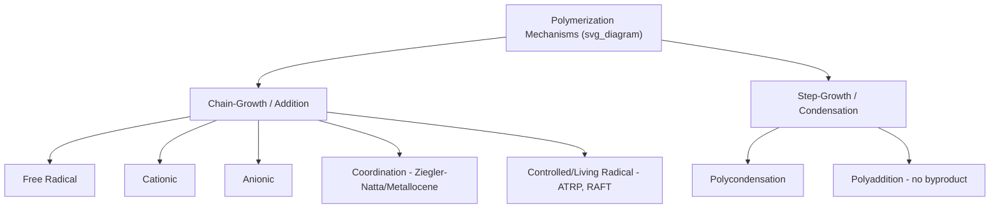

## Polymerization Mechanisms

### Overview

Polymerization is the chemical process by which monomer molecules react to form macromolecular chains. Mechanisms are broadly classified according to the kinetic pathway of chain formation — **chain-growth (addition) polymerization** and **step-growth (condensation) polymerization** — each with distinct kinetics, molecular weight development profiles, and practical process implications. Within chain-growth polymerization, several distinct initiation chemistries exist (free radical, ionic, coordination), each offering different degrees of control over molecular architecture.

### Chain-Growth (Addition) Polymerization: General Kinetics

Chain-growth polymerization proceeds through three kinetically distinct stages:

**1. Initiation**

Generation of a reactive species (radical, cation, or anion) that adds to the first monomer unit.

$$I \xrightarrow{k_d} 2R^{\bullet} \qquad R^{\bullet} + M \xrightarrow{k_i} RM^{\bullet}$$

**2. Propagation**

Rapid, sequential addition of monomer units to the growing active chain end.

$$RM_n^{\bullet} + M \xrightarrow{k_p} RM_{n+1}^{\bullet}$$

**3. Termination**

The active chain end is deactivated, ending chain growth. In free-radical systems, this occurs via:

- **Combination**: two radical chain ends couple to form a single, longer dead chain
- **Disproportionation**: hydrogen transfer between two radical chain ends, producing two dead chains (one saturated, one with a terminal double bond)

$$RM_n^{\bullet} + RM_m^{\bullet} \xrightarrow{k_t} \text{dead polymer}$$

**Key Points**

- Chain-growth polymerization produces high-molecular-weight polymer essentially from the start of the reaction; monomer conversion increases over time, but the molecular weight of already-formed chains does not increase much further
- Reaction rate typically shows a characteristic dependence on initiator concentration to the $\tfrac{1}{2}$ power (for radical systems), reflecting the bimolecular nature of the termination step:

$$R_p = k_p[M]\left(\frac{k_i[I]}{k_t}\right)^{1/2}$$

### Free Radical Polymerization

The most industrially widespread chain-growth mechanism, applicable to a broad range of vinyl monomers (ethylene, styrene, vinyl acetate, acrylates, vinyl chloride) due to relative tolerance of radical species to trace impurities, water, and a wide range of functional groups.

**Initiators**

- Thermal decomposition initiators: peroxides (benzoyl peroxide), azo compounds (AIBN)
- Redox initiator systems: for lower-temperature initiation
- Photoinitiation: UV-triggered radical generation, used in coatings and dental resin curing

**Chain Transfer**

A key kinetic complication in free radical systems: the growing radical chain can abstract an atom (commonly hydrogen) from another molecule (solvent, monomer, or a deliberately added chain transfer agent), terminating the original chain while generating a new radical capable of initiating a new chain. This reduces molecular weight without proportionally reducing the overall polymerization rate, and is deliberately exploited industrially to control molecular weight (e.g., using thiols as chain transfer agents in emulsion polymerization).

**Key Points**

- Free radical polymerization typically produces polymers with broad molecular weight distributions (higher PDI) due to the statistical nature of initiation, propagation, chain transfer, and termination occurring simultaneously and competitively throughout the reaction
- Branching (via chain transfer to polymer, i.e., intramolecular or intermolecular hydrogen abstraction from an already-formed chain) is common in free radical polymerization, particularly under high-pressure/high-temperature conditions, as in the industrial production of LDPE

### Ionic Polymerization

**Cationic Polymerization**

Initiated by a cationic species (e.g., via a Lewis acid such as BF₃ or AlCl₃ combined with a proton source or cationogen), proceeding through a carbocation intermediate. Favored by monomers with electron-donating substituents that stabilize the carbocation (e.g., isobutylene, vinyl ethers). Highly sensitive to trace moisture and nucleophilic impurities, requiring rigorously anhydrous conditions; typically conducted at low temperatures to suppress chain transfer and side reactions.

**Anionic Polymerization**

Initiated by a nucleophilic/anionic species (e.g., alkyllithium compounds such as n-butyllithium), proceeding through a carbanion intermediate. Favored by monomers with electron-withdrawing substituents that stabilize the carbanion (e.g., styrene, dienes, methacrylates).

**"Living" Anionic Polymerization**

Under carefully controlled conditions (absence of chain transfer or termination reactions), anionic polymerization can proceed as a **living polymerization** — chain ends remain reactive indefinitely after monomer is consumed, enabling:

- Very narrow molecular weight distributions (PDI often < 1.1)
- Precise control of molecular weight via the monomer-to-initiator ratio
- Synthesis of well-defined block copolymers by sequential monomer addition (e.g., styrene-butadiene-styrene, SBS thermoplastic elastomers)

$$\overline{DP} = \frac{[M]_0}{[I]_0}$$

for an ideal living polymerization at full conversion, where $[M]_0$ and $[I]_0$ are initial monomer and initiator concentrations.

### Coordination (Ziegler-Natta and Metallocene) Polymerization

Coordination polymerization employs transition-metal-based catalysts (classically titanium halides combined with aluminum alkyl cocatalysts — Ziegler-Natta catalysts; more recently, single-site metallocene catalysts) that coordinate the monomer at a metal center prior to insertion into the growing chain.

**Significance**

- Enables **stereospecific polymerization** — precise control over tacticity (isotactic, syndiotactic) unattainable via conventional free radical polymerization
- Responsible for industrial production of high-density polyethylene (HDPE) and isotactic polypropylene, both of which rely on the resulting regular, crystallizable chain structure for their characteristic mechanical properties
- Metallocene (single-site) catalysts offer narrower molecular weight distributions and more precise comonomer incorporation control compared to classical multi-site Ziegler-Natta catalysts, enabling tailored linear low-density polyethylene (LLDPE) grades

### Controlled/Living Radical Polymerization

Modern techniques combine the broad monomer tolerance and mild conditions of free radical polymerization with the molecular weight control characteristic of living ionic polymerization, by introducing a dynamic equilibrium between active (propagating) and dormant chain ends:

- **ATRP (Atom Transfer Radical Polymerization)**: Uses a transition-metal catalyst (commonly Cu-based) and an alkyl halide initiator to establish a reversible activation-deactivation equilibrium
- **RAFT (Reversible Addition-Fragmentation Chain Transfer)**: Uses a thiocarbonylthio chain transfer agent to mediate reversible chain transfer between active and dormant species
- **NMP (Nitroxide-Mediated Polymerization)**: Uses a stable nitroxide radical to reversibly cap the growing chain end

**Key Points**

- These techniques enable synthesis of complex, well-defined architectures (block, graft, star copolymers) with narrow PDI, using conventional radical-compatible monomers and, in many cases, less demanding purification requirements than classical living anionic polymerization
- [Inference — ATRP, RAFT, and NMP each have distinct advantages/limitations regarding monomer scope, catalyst residue removal, and functional group tolerance; selection is application-specific rather than universally interchangeable]

### Step-Growth (Condensation) Polymerization

In step-growth polymerization, any two molecular species bearing complementary reactive functional groups can react — monomer with monomer, monomer with oligomer, or oligomer with oligomer — meaning molecular weight builds gradually and only becomes substantial at very high conversion.

**Carothers Equation**

$$\overline{DP} = \frac{1}{1-p}$$

where $p$ is the fractional extent of reaction of functional groups. High molecular weight requires $p$ approaching unity (typically $p > 0.99$).

**Stoichiometric Imbalance**

For bifunctional monomer systems with a stoichiometric imbalance ($r < 1$), maximum achievable degree of polymerization is capped even at complete conversion of the limiting reagent:

$$\overline{DP} = \frac{1+r}{1-r}$$

where $r$ is the ratio of the limiting functional group to the excess functional group — illustrating the practical importance of precise stoichiometric control in industrial step-growth polymer production (e.g., nylon-6,6, PET).

**Polycondensation vs. Polyaddition**

- **Polycondensation**: Reaction releases a small-molecule byproduct (water, HCl, methanol) — e.g., polyester and polyamide (nylon) synthesis via esterification/amidation
- **Polyaddition**: Bifunctional monomers react without byproduct elimination — e.g., polyurethane formation from diisocyanates and diols

$$n\,\text{OCN–R–NCO} + n\,\text{HO–R'–OH} \rightarrow \text{–[OC(O)NH–R–NHC(O)O–R'–]}_n\text{–}$$

### Comparison: Chain-Growth vs. Step-Growth

| Characteristic | Chain-Growth | Step-Growth |
| --- | --- | --- |
| Molecular weight vs. conversion | High MW achieved early, at low conversion | High MW achieved only near complete conversion |
| Reaction rate over time | Monomer consumed steadily; reaction rate typically decreases as initiator/monomer deplete | Rate decreases as functional group concentration drops (second-order dependence typical) |
| Intermediate species | Monomer, growing chains, and dead polymer coexist; no isolable oligomer distribution mid-reaction in the same sense | Fully distributed mixture of oligomers of varying length present throughout |
| Typical PDI | Broad (free radical) to narrow (living/controlled) | Most probable (Flory) distribution, PDI approaching 2 at high conversion for simple linear step-growth systems |
| Byproduct | None (addition) | Often yes (condensation), though not universal (polyaddition) |
| Representative polymers | Polyethylene, polystyrene, PVC, PMMA | Nylon, polyester (PET), polycarbonate, polyurethane, epoxy |

### Emulsion, Suspension, and Solution Polymerization (Process Considerations)

Beyond the fundamental chemical mechanism, industrial free-radical polymerization is conducted in different physical process formats:

- **Bulk polymerization**: Monomer and initiator only, no diluent; simple but poor heat dissipation at high conversion (risk of thermal runaway, the Trommsdorff/gel effect)
- **Solution polymerization**: Monomer dissolved in solvent, improving heat transfer and viscosity control; requires subsequent solvent removal
- **Suspension polymerization**: Monomer droplets dispersed in a continuous aqueous phase via mechanical agitation and stabilizers, with initiator dissolved in the monomer phase; produces polymer beads (e.g., suspension PVC, expandable polystyrene)
- **Emulsion polymerization**: Monomer emulsified in water using surfactant (forming micelles), with water-soluble initiator; polymerization occurs within monomer-swollen micelles/polymer particles, enabling high molecular weight at high reaction rate with good heat dissipation, producing a polymer latex (e.g., SBR, many acrylic/vinyl acetate coatings and adhesives)

**Example**

Nylon-6,6 synthesis illustrates classical step-growth polycondensation: hexamethylenediamine and adipic acid react via amide bond formation with elimination of water, requiring precise 1:1 stoichiometry (often achieved via formation of a stoichiometric "nylon salt" intermediate) and conversion driven close to completion under vacuum or with continuous water removal to achieve commercially useful molecular weights, directly reflecting the Carothers equation's requirement for high $p$.

**Next Steps**

- Free radical polymerization kinetics and the gel (Trommsdorff) effect
- Living polymerization and block copolymer architecture design
- Ziegler-Natta and metallocene catalyst structure-activity relationships
- Flory-Schulz molecular weight distribution in step-growth systems
- Industrial polymerization process design (batch vs. continuous reactors)
- Copolymerization reactivity ratios and composition drift