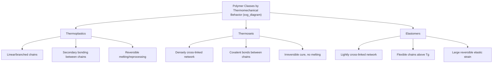

## Thermoplastics, Thermosets, and Elastomers

### Overview and Classification Basis

Thermoplastics, thermosets, and elastomers represent the three principal classes of polymeric materials, distinguished fundamentally by their molecular architecture and the nature of inter-chain bonding, which in turn governs their thermal and mechanical response.

**Key Points**

- The dominant distinguishing factor is the degree and nature of cross-linking: none/minimal (thermoplastics, held by secondary bonds and entanglement), sparse (elastomers), or extensive (thermosets)
- These classes are not always mutually exclusive in application — thermoplastic elastomers (TPEs) exploit physical (not chemical) cross-linking to achieve elastomeric behavior while retaining thermoplastic reprocessability

### Thermoplastics

**Structural Basis**

Thermoplastics consist of linear or branched polymer chains held together only by secondary (intermolecular) forces — van der Waals interactions, dipole-dipole forces, and hydrogen bonding — along with physical chain entanglement. No covalent bonds exist between separate chains.

**Thermal Behavior**

Because inter-chain forces are relatively weak and thermally reversible, thermoplastics soften and flow upon heating (above $T_g$ for amorphous thermoplastics, or above $T_m$ for the crystalline fraction of semi-crystalline thermoplastics) and re-solidify upon cooling. This cycle can, in principle, be repeated multiple times, enabling reprocessing and recycling — though repeated thermal cycling can cause cumulative chain scission or oxidative degradation, gradually degrading properties.

**Sub-classification**

- **Amorphous thermoplastics**: No long-range molecular order; transition directly from glassy to rubbery to viscous flow states as temperature increases through $T_g$; e.g., polystyrene, PMMA, polycarbonate
- **Semi-crystalline thermoplastics**: Contain both crystalline and amorphous regions; exhibit both $T_g$ (amorphous fraction) and a distinct melting point $T_m$ (crystalline fraction); e.g., HDPE, polypropylene, nylon, PET

**Mechanical Behavior**

$$E(T) \text{ decreases sharply near } T_g \text{ (amorphous) or } T_m \text{ (crystalline fraction)}$$

Below $T_g$, amorphous thermoplastics are glassy and relatively rigid/brittle; between $T_g$ and $T_m$ (for semi-crystalline grades), the material exhibits a leathery/rubbery plateau governed by the crystalline fraction acting as physical cross-link points; above $T_m$ or, for amorphous polymers, well above $T_g$, the material flows viscously.

**Representative Examples and Applications**

| Polymer | Type | Typical Applications |
| --- | --- | --- |
| Polyethylene (HDPE/LDPE) | Semi-crystalline | Packaging, containers, pipe |
| Polypropylene | Semi-crystalline | Automotive parts, living hinges, packaging |
| PVC | Amorphous (commonly plasticized) | Pipe, siding, flooring, cable insulation |
| Polystyrene | Amorphous | Packaging, disposable products, foam |
| Nylon (PA) | Semi-crystalline | Fibers, bearings, gears, automotive |
| PET | Semi-crystalline | Beverage bottles, textile fiber |
| Polycarbonate | Amorphous | Eyewear lenses, impact-resistant glazing |

### Thermosets

**Structural Basis**

Thermosets form a rigid, three-dimensional covalent network through a chemical **curing** (cross-linking) reaction, typically initiated by heat, a curing agent/hardener, catalyst, or UV radiation. Once cured, the network structure is permanent.

**Curing Process**

Prior to cure, thermoset resins exist as low-to-moderate molecular weight liquid or semi-solid precursors (monomers or prepolymers), which can be shaped/molded. The curing reaction proceeds through:

- **Gelation**: The point at which the network first spans the entire sample, marked by a sharp viscosity increase and loss of flowability
- **Vitrification**: Continued cross-linking after gelation drives the still-reacting network through its own rising $T_g$, eventually reaching a point where the network vitrifies (becomes glassy) and reaction kinetics become diffusion-limited, slowing further cure

**Thermal Behavior**

Because chain segments are covalently locked into a permanent network, thermosets **do not melt** upon reheating. Instead, sufficient thermal energy causes chemical bond scission and degradation (charring, decomposition) rather than viscous flow — a fundamental and irreversible distinction from thermoplastic behavior. This also means thermosets generally cannot be reprocessed or recycled via conventional remelting, an important end-of-life/sustainability consideration.

**Representative Examples and Applications**

| Thermoset | Chemistry | Typical Applications |
| --- | --- | --- |
| Epoxy | Epoxide + amine/anhydride curing agent | Adhesives, composite matrices, coatings, electronics encapsulation |
| Phenolic (Bakelite) | Phenol-formaldehyde | Electrical insulators, laminates, molded components |
| Unsaturated polyester | Styrene-cross-linked polyester | Fiberglass composites (boat hulls, automotive body panels) |
| Vulcanized rubber | Sulfur cross-linked diene rubber | Tires, seals, hoses (technically an elastomeric thermoset) |
| Polyurethane (rigid) | Isocyanate + polyol, high cross-link density | Rigid foam insulation, structural adhesives |

**Key Points**

- Cross-link density is the primary variable governing thermoset properties: higher cross-link density increases stiffness, $T_g$, and chemical/solvent resistance, but typically reduces toughness/impact resistance and increases brittleness
- Thermosets generally offer superior dimensional stability, creep resistance, and solvent/chemical resistance compared to thermoplastics, due to the permanent, solvent-swelling-resistant network structure

### Elastomers

**Structural Basis**

Elastomers are polymers capable of very large, predominantly reversible elastic deformation (commonly several hundred percent strain). This behavior requires a specific combination of structural features:

1. **Flexible chain segments**: Backbone structure permitting extensive conformational (rotational) freedom
2. **Service temperature above $T_g$**: Ensuring segmental chain mobility is active (i.e., the material is in the rubbery state, not the glassy state)
3. **Sparse cross-linking**: A light network of covalent (chemical elastomers) or physical (thermoplastic elastomers) cross-links, sufficient to prevent permanent viscous flow/creep under load while still permitting large reversible chain extension between cross-link points

**Rubber Elasticity Theory**

Unlike the energy-driven (enthalpic) elasticity of crystalline metals, rubber elasticity is predominantly **entropic** in origin — stretching extends coiled chain segments into a lower-entropy, more ordered conformation, and the restoring force arises from the thermodynamic drive to return to the higher-entropy coiled state:

$$\sigma = nRT\left(\lambda - \frac{1}{\lambda^2}\right)$$

where $\sigma$ is the true stress, $n$ is the number of network chains per unit volume (related to cross-link density), $R$ is the gas constant, $T$ is absolute temperature, and $\lambda$ is the extension ratio (stretched length/original length) — the affine network model of rubber elasticity.

**Key Points**

- Elastic modulus of a rubber network *increases* with temperature (in the entropic elastic regime), the opposite of typical crystalline solid behavior, directly reflecting the entropic origin of the restoring force
- Cross-link density critically governs elastomer performance: too little cross-linking permits excessive permanent (viscous) flow and poor recovery (set); too much cross-linking restricts chain extensibility, reducing elongation and shifting behavior toward a rigid thermoset

**Vulcanization**

The classical cross-linking process for diene-based rubbers (natural rubber, SBR, polybutadiene), using sulfur (with accelerators and activators such as zinc oxide) to form sulfur cross-links between chains at residual double-bond sites, converting a weak, tacky, viscous raw rubber into a useful elastic network material.

**Thermoplastic Elastomers (TPEs)**

A distinct category achieving elastomeric behavior via **physical**, thermally reversible cross-links rather than covalent chemical cross-links, typically through phase-separated block copolymer architecture:

- **Styrenic block copolymers (SBS, SEBS)**: Hard polystyrene end-blocks (physically aggregating into glassy domains below their $T_g$) connected by a flexible, rubbery mid-block (polybutadiene or its hydrogenated form), with the glassy polystyrene domains acting as reversible physical cross-link points
- **Thermoplastic polyurethanes (TPU)**: Alternating hard and soft segments, with hard-segment crystallization/hydrogen bonding providing physical cross-linking

TPEs combine elastomeric mechanical behavior with thermoplastic reprocessability (meltable, recyclable), an increasingly important advantage over conventionally vulcanized (chemically cross-linked, non-reprocessable) rubbers.

**Representative Examples and Applications**

| Elastomer | Type | Typical Applications |
| --- | --- | --- |
| Natural rubber (NR) | Chemically cross-linked (vulcanized) | Tires, engine mounts, seals |
| Styrene-butadiene rubber (SBR) | Chemically cross-linked | Tire tread, general-purpose rubber goods |
| Silicone rubber | Chemically cross-linked | High/low-temperature seals, medical devices |
| SBS/SEBS (TPE) | Physically cross-linked (block copolymer) | Soft-touch grips, footwear, adhesives |
| TPU | Physically cross-linked | Cable jacketing, flexible tubing, athletic footwear |

### Comparative Summary

| Characteristic | Thermoplastic | Thermoset | Elastomer |
| --- | --- | --- | --- |
| Cross-linking | None (physical entanglement only) | Extensive (covalent network) | Sparse (chemical or physical) |
| Behavior on heating | Softens/melts reversibly | Chars/degrades, does not melt | Softens above $T_g$; chemically cross-linked types do not melt |
| Reprocessability | Generally reprocessable | Generally not reprocessable | Chemically cross-linked: no; TPE: yes |
| Elastic strain capability | Low to moderate | Low (rigid, brittle) | Very high (hundreds of percent) |
| Typical modulus | Moderate to high (glassy/semi-crystalline) | High (rigid network) | Very low (rubbery plateau) |
| Solvent/chemical resistance | Variable, often lower (can swell/dissolve) | Generally high (network resists swelling) | Variable; can swell significantly in compatible solvents |

**Example**

Polyurethane exemplifies how a single chemical family spans all three categories depending on formulation: linear, lightly branched segmented polyurethanes with physically associating hard segments behave as thermoplastic elastomers (TPU); highly cross-linked rigid polyurethane forms a thermoset rigid foam; and appropriately formulated flexible, lightly chemically cross-linked polyurethane foam behaves as a conventional (non-thermoplastic) elastomeric material — illustrating that classification depends on network architecture and chemistry, not solely on the base monomer chemistry.

**Next Steps**

- Cross-link density measurement and its relationship to mechanical properties (swelling, rheometry)
- Rubber elasticity theory and network models (affine vs. phantom network)
- Thermoset cure kinetics and gelation/vitrification (TTT cure diagrams)
- Thermoplastic elastomer block copolymer morphology and microphase separation
- Vulcanization chemistry and accelerator systems
- Recycling and sustainability considerations across polymer classes